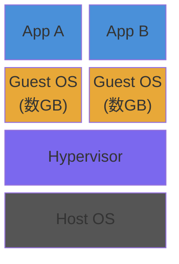
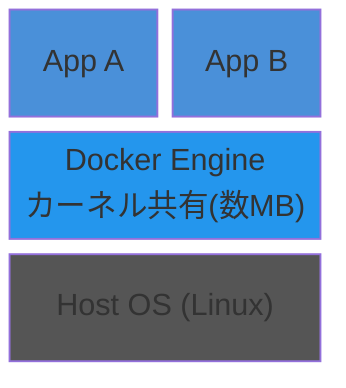

# Docker

> **一言で言うと:** 「環境の差異」という問題をプロセスの隔離で解決する技術 — Linuxカーネルの namespace と cgroup を活用して、アプリケーションとその依存関係を丸ごとパッケージ化し、どこでも同じように動く実行環境を提供する。

## なぜ必要か

ソフトウェアは「コード」だけでは動かない。OSのバージョン、言語のランタイム、ライブラリのバージョン、設定ファイル、環境変数 — これらが全て揃って初めて動作する。

Dockerがなかった時代の問題：
- **「自分の環境では動く」問題** — 開発者のローカルでは動くが、ステージングや本番では動かない。依存ライブラリのバージョン差異、OSの違い、パスの違いなどが原因
- **環境構築に時間がかかる** — 新しいチームメンバーの開発環境セットアップに数日かかることも珍しくない。手順書は常に陳腐化する（Dockerの他にも[[DockerとNix-Flakeによる開発環境管理|Nix Flake]]で宣言的に環境を定義するアプローチがある）
- **複数プロジェクトの共存が困難** — プロジェクトAはNode.js 18、プロジェクトBはNode.js 20を要求する。グローバルインストールでは共存できない
- **本番環境の再現ができない** — バグの再現に「本番と同じ環境」が必要だが、構築が困難
- **デプロイの手順が属人化する** — 手動で依存関係をインストールし、設定を変更し...という手順がドキュメント化しきれない

## どの問題を解決するか

### 1. 環境の一貫性 — イメージによるパッケージ化

**課題:** アプリケーションの動作環境を「コードと一緒に」バージョン管理したい。

**解決:** [[Dockerイメージ]]（Image）は、OS・ランタイム・ライブラリ・アプリコード・設定の全てを1つのパッケージにまとめる。`Dockerfile` というテキストファイルで宣言的に定義するため、バージョン管理できる。

```dockerfile
# Dockerfileの例：Node.jsアプリケーション
FROM node:20-slim

WORKDIR /app
COPY package*.json ./
RUN npm ci --omit=dev
COPY . .

EXPOSE 3000
CMD ["node", "server.js"]
```

このファイルさえあれば、どのマシンでも `docker build` → `docker run` で同一の環境が再現される。

### 2. プロセスの隔離 — コンテナの本質

**課題:** 複数のアプリケーションを同一ホスト上で干渉なく動かしたい。仮想マシン（VM）は重すぎる。

**解決:** コンテナはLinuxカーネルの機能を使って[[プロセスとスレッド|プロセス]]を隔離する：
- **namespace** — プロセスID、ネットワーク、ファイルシステム、ユーザーIDなどを分離。コンテナ内のプロセスからは自分だけの世界に見える
- **cgroup（Control Groups）** — CPU・メモリ・I/Oなどのリソース使用量を制限。1つのコンテナが暴走しても他に影響しない

VMとの決定的な違いは**カーネルの共有**。VMは各インスタンスが独自のOSカーネルを持つが、コンテナはホストのカーネルを共有する。そのため起動が秒単位で速く、オーバーヘッドも小さい。

#### VM方式



#### コンテナ方式



### 3. レイヤー構造 — 効率的なストレージとビルド

**課題:** 似たような環境のイメージを何個も作ると、ストレージが無駄になる。ビルドも毎回全てやり直すと遅い。

**解決:** Dockerイメージはレイヤー（Layer）の積み重ねで構成される。`Dockerfile` の各命令（`FROM`, `RUN`, `COPY` など）が1つのレイヤーを生成し、変更がないレイヤーはキャッシュから再利用される。

```dockerfile
FROM node:20-slim          # レイヤー1: ベースイメージ（共有可能）
COPY package*.json ./      # レイヤー2: 依存定義
RUN npm ci                 # レイヤー3: 依存インストール（package.jsonが変わらない限りキャッシュ）
COPY . .                   # レイヤー4: アプリコード（頻繁に変更）
```

**変更頻度の低いものを上に、高いものを下に**配置することで、ビルドキャッシュの効率が最大化される。

### 4. マルチコンテナ構成 — Docker Compose

**課題:** 実際のアプリケーションはWebサーバー + DB + キャッシュなど複数のサービスで構成される。これらの起動・接続・停止を一括管理したい。

**解決:** Docker Composeは複数コンテナの構成を `compose.yaml`（Compose V2 推奨。`docker-compose.yml` も後方互換で動作する）で宣言的に定義する。

```yaml
# docker-compose.yml
services:
  app:
    build: .
    ports:
      - "3000:3000"
    depends_on:
      - db
      - redis
    environment:
      DATABASE_URL: postgres://user:pass@db:5432/mydb

  db:
    image: postgres:16
    volumes:
      - db-data:/var/lib/postgresql/data
    environment:
      POSTGRES_PASSWORD: pass

  redis:
    image: redis:7-alpine

volumes:
  db-data:
```

`docker compose up` の1コマンドで全サービスが起動し、サービス名（`db`, `redis`）で自動的にDNS解決される。

## 他の仕組みとどう関係するか

- **下位レイヤーとの関係:**
  - [[プロセスとスレッド]] — コンテナの本質は「隔離されたプロセス」。namespace/cgroupはプロセス管理の拡張機能
  - [[ファイルシステムとIO]] — レイヤー構造はUnionFS（OverlayFS）というファイルシステム技術で実現される。コンテナ内の書き込みはCopy-on-Writeで処理される
  - [[メモリ管理]] — cgroupによるメモリ制限を超えるとOOM Killerがコンテナのプロセスを強制終了する
  - [[データ構造とアルゴリズム|Layer 0: CS基礎]] — イメージのコンテンツアドレッシング（SHA256ハッシュ）は[[ハッシュテーブル]]の応用

- **同レイヤーとの関係:**
  - [[Linux基本操作]] — Dockerの操作にはLinuxコマンドの知識が前提。コンテナ内のデバッグにも必須

- **上位レイヤーとの関係:**
  - [[Layer5-パフォーマンス/_index|Layer 5: パフォーマンス]] — コンテナのリソース制限設定がパフォーマンスに直結。オーバーヘッドは小さいが、ネットワークI/Oには若干の影響がある
  - [[Layer6-セキュリティ/_index|Layer 6: セキュリティ]] — コンテナはセキュリティ境界としては不完全。root権限での実行や特権モードは攻撃表面を広げる
  - [[Layer7-設計アーキテクチャ/_index|Layer 7: 設計・アーキテクチャ]] — CI/CDパイプラインの基盤。マイクロサービスアーキテクチャのデプロイ単位。本番運用では[[AWSコンテナサービスとDockerの実運用|ECS等のオーケストレーション]]が必要になり、その実行基盤（VPC、サブネット、ECSクラスター等）は[[IaCとクラウドインフラ管理|IaC]]で宣言的にプロビジョニングするのが標準

## 誤解されやすいポイント

1. **「コンテナ = 軽量VM」ではない** — VMはハードウェアを仮想化し各インスタンスが独自のカーネルを持つ。コンテナはカーネルを共有し、namespace/cgroupでプロセスを隔離しているだけ。この違いは、セキュリティ特性（コンテナはカーネルの脆弱性を共有する）とパフォーマンス特性（コンテナはほぼネイティブ速度）の両方に影響する

2. **「Dockerイメージは不変（Immutable）だからコンテナも不変」ではない** — イメージは確かに不変だが、コンテナは実行時に書き込み可能レイヤーを持つ。ただし、この書き込みはコンテナ停止で消える。永続化が必要なデータは**ボリューム（Volume）**を使う必要がある。データベースのデータディレクトリをボリュームにマウントしないと、コンテナ再起動でデータが消失する

3. **「Dockerfileに書けばビルド順序は自由」ではない** — レイヤーキャッシュの効率はDockerfileの命令順序に大きく依存する。`COPY . .` を `RUN npm ci` の前に書くと、ソースコード1行の変更で依存関係の再インストールが発生する。「変更頻度の低い命令を先に」が鉄則

4. **「コンテナ1つに複数プロセスを入れてよい」わけではない** — 1コンテナ = 1プロセスが原則。Webサーバーとバックグラウンドワーカーを同一コンテナに入れると、個別のスケーリング・再起動・ログ管理ができなくなる。プロセスマネージャー（supervisordなど）でまとめるのは最終手段

5. **「latestタグを使えば常に最新」は危険** — `latest` はただの慣習的なタグ名であり、「最新版」の保証はない。本番では必ず明示的なバージョンタグ（`node:20.11.1-slim`）を使う。`latest` を使うとビルドの再現性が失われる

## 設計のベストプラクティス

### イメージの設計

| 推奨 | アンチパターン |
|------|-------------|
| slimやalpineベースを使う | フルOS（`ubuntu:latest`）ベースで不要なツールが大量に入る |
| マルチステージビルドでビルド環境と実行環境を分離 | ビルドツール（gcc, make等）が本番イメージに残る |
| `.dockerignore` で不要ファイルを除外 | `node_modules/`, `.git/`, `.env` がイメージに含まれる |
| 特定バージョンのタグを指定 | `FROM node:latest` で再現性がない |
| 非rootユーザーで実行（`USER node`） | rootのまま実行して攻撃表面を広げる |

### マルチステージビルドの例

```dockerfile
# ステージ1: ビルド
FROM node:20 AS builder
WORKDIR /app
COPY package*.json ./
RUN npm ci
COPY . .
RUN npm run build

# ステージ2: 実行（ビルドツール不要）
FROM node:20-slim
WORKDIR /app
COPY --from=builder /app/dist ./dist
COPY --from=builder /app/node_modules ./node_modules
USER node
EXPOSE 3000
CMD ["node", "dist/server.js"]
```

### データの永続化

```yaml
# ボリュームの3つのパターン
services:
  db:
    image: postgres:16
    volumes:
      # 1. Named Volume — Dockerが管理、本番推奨
      - db-data:/var/lib/postgresql/data
      # 2. Bind Mount — ホストのパスを直接マウント、開発時に便利
      - ./init.sql:/docker-entrypoint-initdb.d/init.sql
      # 3. tmpfs — メモリ上の一時ストレージ
    tmpfs:
      - /tmp

volumes:
  db-data:
```

### ヘルスチェック

```dockerfile
HEALTHCHECK --interval=30s --timeout=3s --retries=3 \
  CMD curl -f http://localhost:3000/health || exit 1
```

コンテナが「起動しているが応答しない」状態を検知し、オーケストレーターが自動で再起動できるようにする。

## AIによる実装のアンチパターン

| アンチパターン | なぜ問題か | 対策 |
|---|---|---|
| `RUN apt-get update && apt-get install -y` を複数のRUNに分割 | `apt-get update` のレイヤーがキャッシュされ、古いパッケージリストで `install` が失敗する | `update` と `install` は必ず1つの `RUN` に結合し、`rm -rf /var/lib/apt/lists/*` で後始末 |
| 全ての `RUN` を `set -e` なしで実行 | パイプ中の失敗が無視され、壊れたイメージが作られる | `SHELL ["/bin/bash", "-o", "pipefail", "-c"]` を設定 |
| 「念のため」で大量のパッケージをインストール | イメージサイズが肥大化し、攻撃表面が広がる | 必要最小限のパッケージのみインストール |
| `COPY . .` をDockerfileの先頭近くに配置 | ソース変更のたびに後続の全レイヤーが再ビルドされる | 依存定義のCOPY → 依存インストール → ソースCOPYの順に |
| 環境変数にシークレットをハードコード | イメージのレイヤーに秘密情報が永続的に残る | `--mount=type=secret` またはランタイムの環境変数で注入 |

## 具体例

### 開発環境の立ち上げ（よくあるWebアプリ構成）

```bash
# プロジェクトのクローン後、1コマンドで環境構築
docker compose up -d

# ログの確認
docker compose logs -f app

# コンテナ内でコマンド実行（デバッグ用）
docker compose exec app sh

# 全て停止・削除
docker compose down

# ボリュームも含めて完全削除（データも消える）
docker compose down -v
```

### 本番向けDockerfileの実践例（TypeScriptアプリ）

```dockerfile
# syntax=docker/dockerfile:1
FROM node:20-slim AS base
RUN corepack enable
WORKDIR /app

# 依存関係のインストール
FROM base AS deps
COPY package.json pnpm-lock.yaml ./
RUN pnpm install --frozen-lockfile --prod

# ビルド
FROM base AS build
COPY package.json pnpm-lock.yaml ./
RUN pnpm install --frozen-lockfile
COPY tsconfig.json ./
COPY src/ ./src/
RUN pnpm build

# 実行
FROM base AS runner
ENV NODE_ENV=production
COPY --from=deps /app/node_modules ./node_modules
COPY --from=build /app/dist ./dist
USER node
EXPOSE 3000
CMD ["node", "dist/server.js"]
```

### イメージの調査

```bash
# イメージのレイヤー構成を確認
docker history myapp:latest

# イメージサイズの確認
docker images myapp

# 実行中コンテナのリソース使用量
docker stats
```

## 参考リソース

- [Docker公式ドキュメント — Dockerfile best practices](https://docs.docker.com/build/building/best-practices/)
- [Docker公式ドキュメント — Multi-stage builds](https://docs.docker.com/build/building/multi-stage/)
- 書籍: 『Docker Deep Dive』Nigel Poulton — コンテナの内部構造を体系的に学べる
- [コンテナの仕組みを理解する（namespace/cgroup）](https://man7.org/linux/man-pages/man7/namespaces.7.html) — Linux man pages

## 学習メモ

- コンテナは「プロセスの隔離」という点で [[プロセスとスレッド]] の延長線上にある。まずプロセスの仕組みを理解してからDockerを学ぶと、なぜこの技術が生まれたかが自然に理解できる
- Kubernetes（K8s）はDockerコンテナの「オーケストレーション」を担うが、まずは単体のDockerとDocker Composeを十分に使いこなしてから学ぶべき
- Windows/macOSでDockerを動かす場合、内部的にはLinux VMが動いている（Docker Desktop）。これはコンテナがLinuxカーネルの機能に依存しているため
