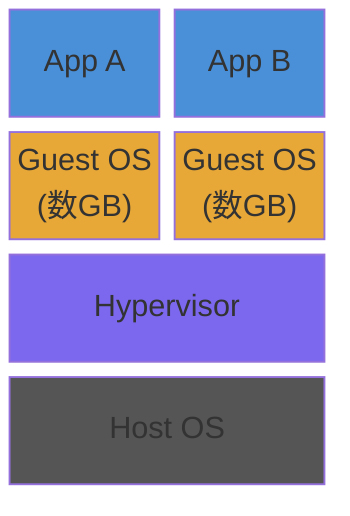
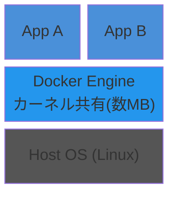

# Docker

> **一言で言うと:** 「環境の差異」という問題をプロセスの隔離で解決する技術 — Linuxカーネルの namespace と cgroup を活用して、アプリケーションとその依存関係を丸ごとパッケージ化し、どこでも同じように動く実行環境を提供する。

## 3分で全体像

- **何を解決する技術か:** 「自分の環境では動く」問題をプロセス隔離で解決し、開発・ステージング・本番で同じバイナリ + 同じ依存関係を動かせるようにする
- **代表的な使用シーン:** 開発環境のセットアップ自動化、CI/CDパイプライン、本番デプロイ（ECS/Cloud Run/k8s）、複数バージョンのランタイム共存、マイクロサービスのデプロイ単位
- **これだけは覚える3つ:**
    1. **コンテナ ≠ VM**。カーネルを共有して namespace/cgroup でプロセスを隔離する。起動が速いのはこのため、セキュリティ境界として弱いのもこのため
    2. **Dockerfile の命令順序がビルド速度を決める**。「変更頻度の低い命令を上に、高い命令を下に」
    3. **`latest` タグは使わない**。本番では明示バージョン（`node:22.5.1-slim`）でビルド再現性を確保
- **AIに任せやすいか:** **任せやすい** — Dockerfile のテンプレ作成、マルチステージビルド、`compose.yaml` 構成は AI が高品質に書ける。AIコードレビュー観点でレイヤー順序・`apt-get` のキャッシュ問題・rootユーザー実行などのアンチパターンも検出可能。一方「ベースイメージの選定（slim vs alpine vs distroless）」「ボリューム設計」「本番のCPU/メモリ制限値」はチームの方針と運用文脈に依存し、人間が判断
- **詰まったらここを読む:** [[プロセスとスレッド]] / [[ファイルシステムとIO]] / [[Linux基本操作]]

## なぜ必要か

ソフトウェアは「コード」だけでは動かない。OSのバージョン、言語のランタイム、ライブラリのバージョン、設定ファイル、環境変数 — これらが全て揃って初めて動作する。

Dockerがなかった時代の問題：
- **「自分の環境では動く」問題** — 開発者のローカルでは動くが、ステージングや本番では動かない。依存ライブラリのバージョン差異、OSの違い、パスの違いなどが原因
- **環境構築に時間がかかる** — 新しいチームメンバーの開発環境セットアップに数日かかることも珍しくない。手順書は常に陳腐化する（Dockerの他にも[[DockerとNix-Flakeによる開発環境管理|Nix Flake]]で宣言的に環境を定義するアプローチや、[[Ubuntu-Workshopによるサンドボックス開発環境|Ubuntu Workshop]]でLXDシステムコンテナ上にYAML定義の隔離開発環境を立てるアプローチがある）
- **複数プロジェクトの共存が困難** — プロジェクトAはNode.js 18、プロジェクトBはNode.js 20を要求する。グローバルインストールでは共存できない
- **本番環境の再現ができない** — バグの再現に「本番と同じ環境」が必要だが、構築が困難
- **デプロイの手順が属人化する** — 手動で依存関係をインストールし、設定を変更し...という手順がドキュメント化しきれない

## どの問題を解決するか

### 1. 環境の一貫性 — イメージによるパッケージ化

**課題:** アプリケーションの動作環境を「コードと一緒に」バージョン管理したい。

**解決:** [[Dockerイメージ]]は、OS・ランタイム・ライブラリ・アプリコード・設定の全てを1つのパッケージにまとめる。`Dockerfile` というテキストファイルで宣言的に定義するため、バージョン管理できる。

```dockerfile
# Dockerfileの例：Node.jsアプリケーション
FROM node:22-slim

WORKDIR /app
COPY package*.json ./
RUN npm ci --omit=dev
COPY . .

EXPOSE 3000
CMD ["node", "server.js"]
```

このファイルさえあれば、どのマシンでも `docker build` → `docker run` で同一の環境が再現される。

### 2. プロセスの隔離 — コンテナの本質

**課題:** 複数のアプリケーションを同一ホスト上で干渉なく動かしたい。仮想マシン（VM）は重すぎる。

**解決:** コンテナはLinuxカーネルの機能を使って[[プロセスとスレッド|プロセス]]を隔離する：
- **namespace** — プロセスID、ネットワーク、ファイルシステム、ユーザーIDなどを分離。コンテナ内のプロセスからは自分だけの世界に見える
- **cgroup（Control Groups）** — CPU・メモリ・I/Oなどのリソース使用量を制限。1つのコンテナが暴走しても他に影響しない

VMとの決定的な違いは**カーネルの共有**。VMは各インスタンスが独自のOSカーネルを持つが、コンテナはホストのカーネルを共有する。そのため起動が秒単位で速く、オーバーヘッドも小さい。

#### VM方式


```mermaid
block-beta
  columns 2
  appA["App A"]:1 appB["App B"]:1
  guestA["Guest OS<br>(数GB)"]:1 guestB["Guest OS<br>(数GB)"]:1
  hypervisor["Hypervisor"]:2
  hostOS1["Host OS"]:2

  style appA fill:#4a90d9,color:#fff
  style appB fill:#4a90d9,color:#fff
  style guestA fill:#e8a838,color:#fff
  style guestB fill:#e8a838,color:#fff
  style hypervisor fill:#7b68ee,color:#fff
  style hostOS1 fill:#555,color:#fff
```

#### コンテナ方式


```mermaid
block-beta
  columns 2
  appC["App A"]:1 appD["App B"]:1
  docker["Docker Engine<br>カーネル共有(数MB)"]:2
  hostOS2["Host OS (Linux)"]:2

  style appC fill:#4a90d9,color:#fff
  style appD fill:#4a90d9,color:#fff
  style docker fill:#2496ed,color:#fff
  style hostOS2 fill:#555,color:#fff
```

### 3. レイヤー構造 — 効率的なストレージとビルド

**課題:** 似たような環境のイメージを何個も作ると、ストレージが無駄になる。ビルドも毎回全てやり直すと遅い。

**解決:** [[Dockerイメージ]]はレイヤー（Layer）の積み重ねで構成される。`Dockerfile` の各命令（`FROM`, `RUN`, `COPY` など）が1つのレイヤーを生成し、変更がないレイヤーはキャッシュから再利用される。

```dockerfile
FROM node:22-slim          # レイヤー1: ベースイメージ（共有可能）
COPY package*.json ./      # レイヤー2: 依存定義
RUN npm ci                 # レイヤー3: 依存インストール（package.jsonが変わらない限りキャッシュ）
COPY . .                   # レイヤー4: アプリコード（頻繁に変更）
```

**変更頻度の低いものを上に、高いものを下に**配置することで、ビルドキャッシュの効率が最大化される。

### 4. マルチコンテナ構成 — Docker Compose

**課題:** 実際のアプリケーションはWebサーバー + DB + キャッシュなど複数のサービスで構成される。これらの起動・接続・停止を一括管理したい。

**解決:** Docker Composeは複数コンテナの構成を `compose.yaml`（Compose V2 推奨。`docker-compose.yml` も後方互換で動作する）で宣言的に定義する。

```yaml
# compose.yaml（docker-compose.yml でも動作する）
services:
  app:
    build: .
    ports:
      - "3000:3000"
    depends_on:
      - db
      - redis
    environment:
      DATABASE_URL: postgres://user:pass@db:5432/mydb

  db:
    image: postgres:16
    volumes:
      - db-data:/var/lib/postgresql/data
    environment:
      POSTGRES_PASSWORD: pass

  redis:
    image: redis:7-alpine

volumes:
  db-data:
```

`docker compose up` の1コマンドで全サービスが起動し、サービス名（`db`, `redis`）で自動的にDNS解決される。

## 他の仕組みとどう関係するか

- **下位レイヤーとの関係:**
  - [[プロセスとスレッド]] — コンテナの本質は「隔離されたプロセス」。namespace/cgroupはプロセス管理の拡張機能
  - [[ファイルシステムとIO]] — レイヤー構造はUnionFS（OverlayFS）というファイルシステム技術で実現される。コンテナ内の書き込みはCopy-on-Writeで処理される
  - [[メモリ管理]] — cgroupによるメモリ制限を超えるとOOM Killerがコンテナのプロセスを強制終了する
  - [[データ構造とアルゴリズム|Layer 0: CS基礎]] — イメージのコンテンツアドレッシング（SHA256ハッシュ）は[[ハッシュテーブル]]の応用

- **同レイヤーとの関係:**
  - [[Linux基本操作]] — Dockerの操作にはLinuxコマンドの知識が前提。コンテナ内のデバッグにも必須

- **上位レイヤーとの関係:**
  - [[Layer5-パフォーマンス/_index|Layer 5: パフォーマンス]] — コンテナのリソース制限設定がパフォーマンスに直結。オーバーヘッドは小さいが、ネットワークI/Oには若干の影響がある
  - [[Layer6-セキュリティ/_index|Layer 6: セキュリティ]] — コンテナはセキュリティ境界としては不完全。root権限での実行や特権モードは攻撃表面を広げる
  - [[Layer7-設計アーキテクチャ/_index|Layer 7: 設計・アーキテクチャ]] — CI/CDパイプラインの基盤。マイクロサービスアーキテクチャのデプロイ単位。本番運用では[[AWSコンテナサービスとDockerの実運用|ECS等のオーケストレーション]]が必要になり、その実行基盤（[[VPC・サブネット・NAT|VPC、サブネット]]、ECSクラスター等）は[[IaCとクラウドインフラ管理|IaC]]で宣言的にプロビジョニングするのが標準

## 誤解されやすいポイント

1. **「コンテナ = 軽量VM」ではない** — VMはハードウェアを仮想化し各インスタンスが独自のカーネルを持つ。コンテナはカーネルを共有し、namespace/cgroupでプロセスを隔離しているだけ。この違いは、セキュリティ特性（コンテナはカーネルの脆弱性を共有する）とパフォーマンス特性（コンテナはほぼネイティブ速度）の両方に影響する

2. **「Dockerイメージは不変（Immutable）だからコンテナも不変」ではない** — イメージは確かに不変だが、コンテナは実行時に書き込み可能レイヤーを持つ。ただし、この書き込みはコンテナ停止で消える。永続化が必要なデータは**ボリューム（Volume）**を使う必要がある。データベースのデータディレクトリをボリュームにマウントしないと、コンテナ再起動でデータが消失する

3. **「Dockerfileに書けばビルド順序は自由」ではない** — レイヤーキャッシュの効率はDockerfileの命令順序に大きく依存する。`COPY . .` を `RUN npm ci` の前に書くと、ソースコード1行の変更で依存関係の再インストールが発生する。「変更頻度の低い命令を先に」が鉄則

4. **「コンテナ1つに複数プロセスを入れてよい」わけではない** — 1コンテナ = 1プロセスが原則。Webサーバーとバックグラウンドワーカーを同一コンテナに入れると、個別のスケーリング・再起動・ログ管理ができなくなる。プロセスマネージャー（supervisordなど）でまとめるのは最終手段

5. **「latestタグを使えば常に最新」は危険** — `latest` はただの慣習的なタグ名であり、「最新版」の保証はない。本番では必ず明示的なバージョンタグ（`node:20.11.1-slim`）を使う。`latest` を使うとビルドの再現性が失われる

## 設計のベストプラクティス

### イメージの設計

| 推奨 | アンチパターン |
|------|-------------|
| slimやalpineベースを使う | フルOS（`ubuntu:latest`）ベースで不要なツールが大量に入る |
| マルチステージビルドでビルド環境と実行環境を分離 | ビルドツール（gcc, make等）が本番イメージに残る |
| `.dockerignore` で不要ファイルを除外 | `node_modules/`, `.git/`, `.env` がイメージに含まれる |
| 特定バージョンのタグを指定 | `FROM node:latest` で再現性がない |
| 非rootユーザーで実行（`USER node`） | root のまま実行して攻撃表面を広げる |

### マルチステージビルドの例

```dockerfile
# ステージ1: ビルド
FROM node:22 AS builder
WORKDIR /app
COPY package*.json ./
RUN npm ci
COPY . .
RUN npm run build

# ステージ2: 実行（ビルドツール不要）
FROM node:22-slim
WORKDIR /app
COPY --from=builder /app/dist ./dist
COPY --from=builder /app/node_modules ./node_modules
USER node
EXPOSE 3000
CMD ["node", "dist/server.js"]
```

### データの永続化

```yaml
# ボリュームの3つのパターン
services:
  db:
    image: postgres:16
    volumes:
      # 1. Named Volume — Dockerが管理、本番推奨
      - db-data:/var/lib/postgresql/data
      # 2. Bind Mount — ホストのパスを直接マウント、開発時に便利
      - ./init.sql:/docker-entrypoint-initdb.d/init.sql
      # 3. tmpfs — メモリ上の一時ストレージ
    tmpfs:
      - /tmp

volumes:
  db-data:
```

### ヘルスチェック

```dockerfile
HEALTHCHECK --interval=30s --timeout=3s --retries=3 \
  CMD curl -f http://localhost:3000/health || exit 1
```

コンテナが「起動しているが応答しない」状態を検知し、オーケストレーターが自動で再起動できるようにする。

## AIエージェントとの協働

> このトピックでAIコーディングエージェントと協働するための観点。「AIに何をどこまで任せ、人間は何を判断するか」を整理する。

### AIに任せられる部分 / 人間が判断すべき部分

「実装もレビューもAIに任せられる」前提で人間の最終判断を整理する。

| タスク種類 | 任せ方（実装/レビュー） | 人間の関与 |
|---|---|---|
| Dockerfile 初版の作成（言語別の典型構成） | 仕様（言語・ランタイム）を渡して任せる | ベースイメージの最終選定、不要パッケージの削除確認 |
| マルチステージビルドの分割 | テンプレ実装を任せる | ビルドステージ → 実行ステージへ何をコピーするかの最小化 |
| `compose.yaml` の作成（DB / Redis / アプリの構成） | 仕様を渡して任せる | ネットワーク設計、ボリューム配置、ヘルスチェック条件 |
| **`apt-get update && install` の結合チェック等のレイヤー最適化** | AIコードレビュー観点でレビューさせる | 指摘の妥当性判断 |
| `.dockerignore` の生成 | プロジェクト構成を渡して任せる | `.git`, `node_modules`, `.env`, `dist`, テストデータが除外されているか確認 |
| ベースイメージ選定（slim / alpine / distroless / debian） | 候補とトレードオフをAIに出させる | glibc 依存ライブラリの有無、デバッグの容易さ、社内方針を踏まえて判断 |
| CPU/メモリ制限値の設定 | AI に「本番のRSS実測値とCPU使用率」を渡してドラフトをもらう | コスト・SLA・バーストへの余裕を踏まえて最終決定 |
| シークレット注入方法（環境変数 / `--mount=type=secret` / Vault） | 候補をAIに出させる | プラットフォームの制約とセキュリティポリシーを踏まえて選ぶ |

### AI生成コードのレビュー観点（このトピック固有）

AI生成物を受け取ったとき、最低限ここを見る。

1. **レイヤーキャッシュの効率:** `COPY . .` が `RUN npm ci` より前にないか、`apt-get update` と `install` が別 `RUN` に分かれていないか
2. **イメージの肥大化と攻撃表面:** フルOS（`ubuntu:latest`）を選んでいないか、ビルドツールが本番イメージに残っていないか、`USER root` のままか、`latest` タグを使っていないか
3. **データの永続化と機密情報:** DB のデータディレクトリにボリュームがマウントされているか、`ENV API_KEY=xxx` のようにシークレットがハードコードされていないか、`.env` がイメージに含まれていないか

### 効くプロンプトの型

このトピックに関する実装をAIに依頼するとき、コンテキストとして渡すべき情報・制約・成功基準のテンプレ。

```
# 前提
- アプリ: Node.js 22 / Python 3.12 / Go 1.22 など
- パッケージマネージャ: npm / pnpm / pip / poetry / go mod
- デプロイ先: AWS ECS / Cloud Run / Kubernetes / Heroku
- ベースイメージ方針: slim 推奨 / alpine NG（glibc依存あり） / distroless OK など
- セキュリティ方針: 非 root 必須、シークレットは env 注入

# やってほしいこと
- 〜のアプリ用 Dockerfile / compose.yaml を作成

# 守ってほしい制約
- マルチステージビルドでビルドツールを本番イメージから除外
- COPY package*.json → RUN install → COPY . . の順で配置（キャッシュ効率）
- USER で非 root ユーザーで実行
- バージョンタグを明示（latest 禁止）
- apt-get update と install は同一 RUN に結合し、apt の cache を削除
- HEALTHCHECK を入れる
- .dockerignore も合わせて出力（.git / node_modules / .env を除外）

# 完了の判断基準
- docker build がキャッシュ有効でソース変更のみのとき30秒以内
- 最終イメージサイズが X MB 以下
- docker run --user 1000 で起動可能（root 不要）
- docker scout / trivy で High 以上の脆弱性ゼロ
```

### AI実装のアンチパターン

LLM生成コードで頻出する過剰設計・誤用パターン。レビュー時の照合表として使う。

| アンチパターン | なぜ問題か | レビュー観点 / 対策 |
|---|---|---|
| **`RUN apt-get update && apt-get install -y` を複数の RUN に分割** | `apt-get update` のレイヤーがキャッシュされ、古いパッケージリストで `install` が失敗する（`hash sum mismatch`） | `update` と `install` は必ず1つの `RUN` に結合し、`rm -rf /var/lib/apt/lists/*` で後始末 |
| **全ての `RUN` を `set -e` / `pipefail` なしで実行** | パイプ中の失敗が無視され、壊れたイメージが作られる（`curl ... \| tar -x` で curl 失敗を見落とす） | `SHELL ["/bin/bash", "-o", "pipefail", "-c"]` を Dockerfile 冒頭に設定 |
| **「念のため」で大量のパッケージをインストール** — `vim`, `curl`, `git`, `build-essential` を本番イメージに | イメージサイズが肥大化し、攻撃表面が広がる。CVE 対応コストも増える | 必要最小限のパッケージのみインストール。デバッグ用は別イメージ |
| **`COPY . .` を Dockerfile の先頭近くに配置** | ソースの1行変更で後続の全レイヤー（依存インストール含む）が再ビルドされる | 依存定義 `COPY package*.json` → `RUN npm ci` → アプリ `COPY . .` の順に |
| **環境変数にシークレットをハードコード** — `ENV DB_PASSWORD=xxx` | イメージのレイヤーに秘密情報が永続的に残る（`docker history` で誰でも見える） | `--mount=type=secret`（BuildKit）、ランタイムの環境変数注入、Vault などで注入 |
| **`USER root` のまま実行** — `USER` 命令を書かない | コンテナ内で root 権限のプロセスが動く。脆弱性を突かれた際の被害が拡大 | `RUN useradd -m app && USER app` などで非 root ユーザーを作って切り替える |
| **`FROM ubuntu:latest` のような `latest` タグ** | ビルドの再現性が失われる。次回ビルドで違うバージョンが取得されることがある | 必ず明示的なバージョン（`node:22.5.1-slim`）。digest 固定（`@sha256:...`）も検討 |

→ レイヤー横断のアンチパターン索引: [[_anti-patterns/_index|AIアンチパターン索引]]

## 具体例

### 開発環境の立ち上げ（よくあるWebアプリ構成）

```bash
# プロジェクトのクローン後、1コマンドで環境構築
docker compose up -d

# ログの確認
docker compose logs -f app

# コンテナ内でコマンド実行（デバッグ用）
docker compose exec app sh

# 全て停止・削除
docker compose down

# ボリュームも含めて完全削除（データも消える）
docker compose down -v
```

### 本番向けDockerfileの実践例（TypeScriptアプリ）

```dockerfile
# syntax=docker/dockerfile:1
FROM node:22-slim AS base
RUN corepack enable
WORKDIR /app

# 依存関係のインストール
FROM base AS deps
COPY package.json pnpm-lock.yaml ./
RUN pnpm install --frozen-lockfile --prod

# ビルド
FROM base AS build
COPY package.json pnpm-lock.yaml ./
RUN pnpm install --frozen-lockfile
COPY tsconfig.json ./
COPY src/ ./src/
RUN pnpm build

# 実行
FROM base AS runner
ENV NODE_ENV=production
COPY --from=deps /app/node_modules ./node_modules
COPY --from=build /app/dist ./dist
USER node
EXPOSE 3000
CMD ["node", "dist/server.js"]
```

### イメージの調査

```bash
# イメージのレイヤー構成を確認
docker history myapp:latest

# イメージサイズの確認
docker images myapp

# 実行中コンテナのリソース使用量
docker stats
```

## 参考リソース

- [Docker公式ドキュメント — Dockerfile best practices](https://docs.docker.com/build/building/best-practices/)
- [Docker公式ドキュメント — Multi-stage builds](https://docs.docker.com/build/building/multi-stage/)
- 書籍: 『Docker Deep Dive』Nigel Poulton — コンテナの内部構造を体系的に学べる
- [コンテナの仕組みを理解する（namespace/cgroup）](https://man7.org/linux/man-pages/man7/namespaces.7.html) — Linux man pages

## 理解度セルフチェック

> 答えられなければ本文に戻る。答えはこのファイル内に必ずある。

1. 「コンテナ = 軽量VM」という説明が本質的に間違っている理由を、namespace/cgroup の観点で30秒で説明できるか
2. Dockerfile のレイヤーキャッシュを最大限活用するために「変更頻度の低い命令を上に、高い命令を下に」配置する理由は何か。具体例で示せ
3. 次のAI生成 Dockerfile はこのトピックの観点で何が問題か。修正版を示せ:

```dockerfile
FROM node:latest

WORKDIR /app

COPY . .

RUN apt-get update
RUN apt-get install -y curl vim git build-essential

RUN npm install

ENV API_KEY=sk-prod-abc123xyz

EXPOSE 3000

CMD ["node", "server.js"]
```

> [!info] 用語ミニ辞典（解答を読む前に）
> - **namespace** — Linux カーネルの機能で、プロセスから見える「世界」を分離する仕組み。PID namespace、Network namespace、Mount namespace 等があり、各コンテナ内のプロセスは「自分だけの PID 1」「自分だけのネットワーク」「自分だけのファイルシステム」を持つように見える
> - **cgroup（Control Groups）** — プロセスグループに対して CPU・メモリ・I/O などのリソース上限を設定する Linux カーネルの仕組み。`docker run --memory=512m` の実体はこれ
> - **レイヤーキャッシュ** — Dockerfile の各命令が1つのレイヤーになり、命令と前段レイヤーが同じならビルド時に再利用される仕組み。これがあるおかげで、コードの1行変更で `npm ci` をやり直さずに済む
> - **マルチステージビルド** — `FROM ... AS stage_name` で複数の中間ステージを作り、最終ステージに必要なもの（`COPY --from=stage_name`）だけを取り込む手法。ビルドツールを本番イメージに残さない
> - **`docker history`** — イメージのレイヤー履歴を表示するコマンド。`ENV` でハードコードしたシークレットもここから誰でも閲覧できる

> [!note]- 解答の指針
> **問1: 「コンテナ ≠ 軽量VM」の理由**
>
> VM とコンテナは「一見似ているが、何を仮想化しているか」が根本的に違う。
>
> - **VM:** ハイパーバイザがハードウェア（CPU・メモリ・ディスク）を仮想化し、各 VM は **独立した OS カーネル** を持つ。ゲストOS の起動が必要なため秒単位〜分単位の起動時間、数GB のメモリ消費
> - **コンテナ:** Linux カーネルの **namespace** で「プロセスから見える世界」を分離し、**cgroup** でリソース上限を設定する。各コンテナは **ホストのカーネルを共有** する。新しいプロセスを作るのとほぼ同じコストで起動する
>
> 「カーネルが別か同じか」が決定的な違い。これは性能（コンテナはほぼネイティブ速度）とセキュリティ（コンテナはカーネル脆弱性をホストと共有する）の両方に直結する。「軽量」というだけでは VM の小型版に見えるが、実際は「プロセスの隔離手法」の延長にある。
>
> **問2: レイヤーキャッシュの効率化**
>
> Docker は Dockerfile を上から順にレイヤー化する。**「あるレイヤーが変わると、それ以降の全レイヤーを再ビルドする」** のが基本ルール。
>
> 変更頻度を考えると、開発中で最も頻繁に変わるのは「アプリのソースコード」、めったに変わらないのは「ベースイメージ」「依存関係（`package.json`）」。
>
> 悪い例:
>
> ```dockerfile
> FROM node:22-slim
> COPY . .             # ← ソース1行変更で以降が全部再ビルド
> RUN npm ci           # ← 毎回 npm ci が走る（数十秒〜数分）
> ```
>
> 良い例:
>
> ```dockerfile
> FROM node:22-slim
> COPY package*.json ./   # ← package.json が変わらない限りキャッシュ
> RUN npm ci              # ← package.json と一緒にキャッシュされる
> COPY . .                # ← ソース変更はここだけ再ビルド
> ```
>
> 結果: ソース変更時のビルドが「数秒（COPY . . だけ）」で終わる。CI/CD のサイクルタイムが激減する。
>
> **問3: AI生成 Dockerfile の問題点 6 つ**
>
> このコードはアンチパターンの宝庫。順に見ていく。
>
> **(a) `FROM node:latest`**
>
> `latest` はビルドの再現性を破壊する。今日と来週で違うバージョンの Node.js が使われる可能性がある。本番のバグ調査で「同じイメージを再ビルドできない」事態が起きる。 → `FROM node:22.5.1-slim` のように明示。
>
> **(b) `COPY . .` を `RUN npm install` の前に配置**
>
> ソースを1行変えるたびに `npm install`（数十秒〜数分）が再実行される。 → `COPY package*.json ./` → `RUN npm ci` → `COPY . .` の順序に。`npm install` ではなく `npm ci`（lockfile通りに正確にインストール）が本番向け。
>
> **(c) `apt-get update` と `install` が別 RUN**
>
> `update` のレイヤーだけキャッシュされ、`install` 実行時に「キャッシュされた古いパッケージリスト」を見て、存在しないバージョンを取りに行って失敗（`hash sum mismatch`）。 → 必ず 1 つの RUN に結合し、終了時に `rm -rf /var/lib/apt/lists/*` でキャッシュも削除。
>
> **(d) 「念のため」のパッケージ大量インストール**
>
> `vim`、`git`、`build-essential` は本番実行時には不要。イメージサイズが数百MB増加し、攻撃表面（CVE対応コスト）も増える。 → そもそも必要なら別ステージで、最終イメージには入れない。
>
> **(e) `ENV API_KEY=sk-prod-abc123xyz` でシークレット直書き**
>
> 致命的。`docker history` でイメージ閲覧者全員に API キーが露出する。レイヤーは消せないため、後から `unset` しても残る。 → ランタイムの環境変数注入、`--mount=type=secret`（BuildKit）、Secrets Manager 経由で注入。
>
> **(f) 非 root ユーザーで実行していない**
>
> `USER` 命令がないので root で実行される。コンテナ内で脆弱性を突かれた際の被害が拡大する。
>
> **修正版（最小構成）:**
>
> ```dockerfile
> # syntax=docker/dockerfile:1
> FROM node:22.5.1-slim AS deps
> WORKDIR /app
> COPY package*.json ./
> RUN npm ci --omit=dev
>
> FROM node:22.5.1-slim
> WORKDIR /app
> COPY --from=deps /app/node_modules ./node_modules
> COPY . .
> USER node          # 非 root で実行
> EXPOSE 3000
> CMD ["node", "server.js"]
> ```
>
> シークレットは `docker run -e API_KEY=$API_KEY` または ECS/k8s の secret 機能で注入する。

## 学習メモ

- コンテナは「プロセスの隔離」という点で [[プロセスとスレッド]] の延長線上にある。まずプロセスの仕組みを理解してからDockerを学ぶと、なぜこの技術が生まれたかが自然に理解できる
- Kubernetes（K8s）はDockerコンテナの「オーケストレーション」を担うが、まずは単体のDockerとDocker Composeを十分に使いこなしてから学ぶべき
- Windows/macOSでDockerを動かす場合、内部的にはLinux VMが動いている（Docker Desktop）。これはコンテナがLinuxカーネルの機能に依存しているため。Windowsでは[[WSL2とDocker|WSL2]]がDocker Desktopの標準バックエンドとなっており、ファイル配置場所によるパフォーマンス差に注意が必要
