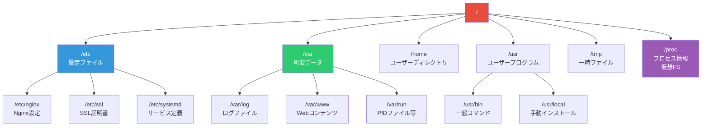
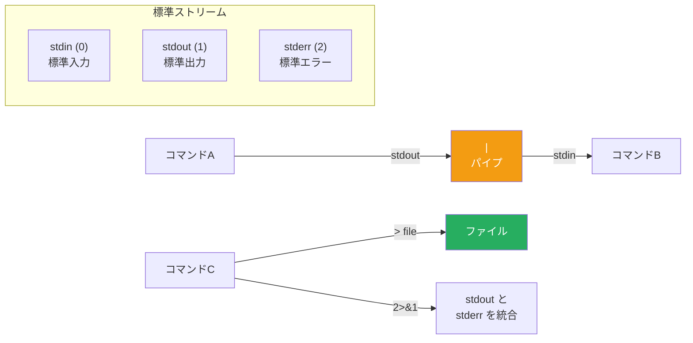

# Linux基本操作

> **一言で言うと:** 本番環境のほぼ全てがLinuxであり、ログ確認・プロセス調査・権限設定など「トラブル時の第一手段」となる操作体系。

## なぜ必要か

Webアプリケーションの本番サーバーは圧倒的にLinuxが多い。開発中はmacOSやWindowsを使っていても、デプロイ先は Amazon Linux、Ubuntu、Debian 等のLinuxディストリビューションになる。Linuxは[[LinuxとUnixの系譜|Unixの設計思想]]を受け継いだOSであり、「小さなツールを組み合わせる」という哲学がコマンド体系の根幹にある。

Linuxの基本操作を知らないと以下のことが起きる:

- **障害発生時に何も調べられない** — サーバーにSSHで入っても、ログの場所が分からない、プロセスの状態が見られない、ディスク使用率が確認できない
- **デプロイ作業が理解できない** — CI/CDパイプラインの中身がシェルスクリプトで書かれている場合、読めなければブラックボックスになる
- **権限の問題で事故を起こす** — `chmod 777` を「とりあえず」で設定してセキュリティホールを開けてしまう
- **[[Docker]]のトラブルシュートができない** — コンテナの中身はLinuxなので、コンテナ内での調査にもLinux操作が必須

## どの問題を解決するか

### 1. ファイル操作と検索

本番環境でのログ調査や設定ファイルの確認は、GUIなしで行う必要がある。

```bash
# ディレクトリ構造の確認
ls -la /var/log/           # ログディレクトリの一覧（権限・サイズ付き）
tree -L 2 /etc/nginx/     # Nginx設定のディレクトリ構造を2階層まで表示

# ファイル検索
find /var/log -name "*.log" -mtime -1    # 直近1日以内に更新されたログファイル
find / -name "nginx.conf" 2>/dev/null     # nginx.confの場所を探す（エラー出力は抑制）

# ファイル内容の確認
cat /etc/hostname           # ファイル全体を表示（小さいファイル向け）
less /var/log/syslog        # ページャで閲覧（大きいファイル向け、q で終了）
head -n 20 /var/log/app.log # 先頭20行
tail -n 50 /var/log/app.log # 末尾50行
tail -f /var/log/app.log    # リアルタイムでログを追跡（最重要コマンドの一つ）
```

### 2. テキスト処理とログ分析

大量のログから必要な情報を抽出する能力は、障害対応の速度を決定的に左右する。

```bash
# grep — パターンマッチング
grep "ERROR" /var/log/app.log              # ERRORを含む行を抽出
grep -i "timeout" /var/log/app.log         # 大文字小文字を区別せず検索
grep -c "500" /var/log/nginx/access.log    # 500エラーの件数を数える
grep -r "DB_PASSWORD" /etc/                # ディレクトリ内を再帰検索

# パイプとコマンドの組み合わせ
cat access.log | grep "POST /api" | wc -l  # POST /api リクエストの総数
cat access.log | awk '{print $1}' | sort | uniq -c | sort -rn | head -10
# ↑ IPアドレス（第1フィールド）を集計し、アクセス数上位10件を表示

# jq — JSON処理（モダンなAPIログで頻出）
cat app.log | jq '.level'                  # JSONログからlevelフィールドを抽出
cat app.log | jq 'select(.status >= 500)'  # ステータス500以上のエントリのみ
```

### 3. プロセスとリソースの監視

「なぜアプリが遅い/落ちたか」を調べるための第一歩。

```bash
# プロセス確認
ps aux                        # 全プロセスの一覧
ps aux | grep node            # Node.jsプロセスを探す
top                           # リアルタイムでCPU/メモリ使用率を監視（q で終了）
htop                          # topの高機能版（インストールが必要な場合あり）

# リソース確認
df -h                         # ディスク使用量（-h: 人間が読める形式）
du -sh /var/log/*             # 各ログファイルのサイズ
free -h                       # メモリ使用状況

# ネットワーク
ss -tlnp                      # リッスン中のポートとプロセス
curl -I https://example.com   # HTTPヘッダだけ確認（疎通確認に便利）
ping -c 3 example.com         # ネットワーク到達性の確認
```

### 4. ユーザーと権限管理

Linuxの権限モデルは[[ファイルシステムとIO]]と密接に関わる。権限の誤設定はセキュリティ事故の直接的な原因になる。

```bash
# 権限の確認と変更
ls -la /etc/ssl/private/      # 秘密鍵ディレクトリの権限確認
chmod 600 /etc/ssl/private/server.key  # 所有者のみ読み書き可
chmod 755 /var/www/html/      # 所有者: rwx、その他: r-x
chown www-data:www-data /var/www/html/ # 所有者をWebサーバーユーザーに変更

# 権限の読み方（rwxrwxrwx = 所有者/グループ/その他）
# r=4, w=2, x=1 の合計で表現
# 644 = rw-r--r-- （ファイルの一般的な権限）
# 755 = rwxr-xr-x （ディレクトリや実行ファイルの一般的な権限）
```

### 5. サービスとsystemd

現在サポートされている主要なLinuxディストリビューション（Ubuntu 20.04+, RHEL 8+, Debian 11+ 等）では、systemd がサービス管理を担う。

```bash
# サービス管理
systemctl status nginx        # Nginxの状態確認
systemctl restart nginx       # Nginxの再起動
systemctl enable nginx        # OS起動時の自動起動を有効化
journalctl -u nginx -f        # Nginxのログをリアルタイム追跡
journalctl -u app --since "1 hour ago"  # 直近1時間のログ
```

### 6. シェルスクリプトの基本

CI/CDパイプラインやデプロイスクリプトを読み書きするための最低限の知識。

```bash
#!/bin/bash
set -euo pipefail  # エラー時即座に停止（本番スクリプトでは必須）

# 変数
APP_DIR="/var/www/app"
LOG_FILE="/var/log/deploy.log"

# 条件分岐
if [ ! -d "$APP_DIR" ]; then
  echo "App directory not found" >&2
  exit 1
fi

# ループ
for file in /var/log/*.log; do
  echo "$(wc -l < "$file") lines in $file"
done

# コマンドの成否で分岐
if curl -sf http://localhost:3000/health > /dev/null; then
  echo "Health check passed"
else
  echo "Health check failed" >&2
  exit 1
fi
```

## 他の仕組みとどう関係するか

- **下位レイヤーとの関係:**
  - [[データ構造とアルゴリズム]] — パイプライン処理（`|`）はストリーム処理そのもの。`sort | uniq -c` のようなコマンドの連鎖はデータ処理パイプラインの原型
  - [[並行性の基本概念]] — プロセス管理コマンド（`ps`, `kill`, `top`）は[[プロセスとスレッド]]の知識と直結する

- **同レイヤーとの関係:**
  - [[プロセスとスレッド]] — `ps`, `top`, `kill` で操作する対象そのもの。シグナル（SIGTERM, SIGKILL）の違いを知ることがグレースフルシャットダウンの理解につながる
  - [[ファイルシステムとIO]] — `ls -la` で見える権限ビット、[[ファイルディスクリプタ]]のリダイレクト（`>`, `2>&1`）はファイルI/Oの直接操作
  - [[メモリ管理]] — `free`, `top` でメモリの使用状況を監視し、[[メモリリーク]]の兆候を発見する
  - [[Docker]] — コンテナ内でのデバッグは `docker exec -it <container> /bin/bash` からLinux操作に入る。`docker logs` も本質はLinuxのログ機構

- **上位レイヤーとの関係:**
  - [[Layer2-ネットワーク/_index|Layer 2: ネットワーク]] — `ss`, `curl`, `ping`, `dig` などのネットワーク系コマンドはTCP/IP・DNSの診断手段
  - [[Layer5-パフォーマンス/_index|Layer 5: パフォーマンス]] — `top`, `iostat`, `vmstat` によるボトルネック特定はパフォーマンス改善の出発点
  - [[Layer6-セキュリティ/_index|Layer 6: セキュリティ]] — 権限管理（`chmod`, `chown`）と最小権限の原則は直結。ログ分析はセキュリティインシデント調査の基礎

## 誤解されやすいポイント

1. **`chmod 777` で「とりあえず動く」は解決ではない**
   全ユーザーに全権限を与えることは、鍵をかけずにドアを開け放つのと同じ。本番環境で `777` を設定することはセキュリティ上の重大な問題。適切な権限（通常ファイルは `644`、ディレクトリは `755`、秘密鍵は `600`）を設定する習慣が重要。

2. **`rm -rf` の危険性を軽視する**
   Linuxにはゴミ箱がない。`rm -rf /var/log/` と `rm -rf /var /log/`（スペースの有無）で結果が全く異なる。特に `sudo` と組み合わせた `rm -rf` はシステムを破壊しうる。本番環境での `rm` は必ず `ls` で対象を確認してから実行する。

3. **`sudo` を常用するのは「特権の乱用」**
   `sudo` は「一時的に管理者権限で実行する」コマンドだが、権限エラーが出るたびに `sudo` をつけるのは根本原因を無視している。正しいアプローチは「なぜ権限がないのか」を理解し、適切なユーザー/グループ設定で解決すること。

4. **シェルスクリプトで `set -e` を省略する**
   デフォルトではコマンドがエラーになってもスクリプトは続行する。デプロイスクリプトで途中のコマンドが失敗したのに後続が実行されると、不完全な状態のデプロイが完了してしまう。`set -euo pipefail` はスクリプトの冒頭に必ず書く。

5. **環境変数の管理を軽視する**
   `export DB_PASSWORD=xxx` をシェルの履歴に残す、`.bashrc` に認証情報を書く、といった行為はセキュリティリスク。シークレット管理ツール（AWS Secrets Manager、HashiCorp Vault等）や `.env` ファイル（`.gitignore` に追加）を使う。

## 設計のベストプラクティス

### 推奨パターン

| パターン | 説明 |
|---------|------|
| **エイリアスで安全策** | `alias rm='rm -i'` で削除前に確認。本番サーバーの `.bashrc` に設定 |
| **ログローテーション** | `logrotate` で古いログを自動圧縮・削除。ディスク枯渇を防ぐ |
| **シェルスクリプトの冒頭** | `set -euo pipefail` を必ず記述 |
| **作業記録** | `script` コマンドや `history` でオペレーション履歴を残す |
| **本番作業は最小限** | 可能な限りCI/CDで自動化し、手動SSH作業を減らす |

### アンチパターン

| パターン | なぜ問題か |
|---------|-----------|
| 本番で直接ファイル編集 | デプロイで上書きされる、変更履歴が残らない |
| rootユーザーで常時作業 | 全操作が最高権限で実行され、誤操作の影響が最大化 |
| パスワードをコマンドライン引数に渡す | `ps aux` で他ユーザーから見える |
| `nohup command &` でデーモン化 | systemdのサービスとして管理すべき。ログ管理・自動再起動が困難 |

## AIによる実装のアンチパターン

| アンチパターン | なぜ問題か | 対策 |
|---|---|---|
| Dockerfileで `RUN apt-get install` を大量に並べる | 不要なパッケージまで含まれ、イメージサイズが肥大化 | 必要なパッケージだけを明示的にインストール |
| シェルスクリプトで過剰なエラーハンドリング | 各コマンドに `|| echo "failed"` を付けて握りつぶす | `set -euo pipefail` で一括管理し、本当に必要な箇所だけ個別処理 |
| `chmod -R 777` をDockerfile内で使用 | セキュリティを完全に無視した解決策 | 適切なユーザーとグループを設定し、最小権限を付与 |
| `curl \| bash` でスクリプトをインストール | 中間者攻撃のリスク、検証なしの実行 | パッケージマネージャ経由でインストール、またはチェックサム検証を行う |

## 具体例

### 障害対応シナリオ: 「アプリが応答しない」

```bash
# Step 1: サーバーの全体状態を確認
uptime                        # 負荷平均（Load Average）を確認
free -h                       # メモリ枯渇していないか
df -h                         # ディスクが満杯でないか

# Step 2: アプリケーションプロセスの確認
ps aux | grep node            # Nodeプロセスが生きているか
systemctl status my-app       # サービスの状態確認

# Step 3: ログの確認
tail -100 /var/log/my-app/error.log   # 直近のエラーログ
journalctl -u my-app --since "10 minutes ago"  # systemdログ

# Step 4: ネットワークの確認
ss -tlnp | grep 3000         # ポート3000がリッスンしているか
curl -v http://localhost:3000/health  # ローカルでのヘルスチェック

# Step 5: リソースボトルネックの特定
top -bn1 | head -20           # CPU/メモリの上位プロセス
iostat -x 1 3                 # ディスクI/Oの状態
```

### Linux ディレクトリ構造の全体像



### リダイレクトとパイプの仕組み



## 参考リソース

- **書籍:** 『Linuxコマンドライン入門』（William Shotts 著）— コマンドラインの体系的な学習に最適
- **書籍:** 『[改訂第3版]Linuxコマンドポケットリファレンス』— 実務でのリファレンスとして
- **オンライン:** [Linux Journey](https://linuxjourney.com/) — インタラクティブなLinux学習サイト
- **man ページ:** `man コマンド名` で各コマンドのマニュアルを確認（例: `man grep`）
- **tldr:** `tldr コマンド名` で実用的な使用例を素早く確認できるツール

## 学習メモ

- Linuxコマンドは「暗記」ではなく「必要なときに調べて使える」ことが重要。頻出コマンドは自然に覚える
- [[Docker]]環境での開発でも、コンテナ内のデバッグでLinux操作は必須
- シェルスクリプトは「プログラミング言語」として捉え、`set -euo pipefail` やクォーティングルールを守る
