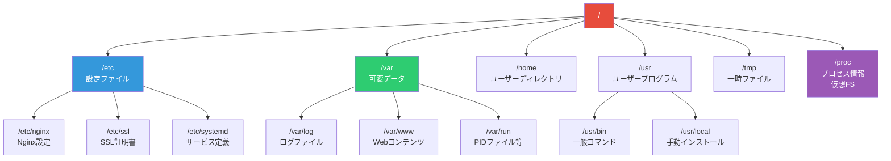
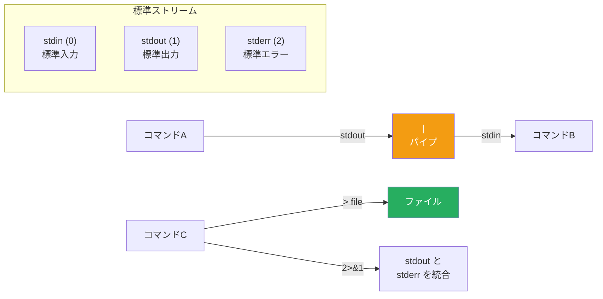

# Linux基本操作

> **一言で言うと:** 本番環境のほぼ全てがLinuxであり、ログ確認・プロセス調査・権限設定など「トラブル時の第一手段」となる操作体系。

## 3分で全体像

- **何を解決する技術か:** GUI のない本番サーバー（およびコンテナ内）で、ファイル操作・プロセス確認・ログ調査・権限管理・サービス管理を最短で実行する手段を提供する
- **代表的な使用シーン:** 本番障害の一次調査（ログ追跡・プロセス確認・リソース確認）、デプロイスクリプトの読み書き、Docker コンテナ内でのデバッグ、CI/CD パイプラインの理解、権限設定によるセキュリティ確保
- **これだけは覚える3つ:**
    1. **`tail -f`、`grep`、`ps aux`、`top`、`df -h`、`systemctl status` の6つで障害一次調査の8割は片付く**
    2. **`chmod 777` は「とりあえず動く」の解決にならない**。鍵をかけずにドアを開けるのと同じ。644/755/600 の意味を理解して使う
    3. **シェルスクリプトには必ず `set -euo pipefail` を冒頭に書く**。中間コマンドの失敗を握りつぶさないため
- **AIに任せやすいか:** **任せやすい** — 典型的なログ集計（`grep / awk / sort / uniq -c | sort -rn | head`）、systemd ユニットファイル、デプロイスクリプトの定型部分はAIが書ける。一方「`rm -rf` 系の破壊的操作の判断」「権限設定の設計」「本番作業の実行可否」は人間が必ず判断する（AIに本番で `sudo` を任せない）
- **詰まったらここを読む:** [[プロセスとスレッド]] / [[ファイルシステムとIO]] / [[Docker]]

## なぜ必要か

Webアプリケーションの本番サーバーは圧倒的にLinuxが多い。開発中はmacOSやWindowsを使っていても、デプロイ先は Amazon Linux、Ubuntu、Debian 等のLinuxディストリビューションになる。Linuxは[[LinuxとUnixの系譜|Unixの設計思想]]を受け継いだOSであり、「小さなツールを組み合わせる」という哲学がコマンド体系の根幹にある。

Linuxの基本操作を知らないと以下のことが起きる:

- **障害発生時に何も調べられない** — サーバーにSSHで入っても、ログの場所が分からない、プロセスの状態が見られない、ディスク使用率が確認できない
- **デプロイ作業が理解できない** — CI/CDパイプラインの中身がシェルスクリプトで書かれている場合、読めなければブラックボックスになる
- **権限の問題で事故を起こす** — `chmod 777` を「とりあえず」で設定してセキュリティホールを開けてしまう
- **[[Docker]]のトラブルシュートができない** — コンテナの中身はLinuxなので、コンテナ内での調査にもLinux操作が必須

## どの問題を解決するか

### 1. ファイル操作と検索

本番環境でのログ調査や設定ファイルの確認は、GUIなしで行う必要がある。

```bash
# ディレクトリ構造の確認
ls -la /var/log/           # ログディレクトリの一覧（権限・サイズ付き）
tree -L 2 /etc/nginx/     # Nginx設定のディレクトリ構造を2階層まで表示

# ファイル検索
find /var/log -name "*.log" -mtime -1    # 直近1日以内に更新されたログファイル
find / -name "nginx.conf" 2>/dev/null     # nginx.confの場所を探す（エラー出力は抑制）

# ファイル内容の確認
cat /etc/hostname           # ファイル全体を表示（小さいファイル向け）
less /var/log/syslog        # ページャで閲覧（大きいファイル向け、q で終了）
head -n 20 /var/log/app.log # 先頭20行
tail -n 50 /var/log/app.log # 末尾50行
tail -f /var/log/app.log    # リアルタイムでログを追跡（最重要コマンドの一つ）
```

### 2. テキスト処理とログ分析

大量のログから必要な情報を抽出する能力は、障害対応の速度を決定的に左右する。

```bash
# grep — パターンマッチング
grep "ERROR" /var/log/app.log              # ERRORを含む行を抽出
grep -i "timeout" /var/log/app.log         # 大文字小文字を区別せず検索
grep -c "500" /var/log/nginx/access.log    # 500エラーの件数を数える
grep -r "DB_PASSWORD" /etc/                # ディレクトリ内を再帰検索

# パイプとコマンドの組み合わせ
cat access.log | grep "POST /api" | wc -l  # POST /api リクエストの総数
cat access.log | awk '{print $1}' | sort | uniq -c | sort -rn | head -10
# ↑ IPアドレス（第1フィールド）を集計し、アクセス数上位10件を表示

# jq — JSON処理（モダンなAPIログで頻出）
cat app.log | jq '.level'                  # JSONログからlevelフィールドを抽出
cat app.log | jq 'select(.status >= 500)'  # ステータス500以上のエントリのみ
```

### 3. プロセスとリソースの監視

「なぜアプリが遅い/落ちたか」を調べるための第一歩（負荷の指標については [[ロードアベレージとCPU負荷]] も参照）。

```bash
# プロセス確認
ps aux                        # 全プロセスの一覧
ps aux | grep node            # Node.jsプロセスを探す
top                           # リアルタイムでCPU/メモリ使用率を監視（q で終了）
htop                          # topの高機能版（インストールが必要な場合あり）

# リソース確認
df -h                         # ディスク使用量（-h: 人間が読める形式）
du -sh /var/log/*             # 各ログファイルのサイズ
free -h                       # メモリ使用状況

# ネットワーク
ss -tlnp                      # リッスン中のポートとプロセス
curl -I https://example.com   # HTTPヘッダだけ確認（疎通確認に便利）
ping -c 3 example.com         # ネットワーク到達性の確認
```

### 4. ユーザーと権限管理

Linuxの権限モデルは[[ファイルシステムとIO]]と密接に関わる。権限の誤設定はセキュリティ事故の直接的な原因になる。

```bash
# 権限の確認と変更
ls -la /etc/ssl/private/      # 秘密鍵ディレクトリの権限確認
chmod 600 /etc/ssl/private/server.key  # 所有者のみ読み書き可
chmod 755 /var/www/html/      # 所有者: rwx、その他: r-x
chown www-data:www-data /var/www/html/ # 所有者をWebサーバーユーザーに変更

# 権限の読み方（rwxrwxrwx = 所有者/グループ/その他）
# r=4, w=2, x=1 の合計で表現
# 644 = rw-r--r-- （ファイルの一般的な権限）
# 755 = rwxr-xr-x （ディレクトリや実行ファイルの一般的な権限）
```

### 5. サービスとsystemd

現在サポートされている主要なLinuxディストリビューション（Ubuntu 20.04+, RHEL 8+, Debian 11+ 等）では、systemd がサービス管理を担う。

```bash
# サービス管理
systemctl status nginx        # Nginxの状態確認
systemctl restart nginx       # Nginxの再起動
systemctl enable nginx        # OS起動時の自動起動を有効化
journalctl -u nginx -f        # Nginxのログをリアルタイム追跡
journalctl -u app --since "1 hour ago"  # 直近1時間のログ
```

### 6. シェルスクリプトの基本

CI/CDパイプラインやデプロイスクリプトを読み書きするための最低限の知識。

```bash
#!/bin/bash
set -euo pipefail  # エラー時即座に停止（本番スクリプトでは必須）

# 変数
APP_DIR="/var/www/app"
LOG_FILE="/var/log/deploy.log"

# 条件分岐
if [ ! -d "$APP_DIR" ]; then
  echo "App directory not found" >&2
  exit 1
fi

# ループ
for file in /var/log/*.log; do
  echo "$(wc -l < "$file") lines in $file"
done

# コマンドの成否で分岐
if curl -sf http://localhost:3000/health > /dev/null; then
  echo "Health check passed"
else
  echo "Health check failed" >&2
  exit 1
fi
```

こうした手順を「上から順に実行する」のがシェルスクリプトだが、Unix にはもう一つ「**何が何に依存するか**」を宣言し、必要な部分だけを正しい順序で実行させる道具がある。`make` である。行頭タブや `.PHONY` といった独特の癖はあるが、多くの Linux / macOS / Docker イメージに標準で入っているため、`make setup` `make test` のようなプロジェクト共通のコマンド入口として今も広く使われる → [[Makefileとmakeコマンド]]

## 他の仕組みとどう関係するか

- **下位レイヤーとの関係:**
  - [[データ構造とアルゴリズム]] — パイプライン処理（`|`）はストリーム処理そのもの。`sort | uniq -c` のようなコマンドの連鎖はデータ処理パイプラインの原型
  - [[並行性の基本概念]] — プロセス管理コマンド（`ps`, `kill`, `top`）は[[プロセスとスレッド]]の知識と直結する

- **同レイヤーとの関係:**
  - [[プロセスとスレッド]] — `ps`, `top`, `kill` で操作する対象そのもの。シグナル（SIGTERM, SIGKILL）の違いを知ることがグレースフルシャットダウンの理解につながる
  - [[ファイルシステムとIO]] — `ls -la` で見える権限ビット、[[ファイルディスクリプタ]]のリダイレクト（`>`, `2>&1`）はファイルI/Oの直接操作
  - [[メモリ管理]] — `free`, `top` でメモリの使用状況を監視し、[[メモリリーク]]の兆候を発見する
  - [[Docker]] — コンテナ内でのデバッグは `docker exec -it <container> /bin/bash` からLinux操作に入る。`docker logs` も本質はLinuxのログ機構

- **上位レイヤーとの関係:**
  - [[Layer2-ネットワーク/_index|Layer 2: ネットワーク]] — `ss`, `curl`, `ping`, `dig` などのネットワーク系コマンドはTCP/IP・DNSの診断手段
  - [[Layer5-パフォーマンス/_index|Layer 5: パフォーマンス]] — `top`, `iostat`, `vmstat` によるボトルネック特定はパフォーマンス改善の出発点
  - [[Layer6-セキュリティ/_index|Layer 6: セキュリティ]] — 権限管理（`chmod`, `chown`）と最小権限の原則は直結。ログ分析はセキュリティインシデント調査の基礎

## 誤解されやすいポイント

1. **`chmod 777` で「とりあえず動く」は解決ではない**
   全ユーザーに全権限を与えることは、鍵をかけずにドアを開け放つのと同じ。本番環境で `777` を設定することはセキュリティ上の重大な問題。適切な権限（通常ファイルは `644`、ディレクトリは `755`、秘密鍵は `600`）を設定する習慣が重要。

2. **`rm -rf` の危険性を軽視する**
   Linuxにはゴミ箱がない。`rm -rf /var/log/` と `rm -rf /var /log/`（スペースの有無）で結果が全く異なる。特に `sudo` と組み合わせた `rm -rf` はシステムを破壊しうる。本番環境での `rm` は必ず `ls` で対象を確認してから実行する。

3. **`sudo` を常用するのは「特権の乱用」**
   `sudo` は「一時的に管理者権限で実行する」コマンドだが、権限エラーが出るたびに `sudo` をつけるのは根本原因を無視している。正しいアプローチは「なぜ権限がないのか」を理解し、適切なユーザー/グループ設定で解決すること。

4. **シェルスクリプトで `set -e` を省略する**
   デフォルトではコマンドがエラーになってもスクリプトは続行する。デプロイスクリプトで途中のコマンドが失敗したのに後続が実行されると、不完全な状態のデプロイが完了してしまう。`set -euo pipefail` はスクリプトの冒頭に必ず書く。

5. **環境変数の管理を軽視する**
   `export DB_PASSWORD=xxx` をシェルの履歴に残す、`.bashrc` に認証情報を書く、といった行為はセキュリティリスク。シークレット管理ツール（AWS Secrets Manager、HashiCorp Vault等）や `.env` ファイル（`.gitignore` に追加）を使う。

## 設計のベストプラクティス

### 推奨パターン

| パターン | 説明 |
|---------|------|
| **エイリアスで安全策** | `alias rm='rm -i'` で削除前に確認。本番サーバーの `.bashrc` に設定 |
| **ログローテーション** | `logrotate` で古いログを自動圧縮・削除。ディスク枯渇を防ぐ |
| **シェルスクリプトの冒頭** | `set -euo pipefail` を必ず記述 |
| **作業記録** | `script` コマンドや `history` でオペレーション履歴を残す |
| **本番作業は最小限** | 可能な限りCI/CDで自動化し、手動SSH作業を減らす |

### アンチパターン

| パターン | なぜ問題か |
|---------|-----------|
| 本番で直接ファイル編集 | デプロイで上書きされる、変更履歴が残らない |
| rootユーザーで常時作業 | 全操作が最高権限で実行され、誤操作の影響が最大化 |
| パスワードをコマンドライン引数に渡す | `ps aux` で他ユーザーから見える |
| `nohup command &` でデーモン化 | systemdのサービスとして管理すべき。ログ管理・自動再起動が困難 |

## AIエージェントとの協働

> このトピックでAIコーディングエージェントと協働するための観点。「AIに何をどこまで任せ、人間は何を判断するか」を整理する。

### AIに任せられる部分 / 人間が判断すべき部分

「実装もレビューもAIに任せられる」前提で人間の最終判断を整理する。

| タスク種類 | 任せ方（実装/レビュー） | 人間の関与 |
|---|---|---|
| ログ集計用のワンライナー（`grep / awk / sort / uniq -c | sort -rn | head`） | やりたい集計を渡してドラフトを生成 | 出力結果の妥当性確認 |
| systemd ユニットファイルの作成 | サービス仕様（コマンド、ユーザー、Restart 方針）を渡して任せる | `User=`、`Group=`、`Restart=` の最終決定 |
| デプロイスクリプトの定型部分（ヘルスチェック、Graceful な再起動） | テンプレ実装を任せる | 失敗時のロールバック方針、通知連携 |
| **シェルスクリプトの `set -euo pipefail` / クォーティング/ シャープ過剰エラーハンドリングのレビュー** | AIコードレビュー観点に渡してレビューさせる | 修正方針の最終採否 |
| logrotate 設定、cron / systemd timer の作成 | 仕様（保持期間・サイズ・実行時刻）を渡して任せる | ディスク容量の余裕、ピーク時間帯との衝突を確認 |
| 本番サーバーでのコマンド実行 | **AI に直接任せない**。提案を出させて人間が確認の上で実行 | `rm -rf`、`chmod -R`、`sudo`、データベース変更などの破壊的コマンドは必ず人間が確認 |
| 権限設計（誰が何にアクセスできるか） | 候補をAIに出させる | プロダクトの責任分界・コンプライアンス要件で最終判断 |

### AI生成コードのレビュー観点（このトピック固有）

AI生成物を受け取ったとき、最低限ここを見る。

1. **シェルスクリプトの安全性:** `set -euo pipefail` が冒頭にあるか、変数展開が `"$VAR"` のようにダブルクォートされているか、`rm -rf` の引数が空変数で `/` を消さないようガードされているか
2. **過剰なエラーハンドリング:** 各コマンドに `|| true` / `|| echo "failed"` を付けて失敗を握りつぶしていないか。本当に握り潰したい箇所だけ明示する
3. **権限の最小性:** `chmod 777` / `chmod -R 777` を「とりあえず動かすため」に使っていないか。`sudo` を毎行に付けていないか。秘密鍵などが `600` になっているか

### 効くプロンプトの型

このトピックに関する実装をAIに依頼するとき、コンテキストとして渡すべき情報・制約・成功基準のテンプレ。

```
# 前提
- OS: Ubuntu 22.04 / Amazon Linux 2023 / Debian 12 など
- サービス管理: systemd
- 実行ユーザー: app（root ではない）
- ログ集計対象: /var/log/app/access.log（JSON行形式）

# やってほしいこと
- 〜のシェルスクリプト / systemd ユニット / cron 設定を作成

# 守ってほしい制約
- スクリプト冒頭に set -euo pipefail
- 変数展開は必ず "$VAR" でクォート
- rm 対象は事前に [ -n "$VAR" ] でガード
- || true / || echo は本当に握り潰してよい箇所のみ
- chmod は最小権限（644/755/600）で
- sudo を毎行に付けない（必要な箇所だけ、または systemd の User= に委ねる）

# 完了の判断基準
- shellcheck で警告ゼロ
- 異常系（権限不足・ファイル不在）でエラーが上位に伝播する
- ログには errno や exit code が記録される
```

### AI実装のアンチパターン

LLM生成コードで頻出する過剰設計・誤用パターン。レビュー時の照合表として使う。

| アンチパターン | なぜ問題か | レビュー観点 / 対策 |
|---|---|---|
| **Dockerfile / シェルスクリプトで `chmod -R 777` を使う** | 全ユーザーに全権限を与える。本番環境ではセキュリティ事故の温床 | 適切なユーザー/グループ設定に置き換え、必要なら 644/755/600 を明示 |
| **シェルスクリプトで `||` による握りつぶし** — 各コマンドに `|| true` や `|| echo "failed"` | エラーが見えなくなり、デプロイが「成功扱い」で壊れた状態になる | `set -euo pipefail` で一括管理。本当に握り潰したい箇所だけ個別に `|| true` を明示 |
| **`set -euo pipefail` なしのスクリプト** | 中間コマンドの失敗が無視される。途中のコマンドが失敗してもスクリプトが続行し、不完全なデプロイを完了させる | スクリプト冒頭に必ず `set -euo pipefail` を書く |
| **変数を `$VAR` のままクォートせず使用** | スペース・改行・グロブ展開で意図しない挙動。`rm -rf $DIR` で `$DIR=""` だと `rm -rf` だけ実行されカレント全消去のリスク | `"$VAR"` でダブルクォート、`rm` 前に `[ -n "$VAR" ]` でガード |
| **`curl \| bash` でスクリプトをインストール** | 中間者攻撃で挿げ替えられる、検証なしの実行 | パッケージマネージャ経由か、署名/チェックサム検証を行う。スクリプトを一旦ファイルに保存して目視 |
| **`sudo` を毎行に付けて実行** | なぜ権限が要るか不明確、誤操作の影響が最大化 | systemd の `User=` でサービス実行ユーザーを切り替える。本当に root が必要な操作だけ `sudo` |
| **`nohup command &` でデーモン化** | プロセス管理・ログ管理・自動再起動が困難。SSH 切断との相性も悪い | systemd のサービスとして登録。`Restart=on-failure` で自動再起動 |

→ レイヤー横断のアンチパターン索引: [[_anti-patterns/_index|AIアンチパターン索引]]

## 具体例

### 障害対応シナリオ: 「アプリが応答しない」

```bash
# Step 1: サーバーの全体状態を確認
uptime                        # 負荷平均（Load Average）を確認
free -h                       # メモリ枯渇していないか
df -h                         # ディスクが満杯でないか

# Step 2: アプリケーションプロセスの確認
ps aux | grep node            # Nodeプロセスが生きているか
systemctl status my-app       # サービスの状態確認

# Step 3: ログの確認
tail -100 /var/log/my-app/error.log   # 直近のエラーログ
journalctl -u my-app --since "10 minutes ago"  # systemdログ

# Step 4: ネットワークの確認
ss -tlnp | grep 3000         # ポート3000がリッスンしているか
curl -v http://localhost:3000/health  # ローカルでのヘルスチェック

# Step 5: リソースボトルネックの特定
top -bn1 | head -20           # CPU/メモリの上位プロセス
iostat -x 1 3                 # ディスクI/Oの状態
```

### Linux ディレクトリ構造の全体像


```mermaid
graph TD
    ROOT["/"] --> etc["/etc<br>設定ファイル"]
    ROOT --> var["/var<br>可変データ"]
    ROOT --> home["/home<br>ユーザーディレクトリ"]
    ROOT --> usr["/usr<br>ユーザープログラム"]
    ROOT --> tmp["/tmp<br>一時ファイル"]
    ROOT --> proc["/proc<br>プロセス情報<br>仮想FS"]

    etc --> etc_nginx["/etc/nginx<br>Nginx設定"]
    etc --> etc_ssl["/etc/ssl<br>SSL証明書"]
    etc --> etc_systemd["/etc/systemd<br>サービス定義"]

    var --> var_log["/var/log<br>ログファイル"]
    var --> var_www["/var/www<br>Webコンテンツ"]
    var --> var_run["/var/run<br>PIDファイル等"]

    usr --> usr_bin["/usr/bin<br>一般コマンド"]
    usr --> usr_local["/usr/local<br>手動インストール"]

    style ROOT fill:#e74c3c,color:#fff
    style etc fill:#3498db,color:#fff
    style var fill:#2ecc71,color:#fff
    style proc fill:#9b59b6,color:#fff
```

### リダイレクトとパイプの仕組み


```mermaid
graph LR
    subgraph "標準ストリーム"
        STDIN["stdin (0)<br>標準入力"]
        STDOUT["stdout (1)<br>標準出力"]
        STDERR["stderr (2)<br>標準エラー"]
    end

    CMD1["コマンドA"] -->|"stdout"| PIPE["|<br>パイプ"]
    PIPE -->|"stdin"| CMD2["コマンドB"]

    CMD3["コマンドC"] -->|"> file"| FILE["ファイル"]
    CMD3 -->|"2>&1"| MERGE["stdout と<br>stderr を統合"]

    style PIPE fill:#f39c12,color:#fff
    style FILE fill:#27ae60,color:#fff
```

## 参考リソース

- **書籍:** 『Linuxコマンドライン入門』（William Shotts 著）— コマンドラインの体系的な学習に最適
- **書籍:** 『[改訂第3版]Linuxコマンドポケットリファレンス』— 実務でのリファレンスとして
- **オンライン:** [Linux Journey](https://linuxjourney.com/) — インタラクティブなLinux学習サイト
- **man ページ:** `man コマンド名` で各コマンドのマニュアルを確認（例: `man grep`）
- **tldr:** `tldr コマンド名` で実用的な使用例を素早く確認できるツール

## 理解度セルフチェック

> 答えられなければ本文に戻る。答えはこのファイル内に必ずある。

1. 「アプリが応答しない」と本番障害が起きたとき、最初の3分で何を確認するか。コマンドを順番に挙げよ
2. `chmod 644` と `chmod 755` の違いを「何のためにそうするか」も含めて30秒で説明できるか
3. 次のAI生成デプロイスクリプトはこのトピックの観点で何が問題か。修正版を示せ:

```bash
#!/bin/bash

APP_DIR=/var/www/myapp
LOG=/var/log/deploy.log

cd $APP_DIR
git pull || echo "git pull failed"

rm -rf $APP_DIR/cache
mkdir $APP_DIR/cache
chmod -R 777 $APP_DIR/cache

sudo npm install
sudo npm run build || echo "build failed"

sudo systemctl restart myapp || true

curl -s https://example.com/install.sh | bash

echo "Deploy done" >> $LOG
```

> [!info] 用語ミニ辞典（解答を読む前に）
> - **`set -euo pipefail`** — シェルスクリプトを「エラーで即停止」モードにする宣言の組み合わせ。`-e`: コマンド失敗で即終了、`-u`: 未定義変数の参照を禁止、`-o pipefail`: パイプの中で1つでも失敗したら全体を失敗扱いに。これがないとスクリプトはエラーを見逃して進む
> - **chmod の数値表記** — `r=4, w=2, x=1` の合計を「所有者 / グループ / その他」の3桁で表現。`755` = 所有者 rwx (4+2+1), グループ r-x (4+1), その他 r-x (4+1)。`777` は全員に rwx を与える（極めて危険）
> - **`sudo`** — 「指定したコマンドを root 権限で実行」する仕組み。毎行に付けると「いつでも全権限」状態になり、誤操作の影響が最大化される
> - **`curl \| bash`** — ネット上のスクリプトをダウンロードしてそのまま実行するパターン。中間者攻撃で別のスクリプトに差し替えられても気付けない。配布元が改ざんされた場合の被害も大きい

> [!note]- 解答の指針
> **問1: 障害一次調査の3分（コマンド順）**
>
> 「アプリが応答しない」の原因は、(a) アプリ自体が落ちている、(b) アプリは生きているがリソース枯渇で詰まっている、(c) ネットワーク/ポートの問題、のどれか。順番に切り分ける。
>
> ```bash
> # ステップ1: サーバーの全体状態（30秒）
> uptime           # Load Average で負荷の高さを確認
> free -h          # メモリ枯渇していないか
> df -h            # ディスクが満杯ではないか（/ や /var/log）
>
> # ステップ2: アプリプロセスの状態（30秒）
> systemctl status myapp     # サービスは動いているか、最近の終了理由
> ps aux | grep node         # プロセスは生きているか、CPU/メモリ消費は正常か
>
> # ステップ3: ログ（60秒）
> journalctl -u myapp --since "10 minutes ago" -p err   # 最近のエラーログ
> tail -100 /var/log/myapp/error.log                    # アプリログ
>
> # ステップ4: ネットワーク（30秒）
> ss -tlnp | grep 3000             # 3000番でリッスンしているか
> curl -v http://localhost:3000/health  # ローカルから応答するか
> ```
>
> この順序で進めると、(a) プロセス停止、(b) リソース枯渇、(c) ネットワーク問題のどれかに絞り込める。
>
> **問2: `644` vs `755` の違い**
>
> chmod の3桁は「所有者 / グループ / その他」のそれぞれに `r=4, w=2, x=1` の組み合わせを与える。
>
> - **644 = `rw- r-- r--`** — 所有者は読み書き可、グループとその他は読み取りのみ。**通常のテキストファイル**（設定ファイル、ログ、HTML など）の標準的な権限
> - **755 = `rwx r-x r-x`** — 所有者は読み書き実行可、グループとその他は読み取りと実行可。**ディレクトリと実行可能ファイル**（バイナリ、スクリプト）の標準
>
> 「ディレクトリには `x` が必要」がポイント。Linux ではディレクトリの `x` 権限は「**そのディレクトリ内のファイルにアクセスできる**」という意味で、`r` だけだと中身を `ls` で一覧表示はできるが、ファイル名を指定して開けない。だからディレクトリは通常 `755`。
>
> 秘密鍵は `600`（所有者のみ rw、他はアクセス不可）が必須。ssh は `600` 以外の鍵を読み込まない。
>
> **問3: AI生成デプロイスクリプトの問題点 7 つ**
>
> このスクリプトは典型的なアンチパターンが詰まっている。
>
> **(a) `set -euo pipefail` がない**
>
> エラーで止まらないので、途中の失敗を握りつぶして進む。「成功扱いで壊れた状態」のデプロイができてしまう。
>
> **(b) 変数がクォートされていない**
>
> `cd $APP_DIR` ではなく `cd "$APP_DIR"` にする。スペース・特殊文字混入時に意図しない挙動になる。
>
> **(c) `git pull || echo "git pull failed"` で握り潰し**
>
> `echo` で「失敗した」と出すだけで処理が続行する。コードが古いまま `npm install` や `build` が走る。失敗したら **即終了** すべき。
>
> **(d) `rm -rf $APP_DIR/cache` のガード不足**
>
> もし `$APP_DIR` が何かの拍子に空文字なら `rm -rf /cache`、root 権限と組み合わさると `rm -rf /` 級の事故になる。`[ -n "$APP_DIR" ]` で必ずガードする。
>
> **(e) `chmod -R 777 cache`**
>
> ディレクトリにフルアクセスを与えると、攻撃者が任意のファイルを書き込める状態になる。アプリの実行ユーザーが書き込みできれば十分なら `750` や `770`（グループに属させる）で済む。
>
> **(f) `sudo npm install` を毎行**
>
> npm install を root で実行する必要はない（むしろ npm のscript 実行で攻撃を受ける可能性がある）。デプロイ用の専用ユーザーで実行し、`sudo` は systemctl などに限定する。
>
> **(g) `curl -s ... | bash`**
>
> リモートのスクリプトを検証なしで実行している。中間者攻撃や配布元改ざんで任意のコードが実行される。配布元の真正性を確認した上で、署名/チェックサムを検証する。
>
> **修正版（最小構成）:**
>
> ```bash
> #!/bin/bash
> set -euo pipefail
>
> readonly APP_DIR=/var/www/myapp
> readonly LOG=/var/log/deploy.log
>
> cd "$APP_DIR"
> git pull
>
> if [ -n "$APP_DIR" ] && [ -d "$APP_DIR/cache" ]; then
>   rm -rf "$APP_DIR/cache"
> fi
> mkdir -p "$APP_DIR/cache"
> chmod 750 "$APP_DIR/cache"   # アプリ実行ユーザー + グループのみ
>
> npm ci          # lockfile通りに正確に
> npm run build
>
> sudo systemctl restart myapp
>
> # 外部スクリプトは事前にコピーしてレビュー or 署名検証
> # curl ... | bash は使わない
>
> echo "$(date -Iseconds) Deploy done" >> "$LOG"
> ```
>
> ポイント:
> - `set -euo pipefail` でエラー即停止
> - 変数は `"$VAR"` でクォート、`rm` 前にガード
> - `npm install` を `npm ci`（lockfile 厳密）
> - `chmod` は最小権限（`750`）
> - `sudo` は systemctl の限定箇所だけ
> - `curl | bash` は禁止

## 学習メモ

- Linuxコマンドは「暗記」ではなく「必要なときに調べて使える」ことが重要。頻出コマンドは自然に覚える
- [[Docker]]環境での開発でも、コンテナ内のデバッグでLinux操作は必須
- シェルスクリプトは「プログラミング言語」として捉え、`set -euo pipefail` やクォーティングルールを守る
