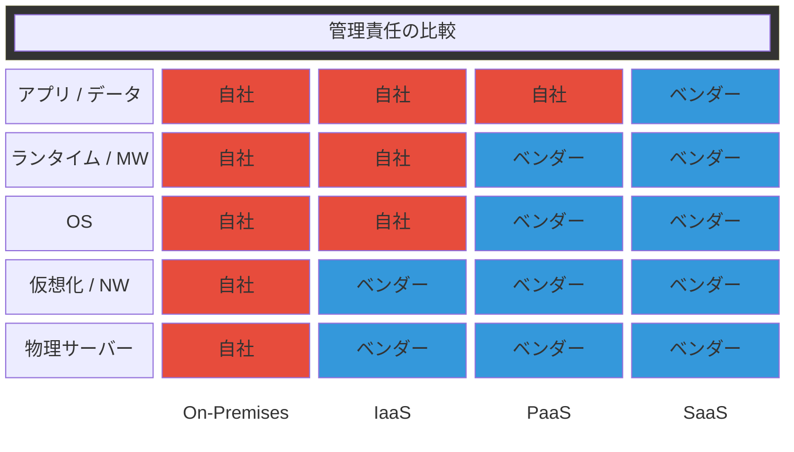
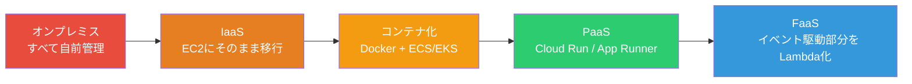

# クラウドサービスモデル（Cloud Service Models）

> **一言で言うと:** インフラの「どこまでを自分で管理し、どこからをクラウドベンダーに任せるか」の責任分界を定義するモデル — IaaS・PaaS・SaaS・FaaS の4つの抽象度があり、選択はチームの運用能力・コスト・制御の必要性のトレードオフで決まる。

## なぜ必要か

ソフトウェアを動かすには、物理サーバー、OS、ランタイム、ミドルウェア、アプリケーションコードという多層の基盤が必要になる。クラウド以前の世界では、これらを**すべて自前で調達・管理する**必要があった。

クラウドサービスモデルがなかった場合の問題：

- **初期投資が巨大** — サーバーの購入、データセンターの契約、ネットワーク機器の設定などに数ヶ月と数百万円単位のコストがかかる。小さなチームが実験的にサービスを始めることが困難
- **スケーリングが予測依存** — トラフィック増加に備えてサーバーを事前に購入する必要がある。予測を外すと「過剰投資で赤字」か「リソース不足でダウン」のどちらかになる
- **運用負荷が開発を圧迫する** — OSのパッチ適用、ディスク障害の交換、ネットワーク設定の変更など、アプリケーション開発と無関係な作業にエンジニアの時間が奪われる
- **グローバル展開が極めて困難** — 世界各地にサーバーを配置するには、各地域のデータセンターとの契約・法規制への対応が必要

## どの問題を解決するか

### 1. 責任の分離 — 管理レイヤーの切り分け

**課題:** インフラの全レイヤーを自前で管理すると、開発チームの負担が大きすぎる。しかし、全てを他者に委ねると制御を失う。

**解決:** クラウドサービスモデルは「どの層からベンダーが管理するか」を明確に定義する。



赤 = 自社管理、青 = ベンダー管理。右に行くほど「任せる範囲」が広がる。

### 2. IaaS（Infrastructure as a Service） — 仮想マシンとネットワーク

**課題:** 物理サーバーの調達・ラッキング・故障対応を自前でやりたくない。しかしOS以上の制御は必要。

**解決:** ベンダーが物理インフラとハイパーバイザーを管理し、仮想マシン（VM）をオンデマンドで提供する。OS・ランタイム・アプリケーションは利用者が管理する。

**代表的なサービス:** AWS EC2、Google Compute Engine（GCE）、Azure Virtual Machines

```bash
# AWS CLI で EC2 インスタンスを起動する例
aws ec2 run-instances \
  --image-id ami-0abcdef1234567890 \
  --instance-type t3.micro \
  --key-name my-key \
  --security-group-ids sg-12345678 \
  --subnet-id subnet-abcdef12
```

**使いどき:** カーネルパラメータの調整が必要、特殊なソフトウェアのインストールが必要、GPUインスタンスで機械学習を実行するなど、OS以上の完全な制御が求められる場合。

### 3. PaaS（Platform as a Service） — アプリコードだけに集中

**課題:** OSのパッチ適用、ランタイムのアップデート、スケーリングの設定など、アプリケーション開発と直接関係ない運用に時間を取られる。

**解決:** ベンダーがOS・ランタイム・ミドルウェアまで管理し、開発者はアプリケーションコードとデータだけを管理する。スケーリングも自動または半自動で行われる。

**代表的なサービス:** Heroku、AWS Elastic Beanstalk、Google App Engine、Railway、Render

```bash
# Heroku へのデプロイ例 — git push だけで完了する
git push heroku main
```

```yaml
# Google App Engine の設定例（app.yaml）
runtime: nodejs22
instance_class: F2
automatic_scaling:
  min_instances: 1
  max_instances: 10
  target_cpu_utilization: 0.65
```

**使いどき:** Webアプリケーションの標準的なデプロイ。OS層の制御が不要で、開発速度を優先したい場合。スタートアップや小規模チームで特に有効。

### 4. FaaS（Function as a Service） — サーバーレス

**課題:** PaaSでも「常時稼働するプロセス」を意識する必要がある。リクエストがない時間帯にもインスタンスが動いていてコストが発生する。

**解決:** 関数単位でコードを実行し、リクエストが来たときだけ起動する。待機時間のコストがゼロになる。

**代表的なサービス:** AWS Lambda、Google Cloud Functions、Cloudflare Workers

```javascript
// AWS Lambda のハンドラー例（Node.js）
export const handler = async (event) => {
  const body = JSON.parse(event.body);

  // ビジネスロジック
  const result = await processOrder(body.orderId);

  return {
    statusCode: 200,
    body: JSON.stringify({ result }),
  };
};
```

**使いどき:** イベント駆動の処理（S3にファイルがアップロードされたら変換する、APIリクエストを処理する等）。トラフィックが不規則でスパイクがある場合に、コスト効率が特に高い。

### 5. SaaS（Software as a Service） — 完成品を利用する

**課題:** 認証、決済、メール送信、モニタリングなどの機能を自前で開発・運用するのは車輪の再発明になる。

**解決:** 完成されたソフトウェアをAPIやWebインターフェースとして提供する。利用者はインフラもアプリケーションも管理しない。

**代表的なサービス:**
- 認証: Auth0、Firebase Authentication、Clerk
- 決済: Stripe、Square
- モニタリング: Datadog、New Relic（→ [[モニタリング]]）
- メール: SendGrid、Amazon SES

```javascript
// Stripe を利用した決済処理の例（Node.js）
import Stripe from "stripe";
const stripe = new Stripe(process.env.STRIPE_SECRET_KEY);

const session = await stripe.checkout.sessions.create({
  line_items: [{ price: "price_xxx", quantity: 1 }],
  mode: "payment",
  success_url: "https://example.com/success",
  cancel_url: "https://example.com/cancel",
});
```

自前で決済システムを構築する場合の PCI DSS 準拠コスト・セキュリティリスクと比較すると、SaaS利用の合理性が分かる。

## 他の仕組みとどう関係するか

- **下位レイヤーとの関係:**
  - [[データ構造とアルゴリズム|Layer 0: CS基礎]] — 計算量の概念がクラウドのコスト計算に直結する。O(n²) のアルゴリズムをLambdaで動かせば、リクエスト数の2乗でコストが増える

- **同レイヤーとの関係:**
  - [[Docker]] — コンテナはIaaSとPaaSの中間的な抽象度を提供する。AWS ECS/EKSやGoogle Cloud RunはDockerイメージを直接デプロイできるPaaS的なサービス（→ [[AWSコンテナサービスとDockerの実運用]]）
  - [[Linux基本操作]] — IaaSではLinuxの知識が必須。PaaS以上では直接必要ないが、トラブルシューティング時に理解が役立つ
  - [[プロセスとスレッド]] — FaaSではプロセスのライフサイクルがベンダーに管理される。コールドスタート問題はプロセス起動のオーバーヘッドそのもの
  - [[メモリ管理]] — FaaSでは関数ごとにメモリ割り当てを設定し、それが実行時間とコストに直結する

- **上位レイヤーとの関係:**
  - [[Layer5-パフォーマンス/_index|Layer 5: パフォーマンス]] — サービスモデルの選択がスケーリング特性を決定する。IaaSは手動、PaaSは半自動、FaaSは完全自動。[[ロードバランシング]]や[[CDN]]もクラウドベンダーがマネージドサービスとして提供する
  - [[Layer6-セキュリティ/_index|Layer 6: セキュリティ]] — [[最小権限の原則]]はクラウドの IAM 設計の根幹。責任共有モデルにより、セキュリティの責任範囲もサービスモデルによって変わる
  - [[Layer7-設計アーキテクチャ/_index|Layer 7: 設計・アーキテクチャ]] — [[CI-CD]]パイプラインのデプロイ先として各モデルを選択する。[[IaCとクラウドインフラ管理|IaC]]によるインフラのコード管理は IaaS/PaaS で特に重要。[[モノリスvsマイクロサービス]]の選択がサービスモデルの選択に影響する

## 誤解されやすいポイント

1. **「PaaSは常にIaaSより良い」わけではない** — PaaSは運用負荷を下げる代わりに、制御を失う。データベースのチューニング、カーネルパラメータの調整、特殊なネイティブライブラリの利用が必要な場合、PaaSでは対応できないことがある。「楽だから」ではなく「制約が許容できるか」で選ぶ

2. **「サーバーレス = サーバーがない」ではない** — FaaS（AWS Lambda等）でもサーバーは存在する。ベンダーが管理しているだけで、利用者から見えないだけ。コールドスタート（初回リクエスト時のレイテンシ増加）はサーバーの起動そのものであり、「サーバーがない」と思い込むとパフォーマンス問題を見落とす

3. **「クラウド = 安い」は条件付き** — 小規模・変動的なワークロードではクラウドがコスト効率に優れる。しかし、大規模で安定したワークロードでは、オンプレミスやリザーブドインスタンスの方が安くなることがある。DHH（Ruby on Rails作者）が [Basecamp のクラウド離脱](https://world.hey.com/dhh/why-we-re-leaving-the-cloud-654b47e0) を選んだ事例が示すように、「常にクラウドが最適」ではない

4. **「SaaSに依存しすぎる」リスクの過小評価** — SaaSベンダーの値上げ、サービス終了、APIの破壊的変更は現実に起きる。特に認証やデータストレージなどのコア機能をSaaSに完全依存すると、移行コストが膨大になる（ベンダーロックイン）。重要度に応じて抽象化レイヤーを挟むか、移行計画を持つことが必要

5. **「IaaSとPaaSは排他的な選択」ではない** — 実際のアーキテクチャでは複数のモデルを組み合わせる。例: メインのAPIサーバーはPaaS（Cloud Run）、バッチ処理はFaaS（Lambda）、特殊な計算はIaaS（EC2 GPU）、決済はSaaS（Stripe）。これが現代のクラウドネイティブアーキテクチャの現実

## 設計のベストプラクティス

### サービスモデルの選択基準

| 判断基準 | IaaS寄りを選ぶ | PaaS/FaaS寄りを選ぶ |
|---------|--------------|-------------------|
| チームの運用スキル | インフラエンジニアがいる | 開発者だけのチーム |
| ワークロード特性 | 常時稼働・安定負荷 | 変動的・イベント駆動 |
| カスタマイズ要件 | OS/カーネル調整が必要 | 標準的なWebアプリ |
| コスト構造 | 予測可能な固定費が有利 | 従量課金が有利 |
| 規制要件 | データの物理的な配置に制約 | 制約が緩い |

### 段階的なクラウド採用パス



いきなりFaaSに飛ぶのではなく、段階的に抽象度を上げることで、チームの学習とリスクの最小化を両立できる。

### アンチパターン

| アンチパターン | なぜ問題か | 対策 |
|-------------|----------|------|
| 最初からマルチクラウド戦略 | 抽象化レイヤーの構築コストが巨大。各クラウドの最適なサービスを活かせなくなる | まず1つのクラウドに習熟し、必要が生じてから検討する |
| 全てをFaaS/サーバーレスで構築 | コールドスタート、実行時間制限（Lambdaは15分）、ステート管理の困難さに苦しむ | ステートフルな処理やロングランニングタスクにはコンテナやVMが適切 |
| SaaSの抽象化レイヤーを最初から構築 | 移行しない可能性が高いのに、不要な複雑さを追加する（[[YAGNI]]） | 実際に移行が必要になってから抽象化する。ただし、コア機能のSaaS依存度は設計時に認識しておく |
| コスト見積もりなしでクラウド採用 | 「使った分だけ」が想定外に膨れる。特にデータ転送料（Egress）の見落とし | PoC段階でコスト試算を行い、AWS Cost Explorer等で継続監視する |

## AIによる実装のアンチパターン

| アンチパターン | なぜ問題か | 対策 |
|---|---|---|
| 全サービスをLambdaで提案する | レイテンシ要件、実行時間制限、ステート管理を考慮していない | ワークロード特性を確認してからサービスモデルを選択する |
| クラウドベンダー固有のSDKをビジネスロジック全体に散りばめる | ベンダーロックインが深くなり、テストも困難になる | インフラ層とビジネスロジック層を[[関心の分離]]する。ポート＆アダプターパターンの適用 |
| `*` ワイルドカードのIAMポリシーを生成する | [[最小権限の原則]]に違反し、セキュリティリスクが増大する | 必要なリソースとアクションだけを明示的に許可する |

## 具体例

### サービスモデル別のデプロイ比較

同じNode.js APIを各モデルでデプロイする場合の違い：

```bash
# IaaS（EC2） — OS設定からすべて自前
ssh ec2-user@my-instance
sudo yum install -y nodejs
git clone https://github.com/myapp/api.git
cd api && npm ci --omit=dev
sudo systemctl enable myapp  # systemd でプロセス管理
```

```bash
# PaaS（Heroku） — git push だけ
git push heroku main
# Procfile に "web: node server.js" と書くだけ
```

```bash
# コンテナ PaaS（Cloud Run） — Docker イメージをデプロイ
gcloud run deploy my-api \
  --image gcr.io/my-project/my-api:v1.2.3 \
  --platform managed \
  --region asia-northeast1 \
  --allow-unauthenticated
```

### IaCによるクラウドリソースの定義

クラウドサービスの管理は手動のコンソール操作ではなく、[[IaCとクラウドインフラ管理|IaC]]でコード化するのが標準：

```typescript
// AWS CDK でLambda + API Gateway を定義する例（TypeScript）
import * as cdk from "aws-cdk-lib";
import * as lambda from "aws-cdk-lib/aws-lambda";
import * as apigw from "aws-cdk-lib/aws-apigateway";

const fn = new lambda.Function(this, "MyFunction", {
  runtime: lambda.Runtime.NODEJS_22_X,
  handler: "index.handler",
  code: lambda.Code.fromAsset("lambda"),
  memorySize: 256,
  timeout: cdk.Duration.seconds(30),
});

new apigw.LambdaRestApi(this, "MyApi", {
  handler: fn,
});
```

## 参考リソース

- [AWS Well-Architected Framework](https://docs.aws.amazon.com/wellarchitected/latest/framework/welcome.html) — クラウドアーキテクチャのベストプラクティス集
- [The Twelve-Factor App](https://12factor.net/ja/) — PaaS向けアプリケーション設計の12の原則
- [Google Cloud Architecture Center](https://cloud.google.com/architecture) — クラウドネイティブ設計のリファレンス
- 書籍:『クラウドネイティブアプリケーション 12の設計パターン』— マイクロサービス＋クラウドの設計を体系的に学べる

## 学習メモ

- サービスモデルの選択は技術的な問題だけでなく、チームの規模・スキル・予算という組織的な文脈に強く依存する。「正解」は状況によって変わる
- [[Docker]] を学んでからクラウドサービスモデルを学ぶと、「コンテナがIaaSとPaaSの間を埋める技術」であることが理解しやすい
- FaaSの制約（コールドスタート、実行時間制限、ステートレス強制）は、逆にアプリケーション設計の品質を上げる効果もある — 状態を外部ストアに持つ設計は、スケーラビリティの面でも望ましい
