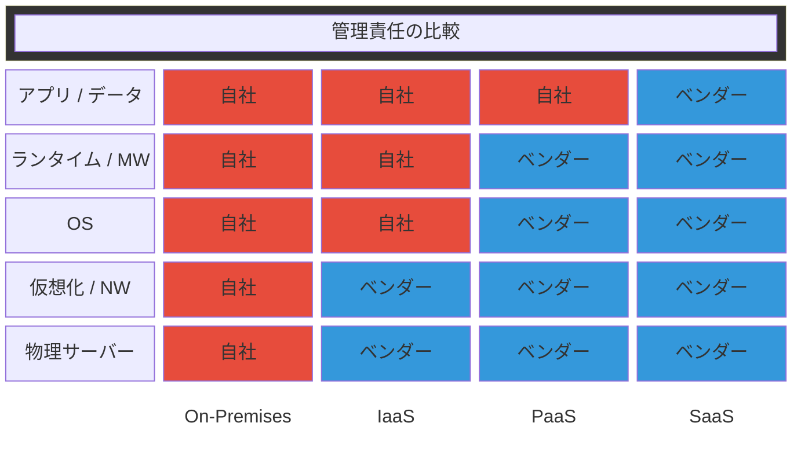
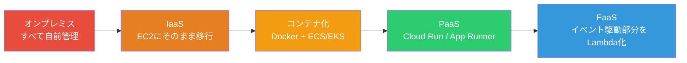

# クラウドサービスモデル（Cloud Service Models）

> **一言で言うと:** インフラの「どこまでを自分で管理し、どこからをクラウドベンダーに任せるか」の責任分界を定義するモデル — IaaS・PaaS・SaaS・FaaS の4つの抽象度があり、選択はチームの運用能力・コスト・制御の必要性のトレードオフで決まる。

## 3分で全体像

- **何を解決する技術か:** 「物理サーバーの調達からアプリ運用まで全部自前」の世界に対して、レイヤーごとに「ここから上は自分で、ここから下はベンダーに」という分業を可能にし、初期投資・スケーリング・運用負荷の問題を一気に解決する
- **代表的な使用シーン:** 新規サービスの立ち上げ、トラフィック変動が大きいワークロード、認証/決済/メール送信などコア外機能の SaaS 利用、グローバル展開、PoC/MVP のクイックリリース
- **これだけは覚える3つ:**
    1. **責任分界の階段:** On-Premises → IaaS → PaaS → FaaS → SaaS の順に「ベンダーに任せる範囲」が広がる
    2. **「楽だから PaaS」は危険**。制御を失う代わりに楽になる、というトレードオフ。OS チューニングが要るなら IaaS、コア外機能なら SaaS、変動的なら FaaS
    3. **マルチクラウド・FaaS全振り・先行抽象化は典型的な過剰設計**。まず1クラウドに習熟し、必要が出てから移行を検討する
- **AIに任せやすいか:** **任せやすい** — 各サービスの典型実装（Lambda ハンドラ、CDK/Terraform 定義、Heroku/Cloud Run へのデプロイ手順）はAIが書ける。AIコードレビュー観点で IAM ポリシーの過剰許可（`*` ワイルドカード）やベンダーロックイン（SDK の散在）も検出可能。一方「サービスモデルの選定」「リージョン選定」「コスト見積もり」「ベンダーロックイン許容度」はビジネス文脈とチーム能力に強く依存し、人間が判断する
- **詰まったらここを読む:** [[Docker]] / [[AWSコンテナサービスとDockerの実運用]] / [[IaCとクラウドインフラ管理]]

## なぜ必要か

ソフトウェアを動かすには、物理サーバー、OS、ランタイム、ミドルウェア、アプリケーションコードという多層の基盤が必要になる。クラウド以前の世界では、これらを**すべて自前で調達・管理する**必要があった。

クラウドサービスモデルがなかった場合の問題：

- **初期投資が巨大** — サーバーの購入、データセンターの契約、ネットワーク機器の設定などに数ヶ月と数百万円単位のコストがかかる。小さなチームが実験的にサービスを始めることが困難
- **スケーリングが予測依存** — トラフィック増加に備えてサーバーを事前に購入する必要がある。予測を外すと「過剰投資で赤字」か「リソース不足でダウン」のどちらかになる
- **運用負荷が開発を圧迫する** — OSのパッチ適用、ディスク障害の交換、ネットワーク設定の変更など、アプリケーション開発と無関係な作業にエンジニアの時間が奪われる
- **グローバル展開が極めて困難** — 世界各地にサーバーを配置するには、各地域のデータセンターとの契約・法規制への対応が必要

## どの問題を解決するか

### 1. 責任の分離 — 管理レイヤーの切り分け

**課題:** インフラの全レイヤーを自前で管理すると、開発チームの負担が大きすぎる。しかし、全てを他者に委ねると制御を失う。

**解決:** クラウドサービスモデルは「どの層からベンダーが管理するか」を明確に定義する。


```mermaid
block-beta
  columns 5
  block:header:5
    h["管理責任の比較"]
  end

  label5["アプリ / データ"]
  onp1["自社"]
  iaas1["自社"]
  paas1["自社"]
  saas1["ベンダー"]

  label4["ランタイム / MW"]
  onp2["自社"]
  iaas2["自社"]
  paas2["ベンダー"]
  saas2["ベンダー"]

  label3["OS"]
  onp3["自社"]
  iaas3["自社"]
  paas3["ベンダー"]
  saas3["ベンダー"]

  label2["仮想化 / NW"]
  onp4["自社"]
  iaas4["ベンダー"]
  paas4["ベンダー"]
  saas4["ベンダー"]

  label1["物理サーバー"]
  onp5["自社"]
  iaas5["ベンダー"]
  paas5["ベンダー"]
  saas5["ベンダー"]

  labelX[" "]
  ft1["On-Premises"]
  ft2["IaaS"]
  ft3["PaaS"]
  ft4["SaaS"]

  style header fill:#333,color:#fff
  style onp1 fill:#e74c3c,color:#fff
  style onp2 fill:#e74c3c,color:#fff
  style onp3 fill:#e74c3c,color:#fff
  style onp4 fill:#e74c3c,color:#fff
  style onp5 fill:#e74c3c,color:#fff
  style iaas1 fill:#e74c3c,color:#fff
  style iaas2 fill:#e74c3c,color:#fff
  style iaas3 fill:#e74c3c,color:#fff
  style iaas4 fill:#3498db,color:#fff
  style iaas5 fill:#3498db,color:#fff
  style paas1 fill:#e74c3c,color:#fff
  style paas2 fill:#3498db,color:#fff
  style paas3 fill:#3498db,color:#fff
  style paas4 fill:#3498db,color:#fff
  style paas5 fill:#3498db,color:#fff
  style saas1 fill:#3498db,color:#fff
  style saas2 fill:#3498db,color:#fff
  style saas3 fill:#3498db,color:#fff
  style saas4 fill:#3498db,color:#fff
  style saas5 fill:#3498db,color:#fff
  style labelX fill:transparent,stroke:none
  style ft1 fill:transparent,stroke:none
  style ft2 fill:transparent,stroke:none
  style ft3 fill:transparent,stroke:none
  style ft4 fill:transparent,stroke:none
```

赤 = 自社管理、青 = ベンダー管理。右に行くほど「任せる範囲」が広がる。

### 2. IaaS（Infrastructure as a Service） — 仮想マシンとネットワーク

**課題:** 物理サーバーの調達・ラッキング・故障対応を自前でやりたくない。しかしOS以上の制御は必要。

**解決:** ベンダーが物理インフラとハイパーバイザーを管理し、仮想マシン（VM）をオンデマンドで提供する。OS・ランタイム・アプリケーションは利用者が管理する。

**代表的なサービス:** AWS EC2、Google Compute Engine（GCE）、Azure Virtual Machines

```bash
# AWS CLI で EC2 インスタンスを起動する例
aws ec2 run-instances \
  --image-id ami-0abcdef1234567890 \
  --instance-type t3.micro \
  --key-name my-key \
  --security-group-ids sg-12345678 \
  --subnet-id subnet-abcdef12
```

**使いどき:** カーネルパラメータの調整が必要、特殊なソフトウェアのインストールが必要、GPUインスタンスで機械学習を実行するなど、OS以上の完全な制御が求められる場合。

### 3. PaaS（Platform as a Service） — アプリコードだけに集中

**課題:** OSのパッチ適用、ランタイムのアップデート、スケーリングの設定など、アプリケーション開発と直接関係ない運用に時間を取られる。

**解決:** ベンダーがOS・ランタイム・ミドルウェアまで管理し、開発者はアプリケーションコードとデータだけを管理する。スケーリングも自動または半自動で行われる。

**代表的なサービス:** Heroku、AWS Elastic Beanstalk、Google App Engine、Railway、Render

```bash
# Heroku へのデプロイ例 — git push だけで完了する
git push heroku main
```

```yaml
# Google App Engine の設定例（app.yaml）
runtime: nodejs22
instance_class: F2
automatic_scaling:
  min_instances: 1
  max_instances: 10
  target_cpu_utilization: 0.65
```

**使いどき:** Webアプリケーションの標準的なデプロイ。OS層の制御が不要で、開発速度を優先したい場合。スタートアップや小規模チームで特に有効。

### 4. FaaS（Function as a Service） — サーバーレス

**課題:** PaaSでも「常時稼働するプロセス」を意識する必要がある。リクエストがない時間帯にもインスタンスが動いていてコストが発生する。

**解決:** 関数単位でコードを実行し、リクエストが来たときだけ起動する。待機時間のコストがゼロになる。

**代表的なサービス:** AWS Lambda、Google Cloud Functions、Cloudflare Workers

```javascript
// AWS Lambda のハンドラー例（Node.js）
export const handler = async (event) => {
  const body = JSON.parse(event.body);

  // ビジネスロジック
  const result = await processOrder(body.orderId);

  return {
    statusCode: 200,
    body: JSON.stringify({ result }),
  };
};
```

**使いどき:** イベント駆動の処理（S3にファイルがアップロードされたら変換する、APIリクエストを処理する等）。トラフィックが不規則でスパイクがある場合に、コスト効率が特に高い。

### 5. SaaS（Software as a Service） — 完成品を利用する

**課題:** 認証、決済、メール送信、モニタリングなどの機能を自前で開発・運用するのは車輪の再発明になる。

**解決:** 完成されたソフトウェアをAPIやWebインターフェースとして提供する。利用者はインフラもアプリケーションも管理しない。

**代表的なサービス:**
- 認証: Auth0、Firebase Authentication、Clerk
- 決済: Stripe、Square
- モニタリング: Datadog、New Relic（→ [[モニタリング]]）
- メール: SendGrid、Amazon SES

```javascript
// Stripe を利用した決済処理の例（Node.js）
import Stripe from "stripe";
const stripe = new Stripe(process.env.STRIPE_SECRET_KEY);

const session = await stripe.checkout.sessions.create({
  line_items: [{ price: "price_xxx", quantity: 1 }],
  mode: "payment",
  success_url: "https://example.com/success",
  cancel_url: "https://example.com/cancel",
});
```

自前で決済システムを構築する場合の PCI DSS 準拠コスト・セキュリティリスクと比較すると、SaaS利用の合理性が分かる。

この階段の最も新しい段が、生成AIの基盤モデルを従量課金の API として提供する **FMaaS（Foundation Model as a Service）** だ。Amazon Bedrock がその代表で、GPU の調達もモデルの更新も完全にベンダー側に寄せられる。ただし「AWS 経由なら IAM で統制できる」という利点と引き換えに、ベンダー直接 API では使える機能の一部が使えないという、この章のトレードオフそのものが現れる。経路の選び方は [[Amazon-Bedrockとモデル提供形態の選択]] を参照。

## 他の仕組みとどう関係するか

- **下位レイヤーとの関係:**
  - [[データ構造とアルゴリズム|Layer 0: CS基礎]] — 計算量の概念がクラウドのコスト計算に直結する。O(n²) のアルゴリズムをLambdaで動かせば、リクエスト数の2乗でコストが増える

- **同レイヤーとの関係:**
  - [[Docker]] — コンテナはIaaSとPaaSの中間的な抽象度を提供する。AWS ECS/EKSやGoogle Cloud RunはDockerイメージを直接デプロイできるPaaS的なサービス（→ [[AWSコンテナサービスとDockerの実運用]]）
  - [[Linux基本操作]] — IaaSではLinuxの知識が必須。PaaS以上では直接必要ないが、トラブルシューティング時に理解が役立つ
  - [[プロセスとスレッド]] — FaaSではプロセスのライフサイクルがベンダーに管理される。コールドスタート問題はプロセス起動のオーバーヘッドそのもの
  - [[メモリ管理]] — FaaSでは関数ごとにメモリ割り当てを設定し、それが実行時間とコストに直結する

- **上位レイヤーとの関係:**
  - [[Layer5-パフォーマンス/_index|Layer 5: パフォーマンス]] — サービスモデルの選択がスケーリング特性を決定する。IaaSは手動、PaaSは半自動、FaaSは完全自動。[[ロードバランシング]]や[[CDN]]もクラウドベンダーがマネージドサービスとして提供する
  - [[Layer6-セキュリティ/_index|Layer 6: セキュリティ]] — [[最小権限の原則]]はクラウドの IAM 設計の根幹。責任共有モデルにより、セキュリティの責任範囲もサービスモデルによって変わる
  - [[Layer7-設計アーキテクチャ/_index|Layer 7: 設計・アーキテクチャ]] — [[CI-CD]]パイプラインのデプロイ先として各モデルを選択する。[[IaCとクラウドインフラ管理|IaC]]によるインフラのコード管理は IaaS/PaaS で特に重要。[[モノリスvsマイクロサービス]]の選択がサービスモデルの選択に影響する

## 誤解されやすいポイント

1. **「PaaSは常にIaaSより良い」わけではない** — PaaSは運用負荷を下げる代わりに、制御を失う。データベースのチューニング、カーネルパラメータの調整、特殊なネイティブライブラリの利用が必要な場合、PaaSでは対応できないことがある。「楽だから」ではなく「制約が許容できるか」で選ぶ

2. **「サーバーレス = サーバーがない」ではない** — FaaS（AWS Lambda等）でもサーバーは存在する。ベンダーが管理しているだけで、利用者から見えないだけ。コールドスタート（初回リクエスト時のレイテンシ増加）はサーバーの起動そのものであり、「サーバーがない」と思い込むとパフォーマンス問題を見落とす

3. **「クラウド = 安い」は条件付き** — 小規模・変動的なワークロードではクラウドがコスト効率に優れる。しかし、大規模で安定したワークロードでは、オンプレミスやリザーブドインスタンスの方が安くなることがある。DHH（Ruby on Rails作者）が [Basecamp のクラウド離脱](https://world.hey.com/dhh/why-we-re-leaving-the-cloud-654b47e0) を選んだ事例が示すように、「常にクラウドが最適」ではない

4. **「SaaSに依存しすぎる」リスクの過小評価** — SaaSベンダーの値上げ、サービス終了、APIの破壊的変更は現実に起きる。特に認証やデータストレージなどのコア機能をSaaSに完全依存すると、移行コストが膨大になる（ベンダーロックイン）。重要度に応じて抽象化レイヤーを挟むか、移行計画を持つことが必要

5. **「IaaSとPaaSは排他的な選択」ではない** — 実際のアーキテクチャでは複数のモデルを組み合わせる。例: メインのAPIサーバーはPaaS（Cloud Run）、バッチ処理はFaaS（Lambda）、特殊な計算はIaaS（EC2 GPU）、決済はSaaS（Stripe）。これが現代のクラウドネイティブアーキテクチャの現実

## 設計のベストプラクティス

### サービスモデルの選択基準

| 判断基準 | IaaS寄りを選ぶ | PaaS/FaaS寄りを選ぶ |
|---------|--------------|-------------------|
| チームの運用スキル | インフラエンジニアがいる | 開発者だけのチーム |
| ワークロード特性 | 常時稼働・安定負荷 | 変動的・イベント駆動 |
| カスタマイズ要件 | OS/カーネル調整が必要 | 標準的なWebアプリ |
| コスト構造 | 予測可能な固定費が有利 | 従量課金が有利 |
| 規制要件 | データの物理的な配置に制約 | 制約が緩い |

### 段階的なクラウド採用パス


```mermaid
flowchart LR
  A["オンプレミス
  すべて自前管理"] --> B["IaaS
  EC2にそのまま移行"]
  B --> C["コンテナ化
  Docker + ECS/EKS"]
  C --> D["PaaS
  Cloud Run / App Runner"]
  D --> E["FaaS
  イベント駆動部分をLambda化"]

  style A fill:#e74c3c,color:#fff
  style B fill:#e67e22,color:#fff
  style C fill:#f39c12,color:#fff
  style D fill:#2ecc71,color:#fff
  style E fill:#3498db,color:#fff
```

いきなりFaaSに飛ぶのではなく、段階的に抽象度を上げることで、チームの学習とリスクの最小化を両立できる。

### アンチパターン

| アンチパターン | なぜ問題か | 対策 |
|-------------|----------|------|
| 最初からマルチクラウド戦略 | 抽象化レイヤーの構築コストが巨大。各クラウドの最適なサービスを活かせなくなる | まず1つのクラウドに習熟し、必要が生じてから検討する |
| 全てをFaaS/サーバーレスで構築 | コールドスタート、実行時間制限（Lambdaは15分）、ステート管理の困難さに苦しむ | ステートフルな処理やロングランニングタスクにはコンテナやVMが適切 |
| SaaSの抽象化レイヤーを最初から構築 | 移行しない可能性が高いのに、不要な複雑さを追加する（[[YAGNI]]） | 実際に移行が必要になってから抽象化する。ただし、コア機能のSaaS依存度は設計時に認識しておく |
| コスト見積もりなしでクラウド採用 | 「使った分だけ」が想定外に膨れる。特にデータ転送料（Egress）の見落とし | PoC段階でコスト試算を行い、AWS Cost Explorer等で継続監視する |

## AIエージェントとの協働

> このトピックでAIコーディングエージェントと協働するための観点。「AIに何をどこまで任せ、人間は何を判断するか」を整理する。

### AIに任せられる部分 / 人間が判断すべき部分

「実装もレビューもAIに任せられる」前提で人間の最終判断を整理する。

| タスク種類 | 任せ方（実装/レビュー） | 人間の関与 |
|---|---|---|
| Lambda / Cloud Functions / Workers の典型ハンドラ実装 | 仕様（イベントソース、必要な権限）を渡して任せる | 動作確認、コールドスタート許容度の判断 |
| CDK / Terraform / SAM / Serverless Framework での IaC 化 | リソース定義を任せる | リソース命名規約、タグ付け方針、Stack 分割粒度 |
| 各 PaaS（Heroku、Render、Cloud Run、App Runner）のデプロイ手順 | 手順を任せる | プラットフォームごとの制限と料金体系の確認 |
| **IAM ポリシー / Service Account の権限設定のレビュー** | AIコードレビュー観点で `*` ワイルドカードや過剰許可を検出させる | 必要権限の最終決定 |
| SaaS ライブラリのインテグレーション（Stripe / Auth0 / SendGrid） | 公式サンプル相当のコードを任せる | エラーハンドリング、リトライ、Webhook 検証 |
| サービスモデルの選定（IaaS / PaaS / FaaS / SaaS） | 候補とトレードオフをAIに出させる | チーム能力、コスト、規制要件、運用負担を踏まえて最終決定 |
| リージョン選定・データレジデンシー判断 | AI に「ユーザー所在地・法規制・レイテンシ要件」を渡してドラフトをもらう | コンプライアンス・契約上の制約を踏まえて決定 |
| コスト見積もり | AI に料金体系と想定トラフィックを渡して計算させる | データ転送料（Egress）の見落としをチェック、本番運用後の Cost Explorer で実測 |

### AI生成コードのレビュー観点（このトピック固有）

AI生成物を受け取ったとき、最低限ここを見る。

1. **IAM/Service Account の権限が最小か:** `Action: "*"` / `Resource: "*"` のワイルドカード、`AdministratorAccess` ポリシーが付いていないか。必要なリソースとアクションだけ明示しているか
2. **ベンダーロックインの深さ:** AWS SDK / GCP SDK の呼び出しがビジネスロジック層に散らばっていないか。インフラ層に閉じ込められているか
3. **ワークロード特性とサービス選定の整合性:** ロングランニング処理を Lambda（15分制限）に乗せていないか、ステートフルな処理を FaaS で書いていないか、低レイテンシ要件にコールドスタート前提のアーキテクチャになっていないか

### 効くプロンプトの型

このトピックに関する実装をAIに依頼するとき、コンテキストとして渡すべき情報・制約・成功基準のテンプレ。

```
# 前提
- クラウドベンダー: AWS / GCP / Azure / Cloudflare など
- ワークロード特性: イベント駆動 / 常時稼働 / 大量バッチ / リアルタイム
- レイテンシ要件: P99 < N ms、コールドスタート許容度
- 想定トラフィック: 平常時 X リクエスト/秒、ピーク Y
- 規制要件: GDPR、データレジデンシー、ログ保持期間

# やってほしいこと
- 〜の機能を実装するためのサービス構成提案 + IaC ドラフト

# 守ってほしい制約
- IAM/Service Account は最小権限（* ワイルドカード禁止）
- ベンダー固有 SDK はインフラ層に閉じ込める（ビジネスロジックに散らさない）
- コスト見積もりに Egress 料金を含める
- マルチクラウド前提の抽象化レイヤーは作らない（YAGNI）
- IaC は Terraform / CDK / SAM のいずれかで一貫させる

# 完了の判断基準
- IAM Access Analyzer / Trivy で High 以上の指摘ゼロ
- ローカルで SDK モックを差し替えてビジネスロジックの単体テストが通る
- 月額コスト見積もりが ±20% で実コストと一致する
```

### AI実装のアンチパターン

LLM生成コードで頻出する過剰設計・誤用パターン。レビュー時の照合表として使う。

| アンチパターン | なぜ問題か | レビュー観点 / 対策 |
|---|---|---|
| **全サービスを Lambda で提案する** — 「サーバーレス = ベストプラクティス」と誤認 | レイテンシ要件、15分実行時間制限、ステート管理、コールドスタートを考慮していない。常時稼働のWebアプリには不向き | ワークロード特性（変動 vs 安定、ステートレス vs ステートフル、レスポンスタイム要件）を確認してから選定 |
| **クラウドベンダー固有の SDK をビジネスロジック全体に散りばめる** — 各層で `import { S3Client } from "@aws-sdk/..."` | ベンダーロックインが深くなり、テストではモック差し替えが困難。ベンダー移行コストが膨大に | インフラ層とビジネスロジック層を分離（ポート&アダプター）。ビジネスロジックは抽象インターフェース経由 |
| **`*` ワイルドカードの IAM ポリシーを生成する** — `Action: "s3:*"`、`Resource: "*"` | [[最小権限の原則]]に違反。鍵が漏れた際の被害範囲が最大化 | 必要なアクションとリソースだけを明示的に許可。`s3:GetObject` + 特定バケットの ARN |
| **最初からマルチクラウド戦略** — 「いつか移行するため」に抽象化レイヤーを構築 | 抽象化のコストが巨大。各クラウドの最適なサービスを活かせなくなる。実際は移行しないことが多い（[[YAGNI]] 違反） | まず1つのクラウドに習熟。必要が生じてから検討 |
| **コスト見積もりなしでクラウド採用** — 「使った分だけ」の安心感で構成 | データ転送料（Egress）、ログ保持コスト、API リクエスト料金が想定外に膨れる | PoC段階で月額試算を行い、Cost Explorer / Billing アラートで継続監視 |
| **コア機能を SaaS に深く依存** — 認証・決済・データストレージを完全に SaaS で固める | ベンダーの値上げ・サービス終了・破壊的変更で詰む | 重要機能は抽象化レイヤーを挟むか、移行計画を持つ。ただし最初から過剰抽象化はしない |

→ レイヤー横断のアンチパターン索引: [[_anti-patterns/_index|AIアンチパターン索引]]

## 具体例

### サービスモデル別のデプロイ比較

同じNode.js APIを各モデルでデプロイする場合の違い：

```bash
# IaaS（EC2） — OS設定からすべて自前
ssh ec2-user@my-instance
sudo yum install -y nodejs
git clone https://github.com/myapp/api.git
cd api && npm ci --omit=dev
sudo systemctl enable myapp  # systemd でプロセス管理
```

```bash
# PaaS（Heroku） — git push だけ
git push heroku main
# Procfile に "web: node server.js" と書くだけ
```

```bash
# コンテナ PaaS（Cloud Run） — Docker イメージをデプロイ
gcloud run deploy my-api \
  --image gcr.io/my-project/my-api:v1.2.3 \
  --platform managed \
  --region asia-northeast1 \
  --allow-unauthenticated
```

### IaCによるクラウドリソースの定義

クラウドサービスの管理は手動のコンソール操作ではなく、[[IaCとクラウドインフラ管理|IaC]]でコード化するのが標準：

```typescript
// AWS CDK でLambda + API Gateway を定義する例（TypeScript）
import * as cdk from "aws-cdk-lib";
import * as lambda from "aws-cdk-lib/aws-lambda";
import * as apigw from "aws-cdk-lib/aws-apigateway";

const fn = new lambda.Function(this, "MyFunction", {
  runtime: lambda.Runtime.NODEJS_22_X,
  handler: "index.handler",
  code: lambda.Code.fromAsset("lambda"),
  memorySize: 256,
  timeout: cdk.Duration.seconds(30),
});

new apigw.LambdaRestApi(this, "MyApi", {
  handler: fn,
});
```

## 参考リソース

- [AWS Well-Architected Framework](https://docs.aws.amazon.com/wellarchitected/latest/framework/welcome.html) — クラウドアーキテクチャのベストプラクティス集
- [The Twelve-Factor App](https://12factor.net/ja/) — PaaS向けアプリケーション設計の12の原則
- [Google Cloud Architecture Center](https://cloud.google.com/architecture) — クラウドネイティブ設計のリファレンス
- 書籍:『クラウドネイティブアプリケーション 12の設計パターン』— マイクロサービス＋クラウドの設計を体系的に学べる

## 理解度セルフチェック

> 答えられなければ本文に戻る。答えはこのファイル内に必ずある。

1. IaaS / PaaS / FaaS / SaaS の責任分界を「自社管理」「ベンダー管理」の境界線で30秒で説明できるか
2. 「常にPaaSがIaaSより良い」「サーバーレス = サーバーがない」「クラウド = 安い」のうち、どれが誤解か。なぜ誤解か
3. 次のAI生成コード（IaC）はこのトピックの観点で何が問題か。修正方針を示せ:

```typescript
import * as cdk from "aws-cdk-lib";
import * as lambda from "aws-cdk-lib/aws-lambda";
import * as iam from "aws-cdk-lib/aws-iam";

export class MyStack extends cdk.Stack {
  constructor(scope: cdk.App, id: string) {
    super(scope, id);

    const fn = new lambda.Function(this, "ImageProcessor", {
      runtime: lambda.Runtime.NODEJS_22_X,
      handler: "index.handler",
      code: lambda.Code.fromAsset("lambda"),
      memorySize: 256,
      timeout: cdk.Duration.minutes(15), // 大きい画像も処理する想定
    });

    fn.addToRolePolicy(new iam.PolicyStatement({
      actions: ["s3:*", "rds:*", "logs:*"],
      resources: ["*"],
    }));
  }
}
```

> [!info] 用語ミニ辞典（解答を読む前に）
> - **IAM (Identity and Access Management)** — AWS / GCP などで「誰が何をできるか」を定義する仕組み。ロール、ポリシー、リソース ARN の組み合わせで権限を細かく制御する
> - **コールドスタート** — Lambda などの FaaS で、リクエストがしばらく来ていなかった関数が呼ばれた際、実行環境（コンテナ）の初期化から始まる遅延。100ms〜数秒かかることも
> - **Egress（データ送信料）** — クラウドの「外向き」データ転送料金。受信は無料/安いことが多いが、外部に送るデータには課金される。CDN / S3 ダウンロード / 別リージョンへのレプリケーションなどで膨らむ
> - **YAGNI（You Aren't Gonna Need It）** — 「まだ必要ではない機能を作るな」という原則。「いつか必要になるかも」で抽象化やマルチクラウド対応を先取りすると、ほぼ使わずに複雑さだけ残る
> - **ベンダーロックイン** — 特定ベンダーのサービスに依存しすぎて、移行コストが膨大になり実質的に縛られる状態。SaaS や独自仕様の PaaS で起きやすい

> [!note]- 解答の指針
> **問1: 4つのサービスモデルの責任分界**
>
> インフラを下から「物理サーバー → 仮想化/NW → OS → ランタイム/MW → アプリ/データ」と5層に分けて、どこからベンダー管理かを見る。
>
> - **IaaS（EC2 / GCE）:** 物理サーバー + 仮想化/NWまでベンダー、OS以上は自社。Linux の管理が必要
> - **PaaS（Heroku / Cloud Run / App Engine）:** OS + ランタイム/MWまでベンダー、アプリとデータが自社。`git push` でデプロイ完了
> - **FaaS（Lambda / Cloud Functions）:** PaaSと同層だがプロセスのライフサイクルもベンダー管理。「関数」だけ書けばよい
> - **SaaS（Stripe / Auth0 / SendGrid）:** アプリも完成品、データもベンダー側。利用者は API/UI を呼ぶだけ
>
> 「右に行くほど任せる範囲が広く、楽になるが制御を失う」のトレードオフ。
>
> **問2: 3つの誤解の正体**
>
> 全部誤解だが、それぞれ「真実の混じり方」が違う。
>
> - **「常に PaaS が IaaS より良い」**: 楽さと制御のトレードオフを無視している。OS チューニング・特殊ライブラリ・カーネルパラメータ調整が必要なら IaaS の方が適切
> - **「サーバーレス = サーバーがない」**: 完全な誤解。FaaS でも実体はベンダーのサーバー上で動いている。利用者から見えないだけ。コールドスタートは「サーバー起動」そのもの
> - **「クラウド = 安い」**: 条件付き。小規模・変動的なら安い、大規模・安定的ならオンプレミスやリザーブドインスタンスの方が安いことがある（DHH の Basecamp 撤退事例）
>
> どれも「便利さの誇張」が誤解を生んでいる。トレードオフを理解せず採用すると、後で苦しむことになる。
>
> **問3: AI生成 IaC の問題点 3 つ**
>
> このコードは「画像処理 Lambda + 必要な権限」を定義したもの。一見シンプルだが、3つの致命的な設計判断ミスがある。
>
> **(a) `timeout: cdk.Duration.minutes(15)` で Lambda の最大値を使っている**
>
> Lambda の最大実行時間は15分。これを「保険のため最大値」で設定するのは、ワークロード特性を考えていないサイン。
>
> もし大きな画像処理に15分かかるなら、Lambda は適切な選択ではない。15分の課金（GB-秒の単価 × メモリ × 時間）は決して安くないし、コールドスタートを含めると応答性も悪い。長時間処理は **AWS Batch / ECS / Fargate / Step Functions** に投げるべき。
>
> 修正方針: 想定処理時間（例 30秒）に応じた timeout を設定し、それを超える場合は別サービスに切り替える設計に。
>
> **(b) IAM ポリシーが `*` ワイルドカードだらけ**
>
> ```typescript
> actions: ["s3:*", "rds:*", "logs:*"],
> resources: ["*"],
> ```
>
> これは [[最小権限の原則]] の真逆。「**全リソースに対して S3 / RDS / CloudWatch Logs の全操作を許可**」という意味で、もしこの Lambda が乗っ取られたら、アカウント内の **すべての** S3 バケット・RDS DB・ログストリームを読み書き削除できる。
>
> 修正方針: 本当に必要な権限だけ書く。
>
> ```typescript
> actions: [
>   "s3:GetObject",
>   "s3:PutObject",
> ],
> resources: [
>   `arn:aws:s3:::my-image-bucket/uploads/*`,
>   `arn:aws:s3:::my-image-bucket/processed/*`,
> ],
> ```
>
> RDS への接続が本当に必要か、Logs はマネージドポリシー `AWSLambdaBasicExecutionRole` で十分か、を1つずつ精査する。
>
> **(c) コスト見積もりとモニタリングの不在**
>
> このコード単体では「想定リクエスト数 × 平均実行時間 × メモリ」のコスト試算が見えない。`memorySize: 256` も「とりあえず 256MB」感がある。Lambda は メモリ ↔ CPU 連動で、適正サイズはプロファイルしないと決まらない。
>
> 修正方針:
> - PoC 段階で `aws lambda invoke` のメモリ別性能を測り、価格性能比のスイートスポットを探す
> - CloudWatch アラームで実行時間 P99 / エラー率 / 月額コストを監視
> - Cost Explorer の予算アラートを設定
>
> **修正版（最小構成）:**
>
> ```typescript
> const fn = new lambda.Function(this, "ImageProcessor", {
>   runtime: lambda.Runtime.NODEJS_22_X,
>   handler: "index.handler",
>   code: lambda.Code.fromAsset("lambda"),
>   memorySize: 1024,                   // プロファイルで決定
>   timeout: cdk.Duration.seconds(60),  // 想定処理時間に合わせる
> });
>
> fn.addToRolePolicy(new iam.PolicyStatement({
>   actions: ["s3:GetObject", "s3:PutObject"],
>   resources: [
>     `arn:aws:s3:::my-image-bucket/uploads/*`,
>     `arn:aws:s3:::my-image-bucket/processed/*`,
>   ],
> }));
> // CloudWatch Logs は AWSLambdaBasicExecutionRole で自動付与
> ```
>
> ポイント:
> - `timeout` はワークロード起点の値（最大値で保険を掛けない）
> - IAM ポリシーは「アクション × リソース」を最小限に
> - 15分超えるならそもそも Lambda を選ばない

## 学習メモ

- サービスモデルの選択は技術的な問題だけでなく、チームの規模・スキル・予算という組織的な文脈に強く依存する。「正解」は状況によって変わる
- [[Docker]] を学んでからクラウドサービスモデルを学ぶと、「コンテナがIaaSとPaaSの間を埋める技術」であることが理解しやすい
- FaaSの制約（コールドスタート、実行時間制限、ステートレス強制）は、逆にアプリケーション設計の品質を上げる効果もある — 状態を外部ストアに持つ設計は、スケーラビリティの面でも望ましい
