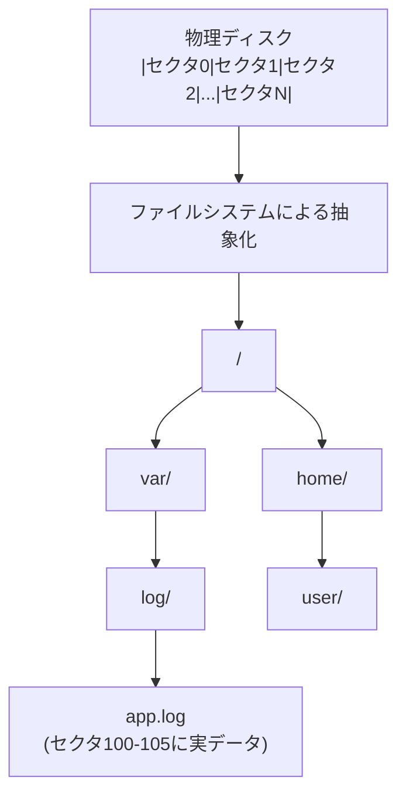

# ファイルシステムとIO

> **一言で言うと:** ディスクI/O（Input/Output）はメモリアクセスの10万倍遅い — この感覚があると「なぜキャッシュが必要か」「なぜDBインデックスが重要か」が直感的に分かる。ファイルシステムはOSがディスク上のバイト列を「ファイル」と「ディレクトリ」という抽象に変換する仕組みであり、すべてのデータ永続化の土台である。

## なぜ必要か

Webアプリケーションは本質的にデータを読み書きする仕組みである。ユーザーがアップロードした画像、アクセスログ、データベースの中身 — これらはすべて最終的にディスク上のファイルとして保存される。

ファイルシステムとI/Oを理解していないと：
- **パフォーマンスの見積もりができない** — 「ファイルを読むだけ」のAPIが想定より100倍遅い理由が分からない
- **データ破損の原因が分からない** — 書き込み中にサーバーが落ちたとき、なぜファイルが壊れるのか（部分書き込み問題）を理解できない
- **インフラの設計判断ができない** — SSD vs HDD、EBS vs ローカルディスク、NFS vs S3 の使い分けに根拠を持てない
- **DBの挙動が理解できない** — データベースは結局ファイルシステム上に構築されている。[[Resources/Study/Layer3-データ永続化/インデックス|インデックス]]がなぜ検索を速くするかは、ディスクI/Oの仕組みを知らないと本質的に理解できない

## どの問題を解決するか

### 1. ディスクの複雑さの隠蔽 — ファイルシステムによる抽象化

**課題:** ディスク（HDD/SSD）は物理的にはセクタ（通常512バイト〜4KB）単位でしかデータを読み書きできない。アプリケーション開発者が「セクタ324〜327にバイト列を書き込め」と指示するのは非現実的。

**解決:** ファイルシステム（ext4, NTFS, APFSなど）がディスク上のバイト列を**ファイル**と**ディレクトリ**というツリー構造に抽象化する。開発者は「`/var/log/app.log` に文字列を追記する」とだけ書けばよい。



ファイルシステムは内部的に以下を管理する：
- **メタデータ** — ファイル名、サイズ、権限、タイムスタンプ（inode に格納）
- **データブロックの配置** — どのセクタにファイルの中身が格納されているか
- **空き領域の管理** — どのセクタが未使用か

### 2. 速度差の吸収 — バッファリングとキャッシュ

**課題:** CPUやメモリの処理速度とディスクI/Oの速度には圧倒的な差がある。

| 操作 | 所要時間 | メモリとの比率 |
|------|---------|---------------|
| L1キャッシュ参照 | 1 ns | — |
| メモリ参照 | 100 ns | 1x |
| SSD ランダムリード | 16 μs | 160x |
| HDD ランダムリード | 4 ms | 40,000x |
| HDD シーケンシャルリード(1MB) | 2 ms | 20,000x |

**解決:** OSは**ページキャッシュ（Page Cache）**を使い、一度読んだディスクデータをメモリに保持する。同じファイルの2回目以降の読み込みはメモリから返されるため、ディスクアクセスが発生しない。

```javascript
// Node.js — 同じファイルを2回読む
const fs = require('fs');

// 1回目: ディスクから読む（遅い）
const data1 = fs.readFileSync('/var/log/app.log');

// 2回目: OSのページキャッシュから返される（速い）
const data2 = fs.readFileSync('/var/log/app.log');
```

さらに、書き込みも**バッファリング**される。`write()` を呼んでもすぐにディスクに書かれるわけではなく、OSのバッファに溜められてからまとめて書き出される（**[[ライトバックとライトスルー|ライトバック]]**方式）。これにより書き込みの効率が上がるが、バッファがディスクに書き出される前にシステムが落ちるとデータが失われるリスクがある。データの重要度に応じてライトスルーやライトアラウンドなど他の方式を使い分ける必要がある（→ [[ライトバックとライトスルー]]）。

### 3. 複数プロセスからの同時アクセス — ファイルディスクリプタとロック

**課題:** Webサーバーでは複数の[[プロセスとスレッド|プロセス]]が同じログファイルに同時に書き込むことがある。調整なしに書き込むとデータが混ざる。

**解決:** OSは**[[ファイルディスクリプタ]]（File Descriptor, fd）**という抽象を提供する。プロセスがファイルを開くとfdが割り当てられ、各fdは独立した読み書き位置を持つ。fdはファイルだけでなくソケットやパイプにも使われ、UNIX の「すべてはファイルである」という設計の実装基盤となっている（→ [[ファイルディスクリプタ]]）。

```python
# Python — ファイルディスクリプタの確認
import os

f = open('/tmp/test.txt', 'w')
print(f.fileno())  # 3 (0=stdin, 1=stdout, 2=stderr の次)

g = open('/tmp/test.txt', 'r')
print(g.fileno())  # 4 (別のfd)
```

排他制御が必要な場合は**ファイルロック**を使う（→ [[ファイルの排他制御]]）：
- **アドバイザリロック（Advisory Lock）** — 協調的。ロックを確認するかどうかは各プロセスの責任。実務ではこちらが標準
- **強制ロック（Mandatory Lock）** — OSが強制。Linuxではほぼ使われない（5.15以降は非推奨）

### 4. データの永続性保証 — fsyncとジャーナリング

**課題:** ライトバック方式では、OSバッファにあるデータがディスクに書き出される前にクラッシュするとデータが失われる。データベースのトランザクションのように「確実に書き込まれた」保証が必要な場面がある。

**解決:**
- **`fsync()` システムコール** — バッファを強制的にディスクに書き出す。データベースはコミット時にこれを呼ぶ
- **ジャーナリング（Journaling）** — ファイルシステム自体が「変更ログ」を先に書いてから実データを更新する。クラッシュ時にログから復旧できる（ext4, NTFS が採用）

```python
# Python — fsync で確実にディスクに書き込む
f = open('/tmp/important.dat', 'w')
f.write('critical data')
f.flush()           # Python内部バッファ → OSバッファ
os.fsync(f.fileno())  # OSバッファ → ディスク（ここで初めて永続化が保証される）
f.close()
```

## 他の仕組みとどう関係するか

- **下位レイヤーとの関係:**
  - [[データ構造とアルゴリズム]] — ファイルシステムの内部は B-Tree（ディレクトリ検索）や[[ハッシュテーブル]]（ファイル名→inode の変換）などのデータ構造で構築されている
  - [[並行性の基本概念]] — ファイル[[ロック]]や並行書き込みの制御は、[[デッドロック]]を含む並行性の知識が前提

- **同レイヤーとの関係:**
  - [[プロセスとスレッド]] — プロセスごとにファイルディスクリプタテーブルを持つ。`fork()` 時にfdが複製される挙動はサーバー設計に直結する
  - [[メモリ管理]] — ページキャッシュはメモリ上に構築される。メモリが足りなくなるとキャッシュが追い出され、I/O性能が急激に劣化する
  - [[Docker]] — コンテナのファイルシステムはOverlayFS（Union File System）で構成される。レイヤー構造の理解にはファイルシステムの知識が必要
  - [[Linux基本操作]] — `ls`, `chmod`, `df`, `mount` などのコマンドはすべてファイルシステム操作

- **上位レイヤーとの関係:**
  - [[Layer3-データ永続化/_index|Layer 3: データ永続化]] — データベースはファイルシステム上に構築される。インデックスがB-Treeで実装される理由は、ディスクI/Oを最小化するため
  - [[Layer5-パフォーマンス/_index|Layer 5: パフォーマンス]] — I/Oバウンドのボトルネック分析にはファイルシステムの知識が不可欠

## 誤解されやすいポイント

### 1. 「`write()` が返ったらデータはディスクに書き込まれている」
**間違い。** `write()` はOSのバッファにデータを渡すだけで、実際のディスク書き込みは後でまとめて行われる（ライトバック）。確実にディスクに書き出すには `fsync()` を呼ぶ必要がある。これを知らないと「正常終了したのにデータが消えた」というバグの原因が理解できない。

### 2. 「SSDだからランダムアクセスのペナルティはない」
**大幅に改善されたが、ゼロではない。** SSDはHDDのようなシークタイムはないが、それでもメモリの160倍は遅い。さらにSSDには書き込み寿命（Write Endurance）があり、大量のランダム書き込みは寿命を縮める。SSDでも**シーケンシャルアクセスのほうがランダムアクセスより速い**という特性は残っている。

### 3. 「ファイルを削除すればディスク容量がすぐ空く」
**必ずしもそうではない。** ファイルを開いているプロセスがある場合、`rm` してもディスク上のデータブロックは解放されない（fdが生きている限りデータにアクセスできる）。ログファイルを削除したのにディスクが空かないという問題は、大抵この原因。対処法はプロセスを再起動するか、ファイルを `truncate` する。

### 4. 「同期I/O（Synchronous I/O）は遅いから常に非同期I/Oを使うべき」
**用途による。** 非同期I/O（Asynchronous I/O）はスループットを向上させるが、コードの複雑さが増す。小さなファイルの読み書きや、起動時の設定ファイル読み込みなどは同期I/Oで十分。Node.jsでも `readFileSync` が存在するのはそのため。問題になるのは**イベントループをブロックする大量の同期I/O**。

## 設計のベストプラクティス

### ストリーミング処理を使う
大きなファイルは全体をメモリに読み込まず、ストリームで少しずつ処理する。

```javascript
// Bad: 1GBのファイルを全部メモリに載せる
const data = fs.readFileSync('huge.csv', 'utf8');
processAllAtOnce(data);

// Good: ストリームで少しずつ処理する
const stream = fs.createReadStream('huge.csv', { encoding: 'utf8' });
stream.on('data', (chunk) => processChunk(chunk));
```

### 一時ファイル＋リネームで原子的に書き込む
書き込み途中でクラッシュしてもファイルが壊れないようにする古典的パターン。

```python
import os
import tempfile

def safe_write(filepath, content):
    dir_name = os.path.dirname(filepath)
    # 同じファイルシステム上に一時ファイルを作る（renameの原子性のため）
    fd, tmp_path = tempfile.mkstemp(dir=dir_name)
    try:
        os.write(fd, content.encode())
        os.fsync(fd)
        os.close(fd)
        os.rename(tmp_path, filepath)  # 同一FS内のrenameは原子的
    except:
        os.close(fd)
        os.unlink(tmp_path)
        raise
```

### ファイルディスクリプタのリーク防止
開いたファイルは必ず閉じる。リークするとfdが枯渇してプロセスが新しいファイル（やソケット）を開けなくなる。

```python
# Bad: 例外で close が呼ばれない可能性
f = open('data.txt')
data = f.read()
f.close()

# Good: with文でリーク防止
with open('data.txt') as f:
    data = f.read()
```

### 適切なバッファサイズを選ぶ
I/Oのバッファサイズはパフォーマンスに大きく影響する。一般的には4KB〜64KBが効率的。

### ログは追記（append）モードで書く
複数プロセスが同じログファイルに書く場合、`O_APPEND` フラグを使えばオフセットの移動と書き込みがアトミックに行われる。実用上、小さな書き込み（数KB程度）であればデータが混在しない。

## AIによる実装のアンチパターン

| アンチパターン | なぜ問題か | 対策 |
|---|---|---|
| 全ファイルを `readFileSync` / `readFile` で一括読み込み | メモリ爆発。100MBのログファイルで即OOM | ストリームAPIを使う |
| 書き込みごとに `fsync` を呼ぶ | 性能が桁違いに落ちる。`fsync` はバッチで呼ぶ | 本当に永続性保証が必要な箇所だけに限定 |
| `try-catch` で I/Oエラーを握りつぶす | ディスクフルや権限エラーが見えなくなる | エラーは上位に伝播させる |
| ファイルの存在確認→作成のTOCTOU | チェックと作成の間に他プロセスが割り込む | `O_CREAT \| O_EXCL` フラグで原子的に作成 |
| テンポラリファイルを `/tmp` に固定パスで作る | 同名ファイルが存在するとセキュリティリスク（シンボリックリンク攻撃） | `mkstemp` / `mkdtemp` を使う |

## 具体例

### ディスクI/Oの速度差を体感する（Node.js）

```javascript
const fs = require('fs');
const { performance } = require('perf_hooks');

// 1MB のテストデータ
const data = Buffer.alloc(1024 * 1024, 'x');
fs.writeFileSync('/tmp/test_io.dat', data);

// 1回目の読み込み（ディスクから）
const t1 = performance.now();
fs.readFileSync('/tmp/test_io.dat');
const t2 = performance.now();

// 2回目の読み込み（ページキャッシュから）
const t3 = performance.now();
fs.readFileSync('/tmp/test_io.dat');
const t4 = performance.now();

console.log(`1回目（ディスク）: ${(t2 - t1).toFixed(2)} ms`);
console.log(`2回目（キャッシュ）: ${(t4 - t3).toFixed(2)} ms`);
```

### inode とファイルの関係を確認する（Linux）

```bash
# inode番号を確認
ls -i /etc/hostname
# 出力例: 1234567 /etc/hostname

# ハードリンクを作成（同じinodeを指す別の名前）
ln /tmp/original.txt /tmp/hardlink.txt
ls -i /tmp/original.txt /tmp/hardlink.txt
# 両方とも同じinode番号

# ファイルのメタデータを詳細表示
stat /etc/hostname
```

### 非同期I/Oでイベントループをブロックしない（Node.js）

```javascript
const fs = require('fs/promises');

// サーバーのリクエストハンドラ内で大きなファイルを読む場合
async function handleRequest(req, res) {
  // Good: 非同期 — イベントループをブロックしない
  const config = await fs.readFile('./config.json', 'utf8');

  // Bad: 同期 — この間すべてのリクエストが止まる
  // const config = fs.readFileSync('./config.json', 'utf8');

  res.json(JSON.parse(config));
}
```

## 参考リソース

- **書籍:** 『詳解 UNIXプログラミング』（W. Richard Stevens）— ファイルI/Oの章はバイブル
- **書籍:** 『Operating Systems: Three Easy Pieces』（無料公開）— Persistence の章が該当
- **記事:** Linux カーネルドキュメント — VFS（Virtual File System）の解説
- **コマンド:** `strace` でシステムコールを追跡し、実際のI/O動作を観察できる（`strace -e trace=read,write,open cat /etc/hostname`）

## 学習メモ

- ページキャッシュの挙動は `free -m` の `buff/cache` 列で観察できる
- `lsof` コマンドで「削除済みだがfdが生きているファイル」を見つけられる（`lsof +L1`）
- Node.js の `fs.createWriteStream` は内部的にライトバック方式のバッファリングをしている
