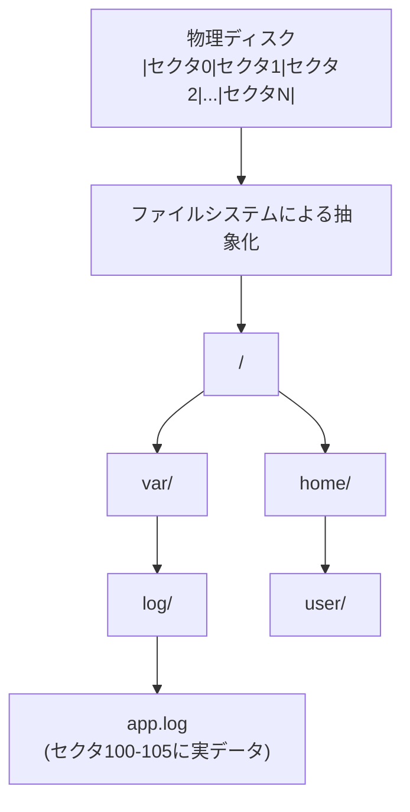

# ファイルシステムとIO

> **一言で言うと:** ディスクI/O（Input/Output）はメモリアクセスの10万倍遅い — この感覚があると「なぜキャッシュが必要か」「なぜDBインデックスが重要か」が直感的に分かる。ファイルシステムはOSがディスク上のバイト列を「ファイル」と「ディレクトリ」という抽象に変換する仕組みであり、すべてのデータ永続化の土台である。

## 3分で全体像

- **何を解決する技術か:** ディスクという「遅くて壊れやすく、セクタ単位でしか書けない」物理デバイスを、「ファイル」「ディレクトリ」というプログラムが扱える抽象に変換する
- **代表的な使用シーン:** ログファイルの読み書き、設定ファイルの読み込み、アップロード/ダウンロード処理、データベースの内部実装、コンテナイメージのレイヤー、設定の原子的な更新
- **これだけは覚える3つ:**
    1. **ディスクはメモリより約10万倍遅い**。だからキャッシュ・バッファ・インデックスが存在する
    2. **`write()` が返ってもディスクには書かれていない**。永続性が必要なら `fsync()` を呼ぶ
    3. **大きなファイルは絶対に全読みしない**。ストリームで処理する（`readFileSync` で 1GB → OOM）
- **AIに任せやすいか:** **一部任せられる** — ストリーミング処理の典型実装、ファイルディスクリプタのリーク防止（`with` / `defer`）、原子的書き込みのテンプレは AI が書ける。一方「ライトバック方式の許容度判断」「fsync を呼ぶ頻度の決定」「ロック方式の選択（アドバイザリ vs 強制）」はデータの重要度・障害耐性要件・他プロセスとの取り決めに依存し、人間が判断する
- **詰まったらここを読む:** [[プロセスとスレッド]] / [[メモリ管理]] / [[ファイルディスクリプタ]]

## なぜ必要か

Webアプリケーションは本質的にデータを読み書きする仕組みである。ユーザーがアップロードした画像、アクセスログ、データベースの中身 — これらはすべて最終的にディスク上のファイルとして保存される。

ファイルシステムとI/Oを理解していないと：
- **パフォーマンスの見積もりができない** — 「ファイルを読むだけ」のAPIが想定より100倍遅い理由が分からない
- **データ破損の原因が分からない** — 書き込み中にサーバーが落ちたとき、なぜファイルが壊れるのか（部分書き込み問題）を理解できない
- **インフラの設計判断ができない** — SSD vs HDD、EBS vs ローカルディスク、NFS vs S3 の使い分けに根拠を持てない
- **DBの挙動が理解できない** — データベースは結局ファイルシステム上に構築されている。[[インデックス]]がなぜ検索を速くするかは、ディスクI/Oの仕組みを知らないと本質的に理解できない

## どの問題を解決するか

### 1. ディスクの複雑さの隠蔽 — ファイルシステムによる抽象化

**課題:** ディスク（HDD/SSD）は物理的にはセクタ（通常512バイト〜4KB）単位でしかデータを読み書きできない。アプリケーション開発者が「セクタ324〜327にバイト列を書き込め」と指示するのは非現実的。

**解決:** ファイルシステム（ext4, NTFS, APFSなど）がディスク上のバイト列を**ファイル**と**ディレクトリ**というツリー構造に抽象化する。開発者は「`/var/log/app.log` に文字列を追記する」とだけ書けばよい。


```mermaid
graph TD
    Disk["物理ディスク<br/>|セクタ0|セクタ1|セクタ2|...|セクタN|"]
    FS["ファイルシステムによる抽象化"]
    Root["/"]
    Var["var/"]
    Log["log/"]
    AppLog["app.log<br/>(セクタ100-105に実データ)"]
    Home["home/"]
    User["user/"]

    Disk --> FS --> Root
    Root --> Var --> Log --> AppLog
    Root --> Home --> User
```

ファイルシステムは内部的に以下を管理する：
- **メタデータ** — ファイル名、サイズ、権限、タイムスタンプ（inode に格納）
- **データブロックの配置** — どのセクタにファイルの中身が格納されているか
- **空き領域の管理** — どのセクタが未使用か

### 2. 速度差の吸収 — バッファリングとキャッシュ

**課題:** CPUやメモリの処理速度とディスクI/Oの速度には圧倒的な差がある。

| 操作 | 所要時間 | メモリとの比率 |
|------|---------|---------------|
| [[メモリ階層とキャッシュ|L1キャッシュ]]参照 | 1 ns | — |
| メモリ参照 | 100 ns | 1x |
| SSD ランダムリード | 16 μs | 160x |
| HDD ランダムリード | 4 ms | 40,000x |
| HDD シーケンシャルリード(1MB) | 2 ms | 20,000x |

**解決:** OSは**ページキャッシュ（Page Cache）**を使い、一度読んだディスクデータをメモリに保持する。同じファイルの2回目以降の読み込みはメモリから返されるため、ディスクアクセスが発生しない。

```javascript
// Node.js — 同じファイルを2回読む
const fs = require('fs');

// 1回目: ディスクから読む（遅い）
const data1 = fs.readFileSync('/var/log/app.log');

// 2回目: OSのページキャッシュから返される（速い）
const data2 = fs.readFileSync('/var/log/app.log');
```

さらに、書き込みも**バッファリング**される。`write()` を呼んでもすぐにディスクに書かれるわけではなく、OSのバッファに溜められてからまとめて書き出される（**[[ライトバックとライトスルー|ライトバック]]**方式）。これにより書き込みの効率が上がるが、バッファがディスクに書き出される前にシステムが落ちるとデータが失われるリスクがある。データの重要度に応じてライトスルーやライトアラウンドなど他の方式を使い分ける必要がある（→ [[ライトバックとライトスルー]]）。

### 3. 複数プロセスからの同時アクセス — ファイルディスクリプタとロック

**課題:** Webサーバーでは複数の[[プロセスとスレッド|プロセス]]が同じログファイルに同時に書き込むことがある。調整なしに書き込むとデータが混ざる。

**解決:** OSは**[[ファイルディスクリプタ]]（File Descriptor, fd）**という抽象を提供する。プロセスがファイルを開くとfdが割り当てられ、各fdは独立した読み書き位置を持つ。fdはファイルだけでなくソケットやパイプにも使われ、UNIX の「すべてはファイルである」という設計の実装基盤となっている（→ [[ファイルディスクリプタ]]）。

```python
# Python — ファイルディスクリプタの確認
import os

f = open('/tmp/test.txt', 'w')
print(f.fileno())  # 3 (0=stdin, 1=stdout, 2=stderr の次)

g = open('/tmp/test.txt', 'r')
print(g.fileno())  # 4 (別のfd)
```

排他制御が必要な場合は**ファイルロック**を使う（→ [[ファイルの排他制御]]）：
- **アドバイザリロック（Advisory Lock）** — 協調的。ロックを確認するかどうかは各プロセスの責任。実務ではこちらが標準
- **強制ロック（Mandatory Lock）** — OSが強制。Linuxではほぼ使われない（5.15以降は非推奨）

### 4. データの永続性保証 — fsyncとジャーナリング

**課題:** ライトバック方式では、OSバッファにあるデータがディスクに書き出される前にクラッシュするとデータが失われる。データベースのトランザクションのように「確実に書き込まれた」保証が必要な場面がある。

**解決:**
- **`fsync()` システムコール** — バッファを強制的にディスクに書き出す。データベースはコミット時にこれを呼ぶ
- **ジャーナリング（Journaling）** — ファイルシステム自体が「変更ログ」を先に書いてから実データを更新する。クラッシュ時にログから復旧できる（ext4, NTFS が採用）

```python
# Python — fsync で確実にディスクに書き込む
f = open('/tmp/important.dat', 'w')
f.write('critical data')
f.flush()           # Python内部バッファ → OSバッファ
os.fsync(f.fileno())  # OSバッファ → ディスク（ここで初めて永続化が保証される）
f.close()
```

## 他の仕組みとどう関係するか

- **下位レイヤーとの関係:**
  - [[データ構造とアルゴリズム]] — ファイルシステムの内部は B-Tree（ディレクトリ検索）や[[ハッシュテーブル]]（ファイル名→inode の変換）などのデータ構造で構築されている
  - [[並行性の基本概念]] — ファイル[[ロック]]や並行書き込みの制御は、[[デッドロック]]を含む並行性の知識が前提

- **同レイヤーとの関係:**
  - [[プロセスとスレッド]] — プロセスごとにファイルディスクリプタテーブルを持つ。`fork()` 時にfdが複製される挙動はサーバー設計に直結する
  - [[メモリ管理]] — ページキャッシュはメモリ上に構築される。メモリが足りなくなるとキャッシュが追い出され、I/O性能が急激に劣化する
  - [[Docker]] — コンテナのファイルシステムはOverlayFS（Union File System）で構成される。レイヤー構造の理解にはファイルシステムの知識が必要
  - [[Linux基本操作]] — `ls`, `chmod`, `df`, `mount` などのコマンドはすべてファイルシステム操作

- **上位レイヤーとの関係:**
  - [[Layer3-データ永続化/_index|Layer 3: データ永続化]] — データベースはファイルシステム上に構築される。[[メモリ階層とキャッシュ|バッファプール]]でディスクデータをメモリにキャッシュし、インデックスがB-Treeで実装される理由は、ディスクI/Oを最小化するため
  - [[Layer5-パフォーマンス/_index|Layer 5: パフォーマンス]] — I/Oバウンドのボトルネック分析にはファイルシステムの知識が不可欠

## 誤解されやすいポイント

### 1. 「`write()` が返ったらデータはディスクに書き込まれている」
**間違い。** `write()` はOSのバッファにデータを渡すだけで、実際のディスク書き込みは後でまとめて行われる（ライトバック）。確実にディスクに書き出すには `fsync()` を呼ぶ必要がある。これを知らないと「正常終了したのにデータが消えた」というバグの原因が理解できない。

### 2. 「SSDだからランダムアクセスのペナルティはない」
**大幅に改善されたが、ゼロではない。** SSDはHDDのようなシークタイムはないが、それでもメモリの160倍は遅い。さらにSSDには書き込み寿命（Write Endurance）があり、大量のランダム書き込みは寿命を縮める。SSDでも**シーケンシャルアクセスのほうがランダムアクセスより速い**という特性は残っている。

### 3. 「ファイルを削除すればディスク容量がすぐ空く」
**必ずしもそうではない。** ファイルを開いているプロセスがある場合、`rm` してもディスク上のデータブロックは解放されない（fdが生きている限りデータにアクセスできる）。ログファイルを削除したのにディスクが空かないという問題は、大抵この原因。対処法はプロセスを再起動するか、ファイルを `truncate` する。

### 4. 「同期I/O（Synchronous I/O）は遅いから常に非同期I/Oを使うべき」
**用途による。** 非同期I/O（Asynchronous I/O）はスループットを向上させるが、コードの複雑さが増す。小さなファイルの読み書きや、起動時の設定ファイル読み込みなどは同期I/Oで十分。Node.jsでも `readFileSync` が存在するのはそのため。問題になるのは**イベントループをブロックする大量の同期I/O**。

## 設計のベストプラクティス

### ストリーミング処理を使う
大きなファイルは全体をメモリに読み込まず、ストリームで少しずつ処理する。

```javascript
// Bad: 1GBのファイルを全部メモリに載せる
const data = fs.readFileSync('huge.csv', 'utf8');
processAllAtOnce(data);

// Good: ストリームで少しずつ処理する
const stream = fs.createReadStream('huge.csv', { encoding: 'utf8' });
stream.on('data', (chunk) => processChunk(chunk));
```

Go は `io.Reader` / `io.Writer` インターフェースが言語設計の根幹にあり、ストリーミング処理が自然に書ける。ファイルサイズに依存しないメモリ消費が実現できる（具体的な消費量の比較は [[メモリバジェット分析]] を参照）。

```go
package main

import (
	"bufio"
	"io"
	"os"
)

func processLargeFile(src, dst string) error {
	// Bad: 全読み込み（ファイルサイズ分のメモリを確保）
	// data, _ := os.ReadFile(src)

	// Good: io.Reader のパイプラインで逐次処理（メモリは数KB）
	in, err := os.Open(src)
	if err != nil {
		return err
	}
	defer in.Close()

	out, err := os.Create(dst)
	if err != nil {
		return err
	}
	defer out.Close()

	// bufio.Scanner で行単位に処理
	scanner := bufio.NewScanner(in)
	writer := bufio.NewWriter(out)
	defer writer.Flush()

	for scanner.Scan() {
		line := scanner.Text()
		processed := processLine(line)
		writer.WriteString(processed + "\n")
	}
	return scanner.Err()
}

// io.Copy を使えばさらにシンプルにストリーミングコピーできる
func copyFile(src, dst string) error {
	in, _ := os.Open(src)
	defer in.Close()
	out, _ := os.Create(dst)
	defer out.Close()
	_, err := io.Copy(out, in) // 内部的に32KBバッファで逐次転送
	return err
}
```

### 一時ファイル＋リネームで原子的に書き込む
書き込み途中でクラッシュしてもファイルが壊れないようにする古典的パターン。

```python
import os
import tempfile

def safe_write(filepath, content):
    dir_name = os.path.dirname(filepath)
    # 同じファイルシステム上に一時ファイルを作る（renameの原子性のため）
    fd, tmp_path = tempfile.mkstemp(dir=dir_name)
    try:
        os.write(fd, content.encode())
        os.fsync(fd)
        os.close(fd)
        os.rename(tmp_path, filepath)  # 同一FS内のrenameは原子的
    except:
        os.close(fd)
        os.unlink(tmp_path)
        raise
```

### ファイルディスクリプタのリーク防止
開いたファイルは必ず閉じる。リークするとfdが枯渇してプロセスが新しいファイル（やソケット）を開けなくなる。

```python
# Bad: 例外で close が呼ばれない可能性
f = open('data.txt')
data = f.read()
f.close()

# Good: with文でリーク防止
with open('data.txt') as f:
    data = f.read()
```

### 適切なバッファサイズを選ぶ
I/Oのバッファサイズはパフォーマンスに大きく影響する。一般的には4KB〜64KBが効率的。

### ログは追記（append）モードで書く
複数プロセスが同じログファイルに書く場合、`O_APPEND` フラグを使えばオフセットの移動と書き込みがアトミックに行われる。実用上、小さな書き込み（数KB程度）であればデータが混在しない。

## AIエージェントとの協働

> このトピックでAIコーディングエージェントと協働するための観点。「AIに何をどこまで任せ、人間は何を判断するか」を整理する。

### AIに任せられる部分 / 人間が判断すべき部分

「実装もレビューもAIに任せられる」前提で人間の最終判断を整理する。

| タスク種類 | 任せ方（実装/レビュー） | 人間の関与 |
|---|---|---|
| ストリーミング処理（`createReadStream` / `pipeline` / `io.Copy`）の実装 | 仕様を渡して実装を任せる | バッファサイズの妥当性、メモリ実測 |
| ファイルディスクリプタリーク防止（`with` / `defer` / `try-finally`）の徹底 | コード生成時に常に組み込ませる | コードレビューでの確認 |
| 原子的書き込み（temp file + rename）のテンプレ実装 | テンプレ実装を任せる | 同一ファイルシステムに temp が置かれているかの確認 |
| **`readFileSync` 等のメモリ爆発リスク検出** | `/review-ai-code` でAIにレビューさせる | 「実データの最大サイズ」と照らした採否判断 |
| `fsync` を呼ぶか/呼ばないかの判断 | AIに「データの重要度」と「期待スループット」を渡してドラフトをもらう | 障害時に何件まで失っていいか（RPO）を踏まえて最終決定 |
| ファイルロック方式（アドバイザリ vs 強制）の選定 | 候補とトレードオフをAIに出させる | 他プロセスとの協調規約、運用上の許容度を踏まえて選ぶ |
| TOCTOU 脆弱性のチェック | AI に Race Condition 観点でレビューさせる | 修正方針（`O_EXCL` / アトミック操作）の最終採否 |

### AI生成コードのレビュー観点（このトピック固有）

AI生成物を受け取ったとき、最低限ここを見る。

1. **ファイル全体をメモリに載せていないか:** `readFileSync` / `fs.readFile` で大きなファイルを処理していないか。ストリーム化が可能な箇所か
2. **`fsync` の呼び方が適切か:** 書き込み毎に `fsync` を呼んでいないか（性能崩壊）/ 逆に重要データで呼び忘れていないか
3. **fd リーク・TOCTOU・固定パスの一時ファイル:** `open` したものを必ず閉じているか、存在チェック→作成のレースがないか、`/tmp/固定名` でシンボリックリンク攻撃に晒されていないか

### 効くプロンプトの型

このトピックに関する実装をAIに依頼するとき、コンテキストとして渡すべき情報・制約・成功基準のテンプレ。

```
# 前提
- ランタイム: Node.js 22 / Python 3.12 / Go 1.22 など
- 想定ファイルサイズ: 中央値 X MB / 最大 Y GB
- 永続性要件: 障害時に直近 N 秒のデータを失っても許容できる / できない
- 同時アクセスするプロセス数: 1 or N
- 配置先: ローカルディスク / NFS / S3 マウント / コンテナの書き込み層

# やってほしいこと
- 〜のファイルを読み書きする処理

# 守ってほしい制約
- ファイルサイズが Y GB に達する可能性があるためストリーム処理にする
- 一時ファイルは tempfile/mkstemp 系で生成、固定パスを使わない
- 重要書き込みは temp file → fsync → rename の原子的書き込みで実装
- fd は必ず with / defer / try-finally で閉じる
- 書き込みごとの fsync は禁止（バッチで呼ぶ）

# 完了の判断基準
- 1GB のテストファイルでメモリ使用量が一定（線形増加しない）
- プロセス kill -9 で書き込み途中でも壊れたファイルが残らない
- fd リークが lsof で検出されない
```

### AI実装のアンチパターン

LLM生成コードで頻出する過剰設計・誤用パターン。レビュー時の照合表として使う。

| アンチパターン | なぜ問題か | レビュー観点 / 対策 |
|---|---|---|
| **全ファイルを `readFileSync` / `readFile` で一括読み込み** — ログ集計・CSV処理などで全データをメモリに展開 | 100MBのログファイルで即OOM、リクエストあたり数百MBのメモリ消費 | ストリームAPI（`createReadStream`、`readline`、`io.Reader`）を使う。サイズ上限が明確な場合のみ全読み許容 |
| **書き込みごとに `fsync` を呼ぶ** — ループ内で各レコード書き込み後に `fsync` | 性能が桁違いに落ちる（数百〜数千倍）。SSD の書き込み寿命も削る | 本当に永続性保証が必要な箇所（トランザクションコミット時など）だけに限定。バッチで呼ぶ |
| **`try-catch` で I/Oエラーを握りつぶす** — `catch { return null }` や `catch { /* ignore */ }` | ディスクフル・権限エラー・ネットワークFS切断が見えなくなり、データロスにつながる | エラーは上位に伝播させる。ログに `errno` まで記録。意図的に握り潰すなら理由をコメントで残す |
| **ファイルの存在確認→作成の[[TOCTOU]]** — `if not exists: create` を分けて書く | チェックと作成の間に他プロセスが割り込み、上書きや権限ミスが起きる | `O_CREAT \| O_EXCL` フラグで原子的に作成。Python なら `mkstemp`、Go なら `os.OpenFile(name, os.O_CREATE\|os.O_EXCL, ...)` |
| **テンポラリファイルを `/tmp` に固定パスで作る** — `/tmp/myapp.tmp` のようなハードコード | 同名ファイルが存在するとシンボリックリンク攻撃の標的になる。複数インスタンス起動時に競合 | `mkstemp` / `mkdtemp` / `tempfile.NamedTemporaryFile` を使い、ユニーク名を生成 |
| **温メモリキャッシュ前提の `readFileSync` 多用** — 「2回目はキャッシュから返るから速い」を期待した実装 | 初回アクセスは遅い、メモリ圧迫時にキャッシュが追い出されると突然遅くなる、コンテナ間でキャッシュは共有されない | キャッシュは Redis などの明示的なキャッシュレイヤーで管理する |

→ レイヤー横断のアンチパターン索引: [[_anti-patterns/_index|AIアンチパターン索引]]

## 具体例

### ディスクI/Oの速度差を体感する（Node.js）

```javascript
const fs = require('fs');
const { performance } = require('perf_hooks');

// 1MB のテストデータ
const data = Buffer.alloc(1024 * 1024, 'x');
fs.writeFileSync('/tmp/test_io.dat', data);

// 1回目の読み込み（ディスクから）
const t1 = performance.now();
fs.readFileSync('/tmp/test_io.dat');
const t2 = performance.now();

// 2回目の読み込み（ページキャッシュから）
const t3 = performance.now();
fs.readFileSync('/tmp/test_io.dat');
const t4 = performance.now();

console.log(`1回目（ディスク）: ${(t2 - t1).toFixed(2)} ms`);
console.log(`2回目（キャッシュ）: ${(t4 - t3).toFixed(2)} ms`);
```

### inode とファイルの関係を確認する（Linux）

```bash
# inode番号を確認
ls -i /etc/hostname
# 出力例: 1234567 /etc/hostname

# ハードリンクを作成（同じinodeを指す別の名前）
ln /tmp/original.txt /tmp/hardlink.txt
ls -i /tmp/original.txt /tmp/hardlink.txt
# 両方とも同じinode番号

# ファイルのメタデータを詳細表示
stat /etc/hostname
```

### 非同期I/Oでイベントループをブロックしない（Node.js）

```javascript
const fs = require('fs/promises');

// サーバーのリクエストハンドラ内で大きなファイルを読む場合
async function handleRequest(req, res) {
  // Good: 非同期 — イベントループをブロックしない
  const config = await fs.readFile('./config.json', 'utf8');

  // Bad: 同期 — この間すべてのリクエストが止まる
  // const config = fs.readFileSync('./config.json', 'utf8');

  res.json(JSON.parse(config));
}
```

## 参考リソース

- **書籍:** 『詳解 UNIXプログラミング』（W. Richard Stevens）— ファイルI/Oの章はバイブル
- **書籍:** 『Operating Systems: Three Easy Pieces』（無料公開）— Persistence の章が該当
- **記事:** Linux カーネルドキュメント — VFS（Virtual File System）の解説
- **コマンド:** `strace` でシステムコールを追跡し、実際のI/O動作を観察できる（`strace -e trace=read,write,open cat /etc/hostname`）

## 理解度セルフチェック

> 答えられなければ本文に戻る。答えはこのファイル内に必ずある。

1. 「メモリアクセスの10万倍遅い」というディスクI/Oの感覚から、なぜ「DBインデックス」「ページキャッシュ」「バッファリング」が必要なのかを30秒で説明できるか
2. `write()` が成功した直後にサーバーが落ちると、書き込みデータは無事か。安全に保存するにはどうすべきか
3. 次のAI生成コードはこのトピックの観点で何が問題か。どう修正すべきか:

```javascript
import fs from 'node:fs';
import os from 'node:os';

// アップロードされたCSVを処理してJSON配列を返す
export function processUpload(csvPath) {
  // 1. CSVを読み込む
  const data = fs.readFileSync(csvPath, 'utf-8');
  const lines = data.split('\n');

  // 2. 結果を一時ファイルに保存
  const tmpFile = '/tmp/processed.json';
  const fd = fs.openSync(tmpFile, 'w');
  for (const line of lines) {
    const json = JSON.stringify(parseLine(line));
    fs.writeSync(fd, json + '\n');
    fs.fsyncSync(fd); // 安全のため毎行fsync
  }

  // 3. 元の場所にコピー
  fs.copyFileSync(tmpFile, csvPath.replace('.csv', '.json'));

  return tmpFile;
}
```

> [!info] 用語ミニ辞典（解答を読む前に）
> - **`fsync(fd)`** — OS のバッファに溜まった書き込みデータを **強制的にディスクに書き出す** システムコール。これを呼ばない限り、`write()` 直後の停電/クラッシュでデータは消える可能性がある。逆に毎回呼ぶと、ディスクの物理書き込み待ちで性能が桁違いに落ちる
> - **ライトバック（Write-Back）** — `write()` を呼ぶと OS のページキャッシュに書かれ、しばらく後にまとめてディスクに書き出される方式。性能は最高だが、書き出し前のクラッシュでデータを失うリスクがある（→ [[ライトバックとライトスルー]]）
> - **TOCTOU (Time-of-Check to Time-of-Use)** — 「チェックした時点」と「使う時点」の間に状態が変わってしまう競合状態。ファイルの存在確認 → 作成を別々に書くと、その隙間に他プロセスが同名ファイルを作れる
> - **シンボリックリンク攻撃** — 攻撃者が `/tmp/myapp.tmp` を別ファイル（例 `/etc/passwd`）へのシンボリックリンクとして事前に作っておくと、被害プロセスが書き込んだ内容で攻撃対象を上書きできてしまう

> [!note]- 解答の指針
> **問1: ディスクI/Oの遅さがもたらす設計の必然**
>
> ディスクアクセスはメモリより約10万倍遅い（HDDで4ms vs メモリで100ns、SSDでも160倍）。この遅さを補うために、コンピュータシステムのほぼ全てのレイヤーに「キャッシュ」が組み込まれている。
>
> - **ページキャッシュ:** OSが「一度読んだファイル」をメモリに保持。同じファイルの2回目以降の読み込みはディスクに行かずメモリから返る → ファイル読み込みの体感が速くなる
> - **バッファリング（ライトバック）:** OS が `write()` のデータをすぐにディスクに書かず、まとめて書き出す → 「小さい書き込み」を「大きい書き込み」に集約してディスクの実効スループットを上げる
> - **DBインデックス:** [[Resources/Study/Layer3-データ永続化/インデックス|インデックス]] は B-Tree などのデータ構造で「目的のレコードがディスクのどこにあるか」を素早く特定する → ディスクアクセス回数を 数百万回 → 数回に減らす
>
> どれも本質は **「遅いディスクをなるべく触らない」** ための仕組み。ディスクI/Oの遅さを意識しないと、なぜこれらが必要かが理解できない。
>
> **問2: `write()` 直後のクラッシュとデータ保護**
>
> 起きていること: 多くのOSはライトバック方式を採用しており、`write()` を呼んでも実際にディスクに書かれるのは「OSがバッファをフラッシュしたとき」。`write()` の戻り値が成功でも、ディスク上にはまだ存在しない。サーバーが落ちるとバッファのデータは消える。
>
> 安全に保存するには:
>
> 1. **`write()` の後に `fsync(fd)` を呼ぶ** — OSバッファ → ディスクの強制書き出しを命令する。これでようやく「電源が落ちてもデータが残る」状態になる
> 2. **アプリ側のバッファも flush** — Pythonの `f.flush()` のように、言語ランタイムのバッファを OS に流すステップも忘れず
>
> ただし `fsync` は遅い（数十ms〜）。**「重要書き込みの最後にだけ呼ぶ」** が原則。データベースは「トランザクションコミット時」だけ呼ぶことで永続性とスループットを両立している（WAL / Write-Ahead Log の設計）。
>
> ```python
> import os
> f = open('/tmp/important.dat', 'w')
> f.write('critical data')
> f.flush()           # Python内部バッファ → OSバッファ
> os.fsync(f.fileno())  # OSバッファ → ディスク（ここで初めて永続化が保証される）
> f.close()
> ```
>
> **問3: AI生成コードの問題点 4 つ**
>
> このコードは「アップロードされたCSVをJSONに変換する」シンプルな処理に見えるが、ファイルシステム/IO の観点で **4 つの問題**を抱えている。
>
> **(a) `readFileSync` で全ファイルをメモリに展開**
>
> `fs.readFileSync(csvPath, 'utf-8')` は CSV 全体を文字列としてメモリに載せる。1GB の CSV をアップロードされたら 1GB のメモリ消費 + `split('\n')` で配列化してさらに数倍。ユーザー数が増えると即 OOM。
>
> 修正: `readline` モジュール + `createReadStream` で行単位ストリーム処理にする。
>
> **(b) 毎行 `fsyncSync` を呼んでいる**
>
> 「安全のため」というコメントが致命的。1万行で1万回の物理ディスク書き込み待ちが発生 → 数十秒〜数分の処理時間。SSD の書き込み寿命も削る。`fsync` は **本当に「ここまで永続化が必要」というコミット点でのみ呼ぶ**。途中行の永続性は通常不要。
>
> 修正: 全行書き終えた後に1回だけ呼ぶか、そもそも今回のように一時ファイル経由なら fsync 自体不要なケースも多い。
>
> **(c) 一時ファイルが固定パス `/tmp/processed.json`**
>
> シンボリックリンク攻撃の標的（攻撃者が事前に `/tmp/processed.json` → `/etc/cron.d/evil` のリンクを作っておけば、書き込み内容で任意ファイルを上書きできる）。複数リクエストが並行で来れば互いに上書きし合う。
>
> 修正: Node.js なら `fs.mkdtempSync(os.tmpdir() + '/upload-')` で一意なディレクトリを作るか、`mkstemp` 相当の関数で一意な名前を取得する。
>
> **(d) `openSync` した fd を閉じていない**
>
> `fs.openSync` で取得した `fd` を `closeSync` していない → fd リーク。長期運用でリクエストごとに fd が増え続け、最終的に `EMFILE: too many open files` でサーバーが新しいファイルを開けなくなる（ソケットも開けないので接続も拒否される）。
>
> 修正: `try-finally` で必ず close、または高レベル API（`fs.promises.writeFile` をストリーム化したもの）を使う。
>
> **修正後の最小構成のポイント:**
> - 入力は `createReadStream` + `readline` でストリーム処理
> - 出力は `createWriteStream` で書き、`pipeline()` で fd管理を委ねる
> - 一時ファイルは `mkdtemp` でユニーク生成
> - `fsync` は処理完了後に1回だけ（必要なら）

## 学習メモ

- ページキャッシュの挙動は `free -m` の `buff/cache` 列で観察できる
- `lsof` コマンドで「削除済みだがfdが生きているファイル」を見つけられる（`lsof +L1`）
- Node.js の `fs.createWriteStream` は内部的にライトバック方式のバッファリングをしている
