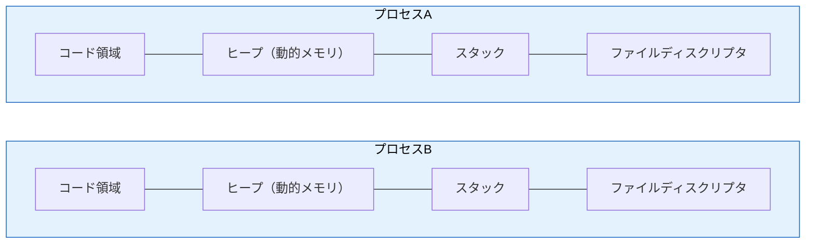
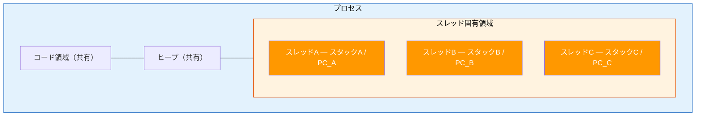

# プロセスとスレッド

> **一言で言うと:** Webサーバーがリクエストをどう捌いているかの根本 — OSが提供する「実行の単位」であるプロセス（Process）とスレッド（Thread）の違いと使い分けを理解することで、Node.jsのシングルスレッドモデルからApacheのマルチプロセスモデルまで、なぜそう設計されているかが分かる。

## なぜ必要か

現代のWebサーバーは、1秒間に数千〜数万のリクエストを処理する。もし1つのリクエストが完了するまで次のリクエストを受け付けられなかったら、ユーザーは何秒も何分も待たされることになる。

プロセスとスレッドを理解していないと：
- **サーバーの設計選定ができない** — Nginx（イベント駆動）、Apache（マルチプロセス/マルチスレッド）、Puma（マルチプロセス×マルチスレッド）のどれを選ぶべきか判断できない
- **リソース消費の原因が分からない** — 「メモリが足りない」が、プロセス数過多なのかメモリリークなのか切り分けられない
- **コンテナ設計が適切にできない** — [[Docker]] のリソース制限（CPU・メモリ）の設定値に根拠を持てない
- **パフォーマンス問題を解決できない** — CPU使用率が25%で頭打ちになる理由（シングルスレッドで1コアしか使えていない）に気づけない

## どの問題を解決するか

### 1. 複数プログラムの同時実行 — プロセスによる隔離

**課題:** 1台のコンピュータで複数のプログラムを同時に動かしたい。しかしあるプログラムのバグが別のプログラムを壊してしまうのは困る。

**解決:** OS はプログラムごとに独立したメモリ空間を持つ**プロセス**を作る。プロセス間はメモリを共有しないため、あるプロセスがクラッシュしても他のプロセスには影響しない。



> 完全に独立 — 互いのメモリにアクセスできない

### 2. 1プログラム内の並行処理 — スレッドによる軽量な並行性

**課題:** 1つのWebサーバープロセス内で複数のリクエストを同時に処理したい。リクエストごとにプロセスを作るのはメモリ消費が大きすぎる。

**解決:** プロセス内に複数の**スレッド**を作る。スレッドはプロセスのメモリ空間を共有するため、生成コストが低く、データの受け渡しも高速。



> メモリを共有 — 高速だが競合状態のリスクあり

### 3. プロセスとスレッドの比較

| 特性 | プロセス | スレッド |
|------|---------|---------|
| メモリ空間 | 独立（隔離されている） | 共有（同じプロセス内） |
| 生成コスト | 高い（数十MB） | 低い（数KB〜数MB） |
| コンテキストスイッチ | 重い（TLBフラッシュ等） | 軽い（メモリ空間の切り替え不要） |
| 通信方法 | IPC（パイプ、ソケット、共有メモリ） | 変数の直接共有 |
| 安全性 | 高い（クラッシュが他に波及しない） | 低い（1スレッドの異常が全体に影響） |
| マルチコア活用 | プロセス単位で分散 | スレッド単位で分散（GIL制約のある言語を除く） |

### 4. Webサーバーのリクエスト処理モデル

この比較が実務で最も重要になるのが、Webサーバーの設計選択。リクエストをどの単位で処理するかによって、スループット・メモリ効率・安定性が大きく変わる。

| モデル | 代表例 | 特徴 |
|--------|--------|------|
| マルチプロセス | Apache prefork, PHP-FPM | 安全だがメモリ消費大 |
| マルチスレッド | Apache worker, Java Servlet | 効率的だが共有状態の管理が必要 |
| ハイブリッド | Puma (Ruby), Go net/http | プロセス×スレッド or 軽量スレッドで両方のメリット |
| イベント駆動 | Nginx, Node.js | 少ないスレッドで大量接続を処理 |
| サーバーレス | AWS Lambda, Vercel | インフラ管理不要、リクエスト単位でスケール |

各モデルの詳細な仕組み・設定例・選定指針は [[Webサーバーとランタイムのリクエスト処理モデル]] を参照。また、各モデルがどのハードウェア構成で最も効果を発揮するかは [[シングルコア・マルチコアとスレッドモデル]] で解説している。

## 他の仕組みとどう関係するか

- **下位レイヤーとの関係:**
  - [[並行性の基本概念]]（Layer 0）— プロセスとスレッドは並行性の「実装手段」。[[ロック]]や[[デッドロック]]といった並行性の問題が、スレッドプログラミングで具体化する
  - [[シングルコア・マルチコアとスレッドモデル]]（Layer 0 details）— コア数×スレッド数の組み合わせによって、並行なのか並列なのかが決まる。プロセス/スレッドモデルの選択はハードウェア構成に依存する

- **同レイヤーとの関係:**
  - [[メモリ管理]]（Layer 1）— プロセスの仮想メモリ空間、スレッドのスタック割り当て、ヒープの共有が直結
  - [[ファイルシステムとIO]]（Layer 1）— ファイルディスクリプタはプロセス単位で管理。I/O待ちがスレッドモデル選択の鍵
  - [[Docker]]（Layer 1）— コンテナの本質は「プロセスの隔離」。Linux の namespace と cgroup でプロセスのリソースを分離する
  - [[Linux基本操作]]（Layer 1）— `ps`, `top`, `htop` でプロセス/スレッドを監視、`kill` でシグナル送信

- **上位レイヤーとの関係:**
  - → [[ロードバランシング]]（Layer 5）: 1プロセスの処理能力に限界があるため、複数サーバー/プロセスへの分散が必要になる
  - → [[非同期処理とメッセージキュー|非同期処理・メッセージキュー]]（Layer 5）: プロセス間の非同期通信の仕組み
  - → TCP/IPソケット（Layer 2）: ネットワーク通信はプロセスが持つソケット（ファイルディスクリプタ）を通じて行う

## 誤解されやすいポイント

### 1. 「スレッドが多ければ多いほど速い」
**実際:** スレッド数がCPUコア数を大幅に超えると、コンテキストスイッチのオーバーヘッドが支配的になり、むしろ遅くなる。CPUバウンドな処理ではスレッド数 ≒ コア数が最適。I/Oバウンドな処理では待ち時間をオーバーラップさせるためにコア数より多くのスレッドが有効だが、それでも上限はある。

### 2. 「プロセスを fork すればメモリが2倍必要」
**実際:** LinuxのCopy-on-Write（CoW）機構により、`fork()` 直後は親プロセスとメモリページを共有する。書き込みが発生した時点で初めてコピーされる。そのため、読み取りが中心のワーカープロセスはメモリ消費が大幅に抑えられる。PHP-FPMやUnicornがマルチプロセスモデルを採用できるのはCoWのおかげ。

### 3. 「Node.js はシングルスレッドだからマルチコアを活用できない」
**実際:** Node.js 自体のJavaScript実行はシングルスレッドだが、`cluster` モジュールで複数のワーカープロセスを起動すれば全コアを活用できる。また、`Worker Threads` を使えば1プロセス内でCPUバウンドな処理をマルチスレッドで並列化できる。I/Oに関しては libuv が内部でスレッドプールを使っている。

```javascript
// cluster モジュールによるマルチプロセス化
import cluster from 'node:cluster';
import http from 'node:http';
import os from 'node:os';

if (cluster.isPrimary) {
  // コア数分のワーカープロセスを起動
  for (let i = 0; i < os.cpus().length; i++) {
    cluster.fork();
  }
} else {
  http.createServer((req, res) => {
    res.end(`Worker ${process.pid}`);
  }).listen(8000);
}
```

### 4. 「コンテナ = 仮想マシン = 独立したOS」
**実際:** コンテナはプロセスの隔離技術であり、ホストOSのカーネルを共有する。`docker run` で起動されるのは通常1つのプロセス（とその子プロセス/スレッド）。仮想マシンとの根本的な違いは「カーネルが別か同じか」にある。

### 5. 「Webアプリ開発者はプロセス/スレッドを意識しなくてよい」
**実際:** フレームワークが抽象化しているとはいえ、以下の場面で直接的な理解が必要：
- PHP-FPM の `pm.max_children` 設定（ワーカープロセス数がメモリ上限を決める）
- Puma の `workers` × `threads` の設定
- Docker の `--cpus` や `--memory` 制限の根拠
- 「メモリが足りない」「CPU使用率が低いのに遅い」問題の原因特定

## 設計のベストプラクティス

### 推奨パターン

1. **I/Oバウンドにはイベント駆動/非同期、CPUバウンドにはマルチプロセス**
   ほとんどのWebアプリケーションはI/Oバウンド（DB問い合わせ、API呼び出し待ち）であるため、イベント駆動モデル（Node.js, Nginx）が効率的。画像処理や暗号化などCPUバウンドな処理は別プロセス/ワーカーに切り出す。

2. **プロセスプールを適切にサイズする**
   `max_workers = 利用可能メモリ / 1プロセスのメモリ消費` を目安にする。過多はOOM Killer、過少はリクエスト待ちの原因。

3. **Graceful Shutdown を実装する**
   プロセスを停止する際、処理中のリクエストを完了させてから終了する。`SIGTERM` を受けたら新規リクエストの受付を停止し、進行中のリクエスト完了後に終了する。

4. **プロセス間の共有状態は外部ストアに置く**
   セッション情報やキャッシュをプロセスのメモリに持つと、スケールアウト時に問題が起きる。Redis や Memcached のような外部ストアを使う。

### アンチパターン

- **fork爆弾** — プロセス数を制限せずに fork し続け、システムリソースを枯渇させる
- **プロセス内のグローバル状態への依存** — マルチプロセスモデルでは各プロセスが独立したメモリを持つため、グローバル変数でデータ共有はできない
- **シグナルハンドリングの無視** — `SIGTERM` を無視すると、デプロイ時にリクエストが途中で切断される

## AIによる実装のアンチパターン

| アンチパターン | なぜ問題か | 対策 |
|---|---|---|
| CPUバウンド処理をイベントループ内で実行 | Node.js のイベントループがブロックされ、全リクエストが停止する | Worker Threads やマイクロサービスに分離する |
| 全リクエストにプロセスを fork | fork のコストが高く、同時接続数が増えると破綻する | スレッドプール、イベント駆動、または接続プールを使う |
| `process.exit()` の安易な使用 | 処理中のリクエストが強制切断される | Graceful Shutdown パターンを実装する |
| sleep/busy-wait でプロセス間同期 | CPUを浪費し、タイミング依存のバグを生む | IPC（パイプ、メッセージキュー）や外部ストアで同期する |

## 具体例

### プロセスの生成と通信（Python）

```python
import multiprocessing
import os

def worker(name, conn):
    """子プロセスで実行される関数"""
    pid = os.getpid()
    conn.send(f"Worker {name} (PID: {pid}) 処理完了")
    conn.close()

if __name__ == "__main__":
    print(f"親プロセス PID: {os.getpid()}")

    # パイプによるプロセス間通信
    parent_conn, child_conn = multiprocessing.Pipe()
    p = multiprocessing.Process(target=worker, args=("A", child_conn))
    p.start()

    message = parent_conn.recv()  # 子プロセスからのメッセージを受信
    print(f"受信: {message}")
    p.join()
    # → 親プロセス PID: 1234
    # → 受信: Worker A (PID: 1235) 処理完了
```

### スレッドの共有メモリとロック（Go）

```go
package main

import (
	"fmt"
	"sync"
)

func main() {
	var counter int
	var mu sync.Mutex
	var wg sync.WaitGroup

	// 10個のゴルーチン（軽量スレッド）が共有カウンタをインクリメント
	for i := 0; i < 10; i++ {
		wg.Add(1)
		go func() {
			defer wg.Done()
			for j := 0; j < 10000; j++ {
				mu.Lock()
				counter++
				mu.Unlock()
			}
		}()
	}

	wg.Wait()
	fmt.Printf("最終カウンタ: %d (期待値: 100000)\n", counter)
	// → 最終カウンタ: 100000 (期待値: 100000)
}
```

### Linuxでのプロセス・スレッド確認

```bash
# プロセス一覧（ツリー表示）
$ ps auxf

# 特定プロセスのスレッド数を確認
$ ps -o pid,nlwp,comm -p <PID>
# PID   NLWP COMMAND
# 1234    16 node        ← 16スレッドで動作中

# プロセスのメモリ消費を確認
$ ps -o pid,rss,vsz,comm -p <PID>
# PID   RSS    VSZ    COMMAND
# 1234  45000  890000 node    ← RSS: 実メモリ45MB

# PHP-FPM のワーカープロセス確認
$ ps aux | grep php-fpm
# root  1000  0.0  0.2  php-fpm: master process
# www   1001  0.1  1.5  php-fpm: pool www    ← ワーカー1
# www   1002  0.1  1.5  php-fpm: pool www    ← ワーカー2
```

## 参考リソース

- *Operating System Concepts*（通称「恐竜本」）— Chapter 3: Processes, Chapter 4: Threads & Concurrency
- *The Linux Programming Interface* — Michael Kerrisk（Linux のプロセス・スレッドAPIを網羅的に解説）
- Node.js 公式ドキュメント「Cluster」「Worker Threads」— シングルスレッドの制約をどう克服するか
- *Designing Data-Intensive Applications* — Martin Kleppmann（分散プロセス間の通信と整合性）
- Nginx 公式ブログ「Inside NGINX: How We Designed for Performance & Scale」— イベント駆動モデルの設計思想

## 学習メモ

- プロセスとスレッドの違いは「メモリ空間が独立か共有か」に集約される。この1点から、安全性・コスト・通信方法の差がすべて導かれる
- Webサーバーの設計モデルは「プロセス vs スレッド vs イベント駆動」の三択ではなく、組み合わせで使うことが多い（例: Nginx + PHP-FPM、Puma のマルチプロセス×マルチスレッド）
- Layer 0 の[[並行性の基本概念]]が「なぜ問題が起きるか」の理論、このトピックが「OSがどう実装しているか」の実践にあたる
