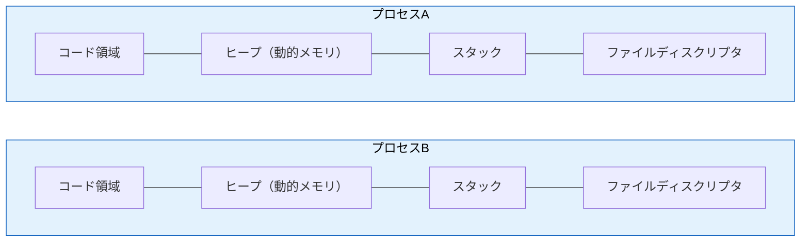

# プロセスとスレッド

> **一言で言うと:** Webサーバーがリクエストをどう捌いているかの根本 — OSが提供する「実行の単位」であるプロセス（Process）とスレッド（Thread）の違いと使い分けを理解することで、Node.jsのシングルスレッドモデルからApacheのマルチプロセスモデルまで、なぜそう設計されているかが分かる。

## 3分で全体像

- **何を解決する技術か:** 1台のマシンで複数のプログラム/リクエストを同時に動かしつつ、互いを壊さない実行単位を OS レベルで提供する
- **代表的な使用シーン:** Webサーバーのリクエスト処理モデル選定（Apache prefork / Puma / Node.js / Lambda）、Docker のリソース制限設計、CPU/メモリのチューニング、Graceful Shutdown の実装
- **これだけは覚える3つ:**
    1. **プロセス = メモリ独立、スレッド = メモリ共有**。ここから安全性・コスト・通信方法の差が全部導かれる
    2. **I/Oバウンドにはイベント駆動/非同期、CPUバウンドにはマルチプロセス/Worker**。Webアプリの大半はI/Oバウンド
    3. **スレッド数を増やせば速くなるは嘘**。CPUコア数を大幅に超えるとコンテキストスイッチで遅くなる
- **AIに任せやすいか:** **一部任せられる** — Worker Threads や `cluster` の典型的セットアップ、Graceful Shutdown のテンプレ実装は AI が書ける。一方「ワーカー数の決定」「シグナルハンドリングの設計」「実環境のメモリ上限を踏まえたプロセスプール設計」は実データと運用文脈に強く依存するため、人間が最終判断する
- **詰まったらここを読む:** [[並行性の基本概念]] / [[メモリ管理]] / [[Docker]]

## なぜ必要か

現代のWebサーバーは、1秒間に数千〜数万のリクエストを処理する。もし1つのリクエストが完了するまで次のリクエストを受け付けられなかったら、ユーザーは何秒も何分も待たされることになる。

プロセスとスレッドを理解していないと：
- **サーバーの設計選定ができない** — Nginx（イベント駆動）、Apache（マルチプロセス/マルチスレッド）、Puma（マルチプロセス×マルチスレッド）のどれを選ぶべきか判断できない
- **リソース消費の原因が分からない** — 「メモリが足りない」が、プロセス数過多なのかメモリリークなのか切り分けられない
- **コンテナ設計が適切にできない** — [[Docker]] のリソース制限（CPU・メモリ）の設定値に根拠を持てない
- **パフォーマンス問題を解決できない** — CPU使用率が25%で頭打ちになる理由（シングルスレッドで1コアしか使えていない）に気づけない

## どの問題を解決するか

### 1. 複数プログラムの同時実行 — プロセスによる隔離

**課題:** 1台のコンピュータで複数のプログラムを同時に動かしたい。しかしあるプログラムのバグが別のプログラムを壊してしまうのは困る。

**解決:** OS はプログラムごとに独立したメモリ空間を持つ**プロセス**を作る。プロセス間はメモリを共有しないため、あるプロセスがクラッシュしても他のプロセスには影響しない。


```mermaid
graph TD
    subgraph PA["プロセスA"]
        codeA["コード領域"]
        heapA["ヒープ（動的メモリ）"]
        stackA["スタック"]
        fdA["ファイルディスクリプタ"]
        codeA --- heapA --- stackA --- fdA
    end

    subgraph PB["プロセスB"]
        codeB["コード領域"]
        heapB["ヒープ（動的メモリ）"]
        stackB["スタック"]
        fdB["ファイルディスクリプタ"]
        codeB --- heapB --- stackB --- fdB
    end

    PA ~~~ PB

    style PA fill:#e3f2fd,stroke:#1565c0,color:#000
    style PB fill:#e3f2fd,stroke:#1565c0,color:#000
```

> 完全に独立 — 互いのメモリにアクセスできない

### 2. 1プログラム内の並行処理 — スレッドによる軽量な並行性

**課題:** 1つのWebサーバープロセス内で複数のリクエストを同時に処理したい。リクエストごとにプロセスを作るのはメモリ消費が大きすぎる。

**解決:** プロセス内に複数の**スレッド**を作る。スレッドはプロセスのメモリ空間を共有するため、生成コストが低く、データの受け渡しも高速。


```mermaid
graph TD
    subgraph proc["プロセス"]
        code["コード領域（共有）"]
        heap["ヒープ（共有）"]

        subgraph threads["スレッド固有領域"]
            sA["スレッドA — スタックA / PC_A"]
            sB["スレッドB — スタックB / PC_B"]
            sC["スレッドC — スタックC / PC_C"]
        end

        code --- heap --- threads
    end

    style proc fill:#e3f2fd,stroke:#1565c0,color:#000
    style threads fill:#fff3e0,stroke:#e65100,color:#000
    style sA fill:#ff9800,color:#fff
    style sB fill:#ff9800,color:#fff
    style sC fill:#ff9800,color:#fff
```

> メモリを共有 — 高速だが競合状態のリスクあり

### 3. プロセスとスレッドの比較

| 特性 | プロセス | スレッド |
|------|---------|---------|
| メモリ空間 | 独立（隔離されている） | 共有（同じプロセス内） |
| 生成コスト | 高い（数十MB） | 低い（数百KB〜数MB、Goroutine等の軽量スレッドは数KB） |
| コンテキストスイッチ | 重い（TLBフラッシュ等） | 軽い（メモリ空間の切り替え不要） |
| 通信方法 | IPC（パイプ、ソケット、共有メモリ） | 変数の直接共有 |
| 安全性 | 高い（クラッシュが他に波及しない） | 低い（1スレッドの異常が全体に影響） |
| マルチコア活用 | プロセス単位で分散 | スレッド単位で分散（GIL制約のある言語を除く） |

### 4. Webサーバーのリクエスト処理モデル

この比較が実務で最も重要になるのが、Webサーバーの設計選択。リクエストをどの単位で処理するかによって、スループット・メモリ効率・安定性が大きく変わる。

| モデル | 代表例 | 特徴 |
|--------|--------|------|
| マルチプロセス | Apache prefork, PHP-FPM | 安全だがメモリ消費大 |
| マルチスレッド | Apache worker, Java Servlet | 効率的だが共有状態の管理が必要 |
| ハイブリッド | Puma (Ruby), Go net/http | プロセス×スレッド or 軽量スレッドで両方のメリット |
| イベント駆動 | Nginx, Node.js | 少ないスレッドで大量接続を処理 |
| サーバーレス | AWS Lambda, Vercel | インフラ管理不要、リクエスト単位でスケール |

各モデルの詳細な仕組み・設定例・選定指針は [[Webサーバーとランタイムのリクエスト処理モデル]] を参照。また、各モデルがどのハードウェア構成で最も効果を発揮するかは [[シングルコア・マルチコアとスレッドモデル]] で解説している。

## 他の仕組みとどう関係するか

- **下位レイヤーとの関係:**
  - [[並行性の基本概念]]（Layer 0）— プロセスとスレッドは並行性の「実装手段」。[[ロック]]や[[デッドロック]]といった並行性の問題が、スレッドプログラミングで具体化する
  - [[シングルコア・マルチコアとスレッドモデル]]（Layer 0 details）— コア数×スレッド数の組み合わせによって、並行なのか並列なのかが決まる。プロセス/スレッドモデルの選択はハードウェア構成に依存する

- **同レイヤーとの関係:**
  - [[メモリ管理]]（Layer 1）— プロセスの仮想メモリ空間、スレッドのスタック割り当て、ヒープの共有が直結
  - [[ファイルシステムとIO]]（Layer 1）— ファイルディスクリプタはプロセス単位で管理。I/O待ちがスレッドモデル選択の鍵
  - [[Docker]]（Layer 1）— コンテナの本質は「プロセスの隔離」。Linux の namespace と cgroup でプロセスのリソースを分離する
  - [[Linux基本操作]]（Layer 1）— `ps`, `top`, `htop` でプロセス/スレッドを監視、`kill` でシグナル送信

- **上位レイヤーとの関係:**
  - → [[ロードバランシング]]（Layer 5）: 1プロセスの処理能力に限界があるため、複数サーバー/プロセスへの分散が必要になる
  - → [[非同期処理とメッセージキュー|非同期処理・メッセージキュー]]（Layer 5）: プロセス間の非同期通信の仕組み
  - → TCP/IPソケット（Layer 2）: ネットワーク通信はプロセスが持つソケット（ファイルディスクリプタ）を通じて行う

## 誤解されやすいポイント

### 1. 「スレッドが多ければ多いほど速い」
**実際:** スレッド数がCPUコア数を大幅に超えると、コンテキストスイッチのオーバーヘッドが支配的になり、むしろ遅くなる。CPUバウンドな処理ではスレッド数 ≒ コア数が最適。I/Oバウンドな処理では待ち時間をオーバーラップさせるためにコア数より多くのスレッドが有効だが、それでも上限はある。

### 2. 「プロセスを fork すればメモリが2倍必要」
**実際:** LinuxのCopy-on-Write（CoW）機構により、`fork()` 直後は親プロセスとメモリページを共有する。書き込みが発生した時点で初めてコピーされる。そのため、読み取りが中心のワーカープロセスはメモリ消費が大幅に抑えられる。PHP-FPMやUnicornがマルチプロセスモデルを採用できるのはCoWのおかげ。

### 3. 「Node.js はシングルスレッドだからマルチコアを活用できない」
**実際:** Node.js 自体のJavaScript実行はシングルスレッドだが、`cluster` モジュールで複数のワーカープロセスを起動すれば全コアを活用できる。また、`Worker Threads` を使えば1プロセス内でCPUバウンドな処理をマルチスレッドで並列化できる。I/Oに関しては libuv が内部でスレッドプールを使っている。

```javascript
// cluster モジュールによるマルチプロセス化
import cluster from 'node:cluster';
import http from 'node:http';
import os from 'node:os';

if (cluster.isPrimary) {
  // コア数分のワーカープロセスを起動
  for (let i = 0; i < os.cpus().length; i++) {
    cluster.fork();
  }
} else {
  http.createServer((req, res) => {
    res.end(`Worker ${process.pid}`);
  }).listen(8000);
}
```

### 4. 「コンテナ = 仮想マシン = 独立したOS」
**実際:** コンテナはプロセスの隔離技術であり、ホストOSのカーネルを共有する。`docker run` で起動されるのは通常1つのプロセス（とその子プロセス/スレッド）。仮想マシンとの根本的な違いは「カーネルが別か同じか」にある。

### 5. 「Webアプリ開発者はプロセス/スレッドを意識しなくてよい」
**実際:** フレームワークが抽象化しているとはいえ、以下の場面で直接的な理解が必要：
- PHP-FPM の `pm.max_children` 設定（ワーカープロセス数がメモリ上限を決める）
- Puma の `workers` × `threads` の設定
- Docker の `--cpus` や `--memory` 制限の根拠
- 「メモリが足りない」「CPU使用率が低いのに遅い」問題の原因特定

## 設計のベストプラクティス

### 推奨パターン

1. **I/Oバウンドにはイベント駆動/非同期、CPUバウンドにはマルチプロセス**
   ほとんどのWebアプリケーションはI/Oバウンド（DB問い合わせ、API呼び出し待ち）であるため、イベント駆動モデル（Node.js, Nginx）が効率的。画像処理や暗号化などCPUバウンドな処理は別プロセス/ワーカーに切り出す。

2. **プロセスプールを適切にサイズする**
   `max_workers = 利用可能メモリ / 1プロセスのメモリ消費` を目安にする。過多はOOM Killer、過少はリクエスト待ちの原因。

3. **Graceful Shutdown を実装する**
   プロセスを停止する際、処理中のリクエストを完了させてから終了する。`SIGTERM` を受けたら新規リクエストの受付を停止し、進行中のリクエスト完了後に終了する。

4. **プロセス間の共有状態は外部ストアに置く**
   セッション情報やキャッシュをプロセスのメモリに持つと、スケールアウト時に問題が起きる。Redis や Memcached のような外部ストアを使う。

### アンチパターン

- **fork爆弾** — プロセス数を制限せずに fork し続け、システムリソースを枯渇させる
- **プロセス内のグローバル状態への依存** — マルチプロセスモデルでは各プロセスが独立したメモリを持つため、グローバル変数でデータ共有はできない
- **シグナルハンドリングの無視** — `SIGTERM` を無視すると、デプロイ時にリクエストが途中で切断される。Docker コンテナでは PID 1 がシグナルを無視するカーネル仕様と相まって深刻化する（[[孤児プロセスとゾンビプロセス]] を参照）
- **子プロセスの `wait()` 忘れ** — 終了済みの子が[[孤児プロセスとゾンビプロセス|ゾンビプロセス]]として PID 番号空間を消費し、長期稼働で `pid_max` 到達によるシステム停止を招く

## AIエージェントとの協働

> このトピックでAIコーディングエージェントと協働するための観点。「AIに何をどこまで任せ、人間は何を判断するか」を整理する。

### AIに任せられる部分 / 人間が判断すべき部分

「実装もレビューもAIに任せられる」前提で人間の最終判断を整理する。

| タスク種類 | 任せ方（実装/レビュー） | 人間の関与 |
|---|---|---|
| `cluster` / Worker Threads / Goroutine の典型的セットアップ | 仕様を渡して実装を任せる | 動作確認とプロセス数のチューニング |
| Graceful Shutdown（SIGTERM ハンドラ）の実装 | テンプレ実装を任せる | 進行中処理の最大待ち時間の決定、外部への通知タイミング |
| `cluster.fork()` の数 = `os.cpus().length` の自動化 | コードを任せる | コンテナの cpu 制限と実コア数の食い違いをチェック（cgroup の制限は `os.cpus()` には反映されない場合がある） |
| **CPUバウンド処理の検出/分離提案** | `/review-ai-code` でAIにレビューさせる | 「この処理が本当にCPUバウンドか」をプロファイラで確認 |
| サーバープロセスのメモリ・スレッド監視コード | 実装を任せる | 監視閾値の決定、アラート連携先 |
| プロセスプールサイズ（Puma `workers`/`threads`、PHP-FPM `pm.max_children`）の決定 | AI に「メモリ消費 X MB、ホスト Y GB」と渡してドラフトをもらう | 実データの分布、ピーク時間帯の挙動、OOM Killer の発動余地を踏まえて最終決定 |
| シグナルハンドリングの設計 | 一般論はAIに任せる | PID 1 問題（[[孤児プロセスとゾンビプロセス]]）、コンテナ環境特有の挙動への対処は人間が判断 |

### AI生成コードのレビュー観点（このトピック固有）

AI生成物を受け取ったとき、最低限ここを見る。

1. **イベントループをブロックしていないか:** Node.js で `crypto.pbkdf2Sync` のような同期 CPU 集約処理、`fs.readFileSync` の大ファイル読み込み、長い `JSON.parse` などをハンドラ内に置いていないか
2. **シャットダウン時に処理中のリクエストが切断されないか:** `process.exit()` の即時呼び出し、`server.close()` のコールバック待ちなしで終了していないか。コンテナの `STOPSIGNAL` と一致しているか
3. **プロセス/スレッドの上限が無防備か:** リクエストごとに `fork`/`spawn`、ワーカー数の上限なし、Worker Threads の使い回しがない実装になっていないか

### 効くプロンプトの型

このトピックに関する実装をAIに依頼するとき、コンテキストとして渡すべき情報・制約・成功基準のテンプレ。

```
# 前提
- ランタイム: Node.js 22 / Puma 6 / etc.
- デプロイ環境: Docker コンテナ (cpu 制限 X, memory 制限 Y MB)
- 1リクエストあたりの平均メモリ消費: Z MB
- I/O 比率: ほぼI/Oバウンド / CPUバウンドの比率 N%
- Graceful Shutdown のタイムアウト要件: 既存設定 or 未定

# やってほしいこと
- 〜のサーバープロセスモデル（cluster/Worker/イベント駆動）でのセットアップ
- SIGTERM受信時の Graceful Shutdown 実装

# 守ってほしい制約
- ワーカー数を環境変数 or cgroup の値から取得（os.cpus().length をそのまま使わない）
- 同期ブロッキングAPI（fs.readFileSync、crypto.*Sync）をハンドラ内に書かない
- process.exit() を即時呼び出さず、server.close() のコールバックを待つ
- 内部関数に過剰なnullチェック・try/catchを足さない

# 完了の判断基準
- ワーカー数がコンテナの制限と一致する
- SIGTERM 受信から N 秒以内に新規受付停止 → 進行中処理完了 → 終了
- 単体テストで Graceful Shutdown のタイムアウト挙動を再現できる
```

### AI実装のアンチパターン

LLM生成コードで頻出する過剰設計・誤用パターン。レビュー時の照合表として使う。

| アンチパターン | なぜ問題か | レビュー観点 / 対策 |
|---|---|---|
| **CPUバウンド処理をイベントループ内で実行** — JSON の重い変換、暗号化、画像処理を `await` なしで書く | Node.js のイベントループがブロックされ、全リクエストが停止する | Worker Threads / Worker Process / 専用マイクロサービスに分離。ハンドラ内では `await` 可能なAPI（`pbkdf2`, `crypto.subtle`）を使う |
| **全リクエストに `fork` / `spawn`** — リクエストごとに子プロセスを起動して処理委譲 | fork のコストが高く、同時接続数が増えるとプロセステーブル枯渇・OOM | スレッドプール、Worker プール、または[[プロセスとスレッド\|イベント駆動]]を使う |
| **`process.exit()` の安易な使用** — エラー発生時に即座に `process.exit(1)` | 処理中のリクエストが強制切断され、ユーザーに 502 が返る | エラーをログに出し `server.close()` を呼んでコールバックで終了。Graceful Shutdown パターン |
| **sleep/busy-wait でプロセス間同期** — `while (!flag) {}` や setTimeout を使った待機 | CPUを浪費し、タイミング依存のバグを生む | IPC（パイプ、メッセージキュー）、`SharedArrayBuffer + Atomics`、または Redis などの外部ストアで同期 |
| **`os.cpus().length` で無条件にワーカー数決定** — Docker のCPU制限を無視してホストのコア数で fork | コンテナの cpu quota を超えるワーカーを起動し、コンテキストスイッチで性能劣化 | `--cpus` の値や cgroup の `cpu.max` を読み、コンテナに合わせた数を採用 |

→ レイヤー横断のアンチパターン索引: [[_anti-patterns/_index|AIアンチパターン索引]]

## 具体例

### プロセスの生成と通信（Python）

```python
import multiprocessing
import os

def worker(name, conn):
    """子プロセスで実行される関数"""
    pid = os.getpid()
    conn.send(f"Worker {name} (PID: {pid}) 処理完了")
    conn.close()

if __name__ == "__main__":
    print(f"親プロセス PID: {os.getpid()}")

    # パイプによるプロセス間通信
    parent_conn, child_conn = multiprocessing.Pipe()
    p = multiprocessing.Process(target=worker, args=("A", child_conn))
    p.start()

    message = parent_conn.recv()  # 子プロセスからのメッセージを受信
    print(f"受信: {message}")
    p.join()
    # → 親プロセス PID: 1234
    # → 受信: Worker A (PID: 1235) 処理完了
```

### スレッドの共有メモリとロック（Go）

```go
package main

import (
	"fmt"
	"sync"
)

func main() {
	var counter int
	var mu sync.Mutex
	var wg sync.WaitGroup

	// 10個のゴルーチン（軽量スレッド）が共有カウンタをインクリメント
	for i := 0; i < 10; i++ {
		wg.Add(1)
		go func() {
			defer wg.Done()
			for j := 0; j < 10000; j++ {
				mu.Lock()
				counter++
				mu.Unlock()
			}
		}()
	}

	wg.Wait()
	fmt.Printf("最終カウンタ: %d (期待値: 100000)\n", counter)
	// → 最終カウンタ: 100000 (期待値: 100000)
}
```

### Linuxでのプロセス・スレッド確認

```bash
# プロセス一覧（ツリー表示）
$ ps auxf

# 特定プロセスのスレッド数を確認
$ ps -o pid,nlwp,comm -p <PID>
# PID   NLWP COMMAND
# 1234    16 node        ← 16スレッドで動作中

# プロセスのメモリ消費を確認
$ ps -o pid,rss,vsz,comm -p <PID>
# PID   RSS    VSZ    COMMAND
# 1234  45000  890000 node    ← RSS: 実メモリ45MB

# PHP-FPM のワーカープロセス確認
$ ps aux | grep php-fpm
# root  1000  0.0  0.2  php-fpm: master process
# www   1001  0.1  1.5  php-fpm: pool www    ← ワーカー1
# www   1002  0.1  1.5  php-fpm: pool www    ← ワーカー2
```

## 参考リソース

- *Operating System Concepts*（通称「恐竜本」）— Chapter 3: Processes, Chapter 4: Threads & Concurrency
- *The Linux Programming Interface* — Michael Kerrisk（Linux のプロセス・スレッドAPIを網羅的に解説）
- Node.js 公式ドキュメント「Cluster」「Worker Threads」— シングルスレッドの制約をどう克服するか
- *Designing Data-Intensive Applications* — Martin Kleppmann（分散プロセス間の通信と整合性）
- Nginx 公式ブログ「Inside NGINX: How We Designed for Performance & Scale」— イベント駆動モデルの設計思想

## 理解度セルフチェック

> 答えられなければ本文に戻る。答えはこのファイル内に必ずある。

1. プロセスとスレッドの根本的な違いを「メモリ」と「生成コスト」「クラッシュ時の影響範囲」の3軸で30秒で説明できるか
2. 「Node.js はシングルスレッドだからマルチコアを活用できない」は誤解である。なぜか。どう活用するか
3. 次のAI生成コードはこのトピックの観点で何が問題か。どう修正すべきか（※ `import crypto from 'node:crypto'` は省略している）:

```javascript
import cluster from 'node:cluster';
import http from 'node:http';
import os from 'node:os';
import crypto from 'node:crypto';

if (cluster.isPrimary) {
  // ホストの全コアでワーカーを起動
  for (let i = 0; i < os.cpus().length; i++) {
    cluster.fork();
  }
} else {
  http.createServer((req, res) => {
    // パスワードハッシュ化(同期API)
    const hash = crypto.pbkdf2Sync(req.headers['x-password'], 'salt', 100000, 64, 'sha512');
    res.end(hash.toString('hex'));
  }).listen(8000);

  // SIGTERM受信時に即座に終了
  process.on('SIGTERM', () => process.exit(0));
}
```

> [!info] 用語ミニ辞典（解答を読む前に）
> - **コンテナのCPU制限（cpu quota / cgroup の `cpu.max`）** — Docker や Kubernetes でコンテナに割り当てる「使用可能 CPU 時間の上限」。`--cpus=2` ならホストが 16 コアでも、このコンテナは 2 コア分の CPU 時間しか使えない
> - **イベントループ（Event Loop）** — Node.js の心臓部。1つのスレッドで「I/O待ちのコールバックを順次実行」するループ。このスレッドが同期処理でブロックされると、サーバー全体がフリーズする
> - **`pbkdf2Sync`** — パスワードハッシュ化関数の **同期版**。計算に数百ms〜数秒かかる重い処理。同期版を使うとイベントループがその間止まる。非同期版 `pbkdf2` を使えばCループ内で計算が走り、イベントループは別のリクエストを処理できる
> - **Graceful Shutdown** — サーバーを停止する際、進行中のリクエストを完了させてから終了する仕組み。`server.close()` を呼ぶと「新規接続の受付停止 + 既存接続の処理完了を待ってからコールバック発火」となる。`process.exit()` は今すぐ強制終了

> [!note]- 解答の指針
> **問1: プロセスとスレッドの違い（30秒）**
>
> - **メモリ:** プロセスは独立したメモリ空間を持ち、互いにアクセスできない。スレッドはプロセス内のメモリ（コード領域・ヒープ）を共有する
> - **生成コスト:** プロセスは新規メモリ空間の確保が必要で重い（数十MB / 数ms〜）。スレッドは共有メモリ + 固有スタック（数百KB〜数MB）だけなので軽い。Goroutine などの軽量スレッドはさらに数KBレベル
> - **クラッシュ時の影響:** プロセスは独立しているので 1 つが落ちても他に波及しない。スレッドは 1 つが異常終了するとプロセス全体（全スレッド）が巻き添えで死ぬ
>
> この3点が「マルチプロセスは安全だがメモリ重い、マルチスレッドは効率的だが共有状態の管理が必要」という設計判断の源泉になる。
>
> **問2: Node.js とマルチコアの関係**
>
> 起きていること: Node.js のメインスレッド（JavaScript 実行スレッド）は確かに 1 本だけ。しかし「サーバープロセス全体が 1 コアしか使えない」わけではない。
>
> 活用方法は3つ:
>
> - **`cluster` モジュール** — マスタープロセスがコア数分の **ワーカープロセス** を `fork` する。各ワーカーは独立した Node.js プロセスで、独立したイベントループを持つ。これでコア数分のスループットが出る
> - **`Worker Threads`** — 1プロセス内で複数のJavaScript実行スレッドを起動。CPUバウンドな処理（画像処理・暗号化など）を別スレッドに逃がせる
> - **libuv のスレッドプール** — Node.js の I/O（ファイル読み書き、`crypto.pbkdf2` の非同期版など）は内部でC++スレッドプール（デフォルト4本）に投げられ、イベントループと並行して走る
>
> 「Node.js = シングルスレッド」は **JavaScript 実行スレッドが 1 本** という意味。プロセスやワーカースレッドのレイヤーで複数並べることでマルチコアは普通に活用できる。
>
> **問3: AI生成コードの問題点 3 つ**
>
> このコードは一見「クラスタ化された Node.js サーバー」だが、**プロセスとスレッドの観点で 3 つの致命的な問題**を抱えている。
>
> **(a) `os.cpus().length` を無条件で使っている**
>
> `os.cpus()` はホストOSのCPUコア数を返す。しかし Docker や Kubernetes でコンテナを動かす場合、`--cpus=2` のように cpu quota が設定されていることが多い。ホストが 16 コアでもコンテナの実効コア数は 2 のため、16 ワーカー起動するとコンテキストスイッチが激増して逆に遅くなる。
>
> 修正: 環境変数（例 `WORKERS`）または cgroup の `cpu.max` を読む。Kubernetes なら `Downward API` で resource limit を環境変数化する。
>
> **(b) `pbkdf2Sync` を HTTP ハンドラ内で呼んでいる**
>
> これが最も深刻。`pbkdf2Sync` は計算に **数百ms〜数秒** かかる同期処理。1リクエスト処理中、そのワーカーのイベントループ全体がブロックされる。**他のリクエストが全部待たされる**ことになり、cluster でワーカーを並べていても処理能力が一気に落ちる。
>
> 修正: 非同期版 `crypto.pbkdf2(password, salt, iterations, keylen, digest, callback)` を使う（または `util.promisify` でラップして `await`）。これで計算は libuv スレッドプールに投げられ、イベントループは別リクエストを処理できる。
>
> **(c) `SIGTERM` で即時 `process.exit(0)` している**
>
> SIGTERM は「これから終了するから準備して」という通知。即座に `process.exit()` すると、**処理途中のリクエストが切断され、ユーザーには 502 Bad Gateway が返る**。デプロイのたびに数件のエラーが出ることになる。コンテナ環境では `STOPSIGNAL SIGTERM` が標準なので、デプロイのたびに発生する。
>
> 修正:
>
> ```javascript
> const server = http.createServer(...);
> server.listen(8000);
> process.on('SIGTERM', () => {
>   server.close(() => {
>     // 進行中の全リクエスト処理完了 → ここに来る
>     process.exit(0);
>   });
>   // フェイルセーフ: 30秒以上かかったら強制終了
>   setTimeout(() => process.exit(1), 30000).unref();
> });
> ```
>
> **修正後の最小構成のポイント:**
> - ワーカー数 = `process.env.WORKERS ?? 利用可能コア数（cgroup考慮）`
> - 同期Crypto API は使わない、`crypto.pbkdf2`（非同期版）を `await`
> - SIGTERM は `server.close()` のコールバックで終了

## 学習メモ

- プロセスとスレッドの違いは「メモリ空間が独立か共有か」に集約される。この1点から、安全性・コスト・通信方法の差がすべて導かれる
- Webサーバーの設計モデルは「プロセス vs スレッド vs イベント駆動」の三択ではなく、組み合わせで使うことが多い（例: Nginx + PHP-FPM、Puma のマルチプロセス×マルチスレッド）
- Layer 0 の[[並行性の基本概念]]が「なぜ問題が起きるか」の理論、このトピックが「OSがどう実装しているか」の実践にあたる
