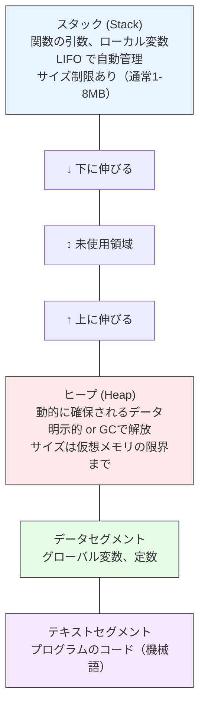
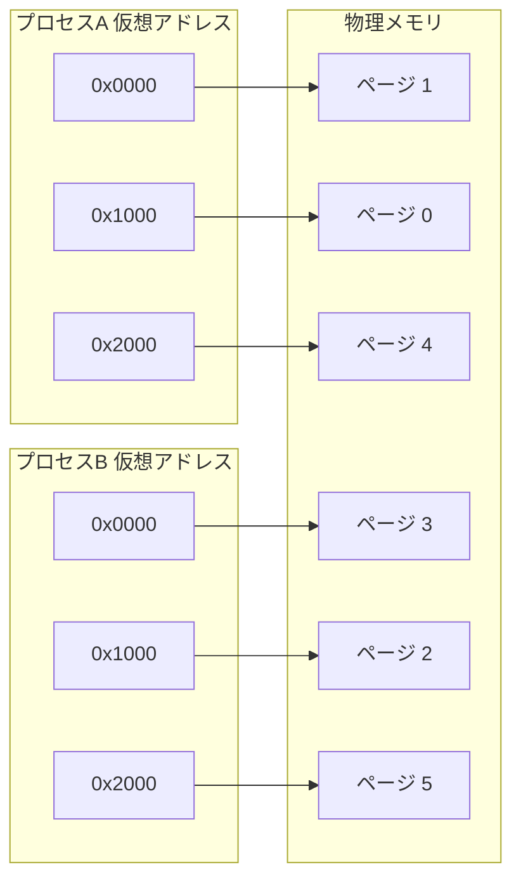

# メモリ管理

> **一言で言うと:** ヒープ（Heap）とスタック（Stack）の使い分け、ガベージコレクション（GC）の仕組みを理解することで、メモリリークという「Web長期運用の静かな敵」に対処でき、アプリケーションが確保したメモリをOSがどう管理しているかの全体像が見える。

## なぜ必要か

Webサーバーは24時間365日動き続ける。デスクトップアプリなら「再起動すれば直る」で済むメモリの問題が、サーバーでは致命的になる。

メモリ管理を理解していないと：
- **メモリリークの原因を特定できない** — Node.jsサーバーのメモリ使用量が日ごとに増え続け、最終的にOOM（Out of Memory）で落ちるが、どこが漏れているか分からない
- **パフォーマンス劣化の原因を見抜けない** — GCの停止（Stop-the-World）がレスポンスタイムのスパイクを引き起こしているのに、ネットワークやDBのせいだと誤診する
- **コンテナのリソース制限を適切に設定できない** — [[Docker]] の `--memory` フラグに根拠のない値を設定し、OOM Killerに殺される
- **言語やランタイムの選定理由が理解できない** — なぜRustが「GCなしで安全」と言われるのか、なぜGoのGCが低レイテンシに設計されているのかが分からない

## どの問題を解決するか

### 1. 限られたメモリの効率的な配分 — スタックとヒープ

**課題:** プログラムが使うメモリ領域には「関数呼び出しのたびに自動で確保・解放される短命なデータ」と「明示的に確保し、必要な間ずっと保持したいデータ」がある。これらを同じ仕組みで扱うと、効率が悪くなるか、管理が複雑になる。

**解決:** OSとランタイムはメモリを**スタック**と**ヒープ**の2つの領域に分けて管理する。



**スタック**は高速だが柔軟性に欠ける。関数が終了すると自動的にデータが破棄される。**ヒープ**は柔軟だが管理コストがかかる。誰がいつ解放するかを決めなければならない — これがメモリ管理の核心的な難しさである。

### 2. 解放忘れの防止 — ガベージコレクション（GC）

**課題:** C言語のように開発者が手動でメモリを解放する（`malloc`/`free`）方式では、解放忘れ（[[メモリリーク]]）や二重解放（[[ダングリングポインタ]]）が頻発する。

**解決:** ランタイムが「もう使われていないメモリ」を自動的に検出して解放する仕組み — GC — を提供する。JavaScript、Java、Go、Python、Rubyなど、Webで主要な言語のほとんどがGCを持つ。

主要なGCアルゴリズム：

| アルゴリズム | 仕組み | 採用例 | 特徴 |
|---|---|---|---|
| マーク&スイープ（Mark and Sweep） | ルートから到達可能なオブジェクトをマークし、マークされていないものを回収 | Go | シンプルで確実。フラグメンテーションが起きうる |
| 世代別GC（Generational GC） | 「ほとんどのオブジェクトは短命」という仮説に基づき、若い世代を頻繁に回収。内部的にマーク&スイープやコンパクションを組み合わせる | JavaScript (V8)、Java (G1GC)、.NET | 短命オブジェクトが多いWebアプリに最適 |
| 参照カウント（Reference Counting） | 各オブジェクトの参照数を数え、0になったら即座に解放 | Python (主方式)、Swift (ARC — コンパイル時に挿入、ランタイムGCではない) | 即座に解放されるが、循環参照を検出できない |

### 3. 物理メモリの制約からの解放 — 仮想メモリ

**課題:** 物理メモリ（RAM）は有限である。複数の[[プロセスとスレッド|プロセス]]がそれぞれ大量のメモリを要求すると、物理メモリが足りなくなる。

**解決:** OSは各プロセスに独立した**仮想アドレス空間**を提供する。仮想アドレスはOSのページテーブル（Page Table）を通じて物理アドレスに変換される。物理メモリが不足すると、使われていないページをディスクに退避する（スワップ/ページング）。



ただしスワップが発生すると、ディスクI/O（[[ファイルシステムとIO]] で学んだように10万倍遅い）が発生し、劇的に性能が劣化する。これを**スラッシング**（Thrashing）と呼ぶ。

## 他の仕組みとどう関係するか

- **下位レイヤーとの関係:**
  - [[データ構造とアルゴリズム]] — データ構造の選択がメモリ使用効率に直結する。配列はメモリ上で連続するためキャッシュに乗りやすく、リンクリストは断片的に確保されるためキャッシュミスが増える
  - [[並行性の基本概念]] — 複数スレッドからのヒープ領域への同時アクセスは競合状態を引き起こす。メモリアロケータはスレッドセーフである必要がある

- **同レイヤーとの関係:**
  - [[プロセスとスレッド]] — 各プロセスは独立したメモリ空間を持つ。マルチプロセスモデル（Apache prefork）はメモリ消費が大きく、マルチスレッドモデルはメモリ共有で効率的だが競合のリスクがある
  - [[ファイルシステムとIO]] — 仮想メモリのスワップはディスクI/Oに依存する。また `mmap` はファイルをメモリ空間に直接マッピングする手法で、両者の接点となる
  - [[Docker]] — コンテナの `--memory` 制限はcgroupsでプロセスの物理メモリ使用量を制限する。制限を超えるとOOM Killerがプロセスを強制終了する

- **上位レイヤーとの関係:**
  - [[キャッシュ戦略]] — キャッシュは「メモリ vs ディスク」のトレードオフ。Redisは全データをメモリに保持するからこそ高速
  - [[モニタリング|モニタリング・オブザーバビリティ]] — メモリ使用量、GC停止時間、スワップ発生率はサーバー監視の基本メトリクス

## 誤解されやすいポイント

### 1. 「GCがあれば[[メモリリーク]]は起きない」

**間違い。** GCは「どこからも参照されていないオブジェクト」を回収するが、コード上で不要なのにまだ参照が残っているオブジェクトは回収できない。これが「論理的な[[メモリリーク]]」であり、GC言語でも頻繁に発生する。

典型的な原因：
- グローバル変数やモジュールスコープの配列に要素を追加し続ける
- イベントリスナーを登録したまま解除しない
- クロージャが不要な外部変数を保持し続ける
- タイマー（`setInterval`）をクリアし忘れる

### 2. 「スタックオーバーフローはメモリ不足と同じ」

**違う。** スタックオーバーフローはスタック領域（通常1〜8MB）の上限を超えたエラーであり、ヒープのメモリ不足（OOM）とは原因が異なる。主な原因は深すぎる再帰呼び出し。ヒープに余裕があってもスタックは溢れる。

### 3. 「メモリ使用量が多い = メモリリーク」

**必ずしもそうではない。** GCは「メモリが十分にあるときは回収を遅延させる」戦略を取ることが多い。V8（Node.js/Chrome）はヒープの上限に近づくまでGCを積極的に実行しない。メモリ使用量が高いこと自体は正常な動作の場合がある。問題は「時間とともに増え続けるか」どうか。

### 4. 「64bit OSならメモリは実質無限」

**誤り。** 仮想アドレス空間は広大だが、物理メモリとスワップ領域の合計が実際の上限。仮想メモリを過剰にコミットすると、スワップが発生してスラッシングに陥り、サーバーが実質停止する。

## 設計のベストプラクティス

### やるべきこと

1. **メモリリークの検出をCI/CDに組み込む**
   - Node.js: `--max-old-space-size` を本番より小さく設定してテストし、リークを早期発見
   - ブラウザ: Chrome DevToolsのHeap SnapshotやAllocation Timelineを定期的に確認

2. **ストリーミング処理を使う**
   - 大きなファイルやレスポンスを一括でメモリに載せない。Node.jsのStreamやWeb Streams APIを活用する

3. **コンテナのメモリ制限を必ず設定する**
   - 制限なしで動かすと、1つのコンテナがホストの全メモリを消費して他のコンテナを巻き添えにする

4. **弱参照（WeakRef / WeakMap）を適切に使う**
   - キャッシュなど「あれば使うが、なくても再生成できる」データには弱参照を使い、GCによる回収を妨げない

### やってはいけないこと

1. **グローバルスコープにキャッシュを無制限に蓄積する**
   - LRU（Least Recently Used）やTTL（Time To Live）で上限を設ける

2. **手動GCに頼った設計**
   - `global.gc()` や `System.gc()` は開発時の調査用。本番で定期実行する設計は根本的に間違っている

3. **スワップを「メモリの拡張」として計画する**
   - スワップ発生はパフォーマンスの崩壊を意味する。物理メモリ内で収まるように設計する

## AIによる実装のアンチパターン

| アンチパターン | なぜ問題か | 対策 |
|---|---|---|
| 大きなJSONを `JSON.parse()` で一括パース | ファイル全体をメモリに載せ、パース中にさらに2〜3倍のメモリを消費する | ストリーミングJSONパーサー（`JSONStream`, `stream-json`）を使う |
| 配列に結果を `.push()` し続けるバッチ処理 | 数百万レコードを処理する際にメモリが線形に増大 | ページネーションやカーソルベースで分割処理する |
| `Buffer.concat()` でバイナリを結合し続ける | 結合のたびに新しいバッファを確保し、古いバッファはGC待ち | Streamのパイプラインで逐次処理する |
| エラー時にスタックトレースをオブジェクトに蓄積 | Error オブジェクトはスタック情報を保持しており意外と大きい | ログに書き出して参照を捨てる |

## 具体例

### [[メモリリーク]]の典型パターン（JavaScript/Node.js）

```javascript
// ❌ メモリリーク: グローバルキャッシュが無制限に成長
const cache = {};

function handleRequest(userId) {
  const data = fetchUserData(userId);
  cache[userId] = data; // 追加のみで削除しない → メモリが増え続ける
  return data;
}

// ✅ 修正: LRUキャッシュで上限を設ける
import { LRUCache } from 'lru-cache';

const cache = new LRUCache({
  max: 1000,        // 最大1000エントリ
  ttl: 1000 * 60 * 5 // 5分で期限切れ
});

function handleRequest(userId) {
  const cached = cache.get(userId);
  if (cached) return cached;

  const data = fetchUserData(userId);
  cache.set(userId, data);
  return data;
}
```

### イベントリスナーのリーク（ブラウザ JavaScript）

```javascript
// ❌ メモリリーク: コンポーネント破棄時にリスナーが残る
function setupComponent(element) {
  const handler = (e) => {
    // element を参照するクロージャ → element がGCされない
    element.textContent = e.data;
  };
  window.addEventListener('message', handler);
  // 解除しない → element が DOM から消えてもメモリに残る
}

// ✅ 修正: AbortController でまとめて解除
function setupComponent(element) {
  const controller = new AbortController();

  window.addEventListener('message', (e) => {
    element.textContent = e.data;
  }, { signal: controller.signal });

  // コンポーネント破棄時に呼ぶ
  return () => controller.abort();
}
```

### ストリーミングによるメモリ節約（Node.js）

```javascript
import { createReadStream, createWriteStream } from 'fs';
import { pipeline } from 'stream/promises';
import { Transform } from 'stream';

// ❌ 全ファイルをメモリに読み込み
const data = fs.readFileSync('large-file.csv', 'utf-8'); // 1GB → 1GBのメモリ
const lines = data.split('\n');
const results = lines.map(processLine);

// ✅ ストリームで行単位に処理（メモリは数KB）
await pipeline(
  createReadStream('large-file.csv', { encoding: 'utf-8' }),
  new Transform({
    objectMode: true,
    transform(chunk, encoding, callback) {
      const processed = processLine(chunk.toString().trim());
      callback(null, processed + '\n');
    }
  }),
  createWriteStream('output.csv')
);
```

### Node.js のヒープ使用量の確認

```javascript
// メモリ使用量の確認
const used = process.memoryUsage();
console.log({
  rss: `${Math.round(used.rss / 1024 / 1024)} MB`,         // 物理メモリ全体
  heapTotal: `${Math.round(used.heapTotal / 1024 / 1024)} MB`, // ヒープ確保量
  heapUsed: `${Math.round(used.heapUsed / 1024 / 1024)} MB`,  // ヒープ使用量
  external: `${Math.round(used.external / 1024 / 1024)} MB`   // C++オブジェクト
});
// heapUsed が時間とともに増え続ける → メモリリークの可能性
```

## 参考リソース

- [MDN: Memory Management](https://developer.mozilla.org/en-US/docs/Web/JavaScript/Memory_management) — JavaScriptのメモリ管理の基礎
- [Node.js Diagnostics: Memory](https://nodejs.org/en/learn/diagnostics/memory) — Node.jsのメモリ診断ガイド
- [V8 Blog: Trash talk](https://v8.dev/blog/trash-talk) — V8のGCアーキテクチャ解説
- 書籍: 『詳解システムパフォーマンス 第2版』Brendan Gregg著 — メモリ管理を含むOS全般のパフォーマンス分析

## 学習メモ

- GCの世代別仮説（generational hypothesis: ほとんどのオブジェクトは若くして死ぬ）はWebアプリのリクエスト処理モデルと相性が良い — リクエストごとに生成されるオブジェクトはレスポンス送信後すぐ不要になる
- Node.jsの `--max-old-space-size` はV8ヒープの上限。デフォルトはシステムのメモリ量に応じて動的に決まる（64bitシステムで数百MB〜数GB程度）。コンテナのメモリ制限より低く設定しないとOOM Killerに殺される前にGCが頑張る余地がなくなる
