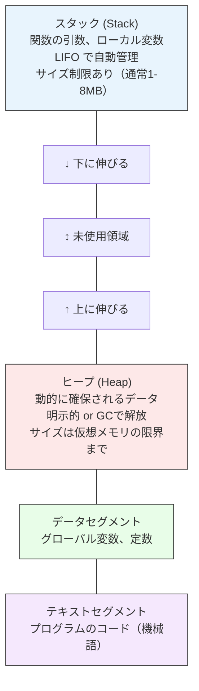
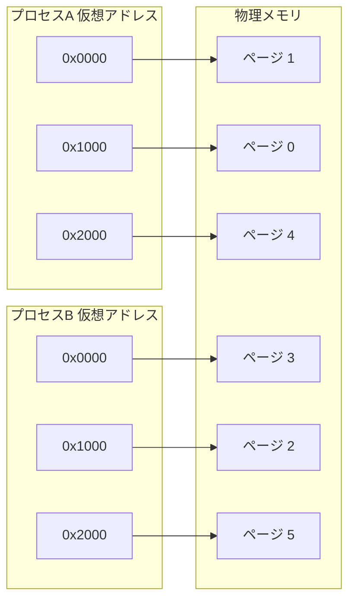

# メモリ管理

> **一言で言うと:** ヒープ（Heap）とスタック（Stack）の使い分け、ガベージコレクション（GC）の仕組みを理解することで、メモリリークという「Web長期運用の静かな敵」に対処でき、アプリケーションが確保したメモリをOSがどう管理しているかの全体像が見える。

## 3分で全体像

- **何を解決する技術か:** 限られた物理メモリを複数プロセス/オブジェクトに効率的に配分し、解放忘れによるリークと、参照中の解放によるクラッシュの両方を防ぐ
- **代表的な使用シーン:** Node.js/Java/Goサーバーの長期稼働、Docker のメモリ制限設計、メモリリーク調査、`Stop-the-World GC` によるレスポンスタイムスパイクの分析、JS 大規模SPAのメモリ最適化
- **これだけは覚える3つ:**
    1. **GCがあってもメモリリークは起きる**。原因は「不要なのに参照が残っている」（クロージャ・グローバルキャッシュ・リスナー解除忘れ）
    2. **コンテナのメモリ上限はランタイムに教える**（Node.js `--max-old-space-size`、Go `GOMEMLIMIT`、Java `-XX:MaxRAMPercentage`）。教えないと OOM Killer に殺される
    3. **メモリ使用量が多い ≠ リーク**。GC は余裕がある間は積極回収しない。「時間とともに増え続けるか」で判断する
- **AIに任せやすいか:** **一部任せられる** — LRUキャッシュ実装、ストリーミング処理、`AbortController` でのリスナー一括解除、`process.memoryUsage()` のロギングはAIが書ける。一方「メモリ上限の決定」「GCチューニングパラメータ」「リーク発見後の根本原因特定」は実測値とプロダクト要件に依存し、人間が判断する
- **詰まったらここを読む:** [[プロセスとスレッド]] / [[Docker]] / [[メモリリーク]]

## なぜ必要か

Webサーバーは24時間365日動き続ける。デスクトップアプリなら「再起動すれば直る」で済むメモリの問題が、サーバーでは致命的になる。

メモリ管理を理解していないと：
- **メモリリークの原因を特定できない** — Node.jsサーバーのメモリ使用量が日ごとに増え続け、最終的にOOM（Out of Memory）で落ちるが、どこが漏れているか分からない
- **パフォーマンス劣化の原因を見抜けない** — GCの停止（Stop-the-World）がレスポンスタイムのスパイクを引き起こしているのに、ネットワークやDBのせいだと誤診する
- **コンテナのリソース制限を適切に設定できない** — [[Docker]] の `--memory` フラグに根拠のない値を設定し、OOM Killerに殺される（[[メモリバジェット分析]]で事前に見積もる手法がある）
- **言語やランタイムの選定理由が理解できない** — なぜRustが「GCなしで安全」と言われるのか、なぜGoのGCが低レイテンシに設計されているのかが分からない（Goは[[Goのポインタ|明示的なポインタとエスケープ解析]]でスタック/ヒープの配置を最適化している）。そもそも言語が[[インタプリタ・コンパイラ・JIT|AOTコンパイラかJITかバイトコードVMか]]という実行方式の違いが、起動時間・ピーク性能・コールドスタートを決める

## どの問題を解決するか

### 1. 限られたメモリの効率的な配分 — スタックとヒープ

**課題:** プログラムが使うメモリ領域には「関数呼び出しのたびに自動で確保・解放される短命なデータ」と「明示的に確保し、必要な間ずっと保持したいデータ」がある。これらを同じ仕組みで扱うと、効率が悪くなるか、管理が複雑になる。

**解決:** OSとランタイムはメモリを**スタック**と**ヒープ**の2つの領域に分けて管理する。


```mermaid
graph TD
    Stack["スタック (Stack)<br/>関数の引数、ローカル変数<br/>LIFO で自動管理<br/>サイズ制限あり（通常1-8MB）"]
    StackDir["↓ 下に伸びる"]
    Unused["↕ 未使用領域"]
    HeapDir["↑ 上に伸びる"]
    Heap["ヒープ (Heap)<br/>動的に確保されるデータ<br/>明示的 or GCで解放<br/>サイズは仮想メモリの限界まで"]
    Data["データセグメント<br/>グローバル変数、定数"]
    Text["テキストセグメント<br/>プログラムのコード（機械語）"]

    Stack --- StackDir --- Unused --- HeapDir --- Heap --- Data --- Text

    style Stack fill:#e8f4fd,stroke:#333
    style Heap fill:#fde8e8,stroke:#333
    style Data fill:#e8fde8,stroke:#333
    style Text fill:#f5e8fd,stroke:#333
```

**スタック**は高速だが柔軟性に欠ける。関数が終了すると自動的にデータが破棄される。**ヒープ**は柔軟だが管理コストがかかる。誰がいつ解放するかを決めなければならない — これがメモリ管理の核心的な難しさである。

### 2. 解放忘れの防止 — ガベージコレクション（GC）

**課題:** C言語のように開発者が手動でメモリを解放する（`malloc`/`free`）方式では、解放忘れ（[[メモリリーク]]）や二重解放（[[ダングリングポインタ]]）が頻発する。

**解決:** ランタイムが「もう使われていないメモリ」を自動的に検出して解放する仕組み — GC — を提供する。JavaScript、Java、Go、Python、Rubyなど、Webで主要な言語のほとんどがGCを持つ。

主要なGCアルゴリズム：

| アルゴリズム | 仕組み | 採用例 | 特徴 |
|---|---|---|---|
| マーク&スイープ（Mark and Sweep） | ルートから到達可能なオブジェクトをマークし、マークされていないものを回収 | Go（非世代別の三色マーキング + concurrent sweep で低レイテンシを実現） | シンプルで確実。フラグメンテーションが起きうる |
| 世代別GC（Generational GC） | 「ほとんどのオブジェクトは短命」という仮説に基づき、若い世代を頻繁に回収。内部的にマーク&スイープやコンパクションを組み合わせる | JavaScript (V8)、Java (G1GC)、.NET | 短命オブジェクトが多いWebアプリに最適 |
| 参照カウント（Reference Counting） | 各オブジェクトの参照数を数え、0になったら即座に解放 | Python (主方式 — 循環参照は補助GCで検出)、Swift (ARC — コンパイル時に挿入、weak/unowned で循環を断つ) | 即座に解放されるが、単独では循環参照を検出できない |

なお、GC は「実行時に解放タイミングを探す」方式だが、これとは対照的に **コンパイル時に解放タイミングを確定させる「所有権モデル」**（Rust など）という第三の道もある。「いつ・誰がメモリを解放するか」という設計思想の全体像は [[GCと所有権モデル]] で対比的に扱う。GC 言語を使う場合でも所有権的な寿命設計の発想はリーク対策に直結する。

### 3. 物理メモリの制約からの解放 — 仮想メモリ

**課題:** 物理メモリ（RAM）は有限である。複数の[[プロセスとスレッド|プロセス]]がそれぞれ大量のメモリを要求すると、物理メモリが足りなくなる。

**解決:** OSは各プロセスに独立した**仮想アドレス空間**を提供する。仮想アドレスはOSのページテーブル（Page Table）を通じて物理アドレスに変換される。物理メモリが不足すると、使われていないページをディスクに退避する（スワップ/ページング）。


```mermaid
graph LR
    subgraph ProcessA["プロセスA 仮想アドレス"]
        A0["0x0000"]
        A1["0x1000"]
        A2["0x2000"]
    end

    subgraph ProcessB["プロセスB 仮想アドレス"]
        B0["0x0000"]
        B1["0x1000"]
        B2["0x2000"]
    end

    subgraph Physical["物理メモリ"]
        P0["ページ 0"]
        P1["ページ 1"]
        P2["ページ 2"]
        P3["ページ 3"]
        P4["ページ 4"]
        P5["ページ 5"]
    end

    A0 --> P1
    A1 --> P0
    A2 --> P4
    B0 --> P3
    B1 --> P2
    B2 --> P5
```

ただしスワップが発生すると、ディスクI/O（[[ファイルシステムとIO]] で学んだように10万倍遅い）が発生し、劇的に性能が劣化する。これを**スラッシング**（Thrashing）と呼ぶ。

## 他の仕組みとどう関係するか

- **下位レイヤーとの関係:**
  - [[データ構造とアルゴリズム]] — データ構造の選択がメモリ使用効率に直結する。配列はメモリ上で連続するためキャッシュに乗りやすく、リンクリストは断片的に確保されるためキャッシュミスが増える
  - [[並行性の基本概念]] — 複数スレッドからのヒープ領域への同時アクセスは競合状態を引き起こす。メモリアロケータはスレッドセーフである必要がある

- **同レイヤーとの関係:**
  - [[プロセスとスレッド]] — 各プロセスは独立したメモリ空間を持つ。マルチプロセスモデル（Apache prefork）はメモリ消費が大きく、マルチスレッドモデルはメモリ共有で効率的だが競合のリスクがある
  - [[ファイルシステムとIO]] — 仮想メモリのスワップはディスクI/Oに依存する。また `mmap` はファイルをメモリ空間に直接マッピングする手法で、両者の接点となる
  - [[Docker]] — コンテナの `--memory` 制限はcgroupsでプロセスの物理メモリ使用量を制限する。制限を超えるとOOM Killerがプロセスを強制終了する

- **上位レイヤーとの関係:**
  - [[キャッシュ戦略]] — キャッシュは「メモリ vs ディスク」のトレードオフ。Redisは全データをメモリに保持するからこそ高速
  - [[モニタリング|モニタリング・オブザーバビリティ]] — メモリ使用量、GC停止時間、スワップ発生率はサーバー監視の基本メトリクス

## 誤解されやすいポイント

### 1. 「GCがあれば[[メモリリーク]]は起きない」

**間違い。** GCは「どこからも参照されていないオブジェクト」を回収するが、コード上で不要なのにまだ参照が残っているオブジェクトは回収できない。これが「論理的な[[メモリリーク]]」であり、GC言語でも頻繁に発生する。

典型的な原因：
- グローバル変数やモジュールスコープの配列に要素を追加し続ける
- イベントリスナーを登録したまま解除しない
- クロージャが不要な外部変数を保持し続ける
- タイマー（`setInterval`）をクリアし忘れる

### 2. 「スタックオーバーフローはメモリ不足と同じ」

**違う。** スタックオーバーフローはスタック領域（通常1〜8MB）の上限を超えたエラーであり、ヒープのメモリ不足（OOM）とは原因が異なる。主な原因は深すぎる再帰呼び出し。ヒープに余裕があってもスタックは溢れる。

### 3. 「メモリ使用量が多い = メモリリーク」

**必ずしもそうではない。** GCは「メモリが十分にあるときは回収を遅延させる」戦略を取ることが多い。V8（Node.js/Chrome）はヒープの上限に近づくまでGCを積極的に実行しない。メモリ使用量が高いこと自体は正常な動作の場合がある。問題は「時間とともに増え続けるか」どうか。

### 4. 「64bit OSならメモリは実質無限」

**誤り。** 仮想アドレス空間は広大だが、物理メモリとスワップ領域の合計が実際の上限。仮想メモリを過剰にコミットすると、スワップが発生してスラッシングに陥り、サーバーが実質停止する。

## 設計のベストプラクティス

### やるべきこと

1. **メモリリークの検出をCI/CDに組み込む**
   - Node.js: `--max-old-space-size` を本番より小さく設定してテストし、リークを早期発見
   - ブラウザ: Chrome DevToolsのHeap SnapshotやAllocation Timelineを定期的に確認

2. **ストリーミング処理を使う**
   - 大きなファイルやレスポンスを一括でメモリに載せない。Node.jsのStreamやWeb Streams APIを活用する（`io.ReadAll` vs `io.Reader` の消費量の差は[[メモリバジェット分析]]を参照）

3. **コンテナのメモリ制限を必ず設定する**
   - 制限なしで動かすと、1つのコンテナがホストの全メモリを消費して他のコンテナを巻き添えにする

4. **弱参照（WeakRef / WeakMap）を適切に使う**
   - キャッシュなど「あれば使うが、なくても再生成できる」データには弱参照を使い、GCによる回収を妨げない

### やってはいけないこと

1. **グローバルスコープにキャッシュを無制限に蓄積する**
   - LRU（Least Recently Used）やTTL（Time To Live）で上限を設ける

2. **手動GCに頼った設計**
   - `global.gc()` や `System.gc()` は開発時の調査用。本番で定期実行する設計は根本的に間違っている

3. **スワップを「メモリの拡張」として計画する**
   - スワップ発生はパフォーマンスの崩壊を意味する。物理メモリ内で収まるように設計する

## AIエージェントとの協働

> このトピックでAIコーディングエージェントと協働するための観点。「AIに何をどこまで任せ、人間は何を判断するか」を整理する。

### AIに任せられる部分 / 人間が判断すべき部分

「実装もレビューもAIに任せられる」前提で人間の最終判断を整理する。

| タスク種類 | 任せ方（実装/レビュー） | 人間の関与 |
|---|---|---|
| LRUキャッシュ実装（`lru-cache`、自前TTL付きMap） | 仕様を渡して実装を任せる | キャッシュサイズ・TTLの値（実データの再利用率を踏まえる） |
| `AbortController` / `WeakRef` / `WeakMap` の典型実装 | コード生成を任せる | コンポーネントライフサイクルとの整合性確認 |
| ストリーミング処理への書き換え（`fs.readFile` → `createReadStream`） | リファクタリングを任せる | バッファサイズ、メモリ実測 |
| **メモリリーク疑いコードのレビュー** | AIコードレビュー観点でAIにグローバル参照・リスナー解除忘れ・タイマー解除忘れを検出させる | 指摘の妥当性判断、優先度付け |
| `process.memoryUsage()` ロギング・GC統計取得 | 実装を任せる | 監視閾値、アラート連携 |
| メモリ上限値の決定（`--max-old-space-size`、`GOMEMLIMIT`、cgroup の `memory.max`） | AIに「コンテナの memory limit と本番のRSS実測値」を渡してドラフトをもらう | 実測値・ピーク時の余裕・OOM Killer の発動余地を踏まえて最終決定 |
| GCチューニング（Ruby の `RUBY_GC_HEAP_*`、JVMの G1GC オプションなど） | 候補とトレードオフをAIに出させる | 実測のGCログを見て試行錯誤、本番反映 |

### AI生成コードのレビュー観点（このトピック固有）

AI生成物を受け取ったとき、最低限ここを見る。

1. **無制限に成長するコレクションがないか:** モジュールスコープの `const cache = {}` / `const items = []` に `.push` / `cache[key] =` し続けていないか。サーバー長期稼働でリークになる
2. **イベントリスナー・タイマーの解除忘れ:** `addEventListener`・`setInterval`・`MutationObserver`・WebSocket 接続などを登録した後、対応する `removeEventListener`/`clearInterval`/`abort` がないか
3. **大きなオブジェクトを丸ごとメモリに載せていないか:** `JSON.parse(hugeString)`、`Buffer.concat([...])` の繰り返し、`fs.readFileSync(largeFile)`、配列に全レコード `push` するバッチ処理

### 効くプロンプトの型

このトピックに関する実装をAIに依頼するとき、コンテキストとして渡すべき情報・制約・成功基準のテンプレ。

```
# 前提
- ランタイム: Node.js 22 / Go 1.22 / Ruby 3.3 など
- デプロイ環境: Docker (memory limit X MB)
- ワークロードの寿命: サーバープロセスは数日〜数週間稼働
- リクエストあたりの平均/ピークメモリ消費: 既知 or 未知

# やってほしいこと
- 〜のキャッシュ・バッファ・ストリーム処理を実装

# 守ってほしい制約
- モジュールスコープのキャッシュは LRU / TTL で必ず上限を持つ
- イベントリスナーは AbortController 経由で一括解除可能にする
- 大きなデータはストリーム（createReadStream / io.Reader / Generator）で扱う
- メモリ実測コード（process.memoryUsage / runtime.MemStats）を入れる
- 内部状態にスタックトレース付きError を貯めない

# 完了の判断基準
- 1万件の操作後にRSSが100MB以下に収まる（実測コードで確認）
- メモリリーク検出スクリプト（heap snapshot 等）を通過する
- コンテナの memory limit に対して80%を超えない
```

### AI実装のアンチパターン

LLM生成コードで頻出する過剰設計・誤用パターン。レビュー時の照合表として使う。

| アンチパターン | なぜ問題か | レビュー観点 / 対策 |
|---|---|---|
| **大きなJSONを `JSON.parse()` で一括パース** — APIレスポンス・ログファイルを丸ごとパース | ファイル全体をメモリに載せ、パース中にさらに2〜3倍のメモリを消費する。100MB JSON で 300MB 以上 | ストリーミングJSONパーサー（`JSONStream`、`stream-json`、Goの `json.Decoder`）を使う |
| **配列に結果を `.push()` し続けるバッチ処理** — `for record of allRecords: results.push(...)` | 数百万レコードを処理する際にメモリが線形に増大、最終的に OOM | ページネーション・カーソルベースで分割処理。ジェネレータ/ストリームで逐次出力する |
| **`Buffer.concat()` でバイナリを結合し続ける** — チャンクごとに `buffer = Buffer.concat([buffer, chunk])` | 結合のたびに新しいバッファを確保し、古いバッファはGC待ち。N回の結合で一時的に O(N²) のメモリ |  Streamのパイプライン（`pipeline`、`pipe`）で逐次処理。配列に貯めて最後に1回だけ `Buffer.concat` |
| **エラー時にスタックトレースをオブジェクトに蓄積** — `errors.push(err)` でリトライ用に保持 | Error オブジェクトはスタック情報を保持しており意外と大きい（数KB〜数十KB）。リトライキューで数千件積まれるとメモリ圧迫 | エラーは即ログに書き出し、保持する場合は `err.message` だけにする |
| **モジュールスコープの `const cache = new Map()` を上限なく使う** — リクエストごとに `cache.set(userId, data)` | 長期稼働で無限に増える典型リーク。GC が回収できない（ルートから到達可能なため） | LRU（`lru-cache`）かTTL付きで必ず上限を持つ。`WeakMap` で参照を弱くする |
| **`setInterval` を解除しない** — コンポーネントマウント時に `setInterval` してアンマウント時に `clearInterval` し忘れ | コンポーネントが破棄されてもタイマーが生き続け、コールバックが参照する変数も解放されない | `useEffect` の cleanup、`AbortController`、コンポーネント側 `onDestroy` で必ず clear |

→ レイヤー横断のアンチパターン索引: [[_anti-patterns/_index|AIアンチパターン索引]]

## 具体例

### [[メモリリーク]]の典型パターン（JavaScript/Node.js）

```javascript
// ❌ メモリリーク: グローバルキャッシュが無制限に成長
const cache = {};

function handleRequest(userId) {
  const data = fetchUserData(userId);
  cache[userId] = data; // 追加のみで削除しない → メモリが増え続ける
  return data;
}

// ✅ 修正: LRUキャッシュで上限を設ける
import { LRUCache } from 'lru-cache';

const cache = new LRUCache({
  max: 1000,        // 最大1000エントリ
  ttl: 1000 * 60 * 5 // 5分で期限切れ
});

function handleRequest(userId) {
  const cached = cache.get(userId);
  if (cached) return cached;

  const data = fetchUserData(userId);
  cache.set(userId, data);
  return data;
}
```

### イベントリスナーのリーク（ブラウザ JavaScript）

```javascript
// ❌ メモリリーク: コンポーネント破棄時にリスナーが残る
function setupComponent(element) {
  const handler = (e) => {
    // element を参照するクロージャ → element がGCされない
    element.textContent = e.data;
  };
  window.addEventListener('message', handler);
  // 解除しない → element が DOM から消えてもメモリに残る
}

// ✅ 修正: AbortController でまとめて解除
function setupComponent(element) {
  const controller = new AbortController();

  window.addEventListener('message', (e) => {
    element.textContent = e.data;
  }, { signal: controller.signal });

  // コンポーネント破棄時に呼ぶ
  return () => controller.abort();
}
```

### ストリーミングによるメモリ節約（Node.js）

```javascript
import { createReadStream, createWriteStream } from 'fs';
import { pipeline } from 'stream/promises';
import { Transform } from 'stream';

// ❌ 全ファイルをメモリに読み込み
const data = fs.readFileSync('large-file.csv', 'utf-8'); // 1GB → 1GBのメモリ
const lines = data.split('\n');
const results = lines.map(processLine);

// ✅ ストリームで行単位に処理（メモリは数KB）
import { createInterface } from 'readline';

const rl = createInterface({
  input: createReadStream('large-file.csv'),
  crlfDelay: Infinity,
});

const output = createWriteStream('output.csv');
for await (const line of rl) {
  const processed = processLine(line);
  output.write(processed + '\n');
}
output.end();
```

### Node.js のヒープ使用量の確認

```javascript
// メモリ使用量の確認
const used = process.memoryUsage();
console.log({
  rss: `${Math.round(used.rss / 1024 / 1024)} MB`,         // 物理メモリ全体
  heapTotal: `${Math.round(used.heapTotal / 1024 / 1024)} MB`, // ヒープ確保量
  heapUsed: `${Math.round(used.heapUsed / 1024 / 1024)} MB`,  // ヒープ使用量
  external: `${Math.round(used.external / 1024 / 1024)} MB`   // C++オブジェクト
});
// heapUsed が時間とともに増え続ける → メモリリークの可能性
```

### Go のメモリ管理 — エスケープ解析と GOMEMLIMIT

Go はGCに加え、コンパイラの[[Goのポインタ|エスケープ解析]]でスタック/ヒープの配置を最適化する。`GOMEMLIMIT`（Go 1.19+）でヒープ上限をランタイムに通知し、GCの積極性を制御できる。

```go
import (
	"log/slog"
	"runtime"
)

func logMemStats() {
	var m runtime.MemStats
	runtime.ReadMemStats(&m)
	slog.Info("memory",
		"alloc_mb", m.Alloc/1024/1024,       // 現在のヒープ使用量
		"sys_mb", m.Sys/1024/1024,            // OS から取得した総メモリ
		"heap_objects", m.HeapObjects,         // ヒープ上のオブジェクト数
		"num_gc", m.NumGC,                    // GC 実行回数
	)
}

// コンテナ環境では GOMEMLIMIT 環境変数でヒープ上限を設定
// GOMEMLIMIT=800MiB  (コンテナのメモリ制限より低く設定する)
```

### PHP のメモリ管理 — リクエスト単位のリセット

PHP-FPM はリクエストごとにメモリを確保・解放する Shared Nothing モデルのため、従来のメモリリークが起きにくい設計になっている。ただし1リクエスト内での消費や、ワーカープロセスの長期稼働によるリークには注意が必要。

```php
// メモリ使用量の確認
echo memory_get_usage(true);       // 現在のメモリ使用量（バイト）
echo memory_get_peak_usage(true);  // ピーク使用量

// php.ini でリクエストあたりのメモリ上限を設定
// memory_limit = 128M

// pm.max_requests でワーカープロセスを定期的に再起動し、
// 長期稼働によるリークを緩和する
// pm.max_requests = 500
```

```ini
; php-fpm.conf — メモリリーク対策
[www]
pm.max_requests = 500  ; 500リクエスト処理後にワーカーを再起動
                       ; リーク蓄積を防ぐ古典的パターン
```

### Ruby のメモリ管理 — GC チューニングと ObjectSpace

Ruby（CRuby）は世代別 GC を採用している。`ObjectSpace` モジュールでヒープの状態を確認でき、`GC.stat` でGC統計を取得できる。

```ruby
# GC統計の確認
stats = GC.stat
puts "ヒープページ数: #{stats[:heap_available_slots]}"
puts "GC実行回数: #{stats[:count]}"
puts "マイナーGC: #{stats[:minor_gc_count]}, メジャーGC: #{stats[:major_gc_count]}"

# ObjectSpace で特定クラスのインスタンス数を確認（デバッグ用）
require 'objspace'
ObjectSpace.count_objects
# => {:TOTAL=>30000, :FREE=>5000, :T_OBJECT=>1200, :T_STRING=>8500, ...}

# 特定クラスのインスタンスを列挙（リーク調査に有用）
ObjectSpace.each_object(SomeClass).count

# 環境変数でGCチューニング（Puma等のWebサーバー向け）
# RUBY_GC_HEAP_INIT_SLOTS=600000      # 初期ヒープスロット数
# RUBY_GC_HEAP_FREE_SLOTS_MIN_RATIO=0.20  # 空きスロットの最小比率
```

## 参考リソース

- [MDN: Memory Management](https://developer.mozilla.org/en-US/docs/Web/JavaScript/Memory_management) — JavaScriptのメモリ管理の基礎
- [Node.js Diagnostics: Memory](https://nodejs.org/en/learn/diagnostics/memory) — Node.jsのメモリ診断ガイド
- [V8 Blog: Trash talk](https://v8.dev/blog/trash-talk) — V8のGCアーキテクチャ解説
- 書籍: 『詳解システムパフォーマンス 第2版』Brendan Gregg著 — メモリ管理を含むOS全般のパフォーマンス分析

## 理解度セルフチェック

> 答えられなければ本文に戻る。答えはこのファイル内に必ずある。

1. ヒープとスタックの違いを「速度」「サイズ」「解放のタイミング」の3軸で30秒で説明できるか
2. 「GCがあるからメモリリークは起きない」は誤解である。なぜか。GC言語で起こりうるリークの典型を3つ挙げよ
3. 次のAI生成コードはこのトピックの観点で何が問題か。どう修正すべきか:

```javascript
// ユーザーごとのアクセス履歴を記録するサービス
const accessLog = {};
const liveSubscribers = new Set();

export function recordAccess(userId, request) {
  if (!accessLog[userId]) accessLog[userId] = [];
  accessLog[userId].push({
    path: request.path,
    timestamp: new Date(),
    request, // リクエスト全体を保持(後で参照する可能性があるため)
  });
}

export function subscribeToUpdates(userId, ws) {
  liveSubscribers.add({ userId, ws });
  ws.on('message', (msg) => {
    // リアルタイム配信処理
  });
  // 30秒ごとに ping を送る
  setInterval(() => ws.ping(), 30000);
}
```

> [!info] 用語ミニ辞典（解答を読む前に）
> - **メモリリーク（Memory Leak）** — プログラムが「もう使わないメモリ」を解放しないまま保持し続け、メモリ消費が時間とともに増え続ける状態。長期稼働サーバーの典型障害
> - **ガベージコレクション（GC）** — 「どこからも参照されていないオブジェクト」を自動的に検出して解放する仕組み。JavaScript / Java / Go / Python / Ruby など多くの言語が持つ。逆に言えば「参照が残っていれば解放されない」
> - **WebSocket** — サーバーとクライアントの間で双方向にメッセージを送り続けられる通信プロトコル。1接続 = 1リソース消費。接続が閉じるまでサーバー側に状態が残る
> - **`setInterval(fn, ms)`** — `ms` ミリ秒ごとに `fn` を実行するタイマー。**`clearInterval(id)` を呼ばない限り永遠に動き続ける**。コールバック内で参照する変数も全部メモリに残る

> [!note]- 解答の指針
> **問1: ヒープとスタックの違い（30秒）**
>
> - **速度:** スタックは「LIFO で push/pop だけ」「CPU の専用レジスタで管理」のため極めて高速。ヒープは「空き領域の探索 → 確保 → メタデータ管理」が必要で遅い（数十〜数百倍のオーダー）
> - **サイズ:** スタックは1スレッドあたり通常1〜8MB の上限あり。ヒープは仮想メモリの限界（実質ギガバイト単位）まで使える
> - **解放のタイミング:** スタックは関数終了で自動解放（LIFO）。ヒープは「明示的に `free`」または「GCで回収」されるまで残り続ける
>
> 「短命で小さいデータはスタック、長命/可変サイズのデータはヒープ」という設計の理由がここにある。
>
> **問2: GCがあってもメモリリークが起きる理由 + 典型3つ**
>
> 起きていること: GC は「**ルート（グローバル変数・スタック上の変数）から参照を辿って到達できるか**」で生死を判定する。コード上は不要でも、参照が残っていれば「到達可能 = 生きている」と判断され、回収されない。
>
> 典型的な3パターン:
>
> 1. **モジュールスコープのキャッシュ無制限増殖** — `const cache = new Map()` で `cache.set(key, value)` し続ける。グローバル参照なので GC は触れない
> 2. **イベントリスナー解除忘れ** — `element.addEventListener('click', handler)` のクロージャが `element` を参照し続ける → DOM から消えても解放されない
> 3. **タイマー解除忘れ** — `setInterval` のコールバックがクロージャで外部変数を参照 → コンポーネントが破棄されてもタイマーが生きていればその参照ごと残る
>
> 他にも「グローバル配列への push」「クロージャで巨大データを保持」「Promise が解決されないまま残る」「サブスクリプションの unsubscribe 忘れ」など多数ある。**「GCは参照を断つ仕事はしない。プログラマが断つ必要がある」** が原則。
>
> **問3: AI生成コードの問題点 4 つ**
>
> このコードは「アクセス履歴記録 + WebSocket 購読」を実装したつもりだが、メモリ管理の観点で **4 つのリーク源**を抱えている。
>
> **(a) `accessLog` が無制限に成長**
>
> モジュールスコープの `const accessLog = {}` に対して `userId` ごとに配列を作り、ひたすら push し続ける。サーバーが数日稼働すれば数百万件の履歴が溜まり、メモリが線形に増大する。
>
> 修正: ユーザーごとに「直近100件まで」「TTL 24時間」のような上限を設ける。永続化が必要ならDB/Redis に書き出してメモリには保持しない。
>
> **(b) `request` オブジェクト全体を保持している**
>
> コメントに「後で参照する可能性があるため」と書かれているが、HTTPリクエストオブジェクトはヘッダ・ボディ・ソケット参照などを含み、1件で数KB〜数十KB。これが履歴ごとに保持されると、(a) の問題と相まってメモリ消費が爆発する。
>
> 修正: 必要なフィールド（path・method・status_code 等）だけ抽出して保持する。`request` オブジェクトへの参照を持つと、リクエスト処理が終わってもソケットや関連オブジェクトが GC されない。
>
> **(c) `liveSubscribers` から退会者が削除されない**
>
> `liveSubscribers.add({userId, ws})` で追加しているが、`ws` の `close` イベントを購読していない。WebSocket が切断されても `liveSubscribers` から消えず、メモリ上にずっと残る。
>
> 修正（(d) で導入する `pingTimer` も併せて参照する形にする）:
>
> ```javascript
> const subscriber = { userId, ws };
> liveSubscribers.add(subscriber);
>
> // (d) で解説するタイマーを先に保持しておく
> const pingTimer = setInterval(() => ws.ping(), 30000);
>
> ws.on('close', () => {
>   liveSubscribers.delete(subscriber);
>   clearInterval(pingTimer); // (d) と合わせて
> });
> ```
>
> **(d) `setInterval` が解除されない**
>
> 30秒ごとに `ws.ping()` を呼ぶタイマーを起動しているが、`clearInterval` する箇所がない。WebSocket が切断された後も延々と `ping()` が呼ばれ続け（既に切れたソケットへの書き込みでエラー）、タイマーのクロージャが `ws` を参照しているので `ws` も GC されない。
>
> 修正: 上の (c) の修正コードのとおり、`const pingTimer = setInterval(...)` で ID を保持し、`ws.on('close', () => clearInterval(pingTimer))` で必ず解除する。
>
> **修正後の最小構成のポイント:**
> - `accessLog` は LRU/TTL キャッシュか永続化（メモリには持たない）
> - 履歴に保持するのは抽出した必要最小限のフィールドのみ
> - `liveSubscribers` への登録 → `ws.on('close')` で必ず削除
> - `setInterval` → `clearInterval`、可能なら `AbortController` でまとめて解除

## 学習メモ

- GCの世代別仮説（generational hypothesis: ほとんどのオブジェクトは若くして死ぬ）はWebアプリのリクエスト処理モデルと相性が良い — リクエストごとに生成されるオブジェクトはレスポンス送信後すぐ不要になる
- Node.jsの `--max-old-space-size` はV8ヒープの上限。デフォルトはシステムのメモリ量に応じて動的に決まる（64bitシステムで数百MB〜数GB程度）。コンテナのメモリ制限より低く設定しないとOOM Killerに殺される前にGCが頑張る余地がなくなる
