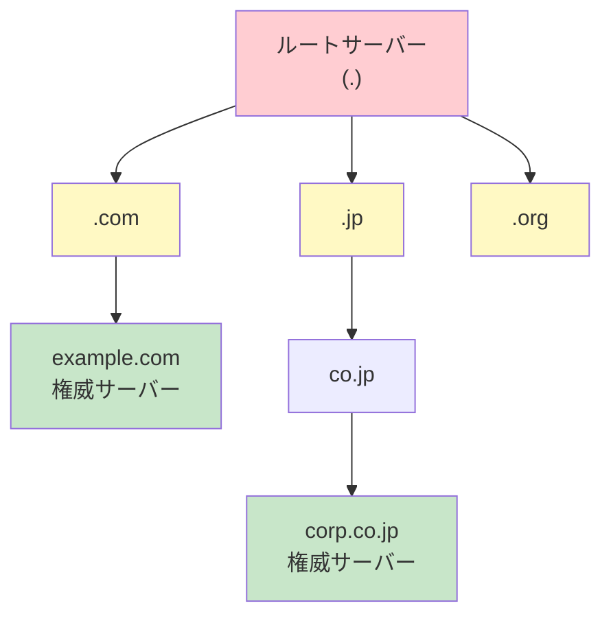
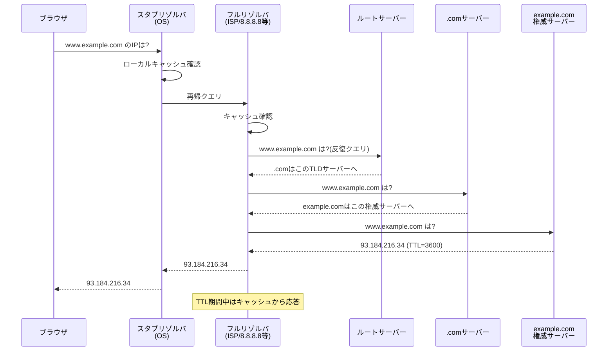

# DNS

> **一言で言うと:** ドメイン名（人間が読める名前）をIPアドレス（マシンが使うアドレス）に変換する分散データベースシステムであり、インターネットの「電話帳」。

## なぜ必要か

IPアドレスは `93.184.216.34` のような数値であり、人間が覚えるには不向きである。もしDNSがなかったら、WebサイトにアクセスするたびにIPアドレスを直接入力しなければならない。さらに、サーバーのIPアドレスが変わるたびに、利用者全員にその変更を通知する必要がある。

DNSはドメイン名という**安定した間接層（Indirection Layer）**を提供することで、以下を実現する:

- 人間に覚えやすい名前でサービスにアクセスできる
- サーバーのIPアドレスを変更しても、利用者側は何も変えなくてよい
- 負荷分散やフェイルオーバーを名前解決のレベルで実現できる

## どの問題を解決するか

### 課題1: 名前解決 — 「ドメイン名からIPアドレスを引く」

DNSの最も基本的な機能。クライアントが `example.com` にアクセスしたいとき、OSのリゾルバがDNSサーバーに問い合わせてIPアドレスを取得する。

### 課題2: 階層的な名前空間の管理 — 「誰がどの名前を管理するか」

インターネット上のすべてのドメイン名を1つのサーバーで管理するのは不可能である。DNSは**分散型の階層構造**で名前空間を管理する。



- **ルートサーバー**: `.`（ドット）を管理。世界に13系統（[[AnycastとUnicast|エニーキャスト]]で実体は数百台）
- **TLDサーバー**: `.com`, `.jp`, `.org` などのトップレベルドメインを管理
- **権威サーバー（Authoritative Server）**: 個々のドメインのレコードを管理

### 課題3: キャッシュとTTL — 「毎回ルートから問い合わせない」

すべての名前解決でルートサーバーまで遡ると、ルートサーバーがパンクする。**TTL（Time To Live）**をレコードに設定することで、リゾルバやキャッシュサーバーが一定期間応答を保持できる。

### 課題4: 冗長性 — 「1台が落ちても名前解決できる」

各ゾーンに複数のネームサーバーを設定することで、単一障害点を排除する。NSレコードで複数のネームサーバーを指定するのが標準的な運用。

## DNS名前解決の流れ

ブラウザで `www.example.com` にアクセスしたときの名前解決プロセス:



**再帰クエリ（Recursive Query）** と**反復クエリ（Iterative Query）** の違い:
- 再帰クエリ: 「最終的な答えをください」（スタブリゾルバ → フルリゾルバ）
- 反復クエリ: 「知っていれば答え、知らなければ次の問い合わせ先を教えてください」（フルリゾルバ → 各権威サーバー）

## 主要な[[DNSレコードタイプ]]

| レコード | 役割 | 例 |
|---------|------|-----|
| A | ドメイン → IPv4アドレス | `example.com → 93.184.216.34` |
| AAAA | ドメイン → IPv6アドレス | `example.com → 2606:2800:220:1::` |
| CNAME | ドメインの別名（エイリアス） | `www.example.com → example.com` |
| MX | メール配送先サーバー | `example.com → mail.example.com (優先度10)` |
| NS | ゾーンの権威ネームサーバー | `example.com → ns1.example.com` |
| TXT | 任意のテキスト情報 | SPF, DKIM, ドメイン所有権検証 |
| SOA | ゾーンの管理情報 | シリアル番号、リフレッシュ間隔等 |
| SRV | サービスの場所（ホスト+ポート） | `_sip._tcp.example.com → sipserver:5060` |
| PTR | IPアドレス → ドメイン（逆引き） | `34.216.184.93.in-addr.arpa → example.com` |
| CAA | SSL証明書の発行許可CA | `example.com → letsencrypt.org` |

## 他の仕組みとどう関係するか

- **下位レイヤーとの関係:**
  - [[TCP-IP]] — DNS問い合わせは主にUDPポート53を使用する。応答が512バイト（EDNSで4096バイト）を超える場合やゾーン転送（AXFR）ではTCPにフォールバックする
  - [[Linux基本操作]] — `/etc/resolv.conf`でリゾルバ設定、`/etc/hosts`で静的な名前解決を定義する。`/etc/nsswitch.conf`が名前解決の優先順位を制御する

- **同レイヤーとの関係:**
  - [[HTTP-HTTPS]] — ブラウザがHTTPリクエストを送る前に、必ずDNS解決が先行する。DNS解決の遅延はページロード時間に直結する
  - [[TLS-SSL]] — TLS証明書はドメイン名に対して発行される。DNS CAAレコードで証明書の発行元CAを制限できる。また、DNS-01チャレンジによる証明書のドメイン検証にもDNSが使われる
  - [[WebSocket]] — WebSocket接続もHTTP同様、接続先ドメインのDNS解決が必要

- **上位レイヤーとの関係:**
  - [[CDN]] — CDNはDNSのCNAMEや[[AnycastとUnicast|エニーキャスト（Anycast）]]を利用して、ユーザーに最も近いエッジサーバーにルーティングする
  - [[ロードバランシング]] — DNSラウンドロビンは最も単純な負荷分散の仕組み。ただし、ヘルスチェックやセッション維持はできないため、本格的な負荷分散にはL4/L7ロードバランサが必要

## 誤解されやすいポイント

### 1. 「DNSの変更は即座に反映される」

DNSレコードを変更しても、世界中のキャッシュサーバーが古いレコードをTTL期間中保持し続ける。これが**DNS伝播（DNS Propagation）**と呼ばれる現象である。TTLが86400秒（24時間）に設定されていた場合、最悪24時間は古いIPアドレスが返され続ける。

**実務での対策**: ドメイン移行やIPアドレス変更の前に、TTLを短く（例: 300秒）変更し、旧TTL期間が経過してから本番の変更を行う。

### 2. 「CNAMEはどこにでも設定できる」

CNAMEレコードにはいくつかの制約がある:
- **ゾーンの頂点（Zone Apex）**には設定できない — `example.com` にCNAMEは設定不可（`www.example.com` には設定可能）
- CNAMEが存在するドメイン名には他のレコードタイプを共存させられない（MXやTXTと同居不可）
- ゾーン頂点で同様の効果が必要な場合は、ALIASレコード（非標準だがRoute 53等が対応）やフラットCNAME（Cloudflare等）を使う

### 3. 「TTLを0にすればキャッシュされない」

TTL=0は「キャッシュしてはいけない」という意味だが、実際には:
- 一部のリゾルバは最低TTL（例: 30秒）を独自に適用する
- ブラウザ独自のDNSキャッシュがOS設定と無関係に保持する場合がある（Chromeは最大60秒）
- 企業のプロキシやファイアウォールが独自にキャッシュする場合がある

完全にキャッシュを排除することは原理的に困難である。

### 4. 「DNSは単なる名前解決」

DNSは名前解決以外にも多くの用途がある:
- **メール認証**: SPF、DKIM、DMARCはすべてDNS TXTレコードで設定
- **ドメイン所有権の検証**: Google Search Console、SSL証明書のドメイン検証
- **サービスディスカバリ**: SRVレコードによるサービスの場所解決（Kubernetes内部DNSなど）
- **セキュリティポリシー**: CAAレコードで証明書発行を制限

## 設計のベストプラクティス

### TTL設計

```
✅ 推奨: サービスの特性に応じたTTL設定
   - 安定したサービス: 3600秒（1時間）〜86400秒（24時間）
   - 変更の可能性があるサービス: 300秒（5分）〜600秒（10分）
   - フェイルオーバー用: 60秒（DNS負荷とのトレードオフ）

❌ アンチパターン: TTLを常に最短にする
   - DNSサーバーへの問い合わせ負荷が増大
   - 名前解決の遅延がリクエストごとに加算される
```

### ドメイン構成

```
✅ 推奨: 用途に応じたサブドメイン分離
   - api.example.com — APIサーバー
   - cdn.example.com — 静的アセット（CDN経由）
   - mail.example.com — メールサーバー
   → 各サブドメインを独立してスケール・移行できる

❌ アンチパターン: すべてのサービスを同一ドメインに配置
   - SSL証明書の管理が複雑化
   - 1つのサービスの障害がDNSレベルで他に影響する可能性
```

### DNSSEC

```
✅ 推奨: DNSSEC（DNS Security Extensions）の導入を検討
   - DNS応答の改ざんを検知できる（DNSキャッシュポイズニング対策）
   - レジストラとDNSサーバーの両方で設定が必要

❌ アンチパターン: DNSSECの鍵ローテーションを忘れる
   - 鍵の有効期限切れでドメイン全体が名前解決不能に
```

## AIによる実装のアンチパターン

| アンチパターン | なぜ問題か | 対策 |
|---|---|---|
| アプリケーション内でDNS結果をハードコードする | IPアドレスの変更に追従できず、フェイルオーバーが効かない | ドメイン名を使い、DNS解決をOS/ランタイムに任せる |
| DNSルックアップ結果を無期限にキャッシュする | サーバーのIP変更やフェイルオーバーに追従できない | TTLを尊重するか、接続プールのrefresh間隔を設定する |
| CNAMEチェーンを深くネストする | 各段階でDNS問い合わせが発生し、解決時間が線形に増加 | CNAMEは1段、多くても2段に抑える |
| 外部サービス依存のDNS設定をコードで直接操作する | DNS設定ミスでサービス全体がダウンするリスク | Terraform/IaCでDNS設定を管理し、レビュープロセスを通す |

## 具体例

### dig — DNSレコードの問い合わせ

```bash
# Aレコードの問い合わせ（最も基本的な操作）
dig example.com A

# 出力の読み方:
# ;; ANSWER SECTION:
# example.com.     3600    IN    A    93.184.216.34
#                   ↑TTL(秒)           ↑IPv4アドレス

# 問い合わせの全過程を追跡（+trace）
dig +trace example.com

# 特定のDNSサーバーに問い合わせ（@サーバー指定）
dig @8.8.8.8 example.com A

# MXレコードの確認（メール配送先）
dig example.com MX

# TXTレコードの確認（SPF、ドメイン検証等）
dig example.com TXT

# 逆引きDNS
dig -x 93.184.216.34
```

### Node.js — DNS解決とその影響

```javascript
import { promises as dns } from 'node:dns';

// DNSの解決にかかる時間を計測する
async function measureDnsLookup(hostname) {
  const start = performance.now();
  const addresses = await dns.resolve4(hostname);
  const elapsed = performance.now() - start;

  console.log(`${hostname}: ${addresses.join(', ')} (${elapsed.toFixed(1)}ms)`);
  return { addresses, elapsed };
}

// 初回は実際にDNS問い合わせが発生する
await measureDnsLookup('example.com');  // 例: 25.3ms

// OS側にキャッシュがあれば2回目は高速
await measureDnsLookup('example.com');  // 例: 0.8ms
```

### Python — カスタムリゾルバによるDNS問い合わせ

```python
import dns.resolver  # dnspython パッケージ

# 基本的なAレコード問い合わせ
answers = dns.resolver.resolve('example.com', 'A')
for rdata in answers:
    print(f"IP: {rdata.address}, TTL: {answers.rrset.ttl}秒")

# MXレコードの問い合わせ（メール配送先の確認）
mx_answers = dns.resolver.resolve('example.com', 'MX')
for rdata in mx_answers:
    print(f"優先度: {rdata.preference}, サーバー: {rdata.exchange}")

# TXTレコードの確認（SPF等）
txt_answers = dns.resolver.resolve('example.com', 'TXT')
for rdata in txt_answers:
    print(f"TXT: {rdata.to_text()}")
```

### Terraform — DNSレコードのIaC管理（AWS Route 53）

```hcl
# DNSレコードをコードで管理する例
resource "aws_route53_record" "www" {
  zone_id = aws_route53_zone.main.zone_id
  name    = "www.example.com"
  type    = "A"

  alias {
    name                   = aws_lb.main.dns_name
    zone_id                = aws_lb.main.zone_id
    evaluate_target_health = true  # ヘルスチェック連動
  }
}

# TTLを明示的に設定する例
resource "aws_route53_record" "api" {
  zone_id = aws_route53_zone.main.zone_id
  name    = "api.example.com"
  type    = "A"
  ttl     = 300  # フェイルオーバーに備えて短めのTTL
  records = ["10.0.1.100"]
}
```

## 参考リソース

- **書籍**: 『DNSがよくわかる教科書』（渡邉結衣、佐藤新太 他） — DNS運用の実務的な解説
- **書籍**: 『Real World HTTP 第3版』（渋川よしき） — HTTPとDNSの関係を含むWeb通信の全体像
- **RFC 1034/1035**: DNS仕様の原典 — https://datatracker.ietf.org/doc/html/rfc1034
- **Web**: How DNS works（comic形式の視覚的解説） — https://howdns.works/
- **Web**: Cloudflare Learning Center: DNS — https://www.cloudflare.com/learning/dns/what-is-dns/

## 学習メモ

- DNS over HTTPS（DoH）/ DNS over TLS（DoT）によるプライバシー保護は[[TLS-SSL]]と合わせて理解する
- DNSSEC（DNS Security Extensions）の詳細は[[TLS-SSL]]との関連でセキュリティ観点から深掘り候補
- Kubernetes内部DNS（CoreDNS）によるサービスディスカバリは[[Docker]]の実運用知識として重要
- DNSラウンドロビンの限界と、Route 53のヘルスチェック連動は[[ロードバランシング]]で扱う
