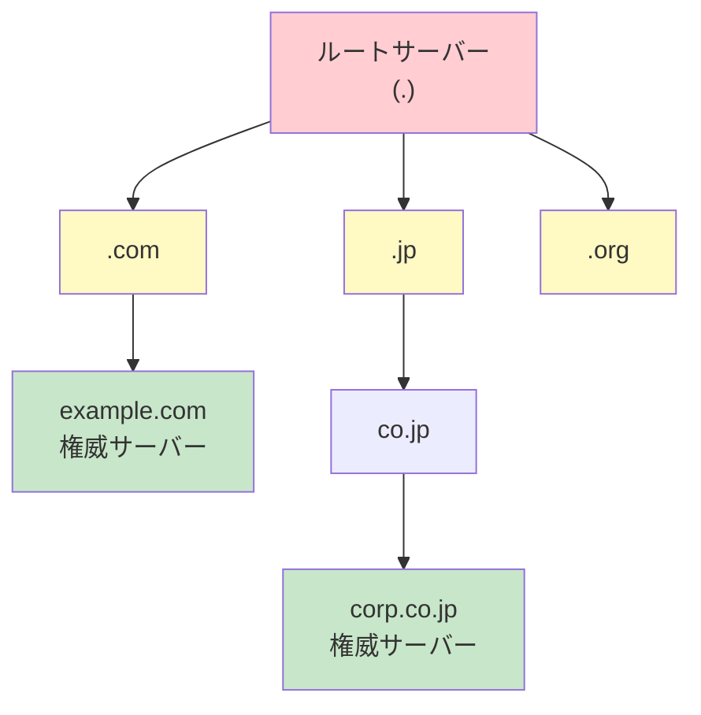
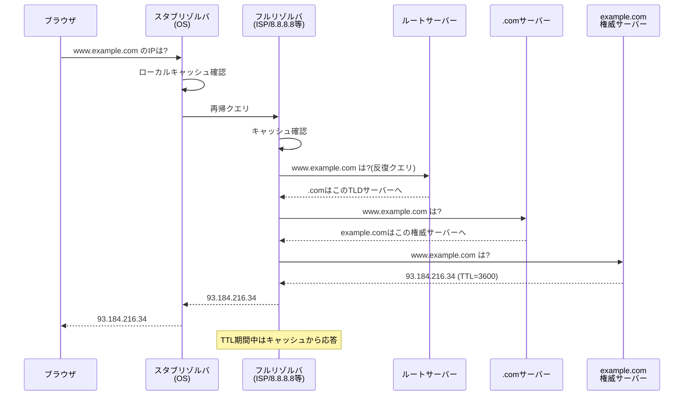

# DNS

> **一言で言うと:** ドメイン名（人間が読める名前）をIPアドレス（マシンが使うアドレス）に変換する分散データベースシステムであり、インターネットの「電話帳」。

## 3分で全体像

- **何を解決する技術か:** 「IPアドレスは変わるが、利用者から見た名前は変えたくない」という間接層（Indirection Layer）の問題を、分散・階層的なキャッシュ可能なシステムで解決する
- **代表的な使用シーン:** すべての Web アクセスの先行ステップ、メール配送先（MX）、SSL証明書のドメイン検証、サービスディスカバリ（Kubernetes 内部 DNS）、フェイルオーバー（ヘルスチェック連動）
- **これだけは覚える3つ:**
    1. **TTL がキャッシュの寿命** — 「DNS 変更が即座に反映されない」のはこのため。本番のドメイン移行前は TTL を短く（300秒等）下げて旧 TTL の経過を待つのが鉄則
    2. **DNS は単なる名前解決ではない** — メール認証（SPF/DKIM/DMARC）、ドメイン所有権検証、CAA による証明書発行制限、SRV によるサービスディスカバリの基盤でもある
    3. **アプリ側で IP をハードコード/長期キャッシュしない** — フェイルオーバーや IP 変更に追従できなくなる。ドメイン名で参照し、TTL を尊重する
- **AIに任せやすいか:** **任せやすい** — `dig` / `nslookup` コマンドの組み立て、Terraform/Route53 のレコード定義、SPF/DKIM の TXT レコード作成は AI が高品質に書ける。一方「TTL の値選定」「ゾーン頂点の CNAME 制約への対応」「マルチクラウド時のフェイルオーバー設計」は運用方針と SLA 次第で人間が判断
- **詰まったらここを読む:** [[TCP-IP]] / [[HTTP-HTTPS]] / [[TLS-SSL]]

## なぜ必要か

IPアドレスは `93.184.216.34` のような数値であり、人間が覚えるには不向きである。もしDNSがなかったら、WebサイトにアクセスするたびにIPアドレスを直接入力しなければならない。さらに、サーバーのIPアドレスが変わるたびに、利用者全員にその変更を通知する必要がある。

DNSはドメイン名という**安定した間接層（Indirection Layer）**を提供することで、以下を実現する:

- 人間に覚えやすい名前でサービスにアクセスできる
- サーバーのIPアドレスを変更しても、利用者側は何も変えなくてよい
- 負荷分散やフェイルオーバーを名前解決のレベルで実現できる

## どの問題を解決するか

### 課題1: 名前解決 — 「ドメイン名からIPアドレスを引く」

DNSの最も基本的な機能。クライアントが `example.com` にアクセスしたいとき、OSのリゾルバがDNSサーバーに問い合わせてIPアドレスを取得する。

### 課題2: 階層的な名前空間の管理 — 「誰がどの名前を管理するか」

インターネット上のすべてのドメイン名を1つのサーバーで管理するのは不可能である。DNSは**分散型の階層構造**で名前空間を管理する。


```mermaid
graph TD
    Root["ルートサーバー<br/>(.)"]
    TLD_com[".com"]
    TLD_jp[".jp"]
    TLD_org[".org"]
    Auth_example["example.com<br/>権威サーバー"]
    Auth_co["co.jp"]
    Auth_corp["corp.co.jp<br/>権威サーバー"]

    Root --> TLD_com
    Root --> TLD_jp
    Root --> TLD_org
    TLD_com --> Auth_example
    TLD_jp --> Auth_co
    Auth_co --> Auth_corp

    style Root fill:#ffcdd2
    style TLD_com fill:#fff9c4
    style TLD_jp fill:#fff9c4
    style TLD_org fill:#fff9c4
    style Auth_example fill:#c8e6c9
    style Auth_corp fill:#c8e6c9
```

- **ルートサーバー**: `.`（ドット）を管理。世界に13系統（[[AnycastとUnicast|エニーキャスト]]で実体は千台以上）
- **TLDサーバー**: `.com`, `.jp`, `.org` などのトップレベルドメインを管理
- **権威サーバー（Authoritative Server）**: 個々のドメインのレコードを管理

### 課題3: キャッシュとTTL — 「毎回ルートから問い合わせない」

すべての名前解決でルートサーバーまで遡ると、ルートサーバーがパンクする。**TTL（Time To Live）**をレコードに設定することで、リゾルバやキャッシュサーバーが一定期間応答を保持できる。

### 課題4: 冗長性 — 「1台が落ちても名前解決できる」

各ゾーンに複数のネームサーバーを設定することで、単一障害点を排除する。NSレコードで複数のネームサーバーを指定するのが標準的な運用。

## DNS名前解決の流れ

ブラウザで `www.example.com` にアクセスしたときの名前解決プロセス:


```mermaid
sequenceDiagram
    participant B as ブラウザ
    participant SC as スタブリゾルバ<br/>(OS)
    participant CR as フルリゾルバ<br/>(ISP/8.8.8.8等)
    participant Root as ルートサーバー
    participant TLD as .comサーバー
    participant Auth as example.com<br/>権威サーバー

    B->>SC: www.example.com のIPは?
    SC->>SC: ローカルキャッシュ確認
    SC->>CR: 再帰クエリ
    CR->>CR: キャッシュ確認
    CR->>Root: www.example.com は?(反復クエリ)
    Root-->>CR: .comはこのTLDサーバーへ
    CR->>TLD: www.example.com は?
    TLD-->>CR: example.comはこの権威サーバーへ
    CR->>Auth: www.example.com は?
    Auth-->>CR: 93.184.216.34 (TTL=3600)
    CR-->>SC: 93.184.216.34
    SC-->>B: 93.184.216.34
    Note over CR: TTL期間中はキャッシュから応答
```

**再帰クエリ（Recursive Query）** と**反復クエリ（Iterative Query）** の違い:
- 再帰クエリ: 「最終的な答えをください」（スタブリゾルバ → フルリゾルバ）
- 反復クエリ: 「知っていれば答え、知らなければ次の問い合わせ先を教えてください」（フルリゾルバ → 各権威サーバー）

## 主要な[[DNSレコードタイプ]]

| レコード | 役割 | 例 |
|---------|------|-----|
| A | ドメイン → IPv4アドレス | `example.com → 93.184.216.34` |
| AAAA | ドメイン → IPv6アドレス | `example.com → 2606:2800:220:1::` |
| CNAME | ドメインの別名（エイリアス） | `www.example.com → example.com` |
| MX | メール配送先サーバー | `example.com → mail.example.com (優先度10)` |
| NS | ゾーンの権威ネームサーバー | `example.com → ns1.example.com` |
| TXT | 任意のテキスト情報 | SPF, DKIM, ドメイン所有権検証 |
| SOA | ゾーンの管理情報 | シリアル番号、リフレッシュ間隔等 |
| SRV | サービスの場所（ホスト+ポート） | `_sip._tcp.example.com → sipserver:5060` |
| PTR | IPアドレス → ドメイン（逆引き） | `34.216.184.93.in-addr.arpa → example.com` |
| CAA | SSL証明書の発行許可CA | `example.com → letsencrypt.org` |

## 他の仕組みとどう関係するか

- **下位レイヤーとの関係:**
  - [[TCP-IP]] — DNS問い合わせは主にUDPポート53を使用する。応答が512バイト（EDNSで4096バイト）を超える場合やゾーン転送（AXFR）ではTCPにフォールバックする
  - [[Linux基本操作]] — `/etc/resolv.conf`でリゾルバ設定、`/etc/hosts`で静的な名前解決を定義する。`/etc/nsswitch.conf`が名前解決の優先順位を制御する

- **同レイヤーとの関係:**
  - [[HTTP-HTTPS]] — ブラウザがHTTPリクエストを送る前に、必ずDNS解決が先行する。DNS解決の遅延はページロード時間に直結する
  - [[TLS-SSL]] — TLS証明書はドメイン名に対して発行される。DNS CAAレコードで証明書の発行元CAを制限できる。また、DNS-01チャレンジによる証明書のドメイン検証にもDNSが使われる
  - [[WebSocket]] — WebSocket接続もHTTP同様、接続先ドメインのDNS解決が必要

- **上位レイヤーとの関係:**
  - [[CDN]] — CDNはDNSのCNAMEや[[AnycastとUnicast|エニーキャスト（Anycast）]]を利用して、ユーザーに最も近いエッジサーバーにルーティングする
  - [[ロードバランシング]] — DNSラウンドロビンは最も単純な負荷分散の仕組み。ただし、ヘルスチェックやセッション維持はできないため、本格的な負荷分散にはL4/L7ロードバランサが必要

## 誤解されやすいポイント

### 1. 「DNSの変更は即座に反映される」

DNSレコードを変更しても、世界中のキャッシュサーバーが古いレコードをTTL期間中保持し続ける。これが**DNS伝播（DNS Propagation）**と呼ばれる現象である。TTLが86400秒（24時間）に設定されていた場合、最悪24時間は古いIPアドレスが返され続ける。

**実務での対策**: ドメイン移行やIPアドレス変更の前に、TTLを短く（例: 300秒）変更し、旧TTL期間が経過してから本番の変更を行う。

### 2. 「CNAMEはどこにでも設定できる」

CNAMEレコードにはいくつかの制約がある:
- **ゾーンの頂点（Zone Apex）**には設定できない — `example.com` にCNAMEは設定不可（`www.example.com` には設定可能）
- CNAMEが存在するドメイン名には他のレコードタイプを共存させられない（MXやTXTと同居不可）
- ゾーン頂点で同様の効果が必要な場合は、ALIASレコード（非標準だがRoute 53等が対応）やフラットCNAME（Cloudflare等）を使う

### 3. 「TTLを0にすればキャッシュされない」

TTL=0は「キャッシュしてはいけない」という意味だが、実際には:
- 一部のリゾルバは最低TTL（例: 30秒）を独自に適用する
- ブラウザ独自のDNSキャッシュがOS設定と無関係に保持する場合がある（Chromeは最大60秒）
- 企業のプロキシやファイアウォールが独自にキャッシュする場合がある

完全にキャッシュを排除することは原理的に困難である。

### 4. 「DNSは単なる名前解決」

DNSは名前解決以外にも多くの用途がある:
- **メール認証**: SPF、DKIM、DMARCはすべてDNS TXTレコードで設定
- **ドメイン所有権の検証**: Google Search Console、SSL証明書のドメイン検証
- **サービスディスカバリ**: SRVレコードによるサービスの場所解決（Kubernetes内部DNSなど）
- **セキュリティポリシー**: CAAレコードで証明書発行を制限

## 設計のベストプラクティス

### TTL設計

```
✅ 推奨: サービスの特性に応じたTTL設定
   - 安定したサービス: 3600秒（1時間）〜86400秒（24時間）
   - 変更の可能性があるサービス: 300秒（5分）〜600秒（10分）
   - フェイルオーバー用: 60秒（DNS負荷とのトレードオフ）

❌ アンチパターン: TTLを常に最短にする
   - DNSサーバーへの問い合わせ負荷が増大
   - 名前解決の遅延がリクエストごとに加算される
```

### ドメイン構成

```
✅ 推奨: 用途に応じたサブドメイン分離
   - api.example.com — APIサーバー
   - cdn.example.com — 静的アセット（CDN経由）
   - mail.example.com — メールサーバー
   → 各サブドメインを独立してスケール・移行できる

❌ アンチパターン: すべてのサービスを同一ドメインに配置
   - SSL証明書の管理が複雑化
   - 1つのサービスの障害がDNSレベルで他に影響する可能性
```

### DNSSEC

```
✅ 推奨: DNSSEC（DNS Security Extensions）の導入を検討
   - DNS応答の改ざんを検知できる（DNSキャッシュポイズニング対策）
   - レジストラとDNSサーバーの両方で設定が必要

❌ アンチパターン: DNSSECの鍵ローテーションを忘れる
   - 鍵の有効期限切れでドメイン全体が名前解決不能に
```

## AIエージェントとの協働

> このトピックでAIコーディングエージェントと協働するための観点。「AIに何をどこまで任せ、人間は何を判断するか」を整理する。

### AIに任せられる部分 / 人間が判断すべき部分

| タスク種類 | 任せ方（実装/レビュー） | 人間の関与 |
|---|---|---|
| Terraform / Route53 / Cloud DNS の DNS レコード定義 | 仕様（A/CNAME/MX/TXT のリスト + TTL）を渡して任せる | TTL の値・alias 先・evaluate_target_health の有無 |
| SPF / DKIM / DMARC の TXT レコード組み立て | 利用するメール配信元（SES, SendGrid 等）を渡して任せる | DMARC ポリシーの強さ（none → quarantine → reject）の段階移行判断 |
| `dig` / `nslookup` コマンドの組み立て | 調査目的（A レコード確認、TTL 確認、トレース）を渡して任せる | 結果の解釈（伝播状況・キャッシュサーバーごとの差異） |
| **CNAME チェーン・TTL レビュー** | `/review-ai-code` でレビューさせる | 指摘の妥当性判断 |
| ドメイン移行手順書のドラフト | 「現状 / 目標 / 旧 TTL」を渡して任せる | 移行ウィンドウの設定、ロールバック条件、関係者連絡 |
| ヘルスチェック連動フェイルオーバー設計 | 候補（DNS切替 / Anycast / L7 LB）をAIに比較させる | RTO/RPO の要件、コスト、運用体制を踏まえて選定 |
| アプリ側 DNS キャッシュ設定（Java の `networkaddress.cache.ttl` 等） | デフォルト値の問題点を AI に指摘させる | 本番のフェイルオーバー要件と整合させて確定 |

### AI生成コードのレビュー観点（このトピック固有）

AI生成物を受け取ったとき、最低限ここを見る。

1. **TTL の値が明示されているか:** デフォルトに頼らず、サービスの特性（安定 = 3600+ / 変更可能性あり = 300-600 / フェイルオーバー = 60）で意図的に設定されているか
2. **ゾーン頂点に CNAME を設定していないか:** `example.com` に CNAME は設定不可（RFC 1034 違反）。alias レコード（Route 53）や ANAME（Cloudflare）で代替されているか
3. **アプリ層で IP をハードコード / 長期キャッシュしていないか:** `getaddrinfo` の結果を無期限保持していないか、HTTPクライアントが TTL を尊重して再解決するか

### 効くプロンプトの型

このトピックに関する実装をAIに依頼するとき、コンテキストとして渡すべき情報・制約・成功基準のテンプレ。

```
# 前提
- ドメイン: example.com（既に取得済み）
- 用途: Web (api.example.com) / メール (mail.example.com) / CDN (cdn.example.com)
- DNS プロバイダ: Route 53 / Cloud DNS / Cloudflare
- IaC: Terraform / Pulumi
- メール配信元: SES / SendGrid / Mailgun（SPF/DKIM/DMARC が必要）
- 想定アクセス頻度・フェイルオーバー要件

# やってほしいこと
- 〜の DNS レコードを Terraform で定義 / SPF, DKIM, DMARC を設定 / 移行手順を作成

# 守ってほしい制約（このトピック固有）
- ゾーン頂点には CNAME を設定しない（alias レコードを使う）
- TTL は用途別に明示（安定 3600 / 変更前 300）
- CAA レコードで許可 CA を制限（Let's Encrypt のみ等）
- ヘルスチェック連動が必要なレコードは alias + evaluate_target_health で
- DNS 設定変更は Terraform 経由で PR レビューを通す

# 完了の判断基準
- `dig +trace` で意図通りに解決される
- TTL が想定通り
- DNSSEC が有効（必要なら）
- メール送信時に SPF/DKIM/DMARC が pass する
```

### AI実装のアンチパターン

LLM生成コードで頻出する過剰設計・誤用パターン。レビュー時の照合表として使う。

| アンチパターン | なぜ問題か | レビュー観点 / 対策 |
|---|---|---|
| **アプリ内で DNS 結果をハードコード** | サーバーの IP 変更やフェイルオーバーに追従できず、変更時にデプロイが必要になる | ドメイン名を使い、DNS 解決を OS / HTTP クライアントに任せる |
| **DNS ルックアップ結果を無期限キャッシュ** | サーバーの IP 変更やヘルスチェック連動フェイルオーバーが効かなくなる。Java は標準で `networkaddress.cache.ttl=-1`（無期限）なので特に注意 | TTL を尊重する。または接続プールに refresh 間隔を設定 |
| **CNAME チェーンを深くネスト** | 各段階で DNS 問い合わせが発生し、解決時間が線形に増加。CNAME → CNAME → A の3段で 3 RTT 浪費する | CNAME は1段、多くても2段に抑える。`dig +trace` で確認 |
| **ゾーン頂点（apex）に CNAME を設定** | RFC 1034 違反でゾーン全体が壊れる（同居する SOA/NS と競合） | alias レコード（Route 53）/ ANAME（Cloudflare）等のフラット CNAME 機能を使う |
| **TTL を 0 に設定して「キャッシュさせない」** | 一部リゾルバは独自に最低 TTL を適用し、ブラウザも独自キャッシュする。完全な無キャッシュは不可能 | 短くしたい場合は 30-60 秒。本来の目的（フェイルオーバー）に対しては alias + ヘルスチェックを併用 |
| **DNS 設定を AWS Console / GUI で直接操作** | 変更履歴が残らず、レビュープロセスを通せない。ロールバックも困難 | Terraform / IaC で管理し PR レビューを通す。レコード変更は git diff で追える状態にする |
| **DNSSEC の鍵ローテーション忘れ** | KSK / ZSK の有効期限切れでドメイン全体が名前解決不能になる（過去に有名サイトで実際に起きている） | 自動ローテーションを設定。期限監視を Datadog / CloudWatch に組み込む |

→ レイヤー横断のアンチパターン索引: [[_anti-patterns/_index|AIアンチパターン索引]]

## 具体例

### dig — DNSレコードの問い合わせ

```bash
# Aレコードの問い合わせ（最も基本的な操作）
dig example.com A

# 出力の読み方:
# ;; ANSWER SECTION:
# example.com.     3600    IN    A    93.184.216.34
#                   ↑TTL(秒)           ↑IPv4アドレス

# 問い合わせの全過程を追跡（+trace）
dig +trace example.com

# 特定のDNSサーバーに問い合わせ（@サーバー指定）
dig @8.8.8.8 example.com A

# MXレコードの確認（メール配送先）
dig example.com MX

# TXTレコードの確認（SPF、ドメイン検証等）
dig example.com TXT

# 逆引きDNS
dig -x 93.184.216.34
```

### Node.js — DNS解決とその影響

```javascript
import { promises as dns } from 'node:dns';

// DNSの解決にかかる時間を計測する
async function measureDnsLookup(hostname) {
  const start = performance.now();
  const addresses = await dns.resolve4(hostname);
  const elapsed = performance.now() - start;

  console.log(`${hostname}: ${addresses.join(', ')} (${elapsed.toFixed(1)}ms)`);
  return { addresses, elapsed };
}

// 初回は実際にDNS問い合わせが発生する
await measureDnsLookup('example.com');  // 例: 25.3ms

// OS側にキャッシュがあれば2回目は高速
await measureDnsLookup('example.com');  // 例: 0.8ms
```

### Python — カスタムリゾルバによるDNS問い合わせ

```python
import dns.resolver  # dnspython パッケージ

# 基本的なAレコード問い合わせ
answers = dns.resolver.resolve('example.com', 'A')
for rdata in answers:
    print(f"IP: {rdata.address}, TTL: {answers.rrset.ttl}秒")

# MXレコードの問い合わせ（メール配送先の確認）
mx_answers = dns.resolver.resolve('example.com', 'MX')
for rdata in mx_answers:
    print(f"優先度: {rdata.preference}, サーバー: {rdata.exchange}")

# TXTレコードの確認（SPF等）
txt_answers = dns.resolver.resolve('example.com', 'TXT')
for rdata in txt_answers:
    print(f"TXT: {rdata.to_text()}")
```

### Terraform — DNSレコードのIaC管理（AWS Route 53）

```hcl
# DNSレコードをコードで管理する例
resource "aws_route53_record" "www" {
  zone_id = aws_route53_zone.main.zone_id
  name    = "www.example.com"
  type    = "A"

  alias {
    name                   = aws_lb.main.dns_name
    zone_id                = aws_lb.main.zone_id
    evaluate_target_health = true  # ヘルスチェック連動
  }
}

# TTLを明示的に設定する例
resource "aws_route53_record" "api" {
  zone_id = aws_route53_zone.main.zone_id
  name    = "api.example.com"
  type    = "A"
  ttl     = 300  # フェイルオーバーに備えて短めのTTL
  records = ["10.0.1.100"]
}
```

## 参考リソース

- **書籍**: 『DNSがよくわかる教科書』（渡邉結衣、佐藤新太 他） — DNS運用の実務的な解説
- **書籍**: 『Real World HTTP 第3版』（渋川よしき） — HTTPとDNSの関係を含むWeb通信の全体像
- **RFC 1034/1035**: DNS仕様の原典 — https://datatracker.ietf.org/doc/html/rfc1034
- **Web**: How DNS works（comic形式の視覚的解説） — https://howdns.works/
- **Web**: Cloudflare Learning Center: DNS — https://www.cloudflare.com/learning/dns/what-is-dns/

## 理解度セルフチェック

> 答えられなければ本文に戻る。答えはこのファイル内に必ずある。

1. 「DNS 変更が即座に反映されない」のはなぜか。本番のドメイン移行で TTL をどう操作すべきか30秒で説明できるか
2. `Cache-Control: no-cache` が「キャッシュしない」ではないのと同様、DNS の TTL=0 が「キャッシュされない」を意味しない理由を説明せよ
3. 次のAI生成 Terraform はこのトピックの観点で何が問題か。修正方針を述べよ:

```hcl
# Web サービス用の DNS 設定
resource "aws_route53_record" "apex" {
  zone_id = aws_route53_zone.main.zone_id
  name    = "example.com"
  type    = "CNAME"
  ttl     = 0
  records = [aws_lb.main.dns_name]
}

resource "aws_route53_record" "www" {
  zone_id = aws_route53_zone.main.zone_id
  name    = "www.example.com"
  type    = "CNAME"
  ttl     = 0
  records = ["example.com"]
}
```

> [!info] 用語ミニ辞典（解答を読む前に）
> - **TTL（Time To Live）** — DNS レコードの「賞味期限」。リゾルバや中間キャッシュサーバーが応答を保持する秒数。86400 = 24時間
> - **ゾーン頂点（Zone Apex）** — ドメインの最上位ノード。`example.com` 自身を指す。`www.example.com` のような子ノードと違って CNAME を設定できない（RFC 1034 違反になる）
> - **alias レコード** — Route 53 / Cloud DNS の独自機能で、ゾーン頂点でも CNAME 同等の動作（A/AAAA を動的に解決）を実現する。AWS 内部リソース（ELB, CloudFront 等）への参照に使う
> - **DNS 伝播（Propagation）** — レコード変更が世界中のキャッシュサーバーに行き渡るまでの時間。実体は「旧 TTL の経過待ち」
> - **再帰クエリ / 反復クエリ** — 再帰：「最終答えをくれ」（クライアント → リゾルバ）。反復：「知っていれば答え、知らなければ次の問い合わせ先を教えろ」（リゾルバ → 各権威サーバー）

> [!note]- 解答の指針
> **問1: DNS 変更が即座に反映されない理由と対処**
>
> DNS の各レコードには TTL（賞味期限）が設定されており、世界中のリゾルバ・キャッシュサーバー・OS のスタブリゾルバが「この TTL の間は再問い合わせせずに保持してよい」と解釈する。これは設計上の機能で、ルートサーバーや権威サーバーへの負荷集中を防いでいる。
>
> 結果、レコードを変更しても、世界中のキャッシュが古いレコードを保持している間は古い IP が返り続ける。TTL=86400（24時間）なら最悪24時間古いまま。
>
> 本番のドメイン移行では以下の手順で行う:
>
> 1. **移行の数日前**: TTL を短く下げる（例: 86400 → 300）
> 2. **旧 TTL（86400 秒 = 24時間）の経過を待つ** — このタイミングで全世界のキャッシュが「TTL=300」の新レコードを覚える
> 3. **本番の変更を実施** — 最大 5 分で全世界に伝播する
> 4. **移行完了後**: TTL を元に戻す（例: 300 → 3600）
>
> この手順を踏まないと「移行直後に過去の IP に返って混乱」が発生する。
>
> **問2: TTL=0 が「キャッシュされない」を意味しない理由**
>
> TTL=0 は仕様上「キャッシュしてはいけない」を表すが、現実のインターネットでは以下の理由で完全に守られない。
>
> 「DNS は世界中で毎秒膨大な問い合わせが発生する」前提があり、TTL=0 を全リゾルバが律儀に守ると、人気ドメインへの問い合わせが権威サーバーに集中して **DDoS** になりかねない。そのため各実装は「自衛」として独自に最低キャッシュ時間を入れている:
>
> - **一部のリゾルバが独自最低 TTL を適用** — Cloudflare 1.1.1.1 や ISP のキャッシュサーバーが「最低 30 秒は保持」を強制することがある（仕様より自衛優先）
> - **ブラウザの独自 DNS キャッシュ** — Chrome は OS の DNS と無関係に最大 60 秒キャッシュする（OS のリゾルバを呼ぶオーバーヘッドを避けるため）
> - **企業プロキシ・ファイアウォール** — 独自にキャッシュする（社内ネットワークの DNS 負荷を抑えるため）
> - **OS のスタブリゾルバ** — Windows の DNS Client サービスや Linux の nscd / systemd-resolved が独自タイムアウトを持つ
>
> つまり「完全にキャッシュしない」は **DNS というシステムが分散・キャッシュ前提で設計されている以上、原理的に不可能**。フェイルオーバーが必要なら TTL=60 程度に下げ、本来は alias + ヘルスチェック連動（DNS のレイヤーではなく LB のレイヤー）で実現するべき。「キャッシュ層を貫通させる」発想ではなく「キャッシュと共存する設計」に切り替える必要がある。
>
> **問3: AI生成 Terraform の問題点**
>
> このコードは典型的な「DNS をよく知らない AI が書いた」例で、3つの致命的問題がある。
>
> **(a) ゾーン頂点に CNAME を設定**
>
> `example.com`（ゾーン頂点）に CNAME は RFC 1034 違反。CNAME は「このノードに他の名前で書かれた全てのレコード（SOA、NS、MX 等）の代わり」という意味で、ゾーン頂点には必ず存在する SOA/NS と共存できない。設定は通る場合があるが動作が壊れる。
>
> 修正: alias レコードを使う。
>
> ```hcl
> resource "aws_route53_record" "apex" {
>   zone_id = aws_route53_zone.main.zone_id
>   name    = "example.com"
>   type    = "A"  # alias は A/AAAA レコードで指定
>   alias {
>     name                   = aws_lb.main.dns_name
>     zone_id                = aws_lb.main.zone_id
>     evaluate_target_health = true
>   }
> }
> ```
>
> **(b) TTL = 0**
>
> 上述の通り「キャッシュなし」は実現できない。下手すると DNS サーバーへの問い合わせが激増して逆効果。サービス特性に応じた値を明示する（安定: 3600 / 変更可能性あり: 300）。
>
> **(c) `www` を `example.com` に CNAME チェーン**
>
> `example.com` 自身が apex で CNAME 不可なのに、それに対して `www` から CNAME を貼ろうとしている。`www` から直接 LB に alias を貼るか、apex への A レコード（alias）と並列に書く方が良い。
>
> **修正版（最小構成）:**
>
> ```hcl
> resource "aws_route53_record" "apex" {
>   zone_id = aws_route53_zone.main.zone_id
>   name    = "example.com"
>   type    = "A"
>   alias {
>     name                   = aws_lb.main.dns_name
>     zone_id                = aws_lb.main.zone_id
>     evaluate_target_health = true
>   }
> }
>
> resource "aws_route53_record" "www" {
>   zone_id = aws_route53_zone.main.zone_id
>   name    = "www.example.com"
>   type    = "A"
>   alias {
>     name                   = aws_lb.main.dns_name
>     zone_id                = aws_lb.main.zone_id
>     evaluate_target_health = true
>   }
> }
> ```
>
> alias は AWS 内部の特殊機能で TTL は AWS 側が管理するため、TTL の指定は不要。これがゾーン頂点 CNAME 問題の標準解。

## 学習メモ

- DNS over HTTPS（DoH）/ DNS over TLS（DoT）によるプライバシー保護は[[TLS-SSL]]と合わせて理解する
- DNSSEC（DNS Security Extensions）の詳細は[[TLS-SSL]]との関連でセキュリティ観点から深掘り候補
- Kubernetes内部DNS（CoreDNS）によるサービスディスカバリは[[Docker]]の実運用知識として重要
- DNSラウンドロビンの限界と、Route 53のヘルスチェック連動は[[ロードバランシング]]で扱う
