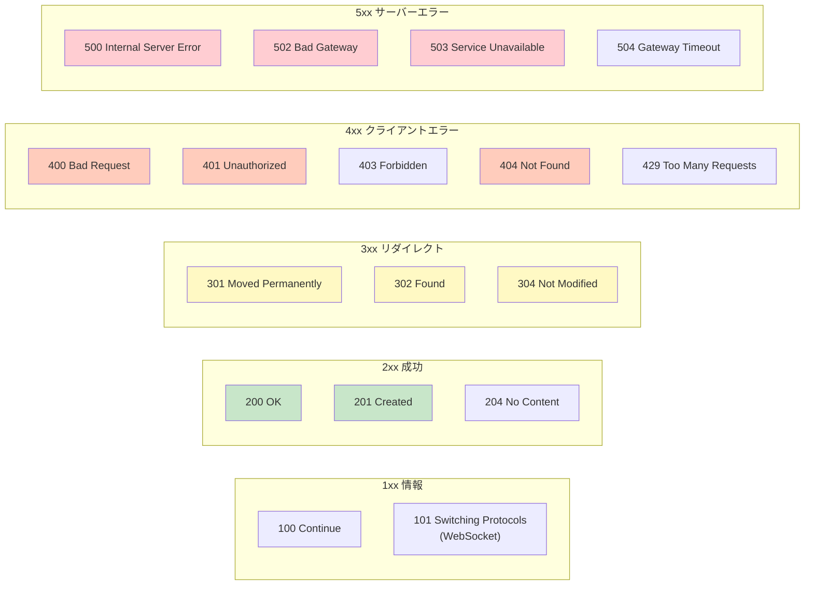
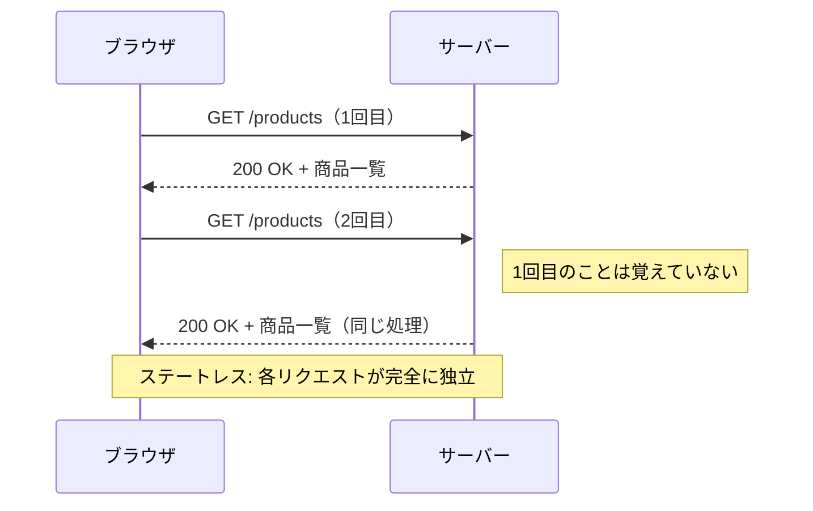
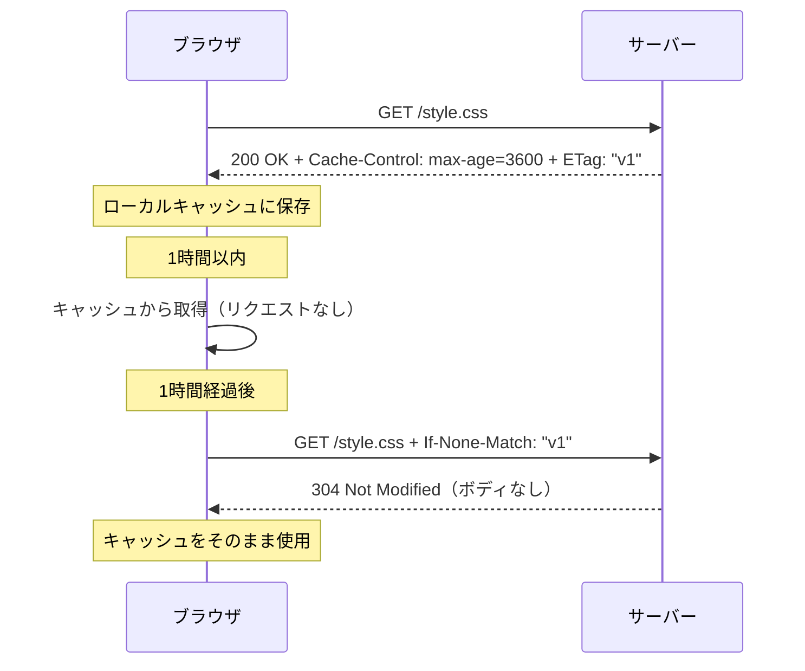
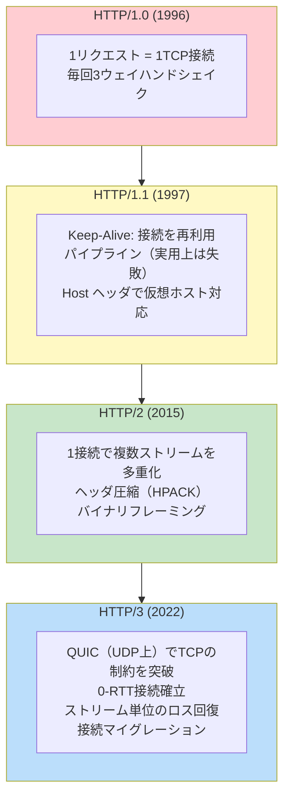

# HTTP/HTTPS

> **一言で言うと:** HTTP（HyperText Transfer Protocol）はWebにおけるクライアントとサーバー間の「共通言語」であり、HTTPS はその通信をTLSで暗号化した安全な版。ステートレス性・メソッドの意味論・キャッシュ制御がWebアーキテクチャ全体の設計を規定している。

## なぜ必要か

Webの本質は「離れたマシンにあるリソースを要求し、受け取る」ことである。しかし、その要求と応答の形式が統一されていなければ、ブラウザごと・サーバーごとに通信形式を個別実装しなければならない。

HTTPは**リクエストとレスポンスの構造・メソッドの意味・ステータスコードの体系**を標準化することで、あらゆるクライアントとサーバーが同じルールで通信できるようにした。この共通言語があるからこそ、ブラウザ・モバイルアプリ・API クライアント・CDN・リバースプロキシが相互に連携できる。

さらに、HTTP単体では通信内容が平文で流れるため、第三者による盗聴・改ざん・なりすましが可能になる。HTTPSは[[TLS-SSL]]による暗号化を追加し、**機密性（盗聴防止）・完全性（改ざん検知）・真正性（なりすまし防止）**を担保する。[[HTTPとHTTPSの違い]]はプロトコルの意味論ではなくTLSレイヤーの有無にあり、現在のWebでは HTTPS が事実上の標準であり、HTTPでの通信はブラウザが警告を表示する。

## どの問題を解決するか

### 課題1: リソースの取得と操作 — 「何をどうしたいか」を伝える

HTTPメソッド（HTTP Methods）は、リソースに対する操作の**意図**を表現する。これは単なる慣例ではなく、キャッシュ可否・べき等性・安全性に直結するセマンティクスを持つ。

| メソッド | 意味 | 安全性 | べき等性 | キャッシュ可能 |
|---------|------|--------|---------|-------------|
| **GET** | リソースの取得 | ✅ | ✅ | ✅ |
| **HEAD** | ヘッダのみ取得（GETからボディを除いた版） | ✅ | ✅ | ✅ |
| **POST** | リソースの作成・処理の実行 | ❌ | ❌ | 条件付き |
| **PUT** | リソースの完全な置き換え | ❌ | ✅ | ❌ |
| **PATCH** | リソースの部分更新 | ❌ | ❌ | ❌ |
| **DELETE** | リソースの削除 | ❌ | ✅ | ❌ |
| **OPTIONS** | 対応メソッドの確認（CORS プリフライト） | ✅ | ✅ | ❌ |

**安全性（Safe）**: サーバーの状態を変更しない。GETリクエストでデータが変わるAPIは設計ミス。
**べき等性（Idempotent）**: 同じリクエストを何度送っても結果が同じ。PUTで「この値にする」は何度やっても同じだが、POSTで「1加える」は毎回結果が変わる。

### 課題2: レスポンスの状態表現 — 「結果がどうなったか」を伝える

ステータスコード（Status Code）は3桁の数字で応答の状態を分類する。



実務で特に重要なステータスコード:

- **301 vs 302**: 301は恒久的リダイレクト（ブラウザがキャッシュする）、302は一時的リダイレクト。SEOに影響する
- **401 vs 403**: 401は「認証されていない（ログインしていない）」、403は「認証済みだが権限がない」。混同しやすい
- **429**: レート制限。API設計で重要。`Retry-After`ヘッダと組み合わせる
- **502 vs 504**: 502はリバースプロキシがバックエンドから不正な応答を受けた、504はバックエンドからの応答がタイムアウトした

### 課題3: ステートレス性と状態管理 — 「毎回初対面」という制約

HTTPはステートレス（Stateless）なプロトコルであり、各リクエストは独立している。サーバーは前回のリクエストを記憶しない。



**なぜステートレスか**: スケーラビリティのため。状態をサーバーが持たないので、どのサーバーにリクエストが振り分けられても処理できる。ロードバランサが自由にリクエストを分散できる。

しかし現実には「ログイン状態の維持」「ショッピングカート」など状態管理が必要。これを解決するのが:
- **Cookie**: サーバーが`Set-Cookie`で発行し、ブラウザが以後のリクエストに自動付与。セッションIDの運搬手段
- **セッション**: サーバー側に状態を保存し、セッションIDで紐付ける
- **JWT（JSON Web Token）**: 状態をトークン自体に埋め込み、サーバーが状態を持たずに認証を行う

### 課題4: キャッシュ制御 — 「同じリソースを何度も転送しない」

HTTPのキャッシュ機構はWebのパフォーマンスの根幹であり、ヘッダによって細かく制御される。

| ヘッダ | 役割 | 例 |
|--------|------|-----|
| `Cache-Control` | キャッシュの振る舞いを指示 | `max-age=3600, public` |
| `ETag` | リソースのバージョン識別子 | `"abc123"` |
| `Last-Modified` | 最終更新日時 | `Wed, 28 Mar 2026 00:00:00 GMT` |
| `If-None-Match` | 条件付きリクエスト（ETag比較） | `"abc123"` |
| `If-Modified-Since` | 条件付きリクエスト（日時比較） | 上記と同形式 |



`Cache-Control`の主要ディレクティブ:
- `public`: CDN等の共有キャッシュに保存してよい
- `private`: ブラウザのみキャッシュ可（ユーザー固有のデータ）
- `no-cache`: キャッシュを保存するが、使用前に必ずサーバーに検証する（「キャッシュしない」ではない）
- `no-store`: 一切キャッシュしない（機密データ用）
- `max-age=N`: N秒間キャッシュが新鮮とみなされる
- `immutable`: リソースが変更されないことを示す（ハッシュ付きファイル名と組み合わせる）

### 課題5: 通信の効率化 — HTTPバージョンの進化

HTTPはバージョンを重ねるたびに[[TCP-IP]]レベルのボトルネックを解消してきた。



| バージョン | TCP接続 | Head-of-Line Blocking | 暗号化 |
|-----------|---------|----------------------|--------|
| HTTP/1.0 | リクエストごとに新規 | — | 任意 |
| HTTP/1.1 | Keep-Aliveで再利用 | TCPレベルで発生 | 任意 |
| HTTP/2 | 1接続を多重化 | TCPレベルで発生（1パケットロスが全ストリームを止める） | 事実上必須（TLS） |
| HTTP/3 | QUIC（UDP上） | ストリーム単位で独立（解消） | 必須（TLS 1.3組み込み） |

**Head-of-Line Blocking（HoLB）**: HTTP/2は1つのTCP接続上に複数のストリームを多重化するが、TCPレイヤーでパケットロスが起きると、ロスに無関係なストリームも再送を待たされる。HTTP/3（QUIC）はUDP上に独自の信頼性レイヤーを構築し、この問題をストリーム単位で解決した。

なお、HTTPのレスポンスは必ずしも一括で返す必要はない。Chunked Transfer Encoding や Server-Sent Events（SSE）を使った[[ストリームレスポンス]]により、生成途中のデータを段階的にクライアントへ送出できる。LLM のトークン逐次表示や大規模データのエクスポートなど、現代の Web で重要性が高まっている技術である。

## HTTPリクエスト/レスポンスの構造

```
GET /api/users?page=2 HTTP/1.1        ← リクエストライン
Host: api.example.com                  ← ヘッダ
Accept: application/json
Authorization: Bearer eyJhbGc...
                                       ← 空行（ヘッダとボディの区切り）
                                       ← ボディ（GETでは通常なし）
```

```
HTTP/1.1 200 OK                        ← ステータスライン
Content-Type: application/json
Cache-Control: private, max-age=60
X-Request-Id: abc-123
                                       ← 空行
{"users": [...], "total": 42}          ← ボディ
```

## 他の仕組みとどう関係するか

- **下位レイヤーとの関係:**
  - [[TCP-IP]] — HTTP/1.1とHTTP/2はTCP上で動作する。TCPの3ウェイハンドシェイクのコスト（最低1.5 RTT）がHTTPのパフォーマンス特性を規定する。HTTP/3はUDP上のQUICに移行してこの制約を突破した
  - [[DNS]] — ブラウザがHTTPリクエストを送る前に、必ずドメイン名のDNS解決が先行する。DNS解決の遅延はTTFB（Time To First Byte）に直結する
  - [[プロセスとスレッド]] — HTTPサーバーのリクエスト処理モデル（マルチプロセス/マルチスレッド/[[イベントループ]]）は、OSのプロセスモデルの上に構築されている

- **同レイヤーとの関係:**
  - [[TLS-SSL]] — HTTPSはHTTPにTLSレイヤーを追加したもの。TLSハンドシェイクがTCPハンドシェイクに続いて行われるため、HTTPS接続確立にはさらに1〜2 RTTが追加される（TLS 1.3では1 RTT、0-RTTも可能）
  - [[WebSocket]] — HTTPの「リクエスト-レスポンス」モデルでは解決できないサーバープッシュを実現する。最初のHTTPリクエストで`Upgrade: websocket`ヘッダを送り、プロトコルを切り替える
  - [[DNS]] — DNS CAAレコードはHTTPSの証明書発行制限に関わり、ALIASレコードはCDN連携に使われる

- **上位レイヤーとの関係:**
  - [[ロードバランシング]] — L7ロードバランサはHTTPヘッダやURLパスに基づいて振り分けを行う。L4（TCP）とは異なり、リクエストの内容を理解した上でルーティングできる
  - [[CDN]] — HTTPキャッシュヘッダ（`Cache-Control`, `ETag`）に基づいてエッジサーバーがコンテンツをキャッシュする。CDNの効果はキャッシュ設計の質に依存する

## 誤解されやすいポイント

### 1. 「GETとPOSTの違いはURLにパラメータが見えるかどうか」

よくある説明だが本質を見誤っている。GETとPOSTの本質的な違いは**セマンティクス（意味論）**である:
- **GET**は安全でべき等。リソースの状態を変更しない。結果をキャッシュできる。ブラウザが自由にプリフェッチしてよい
- **POST**は安全でもべき等でもない。副作用がある操作に使う。キャッシュされない

GETで状態を変更する設計（例: `GET /delete?id=5`）は、ブラウザのプリフェッチやクローラーによって意図せずリソースが削除される危険がある。

### 2. 「HTTPSにすればセキュリティは万全」

HTTPSは**通信経路の暗号化**を提供するが、以下は守らない:
- サーバー上のデータの暗号化
- SQLインジェクションやXSSへの防御
- 認証・認可の正しさ
- APIの入力バリデーション

HTTPSは「通信が盗聴・改ざんされない」ことを保証するだけであり、アプリケーションレベルのセキュリティは別途必要。

### 3. 「`no-cache`はキャッシュしないという意味」

`Cache-Control: no-cache`は「キャッシュに保存してよいが、使用する前に必ず元のサーバーに再検証（revalidation）せよ」という意味。キャッシュを一切保存しないのは`no-store`である。

```
no-cache  → キャッシュ保存 ✅、使用前に毎回サーバーに確認 ✅
no-store  → キャッシュ保存 ❌（機密データ向け）
```

### 4. 「HTTP/2にすればすべてが速くなる」

HTTP/2の多重化は多数の小さなリクエスト（画像、CSS、JS）の並行ダウンロードに有効だが、以下のケースでは恩恵が薄い:
- 少数の大きなファイルの転送（動画ストリーミングなど）
- TCPレベルのHead-of-Line Blockingが発生するロスの多いネットワーク（モバイル回線など）
- HTTP/1.1で既にドメインシャーディングが最適化されている場合、HTTP/2への移行でかえって遅くなることもある

また、HTTP/1.1時代の最適化手法（CSSスプライト、ファイル結合、ドメインシャーディング）はHTTP/2ではアンチパターンになる場合がある。

## 設計のベストプラクティス

### キャッシュ戦略

```
✅ 推奨: コンテンツの性質に応じたキャッシュ設計
   - 静的アセット（JS/CSS/画像）: ファイル名にハッシュを含め、長期キャッシュ
     → Cache-Control: public, max-age=31536000, immutable
     → style.a1b2c3.css（内容が変わればファイル名も変わる）
   - APIレスポンス: ETag + 短いmax-ageで再検証
     → Cache-Control: private, max-age=60
   - 機密データ: キャッシュ禁止
     → Cache-Control: no-store

❌ アンチパターン: すべてのレスポンスにno-cacheを設定
   - キャッシュの恩恵を完全に失い、不要なリクエストが増加
   - CDNも機能しなくなる
```

### APIレスポンス設計

```
✅ 推奨: 適切なステータスコードを使い分ける
   - 200: 正常な取得・更新
   - 201: リソースの新規作成（Locationヘッダで作成先URIを返す）
   - 204: 成功したがボディなし（DELETE後など）
   - 400: クライアントの入力エラー
   - 404: リソースが存在しない
   - 422: バリデーションエラー（入力の形式は正しいが意味的に不正）
   - 429: レート制限超過（Retry-Afterヘッダ付き）
   - 500: サーバー内部エラー

❌ アンチパターン: すべて200で返し、ボディ内のフラグで成否を判定
   - HTTPクライアント・ミドルウェア・モニタリングがステータスコードに依存している
   - エラーがキャッシュされるリスクがある
```

### セキュリティヘッダ

```
✅ 推奨: セキュリティ関連のレスポンスヘッダを設定
   - Strict-Transport-Security（HSTS）: HTTPSを強制
   - Content-Security-Policy（CSP）: XSS対策
   - X-Content-Type-Options: nosniff — MIMEスニッフィング防止
   - X-Frame-Options: DENY — クリックジャッキング防止

❌ アンチパターン: CORS を Access-Control-Allow-Origin: * で全開にする
   - 認証が必要なAPIで全オリジンを許可するとセキュリティリスク
   - 必要なオリジンだけ明示的に許可する
```

## AIによる実装のアンチパターン

| アンチパターン | なぜ問題か | 対策 |
|---|---|---|
| すべてのAPIエンドポイントをPOSTで実装する | GETのキャッシュ可能性やべき等性の恩恵を失う。RESTful設計の意味論が壊れる | リソースの取得はGET、作成はPOST、更新はPUT/PATCH、削除はDELETEを使う |
| エラーレスポンスを200で返しボディに`{"error": true}`を入れる | HTTPクライアントのエラーハンドリング、ミドルウェア、モニタリングツールがすべて機能しなくなる | 適切なHTTPステータスコードを使い、ボディにエラーの詳細を含める |
| `Cache-Control`ヘッダを設定しない | ブラウザやCDNのデフォルトキャッシュ動作に依存し、予測不能な結果になる | すべてのレスポンスに明示的な`Cache-Control`を設定する |
| CORSの問題を`Access-Control-Allow-Origin: *`で解決する | 認証付きAPIでは`credentials: include`と`*`は共存できない。セキュリティリスクも高い | 許可するオリジンを明示的に列挙する |
| HTTPSを開発環境で使わない | 本番との挙動の差異（SecureCookie、HSTS、Mixed Content）が見逃される | mkcert等でローカル証明書を発行し、開発環境もHTTPS化する |

## 具体例

### Node.js — HTTPレスポンスヘッダの適切な設定

```javascript
import express from 'express';

const app = express();

// セキュリティヘッダのミドルウェア
app.use((req, res, next) => {
  res.set({
    'Strict-Transport-Security': 'max-age=63072000; includeSubDomains; preload',
    'X-Content-Type-Options': 'nosniff',
    'X-Frame-Options': 'DENY',
  });
  next();
});

// 静的アセット: ハッシュ付きファイル名 + 長期キャッシュ
app.use('/assets', express.static('public/assets', {
  maxAge: '1y',
  immutable: true,
}));

// APIエンドポイント: 適切なステータスコードとキャッシュ制御
app.get('/api/users/:id', async (req, res) => {
  const user = await findUser(req.params.id);
  if (!user) {
    return res.status(404).json({ error: 'User not found' });
  }
  res.set('Cache-Control', 'private, max-age=60');
  res.set('ETag', `"${user.updatedAt.getTime()}"`);
  res.json(user);
});

// POST: リソース作成 → 201 + Location
app.post('/api/users', async (req, res) => {
  const user = await createUser(req.body);
  res.status(201)
    .location(`/api/users/${user.id}`)
    .json(user);
});

// DELETE: 成功 → 204 No Content
app.delete('/api/users/:id', async (req, res) => {
  await deleteUser(req.params.id);
  res.status(204).end();
});
```

### Python — requestsによるHTTPクライアントのベストプラクティス

```python
import requests
from requests.adapters import HTTPAdapter
from urllib3.util.retry import Retry

# リトライ戦略付きのセッション
session = requests.Session()
retry = Retry(
    total=3,
    backoff_factor=0.5,       # 0.5s → 1s → 2s の指数バックオフ
    status_forcelist=[502, 503, 504],
)
session.mount("https://", HTTPAdapter(max_retries=retry))

# タイムアウトは必ず設定する
response = session.get(
    "https://api.example.com/data",
    timeout=(3.05, 30),  # (接続タイムアウト, 読み取りタイムアウト)
    headers={"Accept": "application/json"},
)

# ステータスコードに基づくエラーハンドリング
response.raise_for_status()  # 4xx/5xx で例外を送出
data = response.json()
```

### Go — HTTPサーバーのタイムアウト設計

```go
package main

import (
	"encoding/json"
	"log"
	"net/http"
	"time"
)

func main() {
	mux := http.NewServeMux()
	mux.HandleFunc("GET /api/health", func(w http.ResponseWriter, r *http.Request) {
		w.Header().Set("Cache-Control", "no-store")
		w.WriteHeader(http.StatusOK)
		json.NewEncoder(w).Encode(map[string]string{"status": "ok"})
	})

	// タイムアウトを明示的に設定する
	server := &http.Server{
		Addr:         ":8080",
		Handler:      mux,
		ReadTimeout:  5 * time.Second,   // リクエスト読み取りの上限
		WriteTimeout: 10 * time.Second,  // レスポンス書き込みの上限
		IdleTimeout:  120 * time.Second, // Keep-Alive接続のアイドル上限
	}

	log.Println("Listening on :8080")
	log.Fatal(server.ListenAndServe())
}
```

### curl — HTTPリクエストの調査・デバッグ

```bash
# レスポンスヘッダの確認（-I はHEADリクエスト）
curl -I https://example.com

# リクエスト/レスポンスの詳細を表示（-v: verbose）
curl -v https://example.com 2>&1 | head -30

# 接続時間・TTFB・転送時間の計測
curl -o /dev/null -s -w "\
  DNS解決:       %{time_namelookup}s\n\
  TCP接続:       %{time_connect}s\n\
  TLSハンドシェイク: %{time_appconnect}s\n\
  TTFB:          %{time_starttransfer}s\n\
  合計:           %{time_total}s\n\
  HTTPバージョン: %{http_version}\n" \
  https://example.com

# HTTP/2での通信を確認
curl --http2 -I https://example.com
```

### ブラウザ DevTools — HTTPヘッダの確認

```
Chrome DevTools → Network タブ で確認できる情報:
  - Request/Response Headers（キャッシュ制御、CORS、認証）
  - Timing（DNS, TCP, TLS, TTFB の内訳）
  - Protocol（h2 = HTTP/2, h3 = HTTP/3）
  - Size（転送サイズ vs 実サイズ — 圧縮の効果）
```

## 参考リソース

- **書籍**: 『Real World HTTP 第3版』（渋川よしき） — HTTP/1.1からHTTP/3までの包括的な解説。Go のコード例付き
- **書籍**: 『Webを支える技術 — HTTP、URI、HTML、そしてREST』（山本陽平） — HTTPとRESTの設計思想を理解する定番書
- **RFC 9110**: HTTP Semantics（HTTP/1.1, HTTP/2, HTTP/3共通のセマンティクス定義） — https://datatracker.ietf.org/doc/html/rfc9110
- **RFC 9111**: HTTP Caching — https://datatracker.ietf.org/doc/html/rfc9111
- **Web**: MDN Web Docs: HTTP — https://developer.mozilla.org/ja/docs/Web/HTTP
- **Web**: High Performance Browser Networking（Ilya Grigorik） — HTTP/2, QUIC, パフォーマンス最適化の解説

## 学習メモ

- HTTPキャッシュ戦略の詳細（`stale-while-revalidate`, `stale-if-error`等の応用ディレクティブ）は深掘り候補
- CORSの仕組み（プリフライトリクエスト、`credentials`モード）は[[CORS]]や[[Layer6-セキュリティ/_index|セキュリティ]]の文脈で重要 — セキュリティレイヤーで詳細を扱う
- HTTP/3（QUIC）のコネクションマイグレーション（Wi-Fi↔モバイルの切り替え時に接続が切れない）はモバイル時代の重要な改善
- Content Negotiation（`Accept`, `Accept-Language`によるコンテンツ交渉）はAPI設計で地味に重要
