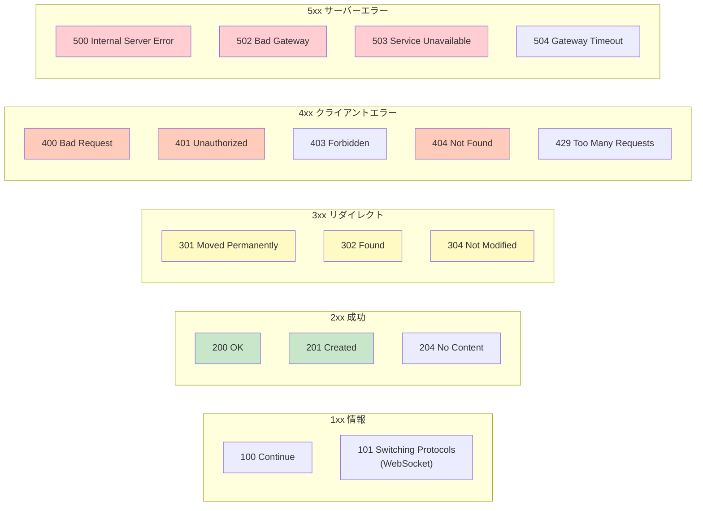
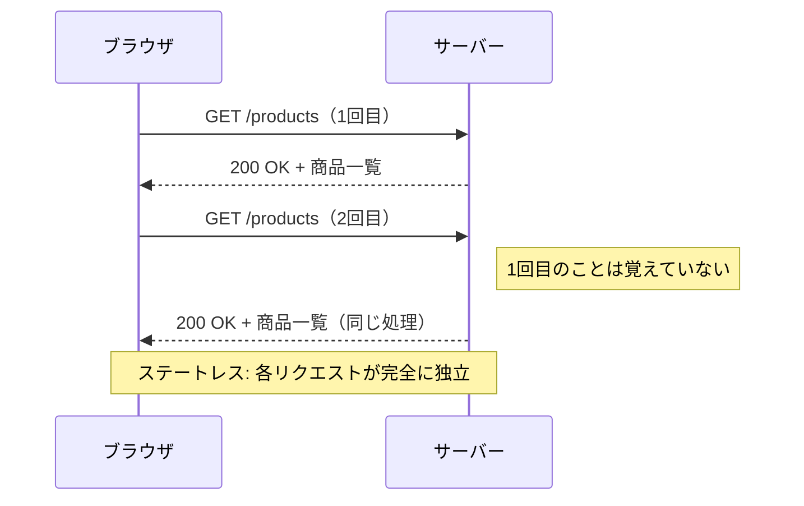
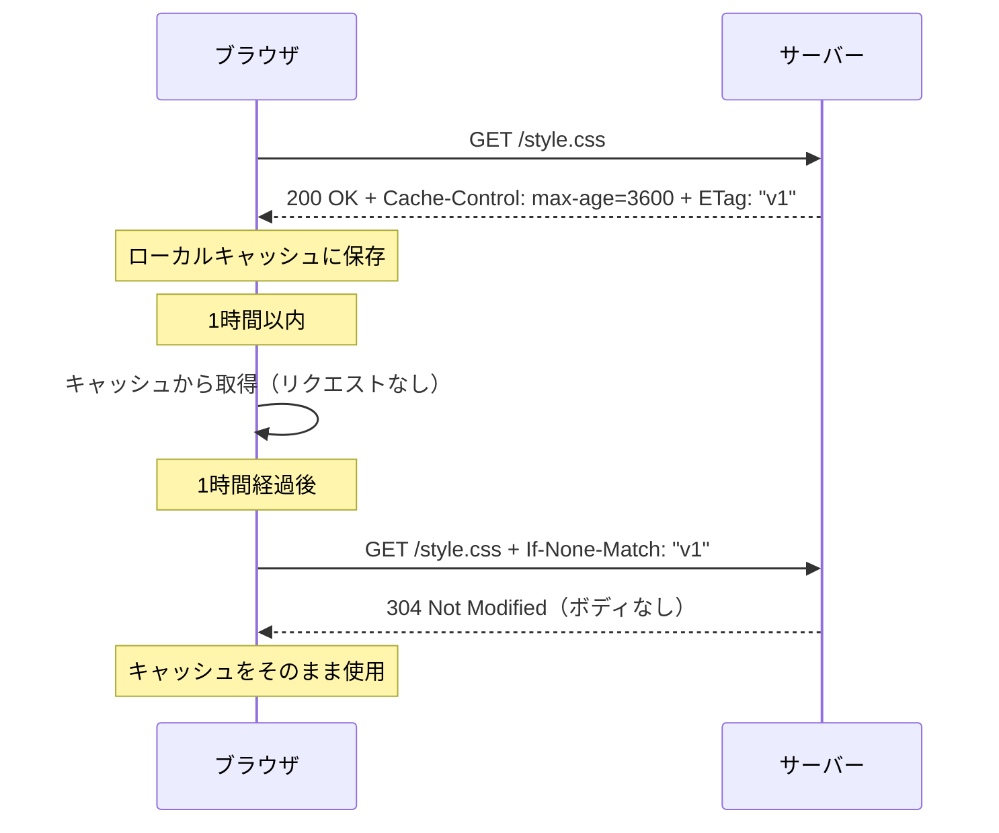
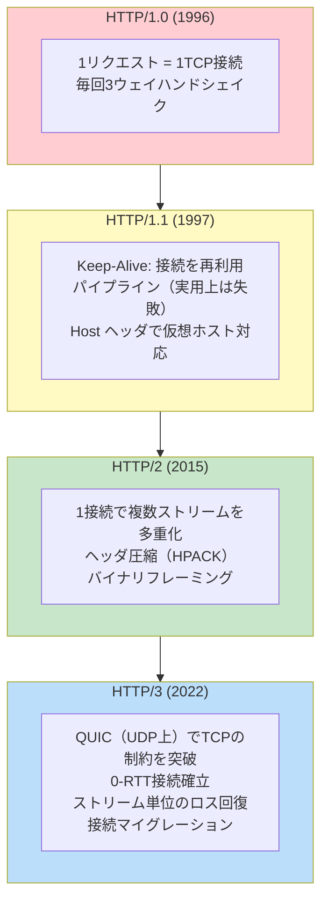

# HTTP/HTTPS

> **一言で言うと:** HTTP（HyperText Transfer Protocol）はWebにおけるクライアントとサーバー間の「共通言語」であり、HTTPS はその通信をTLSで暗号化した安全な版。ステートレス性・メソッドの意味論・キャッシュ制御がWebアーキテクチャ全体の設計を規定している。

## 3分で全体像

- **何を解決する技術か:** Web 上のクライアント・サーバー間で「リソースを取得・操作する」共通ルール（メソッドの意味、ステータスコード、キャッシュ制御、認証）を提供し、ブラウザ・モバイル・API・CDN・LB が相互に連携できる前提を作る
- **代表的な使用シーン:** Web ブラウジング、REST/GraphQL API、CDN 配信、Webhook、OAuth 認証、ヘルスチェック、メトリクスエンドポイント、画像/動画配信
- **これだけは覚える3つ:**
    1. **メソッドの意味（safety / idempotency）が設計の出発点** — GET は安全、PUT/DELETE はべき等。これを破ると CDN・ブラウザのプリフェッチ・リトライがすべて壊れる
    2. **適切なステータスコードを使う** — 全部 200 で返してボディに `{"error": true}` は典型的なアンチパターン。HTTP クライアント・ミドルウェア・モニタリングが機能しなくなる
    3. **`Cache-Control` を必ず明示する** — デフォルト動作はブラウザ・CDN ごとにバラバラ。`no-cache` は「キャッシュしない」ではなく「使う前に検証する」、`no-store` が「キャッシュ禁止」
- **AIに任せやすいか:** **任せやすい** — REST API のスケルトン、ステータスコードの選択、`Cache-Control` ヘッダのテンプレ、curl コマンドのデバッグは AI が高品質に書ける。AIコードレビュー観点でメソッドの誤用や全 200 アンチパターン、CORS の `*` 過剰許可も検出可能。一方「キャッシュ TTL の値選定」「セキュリティヘッダの段階導入」「HTTP/2 → HTTP/3 移行のタイミング」は運用・コスト・ブラウザサポートを踏まえて人間が判断
- **詰まったらここを読む:** [[TCP-IP]] / [[TLS-SSL]] / [[DNS]]

## なぜ必要か

Webの本質は「離れたマシンにあるリソースを要求し、受け取る」ことである。しかし、その要求と応答の形式が統一されていなければ、ブラウザごと・サーバーごとに通信形式を個別実装しなければならない。

HTTPは**リクエストとレスポンスの構造・メソッドの意味・ステータスコードの体系**を標準化することで、あらゆるクライアントとサーバーが同じルールで通信できるようにした。この共通言語があるからこそ、ブラウザ・モバイルアプリ・API クライアント・CDN・リバースプロキシが相互に連携できる。同じ仕組みを利用して、プログラムからWebページのデータを自動取得する[[Webスクレイピング]]も HTTP GET リクエストの応用として成り立っている。

さらに、HTTP単体では通信内容が平文で流れるため、第三者による盗聴・改ざん・なりすましが可能になる。HTTPSは[[TLS-SSL]]による暗号化を追加し、**機密性（盗聴防止）・完全性（改ざん検知）・真正性（なりすまし防止）**を担保する。[[HTTPとHTTPSの違い]]はプロトコルの意味論ではなくTLSレイヤーの有無にあり、現在のWebでは HTTPS が事実上の標準であり、HTTPでの通信はブラウザが警告を表示する。

## どの問題を解決するか

### 課題1: リソースの取得と操作 — 「何をどうしたいか」を伝える

HTTPメソッド（HTTP Methods）は、リソースに対する操作の**意図**を表現する。これは単なる慣例ではなく、キャッシュ可否・べき等性・安全性に直結するセマンティクスを持つ。

| メソッド | 意味 | 安全性 | べき等性 | キャッシュ可能 |
|---------|------|--------|---------|-------------|
| **GET** | リソースの取得 | ✅ | ✅ | ✅ |
| **HEAD** | ヘッダのみ取得（GETからボディを除いた版） | ✅ | ✅ | ✅ |
| **POST** | リソースの作成・処理の実行 | ❌ | ❌ | 条件付き |
| **PUT** | リソースの完全な置き換え | ❌ | ✅ | ❌ |
| **PATCH** | リソースの部分更新 | ❌ | ❌ | ❌ |
| **DELETE** | リソースの削除 | ❌ | ✅ | ❌ |
| **OPTIONS** | 対応メソッドの確認（CORS プリフライト） | ✅ | ✅ | ❌ |

**安全性（Safe）**: サーバーの状態を変更しない。GETリクエストでデータが変わるAPIは設計ミス。
**べき等性（Idempotent）**: 同じリクエストを何度送っても結果が同じ。PUTで「この値にする」は何度やっても同じだが、POSTで「1加える」は毎回結果が変わる。

### 課題2: レスポンスの状態表現 — 「結果がどうなったか」を伝える

ステータスコード（Status Code）は3桁の数字で応答の状態を分類する。


```mermaid
graph LR
    subgraph "1xx 情報"
        S100["100 Continue"]
        S101["101 Switching Protocols<br/>(WebSocket)"]
    end

    subgraph "2xx 成功"
        S200["200 OK"]
        S201["201 Created"]
        S204["204 No Content"]
    end

    subgraph "3xx リダイレクト"
        S301["301 Moved Permanently"]
        S302["302 Found"]
        S304["304 Not Modified"]
    end

    subgraph "4xx クライアントエラー"
        S400["400 Bad Request"]
        S401["401 Unauthorized"]
        S403["403 Forbidden"]
        S404["404 Not Found"]
        S429["429 Too Many Requests"]
    end

    subgraph "5xx サーバーエラー"
        S500["500 Internal Server Error"]
        S502["502 Bad Gateway"]
        S503["503 Service Unavailable"]
        S504["504 Gateway Timeout"]
    end

    style S200 fill:#c8e6c9
    style S201 fill:#c8e6c9
    style S301 fill:#fff9c4
    style S302 fill:#fff9c4
    style S304 fill:#fff9c4
    style S400 fill:#ffccbc
    style S401 fill:#ffccbc
    style S404 fill:#ffccbc
    style S500 fill:#ffcdd2
    style S502 fill:#ffcdd2
    style S503 fill:#ffcdd2
```

実務で特に重要なステータスコード:

- **301 vs 302**: 301は恒久的リダイレクト（ブラウザがキャッシュする）、302は一時的リダイレクト。SEOに影響する
- **401 vs 403**: 401は「認証されていない（ログインしていない）」、403は「認証済みだが権限がない」。混同しやすい
- **429**: レート制限。API設計で重要。`Retry-After`ヘッダと組み合わせる
- **502 vs 504**: 502はリバースプロキシがバックエンドから不正な応答を受けた、504はバックエンドからの応答がタイムアウトした

### 課題3: ステートレス性と状態管理 — 「毎回初対面」という制約

HTTPはステートレス（Stateless）なプロトコルであり、各リクエストは独立している。サーバーは前回のリクエストを記憶しない。


```mermaid
sequenceDiagram
    participant B as ブラウザ
    participant S as サーバー

    B->>S: GET /products（1回目）
    S-->>B: 200 OK + 商品一覧

    B->>S: GET /products（2回目）
    Note right of S: 1回目のことは覚えていない
    S-->>B: 200 OK + 商品一覧（同じ処理）

    Note over B,S: ステートレス: 各リクエストが完全に独立
```

**なぜステートレスか**: スケーラビリティのため。状態をサーバーが持たないので、どのサーバーにリクエストが振り分けられても処理できる。ロードバランサが自由にリクエストを分散できる。

しかし現実には「ログイン状態の維持」「ショッピングカート」など状態管理が必要。これを解決するのが:
- **Cookie**: サーバーが`Set-Cookie`で発行し、ブラウザが以後のリクエストに自動付与。セッションIDの運搬手段（属性 `Secure`/`HttpOnly`/`SameSite`/`Domain` 等の詳細は → [[Cookie]]）
- **セッション**: サーバー側に状態を保存し、セッションIDで紐付ける
- **JWT（JSON Web Token）**: 状態をトークン自体に埋め込み、サーバーが状態を持たずに認証を行う

### 課題4: キャッシュ制御 — 「同じリソースを何度も転送しない」

HTTPのキャッシュ機構はWebのパフォーマンスの根幹であり、ヘッダによって細かく制御される。

| ヘッダ | 役割 | 例 |
|--------|------|-----|
| `Cache-Control` | キャッシュの振る舞いを指示 | `max-age=3600, public` |
| `ETag` | リソースのバージョン識別子 | `"abc123"` |
| `Last-Modified` | 最終更新日時 | `Wed, 28 Mar 2026 00:00:00 GMT` |
| `If-None-Match` | 条件付きリクエスト（ETag比較） | `"abc123"` |
| `If-Modified-Since` | 条件付きリクエスト（日時比較） | 上記と同形式 |


```mermaid
sequenceDiagram
    participant B as ブラウザ
    participant S as サーバー

    B->>S: GET /style.css
    S-->>B: 200 OK + Cache-Control: max-age=3600 + ETag: "v1"
    Note over B: ローカルキャッシュに保存

    Note over B: 1時間以内
    B->>B: キャッシュから取得（リクエストなし）

    Note over B: 1時間経過後
    B->>S: GET /style.css + If-None-Match: "v1"
    S-->>B: 304 Not Modified（ボディなし）
    Note over B: キャッシュをそのまま使用
```

`Cache-Control`の主要ディレクティブ:
- `public`: CDN等の共有キャッシュに保存してよい
- `private`: ブラウザのみキャッシュ可（ユーザー固有のデータ）
- `no-cache`: キャッシュを保存するが、使用前に必ずサーバーに検証する（「キャッシュしない」ではない）
- `no-store`: 一切キャッシュしない（機密データ用）
- `max-age=N`: N秒間キャッシュが新鮮とみなされる
- `immutable`: リソースが変更されないことを示す（ハッシュ付きファイル名と組み合わせる）

### 課題5: 通信の効率化 — HTTPバージョンの進化

HTTPはバージョンを重ねるたびに[[TCP-IP]]レベルのボトルネックを解消してきた。


```mermaid
graph TB
    subgraph HTTP1_0["HTTP/1.0 (1996)"]
        A1["1リクエスト = 1TCP接続<br/>毎回3ウェイハンドシェイク"]
    end

    subgraph HTTP1_1["HTTP/1.1 (1997)"]
        A2["Keep-Alive: 接続を再利用<br/>パイプライン（実用上は失敗）<br/>Host ヘッダで仮想ホスト対応"]
    end

    subgraph HTTP2["HTTP/2 (2015)"]
        A3["1接続で複数ストリームを多重化<br/>ヘッダ圧縮（HPACK）<br/>バイナリフレーミング"]
    end

    subgraph HTTP3["HTTP/3 (2022)"]
        A4["QUIC（UDP上）でTCPの制約を突破<br/>0-RTT接続確立<br/>ストリーム単位のロス回復<br/>接続マイグレーション"]
    end

    HTTP1_0 --> HTTP1_1 --> HTTP2 --> HTTP3

    style HTTP1_0 fill:#ffcdd2
    style HTTP1_1 fill:#fff9c4
    style HTTP2 fill:#c8e6c9
    style HTTP3 fill:#bbdefb
```

| バージョン | TCP接続 | Head-of-Line Blocking | 暗号化 |
|-----------|---------|----------------------|--------|
| HTTP/1.0 | リクエストごとに新規 | — | 任意 |
| HTTP/1.1 | Keep-Aliveで再利用 | TCPレベルで発生 | 任意 |
| HTTP/2 | 1接続を多重化 | TCPレベルで発生（1パケットロスが全ストリームを止める） | 事実上必須（TLS） |
| HTTP/3 | QUIC（UDP上） | ストリーム単位で独立（解消） | 必須（TLS 1.3組み込み） |

**Head-of-Line Blocking（HoLB）**: HTTP/2は1つのTCP接続上に複数のストリームを多重化するが、TCPレイヤーでパケットロスが起きると、ロスに無関係なストリームも再送を待たされる。HTTP/3（QUIC）はUDP上に独自の信頼性レイヤーを構築し、この問題をストリーム単位で解決した。この進化がなぜこの順序で起きたのか——パイプラインがなぜ失敗し、なぜQUICはTCPではなくUDPの上に作られたのか、そして実務での有効化（`Alt-Svc`ヘッダ、UDP 443の開放）と落とし穴は [[HTTP-2とHTTP-3]] で詳しく扱う。

なお、HTTPのレスポンスは必ずしも一括で返す必要はない。Chunked Transfer Encoding や Server-Sent Events（SSE）を使った[[ストリームレスポンス]]により、生成途中のデータを段階的にクライアントへ送出できる。LLM のトークン逐次表示や大規模データのエクスポートなど、現代の Web で重要性が高まっている技術である。

## HTTPリクエスト/レスポンスの構造

```
GET /api/users?page=2 HTTP/1.1        ← リクエストライン
Host: api.example.com                  ← ヘッダ
Accept: application/json
Authorization: Bearer eyJhbGc...
User-Agent: Mozilla/5.0 ...            ← クライアントの自己申告情報
                                       ← 空行（ヘッダとボディの区切り）
                                       ← ボディ（GETでは通常なし）
```

リクエストヘッダのうち、[[User-Agentと生成AIクローラー|User-Agent]]はクライアントのソフトウェア情報をサーバーに伝える。ブラウザ・検索エンジンボット・生成AIクローラーがそれぞれ異なるUA文字列を送信し、サーバーはこれに基づいてコンテンツの出し分けやアクセス制御を行う。

```
HTTP/1.1 200 OK                        ← ステータスライン
Content-Type: application/json
Cache-Control: private, max-age=60
X-Request-Id: abc-123
                                       ← 空行
{"users": [...], "total": 42}          ← ボディ
```

## 他の仕組みとどう関係するか

- **下位レイヤーとの関係:**
  - [[TCP-IP]] — HTTP/1.1とHTTP/2はTCP上で動作する。TCPの3ウェイハンドシェイクのコスト（最低1.5 RTT）がHTTPのパフォーマンス特性を規定する。HTTP/3はUDP上のQUICに移行してこの制約を突破した
  - [[DNS]] — ブラウザがHTTPリクエストを送る前に、必ずドメイン名のDNS解決が先行する。DNS解決の遅延はTTFB（Time To First Byte）に直結する
  - [[プロセスとスレッド]] — HTTPサーバーのリクエスト処理モデル（マルチプロセス/マルチスレッド/[[イベントループ]]）は、OSのプロセスモデルの上に構築されている

- **同レイヤーとの関係:**
  - [[TLS-SSL]] — HTTPSはHTTPにTLSレイヤーを追加したもの。TLSハンドシェイクがTCPハンドシェイクに続いて行われるため、HTTPS接続確立にはさらに1〜2 RTTが追加される（TLS 1.3では1 RTT、0-RTTも可能）
  - [[WebSocket]] — HTTPの「リクエスト-レスポンス」モデルでは解決できないサーバープッシュを実現する。最初のHTTPリクエストで`Upgrade: websocket`ヘッダを送り、プロトコルを切り替える
  - [[DNS]] — DNS CAAレコードはHTTPSの証明書発行制限に関わり、ALIASレコードはCDN連携に使われる

- **上位レイヤーとの関係:**
  - [[ロードバランシング]] — L7ロードバランサはHTTPヘッダやURLパスに基づいて振り分けを行う。L4（TCP）とは異なり、リクエストの内容を理解した上でルーティングできる
  - [[CDN]] — HTTPキャッシュヘッダ（`Cache-Control`, `ETag`）に基づいてエッジサーバーがコンテンツをキャッシュする。CDNの効果はキャッシュ設計の質に依存する

## 誤解されやすいポイント

### 1. 「GETとPOSTの違いはURLにパラメータが見えるかどうか」

よくある説明だが本質を見誤っている。GETとPOSTの本質的な違いは**セマンティクス（意味論）**である:
- **GET**は安全でべき等。リソースの状態を変更しない。結果をキャッシュできる。ブラウザが自由にプリフェッチしてよい
- **POST**は安全でもべき等でもない。副作用がある操作に使う。キャッシュされない

GETで状態を変更する設計（例: `GET /delete?id=5`）は、ブラウザのプリフェッチやクローラーによって意図せずリソースが削除される危険がある。

### 2. 「HTTPSにすればセキュリティは万全」

HTTPSは**通信経路の暗号化**を提供するが、以下は守らない:
- サーバー上のデータの暗号化
- SQLインジェクションやXSSへの防御
- 認証・認可の正しさ
- APIの入力バリデーション

HTTPSは「通信が盗聴・改ざんされない」ことを保証するだけであり、アプリケーションレベルのセキュリティは別途必要。

### 3. 「`no-cache`はキャッシュしないという意味」

`Cache-Control: no-cache`は「キャッシュに保存してよいが、使用する前に必ず元のサーバーに再検証（revalidation）せよ」という意味。キャッシュを一切保存しないのは`no-store`である。

```
no-cache  → キャッシュ保存 ✅、使用前に毎回サーバーに確認 ✅
no-store  → キャッシュ保存 ❌（機密データ向け）
```

### 4. 「HTTP/2にすればすべてが速くなる」

HTTP/2の多重化は多数の小さなリクエスト（画像、CSS、JS）の並行ダウンロードに有効だが、以下のケースでは恩恵が薄い:
- 少数の大きなファイルの転送（動画ストリーミングなど）
- TCPレベルのHead-of-Line Blockingが発生するロスの多いネットワーク（モバイル回線など）
- HTTP/1.1で既にドメインシャーディングが最適化されている場合、HTTP/2への移行でかえって遅くなることもある

また、HTTP/1.1時代の最適化手法（CSSスプライト、ファイル結合、ドメインシャーディング）はHTTP/2ではアンチパターンになる場合がある。

## 設計のベストプラクティス

### キャッシュ戦略

```
✅ 推奨: コンテンツの性質に応じたキャッシュ設計
   - 静的アセット（JS/CSS/画像）: ファイル名にハッシュを含め、長期キャッシュ
     → Cache-Control: public, max-age=31536000, immutable
     → style.a1b2c3.css（内容が変わればファイル名も変わる）
   - APIレスポンス: ETag + 短いmax-ageで再検証
     → Cache-Control: private, max-age=60
   - 機密データ: キャッシュ禁止
     → Cache-Control: no-store

❌ アンチパターン: すべてのレスポンスにno-cacheを設定
   - キャッシュの恩恵を完全に失い、不要なリクエストが増加
   - CDNも機能しなくなる
```

### APIレスポンス設計

```
✅ 推奨: 適切なステータスコードを使い分ける
   - 200: 正常な取得・更新
   - 201: リソースの新規作成（Locationヘッダで作成先URIを返す）
   - 204: 成功したがボディなし（DELETE後など）
   - 400: クライアントの入力エラー
   - 404: リソースが存在しない
   - 422: バリデーションエラー（入力の形式は正しいが意味的に不正）
   - 429: レート制限超過（Retry-Afterヘッダ付き）
   - 500: サーバー内部エラー

❌ アンチパターン: すべて200で返し、ボディ内のフラグで成否を判定
   - HTTPクライアント・ミドルウェア・モニタリングがステータスコードに依存している
   - エラーがキャッシュされるリスクがある
```

### セキュリティヘッダ

```
✅ 推奨: セキュリティ関連のレスポンスヘッダを設定
   - Strict-Transport-Security（HSTS）: HTTPSを強制
   - Content-Security-Policy（CSP）: XSS対策
   - X-Content-Type-Options: nosniff — MIMEスニッフィング防止
   - X-Frame-Options: DENY — クリックジャッキング防止

❌ アンチパターン: CORS を Access-Control-Allow-Origin: * で全開にする
   - 認証が必要なAPIで全オリジンを許可するとセキュリティリスク
   - 必要なオリジンだけ明示的に許可する
```

## AIエージェントとの協働

> このトピックでAIコーディングエージェントと協働するための観点。「AIに何をどこまで任せ、人間は何を判断するか」を整理する。

### AIに任せられる部分 / 人間が判断すべき部分

| タスク種類 | 任せ方（実装/レビュー） | 人間の関与 |
|---|---|---|
| REST API ハンドラのスケルトン（ルーティング・バリデーション・ステータスコード分岐） | リソース定義（リソース名 + 操作）を渡して任せる | リソース設計（粒度、ネスト、URL 形式）の最終確定 |
| ステータスコード選定（201 vs 200、422 vs 400 vs 404） | 仕様を渡して任せる | API 全体での一貫性、既存エンドポイントとの整合性 |
| `Cache-Control` ヘッダの設計（max-age, public/private, immutable） | コンテンツ種別（静的/API/機密）を渡して任せる | TTL の値選定（事業のリリース頻度・データ更新頻度との整合） |
| CORS 設定（`Access-Control-Allow-Origin` 列挙、preflight 対応） | 許可するオリジン一覧を渡して任せる | オリジン一覧の最終確認、`credentials` モードの可否 |
| **メソッド誤用・全 200 アンチパターンのレビュー** | AIコードレビュー観点でレビューさせる | 指摘の妥当性判断、既存 API との互換性影響 |
| HTTP クライアントのリトライ・タイムアウト設定 | エンドポイントの SLA を渡して任せる | リトライ可否（操作のべき等性）、上限値 |
| セキュリティヘッダ（HSTS, CSP, X-Frame-Options 等）テンプレ | アプリの構成を渡して任せる | CSP の段階導入計画（Report-Only → 強制） |
| HTTP/2 vs HTTP/3 の選定 | アクセス特性（モバイル比率、地理的分散）を渡して比較してもらう | インフラの対応状況、CDN の HTTP/3 サポート、運用ツールの対応 |

### AI生成コードのレビュー観点（このトピック固有）

AI生成物を受け取ったとき、最低限ここを見る。

1. **メソッドとステータスコードがセマンティクスに沿っているか:** リソース取得が GET になっているか / 作成は 201 + Location ヘッダか / 削除成功は 204 か / 認証ありなら 401、権限なしなら 403 か（混同しやすい）
2. **`Cache-Control` が明示されているか:** 静的アセットは `public, max-age=31536000, immutable`、API は `private, max-age=N`、機密は `no-store`。全エンドポイントに明示があるか
3. **CORS が `Access-Control-Allow-Origin: *` で済まされていないか:** 特に認証付き API（`credentials: include`）と `*` は共存不可（仕様レベルで禁止されている）。許可オリジンを列挙しているか

### 効くプロンプトの型

このトピックに関する実装をAIに依頼するとき、コンテキストとして渡すべき情報・制約・成功基準のテンプレ。

```
# 前提
- フレームワーク: Express / Fastify / FastAPI / Gin / Spring Boot など
- API スタイル: REST / GraphQL / RPC
- 認証方式: Cookie セッション / JWT / OAuth
- CDN/CORS: 利用する CDN、許可するオリジン一覧
- HTTP バージョン: HTTP/1.1 / HTTP/2 / HTTP/3
- 既存 API との一貫性（既にあるエンドポイントの命名・ステータスコード方針）

# やってほしいこと
- 〜のリソース用 REST API ハンドラ / クライアント / Cache-Control 設定を実装

# 守ってほしい制約（このトピック固有）
- メソッドはセマンティクスに沿う（取得=GET, 作成=POST→201, 更新=PUT/PATCH, 削除=DELETE→204）
- 4xx/5xx を適切に使い分ける（401/403/404/422/429/500/502/503/504）
- Cache-Control は全レスポンスに明示。静的=long max-age + immutable、API=private + 短い max-age、機密=no-store
- CORS は許可オリジンを列挙（* 禁止、特に credentials を使う場合）
- HSTS / X-Content-Type-Options / X-Frame-Options のセキュリティヘッダを設定
- 入力バリデーションは 400/422 で詳細を返す（Problem Details for HTTP APIs / RFC 7807 形式推奨）

# 完了の判断基準
- curl で各エンドポイントを叩いてステータスコードとヘッダが意図通り
- ブラウザ DevTools で Cache-Control が効いていることを確認
- ロードテストで p99 レイテンシが SLA 内
- セキュリティヘッダのスキャン（securityheaders.com 等）で A 以上
```

### AI実装のアンチパターン

LLM生成コードで頻出する過剰設計・誤用パターン。レビュー時の照合表として使う。

| アンチパターン | なぜ問題か | レビュー観点 / 対策 |
|---|---|---|
| **すべてのエンドポイントを POST で実装** | GET のキャッシュ可能性・べき等性の恩恵を失う。CDN がリソースをキャッシュできず、ブラウザのプリフェッチも効かない。RESTful 設計の意味論が壊れる | リソース取得は GET、作成は POST、置換は PUT、部分更新は PATCH、削除は DELETE |
| **エラーを 200 で返しボディに `{"error": true}`** | HTTPクライアント（`response.ok` 判定）、ミドルウェア（リトライ、サーキットブレーカー）、モニタリング（5xx 率アラート）がすべて機能しなくなる | 4xx/5xx を使い分け、ボディは Problem Details (RFC 7807) 形式で詳細を返す |
| **`Cache-Control` 未設定でブラウザ任せ** | ブラウザ・CDN・プロキシのデフォルト動作はバラバラ。同じレスポンスが片方ではキャッシュされ片方でされない、再現性のない不具合の温床 | すべてのレスポンスに明示的に設定。静的=long + immutable、API=private + 短い max-age、機密=no-store |
| **`no-cache` で「キャッシュしない」のつもり** | `no-cache` は「キャッシュ保存はする、ただし使用前に必ず再検証する」の意味。「保存自体禁止」は `no-store` | 機密データには `no-store` を使う。区別を意識する |
| **CORS を `Access-Control-Allow-Origin: *` で雑に解決** | 認証付き API（`credentials: include` / Cookie 送信）と `*` は仕様上共存不可。`*` の場合、ブラウザが credentials を送らない | 許可するオリジンを列挙。動的判定する場合も allow list 方式に |
| **301 と 302 を混同して使う** | 301 はブラウザがキャッシュする恒久的リダイレクト。誤って一時的な切り替え（A/B テスト、メンテナンス）に使うと、戻したくても戻せなくなる（ユーザーのブラウザに 301 が残る） | 一時的=302 / 307 / 308、恒久的=301。SEO 的に正しい場合のみ 301 |
| **HTTPS を開発環境で使わない** | 本番との挙動の差異（Secure Cookie、HSTS、Mixed Content、SameSite=None requires Secure）が見逃され、本番で初めて壊れる | mkcert でローカル CA を作り、開発環境も HTTPS 化 |
| **User-Agent だけでボット判定** | UA は自己申告で偽装が容易。スクレイパーはブラウザの UA を名乗る | [[UA偽装とボット検出|TLSフィンガープリント・ヘッダ順序・行動分析]]を組み合わせる |

→ レイヤー横断のアンチパターン索引: [[_anti-patterns/_index|AIアンチパターン索引]]

## 具体例

### Node.js — HTTPレスポンスヘッダの適切な設定

```javascript
import express from 'express';

const app = express();

// セキュリティヘッダのミドルウェア
app.use((req, res, next) => {
  res.set({
    'Strict-Transport-Security': 'max-age=63072000; includeSubDomains; preload',
    'X-Content-Type-Options': 'nosniff',
    'X-Frame-Options': 'DENY',
  });
  next();
});

// 静的アセット: ハッシュ付きファイル名 + 長期キャッシュ
app.use('/assets', express.static('public/assets', {
  maxAge: '1y',
  immutable: true,
}));

// APIエンドポイント: 適切なステータスコードとキャッシュ制御
app.get('/api/users/:id', async (req, res) => {
  const user = await findUser(req.params.id);
  if (!user) {
    return res.status(404).json({ error: 'User not found' });
  }
  res.set('Cache-Control', 'private, max-age=60');
  res.set('ETag', `"${user.updatedAt.getTime()}"`);
  res.json(user);
});

// POST: リソース作成 → 201 + Location
app.post('/api/users', async (req, res) => {
  const user = await createUser(req.body);
  res.status(201)
    .location(`/api/users/${user.id}`)
    .json(user);
});

// DELETE: 成功 → 204 No Content
app.delete('/api/users/:id', async (req, res) => {
  await deleteUser(req.params.id);
  res.status(204).end();
});
```

### Python — requestsによるHTTPクライアントのベストプラクティス

```python
import requests
from requests.adapters import HTTPAdapter
from urllib3.util.retry import Retry

# リトライ戦略付きのセッション
session = requests.Session()
retry = Retry(
    total=3,
    backoff_factor=0.5,       # 0.5s → 1s → 2s の指数バックオフ
    status_forcelist=[502, 503, 504],
)
session.mount("https://", HTTPAdapter(max_retries=retry))

# タイムアウトは必ず設定する
response = session.get(
    "https://api.example.com/data",
    timeout=(3.05, 30),  # (接続タイムアウト, 読み取りタイムアウト)
    headers={"Accept": "application/json"},
)

# ステータスコードに基づくエラーハンドリング
response.raise_for_status()  # 4xx/5xx で例外を送出
data = response.json()
```

### Go — HTTPサーバーのタイムアウト設計

```go
package main

import (
	"encoding/json"
	"log"
	"net/http"
	"time"
)

func main() {
	mux := http.NewServeMux()
	mux.HandleFunc("GET /api/health", func(w http.ResponseWriter, r *http.Request) {
		w.Header().Set("Cache-Control", "no-store")
		w.WriteHeader(http.StatusOK)
		json.NewEncoder(w).Encode(map[string]string{"status": "ok"})
	})

	// タイムアウトを明示的に設定する
	server := &http.Server{
		Addr:         ":8080",
		Handler:      mux,
		ReadTimeout:  5 * time.Second,   // リクエスト読み取りの上限
		WriteTimeout: 10 * time.Second,  // レスポンス書き込みの上限
		IdleTimeout:  120 * time.Second, // Keep-Alive接続のアイドル上限
	}

	log.Println("Listening on :8080")
	log.Fatal(server.ListenAndServe())
}
```

### curl — HTTPリクエストの調査・デバッグ

```bash
# レスポンスヘッダの確認（-I はHEADリクエスト）
curl -I https://example.com

# リクエスト/レスポンスの詳細を表示（-v: verbose）
curl -v https://example.com 2>&1 | head -30

# 接続時間・TTFB・転送時間の計測
curl -o /dev/null -s -w "\
  DNS解決:       %{time_namelookup}s\n\
  TCP接続:       %{time_connect}s\n\
  TLSハンドシェイク: %{time_appconnect}s\n\
  TTFB:          %{time_starttransfer}s\n\
  合計:           %{time_total}s\n\
  HTTPバージョン: %{http_version}\n" \
  https://example.com

# HTTP/2での通信を確認
curl --http2 -I https://example.com
```

### ブラウザ DevTools — HTTPヘッダの確認

```
Chrome DevTools → Network タブ で確認できる情報:
  - Request/Response Headers（キャッシュ制御、CORS、認証）
  - Timing（DNS, TCP, TLS, TTFB の内訳）
  - Protocol（h2 = HTTP/2, h3 = HTTP/3）
  - Size（転送サイズ vs 実サイズ — 圧縮の効果）
```

## 参考リソース

- **書籍**: 『Real World HTTP 第3版』（渋川よしき） — HTTP/1.1からHTTP/3までの包括的な解説。Go のコード例付き
- **書籍**: 『Webを支える技術 — HTTP、URI、HTML、そしてREST』（山本陽平） — HTTPとRESTの設計思想を理解する定番書
- **RFC 9110**: HTTP Semantics（HTTP/1.1, HTTP/2, HTTP/3共通のセマンティクス定義） — https://datatracker.ietf.org/doc/html/rfc9110
- **RFC 9111**: HTTP Caching — https://datatracker.ietf.org/doc/html/rfc9111
- **Web**: MDN Web Docs: HTTP — https://developer.mozilla.org/ja/docs/Web/HTTP
- **Web**: High Performance Browser Networking（Ilya Grigorik） — HTTP/2, QUIC, パフォーマンス最適化の解説

## 理解度セルフチェック

> 答えられなければ本文に戻る。答えはこのファイル内に必ずある。

1. GET と POST の本質的な違いを「URLにパラメータが見えるかどうか」以外の観点で30秒で説明できるか（safety と idempotency に触れること）
2. 401 と 403 の使い分けを実例とともに示せ。混同するとどんな問題が起きるか
3. 次のAI生成 Express コードはこのトピックの観点で何が問題か。修正方針を述べよ:

```javascript
import express from 'express';
const app = express();
app.use(express.json());

// CORS設定
app.use((req, res, next) => {
  res.set('Access-Control-Allow-Origin', '*');
  res.set('Access-Control-Allow-Credentials', 'true');
  next();
});

// ユーザーを取得
app.post('/api/getUser', async (req, res) => {
  const user = await findUser(req.body.id);
  if (!user) {
    return res.json({ success: false, error: 'not found' });
  }
  res.json({ success: true, data: user });
});

// ユーザーを削除
app.get('/api/deleteUser', async (req, res) => {
  await deleteUser(req.query.id);
  res.json({ success: true });
});

app.listen(3000);
```

> [!info] 用語ミニ辞典（解答を読む前に）
> - **Safety（安全）** — リソースの状態を変更しないこと。GET / HEAD / OPTIONS は safe。安全なメソッドはブラウザが prefetch やリンクの先読みに自由に使える
> - **Idempotency（べき等性）** — 同じリクエストを何度送っても結果が同じになる性質。GET / PUT / DELETE はべき等、POST / PATCH は非べき等。リトライしてよいかの判断基準
> - **Problem Details（RFC 7807）** — HTTP API のエラーレスポンス形式の標準。`type`, `title`, `status`, `detail`, `instance` を含む JSON 構造。`Content-Type: application/problem+json`
> - **Preflight リクエスト** — クロスオリジンの非単純リクエスト（カスタムヘッダや PUT/DELETE 等）の前にブラウザが送る OPTIONS リクエスト。サーバーが許可していれば本リクエストが送られる
> - **Mixed Content** — HTTPS ページから HTTP リソース（画像、スクリプト、CSS）を読み込むこと。ブラウザがブロックする
> - **`credentials: include`** — Fetch API のオプション。クロスオリジン時に Cookie を送信する。`Allow-Origin: *` とは併用不可

> [!note]- 解答の指針
> **問1: GET と POST の本質的違い**
>
> URL にパラメータが見えるかは表面的な現象で、本質はセマンティクス。
>
> - **GET は safe** — リソースの状態を変更しない。同じ URL を何度叩いても結果は変わらない（時間経過によるデータ変化を除く）。だからブラウザがリンクの先読みやプリフェッチを自由にできる、CDN がキャッシュできる、検索エンジンがクロールできる
> - **GET は idempotent** — 何度送っても同じ。タイムアウト時にリトライしても安全
> - **POST は safe でも idempotent でもない** — 副作用がある。同じ POST を2回送ると、2回処理される（注文が2件作られる、課金が2回走る等）
>
> 結果として:
>
> - `GET /api/deleteUser?id=5` のような設計は危険。ブラウザのプリフェッチや検索エンジンクローラーが「先読み」した瞬間にユーザーが削除される。実際にこれで全データが消えた事故がある
> - キャッシュ可能性も違う。CDN は GET をキャッシュするが POST はキャッシュしない（一部例外あり）
>
> **問2: 401 と 403 の使い分け**
>
> - **401 Unauthorized** — 「**認証されていない**」。ログインしていない、トークン未提示、トークン期限切れ。`WWW-Authenticate` ヘッダで「どう認証すればよいか」を返す。クライアントは「ログインさせる」のが対応
> - **403 Forbidden** — 「**認証はされたが権限がない**」。ログイン済みだが、そのリソースにアクセスする権利がない。一般ユーザーが管理者ページにアクセスした、有料プラン限定機能を無料ユーザーが叩いた等
>
> **混同するとどうなるか:**
>
> - 認証切れに対して 403 を返すと、クライアントは「再ログインすれば解決」と判断できず、ユーザーに「権限がない」と表示する。実際は単にトークン期限切れ
> - 権限不足に 401 を返すと、クライアントが再ログインフローを起動し、ユーザーが何度ログインしてもアクセスできない無限ループに
>
> 設計時のフロー: 「未認証 / トークン無効」→ 401、「認証済みだが権限なし」→ 403、「リソース自体が存在しない」→ 404（権限の漏れを防ぐため、権限がないリソースの存在を漏らさないために 404 を返す設計もある）
>
> **問3: AI生成 Express コードの問題点**
>
> このコードは典型的な AI による「動くが意味論が壊れた」例。問題は4つ。
>
> **(a) 全エンドポイントが POST または GET で書かれているが、メソッドが意味と合っていない**
>
> - `POST /api/getUser` はリソース取得なので GET であるべき。POST にしているせいでキャッシュ不可、URL がリソースを表していない
> - `GET /api/deleteUser` は破壊的操作なので絶対に GET にしてはいけない。ブラウザのプリフェッチで意図せず削除されうる
>
> **(b) エラーを 200 で返している**
>
> `not found` のときに `200 + { success: false }` を返している。`response.ok`（200番台で true）でエラーが拾えず、HTTP クライアント・モニタリング・CDN がすべて誤動作する。
>
> **(c) `Access-Control-Allow-Origin: *` と `Access-Control-Allow-Credentials: true` の併用**
>
> これは仕様（CORS）違反で、ブラウザが拒否する。`*` は credentials なしの場合のみ使える。実際には Cookie が送信されず、認証が通らない。
>
> **(d) Preflight 対応がない / セキュリティヘッダがない**
>
> OPTIONS リクエストに対するハンドリングがない。`Access-Control-Allow-Methods`, `Access-Control-Allow-Headers` も未設定。HSTS、CSP、X-Content-Type-Options 等のセキュリティヘッダもない。
>
> **修正版（最小構成）:**
>
> 以下では `cors` ミドルウェア（Express 公式の [`cors` パッケージ](https://www.npmjs.com/package/cors)。許可オリジン・preflight・許可メソッドを宣言的に書ける）を使う。手書きでヘッダを設定するより安全で、preflight (OPTIONS) の自動応答も任せられる。
>
> ```javascript
> import express from 'express';
> import cors from 'cors';
> const app = express();
> app.use(express.json());
>
> // CORS: オリジンを列挙、credentials は明示
> app.use(cors({
>   origin: ['https://app.example.com', 'https://admin.example.com'],
>   credentials: true, // * とは併用しない
> }));
>
> // セキュリティヘッダ
> app.use((req, res, next) => {
>   res.set({
>     'Strict-Transport-Security': 'max-age=63072000; includeSubDomains; preload',
>     'X-Content-Type-Options': 'nosniff',
>     'X-Frame-Options': 'DENY',
>   });
>   next();
> });
>
> // GET: リソース取得 → 200 / 404
> app.get('/api/users/:id', async (req, res) => {
>   const user = await findUser(req.params.id);
>   if (!user) {
>     return res.status(404).json({
>       type: 'about:blank',
>       title: 'User not found',
>       status: 404,
>     });
>   }
>   res.set('Cache-Control', 'private, max-age=60');
>   res.json(user);
> });
>
> // DELETE: リソース削除 → 204
> app.delete('/api/users/:id', async (req, res) => {
>   await deleteUser(req.params.id);
>   res.status(204).end();
> });
>
> app.listen(3000);
> ```
>
> 「メソッドの意味」「ステータスコードの正しさ」「CORS の正しい設定」「セキュリティヘッダ」がこのトピックの最低ライン。

## 学習メモ

- HTTPキャッシュ戦略の詳細（`stale-while-revalidate`, `stale-if-error`等の応用ディレクティブ）は深掘り候補
- CORSの仕組み（プリフライトリクエスト、`credentials`モード）は[[CORS]]や[[Layer6-セキュリティ/_index|セキュリティ]]の文脈で重要 — セキュリティレイヤーで詳細を扱う
- HTTP/3（QUIC）のコネクションマイグレーション（Wi-Fi↔モバイルの切り替え時に接続が切れない）はモバイル時代の重要な改善
- Content Negotiation（`Accept`, `Accept-Language`によるコンテンツ交渉）はAPI設計で地味に重要
