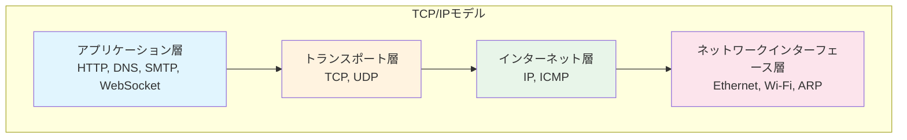
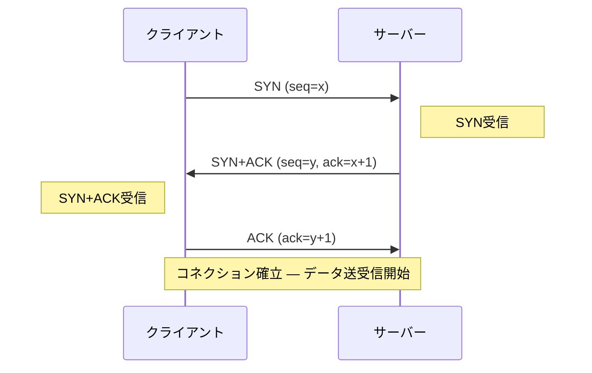

# TCP/IP

> **一言で言うと:** 物理的に離れたマシン間で「パケットが届く保証」を実現するプロトコル群であり、インターネット通信の基盤。

## なぜ必要か

ネットワーク上のデータ通信は本質的に**不確実**である。パケットは途中で消失し、順序が入れ替わり、重複して届く可能性がある。もしTCP/IPがなかったら、アプリケーション開発者は通信のたびに「データが届いたか確認し、欠損があれば再送し、順序を組み立て直す」ロジックを自分で書かなければならない。

TCP/IPプロトコルスタックは、この複雑さを**レイヤーごとに分離して隠蔽**することで、アプリケーション開発者が「送ったデータが正しく届く」という前提でコードを書けるようにしている。

## どの問題を解決するか

### 課題1: アドレッシング — 「誰に届けるか」

インターネット上には数十億のデバイスが存在する。IP（Internet Protocol）は各デバイスに一意のIPアドレスを割り当て、パケットの宛先を特定する。

- **IPv4**: 32ビット（例: `192.168.1.1`）、約43億アドレス — 枯渇済みだが[[IPv4がなぜ今も使われるのか|NATによる延命]]で現在も主流
- **IPv6**: 128ビット（例: `2001:0db8::1`）、事実上無限のアドレス空間

### 課題2: ルーティング — 「どの経路で届けるか」

IPレイヤーがパケットを中継ルーター経由で最終的な宛先まで届ける。各ルーターはルーティングテーブルに基づいて「次にどのルーターに転送するか」を判断する（ホップバイホップ転送）。

### 課題3: 信頼性 — 「確実に届ける」

IP自体は「ベストエフォート」であり、パケットの到達を保証しない。TCP（Transmission Control Protocol）がIP層の上に信頼性を追加する。

- **順序制御**: シーケンス番号で元の順序を復元
- **再送制御**: ACK（確認応答）が返らないパケットを再送
- **重複排除**: 同じシーケンス番号のパケットを破棄
- **フロー制御**: 受信側が処理しきれない速度で送らない（ウィンドウサイズ）
- **輻輳制御**: ネットワーク全体が詰まらないよう送信レートを調整

### 課題4: 多重化 — 「どのアプリケーションに届けるか」

1つのマシンで複数のアプリケーションが同時に通信する。**ポート番号**（0〜65535）によって、同一IPアドレス上の異なるアプリケーションを区別する。IPアドレスの種類（[[プライベートIPとパブリックIP]]）とポート番号の組み合わせが、通信の宛先を一意に特定する。

- Webサーバー: 80（HTTP）/ 443（HTTPS）
- SSH: 22
- DNS: 53

## TCP/IPモデルの4層構造

OSI参照モデル（7層）とは異なり、TCP/IPモデルは実用的な4層で構成される。



各層は**下位層のサービスを利用し、上位層にサービスを提供する**。この分離により、例えばEthernetをWi-Fiに変えてもTCPのコードは変更不要である。

## 3ウェイハンドシェイク

TCPコネクション確立のプロセス。このコストがHTTPパフォーマンスに直接影響する。各ステップで使われる[[TCPフラグとコネクション状態遷移|SYN・ACKなどのTCPフラグ]]が接続のライフサイクル全体を制御している。



**コスト**: 最低1.5 RTT（Round Trip Time）が必要。東京↔米国西海岸で約150msのRTTの場合、コネクション確立だけで約225msかかる。これが[[HTTP-HTTPS]]におけるKeep-AliveやHTTP/2のコネクション多重化が重要な理由である。

## TCP vs UDP

| 特性 | TCP | UDP |
|------|-----|-----|
| 接続 | コネクション型 | コネクションレス |
| 信頼性 | あり（再送・順序保証） | なし |
| 速度 | 比較的遅い（ハンドシェイク＋ACK） | 高速（オーバーヘッド小） |
| ユースケース | HTTP, SSH, DB接続 | DNS, 動画ストリーミング, ゲーム, VoIP |
| ヘッダサイズ | 20バイト以上 | 8バイト固定 |

UDPは信頼性を捨てる代わりに**低遅延**を得る。「古いパケットを待つより最新のパケットを見せる方がいい」ケース（映像・音声・ゲーム）で選択される。ただし、近年はUDP上に信頼性を追加したQUIC（HTTP/3の基盤）が登場している。

## 他の仕組みとどう関係するか

- **下位レイヤーとの関係:**
  - [[プロセスとスレッド]] — ソケット（Socket）はOSレベルのファイルディスクリプタであり、プロセスがネットワーク通信を行う際のインターフェースになる
  - [[ファイルシステムとIO]] — ネットワークI/Oもブロッキング/ノンブロッキング、多重化（epoll/kqueue）といった[[ファイルディスクリプタ]]の概念がそのまま適用される
  - [[Docker]] — DockerのブリッジネットワークやポートマッピングはTCP/IPの仕組みの上に構築されている

- **同レイヤーとの関係:**
  - [[DNS]] — ドメイン名をIPアドレスに解決した後、TCPまたはUDPでの通信が始まる。DNS自体は主にUDPを使用する（EDNS拡張により最大4096バイトまで対応、超える場合やゾーン転送ではTCPにフォールバック）
  - [[HTTP-HTTPS]] — HTTPはTCP上のアプリケーション層プロトコル。TCP接続のコスト（3ウェイハンドシェイク）がHTTPのパフォーマンス特性を規定する
  - [[TLS-SSL]] — TCPコネクション確立後、TLSハンドシェイクが追加で行われる。TLS 1.3ではこのコストを1-RTTに短縮
  - [[WebSocket]] — 最初のHTTPハンドシェイク後、TCP接続を維持したまま双方向通信に「アップグレード」する

- **上位レイヤーとの関係:**
  - [[ロードバランシング]] — L4ロードバランサはTCPレベルで接続を振り分ける（L7はHTTPレベル）
  - [[CDN]] — TCP接続のRTTを短縮するために、ユーザーに物理的に近いエッジサーバーを利用する

## 誤解されやすいポイント

### 1. 「TCPは遅い、UDPは速い」という単純な二項対立

TCPが「遅い」のはハンドシェイクと再送制御のオーバーヘッドであり、データ転送そのものが遅いわけではない。TCPのウィンドウサイズが十分大きければ、スループット（帯域利用率）は非常に高い。逆にUDPでもアプリケーション層で信頼性を実装すれば（QUICのように）オーバーヘッドが増える。「何の遅延が問題か（レイテンシか、スループットか）」を区別して考える必要がある。

### 2. 「ポート番号はセキュリティ機構である」

ポート番号は**多重化のためのアドレッシング機構**であり、セキュリティ境界ではない。「ポート80以外で動かしているから安全」は誤り。ポートスキャンで簡単に発見される。セキュリティはファイアウォール、認証、暗号化で担保すべきもの。

### 3. 「TCP接続=物理的な専用線」

TCPの「コネクション」は仮想的な概念であり、物理的な回線を占有しているわけではない。実際にはパケットが他の通信のパケットと混在してネットワーク上を流れる。コネクション状態はクライアントとサーバーの両端でシーケンス番号やウィンドウサイズとして保持されているだけである。

### 4. 「ローカルホスト（127.0.0.1）は通信していない」

`localhost`への通信もTCP/IPスタックを通る。カーネルのループバックインターフェースを経由するため物理NICは使わないが、ソケット通信としてのオーバーヘッドは発生する。Unixドメインソケットの方が同一マシン内通信には効率的である。

## 設計のベストプラクティス

### コネクション管理

```
✅ 推奨: コネクションプーリングを使う
   - DBコネクション、HTTPクライアントは接続を使い回す
   - 3ウェイハンドシェイクのコストを償却

❌ アンチパターン: リクエストごとに接続を作り直す
   - ハンドシェイクの遅延が毎回発生
   - 大量のTIME_WAIT状態ソケットでポート枯渇のリスク
```

### タイムアウト設計

```
✅ 推奨: 接続タイムアウトと読み取りタイムアウトを分離して設定
   - 接続タイムアウト: 短め（1〜5秒）— 相手が存在しない場合を素早く検知
   - 読み取りタイムアウト: 処理内容に応じて設定
   - アイドルタイムアウト: コネクションプール内の使われていない接続を回収

❌ アンチパターン: タイムアウトを設定しない、または無限大にする
   - 相手サーバーが応答しない場合、スレッド/コネクションがリークする
   - 障害の連鎖（カスケード障害）の原因になる
```

### Keep-Aliveとコネクション再利用

```
✅ 推奨: HTTP Keep-Aliveを有効にし、コネクションを再利用する
   - HTTP/1.1ではデフォルトで有効
   - HTTP/2では1コネクション上にストリームを多重化

❌ アンチパターン: Connection: close を毎回送る
   - 毎リクエストで3ウェイハンドシェイク + TLSハンドシェイクが発生
```

## AIによる実装のアンチパターン

| アンチパターン | なぜ問題か | 対策 |
|---|---|---|
| ソケット通信を生で実装する | HTTPクライアントライブラリが信頼性・パフォーマンスを担保している。車輪の再発明になりバグの温床 | 言語標準のHTTPクライアント（`fetch`, `http.Client`, `requests`等）を使う |
| タイムアウトなしのネットワーク呼び出し | 相手が応答しない場合に無限待ちしてリソースリーク | 必ず接続・読み取り・合計のタイムアウトを設定する |
| リトライを即座に無限回行う | サーバー障害時にリトライストームが発生し、障害を悪化させる | 指数バックオフ（Exponential Backoff）＋ジッター＋最大リトライ回数を設定 |
| エラー時にTCPコネクションを閉じない | FIN/RSTが送られず、相手側でリソースが残り続ける | `try-finally`（または言語のリソース管理構文）で確実にクローズ |

## 具体例

### Node.js — HTTPサーバーの接続タイムアウト設定

```javascript
import { createServer } from 'node:http';

const server = createServer((req, res) => {
  res.writeHead(200, { 'Content-Type': 'text/plain' });
  res.end('Hello\n');
});

// TCP接続のタイムアウト設定
server.keepAliveTimeout = 65_000;   // Keep-Alive接続のアイドルタイムアウト
server.headersTimeout = 66_000;     // ヘッダ受信のタイムアウト（keepAliveTimeoutより大きくする）
server.requestTimeout = 30_000;     // リクエスト全体のタイムアウト

server.listen(3000);
```

### Python — コネクションプーリングによる接続再利用

```python
import requests

# セッションを使うことでTCPコネクションを再利用する
session = requests.Session()

# 同じホストへの複数リクエストで接続が再利用される
for i in range(10):
    # 毎回TCPハンドシェイクが発生しない
    response = session.get("https://api.example.com/data", timeout=(3, 10))
    #                                                       timeout=(接続, 読み取り)
    print(response.status_code)

session.close()
```

### tcpdump — 3ウェイハンドシェイクの観察

```bash
# 特定ポートへのTCPハンドシェイクをキャプチャ
sudo tcpdump -i any -n 'tcp port 443 and (tcp[tcpflags] & (tcp-syn|tcp-ack) != 0)' -c 10

# 出力例:
# 10:00:00.000 IP 192.168.1.10.54321 > 93.184.216.34.443: Flags [S], seq 100    ← SYN
# 10:00:00.050 IP 93.184.216.34.443 > 192.168.1.10.54321: Flags [S.], seq 200   ← SYN+ACK
# 10:00:00.051 IP 192.168.1.10.54321 > 93.184.216.34.443: Flags [.], ack 201    ← ACK
```

### ss / netstat — TCP接続状態の確認

```bash
# 現在のTCP接続状態を確認（TIME_WAITの蓄積チェック等に有用）
ss -tan state time-wait | wc -l

# ポートごとの接続数を確認
ss -tan | awk '{print $4}' | sort | uniq -c | sort -rn | head -10
```

## 参考リソース

- **書籍**: 『マスタリングTCP/IP 入門編 第6版』（竹下隆史 他） — TCP/IPの定番教科書
- **書籍**: 『ネットワークはなぜつながるのか 第2版』（戸根勤） — パケットの旅を追体験する入門書
- **RFC 793**: TCP仕様の原典 — https://datatracker.ietf.org/doc/html/rfc793
- **RFC 9293**: TCP仕様の最新版（RFC 793の置き換え） — https://datatracker.ietf.org/doc/html/rfc9293
- **Web**: High Performance Browser Networking（Ilya Grigorik） — TCP/TLS/HTTP/2の包括的解説

## 学習メモ

- TCP輻輳制御アルゴリズム（Slow Start, Congestion Avoidance, CUBIC, BBR）の詳細は別途深掘り候補
- QUICプロトコル（UDP上のTCP代替）がHTTP/3の基盤になっている — [[HTTP-HTTPS]]と合わせて理解する
- `TIME_WAIT`状態の意味と、本番環境での大量発生時の対処法は実運用知識として重要
