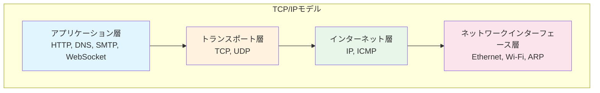
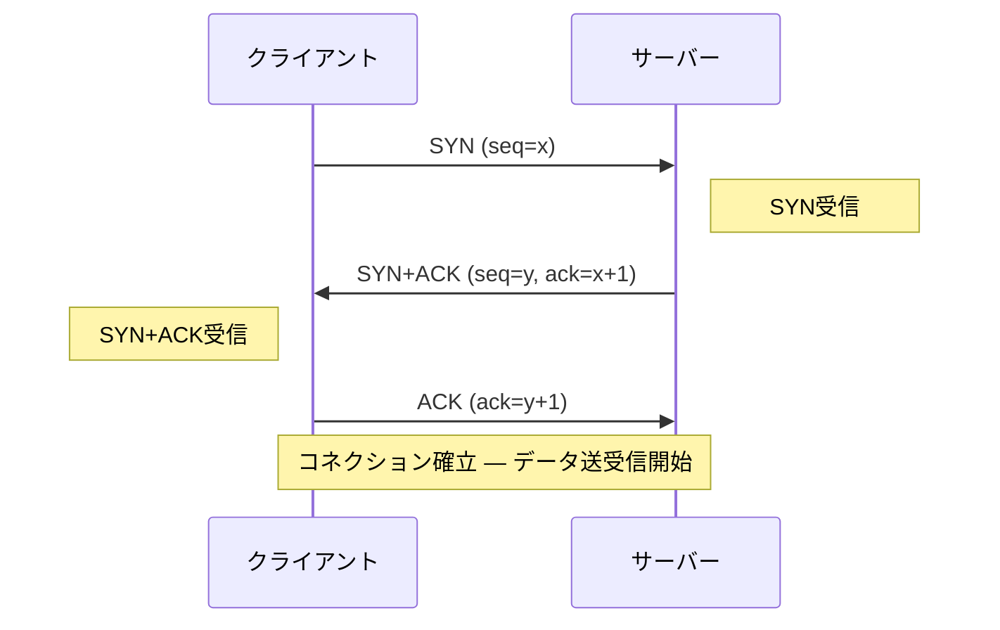

# TCP/IP

> **一言で言うと:** 物理的に離れたマシン間で「パケットが届く保証」を実現するプロトコル群であり、インターネット通信の基盤。

## 3分で全体像

- **何を解決する技術か:** 不確実なネットワーク（パケットの消失・順序入れ替え・重複）の上に「データが正しく届く」前提を提供する
- **代表的な使用シーン:** すべてのインターネット通信の土台。HTTP/HTTPS、SSH、メール、DB接続、VPN、ファイル転送のいずれもこの上に乗る
- **これだけは覚える3つ:**
    1. **TCP は信頼性、UDP は低遅延** — 何の遅延（レイテンシ vs スループット）が問題かでプロトコルを選ぶ。「TCP は遅い、UDP は速い」は雑な要約
    2. **3ウェイハンドシェイクは最低 1.5 RTT のコスト** — リクエストごとに接続を作り直すと、東京↔米西海岸で毎回 225ms 浪費する。Keep-Alive とコネクションプーリングが必須の理由
    3. **タイムアウトを必ず設定する** — 接続・読み取り・アイドルの3つを分離して設定。設定忘れがカスケード障害（障害の連鎖）の最大の原因
- **AIに任せやすいか:** **一部任せられる** — HTTPクライアントの初期化やリトライ戦略のドラフト、`tcpdump` / `ss` コマンドの組み立ては AI が高品質に書ける。一方「タイムアウトをどの値にするか」「接続プールのサイズをいくつにするか」は本番のRTT実測値・SLA・想定同時接続数に依存し、人間が判断する
- **詰まったらここを読む:** [[プロセスとスレッド]] / [[ファイルシステムとIO]] / [[DNS]]

## なぜ必要か

ネットワーク上のデータ通信は本質的に**不確実**である。パケットは途中で消失し、順序が入れ替わり、重複して届く可能性がある。もしTCP/IPがなかったら、アプリケーション開発者は通信のたびに「データが届いたか確認し、欠損があれば再送し、順序を組み立て直す」ロジックを自分で書かなければならない。

TCP/IPプロトコルスタックは、この複雑さを**レイヤーごとに分離して隠蔽**することで、アプリケーション開発者が「送ったデータが正しく届く」という前提でコードを書けるようにしている。

## どの問題を解決するか

### 課題1: アドレッシング — 「誰に届けるか」

インターネット上には数十億のデバイスが存在する。IP（Internet Protocol）は各デバイスに一意のIPアドレスを割り当て、パケットの宛先を特定する。

- **IPv4**: 32ビット（例: `192.168.1.1`）、約43億アドレス — 枯渇済みだが[[IPv4がなぜ今も使われるのか|NATによる延命]]で現在も主流
- **IPv6**: 128ビット（例: `2001:0db8::1`）、事実上無限のアドレス空間

### 課題2: ルーティング — 「どの経路で届けるか」

IPレイヤーがパケットを中継ルーター経由で最終的な宛先まで届ける。各ルーターはルーティングテーブルに基づいて「次にどのルーターに転送するか」を判断する（ホップバイホップ転送）。

### 課題3: 信頼性 — 「確実に届ける」

IP自体は「ベストエフォート」であり、パケットの到達を保証しない。TCP（Transmission Control Protocol）がIP層の上に信頼性を追加する。

- **順序制御**: シーケンス番号で元の順序を復元
- **再送制御**: ACK（確認応答）が返らないパケットを再送
- **重複排除**: 同じシーケンス番号のパケットを破棄
- **フロー制御**: 受信側が処理しきれない速度で送らない（ウィンドウサイズ）
- **輻輳制御**: ネットワーク全体が詰まらないよう送信レートを調整

### 課題4: 多重化 — 「どのアプリケーションに届けるか」

1つのマシンで複数のアプリケーションが同時に通信する。**ポート番号**（0〜65535）によって、同一IPアドレス上の異なるアプリケーションを区別する。IPアドレスの種類（[[プライベートIPとパブリックIP]]）とポート番号の組み合わせが、通信の宛先を一意に特定する。

- Webサーバー: 80（HTTP）/ 443（HTTPS）
- SSH: 22
- DNS: 53

## TCP/IPモデルの4層構造

OSI参照モデル（7層）とは異なり、TCP/IPモデルは実用的な4層で構成される。


```mermaid
graph TB
    subgraph "TCP/IPモデル"
        A["アプリケーション層<br/>HTTP, DNS, SMTP, WebSocket"]
        B["トランスポート層<br/>TCP, UDP"]
        C["インターネット層<br/>IP, ICMP"]
        D["ネットワークインターフェース層<br/>Ethernet, Wi-Fi, ARP"]
    end
    A --> B --> C --> D

    style A fill:#e1f5fe
    style B fill:#fff3e0
    style C fill:#e8f5e9
    style D fill:#fce4ec
```

各層は**下位層のサービスを利用し、上位層にサービスを提供する**。この分離により、例えばEthernetをWi-Fiに変えてもTCPのコードは変更不要である。

## 3ウェイハンドシェイク

TCPコネクション確立のプロセス。このコストがHTTPパフォーマンスに直接影響する。各ステップで使われる[[TCPフラグとコネクション状態遷移|SYN・ACKなどのTCPフラグ]]が接続のライフサイクル全体を制御している。


```mermaid
sequenceDiagram
    participant C as クライアント
    participant S as サーバー

    C->>S: SYN (seq=x)
    Note right of S: SYN受信
    S->>C: SYN+ACK (seq=y, ack=x+1)
    Note left of C: SYN+ACK受信
    C->>S: ACK (ack=y+1)
    Note over C,S: コネクション確立 — データ送受信開始
```

**コスト**: 最低1.5 RTT（Round Trip Time）が必要。東京↔米国西海岸で約150msのRTTの場合、コネクション確立だけで約225msかかる。これが[[HTTP-HTTPS]]におけるKeep-AliveやHTTP/2のコネクション多重化が重要な理由である。

## TCP vs UDP

| 特性 | TCP | UDP |
|------|-----|-----|
| 接続 | コネクション型 | コネクションレス |
| 信頼性 | あり（再送・順序保証） | なし |
| 速度 | 比較的遅い（ハンドシェイク＋ACK） | 高速（オーバーヘッド小） |
| ユースケース | HTTP, SSH, DB接続 | DNS, 動画ストリーミング, ゲーム, VoIP |
| ヘッダサイズ | 20バイト以上 | 8バイト固定 |

UDPは信頼性を捨てる代わりに**低遅延**を得る。「古いパケットを待つより最新のパケットを見せる方がいい」ケース（映像・音声・ゲーム）で選択される。ただし、近年はUDP上に信頼性を追加したQUIC（HTTP/3の基盤）が登場している。

## 他の仕組みとどう関係するか

- **下位レイヤーとの関係:**
  - [[プロセスとスレッド]] — ソケット（Socket）はOSレベルのファイルディスクリプタであり、プロセスがネットワーク通信を行う際のインターフェースになる
  - [[ファイルシステムとIO]] — ネットワークI/Oもブロッキング/ノンブロッキング、多重化（epoll/kqueue）といった[[ファイルディスクリプタ]]の概念がそのまま適用される
  - [[Docker]] — DockerのブリッジネットワークやポートマッピングはTCP/IPの仕組みの上に構築されている

- **同レイヤーとの関係:**
  - [[DNS]] — ドメイン名をIPアドレスに解決した後、TCPまたはUDPでの通信が始まる。DNS自体は主にUDPを使用する（EDNS拡張により最大4096バイトまで対応、超える場合やゾーン転送ではTCPにフォールバック）
  - [[HTTP-HTTPS]] — HTTPはTCP上のアプリケーション層プロトコル。TCP接続のコスト（3ウェイハンドシェイク）がHTTPのパフォーマンス特性を規定する
  - [[TLS-SSL]] — TCPコネクション確立後、TLSハンドシェイクが追加で行われる。TLS 1.3ではこのコストを1-RTTに短縮
  - [[WebSocket]] — 最初のHTTPハンドシェイク後、TCP接続を維持したまま双方向通信に「アップグレード」する

- **上位レイヤーとの関係:**
  - [[ロードバランシング]] — L4ロードバランサはTCPレベルで接続を振り分ける（L7はHTTPレベル）
  - [[CDN]] — TCP接続のRTTを短縮するために、ユーザーに物理的に近いエッジサーバーを利用する

## 誤解されやすいポイント

### 1. 「TCPは遅い、UDPは速い」という単純な二項対立

TCPが「遅い」のはハンドシェイクと再送制御のオーバーヘッドであり、データ転送そのものが遅いわけではない。TCPのウィンドウサイズが十分大きければ、スループット（帯域利用率）は非常に高い。逆にUDPでもアプリケーション層で信頼性を実装すれば（QUICのように）オーバーヘッドが増える。「何の遅延が問題か（レイテンシか、スループットか）」を区別して考える必要がある。

### 2. 「ポート番号はセキュリティ機構である」

ポート番号は**多重化のためのアドレッシング機構**であり、セキュリティ境界ではない。「ポート80以外で動かしているから安全」は誤り。ポートスキャンで簡単に発見される。セキュリティはファイアウォール、認証、暗号化で担保すべきもの。

### 3. 「TCP接続=物理的な専用線」

TCPの「コネクション」は仮想的な概念であり、物理的な回線を占有しているわけではない。実際にはパケットが他の通信のパケットと混在してネットワーク上を流れる。コネクション状態はクライアントとサーバーの両端でシーケンス番号やウィンドウサイズとして保持されているだけである。

### 4. 「ローカルホスト（127.0.0.1）は通信していない」

`localhost`への通信もTCP/IPスタックを通る。カーネルのループバックインターフェースを経由するため物理NICは使わないが、ソケット通信としてのオーバーヘッドは発生する。Unixドメインソケットの方が同一マシン内通信には効率的である。

## 設計のベストプラクティス

### コネクション管理

```
✅ 推奨: コネクションプーリングを使う
   - DBコネクション、HTTPクライアントは接続を使い回す
   - 3ウェイハンドシェイクのコストを償却

❌ アンチパターン: リクエストごとに接続を作り直す
   - ハンドシェイクの遅延が毎回発生
   - 大量のTIME_WAIT状態ソケットでポート枯渇のリスク
```

### タイムアウト設計

```
✅ 推奨: 接続タイムアウトと読み取りタイムアウトを分離して設定
   - 接続タイムアウト: 短め（1〜5秒）— 相手が存在しない場合を素早く検知
   - 読み取りタイムアウト: 処理内容に応じて設定
   - アイドルタイムアウト: コネクションプール内の使われていない接続を回収

❌ アンチパターン: タイムアウトを設定しない、または無限大にする
   - 相手サーバーが応答しない場合、スレッド/コネクションがリークする
   - 障害の連鎖（カスケード障害）の原因になる
```

### Keep-Aliveとコネクション再利用

```
✅ 推奨: HTTP Keep-Aliveを有効にし、コネクションを再利用する
   - HTTP/1.1ではデフォルトで有効
   - HTTP/2では1コネクション上にストリームを多重化

❌ アンチパターン: Connection: close を毎回送る
   - 毎リクエストで3ウェイハンドシェイク + TLSハンドシェイクが発生
```

## AIエージェントとの協働

> このトピックでAIコーディングエージェントと協働するための観点。「AIに何をどこまで任せ、人間は何を判断するか」を整理する。

### AIに任せられる部分 / 人間が判断すべき部分

「実装もレビューもAIに任せられる」前提で人間の最終判断を整理する。

| タスク種類 | 任せ方（実装/レビュー） | 人間の関与 |
|---|---|---|
| HTTPクライアントの初期化（コネクションプール設定・タイムアウト・リトライ戦略） | 仕様（言語・フレームワーク・呼び出し先）を渡して任せる | タイムアウト値の最終確定（実測 RTT と SLA を踏まえて） |
| 指数バックオフ + ジッター付きリトライの実装 | 「冪等性のある操作のみリトライ」と制約を渡して任せる | 上限回数の決定、サーキットブレーカー併用の要否 |
| `tcpdump` / `ss` / `netstat` コマンドの組み立て | 調査目的（TIME_WAIT 蓄積、特定ポートの SYN 観察等）を渡して任せる | 実環境での実行可否、本番でのキャプチャ許可 |
| **タイムアウト・コネクション数のレビュー** | `/review-ai-code` でレビューさせる | 指摘の妥当性判断 |
| 接続プールのサイズ決定 | 候補と根拠（同時接続数、サーバー側上限）を AI に出させる | 本番の同時実行プロセス数・ワーカー数を踏まえて確定 |
| TCP/UDP の選定 | 要件（再送許容性、パケットロス時の挙動）を渡してトレードオフを聞く | アプリの「古いデータを待つか / 最新を見せるか」の方針 |
| ローカルテストでの3ウェイハンドシェイク観察 | `tcpdump` フィルタの組み立てを任せる | キャプチャした PCAP の解釈（再送パターン等） |

### AI生成コードのレビュー観点（このトピック固有）

AI生成物を受け取ったとき、最低限ここを見る。

1. **タイムアウトが3種類ともあるか:** 接続タイムアウト・読み取りタイムアウト・アイドルタイムアウト（Keep-Alive）の3つ。1つ抜けるとリソースリークの原因になる
2. **コネクションを使い回しているか:** リクエストごとに `new HTTPClient()` を作っていないか。ループや関数呼び出しのたびに 3ウェイハンドシェイク + TLSハンドシェイクが発生して致命的に遅い。セッション/プールを上位スコープで持つ
3. **リトライにバックオフ + ジッター + 上限があるか:** 即座に無限リトライは「リトライストーム」を引き起こし、復旧中のサーバーに追い打ちをかける。冪等な操作（GET, PUT, DELETE）のみリトライ対象にしているかも確認

### 効くプロンプトの型

このトピックに関する実装をAIに依頼するとき、コンテキストとして渡すべき情報・制約・成功基準のテンプレ。

```
# 前提
- 言語/ランタイム: Node.js 22 / Python 3.12 / Go 1.22 など
- 呼び出し先: 同一クラスタ内マイクロサービス / 外部公開API / DB
- 想定 RTT: ローカル <1ms / 同一AZ ~1ms / リージョン間 ~30-100ms / 国際 ~150-300ms
- 想定 QPS とワーカー並列数
- SLA: p99 レイテンシ X ms 以内 / 可用性 99.9% など

# やってほしいこと
- 〜のクライアント/サーバーを実装

# 守ってほしい制約（このトピック固有）
- 接続タイムアウト・読み取りタイムアウト・アイドルタイムアウトを必ず分離設定
- HTTPクライアントは関数外で1回だけ生成し、コネクションプール / Keep-Alive で再利用
- リトライは指数バックオフ + ジッター + 最大3回。冪等な操作のみ対象
- エラー時のクローズ漏れがないよう try-finally / context manager / defer を使う

# 完了の判断基準
- 想定負荷で TIME_WAIT が異常蓄積しない（`ss -tan state time-wait | wc -l` で確認）
- p99 レイテンシが SLA 以内
- 障害注入（接続拒否 / レイテンシ悪化 / TCP RST）でリトライ後にエラーが上位に伝播
```

### AI実装のアンチパターン

LLM生成コードで頻出する過剰設計・誤用パターン。レビュー時の照合表として使う。

| アンチパターン | なぜ問題か | レビュー観点 / 対策 |
|---|---|---|
| **ソケット通信を生で実装** | HTTPクライアントライブラリが信頼性・パフォーマンスを担保しているのに自前で再発明する。バグの温床になり、HTTP/2 や TLS との互換性も失う | 言語標準のHTTPクライアント（`fetch`, `http.Client`, `requests` 等）を使う |
| **タイムアウトなしのネットワーク呼び出し** | 相手が応答しないと無限待ちしてスレッド/コネクションがリークする。同時に到来する他のリクエストも処理できなくなりカスケード障害になる | 接続・読み取り・全体のタイムアウトを必ず設定。デフォルト値を信用しない |
| **リトライを即座に無限回** | サーバー障害時にリトライストーム（同時に集中する再送波）が発生し、復旧しかけたサーバーをまた潰す | 指数バックオフ + ジッター + 最大回数。冪等な操作のみリトライ |
| **リクエストごとに HTTPClient を新規生成** | 毎回 3ウェイハンドシェイク + TLSハンドシェイクが発生。レイテンシが数倍になる。`TIME_WAIT` でローカルポートが枯渇する | クライアントを上位スコープで生成し、コネクションプール / Keep-Alive で再利用 |
| **エラー時にコネクションを閉じない** | FIN/RST が送られず相手側でリソースが残り続ける（CLOSE_WAIT が蓄積） | `try-finally` / `context manager` / `defer` で確実にクローズ |
| **「念のため」全エラーを `catch` して握りつぶす** | 上位（フレームワークやモニタリング）でのエラーハンドリングが効かなくなり、障害が見えなくなる | 内部でリトライしないエラーは上位に再 throw する |

→ レイヤー横断のアンチパターン索引: [[_anti-patterns/_index|AIアンチパターン索引]]

## 具体例

### Node.js — HTTPサーバーの接続タイムアウト設定

```javascript
import { createServer } from 'node:http';

const server = createServer((req, res) => {
  res.writeHead(200, { 'Content-Type': 'text/plain' });
  res.end('Hello\n');
});

// TCP接続のタイムアウト設定
server.keepAliveTimeout = 65_000;   // Keep-Alive接続のアイドルタイムアウト
server.headersTimeout = 66_000;     // ヘッダ受信のタイムアウト（keepAliveTimeoutより大きくする）
server.requestTimeout = 30_000;     // リクエスト全体のタイムアウト

server.listen(3000);
```

### Python — コネクションプーリングによる接続再利用

```python
import requests

# セッションを使うことでTCPコネクションを再利用する
session = requests.Session()

# 同じホストへの複数リクエストで接続が再利用される
for i in range(10):
    # 毎回TCPハンドシェイクが発生しない
    response = session.get("https://api.example.com/data", timeout=(3, 10))
    #                                                       timeout=(接続, 読み取り)
    print(response.status_code)

session.close()
```

### tcpdump — 3ウェイハンドシェイクの観察

```bash
# 特定ポートへのTCPハンドシェイクをキャプチャ
sudo tcpdump -i any -n 'tcp port 443 and (tcp[tcpflags] & (tcp-syn|tcp-ack) != 0)' -c 10

# 出力例:
# 10:00:00.000 IP 192.168.1.10.54321 > 93.184.216.34.443: Flags [S], seq 100    ← SYN
# 10:00:00.050 IP 93.184.216.34.443 > 192.168.1.10.54321: Flags [S.], seq 200   ← SYN+ACK
# 10:00:00.051 IP 192.168.1.10.54321 > 93.184.216.34.443: Flags [.], ack 201    ← ACK
```

### ss / netstat — TCP接続状態の確認

```bash
# 現在のTCP接続状態を確認（TIME_WAITの蓄積チェック等に有用）
ss -tan state time-wait | wc -l

# ポートごとの接続数を確認
ss -tan | awk '{print $4}' | sort | uniq -c | sort -rn | head -10
```

## 参考リソース

- **書籍**: 『マスタリングTCP/IP 入門編 第6版』（竹下隆史 他） — TCP/IPの定番教科書
- **書籍**: 『ネットワークはなぜつながるのか 第2版』（戸根勤） — パケットの旅を追体験する入門書
- **RFC 793**: TCP仕様の原典 — https://datatracker.ietf.org/doc/html/rfc793
- **RFC 9293**: TCP仕様の最新版（RFC 793の置き換え） — https://datatracker.ietf.org/doc/html/rfc9293
- **Web**: High Performance Browser Networking（Ilya Grigorik） — TCP/TLS/HTTP/2の包括的解説

## 理解度セルフチェック

> 答えられなければ本文に戻る。答えはこのファイル内に必ずある。

1. 「TCP は遅い、UDP は速い」という説明が不正確である理由を、レイテンシとスループットを区別して説明できるか
2. `Connection: close` を毎回送る HTTP クライアントが本番で問題を起こす理由を、3ウェイハンドシェイクのコストと TIME_WAIT 状態の観点で説明せよ
3. 次のAI生成 Node.js コードはこのトピックの観点で何が問題か。修正方針を述べよ:

```javascript
// 外部APIから1000件のデータを順次取得する関数
async function fetchAll(ids) {
  const results = [];
  for (const id of ids) {
    const res = await fetch(`https://api.example.com/items/${id}`);
    const data = await res.json();
    results.push(data);
  }
  return results;
}
```

> [!info] 用語ミニ辞典（解答を読む前に）
> - **RTT（Round Trip Time）** — パケットが相手に届いて応答が返ってくるまでの往復時間。物理距離に依存し、東京↔米西海岸で約 150ms、同一AZ で約 1ms 以下
> - **3ウェイハンドシェイク** — TCP接続を確立する SYN → SYN+ACK → ACK の3往復。最低 1.5 RTT のコストがかかる
> - **TIME_WAIT** — TCPコネクションを閉じた側に残る状態。遅延パケットが新しい接続に紛れ込まないよう一定時間（多くの OS で約60秒）保持される。短時間に大量の接続を作って閉じるとローカルポートが枯渇する原因になる
> - **Keep-Alive** — 一度確立した TCP 接続を再利用するための仕組み。HTTP/1.1 ではデフォルトで有効。`Connection: keep-alive` ヘッダで制御
> - **コネクションプール** — クライアント側で複数の TCP 接続を保持・使い回す仕組み。HTTP クライアントライブラリが標準で提供する
> - **冪等性（Idempotent）** — 同じ操作を何度実行しても結果が同じになる性質。GET / PUT / DELETE は冪等、POST は非冪等。リトライしてよいかの判断基準になる

> [!note]- 解答の指針
> **問1: 「TCP は遅い、UDP は速い」が不正確な理由**
>
> 「TCP が遅い」と言うとき、何の遅延を指しているかを区別する必要がある。
>
> - **接続確立のレイテンシ:** TCP は 3ウェイハンドシェイクの 1.5 RTT が必要。UDP は接続概念がないので即座に送信できる。**この点では TCP のほうが遅い**
> - **データ転送中のスループット:** TCP のウィンドウサイズ（一度に送信できる未確認データ量）が十分大きければ、帯域幅をフルに使える。ロスのないネットワークでは UDP との差はほとんどない
> - **再送・順序復元のオーバーヘッド:** TCP は ACK と再送制御で「確実に届く」を保証するため、ロス時のレイテンシが伸びる。UDP はそれを捨てているので低遅延になる
>
> 結局、選択基準は「**何の遅延が問題か**」と「**信頼性をプロトコル層で担保したいか、アプリ層で担保したいか**」。動画ストリーミングや VoIP は「古いパケットを待つより最新を見せたい」ので UDP（または UDP上の QUIC）。Web API や DB 接続は「届かないと意味がない」ので TCP。
>
> ちなみに HTTP/3 は UDP 上の QUIC で動く。「UDP のほうが速い」のではなく、「QUIC は TCP の制約（Head-of-Line Blocking、ハンドシェイクの遅さ）を解決するために UDP の上に独自の信頼性レイヤーを構築した」が正しい理解。
>
> **問2: `Connection: close` を毎回送る問題**
>
> HTTP/1.1 はデフォルトで Keep-Alive が有効で、1つの TCP 接続を複数のリクエストで使い回す。`Connection: close` を毎回送ると、毎リクエストで以下が発生する:
>
> 1. **TCP 3ウェイハンドシェイク** — 1.5 RTT。リージョン間で 150-450ms
> 2. **TLSハンドシェイク**（HTTPS の場合） — TLS 1.3 で 1 RTT 追加。1.2 だと 2 RTT
>
> 結果、リクエストごとに 100ms 〜 500ms のオーバーヘッドが追加される。10件取得するだけで数秒の無駄になる。
>
> さらに深刻なのが **TIME_WAIT の蓄積**。クローズ側に残る TIME_WAIT 状態は約60秒持続するため、毎秒 1000 件接続を作って閉じると瞬く間に 60,000 件の TIME_WAIT が積み上がり、ローカルポート（約 28,000 個）を使い切ってクライアントが新規接続を作れなくなる（`EADDRNOTAVAIL` エラー）。これは実運用でよく見る障害パターン。
>
> 対策は単純で、HTTP クライアントを上位スコープで1つだけ生成し、コネクションプールに任せる。`requests.Session()`、`http.Client{}`、`new Agent({ keepAlive: true })` のいずれもこれを実現する。
>
> **問3: AI生成コードの問題点**
>
> このコードには3つのレベルの問題がある。
>
> **(a) コネクションが使い回されない可能性**
>
> Node.js の `fetch` は内部で undici の Agent を使うが、明示的に Keep-Alive を有効にしたカスタム Agent を渡さないと、環境によっては毎回新規接続になる。同一ホストへの 1000 件のリクエストでは Keep-Alive が必須。
>
> **(b) タイムアウトがない**
>
> サーバー側がハングすると 1 件目で永久に待ち続け、関数が返らない。`AbortSignal.timeout(5000)` などで打ち切る必要がある。
>
> **(c) 順次処理で並列性ゼロ**
>
> 1000件を1件ずつ順番に取得すると、RTT × 1000 のレイテンシ。同時実行（並行リクエスト）で全体時間を激減できる。ただし無制限の並行は相手サーバーへの DoS 攻撃になりうるので、上限を設ける（セマフォ / キュー）。
>
> **修正版（最小構成）:**
>
> ```javascript
> import { Agent } from 'undici';
>
> // モジュールスコープで1回だけ生成（Keep-Alive 有効）
> const agent = new Agent({
>   keepAliveTimeout: 30_000,
>   keepAliveMaxTimeout: 60_000,
>   connections: 50, // 同一ホストへの並列接続上限
> });
>
> async function fetchAll(ids) {
>   const concurrency = 10; // 並列度
>   const results = new Array(ids.length);
>   const queue = ids.map((id, idx) => ({ id, idx }));
>
>   const workers = Array.from({ length: concurrency }, async () => {
>     while (queue.length > 0) {
>       const { id, idx } = queue.shift();
>       const res = await fetch(`https://api.example.com/items/${id}`, {
>         dispatcher: agent,
>         signal: AbortSignal.timeout(5_000), // 必須
>       });
>       results[idx] = await res.json();
>     }
>   });
>
>   await Promise.all(workers);
>   return results;
> }
> ```
>
> 「Keep-Alive で接続再利用」「タイムアウト必須」「並列度を制限して相手と自分の両方を守る」がこのトピックの3点セット。

## 学習メモ

- TCP輻輳制御アルゴリズム（Slow Start, Congestion Avoidance, CUBIC, BBR）の詳細は別途深掘り候補
- QUICプロトコル（UDP上のTCP代替）がHTTP/3の基盤になっている — [[HTTP-HTTPS]]と合わせて理解する
- `TIME_WAIT`状態の意味と、本番環境での大量発生時の対処法は実運用知識として重要
