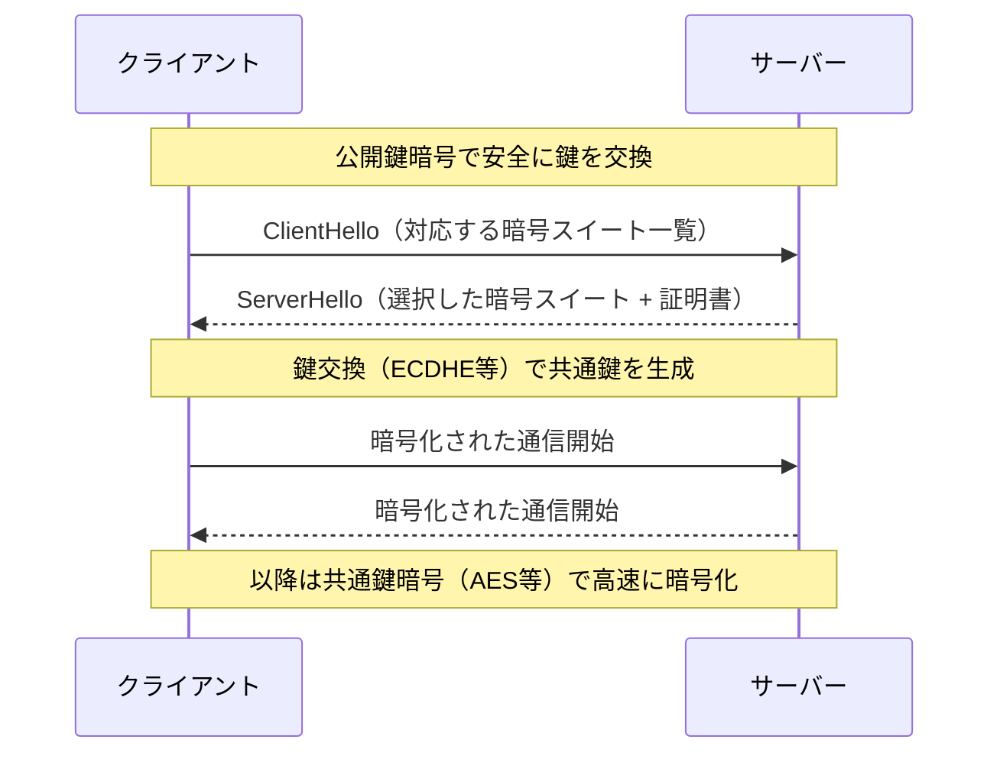
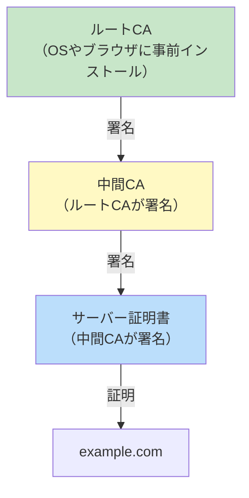
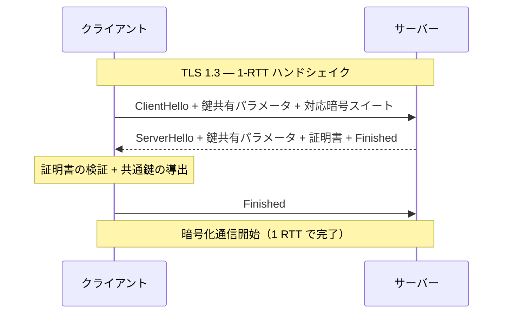

# TLS/SSL

> **一言で言うと:** TLS（Transport Layer Security）は通信経路を暗号化し、**機密性（盗聴防止）・完全性（改ざん検知）・真正性（なりすまし防止）** の3つを保証するプロトコル。SSL（Secure Sockets Layer）はその前身であり、現在はすべてTLSに移行済み。Webにおける「信頼の連鎖（Chain of Trust）」の基盤。

## なぜ必要か

インターネット上の通信は、送信元から宛先までの間に多数のルーター・スイッチ・[[ISP]]を経由する。TLSがなければ、この経路上の**任意の地点で通信内容を盗聴・改ざんできる**。

具体的に何が起きるか:

- **盗聴**: パスワード・クレジットカード情報・個人データが平文で流れ、Wi-Fiの傍受やISPレベルでの監視によって読み取られる
- **改ざん**: レスポンスにマルウェアを注入される（実際に一部ISPが広告を挿入していた事例がある）
- **なりすまし**: 偽のサーバーが本物のふりをして、ユーザーの認証情報を窃取する（中間者攻撃 / Man-in-the-Middle Attack）

TLSはこれら3つの脅威を**トランスポート層で一括して解決**する。アプリケーション開発者が暗号化の詳細を意識せずとも、TLSレイヤーを挟むだけで通信が保護される。

## どの問題を解決するか

### 課題1: 盗聴防止 — 共通鍵暗号による通信の暗号化

TLSは通信データを[[暗号アルゴリズム]]で暗号化し、第三者が読めないようにする。ただし、暗号化に使う鍵をどうやって安全に共有するかが問題になる。



**ハイブリッド暗号方式**: TLSは公開鍵暗号（非対称暗号）と共通鍵暗号（対称暗号）を組み合わせる。公開鍵暗号は計算コストが高いため鍵交換のみに使い、実データの暗号化には高速な共通鍵暗号（AES-GCM等）を使う。

### 課題2: 改ざん検知 — MAC（メッセージ認証コード）

TLSの各レコードにはMAC（Message Authentication Code）が付与される。受信側はMACを検証し、データが経路上で1ビットでも変更されていれば検知して接続を切断する。TLS 1.3ではAEAD（Authenticated Encryption with Associated Data）として暗号化と認証が一体化されている（AES-GCM、ChaCha20-Poly1305）。

### 課題3: なりすまし防止 — 証明書と信頼の連鎖

「通信先が本当に正しいサーバーか」を検証するのがデジタル証明書（X.509証明書）の役割であり、TLSの信頼モデルの中核を成す。



**信頼の連鎖（Chain of Trust）**:
1. OSやブラウザには信頼されたルートCA（Certificate Authority）の証明書がプリインストールされている
2. ルートCAは中間CAの証明書に署名する
3. 中間CAはサーバー証明書に署名する
4. クライアントはこの連鎖を逆にたどり、ルートCAまで検証できれば「信頼できる」と判断する

**ルートCAの秘密鍵が漏洩すると、信頼の連鎖全体が崩壊する**。そのためルートCAの秘密鍵はオフラインのHSM（Hardware Security Module）に保管され、日常的な証明書発行には中間CAを使う。

### 課題4: 証明書の種類と取得

| 種類 | 検証レベル | 用途 | 費用 |
|------|-----------|------|------|
| **DV（Domain Validation）** | ドメインの所有権のみ | 一般的なWebサイト | 無料〜安価（Let's Encrypt） |
| **OV（Organization Validation）** | 組織の実在確認 | 企業サイト | 有料 |
| **EV（Extended Validation）** | 厳格な組織審査 | 金融・決済 | 高額 |

**Let's Encrypt**: 無料でDV証明書を自動発行するCA。ACMEプロトコルによる自動更新が特徴で、Webの HTTPS 普及を大きく加速させた。

### 課題5: TLSバージョンの進化

| バージョン | 年 | ハンドシェイクRTT | 特徴 | 状態 |
|-----------|-----|-------------------|------|------|
| SSL 3.0 | 1996 | 2 RTT | POODLEで致命的脆弱性 | 廃止 |
| TLS 1.0 | 1999 | 2 RTT | BEAST攻撃で脆弱 | 廃止 |
| TLS 1.1 | 2006 | 2 RTT | IV の改善 | 廃止 |
| TLS 1.2 | 2008 | 2 RTT | 長期間の標準。AEAD対応 | 現役（縮小中） |
| **TLS 1.3** | **2018** | **1 RTT（0-RTTも可能）** | **暗号スイート簡素化、ハンドシェイク高速化、前方秘匿性必須** | **推奨** |

TLS 1.3の主な改善:

- **ハンドシェイクの高速化**: 2 RTT → 1 RTT。0-RTT（Early Data）では再接続時にハンドシェイク完了前にデータを送信できる
- **前方秘匿性（Forward Secrecy）の必須化**: 鍵交換にECDHE（楕円曲線ディフィー・ヘルマン鍵共有）のみを使用。サーバーの秘密鍵が将来漏洩しても、過去の通信は復号できない
- **レガシー暗号の廃止**: RC4、SHA-1、CBC モードなど脆弱な暗号スイートを排除
- **ハンドシェイクの暗号化**: ServerHello以降が暗号化され、通信内容だけでなくハンドシェイクのメタデータも保護



## 他の仕組みとどう関係するか

- **下位レイヤーとの関係:**
  - [[TCP-IP]] — TLSはTCP接続の確立後に動作する。TCPの3ウェイハンドシェイク（1 RTT）に加えてTLSハンドシェイク（TLS 1.3で1 RTT）が必要。HTTP/3ではQUIC内にTLS 1.3が統合され、TCPハンドシェイクとTLSハンドシェイクが同時に行われる（0-RTT接続も可能）
  - [[プロセスとスレッド]] — TLSの暗号化/復号はCPU負荷が高い。大量のHTTPS接続を捌くサーバーではAES-NIなどのハードウェアアクセラレーションが重要

- **同レイヤーとの関係:**
  - [[HTTP-HTTPS]] — HTTPSはHTTP + TLS。TLSハンドシェイクのコストがHTTPS接続のレイテンシに直結するため、TLS 1.3への移行やセッション再開（Session Resumption）が重要。[[HTTPとHTTPSの違い]]はTLSレイヤーの有無に集約される
  - [[DNS]] — DNSのCAAレコード（Certificate Authority Authorization）は、ドメインに対してどのCAが証明書を発行できるかを制限する。また、DNS over HTTPS（DoH）やDNS over TLS（DoT）はDNSクエリ自体をTLSで暗号化する
  - [[WebSocket]] — WebSocket over TLS（wss://）ではTLSハンドシェイク後にWebSocketハンドシェイクが行われる

- **上位レイヤーとの関係:**
  - [[認証と認可]] — TLSクライアント証明書を使ったmTLS（mutual TLS）は、APIやマイクロサービス間の認証に使われる。JWT等のトークンベース認証はTLSの上に構築される
  - [[CORS]] — CORSはHTTPS環境でのクロスオリジン通信を制御する。Mixed Content（HTTPSページからHTTPリソースの読み込み）はブラウザがブロックする
  - [[CDN]] — CDNエッジサーバーがTLS終端（TLS Termination）を行い、オリジンサーバーへの通信負荷を軽減する

## 誤解されやすいポイント

### 1. 「SSLとTLSは同じもの」

SSLはNetscapeが開発した初期の暗号化プロトコルであり、SSL 3.0まで存在した。TLSはSSLの後継としてIETFが標準化したプロトコルで、TLS 1.0はSSL 3.1に相当する。**現在「SSL」と呼ばれているものは実際にはTLS**であり、SSL 3.0は2015年にRFC 7568で正式に廃止された。「SSL証明書」という呼称も慣習的に残っているだけで、実体はTLS用の証明書。

### 2. 「TLSは通信の全てを守る」

TLSが保護するのは**通信経路上のデータ**のみ。以下は守れない:
- **通信のメタデータ**: 接続先のIPアドレスやSNI（Server Name Indication）でのホスト名は平文で送信される（TLS 1.3 + ECH で改善中）
- **エンドポイントでのデータ**: サーバーに到達した後のデータの保存・処理は別問題。TLSで暗号化されていてもサーバー側のログに平文で記録される可能性がある
- **アプリケーション層の脆弱性**: SQLインジェクション、XSSなどはTLSでは防げない

### 3. 「証明書があれば安全なサイト」

DV証明書はドメインの所有権のみを証明する。**サイトの運営者が信頼できるかどうか**は証明しない。フィッシングサイトもDV証明書（Let's Encrypt等）を取得できる。ブラウザの鍵アイコンは「通信が暗号化されている」ことを示すだけで、「サイトが安全」を意味しない。

### 4. 「自己署名証明書は開発環境なら問題ない」

自己署名証明書は信頼の連鎖に属さないため、ブラウザが警告を出す。開発者がこの警告を無視する習慣がつくと、本番環境での証明書エラーも見逃すリスクがある。開発環境では**mkcert**を使ってローカルCAを作成し、そのCAをシステムの信頼ストアに登録する方が安全。

### 5. 「TLS 1.3の0-RTTは常に使うべき」

0-RTT（Early Data）は再接続時のレイテンシを削減するが、**リプレイ攻撃に脆弱**。攻撃者が0-RTTデータを再送すると、サーバーが同じリクエストを再度処理してしまう可能性がある。そのため0-RTTではべき等な操作（GET）のみを許可し、状態を変更する操作（POST）には使わないのが原則。

## 設計のベストプラクティス

### TLS設定

```
✅ 推奨: TLS 1.3を優先、TLS 1.2を最低ラインとする
   - TLS 1.1以下は無効化する（PCIコンプライアンス要件でもある）
   - 暗号スイートはAEADのみ許可（AES-256-GCM, ChaCha20-Poly1305）
   - 鍵交換はECDHE（前方秘匿性を確保）
   - RSA鍵交換は無効化（前方秘匿性がない）

❌ アンチパターン: 互換性のためにTLS 1.0/1.1やレガシー暗号を有効にする
   - 既知の脆弱性（BEAST, POODLE, CRIME）に晒される
   - ダウングレード攻撃の対象になる
```

### 証明書管理

```
✅ 推奨: 証明書の自動更新を設定する
   - Let's Encrypt + certbot/acme.sh で自動更新
   - 証明書の有効期限を監視する（期限切れはサービス停止に直結）
   - CAA DNSレコードで許可するCAを制限する
   - OCSP Staplingを有効にして証明書の失効チェックを高速化

❌ アンチパターン: 証明書を手動で更新する
   - 人的ミスで期限切れが発生し、サービスが停止する
   - 有名企業でも証明書の期限切れ事故は頻繁に発生している
```

### HSTS（HTTP Strict Transport Security）

```
✅ 推奨: HSTSヘッダを設定し、HTTPS接続を強制する
   Strict-Transport-Security: max-age=63072000; includeSubDomains; preload
   - ブラウザがHTTPリクエストを送信する前にHTTPSに変換する
   - 初回アクセス時のHTTP→HTTPSリダイレクトの隙を突く攻撃を防ぐ
   - preloadリストに登録すれば初回アクセスからHTTPS強制

❌ アンチパターン: HTTPとHTTPSの両方でサービスを提供し続ける
   - SSLストリッピング攻撃の対象になる
```

## AIによる実装のアンチパターン

| アンチパターン | なぜ問題か | 対策 |
|---|---|---|
| TLS証明書の検証を無効化する（`verify=False`, `rejectUnauthorized: false`） | 中間者攻撃が可能になり、TLSの意味がなくなる | 正しいCA証明書を設定する。開発環境ではmkcertを使う |
| 古いTLSバージョンやレガシー暗号スイートを許可する | POODLE、BEAST等の既知の攻撃に脆弱になる | TLS 1.2以上のみ許可し、AEAD暗号スイートを使用する |
| 秘密鍵をソースコードやDockerイメージに含める | 鍵の漏洩が全通信の危殆化につながる | 環境変数、シークレットマネージャー、ボリュームマウントで管理する |
| HTTP→HTTPSリダイレクトだけでHSTSを設定しない | 初回アクセス時のリダイレクト前にHTTP通信が発生し、SSLストリッピングの対象になる | HSTSヘッダを設定し、preloadリストに登録する |
| 0-RTTでPOSTリクエストを受け付ける | リプレイ攻撃で同じ操作が重複実行される | 0-RTTではべき等な操作（GET）のみ許可する |

## 具体例

### Nginx — TLS 1.3 推奨設定

```nginx
server {
    listen 443 ssl;
    http2 on;
    server_name example.com;

    # 証明書と秘密鍵
    ssl_certificate     /etc/letsencrypt/live/example.com/fullchain.pem;
    ssl_certificate_key /etc/letsencrypt/live/example.com/privkey.pem;

    # TLSバージョン: 1.2以上のみ
    ssl_protocols TLSv1.2 TLSv1.3;

    # 暗号スイート: TLS 1.2はAEADのみ、TLS 1.3はデフォルトで安全
    ssl_ciphers ECDHE-ECDSA-AES256-GCM-SHA384:ECDHE-RSA-AES256-GCM-SHA384:ECDHE-ECDSA-CHACHA20-POLY1305:ECDHE-RSA-CHACHA20-POLY1305;
    ssl_prefer_server_ciphers off;  # TLS 1.3ではクライアント側の選択を尊重

    # ECDHE鍵交換の曲線
    ssl_ecdh_curve X25519:secp384r1;

    # セッション再開（TLS 1.2）
    ssl_session_cache shared:TLS:10m;
    ssl_session_timeout 1d;
    ssl_session_tickets off;  # 前方秘匿性を完全に保つ場合はoff

    # OCSP Stapling
    ssl_stapling on;
    ssl_stapling_verify on;
    ssl_trusted_certificate /etc/letsencrypt/live/example.com/chain.pem;
    resolver 1.1.1.1 8.8.8.8 valid=300s;

    # HSTS
    add_header Strict-Transport-Security "max-age=63072000; includeSubDomains; preload" always;
}
```

### Node.js — TLSサーバーの基本設定

```javascript
import { createServer } from 'https';
import { readFileSync } from 'fs';

const server = createServer({
  key: readFileSync('/path/to/privkey.pem'),
  cert: readFileSync('/path/to/fullchain.pem'),

  // TLS 1.2以上のみ許可
  minVersion: 'TLSv1.2',

  // 暗号スイートの制限（TLS 1.2用）
  ciphers: [
    'ECDHE-ECDSA-AES256-GCM-SHA384',
    'ECDHE-RSA-AES256-GCM-SHA384',
    'ECDHE-ECDSA-CHACHA20-POLY1305',
    'ECDHE-RSA-CHACHA20-POLY1305',
  ].join(':'),
}, (req, res) => {
  // HSTS ヘッダ
  res.setHeader('Strict-Transport-Security', 'max-age=63072000; includeSubDomains; preload');
  res.end('Hello, TLS!');
});

server.listen(443);
```

### Python — 証明書の検証とTLS設定

```python
import ssl
import urllib.request

# 安全なTLSコンテキストの作成
ctx = ssl.SSLContext(ssl.PROTOCOL_TLS_CLIENT)
ctx.minimum_version = ssl.TLSVersion.TLSv1_2

# システムのCA証明書のデフォルトパスを設定する
ctx.set_default_verify_paths()

# 証明書の検証を有効にする（デフォルトで有効だが明示的に）
ctx.check_hostname = True
ctx.verify_mode = ssl.CERT_REQUIRED

response = urllib.request.urlopen("https://example.com", context=ctx)
print(response.read().decode())
```

### openssl — 証明書の確認とデバッグ

```bash
# サーバーの証明書チェーンを確認
openssl s_client -connect example.com:443 -servername example.com

# 証明書の詳細を表示
openssl s_client -connect example.com:443 </dev/null 2>/dev/null \
  | openssl x509 -noout -text

# 証明書の有効期限を確認
openssl s_client -connect example.com:443 </dev/null 2>/dev/null \
  | openssl x509 -noout -dates

# 対応TLSバージョンの確認
openssl s_client -connect example.com:443 -tls1_3

# 証明書チェーンの検証
openssl verify -CAfile /etc/ssl/certs/ca-certificates.crt cert.pem
```

### certbot — Let's Encrypt 証明書の自動取得・更新

```bash
# 証明書の取得（Nginx用）
sudo certbot --nginx -d example.com -d www.example.com

# 証明書の更新テスト
sudo certbot renew --dry-run

# 自動更新はsystemd timerまたはcronで設定
# certbotインストール時に自動設定されることが多い
systemctl list-timers | grep certbot
```

## 参考リソース

- **書籍**: 『プロフェッショナルSSL/TLS』（Ivan Ristic） — TLSの実装・運用・セキュリティを網羅した決定版
- **書籍**: 『暗号技術入門 第3版』（結城浩） — 公開鍵暗号・証明書・TLSの基礎を分かりやすく解説
- **Web**: Mozilla SSL Configuration Generator — https://ssl-config.mozilla.org/ — Nginx/Apache/各種サーバーの推奨TLS設定を自動生成
- **Web**: SSL Labs Server Test — https://www.ssllabs.com/ssltest/ — サーバーのTLS設定を評価・診断するツール
- **RFC 8446**: TLS 1.3 — https://datatracker.ietf.org/doc/html/rfc8446
- **Web**: Let's Encrypt Documentation — https://letsencrypt.org/docs/
- **Web**: High Performance Browser Networking — TLS章（Ilya Grigorik） — TLSのパフォーマンス影響の解説

## 学習メモ

- mTLS（mutual TLS）によるマイクロサービス間認証は[[認証と認可]]で深掘り候補
- Certificate Transparency（CT）ログは証明書の不正発行を検知する仕組みとして重要
- ECH（Encrypted Client Hello）はSNIを暗号化してプライバシーを向上させるTLS 1.3拡張 — 標準化が進行中
- QUIC内のTLS 1.3統合について、[[HTTP-HTTPS]]のHTTP/3セクションと合わせて理解する
