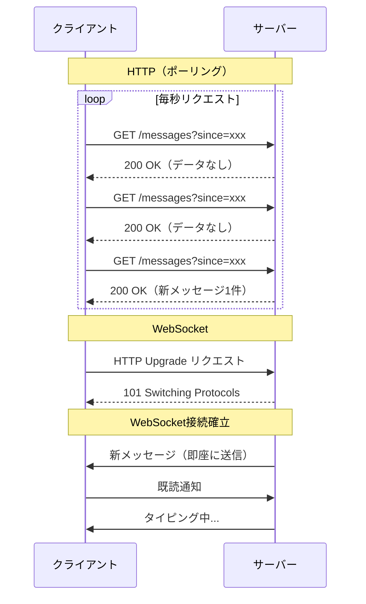
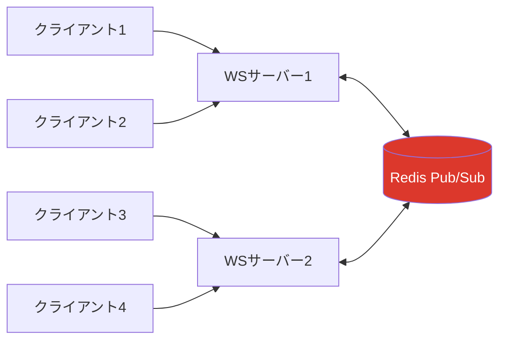
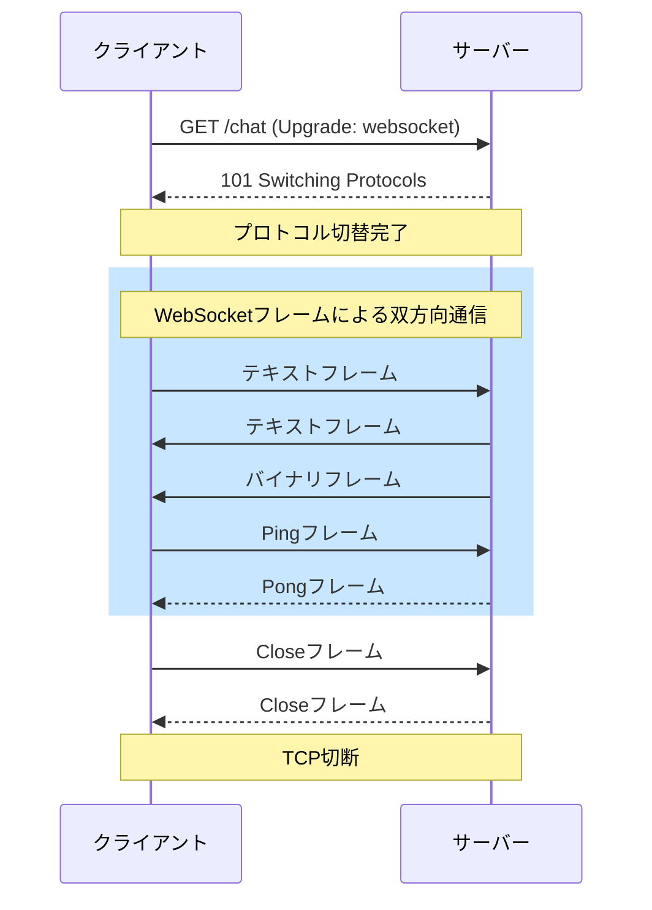

# WebSocket

> **一言で言うと:** HTTPの「リクエスト-レスポンス」モデルでは実現できない**双方向リアルタイム通信**を、単一のTCPコネクション上で実現するプロトコル。

## なぜ必要か

HTTPは「クライアントが聞かないとサーバーは答えない」という一方通行モデルで設計されている。この制約は、チャットメッセージの受信、株価のリアルタイム更新、マルチプレイヤーゲームの状態同期といった「**サーバー側で発生したイベントを即座にクライアントへ届ける**」ユースケースでは根本的な障壁になる。

WebSocketが存在しなかった時代、開発者はHTTPの制約内で擬似的なリアルタイム通信を実現しようと以下のような回避策を使っていた：

- **ポーリング（Polling）** — クライアントが一定間隔でサーバーに「新しいデータある？」と問い合わせる。大半のリクエストは空振りに終わり、サーバーリソースと帯域を無駄に消費する
- **ロングポーリング（Long Polling）** — サーバーがデータが発生するまでレスポンスを保留する。ポーリングよりマシだが、タイムアウト管理やコネクションの再接続処理が複雑になる
- **Server-Sent Events（SSE）** — サーバーからクライアントへの一方向ストリーム。双方向通信には使えない

WebSocketはこれらの回避策を不要にし、一度接続を確立すれば**サーバーもクライアントもいつでもデータを送信できる**持続的な通信チャネルを提供する。

## どの問題を解決するか

### 課題1: HTTPのリクエスト-レスポンスモデルの限界

HTTPでは、すべての通信はクライアントの要求から始まる。サーバーが自発的にデータを送ることはできない。



**解決:** WebSocketはHTTPハンドシェイクを経てプロトコルを「アップグレード」し、以降は[[TCP-IP|TCP]]コネクション上で双方向のフレームベース通信を行う。HTTPヘッダーのオーバーヘッドがなくなり、データはフレーム単位（最小2バイトのヘッダー）で効率的に送受信される。

### 課題2: 接続ごとのオーバーヘッド

HTTPでは毎回のリクエストに対してTCPコネクションの確立（[[TCP-IP|3ウェイハンドシェイク]]）やHTTPヘッダーの送受信が必要。高頻度の通信ではこのオーバーヘッドが深刻になる。

**解決:** WebSocketは一度確立したTCPコネクションを維持し続ける。以降のデータ交換には最小限のフレームヘッダーしかかからない。たとえば100バイトのメッセージをHTTPで送ると数百バイトのヘッダーが付くが、WebSocketフレームでは2〜6バイトのヘッダーで済む。

### 課題3: リアルタイム性の確保

ポーリングではポーリング間隔がレイテンシの下限になる（1秒間隔なら最大1秒の遅延）。間隔を短くするとサーバー負荷が増す。

**解決:** WebSocketではサーバーがイベント発生時に即座にフレームを送信できるため、理論上のレイテンシはネットワーク遅延のみとなる。

## 他の仕組みとどう関係するか

- **下位レイヤーとの関係:**
  - [[TCP-IP]] — WebSocketはTCPの上に構築される。TCPが提供する信頼性のある順序保証付きバイトストリームの上に、メッセージのフレーミング（境界の区切り）を追加したもの
  - [[TLS-SSL]] — `wss://`（WebSocket Secure）は[[TLS-SSL|TLS]]上でWebSocket通信を暗号化する。`https://`に対する`http://`と同じ関係

- **同レイヤーとの関係:**
  - [[HTTP-HTTPS]] — WebSocketの接続確立にはHTTPアップグレードハンドシェイクを利用する。つまり最初の1往復だけはHTTPで通信し、合意が取れたらプロトコルを切り替える。ポート80（ws://）または443（wss://）を共有するため、既存のHTTPインフラ（ロードバランサー、プロキシ）との互換性を意識した設計
  - [[DNS]] — WebSocket接続もまずDNS解決から始まる

- **上位レイヤーとの関係:**
  - [[ロードバランシング]] — WebSocketのコネクションは持続的なため、ロードバランサーの設計に影響する。L7ロードバランサーがWebSocket対応しているかの確認が必要
  - [[認証と認可]] — WebSocketにはHTTPのようなリクエストごとの認証ヘッダーがない。初回ハンドシェイク時のCookieやトークン、または接続後の認証メッセージで代替する
  - [[XSS]] / [[CSRF]] — WebSocketはブラウザの同一オリジンポリシーの対象外。Origin ヘッダーの検証をサーバー側で行わないと、クロスサイトWebSocketハイジャッキング（CSWSH）の脆弱性が生まれる

## 誤解されやすいポイント

### 1. 「WebSocketはHTTPを置き換えるもの」

WebSocketはHTTPの**補完**であり、代替ではない。通常のWebページの取得、REST API、ファイルアップロードなどにはHTTPが適している。WebSocketはリアルタイム双方向通信という特定のユースケースに特化したプロトコルであり、HTTPのキャッシュ機構、ステータスコード、リダイレクトといった豊富なセマンティクスは持たない。「とりあえずWebSocket」は過剰設計になりやすい。

### 2. 「WebSocketは常にポーリングより効率的」

数秒に1回程度の更新で十分なユースケース（ダッシュボードの定期更新など）では、単純なHTTPポーリングやSSEのほうがインフラ構成がシンプルで運用しやすい。WebSocketは常時コネクションを維持するため、接続数が多い場合のメモリ消費やコネクション管理のコストが発生する。「更新頻度」と「同時接続数」で判断すべき。

### 3. 「WebSocket接続は一度確立すれば永続する」

現実のWebSocket接続はさまざまな理由で切断される：ネットワーク切り替え（Wi-Fi→モバイル）、NAT/プロキシのタイムアウト、サーバーの再起動、ロードバランサーのアイドルタイムアウト。本番環境では**再接続ロジック**（指数バックオフ付き）が必須であり、これを怠ると「接続が切れたまま気づかない」という障害につながる。

### 4. 「WebSocketはファイアウォールやプロキシを問題なく通過する」

一部の企業ネットワークのプロキシやファイアウォールはHTTP以外のプロトコルをブロックすることがある。`wss://`（TLS上のWebSocket）を使うことで通過率は上がるが、完全な保証はない。そのためSocket.IOのようなライブラリはポーリングへの自動フォールバック機能を提供している。

## 設計のベストプラクティス

### 接続管理

```
✅ 推奨: 再接続ロジックに指数バックオフ（Exponential Backoff）を実装する
❌ アンチパターン: 切断時に即座に再接続を繰り返す（サーバーに負荷集中）

✅ 推奨: Ping/Pongフレームによるヘルスチェックでコネクションの生存を確認する
❌ アンチパターン: コネクションが生きているか確認せず、データ送信失敗で初めて切断に気づく

✅ 推奨: 接続時にアプリケーションレベルの認証を行う
❌ アンチパターン: Originヘッダーのチェックを省略する（CSWSH脆弱性）
```

### メッセージ設計

```
✅ 推奨: メッセージにtype/eventフィールドを持たせ、ルーティング可能にする
   例: { "type": "chat.message", "payload": { ... } }
❌ アンチパターン: メッセージの種別を判別できない生テキストを送る

✅ 推奨: メッセージにIDを付与し、冪等性（Idempotency）を確保する
❌ アンチパターン: 再接続時にメッセージの重複や欠落を考慮しない
```

### スケーリング

```
✅ 推奨: 複数サーバー間でイベントを共有するPub/Subバックエンド（Redis Pub/Sub等）を導入する
❌ アンチパターン: WebSocket接続がローカルのサーバーインスタンスに閉じている設計で
   スケールアウトしようとする

✅ 推奨: ステートレスなWebSocketサーバーを目指し、状態はRedis等の外部ストアに保持する
❌ アンチパターン: 各サーバーインスタンスのメモリにルーム情報やユーザーリストを保持する
```



## AIによる実装のアンチパターン

| アンチパターン | なぜ問題か | 対策 |
|---|---|---|
| 再接続ロジックなしのWebSocket実装 | 本番環境では必ず切断が発生するため、接続が途絶えたまま放置される | 指数バックオフ付き再接続を最初から実装する |
| 全メッセージをブロードキャストする設計 | ユーザーAのチャットメッセージがユーザーBにも届くなど、権限チェックの欠如につながる | ルーム/チャネル単位でのメッセージ配信と権限検証を行う |
| WebSocketのみで全通信を行う実装 | REST APIで十分な操作（ユーザー登録、設定変更等）までWebSocketで処理し、デバッグやテストが困難になる | リアルタイム性が必要な通信のみWebSocket、それ以外はHTTP APIを使う |
| エラーハンドリングのないメッセージパース | 不正なJSONやバイナリが送られた場合にサーバーがクラッシュする | メッセージのパースを`try-catch`で囲み、不正メッセージには適切なエラーフレームを返す |

## 具体例

### WebSocketサーバー（Node.js + ws ライブラリ）

```javascript
import { WebSocketServer } from 'ws';

const wss = new WebSocketServer({ port: 8080 });

// 接続管理
const clients = new Set();

wss.on('connection', (ws, req) => {
  // Origin検証（CSWSH対策）
  const origin = req.headers.origin;
  if (origin !== 'https://myapp.example.com') {
    ws.close(1008, 'Origin not allowed');
    return;
  }

  clients.add(ws);
  console.log(`接続数: ${clients.size}`);

  // Ping/Pongによるヘルスチェック
  ws.isAlive = true;
  ws.on('pong', () => { ws.isAlive = true; });

  // メッセージ受信
  ws.on('message', (data) => {
    let msg;
    try {
      msg = JSON.parse(data);
    } catch {
      ws.send(JSON.stringify({ type: 'error', message: 'Invalid JSON' }));
      return;
    }

    // typeベースのルーティング
    switch (msg.type) {
      case 'chat.message':
        broadcast(ws, { type: 'chat.message', payload: msg.payload });
        break;
      default:
        ws.send(JSON.stringify({ type: 'error', message: `Unknown type: ${msg.type}` }));
    }
  });

  ws.on('close', () => {
    clients.delete(ws);
  });
});

// 全クライアントへブロードキャスト（送信元は除外）
function broadcast(sender, message) {
  const data = JSON.stringify(message);
  for (const client of clients) {
    if (client !== sender && client.readyState === 1) {
      client.send(data);
    }
  }
}

// 30秒ごとに死活監視
setInterval(() => {
  for (const ws of clients) {
    if (!ws.isAlive) {
      clients.delete(ws);
      ws.terminate();
      return;
    }
    ws.isAlive = false;
    ws.ping();
  }
}, 30_000);
```

### WebSocketクライアント（ブラウザ JavaScript）

```javascript
class WebSocketClient {
  constructor(url) {
    this.url = url;
    this.reconnectDelay = 1000;     // 初期遅延: 1秒
    this.maxReconnectDelay = 30000; // 最大遅延: 30秒
    this.handlers = new Map();
    this.connect();
  }

  connect() {
    this.ws = new WebSocket(this.url);

    this.ws.onopen = () => {
      console.log('WebSocket接続確立');
      this.reconnectDelay = 1000; // 成功したらリセット
    };

    this.ws.onmessage = (event) => {
      const msg = JSON.parse(event.data);
      const handler = this.handlers.get(msg.type);
      if (handler) handler(msg.payload);
    };

    this.ws.onclose = (event) => {
      if (event.code !== 1000) { // 正常クローズ以外は再接続
        console.log(`${this.reconnectDelay}ms後に再接続...`);
        setTimeout(() => this.connect(), this.reconnectDelay);
        // 指数バックオフ
        this.reconnectDelay = Math.min(this.reconnectDelay * 2, this.maxReconnectDelay);
      }
    };

    this.ws.onerror = (error) => {
      console.error('WebSocketエラー:', error);
    };
  }

  on(type, handler) {
    this.handlers.set(type, handler);
  }

  send(type, payload) {
    if (this.ws.readyState === WebSocket.OPEN) {
      this.ws.send(JSON.stringify({ type, payload }));
    }
  }

  close() {
    this.ws.close(1000, 'Client disconnect');
  }
}

// 使用例
const client = new WebSocketClient('wss://myapp.example.com/ws');
client.on('chat.message', (payload) => {
  console.log(`${payload.user}: ${payload.text}`);
});
client.send('chat.message', { text: 'こんにちは！' });
```

### WebSocketサーバー（Python + websockets ライブラリ）

```python
import asyncio
import json
import websockets

connected = set()

async def handler(websocket):
    # Origin検証
    origin = websocket.request.headers.get("Origin", "")
    if origin != "https://myapp.example.com":
        await websocket.close(1008, "Origin not allowed")
        return

    connected.add(websocket)
    try:
        async for raw in websocket:
            try:
                msg = json.loads(raw)
            except json.JSONDecodeError:
                await websocket.send(json.dumps({"type": "error", "message": "Invalid JSON"}))
                continue

            if msg.get("type") == "chat.message":
                data = json.dumps({"type": "chat.message", "payload": msg["payload"]})
                # 送信元以外にブロードキャスト
                others = connected - {websocket}
                await asyncio.gather(*(c.send(data) for c in others))
    finally:
        connected.discard(websocket)

async def main():
    async with websockets.serve(handler, "localhost", 8080):
        await asyncio.Future()  # 無限に待機

asyncio.run(main())
```

## WebSocketハンドシェイクの詳細

WebSocket接続はHTTPアップグレードリクエストから始まる：

```http
GET /chat HTTP/1.1
Host: myapp.example.com
Upgrade: websocket
Connection: Upgrade
Sec-WebSocket-Key: dGhlIHNhbXBsZSBub25jZQ==
Sec-WebSocket-Version: 13
Origin: https://myapp.example.com
```

サーバーが合意すると：

```http
HTTP/1.1 101 Switching Protocols
Upgrade: websocket
Connection: Upgrade
Sec-WebSocket-Accept: s3pPLMBiTxaQ9kYGzzhZRbK+xOo=
```

`Sec-WebSocket-Key`と`Sec-WebSocket-Accept`のやりとりは、WebSocketを理解しないHTTPサーバーが誤って接続を受け入れることを防ぐための仕組み（セキュリティのためではなく、プロトコルの誤用防止）。



## WebSocket vs SSE vs ポーリング 比較

| 特性 | WebSocket | SSE | ポーリング |
|------|-----------|-----|-----------|
| 通信方向 | 双方向 | サーバー→クライアント | クライアント→サーバー |
| プロトコル | ws:// / wss:// | HTTP | HTTP |
| 接続維持 | 持続的 | 持続的 | リクエスト毎 |
| バイナリデータ | 対応 | 非対応（テキストのみ） | 対応 |
| 自動再接続 | 自前実装 | ブラウザ内蔵 | 不要 |
| HTTP/2互換 | 別コネクション | 多重化可能 | 多重化可能 |
| ファイアウォール通過 | 問題になる場合あり | 通常問題なし | 問題なし |
| 適切なユースケース | チャット、ゲーム、共同編集 | 通知、フィード | ダッシュボード、低頻度更新 |

## 参考リソース

- [RFC 6455 - The WebSocket Protocol](https://datatracker.ietf.org/doc/html/rfc6455) — WebSocketの仕様書
- [MDN Web Docs - WebSocket API](https://developer.mozilla.org/ja/docs/Web/API/WebSocket) — ブラウザAPI リファレンス
- [WebSockets vs Server-Sent Events](https://web.dev/articles/eventsource-basics) — SSEとの使い分け

## 学習メモ

- WebSocketはHTTPの制約を解決するが、新たな課題（コネクション管理、スケーリング、認証）をもたらす点に注意
- Socket.IOは「WebSocket + フォールバック + 便利機能」のラッパーであり、WebSocketそのものではない
- HTTP/2のサーバープッシュはWebSocketの代替ではない（リソースの先読みが目的であり、任意のデータプッシュではない）
