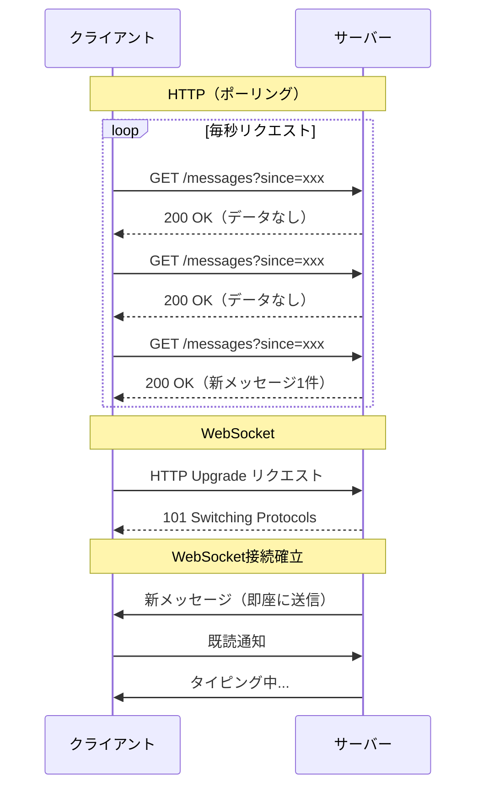
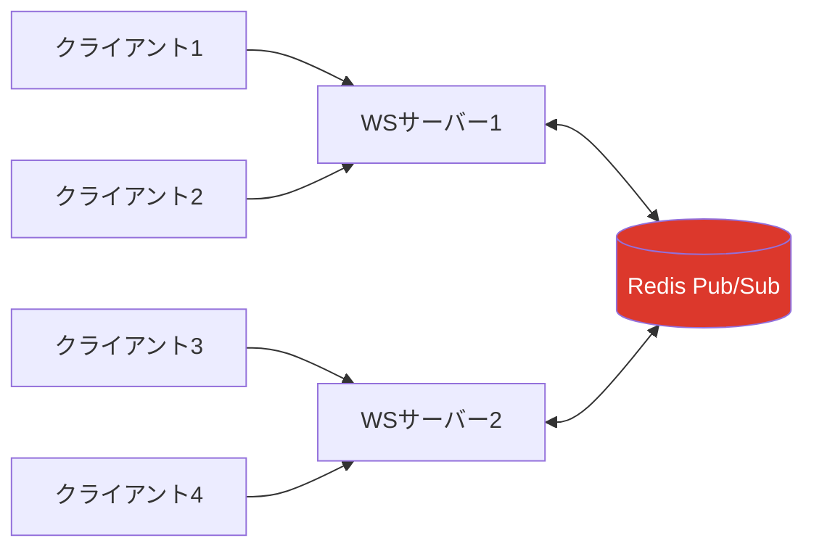
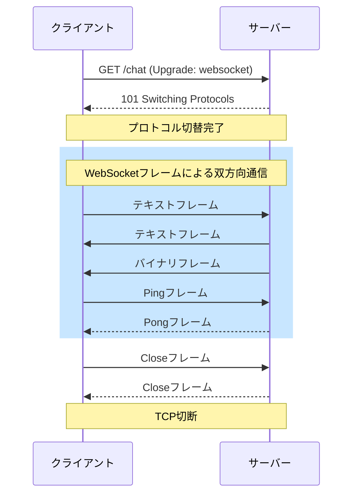

# WebSocket

> **一言で言うと:** HTTPの「リクエスト-レスポンス」モデルでは実現できない**双方向リアルタイム通信**を、単一のTCPコネクション上で実現するプロトコル。

## 3分で全体像

- **何を解決する技術か:** 「サーバー側で発生したイベントを即座にクライアントへ届ける」というユースケース（チャット、ゲーム、共同編集、リアルタイム通知）を、単一の TCP 接続上の双方向フレーム通信で実現する
- **代表的な使用シーン:** チャット・メッセージング、マルチプレイヤーゲーム、共同編集ツール（Google Docs / Figma 風）、ライブ配信のチャット、株価・スポーツのリアルタイム更新、IoT デバイスとの双方向制御
- **これだけは覚える3つ:**
    1. **WebSocket は HTTP の代替ではなく補完** — 通常のリソース取得は HTTP / REST のほうがキャッシュ・ステータスコード・観測性で有利。「リアルタイム双方向」が必要な箇所だけ WebSocket
    2. **再接続は必ず実装する** — 本番環境では NAT タイムアウト、Wi-Fi切替、サーバー再起動で必ず切れる。指数バックオフ + ジッター付き再接続が必須
    3. **Origin 検証 + アプリ層認証を必ず実装する** — WebSocket は同一オリジンポリシーの対象外。Origin 検証なしだと CSWSH（Cross-Site WebSocket Hijacking）の脆弱性。ハンドシェイク後にトークン認証も
- **AIに任せやすいか:** **一部任せられる** — `ws` / `socket.io` / `gorilla/websocket` の基本的なサーバー・クライアント実装、再接続ロジック、Ping/Pong ヘルスチェックは AI が高品質に書ける。AIコードレビュー観点で「再接続なし」「Origin 未検証」も検出可能。一方「WebSocket / SSE / ポーリングのいずれを選ぶか」「スケールアウト時の Pub/Sub バックエンド選定」「セッションスティッキー vs ステートレス設計」はトラフィック特性とインフラ次第で人間が判断
- **詰まったらここを読む:** [[TCP-IP]] / [[HTTP-HTTPS]] / [[TLS-SSL]]

## なぜ必要か

HTTPは「クライアントが聞かないとサーバーは答えない」という一方通行モデルで設計されている。この制約は、チャットメッセージの受信、株価のリアルタイム更新、マルチプレイヤーゲームの状態同期といった「**サーバー側で発生したイベントを即座にクライアントへ届ける**」ユースケースでは根本的な障壁になる。

WebSocketが存在しなかった時代、開発者はHTTPの制約内で擬似的なリアルタイム通信を実現しようと以下のような回避策を使っていた：

- **ポーリング（Polling）** — クライアントが一定間隔でサーバーに「新しいデータある？」と問い合わせる。大半のリクエストは空振りに終わり、サーバーリソースと帯域を無駄に消費する
- **ロングポーリング（Long Polling）** — サーバーがデータが発生するまでレスポンスを保留する。ポーリングよりマシだが、タイムアウト管理やコネクションの再接続処理が複雑になる
- **Server-Sent Events（SSE）** — サーバーからクライアントへの一方向ストリーム。双方向通信には使えない

WebSocketはこれらの回避策を不要にし、一度接続を確立すれば**サーバーもクライアントもいつでもデータを送信できる**持続的な通信チャネルを提供する。

## どの問題を解決するか

### 課題1: HTTPのリクエスト-レスポンスモデルの限界

HTTPでは、すべての通信はクライアントの要求から始まる。サーバーが自発的にデータを送ることはできない。


```mermaid
sequenceDiagram
    participant C as クライアント
    participant S as サーバー

    Note over C,S: HTTP（ポーリング）
    loop 毎秒リクエスト
        C->>S: GET /messages?since=xxx
        S-->>C: 200 OK（データなし）
        C->>S: GET /messages?since=xxx
        S-->>C: 200 OK（データなし）
        C->>S: GET /messages?since=xxx
        S-->>C: 200 OK（新メッセージ1件）
    end

    Note over C,S: WebSocket
    C->>S: HTTP Upgrade リクエスト
    S-->>C: 101 Switching Protocols
    Note over C,S: WebSocket接続確立
    S->>C: 新メッセージ（即座に送信）
    C->>S: 既読通知
    S->>C: タイピング中...
```

**解決:** WebSocketはHTTPハンドシェイクを経てプロトコルを「アップグレード」し、以降は[[TCP-IP|TCP]]コネクション上で双方向のフレームベース通信を行う。HTTPヘッダーのオーバーヘッドがなくなり、データはフレーム単位（最小2バイトのヘッダー）で効率的に送受信される。

### 課題2: 接続ごとのオーバーヘッド

HTTPでは毎回のリクエストに対してTCPコネクションの確立（[[TCP-IP|3ウェイハンドシェイク]]）やHTTPヘッダーの送受信が必要。高頻度の通信ではこのオーバーヘッドが深刻になる。

**解決:** WebSocketは一度確立したTCPコネクションを維持し続ける。以降のデータ交換には最小限のフレームヘッダーしかかからない。たとえば100バイトのメッセージをHTTPで送ると数百バイトのヘッダーが付くが、WebSocketフレームでは2〜6バイトのヘッダーで済む。

### 課題3: リアルタイム性の確保

ポーリングではポーリング間隔がレイテンシの下限になる（1秒間隔なら最大1秒の遅延）。間隔を短くするとサーバー負荷が増す。

**解決:** WebSocketではサーバーがイベント発生時に即座にフレームを送信できるため、理論上のレイテンシはネットワーク遅延のみとなる。

## 他の仕組みとどう関係するか

- **下位レイヤーとの関係:**
  - [[TCP-IP]] — WebSocketはTCPの上に構築される。TCPが提供する信頼性のある順序保証付きバイトストリームの上に、メッセージのフレーミング（境界の区切り）を追加したもの
  - [[TLS-SSL]] — `wss://`（WebSocket Secure）は[[TLS-SSL|TLS]]上でWebSocket通信を暗号化する。`https://`に対する`http://`と同じ関係

- **同レイヤーとの関係:**
  - [[HTTP-HTTPS]] — WebSocketの接続確立にはHTTPアップグレードハンドシェイクを利用する。つまり最初の1往復だけはHTTPで通信し、合意が取れたらプロトコルを切り替える。ポート80（ws://）または443（wss://）を共有するため、既存のHTTPインフラ（ロードバランサー、プロキシ）との互換性を意識した設計
  - [[DNS]] — WebSocket接続もまずDNS解決から始まる

- **上位レイヤーとの関係:**
  - [[ロードバランシング]] — WebSocketのコネクションは持続的なため、ロードバランサーの設計に影響する。L7ロードバランサーがWebSocket対応しているかの確認が必要
  - [[認証と認可]] — WebSocketにはHTTPのようなリクエストごとの認証ヘッダーがない。初回ハンドシェイク時のCookieやトークン、または接続後の認証メッセージで代替する
  - [[XSS]] / [[CSRF]] — WebSocketはブラウザの同一オリジンポリシーの対象外。Origin ヘッダーの検証をサーバー側で行わないと、クロスサイトWebSocketハイジャッキング（CSWSH）の脆弱性が生まれる

## 誤解されやすいポイント

### 1. 「WebSocketはHTTPを置き換えるもの」

WebSocketはHTTPの**補完**であり、代替ではない。通常のWebページの取得、REST API、ファイルアップロードなどにはHTTPが適している。WebSocketはリアルタイム双方向通信という特定のユースケースに特化したプロトコルであり、HTTPのキャッシュ機構、ステータスコード、リダイレクトといった豊富なセマンティクスは持たない。「とりあえずWebSocket」は過剰設計になりやすい。

### 2. 「WebSocketは常にポーリングより効率的」

数秒に1回程度の更新で十分なユースケース（ダッシュボードの定期更新など）では、単純なHTTPポーリングやSSEのほうがインフラ構成がシンプルで運用しやすい。WebSocketは常時コネクションを維持するため、接続数が多い場合のメモリ消費やコネクション管理のコストが発生する。「更新頻度」と「同時接続数」で判断すべき。

### 3. 「WebSocket接続は一度確立すれば永続する」

現実のWebSocket接続はさまざまな理由で切断される：ネットワーク切り替え（Wi-Fi→モバイル）、NAT/プロキシのタイムアウト、サーバーの再起動、ロードバランサーのアイドルタイムアウト。本番環境では**再接続ロジック**（指数バックオフ付き）が必須であり、これを怠ると「接続が切れたまま気づかない」という障害につながる。

### 4. 「WebSocketはファイアウォールやプロキシを問題なく通過する」

一部の企業ネットワークのプロキシやファイアウォールはHTTP以外のプロトコルをブロックすることがある。`wss://`（TLS上のWebSocket）を使うことで通過率は上がるが、完全な保証はない。そのためSocket.IOのようなライブラリはポーリングへの自動フォールバック機能を提供している。

## 設計のベストプラクティス

### 接続管理

```
✅ 推奨: 再接続ロジックに指数バックオフ（Exponential Backoff）を実装する
❌ アンチパターン: 切断時に即座に再接続を繰り返す（サーバーに負荷集中）

✅ 推奨: Ping/Pongフレームによるヘルスチェックでコネクションの生存を確認する
❌ アンチパターン: コネクションが生きているか確認せず、データ送信失敗で初めて切断に気づく

✅ 推奨: 接続時にアプリケーションレベルの認証を行う
❌ アンチパターン: Originヘッダーのチェックを省略する（CSWSH脆弱性）
```

### メッセージ設計

```
✅ 推奨: メッセージにtype/eventフィールドを持たせ、ルーティング可能にする
   例: { "type": "chat.message", "payload": { ... } }
❌ アンチパターン: メッセージの種別を判別できない生テキストを送る

✅ 推奨: メッセージにIDを付与し、冪等性（Idempotency）を確保する
❌ アンチパターン: 再接続時にメッセージの重複や欠落を考慮しない
```

### スケーリング

```
✅ 推奨: 複数サーバー間でイベントを共有するPub/Subバックエンド（Redis Pub/Sub等）を導入する
❌ アンチパターン: WebSocket接続がローカルのサーバーインスタンスに閉じている設計で
   スケールアウトしようとする

✅ 推奨: ステートレスなWebSocketサーバーを目指し、状態はRedis等の外部ストアに保持する
❌ アンチパターン: 各サーバーインスタンスのメモリにルーム情報やユーザーリストを保持する
```


```mermaid
graph LR
    C1[クライアント1] --> WS1[WSサーバー1]
    C2[クライアント2] --> WS1
    C3[クライアント3] --> WS2[WSサーバー2]
    C4[クライアント4] --> WS2
    WS1 <--> Redis[(Redis Pub/Sub)]
    WS2 <--> Redis

    style Redis fill:#dc382c,color:#fff
```

## AIエージェントとの協働

> このトピックでAIコーディングエージェントと協働するための観点。「AIに何をどこまで任せ、人間は何を判断するか」を整理する。

### AIに任せられる部分 / 人間が判断すべき部分

| タスク種類 | 任せ方（実装/レビュー） | 人間の関与 |
|---|---|---|
| WebSocket サーバー初版（接続管理、メッセージのルーティング、ブロードキャスト） | 仕様（言語・ライブラリ・メッセージ形式）を渡して任せる | ルーム/チャネル設計、権限境界の確定 |
| クライアント側の再接続ロジック（指数バックオフ + ジッター） | 「最大遅延、再接続条件」を制約として渡して任せる | 再接続中の UX（送信メッセージのキューイング方針） |
| Ping/Pong ヘルスチェック実装 | 「N秒ごとに ping、応答なしで切断」と仕様を渡す | タイムアウト値の選定（NAT のタイムアウトを下回るように） |
| **Origin 検証・認証フローのレビュー** | AIコードレビュー観点でレビューさせる | 許可オリジン一覧の確定、認証方式の選定 |
| メッセージプロトコルの設計（type / payload / id） | 用途を渡して JSON スキーマをドラフトしてもらう | 後方互換性、バージョニング戦略 |
| Pub/Sub バックエンドの選定（Redis / NATS / Kafka） | スケール要件と既存インフラを渡して比較してもらう | インフラ運用コスト、メッセージ永続性の要否で確定 |
| WebSocket / SSE / ポーリングの選定 | 通信パターン（双方向頻度、データ量、同時接続数）を渡して判断してもらう | 既存インフラ・LB の対応状況、運用しやすさを踏まえて選定 |

### AI生成コードのレビュー観点（このトピック固有）

AI生成物を受け取ったとき、最低限ここを見る。

1. **再接続ロジックがあり、指数バックオフ + ジッターになっているか:** 即座に再接続するとサーバー復旧時にリトライストームを引き起こす。指数バックオフ + ジッター + 上限になっているか
2. **Origin 検証と認証があるか:** WebSocket は同一オリジンポリシーの対象外。Origin ヘッダの検証 + ハンドシェイク後のトークン認証 / Cookie 認証 が両方あるか
3. **メッセージパースのエラーハンドリングと権限境界:** 不正な JSON でサーバーがクラッシュしないか / 全クライアントへのブロードキャストでなく、ルームや権限に応じた配信になっているか

### 効くプロンプトの型

このトピックに関する実装をAIに依頼するとき、コンテキストとして渡すべき情報・制約・成功基準のテンプレ。

```
# 前提
- 言語/ライブラリ: Node.js + ws / Python + websockets / Go + gorilla/websocket
- 用途: チャット / ライブ更新 / ゲーム / IoT
- 想定同時接続数: ~1000 / ~10K / ~100K
- 認証方式: Cookie セッション / JWT / API Key
- スケール: 単一サーバー / 複数サーバー (Pub/Sub バックエンドあり)
- LB: Nginx / ALB（WebSocket 対応の確認）
- 許可するオリジン一覧

# やってほしいこと
- 〜の WebSocket サーバー / クライアント / 再接続ロジックを実装

# 守ってほしい制約（このトピック固有）
- 必ず wss://（TLS）で運用、ws:// は禁止
- Origin ヘッダを検証（許可オリジン列挙）
- ハンドシェイク後にトークン / Cookie で認証
- 再接続: 指数バックオフ + ジッター + 上限（最大30秒）
- Ping/Pong ヘルスチェック（30秒ごと、応答なしで切断）
- メッセージは type + payload の JSON で、type ごとにルーティング
- 不正な JSON / 不正な type にはエラーフレームを返してクラッシュさせない
- ブロードキャストはルーム / チャネル単位、権限検証あり
- スケール時は Redis Pub/Sub 等で複数サーバー間にイベント伝播

# 完了の判断基準
- ネットワーク切断後、自動再接続できる
- サーバー再起動後、クライアントが復帰する
- 不正な Origin / トークンで接続が拒否される
- 同時接続数 N で p99 メッセージ送信レイテンシが SLA 内
```

### AI実装のアンチパターン

LLM生成コードで頻出する過剰設計・誤用パターン。レビュー時の照合表として使う。

| アンチパターン | なぜ問題か | レビュー観点 / 対策 |
|---|---|---|
| **再接続ロジックなし** | 本番では NAT タイムアウト・Wi-Fi 切替・サーバー再起動で必ず切れる。接続が途絶えたまま気づかず、ユーザーには「サイトが壊れた」ように見える | 指数バックオフ + ジッター + 上限付きの再接続を最初から実装 |
| **再接続を即座に無限リトライ** | サーバー復旧時にリトライストームが発生し、復旧しかけたサーバーをまた潰す | 指数バックオフ + ジッター。`Math.min(prev * 2, 30_000)` のような上限 |
| **Origin ヘッダの検証なし** | WebSocket は同一オリジンポリシーの対象外。攻撃者のサイトに来た被害者ブラウザから WebSocket で攻撃可能（CSWSH） | Origin を許可リストで検証。`req.headers.origin` を `allowList.includes()` でチェック |
| **全メッセージを全クライアントにブロードキャスト** | チャットルーム A のメッセージがルーム B に届く、他人の DM が見える、等の権限漏洩 | ルーム / チャネル単位での配信。送信前に権限チェック |
| **WebSocket だけで全通信を済ませようとする** | REST で済む操作（設定変更、ユーザー登録）まで WebSocket で実装し、デバッグ・テスト・キャッシュ・リトライがすべて困難になる | リアルタイム性が必要な通信のみ WebSocket、他は HTTP API |
| **メッセージパースのエラー処理なし** | 不正な JSON やバイナリが送られるとサーバープロセスがクラッシュ | `try/catch` で囲み、不正メッセージには `{type: "error"}` で返す |
| **Ping/Pong ヘルスチェックなし** | 接続が「半分死んだ」状態（TCP では生きているが応答しない）に気づけない | サーバー側で N 秒ごとに ping、応答なしで切断。クライアント側も同様 |
| **ステートをサーバーローカルメモリに保持してスケールアウト** | 複数サーバーに分散したクライアント同士でメッセージが届かない、特定サーバー停止で状態消失 | Redis Pub/Sub 等で複数サーバー間にイベント伝播。状態は外部ストア |

→ レイヤー横断のアンチパターン索引: [[_anti-patterns/_index|AIアンチパターン索引]]

## 具体例

### WebSocketサーバー（Node.js + ws ライブラリ）

```javascript
import { WebSocketServer } from 'ws';

const wss = new WebSocketServer({ port: 8080 });

// 接続管理
const clients = new Set();

wss.on('connection', (ws, req) => {
  // Origin検証（CSWSH対策）
  const origin = req.headers.origin;
  if (origin !== 'https://myapp.example.com') {
    ws.close(1008, 'Origin not allowed');
    return;
  }

  clients.add(ws);
  console.log(`接続数: ${clients.size}`);

  // Ping/Pongによるヘルスチェック
  ws.isAlive = true;
  ws.on('pong', () => { ws.isAlive = true; });

  // メッセージ受信
  ws.on('message', (data) => {
    let msg;
    try {
      msg = JSON.parse(data);
    } catch {
      ws.send(JSON.stringify({ type: 'error', message: 'Invalid JSON' }));
      return;
    }

    // typeベースのルーティング
    switch (msg.type) {
      case 'chat.message':
        broadcast(ws, { type: 'chat.message', payload: msg.payload });
        break;
      default:
        ws.send(JSON.stringify({ type: 'error', message: `Unknown type: ${msg.type}` }));
    }
  });

  ws.on('close', () => {
    clients.delete(ws);
  });
});

// 全クライアントへブロードキャスト（送信元は除外）
function broadcast(sender, message) {
  const data = JSON.stringify(message);
  for (const client of clients) {
    if (client !== sender && client.readyState === 1) {
      client.send(data);
    }
  }
}

// 30秒ごとに死活監視
setInterval(() => {
  for (const ws of clients) {
    if (!ws.isAlive) {
      clients.delete(ws);
      ws.terminate();
      return;
    }
    ws.isAlive = false;
    ws.ping();
  }
}, 30_000);
```

### WebSocketクライアント（ブラウザ JavaScript）

```javascript
class WebSocketClient {
  constructor(url) {
    this.url = url;
    this.reconnectDelay = 1000;     // 初期遅延: 1秒
    this.maxReconnectDelay = 30000; // 最大遅延: 30秒
    this.handlers = new Map();
    this.connect();
  }

  connect() {
    this.ws = new WebSocket(this.url);

    this.ws.onopen = () => {
      console.log('WebSocket接続確立');
      this.reconnectDelay = 1000; // 成功したらリセット
    };

    this.ws.onmessage = (event) => {
      const msg = JSON.parse(event.data);
      const handler = this.handlers.get(msg.type);
      if (handler) handler(msg.payload);
    };

    this.ws.onclose = (event) => {
      if (event.code !== 1000) { // 正常クローズ以外は再接続
        console.log(`${this.reconnectDelay}ms後に再接続...`);
        setTimeout(() => this.connect(), this.reconnectDelay);
        // 指数バックオフ
        this.reconnectDelay = Math.min(this.reconnectDelay * 2, this.maxReconnectDelay);
      }
    };

    this.ws.onerror = (error) => {
      console.error('WebSocketエラー:', error);
    };
  }

  on(type, handler) {
    this.handlers.set(type, handler);
  }

  send(type, payload) {
    if (this.ws.readyState === WebSocket.OPEN) {
      this.ws.send(JSON.stringify({ type, payload }));
    }
  }

  close() {
    this.ws.close(1000, 'Client disconnect');
  }
}

// 使用例
const client = new WebSocketClient('wss://myapp.example.com/ws');
client.on('chat.message', (payload) => {
  console.log(`${payload.user}: ${payload.text}`);
});
client.send('chat.message', { text: 'こんにちは！' });
```

### WebSocketサーバー（Python + websockets ライブラリ）

```python
import asyncio
import json
import websockets

connected = set()

async def handler(websocket):
    # Origin検証
    origin = websocket.request.headers.get("Origin", "")
    if origin != "https://myapp.example.com":
        await websocket.close(1008, "Origin not allowed")
        return

    connected.add(websocket)
    try:
        async for raw in websocket:
            try:
                msg = json.loads(raw)
            except json.JSONDecodeError:
                await websocket.send(json.dumps({"type": "error", "message": "Invalid JSON"}))
                continue

            if msg.get("type") == "chat.message":
                data = json.dumps({"type": "chat.message", "payload": msg["payload"]})
                # 送信元以外にブロードキャスト
                others = connected - {websocket}
                await asyncio.gather(*(c.send(data) for c in others))
    finally:
        connected.discard(websocket)

async def main():
    async with websockets.serve(handler, "localhost", 8080):
        await asyncio.Future()  # 無限に待機

asyncio.run(main())
```

### WebSocketサーバー（PHP + Ratchet）

```php
<?php
// composer require cboden/ratchet
use Ratchet\MessageComponentInterface;
use Ratchet\ConnectionInterface;
use Ratchet\Server\IoServer;
use Ratchet\Http\HttpServer;
use Ratchet\WebSocket\WsServer;

class ChatServer implements MessageComponentInterface {
    protected \SplObjectStorage $clients;

    public function __construct() {
        $this->clients = new \SplObjectStorage();
    }

    public function onOpen(ConnectionInterface $conn): void {
        // Origin検証
        $origin = $conn->httpRequest->getHeader('Origin')[0] ?? '';
        if ($origin !== 'https://myapp.example.com') {
            $conn->close();
            return;
        }
        $this->clients->attach($conn);
    }

    public function onMessage(ConnectionInterface $from, $msg): void {
        $data = json_decode($msg, true);
        if ($data === null) {
            $from->send(json_encode(['type' => 'error', 'message' => 'Invalid JSON']));
            return;
        }

        if (($data['type'] ?? '') === 'chat.message') {
            foreach ($this->clients as $client) {
                if ($client !== $from) {
                    $client->send($msg);
                }
            }
        }
    }

    public function onClose(ConnectionInterface $conn): void {
        $this->clients->detach($conn);
    }

    public function onError(ConnectionInterface $conn, \Exception $e): void {
        $conn->close();
    }
}

$server = IoServer::factory(
    new HttpServer(new WsServer(new ChatServer())),
    8080
);
$server->run();
```

### WebSocketサーバー（Ruby + faye-websocket）

```ruby
# Gemfile: gem 'faye-websocket', gem 'thin'
require 'faye/websocket'
require 'json'

CLIENTS = Set.new
ALLOWED_ORIGIN = 'https://myapp.example.com'

App = lambda do |env|
  if Faye::WebSocket.websocket?(env)
    ws = Faye::WebSocket.new(env)

    # Origin検証
    origin = env['HTTP_ORIGIN'] || ''
    unless origin == ALLOWED_ORIGIN
      ws.close(1008, 'Origin not allowed')
      return ws.rack_response
    end

    ws.on :open do |_event|
      CLIENTS.add(ws)
    end

    ws.on :message do |event|
      msg = JSON.parse(event.data) rescue nil
      unless msg
        ws.send(JSON.generate(type: 'error', message: 'Invalid JSON'))
        next
      end

      if msg['type'] == 'chat.message'
        CLIENTS.each do |client|
          client.send(event.data) unless client == ws
        end
      end
    end

    ws.on :close do |_event|
      CLIENTS.delete(ws)
    end

    ws.rack_response
  else
    [200, { 'Content-Type' => 'text/plain' }, ['Not a WebSocket request']]
  end
end
```

### WebSocketサーバー（Go + gorilla/websocket）

```go
package main

import (
	"encoding/json"
	"log"
	"net/http"
	"sync"

	"github.com/gorilla/websocket"
)

var upgrader = websocket.Upgrader{
	CheckOrigin: func(r *http.Request) bool {
		return r.Header.Get("Origin") == "https://myapp.example.com"
	},
}

var (
	clients = make(map[*websocket.Conn]bool)
	mu      sync.Mutex
)

type Message struct {
	Type    string          `json:"type"`
	Payload json.RawMessage `json:"payload"`
}

func handleWS(w http.ResponseWriter, r *http.Request) {
	conn, err := upgrader.Upgrade(w, r, nil)
	if err != nil {
		log.Println("Upgrade失敗:", err)
		return
	}
	defer conn.Close()

	mu.Lock()
	clients[conn] = true
	mu.Unlock()

	defer func() {
		mu.Lock()
		delete(clients, conn)
		mu.Unlock()
	}()

	for {
		_, raw, err := conn.ReadMessage()
		if err != nil {
			break
		}

		var msg Message
		if err := json.Unmarshal(raw, &msg); err != nil {
			conn.WriteJSON(Message{Type: "error"})
			continue
		}

		if msg.Type == "chat.message" {
			mu.Lock()
			for c := range clients {
				if c != conn {
					c.WriteMessage(websocket.TextMessage, raw)
				}
			}
			mu.Unlock()
		}
	}
}

func main() {
	http.HandleFunc("/ws", handleWS)
	log.Println("Listening on :8080")
	log.Fatal(http.ListenAndServe(":8080", nil))
}
```

## WebSocketハンドシェイクの詳細

WebSocket接続はHTTPアップグレードリクエストから始まる：

```http
GET /chat HTTP/1.1
Host: myapp.example.com
Upgrade: websocket
Connection: Upgrade
Sec-WebSocket-Key: dGhlIHNhbXBsZSBub25jZQ==
Sec-WebSocket-Version: 13
Origin: https://myapp.example.com
```

サーバーが合意すると：

```http
HTTP/1.1 101 Switching Protocols
Upgrade: websocket
Connection: Upgrade
Sec-WebSocket-Accept: s3pPLMBiTxaQ9kYGzzhZRbK+xOo=
```

`Sec-WebSocket-Key`と`Sec-WebSocket-Accept`のやりとりは、WebSocketを理解しないHTTPサーバーが誤って接続を受け入れることを防ぐための仕組み（セキュリティのためではなく、プロトコルの誤用防止）。


```mermaid
sequenceDiagram
    participant C as クライアント
    participant S as サーバー

    C->>S: GET /chat (Upgrade: websocket)
    S-->>C: 101 Switching Protocols
    Note over C,S: プロトコル切替完了

    rect rgb(200, 230, 255)
        Note over C,S: WebSocketフレームによる双方向通信
        C->>S: テキストフレーム
        S->>C: テキストフレーム
        S->>C: バイナリフレーム
        C->>S: Pingフレーム
        S-->>C: Pongフレーム
    end

    C->>S: Closeフレーム
    S-->>C: Closeフレーム
    Note over C,S: TCP切断
```

## WebSocket vs SSE vs ポーリング 比較

| 特性 | WebSocket | SSE | ポーリング |
|------|-----------|-----|-----------|
| 通信方向 | 双方向 | サーバー→クライアント | クライアント→サーバー |
| プロトコル | ws:// / wss:// | HTTP | HTTP |
| 接続維持 | 持続的 | 持続的 | リクエスト毎 |
| バイナリデータ | 対応 | 非対応（テキストのみ） | 対応 |
| 自動再接続 | 自前実装 | ブラウザ内蔵 | 不要 |
| HTTP/2互換 | 別コネクション | 多重化可能 | 多重化可能 |
| ファイアウォール通過 | 問題になる場合あり | 通常問題なし | 問題なし |
| 適切なユースケース | チャット、ゲーム、共同編集 | 通知、フィード | ダッシュボード、低頻度更新 |

## 参考リソース

- [RFC 6455 - The WebSocket Protocol](https://datatracker.ietf.org/doc/html/rfc6455) — WebSocketの仕様書
- [MDN Web Docs - WebSocket API](https://developer.mozilla.org/ja/docs/Web/API/WebSocket) — ブラウザAPI リファレンス
- [WebSockets vs Server-Sent Events](https://web.dev/articles/eventsource-basics) — SSEとの使い分け

## 理解度セルフチェック

> 答えられなければ本文に戻る。答えはこのファイル内に必ずある。

1. WebSocket とポーリングの「効率の差」が必ずしも常に WebSocket 有利になるわけではない理由を、ユースケースの違いで30秒で説明できるか
2. CSWSH（Cross-Site WebSocket Hijacking）とは何か、なぜ Origin 検証が必須なのかを説明せよ
3. 次のAI生成 Node.js コードはこのトピックの観点で何が問題か。修正方針を述べよ:

```javascript
import { WebSocketServer } from 'ws';

const wss = new WebSocketServer({ port: 8080 });

const clients = new Set();

wss.on('connection', (ws) => {
  clients.add(ws);

  ws.on('message', (data) => {
    const msg = JSON.parse(data);
    // 全クライアントへブロードキャスト
    for (const c of clients) {
      c.send(JSON.stringify(msg));
    }
  });

  ws.on('close', () => clients.delete(ws));
});
```

> [!info] 用語ミニ辞典（解答を読む前に）
> - **CSWSH（Cross-Site WebSocket Hijacking）** — 攻撃者のサイトを開いている被害者のブラウザから、攻撃対象のサイトに対して WebSocket 接続を確立される攻撃。被害者の Cookie が自動送信されるため、認証済み操作が攻撃者の意図で行える
> - **Origin ヘッダ** — ブラウザが WebSocket / HTTP リクエスト時に自動付与する「どのページから来たか」を示すヘッダ。サーバー側で許可リスト検証することで CSWSH を防ぐ
> - **Ping/Pong フレーム** — WebSocket プロトコルで定義された制御フレーム。接続の生存確認に使う。アプリ層の "ping" メッセージとは別物
> - **指数バックオフ + ジッター** — リトライ間隔を指数的に増やしつつランダムなずれを加える。複数クライアントが同時に再接続することによるサーバーへの集中攻撃（リトライストーム / Thundering Herd）を防ぐ
> - **Pub/Sub** — Publisher が発行したメッセージを、Subscriber が購読する非同期メッセージング。Redis Pub/Sub、NATS、Kafka が代表
> - **セッションスティッキー** — LB が同じクライアントを常に同じバックエンドサーバーに振り分ける機能。WebSocket の単純実装では必要だが、ステートレス設計（Pub/Sub 利用）なら不要

> [!note]- 解答の指針
> **問1: WebSocket とポーリングの効率比較**
>
> 「WebSocket = 効率的、ポーリング = 非効率」は短絡的。**更新頻度** と **同時接続数** で判断する必要がある。
>
> **WebSocket が有利なケース:**
>
> - 高頻度更新（毎秒〜数秒に1回）— ポーリングだと空振りリクエストが大量発生
> - サーバープッシュが本質（チャット、ゲーム、共同編集）— ポーリング間隔がレイテンシの下限になる
> - 低オーバーヘッド要件 — 100 バイトのメッセージに数百バイトの HTTP ヘッダが付くポーリングと違い、WebSocket は2〜6バイトのフレームヘッダで済む
>
> **ポーリング / SSE のほうがマシなケース:**
>
> - 数秒〜数分に1回の更新で十分（ダッシュボード、株価の遅延配信）— WebSocket の常時接続によるメモリ・コネクション管理コストが無駄
> - サーバー → クライアントの一方向（通知、フィード）— SSE のほうが HTTP インフラ・自動再接続・HTTP/2 多重化で有利
> - ファイアウォール / プロキシ環境が厳しい — 古い企業ネットワークで WebSocket がブロックされる
> - 認証 / キャッシュ / モニタリングが既存の HTTP インフラに乗っている — そのまま使える
>
> 結局、「**双方向 + 高頻度** が必要なら WebSocket、**サーバー → クライアント一方向** なら SSE、**低頻度 / シンプル** ならポーリング」。「とりあえず WebSocket」は過剰設計になりやすい。
>
> **問2: CSWSH とは / Origin 検証の必要性**
>
> CSWSH は CSRF の WebSocket 版。仕組みは以下:
>
> 1. 被害者が `https://victim-app.com` にログインしている（セッション Cookie あり）
> 2. 被害者が `https://attacker.com` を別タブで開く
> 3. `attacker.com` の JavaScript が `new WebSocket('wss://victim-app.com/ws')` を実行
> 4. **ブラウザは Cookie を自動送信する**（同一オリジンポリシーは WebSocket には適用されない）
> 5. 認証済みの WebSocket 接続が攻撃者のページから確立され、攻撃者が任意のメッセージを送信できる
>
> 結果、攻撃者は被害者の権限で「メッセージ送信」「データ削除」「決済」等を実行できる。
>
> **対策:** ハンドシェイク時の Origin ヘッダを許可リストで検証する。`req.headers.origin` が `https://victim-app.com` 等の許可リストに含まれない限り、`ws.close(1008, 'Origin not allowed')` で拒否する。Origin ヘッダはブラウザが自動付与し、JavaScript からは偽装できない（拡張機能や別経路のリクエスト除く）。
>
> 加えて、ハンドシェイク後に **アプリ層のトークン認証**（最初のメッセージで JWT を送って検証）も併用すると、Cookie だけに頼らない多層防御になる。
>
> **問3: AI生成 Node.js コードの問題点**
>
> このコードは「動く最小実装」だが、本番に出すと事故る要素を5つ含む。
>
> **(a) Origin 検証なし**
>
> 上記の通り CSWSH 脆弱性。`req.headers.origin` を許可リストで検証する処理を追加。
>
> **(b) wss:// ではなく ws:// で運用**
>
> WebSocketServer のデフォルトは平文。本番では HTTPS サーバーに紐付けるか、リバースプロキシで TLS 終端する。平文だとパスワード・セッションが盗聴される。
>
> **(c) JSON.parse のエラーで全プロセスクラッシュ**
>
> 不正な JSON が来ると `JSON.parse` が throw し、`onmessage` ハンドラ内なので全 WebSocket プロセスが死ぬ。`try/catch` で囲む必要がある。
>
> **(d) 全クライアントへの無条件ブロードキャスト**
>
> 認証なし、権限チェックなしで全員に転送。チャットアプリの想定でも「ルーム A のメッセージがルーム B にも届く」状態。
>
> **(e) Ping/Pong ヘルスチェックなし**
>
> 「半分死んだ」接続（NAT タイムアウト後など）が `clients` に残り続け、メモリリーク。30秒ごとの ping + 応答監視が必要。
>
> **修正版（最小構成）:**
>
> ```javascript
> import { WebSocketServer } from 'ws';
>
> const ALLOWED_ORIGINS = new Set([
>   'https://app.example.com',
>   'https://admin.example.com',
> ]);
>
> // 本番は HTTPS サーバーに紐付ける（または LB で TLS 終端）
> const wss = new WebSocketServer({ port: 8080 });
> const rooms = new Map(); // roomId -> Set<ws>
>
> wss.on('connection', (ws, req) => {
>   // (a) Origin 検証
>   if (!ALLOWED_ORIGINS.has(req.headers.origin)) {
>     ws.close(1008, 'Origin not allowed');
>     return;
>   }
>
>   // (e) Ping/Pong ヘルスチェック
>   ws.isAlive = true;
>   ws.on('pong', () => { ws.isAlive = true; });
>
>   ws.on('message', (data) => {
>     // (c) JSON.parse のエラー処理
>     let msg;
>     try {
>       msg = JSON.parse(data);
>     } catch {
>       ws.send(JSON.stringify({ type: 'error', message: 'Invalid JSON' }));
>       return;
>     }
>
>     // (d) ルーム単位 + 権限チェック
>     if (msg.type === 'chat.message' && ws.userId && ws.roomId === msg.roomId) {
>       const peers = rooms.get(msg.roomId) ?? new Set();
>       for (const p of peers) {
>         if (p !== ws && p.readyState === 1) {
>           p.send(JSON.stringify(msg));
>         }
>       }
>     }
>   });
>
>   ws.on('close', () => {
>     if (ws.roomId) rooms.get(ws.roomId)?.delete(ws);
>   });
> });
>
> // (e) 30秒ごとの死活監視
> setInterval(() => {
>   for (const ws of wss.clients) {
>     if (!ws.isAlive) {
>       ws.terminate();
>       continue;
>     }
>     ws.isAlive = false;
>     ws.ping();
>   }
> }, 30_000);
> ```
>
> 「Origin 検証 + 認証 + ルーム隔離 + パースエラーで落ちない + Ping/Pong」が WebSocket 本番運用の最低ライン。

## 学習メモ

- WebSocketはHTTPの制約を解決するが、新たな課題（コネクション管理、スケーリング、認証）をもたらす点に注意
- Socket.IOは「WebSocket + フォールバック + 便利機能」のラッパーであり、WebSocketそのものではない
- HTTP/2のサーバープッシュはWebSocketの代替ではない（リソースの先読みが目的であり、任意のデータプッシュではない）
