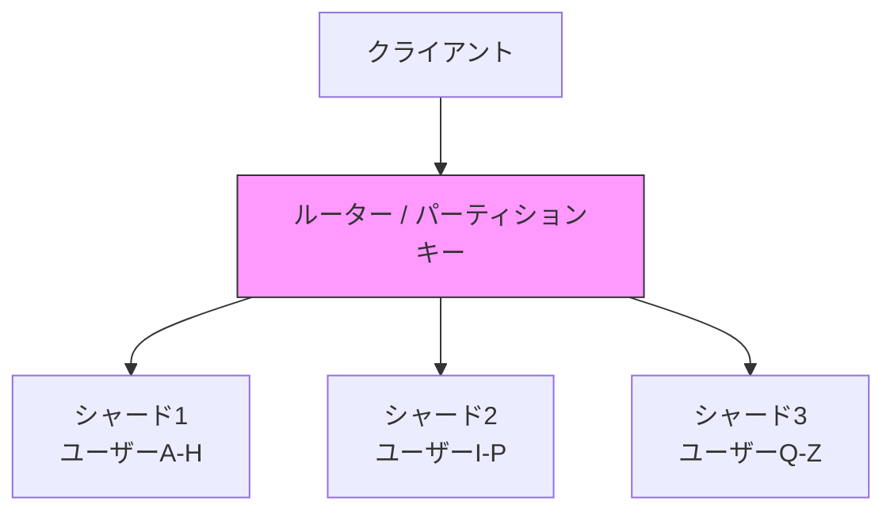

# NoSQL

> **一言で言うと:** RDBの「スキーマの硬直性」と「水平スケーリングの難しさ」を解決するために生まれた、リレーショナルモデル以外のデータストアの総称。

## なぜ必要か

[[RDB]]は整合性を最優先に設計されており、多くのアプリケーションで正しい選択肢である。しかし、以下のようなケースではRDBの設計前提が足かせになる:

- **スキーマの変更コストが高い**: RDBではテーブル構造を変えるたびに[[マイグレーション]]が必要。スタートアップのようにデータモデルが頻繁に変わるフェーズでは、これが開発速度のボトルネックになる
- **水平スケーリングが困難**: RDBのJOINやトランザクションは「すべてのデータが1台のサーバーにある」前提で設計されている。データが数十TB規模になると、1台のサーバーでは処理しきれない
- **データモデルの不一致**: JSON/ドキュメント型のデータ、グラフ構造の関係性、単純なKey-Valueペアなど、テーブル構造に自然にマッピングできないデータがある
- **超低レイテンシの要求**: キャッシュやセッション管理など、ミリ秒以下の応答が求められる場面ではディスクベースのRDBでは遅すぎる

NoSQLは「すべてを1つのモデルで解決しようとしない」という設計哲学に基づき、特定のユースケースに最適化されたデータストアを提供する。

## どの問題を解決するか

### 1. データモデルの多様性

NoSQLは用途に応じた複数のデータモデルを提供する:

| 種類 | 代表的なDB | データモデル | 主なユースケース |
|------|-----------|-------------|----------------|
| Key-Value | Redis, Memcached | キーに対して1つの値 | キャッシュ、セッション、カウンター |
| ドキュメント | MongoDB, Firestore | JSONライクな階層構造 | CMS、ユーザープロファイル、カタログ |
| カラムファミリー | Cassandra, HBase | 行キー + カラムファミリー | 時系列データ、IoTログ、分析 |
| グラフ | Neo4j, Amazon Neptune | ノードとエッジ | SNS、レコメンド、ナレッジグラフ |

### 2. 水平スケーリング（Sharding）

RDBが「スケールアップ（サーバーを強くする）」に依存するのに対し、NoSQLの多くは最初から**シャーディング（Sharding）** を前提に設計されている。



DynamoDBのパーティションキー設計がその典型で、データのアクセスパターンに基づいてキーを選ぶことで、負荷が均等に分散される。

### 3. CAP定理とトレードオフ

分散システムにおいて、以下の3つを同時に完全に満たすことはできないという定理:

- **C（Consistency / 一貫性）**: すべてのノードが同じデータを返す
- **A（Availability / 可用性）**: すべてのリクエストが応答を返す
- **P（Partition Tolerance / 分断耐性）**: ネットワーク分断が起きてもシステムが動き続ける

ネットワーク分断（P）は現実のシステムでは避けられないため、実際の選択は **CP（一貫性優先）** か **AP（可用性優先）** のどちらかになる:

| 選択 | 特徴 | 例 |
|------|------|-----|
| CP | 分断時に一部リクエストを拒否してでもデータの一貫性を守る | MongoDB（デフォルト）, HBase, etcd |
| AP | 古いデータを返してでも応答し続ける | Cassandra, DynamoDB（結果整合性モード）, CouchDB |

### 4. 結果整合性（Eventual Consistency）

RDBのACIDに対し、多くのNoSQLは **BASE** という特性を持つ:

- **BA（Basically Available）**: 基本的にいつでも応答する
- **S（Soft State）**: 一時的にノード間でデータが不一致でもよい
- **E（Eventually Consistent）**: 最終的にはすべてのノードが同じデータに収束する

[[レプリケーションとレプリケーション遅延]]で触れるように、書き込みが全ノードに反映されるまでのタイムラグを許容する代わりに、高可用性とスケーラビリティを実現する。

## 他の仕組みとどう関係するか

- **下位レイヤーとの関係:**
  - [[ファイルシステムとIO]]: NoSQLもディスク上にデータを永続化する。RedisのRDB/AOF永続化、MongoDBのWiredTigerエンジンなど、ストレージエンジンはファイルI/Oの上に構築される
  - [[データ構造とアルゴリズム]]: [[ハッシュテーブル]]がKey-Valueストアの基盤、[[B-TreeとB+Tree]]がドキュメントDBのインデックスに使われる。RedisのSorted SetはSkip Listで実装されている

- **同レイヤーとの関係:**
  - [[RDB]]: NoSQLはRDBの代替ではなく補完。多くの実システムではRDBとNoSQLを併用する（Polyglot Persistence）
  - [[Resources/Study/Layer3-データ永続化/インデックス|インデックス]]: NoSQLでもインデックスは重要。MongoDBのセカンダリインデックス、DynamoDBのGSI（Global Secondary Index）/ LSI（Local Secondary Index）など
  - [[キャッシュ戦略]]: RedisはNoSQLであると同時にキャッシュとしても広く使われる。キャッシュ戦略の選択と密接に関連する

- **上位レイヤーとの関係:**
  - [[Layer4-アプリケーション/_index|Layer 4: アプリケーション]]: ORMの代わりにODM（Object Document Mapper）を使用する。MongooseなどがNode.jsでの典型例
  - [[Layer6-セキュリティ/_index|Layer 6: セキュリティ]]: NoSQLインジェクションという攻撃ベクトルが存在する。MongoDBの `$where` や `$gt` を利用した攻撃は、SQLインジェクションと同じく入力のサニタイズで防ぐ

## 誤解されやすいポイント

### 1.「NoSQL = スキーマレス」ではない

MongoDBは「スキーマレス」と呼ばれることが多いが、実際にはアプリケーション側でスキーマを管理する必要がある。RDBがDB側でスキーマを強制するのに対し、NoSQLではスキーマの責任がアプリケーション層に移動するだけ。MongoDBのSchema Validation機能のように、DB側でもスキーマを定義できる。

**スキーマの責任が消えるのではなく、移動する。** これを理解しないと、時間が経つにつれて矛盾したデータが蓄積される「スキーマ崩壊」が起こる。

### 2.「NoSQLはRDBより速い」わけではない

NoSQLが速いのは、特定のアクセスパターンに最適化されている場合のみ。例えばRedisがRDBより速いのは、データをメモリに保持しているからであって、NoSQLだからではない。逆に、MongoDBで複数コレクションにまたがる複雑な集計を行うと、RDBのJOINより遅くなることがある。

**速さの理由は「NoSQLだから」ではなく「特定のアクセスパターンに最適化されているから」。**

### 3.「CAP定理で3つのうち2つを選ぶ」は単純化しすぎ

CAP定理はネットワーク分断が**発生している間**のトレードオフを述べたもの。分断が起きていない通常時は、CとAの両方を提供できる。また、同じDB内でも操作やデータごとに一貫性レベルを変えられるもの（DynamoDBのStrong Consistent Read等）がある。

### 4.「RDBかNoSQLか」の二者択一ではない

実務ではRDBとNoSQLを併用する**ポリグロット永続化（Polyglot Persistence）** が一般的。例えば:
- ユーザーアカウント・決済 → PostgreSQL（整合性が最重要）
- 商品カタログ → MongoDB（柔軟なスキーマ）
- セッション・キャッシュ → Redis（低レイテンシ）
- ログ・分析 → Elasticsearch（全文検索）

## 設計のベストプラクティス

### アクセスパターン駆動設計

RDBでは「正規化してからクエリを考える」が正しいアプローチだが、NoSQLでは**アクセスパターンを先に決めてからデータモデルを設計する**。

```
❌ RDB的思考: 「ユーザーテーブル、注文テーブル、商品テーブルを正規化して作ろう」
✅ NoSQL的思考: 「ユーザーの注文一覧を1回のクエリで取得したいから、注文データをユーザードキュメントに埋め込もう」
```

### DynamoDBのシングルテーブル設計

DynamoDBでは、複数のエンティティを1つのテーブルに格納する**シングルテーブル設計**が推奨される:

| PK | SK | データ |
|----|----|--------|
| USER#123 | PROFILE | {name, email, ...} |
| USER#123 | ORDER#456 | {total, items, ...} |
| USER#123 | ORDER#789 | {total, items, ...} |
| ORDER#456 | ITEM#001 | {product, qty, ...} |

パーティションキー（PK）とソートキー（SK）の設計が性能を決定する。

### 非正規化の意図的な活用

NoSQLではデータの重複（非正規化）を恐れない。ただし、更新頻度と読み取り頻度のバランスを考慮する:

- 読み取りが圧倒的に多い → 非正規化（埋め込み）で読み取りを高速化
- 更新が頻繁 → 参照（ID保持）で更新の一貫性を確保

### アンチパターン

| アンチパターン | なぜ問題か | 対策 |
|---|---|---|
| RDBの設計をそのままNoSQLに持ち込む | JOINがないため正規化設計は非効率的なクエリを生む | アクセスパターンに基づいた非正規化設計を行う |
| ホットパーティション | 特定のシャードにアクセスが集中しスケーラビリティが失われる | パーティションキーの分散を確認し、必要ならランダムサフィックスを付与 |
| 無制限の配列成長 | ドキュメント内の配列が際限なく大きくなりパフォーマンス劣化 | Bucket Pattern等で一定サイズごとにドキュメントを分割 |
| 結果整合性を考慮しない設計 | 書き込み直後の読み取りで古いデータが返ることを想定していない | Read-after-Writeの整合性要件を明確にし、必要なら強い整合性オプションを使う |

## AIによる実装のアンチパターン

| アンチパターン | なぜ問題か | 対策 |
|---|---|---|
| MongoDBのスキーマ未定義で運用 | 「スキーマレスだからバリデーション不要」と判断し、Mongoose SchemaやMongoDB Schema Validationを省略する | 必ずアプリケーション層またはDB層でスキーマを定義する |
| 全データをRedisに保存 | 永続化が必要なデータまでRedisに格納し、再起動でデータ喪失 | Redisはキャッシュ・セッション用途に限定し、マスターデータはRDBに保持 |
| DynamoDBでScanを多用 | フィルタリングをScan + FilterExpressionで実現し、全テーブル走査が発生 | GSI/LSIを活用し、Queryで取得できるキー設計にする |
| N+1クエリの再発明 | ドキュメントDBで参照IDを個別にfetchするループを生成 | 埋め込みで解決するか、`$lookup`（MongoDB）やBatchGetItem（DynamoDB）を使う |

## 具体例

### Redis — Key-Valueストアの基本操作

```python
import redis

r = redis.Redis(host='localhost', port=6379, decode_responses=True)

# 基本的なKey-Value操作
r.set('user:123:name', 'Alice')
r.set('user:123:email', 'alice@example.com')

# TTL付きでセッションを保存（30分で自動削除）
r.setex('session:abc', 1800, '{"user_id": 123, "role": "admin"}')

# Sorted Set — ランキング機能
r.zadd('leaderboard', {'Alice': 1500, 'Bob': 1200, 'Charlie': 1800})

# 上位3名を取得（スコア降順）
top3 = r.zrevrange('leaderboard', 0, 2, withscores=True)
print(top3)  # [('Charlie', 1800.0), ('Alice', 1500.0), ('Bob', 1200.0)]

# アトミックなカウンター
r.incr('page:home:views')  # 1
r.incr('page:home:views')  # 2
```

### MongoDB — ドキュメントDBの基本操作

```typescript
import { MongoClient, type Document } from "mongodb";

const client = new MongoClient("mongodb://localhost:27017");
const db = client.db("shop");

interface OrderItem {
  productId: string;
  name: string;
  price: number;
  qty: number;
}

interface Order {
  userId: string;
  status: string;
  items: OrderItem[];
  total: number;
  createdAt: Date;
}

const orders = db.collection<Order>("orders");

// ドキュメントの挿入（埋め込み設計）
await orders.insertOne({
  userId: "user123",
  status: "shipped",
  items: [
    { productId: "p001", name: "キーボード", price: 8000, qty: 1 },
    { productId: "p002", name: "マウス", price: 3000, qty: 2 },
  ],
  total: 14000,
  createdAt: new Date(),
});

// ユーザーの注文を1回のクエリで取得（JOINなし）
const userOrders = await orders
  .find({ userId: "user123" })
  .sort({ createdAt: -1 })
  .toArray();

// 集計パイプライン — ユーザーごとの合計金額
const result = await orders
  .aggregate<{ _id: string; totalSpent: number }>([
    { $group: { _id: "$userId", totalSpent: { $sum: "$total" } } },
    { $sort: { totalSpent: -1 } },
  ])
  .toArray();
```

### DynamoDB — シングルテーブル設計の例

```python
import boto3

dynamodb = boto3.resource('dynamodb')
table = dynamodb.Table('AppTable')

# ユーザープロファイルの保存
table.put_item(Item={
    'PK': 'USER#123',
    'SK': 'PROFILE',
    'name': 'Alice',
    'email': 'alice@example.com',
})

# 同じユーザーの注文を保存
table.put_item(Item={
    'PK': 'USER#123',
    'SK': 'ORDER#2026-03-28#001',
    'total': 14000,
    'status': 'shipped',
})

# ユーザー情報と全注文を1回のQueryで取得
response = table.query(
    KeyConditionExpression='PK = :pk',
    ExpressionAttributeValues={':pk': 'USER#123'},
)
# response['Items'] にプロファイルと全注文が含まれる
```

### Go — Redis と DynamoDB の操作

```go
package main

import (
	"context"
	"fmt"
	"log"

	"github.com/redis/go-redis/v9"
)

func main() {
	ctx := context.Background()
	rdb := redis.NewClient(&redis.Options{Addr: "localhost:6379"})
	defer rdb.Close()

	// Key-Value 基本操作
	rdb.Set(ctx, "user:123:name", "Alice", 0)
	name, _ := rdb.Get(ctx, "user:123:name").Result()
	fmt.Println(name) // "Alice"

	// Sorted Set — ランキング
	rdb.ZAdd(ctx, "leaderboard", redis.Z{Score: 1500, Member: "Alice"})
	rdb.ZAdd(ctx, "leaderboard", redis.Z{Score: 1200, Member: "Bob"})
	rdb.ZAdd(ctx, "leaderboard", redis.Z{Score: 1800, Member: "Charlie"})

	top3, _ := rdb.ZRevRangeWithScores(ctx, "leaderboard", 0, 2).Result()
	for _, z := range top3 {
		fmt.Printf("%s: %.0f\n", z.Member, z.Score)
	}
	// Charlie: 1800
	// Alice: 1500
	// Bob: 1200

	// アトミックなカウンター
	rdb.Incr(ctx, "page:home:views")
	views, _ := rdb.Get(ctx, "page:home:views").Result()
	fmt.Println("Views:", views)
}
```

## 参考リソース

- Martin Kleppmann 著『Designing Data-Intensive Applications』 — 分散データストアの設計原理を体系的に解説
- Alex DeBrie 著『The DynamoDB Book』 — DynamoDBのデータモデリングの実践ガイド
- [MongoDB University](https://university.mongodb.com/) — MongoDB公式の無料学習コース
- [Redis University](https://university.redis.com/) — Redis公式の無料学習コース

## 学習メモ

（個人的な気づき・疑問・TODO）
