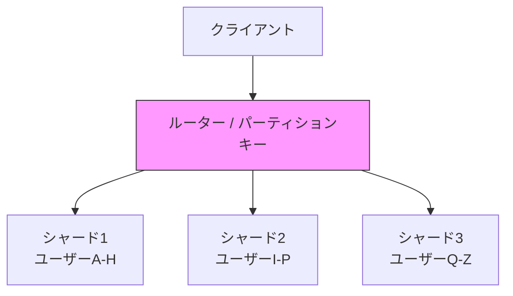

# NoSQL

> **一言で言うと:** RDBの「スキーマの硬直性」と「水平スケーリングの難しさ」を解決するために生まれた、リレーショナルモデル以外のデータストアの総称。「特定のアクセスパターンに最適化する」設計哲学が共通する。

## 3分で全体像

- **何を解決する技術か:** RDB の前提（単一サーバー上の正規化済みテーブル + JOIN + ACID）が足かせになるケース — 数十TB規模の水平スケーリング、ミリ秒以下の低レイテンシ、頻繁なスキーマ変更、JSON/グラフ等テーブルに収まらないデータモデル
- **代表的な使用シーン:** Redis（キャッシュ・セッション・ランキング）、MongoDB（CMS・カタログ・ログ）、DynamoDB（高スループット OLTP・サーバーレス）、Cassandra（時系列・IoT）、Neo4j（SNS・レコメンド）
- **これだけは覚える3つ:**
    1. **「NoSQL = スキーマレス」ではなく「スキーマ責任が DB → アプリ層に移る」だけ** — Mongoose や DynamoDB の TypeScript 型でスキーマを担保しないと「スキーマ崩壊」が起きる
    2. **アクセスパターン駆動設計** — RDB は「正規化してからクエリを考える」が、NoSQL は「クエリを先に決めてからデータ構造を決める」。逆にすると致命的に遅いか機能しない
    3. **CAP定理は二者択一ではなく「分断中の挙動の選択」** — 平常時は C と A を両立できる。同じ DB 内でも操作ごとに整合性レベルを変えられる（例: DynamoDB の Strong Consistent Read）
- **AIに任せやすいか:** **一部任せられる** — Redis 操作・MongoDB の単純な CRUD・Mongoose スキーマ定義は AI が書ける。ただし「データモデル設計（埋め込み vs 参照）」「DynamoDB のシングルテーブル設計」「パーティションキー選定」はアクセスパターンに依存し、AI に任せると **「RDB 設計をそのまま NoSQL に持ち込む」「Scan を多用する」** などのアンチパターンを出しやすい
- **詰まったらここを読む:** [[RDB]] / [[キャッシュ戦略]] / [[ハッシュテーブル]]

## なぜ必要か

[[RDB]]は整合性を最優先に設計されており、多くのアプリケーションで正しい選択肢である。しかし、以下のようなケースではRDBの設計前提が足かせになる:

- **スキーマの変更コストが高い**: RDBではテーブル構造を変えるたびに[[マイグレーション]]が必要。スタートアップのようにデータモデルが頻繁に変わるフェーズでは、これが開発速度のボトルネックになる
- **水平スケーリングが困難**: RDBのJOINやトランザクションは「すべてのデータが1台のサーバーにある」前提で設計されている。データが数十TB規模になると、1台のサーバーでは処理しきれない
- **データモデルの不一致**: JSON/ドキュメント型のデータ、グラフ構造の関係性、単純なKey-Valueペアなど、テーブル構造に自然にマッピングできないデータがある
- **超低レイテンシの要求**: キャッシュやセッション管理など、ミリ秒以下の応答が求められる場面ではディスクベースのRDBでは遅すぎる

NoSQLは「すべてを1つのモデルで解決しようとしない」という設計哲学に基づき、特定のユースケースに最適化されたデータストアを提供する。

## どの問題を解決するか

### 1. データモデルの多様性

NoSQLは用途に応じた複数のデータモデルを提供する:

| 種類 | 代表的なDB | データモデル | 主なユースケース |
|------|-----------|-------------|----------------|
| Key-Value | Redis, Memcached | キーに対して1つの値 | キャッシュ、セッション、カウンター |
| ドキュメント | MongoDB, Firestore | JSONライクな階層構造 | CMS、ユーザープロファイル、カタログ |
| カラムファミリー | Cassandra, HBase | 行キー + カラムファミリー | 時系列データ、IoTログ、分析 |
| グラフ | Neo4j, Amazon Neptune | ノードとエッジ | SNS、レコメンド、ナレッジグラフ |

グラフDBには「ノード/エッジに任意の属性を持たせるプロパティグラフ」と「主語・述語・目的語のトリプルで表すRDF」の2系統があり、後者では語彙を形式的に定義することで**書いていない事実を推論で導出**できる。この語彙の定義が[[オントロジーとナレッジグラフ|オントロジー]]で、schema.org の構造化データやGraphRAGとして実務にも顔を出す。

### 2. 水平スケーリング（Sharding）

RDBが「スケールアップ（サーバーを強くする）」に依存するのに対し、NoSQLの多くは最初から**シャーディング（Sharding）** を前提に設計されている。


```mermaid
graph TB
    Client[クライアント] --> Router[ルーター / パーティションキー]
    Router --> S1[シャード1<br/>ユーザーA-H]
    Router --> S2[シャード2<br/>ユーザーI-P]
    Router --> S3[シャード3<br/>ユーザーQ-Z]

    style Router fill:#f9f,stroke:#333
```

DynamoDBのパーティションキー設計がその典型で、データのアクセスパターンに基づいてキーを選ぶことで、負荷が均等に分散される。

### 3. CAP定理とトレードオフ

分散システムにおいて、以下の3つを同時に完全に満たすことはできないという定理:

- **C（Consistency / 一貫性）**: すべてのノードが同じデータを返す
- **A（Availability / 可用性）**: すべてのリクエストが応答を返す
- **P（Partition Tolerance / 分断耐性）**: ネットワーク分断が起きてもシステムが動き続ける

ネットワーク分断（P）は現実のシステムでは避けられないため、実際の選択は **CP（一貫性優先）** か **AP（可用性優先）** のどちらかになる:

| 選択 | 特徴 | 例 |
|------|------|-----|
| CP | 分断時に一部リクエストを拒否してでもデータの一貫性を守る | MongoDB（デフォルト）, HBase, etcd |
| AP | 古いデータを返してでも応答し続ける | Cassandra, DynamoDB（結果整合性モード）, CouchDB |

### 4. 結果整合性（Eventual Consistency）

RDBのACIDに対し、多くのNoSQLは **BASE** という特性を持つ:

- **BA（Basically Available）**: 基本的にいつでも応答する
- **S（Soft State）**: 一時的にノード間でデータが不一致でもよい
- **E（Eventually Consistent）**: 最終的にはすべてのノードが同じデータに収束する

[[レプリケーションとレプリケーション遅延]]で触れるように、書き込みが全ノードに反映されるまでのタイムラグを許容する代わりに、高可用性とスケーラビリティを実現する。

## 他の仕組みとどう関係するか

- **下位レイヤーとの関係:**
  - [[ファイルシステムとIO]]: NoSQLもディスク上にデータを永続化する。RedisのRDB/AOF永続化、MongoDBのWiredTigerエンジンなど、ストレージエンジンはファイルI/Oの上に構築される
  - [[データ構造とアルゴリズム]]: [[ハッシュテーブル]]がKey-Valueストアの基盤、[[B-TreeとB+Tree]]がドキュメントDBのインデックスに使われる。RedisのSorted SetはSkip Listで実装されている

- **同レイヤーとの関係:**
  - [[RDB]]: NoSQLはRDBの代替ではなく補完。多くの実システムではRDBとNoSQLを併用する（Polyglot Persistence）
  - [[Resources/Study/Layer3-データ永続化/インデックス|インデックス]]: NoSQLでもインデックスは重要。MongoDBのセカンダリインデックス、DynamoDBのGSI（Global Secondary Index）/ LSI（Local Secondary Index）など
  - [[キャッシュ戦略]]: RedisはNoSQLであると同時にキャッシュとしても広く使われる。キャッシュ戦略の選択と密接に関連する

- **上位レイヤーとの関係:**
  - [[Layer4-アプリケーション/_index|Layer 4: アプリケーション]]: ORMの代わりにODM（Object Document Mapper）を使用する。MongooseなどがNode.jsでの典型例
  - [[Layer6-セキュリティ/_index|Layer 6: セキュリティ]]: NoSQLインジェクションという攻撃ベクトルが存在する。MongoDBの `$where` や `$gt` を利用した攻撃は、SQLインジェクションと同じく入力のサニタイズで防ぐ

## 誤解されやすいポイント

### 1.「NoSQL = スキーマレス」ではない

MongoDBは「スキーマレス」と呼ばれることが多いが、実際にはアプリケーション側でスキーマを管理する必要がある。RDBがDB側でスキーマを強制するのに対し、NoSQLではスキーマの責任がアプリケーション層に移動するだけ。MongoDBのSchema Validation機能のように、DB側でもスキーマを定義できる。

**スキーマの責任が消えるのではなく、移動する。** これを理解しないと、時間が経つにつれて矛盾したデータが蓄積される「スキーマ崩壊」が起こる。

### 2.「NoSQLはRDBより速い」わけではない

NoSQLが速いのは、特定のアクセスパターンに最適化されている場合のみ。例えばRedisがRDBより速いのは、データをメモリに保持しているからであって、NoSQLだからではない。逆に、MongoDBで複数コレクションにまたがる複雑な集計を行うと、RDBのJOINより遅くなることがある。

**速さの理由は「NoSQLだから」ではなく「特定のアクセスパターンに最適化されているから」。**

### 3.「CAP定理で3つのうち2つを選ぶ」は単純化しすぎ

CAP定理はネットワーク分断が**発生している間**のトレードオフを述べたもの。分断が起きていない通常時は、CとAの両方を提供できる。また、同じDB内でも操作やデータごとに一貫性レベルを変えられるもの（DynamoDBのStrong Consistent Read等）がある。

### 4.「RDBかNoSQLか」の二者択一ではない

実務ではRDBとNoSQLを併用する**ポリグロット永続化（Polyglot Persistence）** が一般的。例えば:
- ユーザーアカウント・決済 → PostgreSQL（整合性が最重要）
- 商品カタログ → MongoDB（柔軟なスキーマ）
- セッション・キャッシュ → Redis（低レイテンシ）
- ログ・分析 → Elasticsearch（全文検索）

## 設計のベストプラクティス

### アクセスパターン駆動設計

RDBでは「正規化してからクエリを考える」が正しいアプローチだが、NoSQLでは**アクセスパターンを先に決めてからデータモデルを設計する**。

```
❌ RDB的思考: 「ユーザーテーブル、注文テーブル、商品テーブルを正規化して作ろう」
✅ NoSQL的思考: 「ユーザーの注文一覧を1回のクエリで取得したいから、注文データをユーザードキュメントに埋め込もう」
```

### DynamoDBのシングルテーブル設計

DynamoDBでは、複数のエンティティを1つのテーブルに格納する**シングルテーブル設計**が推奨される:

| PK | SK | データ |
|----|----|--------|
| USER#123 | PROFILE | {name, email, ...} |
| USER#123 | ORDER#456 | {total, items, ...} |
| USER#123 | ORDER#789 | {total, items, ...} |
| ORDER#456 | ITEM#001 | {product, qty, ...} |

パーティションキー（PK）とソートキー（SK）の設計が性能を決定する。

### 非正規化の意図的な活用

NoSQLではデータの重複（非正規化）を恐れない。ただし、更新頻度と読み取り頻度のバランスを考慮する:

- 読み取りが圧倒的に多い → 非正規化（埋め込み）で読み取りを高速化
- 更新が頻繁 → 参照（ID保持）で更新の一貫性を確保

### アンチパターン

| アンチパターン | なぜ問題か | 対策 |
|---|---|---|
| RDBの設計をそのままNoSQLに持ち込む | JOINがないため正規化設計は非効率的なクエリを生む | アクセスパターンに基づいた非正規化設計を行う |
| ホットパーティション | 特定のシャードにアクセスが集中しスケーラビリティが失われる | パーティションキーの分散を確認し、必要ならランダムサフィックスを付与 |
| 無制限の配列成長 | ドキュメント内の配列が際限なく大きくなりパフォーマンス劣化 | Bucket Pattern等で一定サイズごとにドキュメントを分割 |
| 結果整合性を考慮しない設計 | 書き込み直後の読み取りで古いデータが返ることを想定していない | Read-after-Writeの整合性要件を明確にし、必要なら強い整合性オプションを使う |

## AIエージェントとの協働

> このトピックでAIコーディングエージェント（Claude Code, Copilot, Cursor 等）と協働するための観点。
> NoSQL は **「アクセスパターンを先に決める」** 設計が要だが、AI は学習データの大半が RDB なので「**RDB の設計をそのまま NoSQL に持ち込む**」傾向がある。AI に NoSQL コードを書かせるときは、想定アクセスパターンとパーティション/シャード戦略をプロンプトに必ず含める。

### AIに任せられる部分 / 人間が判断すべき部分

| タスク種類 | 任せ方（実装/レビュー） | 人間の関与 |
|---|---|---|
| Redis / MongoDB / DynamoDB の API 操作 | AI に任せる | コネクションプール、TTL の値、シリアライズ形式は実運用に応じて指定 |
| Mongoose / Prisma スキーマ定義 | AI に叩き台 | 埋め込み vs 参照の判断、配列の上限設計は人間 |
| DynamoDB のシングルテーブル設計（PK/SK 設計） | AI に複数案を出させる | アクセスパターン一覧を提示、ホットパーティション回避は人間が確認 |
| 集計クエリ（MongoDB Aggregation） | AI に書かせる | パイプライン段階数とインデックス利用は EXPLAIN で人間が検証 |
| Redis のキー命名規約 | AI に提案させる | プロジェクト規約と TTL 戦略を統一する責任は人間 |
| データ移行スクリプト（RDB → NoSQL） | AI に実装 | データ整合性の検証ロジックと再実行性は人間レビュー必須 |

### AI生成コードのレビュー観点（このトピック固有）

AI生成 NoSQL コードを受け取ったとき、最低限ここを見る。

1. **RDB 設計を持ち込んでいないか** — 「ユーザーテーブル + 注文テーブルを正規化、$lookup で JOIN」のような構造は NoSQL では非効率。アクセスパターンに合わせて埋め込みやシングルテーブル設計を検討すべき
2. **スキーマ責任が放棄されていないか** — Mongoose Schema・MongoDB Schema Validation・TypeScript 型・DynamoDB の AttributeDefinitions が省略されていないか。「スキーマレスだからバリデーション不要」は典型的なアンチパターン
3. **Scan / 全件走査が混入していないか** — DynamoDB の `Scan`、MongoDB の `find()` 全件取得、Redis の `KEYS *` は本番で禁忌。GSI/LSI の追加、`Query` への置き換え、`SCAN` コマンド（カーソルベース）への変更を要求する

### 効くプロンプトの型

このトピックに関する実装を AI に依頼するとき、コンテキストとして渡すべき情報・制約・成功基準のテンプレ。

```
# 前提（プロジェクトの状況・既存のコード規約）
- 使用 DB: MongoDB 7 / DynamoDB / Redis 7
- データの性質（ドキュメントサイズ、配列の最大要素数、キーのカーディナリティ）
- 想定アクセスパターン（最重要 — RDB と違い、これがデータモデルを決定する）:
  1. ユーザーIDから直近10件の注文を取得
  2. ユーザー全体の合計金額を集計
  3. 注文IDから1件取得
- 想定 QPS、平均/最大ドキュメントサイズ
- 既存スキーマ・既存パーティション設計

# やってほしいこと
- 上記アクセスパターンを最も効率的に処理するスキーマ・キー設計を提案
- 各設計判断（埋め込み vs 参照、PK/SK の選択）の理由を併記

# 守ってほしい制約
- スキーマは必ず定義する（Mongoose Schema / TypeScript 型 / DynamoDB AttributeDefinitions）
- DynamoDB では Scan を使わず Query のみで完結するキー設計
- MongoDB では大きな配列の無制限成長を避ける（Bucket Pattern を検討）
- Redis は永続化が必要なマスターデータには使わない
- ホットパーティション回避（DynamoDB なら高カーディナリティの PK を選ぶ）

# 完了の判断基準
- 全アクセスパターンが O(1) または O(log n) で実行できる
- スキーマで想定外データを弾ける
- 結果整合性のリスクが許容できるか明示
```

### AI実装のアンチパターン

LLM 生成コードで頻出する過剰設計・誤用パターン。レビュー時の照合表として使う。

| アンチパターン | なぜ問題か | レビュー観点 / 対策 |
|---|---|---|
| MongoDB のスキーマ未定義で運用 | 「スキーマレスだから不要」と判断し、Mongoose Schema や Schema Validation を省略 | アプリ層または DB 層でスキーマを必ず定義 |
| 全データを Redis に保存 | 永続化が必要なデータまで Redis に格納し、再起動・eviction でデータ喪失 | Redis はキャッシュ・セッション・揮発カウンタ等に限定。マスターデータは RDB へ |
| DynamoDB で Scan を多用 | `Scan + FilterExpression` で全テーブル走査が発生し、コストとレイテンシが破綻 | GSI/LSI を設計、`Query` で完結するキー設計にする |
| N+1 クエリの再発明 | ドキュメント DB で参照 ID を個別 fetch するループを生成 | 埋め込みで解決するか、`$lookup`（MongoDB）/ `BatchGetItem`（DynamoDB）を使う |
| RDB 設計をそのまま NoSQL に持ち込む | JOIN がないため正規化設計は非効率なクエリを生む | アクセスパターンに基づき非正規化（埋め込み） |
| ホットパーティションを生む PK 設計 | 特定シャードに負荷が集中、スケーラビリティ喪失 | 高カーディナリティのキー、必要ならランダムサフィックス |
| 無制限の配列成長 | ドキュメント内の配列が際限なく成長して 16MB 上限に到達 | Bucket Pattern で一定サイズごとに分割 |
| `KEYS *` / `FLUSHDB` を本番で実行 | 全キー走査で Redis 全体がブロック | `SCAN` を使う、本番への直接接続を制限 |

→ レイヤー横断のアンチパターン索引: [[_anti-patterns/_index|AIアンチパターン索引]] / [[_anti-patterns/レイヤー別/Layer3|Layer 3 アンチパターン集]]

## 具体例

### Redis — Key-Valueストアの基本操作

```python
import redis

r = redis.Redis(host='localhost', port=6379, decode_responses=True)

# 基本的なKey-Value操作
r.set('user:123:name', 'Alice')
r.set('user:123:email', 'alice@example.com')

# TTL付きでセッションを保存（30分で自動削除）
r.setex('session:abc', 1800, '{"user_id": 123, "role": "admin"}')

# Sorted Set — ランキング機能
r.zadd('leaderboard', {'Alice': 1500, 'Bob': 1200, 'Charlie': 1800})

# 上位3名を取得（スコア降順）
top3 = r.zrevrange('leaderboard', 0, 2, withscores=True)
print(top3)  # [('Charlie', 1800.0), ('Alice', 1500.0), ('Bob', 1200.0)]

# アトミックなカウンター
r.incr('page:home:views')  # 1
r.incr('page:home:views')  # 2
```

### MongoDB — ドキュメントDBの基本操作

```typescript
import { MongoClient, type Document } from "mongodb";

const client = new MongoClient("mongodb://localhost:27017");
const db = client.db("shop");

interface OrderItem {
  productId: string;
  name: string;
  price: number;
  qty: number;
}

interface Order {
  userId: string;
  status: string;
  items: OrderItem[];
  total: number;
  createdAt: Date;
}

const orders = db.collection<Order>("orders");

// ドキュメントの挿入（埋め込み設計）
await orders.insertOne({
  userId: "user123",
  status: "shipped",
  items: [
    { productId: "p001", name: "キーボード", price: 8000, qty: 1 },
    { productId: "p002", name: "マウス", price: 3000, qty: 2 },
  ],
  total: 14000,
  createdAt: new Date(),
});

// ユーザーの注文を1回のクエリで取得（JOINなし）
const userOrders = await orders
  .find({ userId: "user123" })
  .sort({ createdAt: -1 })
  .toArray();

// 集計パイプライン — ユーザーごとの合計金額
const result = await orders
  .aggregate<{ _id: string; totalSpent: number }>([
    { $group: { _id: "$userId", totalSpent: { $sum: "$total" } } },
    { $sort: { totalSpent: -1 } },
  ])
  .toArray();
```

### DynamoDB — シングルテーブル設計の例

```python
import boto3

dynamodb = boto3.resource('dynamodb')
table = dynamodb.Table('AppTable')

# ユーザープロファイルの保存
table.put_item(Item={
    'PK': 'USER#123',
    'SK': 'PROFILE',
    'name': 'Alice',
    'email': 'alice@example.com',
})

# 同じユーザーの注文を保存
table.put_item(Item={
    'PK': 'USER#123',
    'SK': 'ORDER#2026-03-28#001',
    'total': 14000,
    'status': 'shipped',
})

# ユーザー情報と全注文を1回のQueryで取得
response = table.query(
    KeyConditionExpression='PK = :pk',
    ExpressionAttributeValues={':pk': 'USER#123'},
)
# response['Items'] にプロファイルと全注文が含まれる
```

### Go — Redis と DynamoDB の操作

```go
package main

import (
	"context"
	"fmt"
	"log"

	"github.com/redis/go-redis/v9"
)

func main() {
	ctx := context.Background()
	rdb := redis.NewClient(&redis.Options{Addr: "localhost:6379"})
	defer rdb.Close()

	// Key-Value 基本操作
	rdb.Set(ctx, "user:123:name", "Alice", 0)
	name, _ := rdb.Get(ctx, "user:123:name").Result()
	fmt.Println(name) // "Alice"

	// Sorted Set — ランキング
	rdb.ZAdd(ctx, "leaderboard", redis.Z{Score: 1500, Member: "Alice"})
	rdb.ZAdd(ctx, "leaderboard", redis.Z{Score: 1200, Member: "Bob"})
	rdb.ZAdd(ctx, "leaderboard", redis.Z{Score: 1800, Member: "Charlie"})

	top3, _ := rdb.ZRevRangeWithScores(ctx, "leaderboard", 0, 2).Result()
	for _, z := range top3 {
		fmt.Printf("%s: %.0f\n", z.Member, z.Score)
	}
	// Charlie: 1800
	// Alice: 1500
	// Bob: 1200

	// アトミックなカウンター
	rdb.Incr(ctx, "page:home:views")
	views, _ := rdb.Get(ctx, "page:home:views").Result()
	fmt.Println("Views:", views)
}
```

## 参考リソース

- Martin Kleppmann 著『Designing Data-Intensive Applications』 — 分散データストアの設計原理を体系的に解説
- Alex DeBrie 著『The DynamoDB Book』 — DynamoDBのデータモデリングの実践ガイド
- [MongoDB University](https://university.mongodb.com/) — MongoDB公式の無料学習コース
- [Redis University](https://university.redis.com/) — Redis公式の無料学習コース

## 理解度セルフチェック

> 答えられなければ本文に戻る。答えはこのファイル内に必ずある。

1. **「NoSQL = スキーマレス」という説明はなぜ不正確なのか、30秒で説明せよ。** スキーマの責任はどこへ移るのか。
2. **「商品のジャンル別売上ランキング」を毎秒1万回参照する画面で、データを Redis に保存するか PostgreSQL に保存するか迷っている。判断のために確認すべきポイント** を3つ以上挙げよ。
3. **AI生成コードレビュー設問:** AI が以下の MongoDB スキーマとクエリを生成した。本文の観点で **問題点を3つ以上** 指摘し、なぜ問題か説明せよ。

```typescript
// users コレクション
{
  _id: ObjectId,
  name: String,
  email: String,
}

// orders コレクション
{
  _id: ObjectId,
  userId: ObjectId,  // users._id への参照
  total: Number,
  items: Array,      // 上限なし
  createdAt: Date,
}

// 「ユーザーごとの注文一覧画面」用のクエリ
async function getUserWithOrders(userId: string) {
  const user = await db.collection('users').findOne({ _id: userId });
  const orders = await db.collection('orders').find({ userId }).toArray();
  return { user, orders };
}

// 「全ユーザーの今月の合計購入金額」を計算
async function getMonthlyTotal() {
  const allOrders = await db.collection('orders').find({}).toArray();
  return allOrders
    .filter(o => o.createdAt >= startOfMonth())
    .reduce((sum, o) => sum + o.total, 0);
}
```

> [!note]- 解答の指針
>
> > [!info] 用語ミニ辞典
> > - **スキーマ崩壊:** スキーマ未定義で運用した結果、時間経過とともにフィールドの型・名前・存在有無がドキュメント間で食い違い、不整合データが蓄積される現象。例: `items: Array` で運用していた途中から `items: String` に変えたドキュメントが混在し、アプリ側の処理が壊れる
> > - **揮発性 (volatility):** 「再起動でデータが消える可能性」のこと。Redis はデフォルトでは AOF/RDB 永続化を設定しないとメモリ上のデータが消える。マスターデータの保存先には不向き
> > - **結果整合性 (Eventual Consistency):** 書き込み直後は全ノードに反映されておらず、しばらくすると全ノードが同じデータに収束するモデル。「書いた直後に読んでも古い値が返る可能性がある」を許容する代わりに高可用性とスケーラビリティを得る
> > - **強い整合性 (Strong Consistency):** 書き込み完了後はどのノードに対する読み取りでも最新値が返ることを保証するモデル。DynamoDB の Strong Consistent Read など、操作ごとに選択できる DB もある
> > - **埋め込み (Embedding):** 関連データを親ドキュメント内にネスト。1回の読み取りで完結するが、ドキュメントサイズ上限と更新コストに注意
> > - **参照 (Reference):** 別コレクションの ID を保持。RDB の外部キーに相当。JOIN（`$lookup`）が必要
> > - **ホットパーティション:** 特定のシャード/パーティションにアクセスが集中する状態。スケーラビリティが失われる
> > - **シングルテーブル設計:** DynamoDB で複数のエンティティ（ユーザー・注文・商品）を1テーブルに格納する設計。Query 1回で関連データをまとめて取得できる
>
> 1. MongoDB は確かに「DB がスキーマを強制しない」が、アプリケーションが時間とともに変化する以上、何らかのスキーマは必ず存在する。**スキーマの責任が DB → アプリケーション層に移る** だけ。Mongoose Schema や TypeScript 型、MongoDB の Schema Validation を使わないと、時間が経つと矛盾したデータが蓄積される「スキーマ崩壊」が起こる。「スキーマレス」は「スキーマの責任を放棄する自由」ではない
> 2. 確認すべきポイント:
>     - **データの揮発許容性** — Redis は再起動や eviction でデータを失う可能性がある。ランキングが「過去24時間の集計値」のような揮発可能なものなら Redis、月次ランキングのように永続が必要なら PostgreSQL（または PostgreSQL マスター + Redis キャッシュ）
>     - **更新頻度** — Redis の Sorted Set はランキング更新が O(log N) で速い。RDB で毎秒1万更新は厳しいが、毎秒1万**読み取り**ならインデックス + キャッシュで対応可能
>     - **整合性要件** — 「商品 A の売上が更新された瞬間にランキングに反映」が必須なら強い整合性が要る。「数秒遅れて反映」が許容なら結果整合性で OK で、選択肢が広がる
>     - **データサイズ** — Redis はメモリに乗る範囲しか持てない。100万商品 × 30ジャンル等になると Redis のメモリコストが跳ね上がる
>     - **複合的な分析の要否** — 「ジャンル別 + 期間別 + 価格帯別」のような任意の集計が必要なら RDB の SQL の方が柔軟。Redis は事前計算したスライスにしか答えられない
>     - **障害時の挙動** — Redis ダウンで画面が止まってよいか、PostgreSQL からフォールバック取得すべきか
> 3. AI生成コードの問題点（最低限以下を指摘できれば本文を理解している）:
>     - **`getUserWithOrders` で 2 回ラウンドトリップ** — `users.findOne` → `orders.find` の順で 2 回 DB アクセス。ユーザーと注文を頻繁に一緒に取るアクセスパターンなら、**埋め込み（注文配列を user ドキュメントに含める）** か **`$lookup` での集約** で 1 回に集約すべき。「アクセスパターン駆動設計」をしていれば、頻出する組み合わせは 1 クエリで取得できる構造に最初から設計する
>     - **`items: Array` に上限なし** — 注文ごとの item は通常少数だが、もしユーザーごとに注文配列を埋め込む設計に変えた場合は無制限成長で 16MB 制限に到達するリスク。Bucket Pattern など分割戦略の検討が必要（本文「アンチパターン」表「無制限の配列成長」を参照）
>     - **`getMonthlyTotal` で全 orders をクライアントに取得** — 全件を JS で `filter + reduce` するのは典型的な **「Scan + アプリ層フィルタ」アンチパターン**。MongoDB の Aggregation Pipeline で `$match` + `$group` を使い、DB 側で完結させるべき。さらに `createdAt` にインデックスがないとサーバ側でも遅い
>     - **スキーマ定義がない** — TypeScript 型・Mongoose Schema・MongoDB Schema Validation のいずれも使われていない。`total: Number` が誤って文字列になっても気付けない
>     - **`createdAt` のインデックスが想定されていない** — 月次集計のような時系列クエリは必ずインデックスが必要
>     - **`userId: ObjectId` の参照に対するインデックス未確認** — `orders.find({ userId })` を高速にするには `orders` の `userId` にインデックスが必須

## 学習メモ

（個人的な気づき・疑問・TODO）
