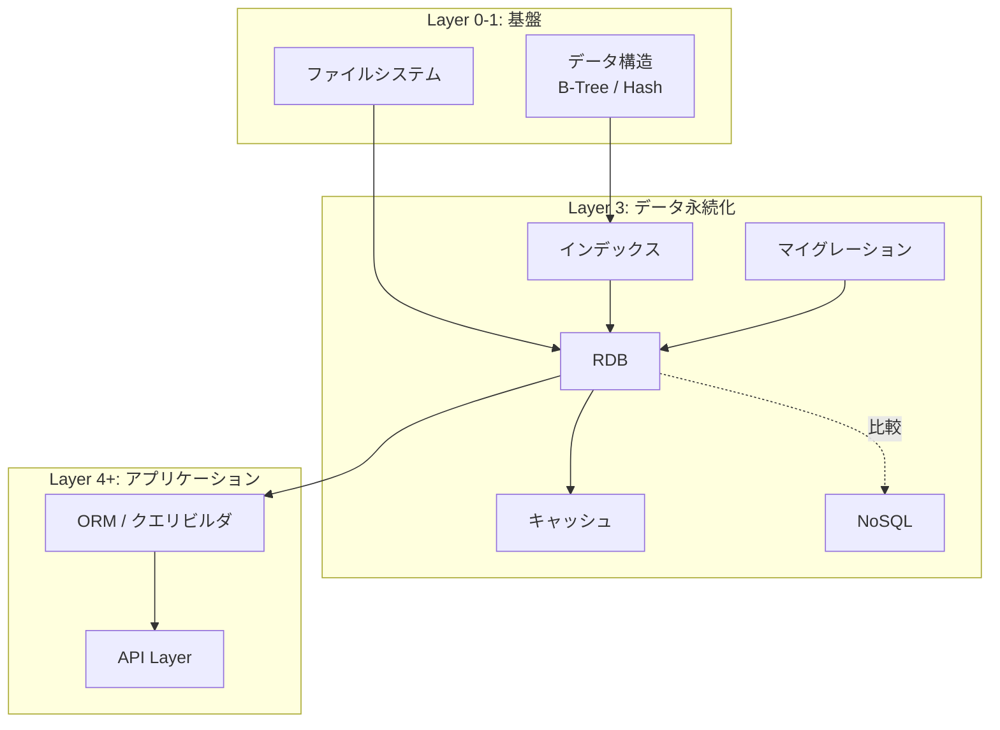

# RDB（Relational Database）

> **一言で言うと:** データの整合性を数学的に保証しながら、構造化データを永続化・検索するための仕組み。

## なぜ必要か

アプリケーションのデータをファイルに直接保存することを想像してみる。ユーザー情報をJSONファイルに書き込む場合、以下の問題がすぐに発生する:

- **整合性の崩壊**: 2つのプロセスが同時に同じファイルを書き換えると、データが壊れる
- **検索の非効率**: 100万件のユーザーから1人を探すのに全件走査が必要になる
- **関連データの管理不能**: 「ユーザーが注文した商品の一覧」のような関連性を持つデータをファイルで表現するのは極めて困難
- **障害時のデータ喪失**: 書き込み途中でプロセスがクラッシュすると、半端な状態のデータが残る

RDB はこれら全てを解決するために設計された。[[ファイルシステムとIO]]の上に構築されるが、ファイルの複雑さをアプリケーション開発者から隠蔽し、宣言的なインターフェース（SQL）を提供する。

## どの問題を解決するか

### 1. データの整合性 — ACID特性

RDB の最も重要な特徴は **ACID特性** による[[トランザクション]]の整合性保証である。

| 特性 | 意味 | 解決する問題 |
|------|------|-------------|
| **Atomicity（原子性）** | トランザクション内の操作は「全て成功」か「全て失敗」のどちらか | 送金で「引き落としだけ成功して入金が失敗」を防ぐ |
| **Consistency（一貫性）** | トランザクション前後でデータが制約（NOT NULL, UNIQUE 等）を満たす | 不正なデータが入り込まない |
| **Isolation（分離性）** | 同時実行されるトランザクションが互いに干渉しない | [[並行性の基本概念]]で学んだ競合状態をDB層で防ぐ |
| **Durability（永続性）** | コミットされたデータはシステム障害後も失われない | 電源断でもデータが消えない |

### 2. データの構造化 — 正規化

正規化（Normalization）は「**同じ事実を2箇所に書かない**」というシンプルな原則である。

非正規化の例:

```sql
-- 悪い例: 注文テーブルに顧客情報が重複して入る
CREATE TABLE orders (
    order_id INT PRIMARY KEY,
    customer_name VARCHAR(100),  -- 顧客名が注文ごとに重複
    customer_email VARCHAR(100), -- メールも注文ごとに重複
    product_name VARCHAR(100),
    amount DECIMAL(10,2)
);
```

正規化した例:

```sql
-- 顧客情報は1箇所にまとめる
CREATE TABLE customers (
    customer_id INT PRIMARY KEY,
    name VARCHAR(100) NOT NULL,
    email VARCHAR(100) UNIQUE NOT NULL
);

CREATE TABLE orders (
    order_id INT PRIMARY KEY,
    customer_id INT NOT NULL REFERENCES customers(customer_id),
    product_name VARCHAR(100) NOT NULL,
    amount DECIMAL(10,2) NOT NULL
);
```

正規化によって:
- 顧客名の変更が1箇所で済む（更新異常の防止）
- 注文のない顧客も登録できる（挿入異常の防止）
- 注文を全て削除しても顧客情報が消えない（削除異常の防止）

### 3. 宣言的なデータ操作 — SQL

SQL（Structured Query Language）は「**何が欲しいか**」を記述し、「**どう取得するか**」はDBエンジンに任せる宣言的言語である。

```sql
-- 「2026年3月に1万円以上注文した顧客の名前」を取得
SELECT c.name, SUM(o.amount) AS total
FROM customers c
JOIN orders o ON c.customer_id = o.customer_id
WHERE o.created_at >= '2026-03-01'
GROUP BY c.customer_id, c.name
HAVING SUM(o.amount) >= 10000
ORDER BY total DESC;
```

この問い合わせに対して、DBエンジンが[[インデックス]]の使用やJOINアルゴリズムの選択を自動的に最適化する（クエリプランナ）。

### 4. トランザクション分離レベル

[[並行性の基本概念]]で学んだ競合問題は、RDBではトランザクション分離レベルで制御する:

| 分離レベル | Dirty Read | Non-repeatable Read | Phantom Read | 性能 |
|-----------|-----------|-------------------|-------------|------|
| READ UNCOMMITTED | 発生 | 発生 | 発生 | 最速 |
| READ COMMITTED | 防止 | 発生 | 発生 | 速い |
| REPEATABLE READ | 防止 | 防止 | SQL標準では発生しうる※ | 普通 |
| SERIALIZABLE | 防止 | 防止 | 防止 | 最遅 |

※ SQL標準上は REPEATABLE READ で Phantom Read が発生しうるが、PostgreSQL（スナップショット分離）と MySQL InnoDB（ギャップロック）ではいずれもデフォルトで防止される。詳細は[[PostgreSQLとMySQLの比較]]を参照。

PostgreSQLのデフォルトは READ COMMITTED、MySQLのデフォルトは REPEATABLE READ である。

## 他の仕組みとどう関係するか

- **下位レイヤーとの関係:**
  - [[ファイルシステムとIO]] — RDBは最終的にディスク上のファイルにデータを書き込む。WAL（Write-Ahead Logging）は[[ファイルシステムとIO]]のfsyncを利用して永続性を実現する
  - [[データ構造とアルゴリズム]] — [[インデックス]]の内部構造であるB-Treeや[[ハッシュテーブル]]は、Layer 0で学ぶデータ構造そのもの
  - [[プロセスとスレッド]] — PostgreSQLはプロセスモデル、MySQLはスレッドモデルで接続を処理する。[[コネクションプール]]で接続の使い回しとDB負荷の制御を行う

- **同レイヤーとの関係:**
  - [[インデックス]] — RDBの検索性能を決定づける。正規化で分割したテーブルのJOINを高速にするために不可欠
  - [[NoSQL]] — RDBの「柔軟性の欠如」と「水平スケーリングの難しさ」を解決するために生まれた対比的な存在。CAP定理でRDBとの違いを理解する
  - [[キャッシュ戦略]] — RDBへの読み取り負荷を軽減するためにキャッシュ層を置くことが多い
  - [[マイグレーション]] — RDBのスキーマ変更を安全に実行する仕組み

- **上位レイヤーとの関係:**
  - [[Layer4-アプリケーション/_index|Layer 4: アプリケーション]] — ORM（Object-Relational Mapping）を介してアプリケーションコードからRDBにアクセスする
  - [[Layer6-セキュリティ/_index|Layer 6: セキュリティ]] — SQLインジェクションはRDBを使うアプリケーションの代表的な脆弱性。マルチテナント環境では[[RLS（Row-Level-Security）]]によるDB層でのアクセス制御が有効
  - [[Layer7-設計アーキテクチャ/_index|Layer 7: 設計・アーキテクチャ]] — ドメインモデルとテーブル設計の対応関係



## 誤解されやすいポイント

### 1. 「正規化すればするほど良い」

正規化は整合性のための手法だが、過度な正規化はJOINの増加でクエリ性能を悪化させる。実務では **第3正規形** まで適用し、パフォーマンス要件に応じて意図的に非正規化する（例: レポート用のサマリーテーブル）。重要なのは「なぜ非正規化したのか」を設計ドキュメントに残すこと。

### 2. 「トランザクションを使えば安全」

トランザクション内でも分離レベルによっては競合が発生する。また、トランザクションを長時間保持するとロック競合が増え、スループットが著しく低下する。トランザクションは「できるだけ短く」が原則。特に「SELECT → ユーザーの入力を待つ → UPDATE」のようにユーザーの応答をトランザクション内に含めてはいけない。

### 3. 「ORMを使えばSQLを知らなくていい」

ORMは便利だが、N+1問題（関連データを1件ずつ取得してしまう）や非効率なクエリを生成することがある。`EXPLAIN` でクエリプランを確認する習慣が必須。ORMは「SQLを書かなくていい」ではなく「SQLを理解した上で効率的に書くためのツール」である。

### 4. 「PostgreSQLとMySQLは大体同じ」

SQL標準に準拠している範囲は似ているが、[[PostgreSQLとMySQLの比較|重要な違い]]がある:
- PostgreSQLは MVCC を完全実装し、読み取りがロックを取らない
- MySQLのInnoDBは REPEATABLE READ がデフォルトで、ギャップロックを使う
- PostgreSQLはJSON型、配列型、レンジ型など豊富なデータ型を持つ
- [[レプリケーションとレプリケーション遅延|レプリケーション]]の方式や[[VACUUM|バキューム（VACUUM）]]の概念も異なる

## 設計のベストプラクティス

### 推奨パターン

1. **主キーには[[サロゲートキーと自然キー|サロゲートキー（代理キー）]]を使う**
   - 自然キー（メールアドレス等）は変更される可能性がある
   - UUID v7 やULID は分散環境でも衝突せず、時系列ソートも可能

2. **外部キー制約を必ず設定する**
   - アプリケーション層だけに頼らず、DB層でも整合性を保証する
   - `ON DELETE CASCADE` は慎重に。意図しない大量削除を防ぐため `RESTRICT` をデフォルトにする

3. **NOT NULL をデフォルトにする**
   - NULLは3値論理（TRUE/FALSE/NULL）を導入し、バグの温床になる
   - 「値がない」ことに明確な意味がある場合のみ NULL を許容する

4. **created_at / updated_at を全テーブルに持たせる**
   - デバッグ、監査、データ分析に不可欠

5. **ENUMは文字列型カラム + CHECK制約で代替する**
   - DB の ENUM 型は値の追加・削除にALTER TABLE が必要で[[マイグレーション]]が複雑になる

### アンチパターン

1. **EAV（Entity-Attribute-Value）パターン** — スキーマレスを模倣するためにRDBを歪める。柔軟性が必要なら[[NoSQL]]の利用を検討する
2. **多態的関連（Polymorphic Association）** — 外部キー制約が効かず、整合性が保証できない
3. **ソフトデリート（`deleted_at` カラム）の安易な使用** — 全クエリに `WHERE deleted_at IS NULL` が必要になり、漏れがバグの原因になる。本当に必要か再考する

## AIによる実装のアンチパターン

| アンチパターン | なぜ問題か | 対策 |
|---|---|---|
| 全カラムにインデックスを付与 | 書き込み性能が大幅に劣化し、ストレージも浪費する | 実際のクエリパターンに基づいてインデックスを設計する |
| 過剰なNULLチェック・COALESCE | NOT NULLカラムに対してもNULLチェックを生成し、コードが冗長になる | スキーマの制約を信頼し、NULLの可能性があるカラムだけに適用する |
| 全テーブルにソフトデリートを実装 | 不要なテーブルにまで`deleted_at`を付け、クエリが複雑化する | 法的・ビジネス要件で必要な場合のみ適用する |
| SELECTで常に全カラムを取得（`SELECT *`） | 不要なデータを転送し、インデックスオンリースキャンが効かなくなる | 必要なカラムだけを明示的に指定する |
| トランザクション分離レベルを無条件にSERIALIZABLE | 性能が著しく低下し、デッドロックが頻発する | デフォルトの分離レベルで十分か検討し、必要な箇所だけ上げる |

## 具体例

### テーブル設計とCRUD操作（PostgreSQL）

```sql
-- テーブル作成
CREATE TABLE users (
    id BIGINT GENERATED ALWAYS AS IDENTITY PRIMARY KEY,
    email VARCHAR(255) UNIQUE NOT NULL,
    name VARCHAR(100) NOT NULL,
    created_at TIMESTAMPTZ NOT NULL DEFAULT NOW(),
    updated_at TIMESTAMPTZ NOT NULL DEFAULT NOW()
);

CREATE TABLE posts (
    id BIGINT GENERATED ALWAYS AS IDENTITY PRIMARY KEY,
    user_id BIGINT NOT NULL REFERENCES users(id) ON DELETE RESTRICT,
    title VARCHAR(200) NOT NULL,
    body TEXT NOT NULL,
    published BOOLEAN NOT NULL DEFAULT FALSE,
    created_at TIMESTAMPTZ NOT NULL DEFAULT NOW(),
    updated_at TIMESTAMPTZ NOT NULL DEFAULT NOW()
);

-- インデックス: 実際のクエリパターンに基づいて追加
CREATE INDEX idx_posts_user_id ON posts(user_id);
CREATE INDEX idx_posts_published ON posts(published) WHERE published = TRUE;

-- INSERT
INSERT INTO users (email, name) VALUES ('taro@example.com', '太郎');

-- トランザクションで安全に操作
BEGIN;
    INSERT INTO posts (user_id, title, body, published)
    VALUES (1, 'はじめての投稿', 'RDBを学んでいます', TRUE);

    -- 何か問題があればロールバック可能
    -- ROLLBACK;
COMMIT;

-- JOIN で関連データを取得
SELECT u.name, p.title, p.created_at
FROM users u
JOIN posts p ON u.id = p.user_id
WHERE p.published = TRUE
ORDER BY p.created_at DESC;
```

### N+1問題の例（TypeScript + ORM風の疑似コード）

```typescript
// 悪い例: N+1問題 — ユーザーごとに1クエリ発行される
const posts = await db.query("SELECT * FROM posts WHERE published = TRUE");
for (const post of posts) {
    // N回のクエリが発行される
    const user = await db.query("SELECT * FROM users WHERE id = $1", [post.user_id]);
    console.log(`${user.name}: ${post.title}`);
}

// 良い例: JOINで1クエリにまとめる
const results = await db.query(`
    SELECT u.name, p.title
    FROM posts p
    JOIN users u ON p.user_id = u.id
    WHERE p.published = TRUE
`);
for (const row of results) {
    console.log(`${row.name}: ${row.title}`);
}
```

### EXPLAIN でクエリプランを確認する

```sql
EXPLAIN ANALYZE
SELECT u.name, COUNT(p.id) AS post_count
FROM users u
LEFT JOIN posts p ON u.id = p.user_id
GROUP BY u.id, u.name
ORDER BY post_count DESC
LIMIT 10;

-- 出力例:
-- Limit  (cost=... rows=10)
--   -> Sort  (cost=...)
--     -> HashAggregate  (cost=...)
--       -> Hash Left Join  (cost=...)
--           Hash Cond: (u.id = p.user_id)
--           -> Seq Scan on users u  (cost=...)
--           -> Hash  (cost=...)
--             -> Seq Scan on posts p  (cost=...)
```

`Seq Scan`（全件走査）が大きなテーブルに対して出ていたら、[[インデックス]]の追加を検討する。

## 参考リソース

- **書籍**: 『達人に学ぶDB設計 徹底指南書』（ミック著） — 正規化とテーブル設計の実践的な指南
- **書籍**: 『SQLアンチパターン』（Bill Karwin著） — 実務で陥りがちなDB設計の失敗パターン集
- **公式ドキュメント**: [PostgreSQL Documentation](https://www.postgresql.org/docs/) — 最も詳細で正確なリファレンス
- **公式ドキュメント**: [MySQL Reference Manual](https://dev.mysql.com/doc/refman/8.4/en/) — MySQL固有の挙動を確認する際に
- **記事**: [Use The Index, Luke](https://use-the-index-luke.com/) — SQLインデックスの解説に特化したサイト

## 学習メモ

- Layer 0 の[[データ構造とアルゴリズム]]（特にB-Tree、[[ハッシュテーブル]]）を理解した上で[[インデックス]]に進むと理解が深まる
- トランザクション分離レベルは[[並行性の基本概念]]の[[ロック]]と密接に関連する
- 実務では PostgreSQL を選んでおけば大抵の用途に対応できる。JSON型のサポートにより[[NoSQL]]的な使い方も可能
