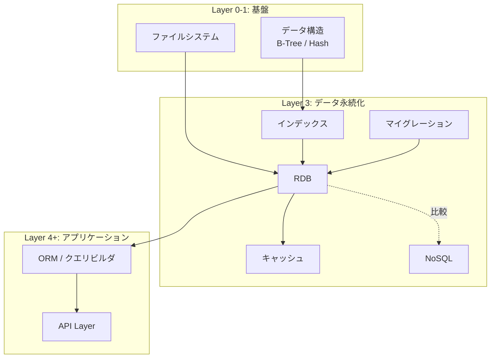

# RDB（Relational Database）

> **一言で言うと:** データの整合性を数学的に保証しながら、構造化データを永続化・検索するための仕組み。SQL という宣言的言語と ACID という強い保証で、ビジネスデータの「壊れない器」を提供する。

## 3分で全体像

- **何を解決する技術か:** 複数プロセスが同時にアクセスしても壊れない・検索が効率的・関連性を持つデータを安全に保存できる「ビジネスデータの器」を、ファイルシステムの上に構築する
- **代表的な使用シーン:** ユーザー情報・注文・在庫・決済など整合性が最重要のデータ、業務アプリケーション全般、レポーティング、トランザクションを伴う処理
- **これだけは覚える3つ:**
    1. **ACID特性** — トランザクションがデータの整合性を「数学的に」保証する。送金で「引き落としだけ成功」が起きないのはこの仕組みのおかげ
    2. **正規化** — 「同じ事実を2箇所に書かない」が設計原則。ただし第3正規形を超える正規化はJOINコストで性能を圧迫するため、実務は3NFまでが目安
    3. **SQL は宣言的言語** — 「何が欲しいか」を記述し、「どう取得するか」（インデックス利用、JOINアルゴリズム）はDBエンジンが最適化する。`EXPLAIN` がそのプラン確認の唯一の窓口
- **AIに任せやすいか:** **一部任せられる** — `CREATE TABLE` の素案・CRUDクエリ・ORMコードは AI が高品質に書ける。ただし「正規化の段階」「分離レベルの選定」「インデックス設計」「トランザクション境界」は実データ規模・ビジネス要件・並行性パターンに依存するため人間判断が要る。AI生成SQLはAIコードレビュー観点で「制約欠落」「`SELECT *`」「N+1の温床」を必ず検出する
- **詰まったらここを読む:** [[インデックス]] / [[並行性の基本概念]] / [[マイグレーション]]

## なぜ必要か

アプリケーションのデータをファイルに直接保存することを想像してみる。ユーザー情報をJSONファイルに書き込む場合、以下の問題がすぐに発生する:

- **整合性の崩壊**: 2つのプロセスが同時に同じファイルを書き換えると、データが壊れる
- **検索の非効率**: 100万件のユーザーから1人を探すのに全件走査が必要になる
- **関連データの管理不能**: 「ユーザーが注文した商品の一覧」のような関連性を持つデータをファイルで表現するのは極めて困難
- **障害時のデータ喪失**: 書き込み途中でプロセスがクラッシュすると、半端な状態のデータが残る

RDB はこれら全てを解決するために設計された。[[ファイルシステムとIO]]の上に構築されるが、ファイルの複雑さをアプリケーション開発者から隠蔽し、宣言的なインターフェース（SQL）を提供する。

## どの問題を解決するか

### 1. データの整合性 — ACID特性

RDB の最も重要な特徴は **ACID特性** による[[トランザクション]]の整合性保証である。

| 特性 | 意味 | 解決する問題 |
|------|------|-------------|
| **Atomicity（原子性）** | トランザクション内の操作は「全て成功」か「全て失敗」のどちらか | 送金で「引き落としだけ成功して入金が失敗」を防ぐ |
| **Consistency（一貫性）** | トランザクション前後でデータが制約（NOT NULL, UNIQUE 等）を満たす | 不正なデータが入り込まない |
| **Isolation（分離性）** | 同時実行されるトランザクションが互いに干渉しない | [[並行性の基本概念]]で学んだ競合状態をDB層で防ぐ |
| **Durability（永続性）** | コミットされたデータはシステム障害後も失われない | 電源断でもデータが消えない |

### 2. データの構造化 — 正規化

正規化（Normalization）は「**同じ事実を2箇所に書かない**」というシンプルな原則である。

非正規化の例:

```sql
-- 悪い例: 注文テーブルに顧客情報が重複して入る
CREATE TABLE orders (
    order_id INT PRIMARY KEY,
    customer_name VARCHAR(100),  -- 顧客名が注文ごとに重複
    customer_email VARCHAR(100), -- メールも注文ごとに重複
    product_name VARCHAR(100),
    amount DECIMAL(10,2)
);
```

正規化した例:

```sql
-- 顧客情報は1箇所にまとめる
CREATE TABLE customers (
    customer_id INT PRIMARY KEY,
    name VARCHAR(100) NOT NULL,
    email VARCHAR(100) UNIQUE NOT NULL
);

CREATE TABLE orders (
    order_id INT PRIMARY KEY,
    customer_id INT NOT NULL REFERENCES customers(customer_id),
    product_name VARCHAR(100) NOT NULL,
    amount DECIMAL(10,2) NOT NULL
);
```

正規化によって:
- 顧客名の変更が1箇所で済む（更新異常の防止）
- 注文のない顧客も登録できる（挿入異常の防止）
- 注文を全て削除しても顧客情報が消えない（削除異常の防止）

### 3. 宣言的なデータ操作 — SQL

SQL（Structured Query Language）は「**何が欲しいか**」を記述し、「**どう取得するか**」はDBエンジンに任せる宣言的言語である。

```sql
-- 「2026年3月に1万円以上注文した顧客の名前」を取得
SELECT c.name, SUM(o.amount) AS total
FROM customers c
JOIN orders o ON c.customer_id = o.customer_id
WHERE o.created_at >= '2026-03-01'
GROUP BY c.customer_id, c.name
HAVING SUM(o.amount) >= 10000
ORDER BY total DESC;
```

この問い合わせに対して、DBエンジンが[[Resources/Study/Layer3-データ永続化/インデックス|インデックス]]の使用やJOINアルゴリズムの選択を自動的に最適化する（クエリプランナ）。逆に「JOINで一致する行」ではなく「**対応する行が存在しない**行」を抽出したい場合（未注文の顧客・孤児レコードの検出など）は[[anti-joinパターン]]を使う。`NOT IN` がNULLで静かに壊れる三値論理の罠も併せて押さえておきたい。

### 4. トランザクション分離レベル

[[並行性の基本概念]]で学んだ競合問題は、RDBではトランザクション分離レベルで制御する:

| 分離レベル | Dirty Read | Non-repeatable Read | Phantom Read | 性能 |
|-----------|-----------|-------------------|-------------|------|
| READ UNCOMMITTED | 発生 | 発生 | 発生 | 最速 |
| READ COMMITTED | 防止 | 発生 | 発生 | 速い |
| REPEATABLE READ | 防止 | 防止 | SQL標準では発生しうる※ | 普通 |
| SERIALIZABLE | 防止 | 防止 | 防止 | 最遅 |

※ SQL標準上は REPEATABLE READ で Phantom Read が発生しうるが、PostgreSQL（スナップショット分離）と MySQL InnoDB（ギャップロック）ではいずれもデフォルトで防止される。詳細は[[PostgreSQLとMySQLの比較]]を参照。

PostgreSQLのデフォルトは READ COMMITTED、MySQLのデフォルトは REPEATABLE READ である。

## 他の仕組みとどう関係するか

- **下位レイヤーとの関係:**
  - [[ファイルシステムとIO]] — RDBは最終的にディスク上のファイルにデータを書き込む。WAL（Write-Ahead Logging）は[[ファイルシステムとIO]]のfsyncを利用して永続性を実現する
  - [[データ構造とアルゴリズム]] — [[Resources/Study/Layer3-データ永続化/インデックス|インデックス]]の内部構造であるB-Treeや[[ハッシュテーブル]]は、Layer 0で学ぶデータ構造そのもの
  - [[プロセスとスレッド]] — PostgreSQLはプロセスモデル、MySQLはスレッドモデルで接続を処理する。[[コネクションプール]]で接続の使い回しとDB負荷の制御を行う

- **同レイヤーとの関係:**
  - [[Resources/Study/Layer3-データ永続化/インデックス|インデックス]] — RDBの検索性能を決定づける。正規化で分割したテーブルのJOINを高速にするために不可欠
  - [[NoSQL]] — RDBの「柔軟性の欠如」と「水平スケーリングの難しさ」を解決するために生まれた対比的な存在。CAP定理でRDBとの違いを理解する。RDB内での大規模テーブル対策としては[[テーブルパーティショニング]]がある
  - [[キャッシュ戦略]] — RDBへの読み取り負荷を軽減するためにキャッシュ層を置くことが多い。[[キャッシュ書き込み戦略とTTL設計|書き込み戦略（Cache-Aside / Write-Through / Write-Behind）とTTL設計]]がキャッシュとRDB間の整合性を左右する
  - [[マイグレーション]] — RDBのスキーマ変更を安全に実行する仕組み

- **上位レイヤーとの関係:**
  - [[Layer4-アプリケーション/_index|Layer 4: アプリケーション]] — ORM（Object-Relational Mapping）を介してアプリケーションコードからRDBにアクセスする。バックエンドコードを書かずに DB スキーマと SQL 関数だけで HTTP API を公開する [[PostgREST]] のような「DB-First」アプローチも存在する
  - [[Layer6-セキュリティ/_index|Layer 6: セキュリティ]] — SQLインジェクションはRDBを使うアプリケーションの代表的な脆弱性。アプリ接続用DBユーザーの権限を[[GRANTとREVOKE]]で最小化すれば、SQLi が成功しても被害（爆発半径）を限定できる（[[最小権限の原則]]のRDB実装）。マルチテナント環境では[[RLS（Row-Level-Security）]]によるDB層でのアクセス制御が有効
  - [[Layer7-設計アーキテクチャ/_index|Layer 7: 設計・アーキテクチャ]] — ドメインモデルとテーブル設計の対応関係


```mermaid
graph TB
    subgraph "Layer 0-1: 基盤"
        DS[データ構造<br/>B-Tree / Hash]
        FS[ファイルシステム]
    end

    subgraph "Layer 3: データ永続化"
        RDB[RDB]
        IDX[インデックス]
        CACHE[キャッシュ]
        NOSQL[NoSQL]
        MIG[マイグレーション]
    end

    subgraph "Layer 4+: アプリケーション"
        ORM[ORM / クエリビルダ]
        API[API Layer]
    end

    DS --> IDX
    FS --> RDB
    IDX --> RDB
    RDB --> CACHE
    RDB -.->|比較| NOSQL
    MIG --> RDB
    RDB --> ORM
    ORM --> API
```

## 誤解されやすいポイント

### 1. 「正規化すればするほど良い」

正規化は整合性のための手法だが、過度な正規化はJOINの増加でクエリ性能を悪化させる。実務では **第3正規形** まで適用し、パフォーマンス要件に応じて意図的に非正規化する（例: レポート用のサマリーテーブル）。重要なのは「なぜ非正規化したのか」を設計ドキュメントに残すこと。正規形の段階や非正規化パターンの選択基準は[[正規化と非正規化の判断基準]]を参照。

### 2. 「トランザクションを使えば安全」

トランザクション内でも分離レベルによっては競合が発生する。また、トランザクションを長時間保持するとロック競合が増え、スループットが著しく低下する。トランザクションは「できるだけ短く」が原則。特に「SELECT → ユーザーの入力を待つ → UPDATE」のようにユーザーの応答をトランザクション内に含めてはいけない。リトライや障害復旧で同じ操作が再実行されても安全にするには、UPSERT や冪等キーを用いた[[データ書き込みの冪等性設計]]が重要になる。

### 3. 「ORMを使えばSQLを知らなくていい」

ORMは便利だが、N+1問題（関連データを1件ずつ取得してしまう）や非効率なクエリを生成することがある。`EXPLAIN` でクエリプランを確認する習慣が必須。ORMは「SQLを書かなくていい」ではなく「SQLを理解した上で効率的に書くためのツール」である。

### 4. 「PostgreSQLとMySQLは大体同じ」

SQL標準に準拠している範囲は似ているが、[[PostgreSQLとMySQLの比較|重要な違い]]がある:
- PostgreSQLは MVCC を完全実装し、読み取りがロックを取らない
- MySQLのInnoDBは REPEATABLE READ がデフォルトで、ギャップロックを使う
- PostgreSQLはJSON型、配列型、レンジ型など豊富なデータ型を持つ
- [[レプリケーションとレプリケーション遅延|レプリケーション]]の方式や[[VACUUM|バキューム（VACUUM）]]の概念も異なる

## 設計のベストプラクティス

### 推奨パターン

1. **主キーには[[サロゲートキーと自然キー|サロゲートキー（代理キー）]]を使う**
   - 自然キー（メールアドレス等）は変更される可能性がある
   - UUID v7 やULID は分散環境でも衝突せず、時系列ソートも可能

2. **外部キー制約を必ず設定する**
   - アプリケーション層だけに頼らず、DB層でも整合性を保証する
   - `ON DELETE CASCADE` は慎重に。意図しない大量削除を防ぐため `RESTRICT` をデフォルトにする

3. **NOT NULL をデフォルトにする**
   - NULLは3値論理（TRUE/FALSE/NULL）を導入し、バグの温床になる
   - 「値がない」ことに明確な意味がある場合のみ NULL を許容する

4. **created_at / updated_at を全テーブルに持たせる**
   - デバッグ、監査、データ分析に不可欠

5. **ENUMは文字列型カラム + CHECK制約で代替する**
   - DB の ENUM 型は値の追加・削除にALTER TABLE が必要で[[マイグレーション]]が複雑になる

### アンチパターン

1. **EAV（Entity-Attribute-Value）パターン** — スキーマレスを模倣するためにRDBを歪める。柔軟性が必要なら[[NoSQL]]の利用を検討する
2. **多態的関連（Polymorphic Association）** — 外部キー制約が効かず、整合性が保証できない
3. **ソフトデリート（`deleted_at` カラム）の安易な使用** — 全クエリに `WHERE deleted_at IS NULL` が必要になり、漏れがバグの原因になる。本当に必要か再考する

## AIエージェントとの協働

> このトピックでAIコーディングエージェント（Claude Code, Copilot, Cursor 等）と協働するための観点。
> RDB は AI に「叩き台」を任せやすい一方、**「正規化の段階」「分離レベル」「インデックス設計」「トランザクション境界」は実データ分布・並行性・ビジネス要件で決まるため最終判断は人間** が握る。レビューもAIコードレビュー観点で横断アンチパターン照合に任せられる。

### AIに任せられる部分 / 人間が判断すべき部分

| タスク種類 | 任せ方（実装/レビュー） | 人間の関与 |
|---|---|---|
| `CREATE TABLE` / `ALTER TABLE` の素案 | AI 実装、AIコードレビュー観点でレビュー | 正規化の段階・非正規化の意図・どのカラムをNULL許容にするかは要件で判断 |
| 単純な CRUD クエリ | AI に任せる | 想定データ規模と頻度をプロンプトに含める。さもないと `SELECT *` を出される |
| インデックス案の列挙 | AI に複数案を出させる | 実際のクエリパターン・書き込み頻度・テーブルサイズを見て採否を決める |
| トランザクション分離レベル選定 | AI に候補と根拠を出させる | デフォルトで十分か、競合パターンに応じて引き上げるか人間が判断 |
| EXPLAIN 結果の解釈・改善案 | AI に分析させる | 実データでの計測検証は人間。テスト DB の統計と本番が乖離するケースに注意 |
| ORM コードの記述 | AI に任せる | N+1・eager/lazy ロード方針・トランザクション境界はレビューで必ず確認 |

### AI生成コードのレビュー観点（このトピック固有）

AI生成 SQL/ORM コードを受け取ったとき、最低限ここを見る。

1. **制約の設計が要件に対して正しいか** — NOT NULL / UNIQUE / 外部キー / CHECK が漏れなく付いているか。逆に「念のため」NULL許容になっていないか。外部キーには対応するインデックスが付いているか
2. **「制約を信頼しない」防御コードになっていないか** — NOT NULL カラムに `COALESCE` や `IFNULL`、`SELECT *` でカバリングインデックスを潰す、すべての更新を1個の巨大トランザクションで包む等。スキーマの保証を信じて書くべき
3. **トランザクション境界と N+1 の温床** — ユーザー入力待ちがトランザクション内に入っていないか、ループ内で個別 SELECT を呼んでいないか、長時間ロックを引き起こすパターン（巨大テーブルへの `ALTER TABLE` を `CONCURRENTLY` なしで生成）になっていないか

### 効くプロンプトの型

このトピックに関する実装を AI に依頼するとき、コンテキストとして渡すべき情報・制約・成功基準のテンプレ。

```
# 前提（プロジェクトの状況・既存のコード規約）
- DB は PostgreSQL 16（または MySQL 8.4）
- 既存スキーマの抜粋: [...]
- 想定データ規模: 1テーブルあたり {N}行、1日の書き込み {M}回、読み取り {K}回
- 既存命名規約: snake_case、テーブルは複数形、主キーは id (BIGINT IDENTITY)
- ORM/クエリビルダ: Prisma / TypeORM / 生 SQL / sqlc

# やってほしいこと
- 「{要件}」を実現するテーブル定義/クエリを作成
- 関連クエリの代表例も併せて記述

# 守ってほしい制約（このトピック固有のもの）
- NOT NULL をデフォルト、NULL に意味がある場合のみ許容
- 外部キー制約を必ず設定（ON DELETE は RESTRICT が既定）
- 外部キー対象カラムにインデックス
- ENUM 型は使わず VARCHAR + CHECK 制約で代替
- created_at / updated_at（TIMESTAMPTZ NOT NULL DEFAULT NOW()）を全テーブルに含める
- トランザクション境界は最小化（ユーザー入力待ちを含めない）
- `SELECT *` は禁止、必要カラムを明示
- 想定クエリには複合インデックスを (等値→範囲) の順で設計

# 完了の判断基準
- 想定クエリで EXPLAIN ANALYZE を出したとき、大きなテーブルに Seq Scan が出ない
- 全制約違反のパターンを書き下し、いずれも DB 層で弾ける設計になっている
- Expand-Contract で安全にロールバック可能なマイグレーション
```

### AI実装のアンチパターン

LLM 生成コードで頻出する過剰設計・誤用パターン。レビュー時の照合表として使う。

| アンチパターン | なぜ問題か | レビュー観点 / 対策 |
|---|---|---|
| 全カラムにインデックスを付与 | 書き込みが大幅に劣化、ストレージも浪費し、プランナが選択に迷う | 実際のクエリパターンに基づき、複合インデックスで集約。不要なものは `pg_stat_user_indexes` で検出 |
| 過剰な NULL チェック・COALESCE | NOT NULL カラムに対しても防御コードが入り、スキーマの保証を活かせない | スキーマ制約を信頼。NULL 許容カラムだけに適用 |
| 全テーブルにソフトデリート (`deleted_at`) | 全クエリに `WHERE deleted_at IS NULL` が必要、漏れがバグの温床 | 法的・ビジネス要件で必要なテーブルだけに適用 |
| `SELECT *` で全カラム取得 | 不要なデータ転送、Index Only Scan が効かない、カラム追加で結果が変わる | 必要カラムを明示。ORM の場合も `select` 句を指定 |
| 分離レベルを無条件で SERIALIZABLE | 性能が大幅低下、デッドロックが頻発 | デフォルトで十分か検討。必要な箇所だけ引き上げる |
| 大量 INSERT / IN 句のパラメータ数を意識しない | プレースホルダ上限 (PostgreSQL 65535、MySQL 65535) を超えて実行時エラー | カラム数 × 行数を事前計算し[[パラメータ数制限とバッチ分割|バッチ分割]]、または `COPY` / `LOAD DATA` を使う |
| トランザクション内にユーザー入力待ち | ロック保持時間が長くスループット低下、デッドロック多発 | 取得 → アプリ側で処理 → 短いトランザクションで更新、の3段に分ける。整合性は楽観的ロック (version カラム) で担保 |
| ループ内で個別 SELECT を発行 | N+1 問題で本番のレイテンシが破綻 | JOIN または `IN (...)` でまとめて取得。ORM では eager loading を指定 |
| ユーザー入力日付を `new DateTime()` / `new Date()` 経由でそのまま投入 | PHP/JS/Go は `'2026-02-30'` を静かに `2026-03-02` に正規化、MySQL 非 strict は `'0000-00-00'` にクランプし、不正日付が `created_at` 等に流入する | [[日付のオーバーフローとクランプ]] — アプリ層で strict 検証 + DB は `STRICT_TRANS_TABLES,NO_ZERO_DATE` を確定させる |

→ レイヤー横断のアンチパターン索引: [[_anti-patterns/_index|AIアンチパターン索引]] / [[_anti-patterns/レイヤー別/Layer3|Layer 3 アンチパターン集]]

## 具体例

### テーブル設計とCRUD操作（PostgreSQL）

```sql
-- テーブル作成
CREATE TABLE users (
    id BIGINT GENERATED ALWAYS AS IDENTITY PRIMARY KEY,
    email VARCHAR(255) UNIQUE NOT NULL,
    name VARCHAR(100) NOT NULL,
    created_at TIMESTAMPTZ NOT NULL DEFAULT NOW(),
    updated_at TIMESTAMPTZ NOT NULL DEFAULT NOW()
);

CREATE TABLE posts (
    id BIGINT GENERATED ALWAYS AS IDENTITY PRIMARY KEY,
    user_id BIGINT NOT NULL REFERENCES users(id) ON DELETE RESTRICT,
    title VARCHAR(200) NOT NULL,
    body TEXT NOT NULL,
    published BOOLEAN NOT NULL DEFAULT FALSE,
    created_at TIMESTAMPTZ NOT NULL DEFAULT NOW(),
    updated_at TIMESTAMPTZ NOT NULL DEFAULT NOW()
);

-- インデックス: 実際のクエリパターンに基づいて追加
CREATE INDEX idx_posts_user_id ON posts(user_id);
CREATE INDEX idx_posts_published ON posts(published) WHERE published = TRUE;

-- INSERT
INSERT INTO users (email, name) VALUES ('taro@example.com', '太郎');

-- トランザクションで安全に操作
BEGIN;
    INSERT INTO posts (user_id, title, body, published)
    VALUES (1, 'はじめての投稿', 'RDBを学んでいます', TRUE);

    -- 何か問題があればロールバック可能
    -- ROLLBACK;
COMMIT;

-- JOIN で関連データを取得
SELECT u.name, p.title, p.created_at
FROM users u
JOIN posts p ON u.id = p.user_id
WHERE p.published = TRUE
ORDER BY p.created_at DESC;
```

### N+1問題の例（TypeScript + ORM風の疑似コード）

```typescript
// 悪い例: N+1問題 — ユーザーごとに1クエリ発行される
const posts = await db.query("SELECT * FROM posts WHERE published = TRUE");
for (const post of posts) {
    // N回のクエリが発行される
    const user = await db.query("SELECT * FROM users WHERE id = $1", [post.user_id]);
    console.log(`${user.name}: ${post.title}`);
}

// 良い例: JOINで1クエリにまとめる
const results = await db.query(`
    SELECT u.name, p.title
    FROM posts p
    JOIN users u ON p.user_id = u.id
    WHERE p.published = TRUE
`);
for (const row of results) {
    console.log(`${row.name}: ${row.title}`);
}
```

### EXPLAIN でクエリプランを確認する

```sql
EXPLAIN ANALYZE
SELECT u.name, COUNT(p.id) AS post_count
FROM users u
LEFT JOIN posts p ON u.id = p.user_id
GROUP BY u.id, u.name
ORDER BY post_count DESC
LIMIT 10;

-- 出力例:
-- Limit  (cost=... rows=10)
--   -> Sort  (cost=...)
--     -> HashAggregate  (cost=...)
--       -> Hash Left Join  (cost=...)
--           Hash Cond: (u.id = p.user_id)
--           -> Seq Scan on users u  (cost=...)
--           -> Hash  (cost=...)
--             -> Seq Scan on posts p  (cost=...)
```

`Seq Scan`（全件走査）が大きなテーブルに対して出ていたら、[[Resources/Study/Layer3-データ永続化/インデックス|インデックス]]の追加を検討する。

## 参考リソース

- **書籍**: 『達人に学ぶDB設計 徹底指南書』（ミック著） — 正規化とテーブル設計の実践的な指南
- **書籍**: 『SQLアンチパターン』（Bill Karwin著） — 実務で陥りがちなDB設計の失敗パターン集
- **公式ドキュメント**: [PostgreSQL Documentation](https://www.postgresql.org/docs/) — 最も詳細で正確なリファレンス
- **公式ドキュメント**: [MySQL Reference Manual](https://dev.mysql.com/doc/refman/8.4/en/) — MySQL固有の挙動を確認する際に
- **記事**: [Use The Index, Luke](https://use-the-index-luke.com/) — SQLインデックスの解説に特化したサイト

## 理解度セルフチェック

> 答えられなければ本文に戻る。答えはこのファイル内に必ずある。

1. **正規化を進めれば進めるほど良いとは限らないのはなぜか、30秒で説明せよ。** 第3正規形を超えるとどんなコストが顕在化し、実務ではどう判断するか。
2. **「トランザクション分離レベルを SERIALIZABLE にすれば競合の心配はもうないか?」** Yes/No で答え、その理由を述べよ。
3. **AI生成コードレビュー設問:** AI が以下のテーブル定義とクエリを生成した。本文の観点で **問題点を最低3つ** 指摘せよ。

```sql
CREATE TABLE products (
    id VARCHAR(36) PRIMARY KEY,
    name VARCHAR(50),
    description TEXT,
    price DECIMAL,
    category_name VARCHAR(50),
    stock INTEGER
);
CREATE INDEX idx_name        ON products(name);
CREATE INDEX idx_description ON products(description);
CREATE INDEX idx_price       ON products(price);
CREATE INDEX idx_category    ON products(category_name);
CREATE INDEX idx_stock       ON products(stock);

-- 商品一覧表示用クエリ
SELECT * FROM products WHERE COALESCE(stock, 0) > 0;
```

> [!note]- 解答の指針
>
> > [!info] 用語ミニ辞典
> > - **第3正規形 (3NF):** 「同じ事実を2箇所に書かない」を満たす正規化レベル。実務の正規化目標として一般的。これより上（BCNF, 4NF, 5NF）はテーブル分割が増え JOIN コストが急増するため、適用は限定的
> > - **Phantom Read (ファントムリード):** 同一トランザクション内で同じ範囲検索を2回実行した際、別トランザクションが新規行を INSERT したことで「なかった行が現れる」現象。MVCC のスナップショット分離やギャップロックで防止する
> > - **シリアライゼーション失敗:** PostgreSQL の SERIALIZABLE (SSI: Serializable Snapshot Isolation) で、トランザクション間に矛盾が検出されたときにコミット時点でエラーを返す動作。ロックを取らずに並行性を保つ代わりに、アプリ側でリトライが必須になる
> > - **楽観的ロック:** ロックを取らずに更新を試み、競合した場合のみリトライする方式。`version` カラムや `updated_at` を `WHERE` 条件に含めて UPDATE し、影響行数 0 なら他者が先に更新したと判定する
> > - **カーディナリティ:** カラムが取りうる値の種類数。多いほどインデックスの選択性が高い
> > - **サロゲートキー:** ビジネス意味を持たない代理主キー（連番 / UUID）。自然キー（メールアドレス等）は変更可能性があるため避ける
> > - **B-Tree の局所性:** 連続したキーが近い物理位置に格納される性質。ランダムな UUID v4 は局所性を破壊し、書き込み性能と Index Only Scan の効率を下げる
>
> 1. 正規化はテーブル分割と引き換えに JOIN 数が増える。第3正規形を超えると JOIN コストが指数的に増え、特に集計クエリで性能を圧迫する。実務では「**3NF までを基本** + 計測してボトルネックの読み取りパスだけ意図的に非正規化（サマリーテーブル等）」が定石。重要なのは「なぜ非正規化したか」を設計ドキュメントに残すこと — 整合性ロジック（更新時の重複反映）の責任が増えるため
> 2. **No**。SERIALIZABLE は確かに Phantom Read を含む全競合を防ぐが、その代償として (a) 性能が著しく低下、(b) シリアライゼーション失敗 (PostgreSQL) や強いロックによるデッドロック (MySQL) が頻発する。「競合の心配がない」状態は実現不可能で、常にトレードオフ。多くの場合 READ COMMITTED + 楽観的ロック（version カラムや `SELECT ... FOR UPDATE` の限定使用）+ 業務的な制約（在庫マイナスを CHECK で禁止する等）で十分。**分離レベルは「上げれば安全」ではなく「上げるほど性能を捨てる」** という構造を覚えておく
> 3. AI生成コードの問題点（最低限以下を指摘できれば本文を理解している）:
>     - **NOT NULL 制約が一切ない** — 「全カラムが NULL 可能」になり、スキーマで弾ける異常データを弾けない。本文「設計のベストプラクティス」: NOT NULL をデフォルトに
>     - **`DECIMAL` の精度未指定** — `DECIMAL(10,2)` 等で明示しないと DBMS のデフォルトに依存し、桁あふれ・精度欠落が起こる
>     - **`category_name` を文字列で直接埋め込み** — 同じカテゴリ名が複数行に重複し、リネーム時に全行 UPDATE が必要。`categories` テーブル + `category_id` 外部キーに分離するのが正規化の基本
>     - **全カラムに個別インデックス** — 書き込みのたびに6個のインデックスを更新、ストレージ浪費。実際のクエリ（例: カテゴリ + 在庫あり）に応じた**複合インデックス** に集約すべき
>     - **`description` (TEXT) に B-Tree インデックス** — 全文検索には機能しない。本当に検索が必要なら GIN（PostgreSQL）か専用全文検索エンジン（Elasticsearch / Meilisearch）
>     - **`id` が VARCHAR(36)** — UUID v4 を想定していると思われるが、ランダム UUID v4 は B-Tree の局所性を破壊する。`BIGINT GENERATED ALWAYS AS IDENTITY` か、分散環境で必要なら **UUID v7 / ULID**（時系列ソート可能）
>     - **`created_at` / `updated_at` がない** — デバッグ・監査・データ分析・キャッシュ無効化の判断材料が失われる
>     - **`SELECT *`** — 不要カラム転送 + Index Only Scan が使えない。必要カラムを明示
>     - **`COALESCE(stock, 0) > 0`** — `stock` を NOT NULL にすればこの防御は不要。さらに関数適用でインデックスが効かなくなる（カラムを関数で包むとインデックスが使われない、本文「誤解されやすいポイント」#2の典型例）

## 学習メモ

- Layer 0 の[[データ構造とアルゴリズム]]（特にB-Tree、[[ハッシュテーブル]]）を理解した上で[[Resources/Study/Layer3-データ永続化/インデックス|インデックス]]に進むと理解が深まる
- トランザクション分離レベルは[[並行性の基本概念]]の[[ロック]]と密接に関連する
- 実務では PostgreSQL を選んでおけば大抵の用途に対応できる。JSON型のサポートにより[[NoSQL]]的な使い方も可能
