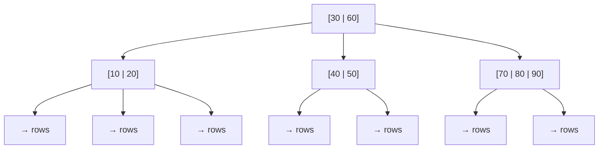
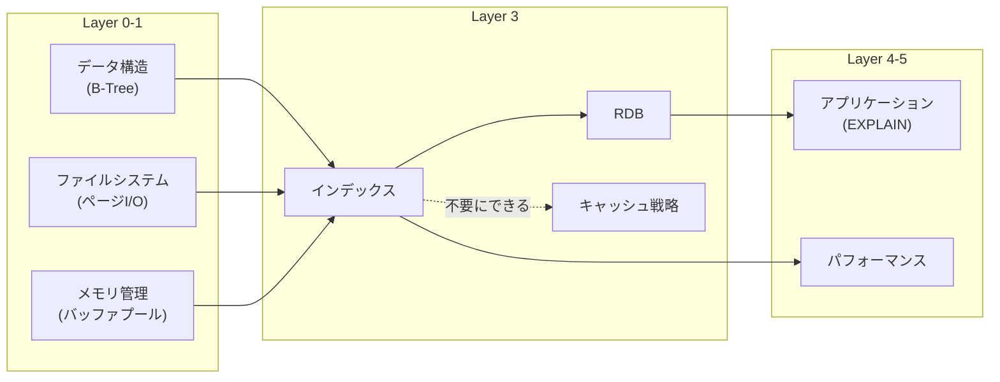

# インデックス（Index）

> **一言で言うと:** テーブルの全件走査を回避し、大量データから高速に目的の行を見つけるための補助データ構造。本の「索引」と同じ発想だが、代償として書き込み性能とストレージを消費する。

## なぜ必要か

100万行のテーブルから1行を探すとき、インデックスがなければデータベースは全行を先頭から順に読む（フルテーブルスキャン）。これは [[計算量-BigO]] で言う O(n) である。

具体的にどれほど差が出るかを考えてみる:

| 行数 | フルスキャン（O(n)） | B+Treeインデックス（ページアクセス数） |
|------|-------------------|--------------------------------------|
| 1,000 | 1,000行を走査 | 約2回のページI/O |
| 100万 | 100万行を走査 | 約3回のページI/O |
| 1億 | 1億行を走査 | 約4回のページI/O |

B+Treeは1ノードに数百のキーを格納できるため、ファンアウト（分岐数）が非常に大きく、1億行でもわずか4回のページアクセスで目的の行に到達できる。[[ファイルシステムとIO]]で学んだ通り、ディスクI/Oは極めて遅い操作であるため、アクセス回数の削減はレスポンスタイムに直結する。

インデックスがなければ:
- **ユーザー体験が崩壊する** — 一覧画面の表示に数十秒かかる
- **DB全体が詰まる** — 遅いクエリがCPUとI/Oを占有し、他の全クエリも遅くなる
- **スケーリングが不可能** — データ量の増加に対して性能が線形に劣化する

## どの問題を解決するか

### 1. 検索の高速化 — B-Tree

[[RDB]]で最も広く使われるインデックス構造が **[[B-TreeとB+Tree|B-Tree]]**（Balanced Tree）である。[[データ構造とアルゴリズム]]で学ぶ二分探索木の発展形で、1ノードに複数のキーを持ち、ディスクI/Oに最適化されている。



**なぜB-Treeがディスクに最適か:**

ディスクは1バイト読むのも4KBのブロック単位で読むのもほぼ同じ時間がかかる。B-Treeは1ノードを1ブロック（ページ）に対応させ、1回のI/Oで数百のキーを読み込む。結果として、ツリーの高さが極めて低く抑えられる（数百万行でも高さ3-4程度）。

**B-Tree vs B+Tree:**

実際のRDB（PostgreSQL, MySQL InnoDB）が使うのは **B+Tree** である。

| 特性 | B-Tree | B+Tree |
|------|--------|--------|
| データの位置 | 全ノードにデータ | リーフノードのみにデータ |
| リーフノード間のリンク | なし | 双方向リンクリスト |
| 範囲検索 | ツリーを都度走査 | リーフノードを横断するだけ |
| ノードあたりのキー数 | 少ない（データが場所を取る） | 多い（ポインタのみ） |

B+Treeがリーフノードを双方向リンクリストで繋いでいるため、`WHERE age BETWEEN 20 AND 30` のような範囲検索が効率的に行える。

### 2. ソートの高速化

`ORDER BY` はインデックスがなければ全件取得後にメモリ上でソートする（filesort）。インデックスがあれば、既にソート済みのデータをリーフノードの順序で読むだけで済む。

```sql
-- インデックスなし: 全件取得 → メモリでソート → 上位10件を返す
-- インデックスあり: B+Treeの末尾から10件をリーフ順に読むだけ
SELECT * FROM orders ORDER BY created_at DESC LIMIT 10;
```

### 3. 一意性の保証

`UNIQUE` インデックスは検索の高速化に加えて、重複値の挿入を防止する。[[RDB]]の `PRIMARY KEY` や `UNIQUE` 制約は内部的にインデックスを作成している。

### 4. インデックスの種類

| 種類 | 用途 | 例 |
|------|------|-----|
| **B-Tree（デフォルト）** | 等値検索、範囲検索、ソート | `WHERE status = 'active'`、`WHERE age > 20` |
| **Hash** | 等値検索のみ（範囲検索不可） | `WHERE email = 'a@b.com'`（PostgreSQLでは明示作成可。MySQLのInnoDBではAdaptive Hash Indexとして内部自動管理） |
| **GIN（Generalized Inverted Index）** | 配列、全文検索、JSONB | `WHERE tags @> '{go}'` |
| **GiST（Generalized Search Tree）** | 地理空間データ、範囲型 | `WHERE location <-> point(35.6, 139.7) < 1000` |

## 他の仕組みとどう関係するか

- **下位レイヤーとの関係:**
  - [[データ構造とアルゴリズム]] — B-Tree / [[ハッシュテーブル]]はデータ構造そのもの。[[計算量-BigO]]の理解がインデックスの性能評価に直結する
  - [[ファイルシステムとIO]] — インデックスはディスク上のページ（通常8KB）単位で読み書きされる。ランダムI/O vs シーケンシャルI/Oの違いがインデックス設計に影響する
  - [[メモリ管理]] — 頻繁にアクセスされるインデックスページはバッファプールにキャッシュされる。インデックスサイズがメモリに収まるかどうかが性能を大きく左右する

- **同レイヤーとの関係:**
  - [[RDB]] — インデックスは[[RDB]]のクエリ性能を決定づける最も重要な仕組み。正規化で分割されたテーブルのJOINにも不可欠
  - [[NoSQL]] — DynamoDBのパーティションキー/ソートキーやMongoDBのインデックスも、本質的には同じB-Treeベースの考え方
  - [[キャッシュ戦略]] — インデックスで十分に高速な場合、アプリケーション層のキャッシュが不要になることもある
  - [[マイグレーション]] — インデックスの追加・削除は[[マイグレーション]]で管理する。大きなテーブルへのインデックス追加は長時間ロックを取る可能性がある

- **上位レイヤーとの関係:**
  - [[Layer4-アプリケーション/_index|Layer 4: アプリケーション]] — ORMが生成するクエリがインデックスを使えているかは `EXPLAIN` で確認する
  - [[Layer5-パフォーマンス/_index|Layer 5: パフォーマンス・信頼性]] — データベースのパフォーマンスチューニングの中核がインデックス設計



## 誤解されやすいポイント

### 1. 「インデックスを貼れば貼るほど速くなる」

インデックスは **読み取りを速くする代わりに書き込みを遅くする** トレードオフの仕組みである。INSERT / UPDATE / DELETE のたびに、テーブル本体に加えて全関連インデックスも更新する必要がある。

```
INSERT 1行 → テーブルに書き込み + インデックスA更新 + インデックスB更新 + インデックスC更新...
```

書き込みが多いテーブルにインデックスを10個も20個も作ると、INSERT性能が著しく劣化する。インデックスは「実際に発行されるクエリ」に基づいて必要最小限にする。

### 2. 「WHERE句にカラムがあれば自動的にインデックスが使われる」

以下のケースではインデックスが使われない（または非効率になる）:

```sql
-- ❌ カラムに関数を適用 → インデックスが効かない
SELECT * FROM users WHERE LOWER(email) = 'test@example.com';
-- ✅ 式インデックスを作るか、アプリ側で正規化して格納
CREATE INDEX idx_users_email_lower ON users (LOWER(email));

-- ❌ LIKE の前方一致以外 → B-Treeが使えない
SELECT * FROM users WHERE name LIKE '%田中%';
-- ✅ 前方一致ならB-Treeが使える
SELECT * FROM users WHERE name LIKE '田中%';

-- ❌ OR条件 → 各条件のインデックスが統合されにくい
SELECT * FROM users WHERE status = 'active' OR age > 30;

-- ❌ 型の不一致 → 暗黙の型変換でインデックスが効かない
SELECT * FROM users WHERE phone = 12345678; -- phone が VARCHAR の場合
```

### 3. 「主キーにインデックスを作る必要がある」

`PRIMARY KEY` 制約を設定すると、データベースが自動的にインデックスを作成する。手動で重複して作成するのは無駄である。同様に `UNIQUE` 制約も自動的にインデックスを作成する。

### 4. 「複合インデックスのカラム順序は関係ない」

複合インデックス（Composite Index）はカラムの順序が検索性能に直結する。B-Treeはインデックスの **左端のカラムからしか使えない**（最左プレフィックスルール）。

```sql
-- インデックス: (status, created_at)
CREATE INDEX idx_orders_status_created ON orders (status, created_at);

-- ✅ status だけの検索 → インデックスが使える
SELECT * FROM orders WHERE status = 'shipped';

-- ✅ status + created_at → インデックスが使える
SELECT * FROM orders WHERE status = 'shipped' AND created_at > '2026-01-01';

-- ❌ created_at だけの検索 → このインデックスは使えない
SELECT * FROM orders WHERE created_at > '2026-01-01';
```

### 5. 「カーディナリティが低いカラムにインデックスを貼っても意味がない」

boolean型のように値が2種類しかないカラムでもインデックスが有効なケースがある。全体の1%しかない `published = TRUE` を取得する場合、フルスキャンよりインデックススキャンの方が圧倒的に速い。こうした場面では **部分インデックス（Partial Index）** が特に有効。

```sql
-- 全行にインデックスを貼るのではなく、必要な条件だけ
CREATE INDEX idx_posts_published ON posts (created_at) WHERE published = TRUE;
```

## 設計のベストプラクティス

### 推奨パターン

1. **クエリ駆動で設計する**（[[インデックス設計の判断基準]]も参照）
   - テーブル設計時に「どんなクエリが来るか」を先に考え、そのクエリに対してインデックスを設計する
   - スロークエリログを有効にし、実際に遅いクエリを計測してからインデックスを追加する

2. **EXPLAIN を習慣にする**
   - 新しいクエリを書いたら必ず `EXPLAIN ANALYZE` でクエリプランを確認する
   - `Seq Scan`（全件走査）が大きなテーブルに出ていたら要注意

3. **複合インデックスの順序を最適化する**
   - 等値条件（`=`）のカラムを左に、範囲条件（`>`, `<`, `BETWEEN`）のカラムを右に配置する
   - `ORDER BY` で使うカラムも考慮する

4. **カバリングインデックス（Covering Index）を活用する**
   - クエリが必要とする全カラムがインデックスに含まれていれば、テーブル本体へのアクセスが不要になる（Index Only Scan）

```sql
-- posts から user_id と created_at だけ取得するクエリが頻出する場合
CREATE INDEX idx_posts_covering ON posts (user_id, created_at);

-- このクエリはテーブル本体を読まずにインデックスだけで完結する
SELECT user_id, created_at FROM posts WHERE user_id = 1 ORDER BY created_at DESC;
```

5. **部分インデックス（Partial Index）で無駄を削減する**
   - 全行ではなく条件を満たす行だけにインデックスを作る
   - インデックスサイズが小さくなり、書き込みコストも削減される

```sql
-- 未処理の注文だけにインデックス（大部分が処理済みならサイズが劇的に小さい）
CREATE INDEX idx_orders_pending ON orders (created_at) WHERE status = 'pending';
```

### アンチパターン

1. **「念のため」インデックス** — 使われないインデックスは書き込みコストとストレージを浪費するだけ。`pg_stat_user_indexes` で使用状況を監視する
2. **重複インデックス** — `(a)` と `(a, b)` の両方が存在する場合、`(a)` は不要（`(a, b)` が `(a)` の検索もカバーする）
3. **大規模テーブルへのインデックス追加を無計画に実行** — 通常の `CREATE INDEX` はテーブルロックを取る。PostgreSQLでは `CREATE INDEX CONCURRENTLY` を使う

## AIによる実装のアンチパターン

| アンチパターン | なぜ問題か | 対策 |
|---|---|---|
| 全カラムに個別インデックスを作成 | 書き込み性能が劣化し、DBが自動選択に迷う | 実際のクエリパターンを分析し、複合インデックスで集約する |
| マイグレーションで `CREATE INDEX` を無条件に使用 | 本番環境で長時間テーブルロックが発生する | PostgreSQLでは `CREATE INDEX CONCURRENTLY`、MySQLでは `ALGORITHM=INPLACE, LOCK=NONE` を使う |
| 全てのJOINカラムにインデックスを付与 | 小さなテーブル同士のJOINではオーバーヘッドの方が大きい | テーブルサイズとクエリ頻度を考慮して判断する |
| `SELECT *` でカバリングインデックスを無効化 | Index Only Scan が使えず、必ずテーブル本体にアクセスする | 必要なカラムだけを指定する |

## 具体例

### インデックス設計の実践（PostgreSQL）

```sql
-- サンプルテーブル
CREATE TABLE orders (
    id BIGINT GENERATED ALWAYS AS IDENTITY PRIMARY KEY,
    user_id BIGINT NOT NULL REFERENCES users(id),
    status VARCHAR(20) NOT NULL DEFAULT 'pending',
    total_amount DECIMAL(10,2) NOT NULL,
    created_at TIMESTAMPTZ NOT NULL DEFAULT NOW()
);

-- 1. 外部キーには必ずインデックス（JOINとカスケード削除の性能に影響）
CREATE INDEX idx_orders_user_id ON orders (user_id);

-- 2. 複合インデックス: ステータス別の最新注文を取得するクエリ用
--    等値条件(status)を左、範囲条件(created_at)を右に配置
CREATE INDEX idx_orders_status_created ON orders (status, created_at DESC);

-- このクエリに最適:
-- SELECT * FROM orders WHERE status = 'shipped' ORDER BY created_at DESC LIMIT 20;

-- 3. 部分インデックス: 未処理注文だけ（全体の5%程度を想定）
CREATE INDEX idx_orders_pending ON orders (created_at)
    WHERE status = 'pending';

-- このクエリに最適:
-- SELECT * FROM orders WHERE status = 'pending' ORDER BY created_at;
```

### EXPLAIN ANALYZE の読み方

```sql
EXPLAIN ANALYZE
SELECT * FROM orders
WHERE status = 'shipped' AND created_at > '2026-01-01'
ORDER BY created_at DESC
LIMIT 20;
```

```
-- 出力例（インデックスが効いている場合）:
Limit  (cost=0.42..1.23 rows=20 width=48) (actual time=0.032..0.045 rows=20 loops=1)
  ->  Index Scan Backward using idx_orders_status_created on orders
        (cost=0.42..4521.33 rows=112000 width=48) (actual time=0.031..0.042 rows=20 loops=1)
        Index Cond: ((status = 'shipped') AND (created_at > '2026-01-01'))
Planning Time: 0.152 ms
Execution Time: 0.061 ms
```

読むべきポイント:

| 項目 | 意味 | 注目すべき値 |
|------|------|-------------|
| `Index Scan` / `Index Only Scan` | インデックスを使っている | 良好 |
| `Seq Scan` | 全件走査 | 大きなテーブルなら要改善 |
| `actual time` | 実際の実行時間（ms） | 目標レスポンスタイムと比較 |
| `rows` | 実際に処理された行数 | 見積もり(`cost`の`rows`)と大きく乖離していないか |
| `Bitmap Index Scan` | インデックスでビットマップを作り、テーブルをまとめて読む | 中間的な効率 |

### 未使用インデックスの検出（PostgreSQL）

```sql
-- 使われていないインデックスを検出する
SELECT
    schemaname,
    tablename,
    indexname,
    idx_scan AS times_used,
    pg_size_pretty(pg_relation_size(indexrelid)) AS index_size
FROM pg_stat_user_indexes
WHERE idx_scan = 0          -- 一度も使われていない
  AND indexrelname NOT LIKE '%_pkey'  -- 主キーは除外
  AND indexrelname NOT LIKE '%_unique%'  -- UNIQUE制約は除外
ORDER BY pg_relation_size(indexrelid) DESC;
```

### アプリケーションコードからの確認（TypeScript）

```typescript
// 開発環境でスロークエリを検出するミドルウェア例
import { Pool, type QueryResult } from "pg";

const pool = new Pool({ connectionString: process.env.DATABASE_URL });

async function queryWithExplain<T>(
  sql: string,
  params: unknown[] = []
): Promise<QueryResult<T>> {
  // 開発環境でのみ EXPLAIN ANALYZE を実行
  if (process.env.NODE_ENV === "development") {
    const explained = await pool.query(`EXPLAIN ANALYZE ${sql}`, params);
    const plan = explained.rows.map((r) => Object.values(r)[0]).join("\n");

    // Seq Scan が大きなテーブルに対して出ていたら警告
    if (plan.includes("Seq Scan") && !plan.includes("rows=0")) {
      console.warn(`[SLOW QUERY WARNING] Seq Scan detected:\n${sql}\n${plan}`);
    }
  }

  return pool.query<T>(sql, params);
}

// 使用例
const result = await queryWithExplain(
  "SELECT * FROM orders WHERE status = $1 ORDER BY created_at DESC LIMIT $2",
  ["shipped", 20]
);
```

### Go — クエリ実行とインデックスの確認

```go
package main

import (
	"context"
	"database/sql"
	"fmt"
	"log"
	"strings"

	_ "github.com/lib/pq"
)

func main() {
	db, err := sql.Open("postgres", "postgres://localhost/mydb?sslmode=disable")
	if err != nil {
		log.Fatal(err)
	}
	defer db.Close()

	// インデックスが効くクエリ
	rows, err := db.QueryContext(context.Background(),
		`SELECT id, total_amount, created_at
		 FROM orders
		 WHERE status = $1 AND created_at > $2
		 ORDER BY created_at DESC
		 LIMIT $3`,
		"shipped", "2026-01-01", 20,
	)
	if err != nil {
		log.Fatal(err)
	}
	defer rows.Close()

	for rows.Next() {
		var id int64
		var amount float64
		var createdAt string
		if err := rows.Scan(&id, &amount, &createdAt); err != nil {
			log.Fatal(err)
		}
		fmt.Printf("Order %d: ¥%.0f (%s)\n", id, amount, createdAt)
	}

	// 開発時: EXPLAIN で確認
	explainQuery := `EXPLAIN ANALYZE
		SELECT id, total_amount, created_at
		FROM orders
		WHERE status = $1 AND created_at > $2
		ORDER BY created_at DESC
		LIMIT $3`

	explainRows, err := db.QueryContext(context.Background(),
		explainQuery, "shipped", "2026-01-01", 20,
	)
	if err != nil {
		log.Fatal(err)
	}
	defer explainRows.Close()

	fmt.Println("\n--- Query Plan ---")
	for explainRows.Next() {
		var line string
		if err := explainRows.Scan(&line); err != nil {
			log.Fatal(err)
		}
		fmt.Println(line)
		if strings.Contains(line, "Seq Scan") {
			fmt.Println("⚠ WARNING: Sequential scan detected!")
		}
	}
}
```

## 参考リソース

- **記事**: [Use The Index, Luke](https://use-the-index-luke.com/) — SQLインデックスに特化した無料の解説サイト（最もおすすめ）
- **書籍**: 『達人に学ぶDB設計 徹底指南書』（ミック著） — インデックス設計の実践を含むDB設計の包括的ガイド
- **書籍**: 『SQLパフォーマンス詳解』（Markus Winand著） — Use The Index, Luke の書籍版、B-Treeの内部構造から解説
- **公式ドキュメント**: [PostgreSQL - Indexes](https://www.postgresql.org/docs/current/indexes.html) — 各インデックス種別の詳細
- **公式ドキュメント**: [MySQL - Optimization and Indexes](https://dev.mysql.com/doc/refman/8.4/en/optimization-indexes.html) — MySQL固有のインデックス最適化

## 学習メモ

- [[データ構造とアルゴリズム]]のB-Treeと[[ハッシュテーブル]]を先に理解すると、インデックスの「なぜ」が腑に落ちる
- [[ファイルシステムとIO]]のページ単位I/Oの知識が、B-Treeのノードサイズが重要な理由を説明する
- [[RDB]]のEXPLAIN出力を読む習慣をつけるのが、インデックス設計の最短経路
- [[サロゲートキーと自然キー]]でUUID v4がインデックス性能に悪影響を与える理由も、B-Treeの構造から理解できる
