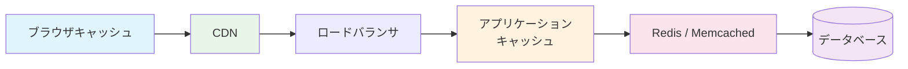
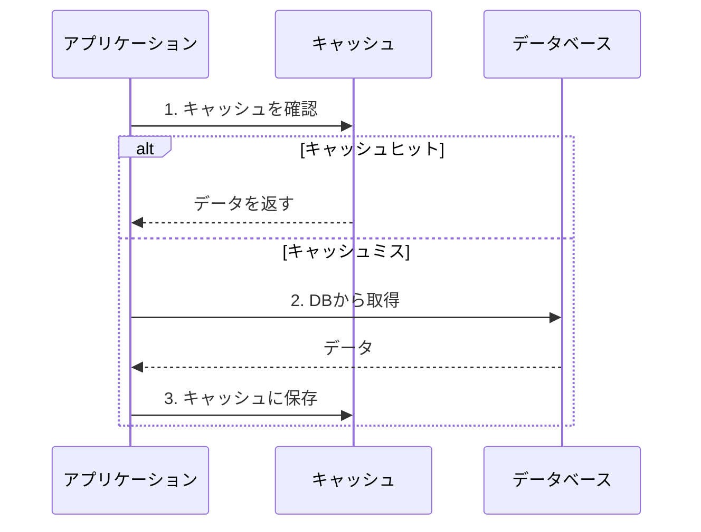
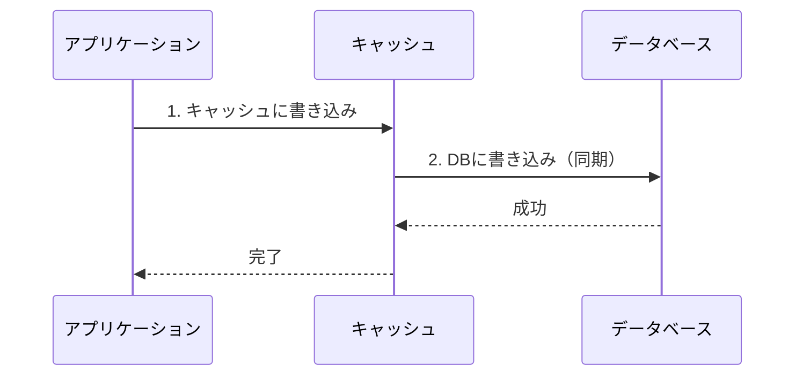
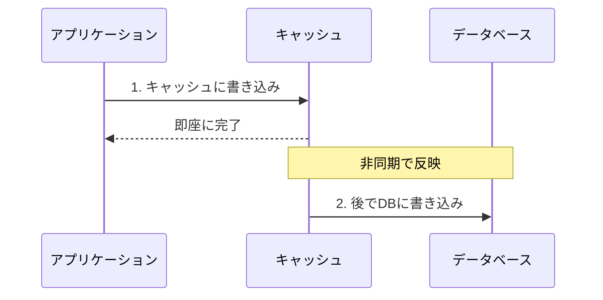

# キャッシュ戦略

> **一言で言うと:** 「同じ計算を二度しない」という原則をシステム設計に適用し、高頻度なデータアクセスを高速化する仕組み。ただしキャッシュの無効化はCS最難問の一つ。

## なぜ必要か

Webアプリケーションのレスポンス時間の大部分は、データの取得に費やされる。以下のような状況を考えてみる:

- **同じクエリの繰り返し**: ECサイトのトップページにある「人気商品ランキング」を、毎秒1000リクエスト分すべてDBに問い合わせると、DBが応答しきれなくなる
- **計算コストの高い処理**: ユーザーのレコメンデーションを生成するのに500msかかる処理を、アクセスのたびに実行するのは無駄
- **外部API呼び出し**: 為替レートや天気情報などを外部APIから取得するたびにネットワーク遅延が発生し、APIのレートリミットにも引っかかる

キャッシュがなければ、すべてのリクエストが毎回「最も遅い経路」を通ることになる。[[ファイルシステムとIO]]で学ぶように、ディスクI/Oはメモリアクセスの約10万倍遅い。この速度差を埋めるのがキャッシュの役割である。

```
メモリアクセス:     ~100ns
SSD読み取り:       ~100μs（1,000倍遅い）
HDD読み取り:       ~10ms（100,000倍遅い）
ネットワーク往復:   ~1ms〜100ms
```

## どの問題を解決するか

### 1. キャッシュの階層構造

Webシステムには複数のキャッシュ層が存在し、それぞれ異なるレベルの問題を解決する:



| キャッシュ層 | 場所 | TTLの目安 | ユースケース |
|------------|------|----------|-------------|
| ブラウザキャッシュ | クライアント | 分〜日 | 静的アセット（JS, CSS, 画像） |
| CDNキャッシュ | エッジサーバー | 分〜時間 | 静的コンテンツ、API応答 |
| アプリケーションキャッシュ | サーバーメモリ | 秒〜分 | 計算結果、設定値 |
| 分散キャッシュ | Redis等 | 秒〜時間 | セッション、DB結果、レートリミット |
| DBキャッシュ | DBエンジン内部 | 自動管理 | クエリ結果、バッファプール |

### 2. キャッシュ戦略のパターン

データの読み書きの特性に応じて、最適な戦略が異なる。

#### Cache-Aside（Lazy Loading）

最も一般的なパターン。アプリケーションがキャッシュとDBの両方を直接管理する。



- **メリット**: キャッシュ障害時もDBから直接読める。実際に必要なデータだけキャッシュされる
- **デメリット**: 初回アクセスは必ずキャッシュミス。キャッシュとDBの不整合が起きうる

#### Write-Through

書き込み時にキャッシュとDBの両方を同期的に更新する。[[ライトバックとライトスルー]]で解説されるCPUキャッシュの仕組みと同じ原理。



- **メリット**: キャッシュとDBが常に一致。読み取りは常にキャッシュから返せる
- **デメリット**: 書き込みレイテンシが増加（キャッシュ + DB の両方を待つ）。読まれないデータもキャッシュされる

#### Write-Behind（Write-Back）

書き込みをキャッシュにのみ行い、DBへの反映は非同期で後から行う。



- **メリット**: 書き込みが高速。バッチ処理でDB負荷を軽減できる
- **デメリット**: キャッシュ障害時にデータが失われるリスク。実装が複雑

#### 戦略の使い分け

| 戦略 | 読み取り頻度 | 書き込み頻度 | 整合性要件 | 代表的なユースケース |
|------|------------|------------|-----------|-------------------|
| Cache-Aside | 高 | 低〜中 | 結果整合性でOK | 商品情報、ユーザープロファイル |
| Write-Through | 高 | 低 | 強い整合性 | 在庫数、アカウント残高 |
| Write-Behind | 中 | 高 | 結果整合性でOK | ページビューカウンター、ログ集約 |

### 3. キャッシュの無効化（Cache Invalidation）

Phil Karltonの有名な言葉:

> *"There are only two hard things in Computer Science: cache invalidation and naming things."*

キャッシュの無効化が難しい理由は、「いつ・どのキャッシュが古くなったか」をシステム全体で正確に判断する方法がないからである。

#### TTL（Time To Live）

最もシンプルな無効化手法。一定時間が経過したら自動的に期限切れにする。

- TTLが短すぎる → キャッシュヒット率が下がり効果が薄い
- TTLが長すぎる → 古いデータが長時間表示される

#### イベント駆動の無効化

データが変更されたタイミングで明示的にキャッシュを削除する:

```
データ更新 → キャッシュキーを削除 → 次の読み取りでDBから再取得
```

TTLより正確だが、すべての更新パスでキャッシュ削除を漏れなく実行する必要がある。

#### バージョニング

キャッシュキーにバージョンを含め、データ更新時にバージョンを上げる。古いキャッシュは自然に参照されなくなる:

```
product:v3:123 → product:v4:123
```

## 他の仕組みとどう関係するか

- **下位レイヤーとの関係:**
  - [[ファイルシステムとIO]]: キャッシュの根本的な存在意義は「ディスクI/Oとメモリアクセスの速度差」にある。OSのページキャッシュもこの原理で動作する
  - [[メモリ管理]]: インメモリキャッシュはヒープ領域を消費する。キャッシュサイズの制御を怠るとメモリリークと同様の症状を引き起こす

- **同レイヤーとの関係:**
  - [[RDB]]: DBのクエリキャッシュ（MySQLのQuery Cache等）やバッファプール（PostgreSQLのshared_buffers）はDB内部のキャッシュ機構
  - [[Resources/Study/Layer3-データ永続化/インデックス|インデックス]]: インデックスは「検索を速くする」、キャッシュは「同じ検索を繰り返さない」。両方が揃って初めてデータアクセスが高速化される
  - [[NoSQL]]: Redisはキャッシュストアとして最も広く使われるNoSQLの一つ。[[MemcachedとRedis|MemcachedとRedisの使い分け]]も重要な設計判断

- **上位レイヤーとの関係:**
  - [[Layer4-アプリケーション/_index|Layer 4: アプリケーション]]: HTTPキャッシュヘッダ（`Cache-Control`, `ETag`, `Last-Modified`）はブラウザとCDNのキャッシュ動作を制御する
  - [[Layer5-パフォーマンス/_index|Layer 5: パフォーマンス]]: キャッシュはパフォーマンス最適化の最も効果的な手段の一つ。CDN、ブラウザキャッシュ、サーバーサイドキャッシュの組み合わせが総合的なレスポンス時間を決定する

## 誤解されやすいポイント

### 1.「キャッシュを入れれば速くなる」は短絡的

キャッシュはヒット率が高くなければ効果がない。ユーザーIDごとに異なるデータを返すAPIにキャッシュを追加しても、キーの種類が膨大でヒット率が極めて低くなる。キャッシュ導入前に「このデータは繰り返しアクセスされるか？」を検証することが重要。

### 2. キャッシュは「速度」だけでなく「保護」でもある

キャッシュの役割はレスポンス高速化だけではない。**DBやバックエンドサービスへの負荷を遮断する盾**でもある。キャッシュがなければ、トラフィックスパイク時にDBが過負荷でダウンする。これを **Thundering Herd問題**（キャッシュ期限切れの瞬間に大量のリクエストがDBに殺到する現象）の文脈で理解しておく必要がある。

### 3.「TTLを短くすれば安全」ではない

TTLを短くすることでデータの鮮度は上がるが、短すぎるとキャッシュの意味がなくなる。さらに、TTLが同時に切れるキーが多い場合、Thundering Herd問題を引き起こす。**TTLにジッター（ランダムなばらつき）を加える**ことで、期限切れのタイミングを分散させるのが定石。

### 4. ローカルキャッシュと分散キャッシュの混同

アプリケーションサーバーのインメモリキャッシュ（ローカルキャッシュ）は高速だが、複数サーバー間で共有されない。サーバーAでキャッシュを更新しても、サーバーBには古いデータが残る。Redis等の分散キャッシュはこの問題を解決するが、ネットワーク通信のオーバーヘッドが加わる。

## 設計のベストプラクティス

### キャッシュキーの設計

キャッシュキーはデータを一意に識別できなければならない。パラメータの漏れがあると、異なるユーザーに別のユーザーのデータを返すバグにつながる:

```
❌ product:123             （ロケールや通貨が反映されない）
✅ product:123:ja:JPY      （ロケールと通貨を含む）
✅ user:456:orders:page:2   （ページネーション情報を含む）
```

### Thundering Herd対策

キャッシュの期限切れ時に大量のリクエストがDBに殺到するのを防ぐ方法:

1. **ロック（Mutex）**: 1つのリクエストだけがDBに問い合わせ、他は待機
2. **Stale-While-Revalidate**: 古いキャッシュを返しつつ、バックグラウンドで更新
3. **TTLジッター**: `TTL = base_ttl + random(0, jitter)` で期限切れを分散

### キャッシュウォームアップ

デプロイ直後やキャッシュサーバー再起動後は、キャッシュが空のため大量のキャッシュミスが発生する（**コールドスタート問題**）。事前に頻出データをキャッシュに投入しておく:

```
デプロイ → キャッシュウォームアップスクリプト実行 → トラフィック受け入れ開始
```

### アンチパターン

| アンチパターン | なぜ問題か | 対策 |
|---|---|---|
| キャッシュなしでスケーリング | サーバーを増やしてもDB負荷は変わらず、DBがボトルネックになる | 読み取り頻度の高いデータからキャッシュを導入する |
| キャッシュの二重管理 | 同じデータを複数箇所でキャッシュし、無効化の漏れで不整合が発生 | キャッシュ層を一元管理し、責務を明確にする |
| 巨大なオブジェクトをそのままキャッシュ | メモリを圧迫し、シリアライズ/デシリアライズのコストも大きい | 必要なフィールドだけを抽出してキャッシュする |
| キャッシュに依存した可用性 | キャッシュ障害でシステム全体がダウンする | Cache-Aside + フォールバックでDB直接読み取りを維持 |

## AIによる実装のアンチパターン

| アンチパターン | なぜ問題か | 対策 |
|---|---|---|
| すべてのエンドポイントにキャッシュを追加 | ヒット率が低いエンドポイントではオーバーヘッドが増えるだけ | アクセスパターンを分析し、効果の高い箇所に限定する |
| TTLを固定値でハードコード | 環境やデータ特性に応じた調整ができない | 設定ファイルや環境変数で管理し、データ種別ごとにTTLを設定する |
| キャッシュミス時のエラーハンドリング過剰 | キャッシュミスは正常な動作であり、エラーログやリトライは不要 | ミスは通常フローとして処理し、DB取得 → キャッシュ保存のパスを実装 |
| Redis接続を毎リクエストで作成 | コネクション確立のオーバーヘッドが毎回発生しキャッシュの意味がなくなる | コネクションプールを使い、接続を再利用する |

## 具体例

### Cache-Aside パターンの実装（Python + Redis）

```python
import redis
import json
import random

r = redis.Redis(host='localhost', port=6379, decode_responses=True)

BASE_TTL = 300  # 5分
JITTER = 60     # ±60秒のジッター

def get_product(product_id: str) -> dict:
    cache_key = f"product:{product_id}"

    # 1. キャッシュを確認
    cached = r.get(cache_key)
    if cached:
        return json.loads(cached)

    # 2. キャッシュミス → DBから取得
    product = fetch_from_db(product_id)

    # 3. TTLにジッターを加えてキャッシュに保存
    ttl = BASE_TTL + random.randint(-JITTER, JITTER)
    r.setex(cache_key, ttl, json.dumps(product))

    return product

def update_product(product_id: str, data: dict) -> None:
    # DBを更新
    save_to_db(product_id, data)
    # キャッシュを削除（次の読み取りで再取得される）
    r.delete(f"product:{product_id}")
```

### Thundering Herd対策 — ロックによる排他制御

```python
import time

def get_product_with_lock(product_id: str) -> dict:
    cache_key = f"product:{product_id}"
    lock_key = f"lock:{cache_key}"

    cached = r.get(cache_key)
    if cached:
        return json.loads(cached)

    # ロックを取得（NX=存在しない場合のみ、EX=5秒で自動解放）
    acquired = r.set(lock_key, "1", nx=True, ex=5)

    if acquired:
        try:
            # ロック取得者がDBから取得してキャッシュに保存
            product = fetch_from_db(product_id)
            r.setex(cache_key, BASE_TTL, json.dumps(product))
            return product
        finally:
            r.delete(lock_key)
    else:
        # ロック取得できなかった場合は短時間待って再試行
        time.sleep(0.05)
        cached = r.get(cache_key)
        if cached:
            return json.loads(cached)
        # フォールバック: DBから直接取得
        return fetch_from_db(product_id)
```

### HTTPキャッシュヘッダの設定（Node.js / Express）

```javascript
const express = require('express');
const app = express();

// 静的アセット — 長期キャッシュ + イミュータブル
app.use('/static', express.static('public', {
  maxAge: '1y',
  immutable: true,
}));

// API応答 — 短期キャッシュ + Stale-While-Revalidate
app.get('/api/products/:id', (req, res) => {
  const product = getProduct(req.params.id);

  res.set('Cache-Control', 'public, max-age=60, stale-while-revalidate=300');
  res.set('ETag', `"${product.version}"`);

  res.json(product);
});

// ユーザー固有データ — キャッシュ禁止
app.get('/api/me', (req, res) => {
  res.set('Cache-Control', 'private, no-store');
  res.json(getCurrentUser(req));
});
```

### デコレーターによるキャッシュの透過的適用（Python）

```python
import functools
import hashlib

def cached(ttl: int = 300):
    """関数の結果をRedisにキャッシュするデコレーター"""
    def decorator(func):
        @functools.wraps(func)
        def wrapper(*args, **kwargs):
            # 引数からキャッシュキーを生成
            key_source = f"{func.__name__}:{args}:{sorted(kwargs.items())}"
            cache_key = f"fn:{hashlib.md5(key_source.encode()).hexdigest()}"

            cached_result = r.get(cache_key)
            if cached_result:
                return json.loads(cached_result)

            result = func(*args, **kwargs)
            r.setex(cache_key, ttl, json.dumps(result))
            return result
        return wrapper
    return decorator

@cached(ttl=600)
def get_ranking(category: str, limit: int = 10) -> list:
    """重い集計クエリの結果をキャッシュ"""
    return db.execute(
        "SELECT * FROM products WHERE category = %s ORDER BY sales DESC LIMIT %s",
        (category, limit)
    )
```

### Cache-Aside パターンの実装（Go + Redis）

```go
package main

import (
	"context"
	"encoding/json"
	"fmt"
	"log"
	"math/rand/v2"
	"time"

	"github.com/redis/go-redis/v9"
)

var (
	rdb     *redis.Client
	baseTTL = 5 * time.Minute
	jitter  = 60 // 秒
)

type Product struct {
	ID    string `json:"id"`
	Name  string `json:"name"`
	Price int    `json:"price"`
}

func getProduct(ctx context.Context, productID string) (*Product, error) {
	cacheKey := fmt.Sprintf("product:%s", productID)

	// 1. キャッシュを確認
	cached, err := rdb.Get(ctx, cacheKey).Result()
	if err == nil {
		var p Product
		json.Unmarshal([]byte(cached), &p)
		return &p, nil
	}

	// 2. キャッシュミス → DBから取得
	product := fetchFromDB(productID)

	// 3. TTLにジッターを加えてキャッシュに保存
	ttl := baseTTL + time.Duration(rand.IntN(jitter*2)-jitter)*time.Second
	data, _ := json.Marshal(product)
	rdb.Set(ctx, cacheKey, data, ttl)

	return product, nil
}

func updateProduct(ctx context.Context, productID string, product *Product) {
	saveToDB(productID, product)
	// キャッシュを削除（次の読み取りで再取得される）
	rdb.Del(ctx, fmt.Sprintf("product:%s", productID))
}

// fetchFromDB / saveToDB は実際のDB操作に置き換える
func fetchFromDB(id string) *Product { return &Product{ID: id, Name: "Sample", Price: 1000} }
func saveToDB(id string, p *Product)  {}

func main() {
	rdb = redis.NewClient(&redis.Options{Addr: "localhost:6379"})
	defer rdb.Close()

	ctx := context.Background()
	p, err := getProduct(ctx, "123")
	if err != nil {
		log.Fatal(err)
	}
	fmt.Printf("Product: %s (¥%d)\n", p.Name, p.Price)
}
```

## 参考リソース

- Martin Kleppmann 著『Designing Data-Intensive Applications』第5章 — レプリケーションとキャッシュの整合性
- Alex Xu 著『System Design Interview』第6章 — 分散キャッシュ設計の実践パターン
- [Redis Documentation — Caching Patterns](https://redis.io/docs/manual/patterns/) — Redis公式のキャッシュパターン解説
- [MDN — HTTP Caching](https://developer.mozilla.org/en-US/docs/Web/HTTP/Caching) — HTTPキャッシュの仕様解説

## 学習メモ

（個人的な気づき・疑問・TODO）
