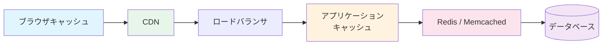
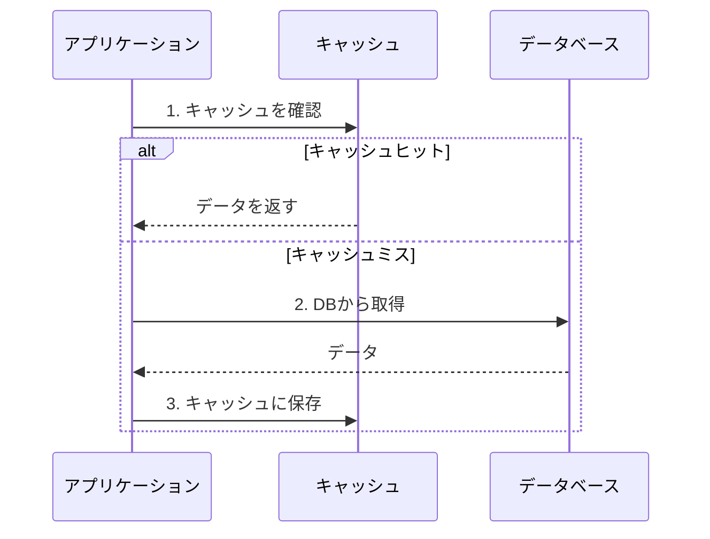
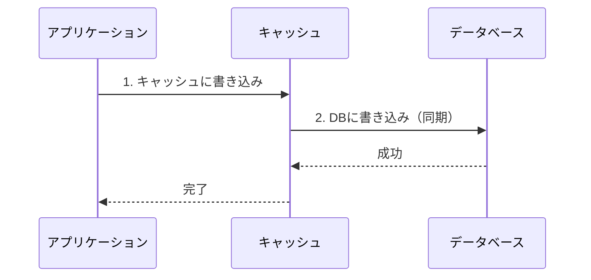
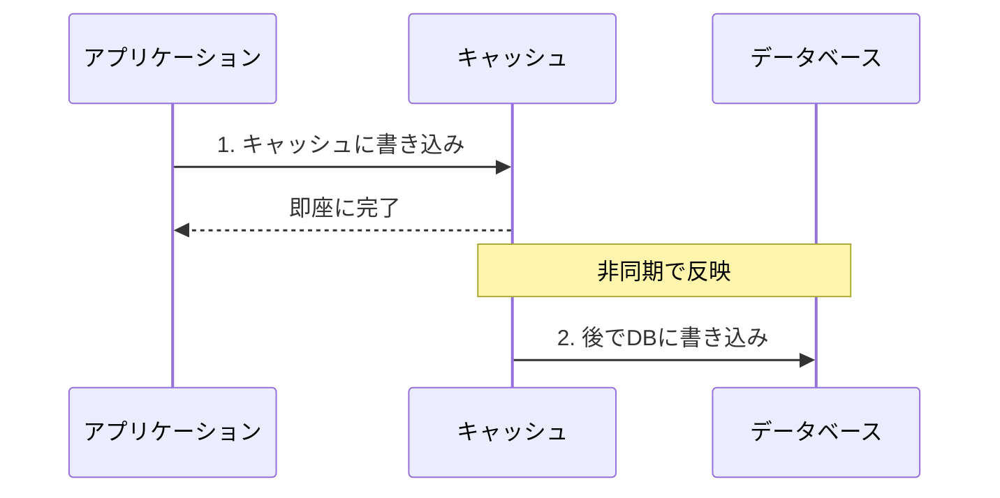

# キャッシュ戦略

> **一言で言うと:** 「同じ計算を二度しない」という原則をシステム設計に適用し、高頻度なデータアクセスを高速化する仕組み。ただしキャッシュの無効化はCS最難問の一つ。

## 3分で全体像

- **何を解決する技術か:** ディスク I/O・ネットワーク・重い計算など「最も遅い経路」を毎回通らないように、結果をメモリ等の速い層に保持して再利用する。レスポンス高速化と同時に、バックエンド負荷の遮断（DBダウン防止）も担う
- **代表的な使用シーン:** ECサイトの人気商品ランキング、ユーザーレコメンデーション、外部 API 結果（為替・天気）、セッション、レートリミット、HTTP レスポンス（ブラウザ・CDN）、DB クエリ結果
- **これだけは覚える3つ:**
    1. **キャッシュは「速度」だけでなく「保護（盾）」でもある** — トラフィックスパイク時に DB を守る役割。キャッシュなしでスケールアウトしても DB がボトルネックのままで意味がない
    2. **キャッシュ無効化は CS 最難問** — TTL・イベント駆動・バージョニングの3手法を使い分ける。「TTLを短くすれば安全」は誤り（Thundering Herd で逆に DB を破壊する）
    3. **キャッシュキーに「変動軸」を全て含める** — ユーザー ID・ロケール・通貨・ページネーション。漏れると「他人のデータを表示する」セキュリティ事故になる
- **AIに任せやすいか:** **一部任せられる** — Cache-Aside の実装・Redis 操作・HTTP `Cache-Control` ヘッダ生成は AI が高品質に書ける。ただし「TTL の値選定」「無効化のタイミング」「Thundering Herd 対策」「キャッシュキー設計」は実トラフィック・データ特性・整合性要件に依存し、人間判断が要る。AI に任せると **「全エンドポイントにキャッシュ追加」「TTLハードコード」** などのアンチパターンを出しやすい
- **詰まったらここを読む:** [[NoSQL]] / [[RDB]] / [[ファイルシステムとIO]]

## なぜ必要か

Webアプリケーションのレスポンス時間の大部分は、データの取得に費やされる。以下のような状況を考えてみる:

- **同じクエリの繰り返し**: ECサイトのトップページにある「人気商品ランキング」を、毎秒1000リクエスト分すべてDBに問い合わせると、DBが応答しきれなくなる
- **計算コストの高い処理**: ユーザーのレコメンデーションを生成するのに500msかかる処理を、アクセスのたびに実行するのは無駄
- **外部API呼び出し**: 為替レートや天気情報などを外部APIから取得するたびにネットワーク遅延が発生し、APIのレートリミットにも引っかかる

キャッシュがなければ、すべてのリクエストが毎回「最も遅い経路」を通ることになる。[[ファイルシステムとIO]]で学ぶように、ディスクI/Oはメモリアクセスの約10万倍遅い。この速度差を埋めるのがキャッシュの役割である。

```
メモリアクセス:     ~100ns
SSD読み取り:       ~100μs (SATA SSD 目安。NVMe では ~10〜50μs まで短縮)
HDD読み取り:       ~10ms（メモリの約100,000倍遅い）
ネットワーク往復:   ~0.5ms（同一DC）〜100ms（地域間）
```

> 数値は古典的な目安（"Latency Numbers Every Programmer Should Know" 系）。世代差・ワークロードで変動するが、「**メモリ → SSD で約3桁、SSD → ネットワーク往復でさらに1〜3桁**」の相対関係はほぼ普遍。

## どの問題を解決するか

### 1. キャッシュの階層構造

Webシステムには複数のキャッシュ層が存在し、それぞれ異なるレベルの問題を解決する:


```mermaid
graph LR
    Browser[ブラウザキャッシュ] --> CDN[CDN]
    CDN --> LB[ロードバランサ]
    LB --> App[アプリケーション<br/>キャッシュ]
    App --> Redis[Redis / Memcached]
    Redis --> DB[(データベース)]

    style Browser fill:#e1f5fe
    style CDN fill:#e8f5e9
    style App fill:#fff3e0
    style Redis fill:#fce4ec
    style DB fill:#f3e5f5
```

| キャッシュ層 | 場所 | TTLの目安 | ユースケース |
|------------|------|----------|-------------|
| ブラウザキャッシュ | クライアント | 分〜日 | 静的アセット（JS, CSS, 画像） |
| CDNキャッシュ | エッジサーバー | 分〜時間 | 静的コンテンツ、API応答 |
| アプリケーションキャッシュ | サーバーメモリ | 秒〜分 | 計算結果、設定値 |
| 分散キャッシュ | Redis等 | 秒〜時間 | セッション、DB結果、レートリミット |
| DBキャッシュ | DBエンジン内部 | 自動管理 | クエリ結果、バッファプール |

### 2. キャッシュ戦略のパターン

データの読み書きの特性に応じて、最適な戦略が異なる。

#### Cache-Aside（Lazy Loading）

最も一般的なパターン。アプリケーションがキャッシュとDBの両方を直接管理する。


```mermaid
sequenceDiagram
    participant App as アプリケーション
    participant Cache as キャッシュ
    participant DB as データベース

    App->>Cache: 1. キャッシュを確認
    alt キャッシュヒット
        Cache-->>App: データを返す
    else キャッシュミス
        App->>DB: 2. DBから取得
        DB-->>App: データ
        App->>Cache: 3. キャッシュに保存
    end
```

- **メリット**: キャッシュ障害時もDBから直接読める。実際に必要なデータだけキャッシュされる
- **デメリット**: 初回アクセスは必ずキャッシュミス。キャッシュとDBの不整合が起きうる

#### Write-Through

書き込み時にキャッシュとDBの両方を同期的に更新する。[[ライトバックとライトスルー]]で解説されるCPUキャッシュの仕組みと同じ原理。


```mermaid
sequenceDiagram
    participant App as アプリケーション
    participant Cache as キャッシュ
    participant DB as データベース

    App->>Cache: 1. キャッシュに書き込み
    Cache->>DB: 2. DBに書き込み（同期）
    DB-->>Cache: 成功
    Cache-->>App: 完了
```

- **メリット**: キャッシュとDBが常に一致。読み取りは常にキャッシュから返せる
- **デメリット**: 書き込みレイテンシが増加（キャッシュ + DB の両方を待つ）。読まれないデータもキャッシュされる

#### Write-Behind（Write-Back）

書き込みをキャッシュにのみ行い、DBへの反映は非同期で後から行う。


```mermaid
sequenceDiagram
    participant App as アプリケーション
    participant Cache as キャッシュ
    participant DB as データベース

    App->>Cache: 1. キャッシュに書き込み
    Cache-->>App: 即座に完了
    Note over Cache,DB: 非同期で反映
    Cache->>DB: 2. 後でDBに書き込み
```

- **メリット**: 書き込みが高速。バッチ処理でDB負荷を軽減できる
- **デメリット**: キャッシュ障害時にデータが失われるリスク。実装が複雑

#### 戦略の使い分け

| 戦略 | 読み取り頻度 | 書き込み頻度 | 整合性要件 | 代表的なユースケース |
|------|------------|------------|-----------|-------------------|
| Cache-Aside | 高 | 低〜中 | 結果整合性でOK | 商品情報、ユーザープロファイル |
| Write-Through | 高 | 低 | 強い整合性 | 在庫数、アカウント残高 |
| Write-Behind | 中 | 高 | 結果整合性でOK | ページビューカウンター、ログ集約 |

### 3. キャッシュの無効化（Cache Invalidation）

Phil Karltonの有名な言葉:

> *"There are only two hard things in Computer Science: cache invalidation and naming things."*

キャッシュの無効化が難しい理由は、「いつ・どのキャッシュが古くなったか」をシステム全体で正確に判断する方法がないからである。

#### TTL（Time To Live）

最もシンプルな無効化手法。一定時間が経過したら自動的に期限切れにする。

- TTLが短すぎる → キャッシュヒット率が下がり効果が薄い
- TTLが長すぎる → 古いデータが長時間表示される

#### イベント駆動の無効化

データが変更されたタイミングで明示的にキャッシュを削除する:

```
データ更新 → キャッシュキーを削除 → 次の読み取りでDBから再取得
```

TTLより正確だが、すべての更新パスでキャッシュ削除を漏れなく実行する必要がある。

#### バージョニング

キャッシュキーにバージョンを含め、データ更新時にバージョンを上げる。古いキャッシュは自然に参照されなくなる:

```
product:v3:123 → product:v4:123
```

## 他の仕組みとどう関係するか

- **下位レイヤーとの関係:**
  - [[ファイルシステムとIO]]: キャッシュの根本的な存在意義は「ディスクI/Oとメモリアクセスの速度差」にある。OSのページキャッシュもこの原理で動作する
  - [[メモリ管理]]: インメモリキャッシュはヒープ領域を消費する。キャッシュサイズの制御を怠るとメモリリークと同様の症状を引き起こす

- **同レイヤーとの関係:**
  - [[RDB]]: DBのバッファプール（PostgreSQLのshared_buffers、MySQLのInnoDB Buffer Pool）はDB内部のキャッシュ機構。なお、MySQLのQuery Cacheは8.0で廃止された
  - [[Resources/Study/Layer3-データ永続化/インデックス|インデックス]]: インデックスは「検索を速くする」、キャッシュは「同じ検索を繰り返さない」。両方が揃って初めてデータアクセスが高速化される
  - [[NoSQL]]: Redisはキャッシュストアとして最も広く使われるNoSQLの一つ。[[MemcachedとRedis|MemcachedとRedisの使い分け]]も重要な設計判断

- **上位レイヤーとの関係:**
  - [[Layer4-アプリケーション/_index|Layer 4: アプリケーション]]: HTTPキャッシュヘッダ（`Cache-Control`, `ETag`, `Last-Modified`）はブラウザとCDNのキャッシュ動作を制御する
  - [[Layer5-パフォーマンス/_index|Layer 5: パフォーマンス]]: キャッシュはパフォーマンス最適化の最も効果的な手段の一つ。CDN、ブラウザキャッシュ、サーバーサイドキャッシュの組み合わせが総合的なレスポンス時間を決定する

## 誤解されやすいポイント

### 1.「キャッシュを入れれば速くなる」は短絡的

キャッシュはヒット率が高くなければ効果がない。ユーザーIDごとに異なるデータを返すAPIにキャッシュを追加しても、キーの種類が膨大でヒット率が極めて低くなる。キャッシュ導入前に「このデータは繰り返しアクセスされるか？」を検証することが重要。

### 2. キャッシュは「速度」だけでなく「保護」でもある

キャッシュの役割はレスポンス高速化だけではない。**DBやバックエンドサービスへの負荷を遮断する盾**でもある。キャッシュがなければ、トラフィックスパイク時にDBが過負荷でダウンする。これを **Thundering Herd問題**（キャッシュ期限切れの瞬間に大量のリクエストがDBに殺到する現象）の文脈で理解しておく必要がある。

### 3.「TTLを短くすれば安全」ではない

TTLを短くすることでデータの鮮度は上がるが、短すぎるとキャッシュの意味がなくなる。さらに、TTLが同時に切れるキーが多い場合、Thundering Herd問題を引き起こす。**TTLにジッター（ランダムなばらつき）を加える**ことで、期限切れのタイミングを分散させるのが定石。

### 4. ローカルキャッシュと分散キャッシュの混同

アプリケーションサーバーのインメモリキャッシュ（ローカルキャッシュ）は高速だが、複数サーバー間で共有されない。サーバーAでキャッシュを更新しても、サーバーBには古いデータが残る。Redis等の分散キャッシュはこの問題を解決するが、ネットワーク通信のオーバーヘッドが加わる。

## 設計のベストプラクティス

### キャッシュキーの設計

キャッシュキーはデータを一意に識別できなければならない。パラメータの漏れがあると、異なるユーザーに別のユーザーのデータを返すバグにつながる:

```
❌ product:123             （ロケールや通貨が反映されない）
✅ product:123:ja:JPY      （ロケールと通貨を含む）
✅ user:456:orders:page:2   （ページネーション情報を含む）
```

### Thundering Herd対策

キャッシュの期限切れ時に大量のリクエストがDBに殺到するのを防ぐ方法:

1. **ロック（Mutex）**: 1つのリクエストだけがDBに問い合わせ、他は待機
2. **Stale-While-Revalidate**: 古いキャッシュを返しつつ、バックグラウンドで更新
3. **TTLジッター**: `TTL = base_ttl + random(0, jitter)` で期限切れを分散

### キャッシュウォームアップ

デプロイ直後やキャッシュサーバー再起動後は、キャッシュが空のため大量のキャッシュミスが発生する（**コールドスタート問題**）。事前に頻出データをキャッシュに投入しておく:

```
デプロイ → キャッシュウォームアップスクリプト実行 → トラフィック受け入れ開始
```

### アンチパターン

| アンチパターン | なぜ問題か | 対策 |
|---|---|---|
| キャッシュなしでスケーリング | サーバーを増やしてもDB負荷は変わらず、DBがボトルネックになる | 読み取り頻度の高いデータからキャッシュを導入する |
| キャッシュの二重管理 | 同じデータを複数箇所でキャッシュし、無効化の漏れで不整合が発生 | キャッシュ層を一元管理し、責務を明確にする |
| 巨大なオブジェクトをそのままキャッシュ | メモリを圧迫し、シリアライズ/デシリアライズのコストも大きい | 必要なフィールドだけを抽出してキャッシュする |
| キャッシュに依存した可用性 | キャッシュ障害でシステム全体がダウンする | Cache-Aside + フォールバックでDB直接読み取りを維持 |

## AIエージェントとの協働

> このトピックでAIコーディングエージェント（Claude Code, Copilot, Cursor 等）と協働するための観点。
> キャッシュは **「ヒット率と無効化のタイミング」が設計の核心** だが、AI に「キャッシュを入れて」と頼むと「全エンドポイントに無条件で TTL 60秒」のような雑な実装を出されやすい。AI には Cache-Aside の機械的な実装は任せ、**TTL・キー設計・無効化トリガー・Thundering Herd 対策** は人間が指定する。

### AIに任せられる部分 / 人間が判断すべき部分

| タスク種類 | 任せ方（実装/レビュー） | 人間の関与 |
|---|---|---|
| Cache-Aside パターンの実装 | AI に任せる | TTL 値・キー命名規約・対象データ種別を指定 |
| Redis / Memcached のクライアント操作 | AI に任せる | コネクションプール設定、エラー時のフォールバック方針は指定 |
| HTTP `Cache-Control` ヘッダの設定 | AI に任せる | 静的アセット / API / 機密データそれぞれの方針を提示 |
| キャッシュキー設計 | AI に複数案 | 変動軸（ユーザー ID・ロケール・通貨・バージョン）の漏れは人間が必ず確認 |
| Thundering Herd 対策（ロック、SWR） | AI に実装 | 採用パターン（Mutex / Stale-While-Revalidate / TTL ジッター）の選択は人間 |
| 無効化トリガーの設計 | AI に候補を出させる | どの更新でどのキーを無効化するか、漏れるとデータ不整合になるので人間設計 |

### AI生成コードのレビュー観点（このトピック固有）

AI生成キャッシュコードを受け取ったとき、最低限ここを見る。

1. **キャッシュキーに変動軸が漏れていないか** — `product:123` のように単純化されていないか。ロケール・通貨・ユーザー ID・バージョン・ページネーションの **どれかを忘れると別のユーザーに別のデータを表示するセキュリティ事故** になる
2. **TTL 戦略が雑になっていないか** — 全てが固定値（特に60秒）でハードコード、ジッターなし、データ種別の区別なし。Thundering Herd を引き起こす設計になっていないか
3. **キャッシュミス時とキャッシュ障害時のフォールバック設計** — キャッシュミスを「エラー」として扱っていないか、Redis ダウン時に全リクエストが落ちる設計になっていないか。Cache-Aside ならキャッシュ取得失敗時に DB から取得できる経路を確保

### 効くプロンプトの型

このトピックに関する実装を AI に依頼するとき、コンテキストとして渡すべき情報・制約・成功基準のテンプレ。

```
# 前提（プロジェクトの状況・既存のコード規約）
- キャッシュ層: Redis 7（クラスタ構成 / 単独構成）
- 言語/FW: TypeScript + Express / Python + FastAPI
- 既存のキー命名規約: <entity>:<id>:<locale>:<currency>
- 既存のシリアライズ形式: JSON
- 想定 QPS: ピーク {N} req/s
- 整合性要件: 結果整合性 OK（更新後 {秒}秒以内に反映）/ 強い整合性

# やってほしいこと
- 「{機能}」のキャッシュ層を Cache-Aside パターンで実装

# 守ってほしい制約
- キャッシュキーには [変動軸: ユーザー、ロケール、通貨...] を全て含める
- TTL は環境変数化（ハードコード禁止）
- TTL ジッター（±20%）を加える
- キャッシュミス時はエラーログを出さず通常フローで DB 取得
- Redis 障害時は DB 直接取得にフォールバックして可用性を維持
- 関連データ更新時はキー削除でキャッシュ無効化（無効化対象キーを明示）
- コネクションプールを再利用（毎リクエストで作成しない）

# 完了の判断基準
- ヒット率の計測経路（メトリクス出力）が組み込まれている
- 障害シナリオ（Redis ダウン、ネットワーク遅延、キャッシュミスストーム）でも応答する
- TTL 期限切れが同時集中しない（ジッターまたは Stale-While-Revalidate）
```

### AI実装のアンチパターン

LLM 生成コードで頻出する過剰設計・誤用パターン。レビュー時の照合表として使う。

| アンチパターン | なぜ問題か | レビュー観点 / 対策 |
|---|---|---|
| 全エンドポイントにキャッシュ追加 | ヒット率の低い箇所ではオーバーヘッドだけ | アクセスパターンを分析し効果の高い箇所に限定 |
| TTL を固定値でハードコード | データ種別・環境ごとに調整できない | 環境変数 / 設定で管理、データ種別ごとに別 TTL |
| キャッシュキーに変動軸が漏れる | 別ユーザーに別データを返すセキュリティ事故 | ユーザー ID・ロケール・通貨・バージョンを必ず含める |
| キャッシュミス時にエラーログ・リトライ | ミスは正常動作。ノイズ + 不要な負荷 | ミスは通常フローとして処理 |
| TTL ジッターなし | 同時期限切れで Thundering Herd 発生 | `TTL = base + random(0, jitter)` で分散 |
| Redis 接続を毎リクエスト作成 | 接続オーバーヘッドでキャッシュの意味喪失 | コネクションプールを再利用 |
| 巨大オブジェクトをそのままキャッシュ | メモリ圧迫、シリアライズコスト大 | 必要フィールドだけ抽出してキャッシュ |
| キャッシュ依存の可用性 | Redis 障害でシステム全体ダウン | Cache-Aside + DB 直接フォールバックで耐障害性 |
| 更新時のキャッシュ無効化漏れ | 古いデータが TTL まで表示され続ける | 更新パスで対応キーを必ず削除、無効化対象を設計時にマップ化 |

→ レイヤー横断のアンチパターン索引: [[_anti-patterns/_index|AIアンチパターン索引]] / [[_anti-patterns/レイヤー別/Layer3|Layer 3 アンチパターン集]]

## 具体例

### Cache-Aside パターンの実装（Python + Redis）

```python
import redis
import json
import random

r = redis.Redis(host='localhost', port=6379, decode_responses=True)

BASE_TTL = 300  # 5分
JITTER = 60     # ±60秒のジッター

def get_product(product_id: str) -> dict:
    cache_key = f"product:{product_id}"

    # 1. キャッシュを確認
    cached = r.get(cache_key)
    if cached:
        return json.loads(cached)

    # 2. キャッシュミス → DBから取得
    product = fetch_from_db(product_id)

    # 3. TTLにジッターを加えてキャッシュに保存
    ttl = BASE_TTL + random.randint(-JITTER, JITTER)
    r.setex(cache_key, ttl, json.dumps(product))

    return product

def update_product(product_id: str, data: dict) -> None:
    # DBを更新
    save_to_db(product_id, data)
    # キャッシュを削除（次の読み取りで再取得される）
    r.delete(f"product:{product_id}")
```

### Thundering Herd対策 — ロックによる排他制御

```python
import time

def get_product_with_lock(product_id: str) -> dict:
    cache_key = f"product:{product_id}"
    lock_key = f"lock:{cache_key}"

    cached = r.get(cache_key)
    if cached:
        return json.loads(cached)

    # ロックを取得（NX=存在しない場合のみ、EX=5秒で自動解放）
    acquired = r.set(lock_key, "1", nx=True, ex=5)

    if acquired:
        try:
            # ロック取得者がDBから取得してキャッシュに保存
            product = fetch_from_db(product_id)
            r.setex(cache_key, BASE_TTL, json.dumps(product))
            return product
        finally:
            r.delete(lock_key)
    else:
        # ロック取得できなかった場合は短時間待って再試行
        time.sleep(0.05)
        cached = r.get(cache_key)
        if cached:
            return json.loads(cached)
        # フォールバック: DBから直接取得
        return fetch_from_db(product_id)
```

### HTTPキャッシュヘッダの設定（Node.js / Express）

```javascript
const express = require('express');
const app = express();

// 静的アセット — 長期キャッシュ + イミュータブル
app.use('/static', express.static('public', {
  maxAge: '1y',
  immutable: true,
}));

// API応答 — 短期キャッシュ + Stale-While-Revalidate
app.get('/api/products/:id', (req, res) => {
  const product = getProduct(req.params.id);

  res.set('Cache-Control', 'public, max-age=60, stale-while-revalidate=300');
  res.set('ETag', `"${product.version}"`);

  res.json(product);
});

// ユーザー固有データ — キャッシュ禁止
app.get('/api/me', (req, res) => {
  res.set('Cache-Control', 'private, no-store');
  res.json(getCurrentUser(req));
});
```

### デコレーターによるキャッシュの透過的適用（Python）

```python
import functools
import hashlib

def cached(ttl: int = 300):
    """関数の結果をRedisにキャッシュするデコレーター"""
    def decorator(func):
        @functools.wraps(func)
        def wrapper(*args, **kwargs):
            # 引数からキャッシュキーを生成
            key_source = f"{func.__name__}:{args}:{sorted(kwargs.items())}"
            cache_key = f"fn:{hashlib.md5(key_source.encode()).hexdigest()}"

            cached_result = r.get(cache_key)
            if cached_result:
                return json.loads(cached_result)

            result = func(*args, **kwargs)
            r.setex(cache_key, ttl, json.dumps(result))
            return result
        return wrapper
    return decorator

@cached(ttl=600)
def get_ranking(category: str, limit: int = 10) -> list:
    """重い集計クエリの結果をキャッシュ"""
    return db.execute(
        "SELECT * FROM products WHERE category = %s ORDER BY sales DESC LIMIT %s",
        (category, limit)
    )
```

### Cache-Aside パターンの実装（Go + Redis）

```go
package main

import (
	"context"
	"encoding/json"
	"fmt"
	"log"
	"math/rand/v2"
	"time"

	"github.com/redis/go-redis/v9"
)

var (
	rdb     *redis.Client
	baseTTL = 5 * time.Minute
	jitter  = 60 // 秒
)

type Product struct {
	ID    string `json:"id"`
	Name  string `json:"name"`
	Price int    `json:"price"`
}

func getProduct(ctx context.Context, productID string) (*Product, error) {
	cacheKey := fmt.Sprintf("product:%s", productID)

	// 1. キャッシュを確認
	cached, err := rdb.Get(ctx, cacheKey).Result()
	if err == nil {
		var p Product
		json.Unmarshal([]byte(cached), &p)
		return &p, nil
	}

	// 2. キャッシュミス → DBから取得
	product := fetchFromDB(productID)

	// 3. TTLにジッターを加えてキャッシュに保存
	ttl := baseTTL + time.Duration(rand.IntN(jitter*2)-jitter)*time.Second
	data, _ := json.Marshal(product)
	rdb.Set(ctx, cacheKey, data, ttl)

	return product, nil
}

func updateProduct(ctx context.Context, productID string, product *Product) {
	saveToDB(productID, product)
	// キャッシュを削除（次の読み取りで再取得される）
	rdb.Del(ctx, fmt.Sprintf("product:%s", productID))
}

// fetchFromDB / saveToDB は実際のDB操作に置き換える
func fetchFromDB(id string) *Product { return &Product{ID: id, Name: "Sample", Price: 1000} }
func saveToDB(id string, p *Product)  {}

func main() {
	rdb = redis.NewClient(&redis.Options{Addr: "localhost:6379"})
	defer rdb.Close()

	ctx := context.Background()
	p, err := getProduct(ctx, "123")
	if err != nil {
		log.Fatal(err)
	}
	fmt.Printf("Product: %s (¥%d)\n", p.Name, p.Price)
}
```

## 参考リソース

- Martin Kleppmann 著『Designing Data-Intensive Applications』第5章 — レプリケーションとキャッシュの整合性
- Alex Xu 著『System Design Interview』第6章 — 分散キャッシュ設計の実践パターン
- [Redis Documentation — Caching Patterns](https://redis.io/docs/manual/patterns/) — Redis公式のキャッシュパターン解説
- [MDN — HTTP Caching](https://developer.mozilla.org/en-US/docs/Web/HTTP/Caching) — HTTPキャッシュの仕様解説

## 理解度セルフチェック

> 答えられなければ本文に戻る。答えはこのファイル内に必ずある。

1. **「キャッシュは速度だけでなく『盾』でもある」とはどういう意味か、30秒で説明せよ。** キャッシュがない場合に何が起こるか。
2. **`no-cache` と `no-store` の違いを述べよ。** どちらが「キャッシュさせたくない」場合に使うべきか。機密情報を含むレスポンスにはどちらを設定すべきか。
3. **AI生成コードレビュー設問:** AI が以下の Cache-Aside 実装を生成した。本文の観点で **問題点を3つ以上** 指摘せよ。

```python
import redis
import json

def get_user_dashboard(user_id: str, locale: str, currency: str) -> dict:
    # 毎回新しい接続を作成
    r = redis.Redis(host='localhost', port=6379)

    cache_key = f"dashboard:{user_id}"

    try:
        cached = r.get(cache_key)
        if cached:
            return json.loads(cached)
    except redis.RedisError as e:
        # Redis 障害時はエラー返却
        raise Exception(f"Cache unavailable: {e}")

    # DBから取得（重い処理）
    dashboard = build_user_dashboard(user_id, locale, currency)

    # 60秒で固定キャッシュ
    r.setex(cache_key, 60, json.dumps(dashboard))

    return dashboard

def update_user_profile(user_id: str, data: dict) -> None:
    save_to_db(user_id, data)
    # キャッシュは TTL で自然に切れるはず
```

> [!note]- 解答の指針
>
> > [!info] 用語ミニ辞典
> > - **キャッシュヒット率:** リクエスト総数のうちキャッシュから返せた割合。`(ヒット数 / 総リクエスト数)`。99% でも DB に届くトラフィックは 1% 残るため、ヒット率は「キャッシュの保護効果」を測る基本指標
> > - **トラフィックスパイク:** 短時間で通常の何倍ものリクエストが集中する現象。セール開始、テレビ放映、SNS バズ等で発生。キャッシュなしの場合 DB がスパイクの直撃を受ける
> > - **eviction (退避):** Redis 等でメモリ上限に達したとき、優先度の低いキーを削除して新しいキーのために空間を空けるプロセス。LRU / LFU 等のポリシーで決定される
> > - **再検証 (revalidation):** ブラウザ・CDN がキャッシュを使う前にサーバへ「このキャッシュ古くないか?」を問い合わせる動作。`If-None-Match` / `If-Modified-Since` ヘッダで実施
> > - **Thundering Herd 問題:** キャッシュ期限切れの瞬間に大量リクエストが同時に DB に殺到する現象。同時期限切れ・人気データほど発生しやすい
> > - **Stale-While-Revalidate (SWR):** 古いキャッシュを返しつつ、バックグラウンドで非同期に最新値を取得して更新する戦略。HTTP の `Cache-Control` ディレクティブにも存在
> > - **Cache-Aside (Lazy Loading):** アプリがキャッシュとDBを直接管理し、ミス時に DB → キャッシュの順で書き戻すパターン。最も一般的
>
> 1. キャッシュは「同じ計算を二度しない」ことでレスポンスを高速化するが、同時に **大量リクエストが DB に届くのを遮断する盾** でもある。たとえば毎秒1万リクエストの API でキャッシュヒット率が99%なら、DB に届くのは秒間100リクエストになる。キャッシュがなければ DB が10000接続を処理しきれずダウンし、結果として **「キャッシュ層の障害より、キャッシュなしのほうが本体が落ちる」** という構造になる。スケールアウトしても DB がボトルネックのままなら意味がない、という認識が重要
> 2. **`no-cache`** = 「キャッシュは保存してよいが、使う前に必ずサーバーに再検証（`If-None-Match` 等）を求める」。**`no-store`** = 「キャッシュ自体を保存禁止」。**機密情報には必ず `no-store`** を使う。`no-cache` は名前が誤解を招くが「キャッシュしない」ではなく「使う前に検証する」。たとえば銀行残高表示には `no-store`、TTL を切らせたい更新頻度の高い API には `no-cache`
> 3. AI生成コードの問題点（最低限以下を指摘できれば本文を理解している）:
>     - **Redis 接続を毎リクエスト作成** — 接続確立のオーバーヘッドでキャッシュの効果が消える。プロセス起動時に接続プールを作成し再利用すべき
>     - **キャッシュキーに `locale`・`currency` が含まれない** — `dashboard:user_123` だけでキャッシュすると、最初に英語でアクセスしたデータが日本語ユーザーにも返る。**変動軸の漏れによるデータ事故**。`dashboard:user_123:ja:JPY` のようにすべての変動軸を含めるべき
>     - **キャッシュミス・障害時にエラー throw** — Redis 障害でアプリ全体がダウンする。Cache-Aside の利点は「キャッシュが死んでも DB から直接読める」こと。`try/except` でログ出して DB から取得するフォールバックパスを残すべき
>     - **TTL がハードコード（60秒固定）** — データ種別・環境ごとに調整できない。環境変数か設定で管理する
>     - **TTL ジッターなし** — `setex(cache_key, 60, ...)` で全キーが同時期限切れする可能性。`60 + random(-15, 15)` のようにジッターを加えて Thundering Herd を防ぐ
>     - **`update_user_profile` でキャッシュ無効化していない** — `# キャッシュは TTL で自然に切れるはず` のコメントが甘い。プロフィール更新後 60秒間古いデータが表示される。`r.delete(f"dashboard:{user_id}:*")` 相当の明示無効化が必要（ただしワイルドカード削除は `KEYS` を使うので本番では避け、明示的なキー一覧管理かタグベース無効化を採用）
>     - **`build_user_dashboard` の例外処理がない** — DB エラー時に空キャッシュを保存しないか確認が必要。エラー結果を誤ってキャッシュすると長時間障害が続く

## 学習メモ

（個人的な気づき・疑問・TODO）
