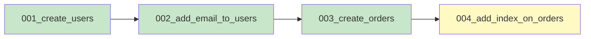
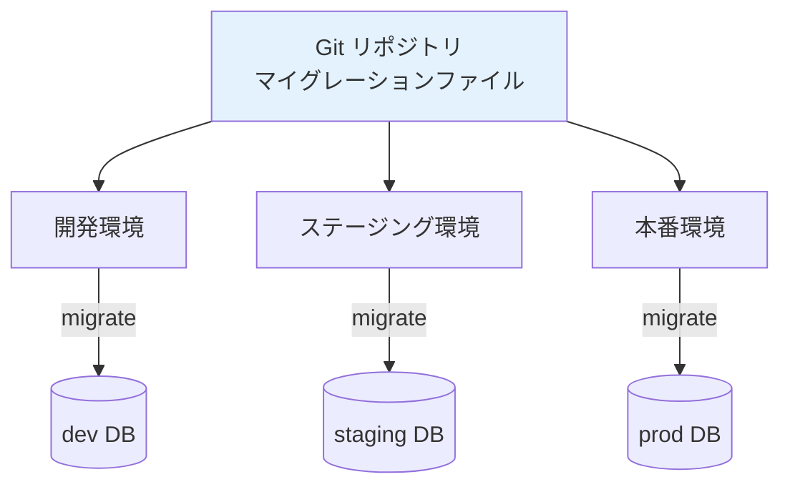
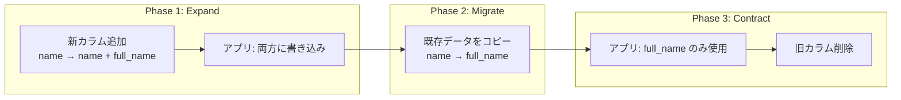

# マイグレーション（Database Migration）

> **一言で言うと:** データベースのスキーマ変更をコードとして管理し、本番DBを壊さずに構造を変える仕組み。

## なぜ必要か

アプリケーションは進化する。新機能の追加やバグ修正に伴い、データベースの構造（スキーマ）も変化する必要がある。しかし、以下の理由からスキーマ変更は本質的に危険な操作である:

- **データは消せない**: コードはロールバックできるが、カラムを削除して失われたデータは戻らない
- **ダウンタイムのリスク**: 大規模なテーブルへの `ALTER TABLE` は長時間ロックを取得し、その間アプリケーションが停止する
- **環境の不一致**: 開発・ステージング・本番で異なるスキーマ状態になると、「ステージングでは動くが本番で失敗」が起こる
- **チーム開発の衝突**: 複数の開発者が同時にスキーマを変更すると、適用順序によって結果が変わる

マイグレーションがなかった時代は、開発者が手動で `ALTER TABLE` を本番サーバーで実行していた。これは「本番サーバーで手作業でファイルを編集する」のと同じくらい危険な行為である。

## どの問題を解決するか

### 1. スキーマ変更のバージョン管理

マイグレーションの本質は、**スキーマ変更をコードファイルとしてGitで管理する**ことにある。各マイグレーションファイルには、変更を適用する「up」と元に戻す「down」の処理が含まれる。



各ファイルにはタイムスタンプまたは連番が付き、適用順序が保証される。DBには「どのマイグレーションまで適用済みか」を記録するテーブル（通常 `schema_migrations` や `_prisma_migrations`）が作られる。

### 2. 環境間の一貫性

マイグレーションファイルをGitに含めることで、すべての環境で同じスキーマ変更が同じ順序で適用される:



`git pull` 後に `migrate` コマンドを実行するだけで、自分のローカルDBが最新のスキーマに追いつく。新しいチームメンバーのオンボーディングも「クローンしてマイグレーション実行」で完了する。

### 3. ロールバック可能性

各マイグレーションに「down」処理を定義しておくことで、問題が発生した場合に変更を巻き戻せる:

```
up:   ALTER TABLE users ADD COLUMN phone VARCHAR(20);
down: ALTER TABLE users DROP COLUMN phone;
```

ただし、後述するように「down」で完全にロールバックできないケースも多い。

### 4. 無停止マイグレーション（Zero-Downtime Migration）

本番環境でダウンタイムなしにスキーマを変更するには、**Expand-Contract パターン**を使う。カラム名の変更を例にすると:



1. **Expand**: 新しいカラムを追加し、アプリケーションを新旧両方のカラムに書き込むように修正
2. **Migrate**: 既存データを新カラムにコピー
3. **Contract**: アプリケーションを新カラムのみ使用に切り替え、旧カラムを削除

これにより、デプロイのどの時点でも古いコードと新しいコードの両方が動作可能な状態を維持できる。

## 他の仕組みとどう関係するか

- **下位レイヤーとの関係:**
  - [[ファイルシステムとIO]]: `ALTER TABLE` は内部でテーブルファイルの再構築を伴うことがある。大規模テーブルの変更がなぜ遅いかは、ディスクI/Oの理解で説明できる
  - [[ロック]]: スキーマ変更はテーブルレベルのロックを取得する。このロックが他のクエリをブロックし、ダウンタイムの原因になる

- **同レイヤーとの関係:**
  - [[RDB]]: マイグレーションの主な対象。正規化の見直しやACID特性の保証の中でスキーマを変更する
  - [[Resources/Study/Layer3-データ永続化/インデックス|インデックス]]: インデックスの追加・削除もマイグレーションで管理する。`CREATE INDEX CONCURRENTLY`（PostgreSQL）のように、ロックを最小化する構文が重要
  - [[NoSQL]]: ドキュメントDBではスキーマ変更がアプリケーション層で行われる（例: Mongooseのスキーマ更新）。しかしデータの移行（データマイグレーション）は依然として必要

- **上位レイヤーとの関係:**
  - [[Layer4-アプリケーション/_index|Layer 4: アプリケーション]]: ORMやフレームワークがマイグレーション機能を提供する（Rails ActiveRecord, Django, Prisma, TypeORM等）
  - [[Layer7-設計アーキテクチャ/_index|Layer 7: 設計・アーキテクチャ]]: CI/CDパイプラインにマイグレーション実行を組み込む。デプロイフローの中でマイグレーションの適用タイミングが重要

## 誤解されやすいポイント

### 1.「downマイグレーションがあれば安全にロールバックできる」

理論上はそうだが、実務では以下の理由でdownマイグレーションが役に立たないケースが多い:

- カラム削除のdownは「カラムを追加」だが、削除されたデータは戻らない
- 本番で大量のデータが既に新しいスキーマで書き込まれていると、downで不整合が生じる
- NOT NULL制約を追加した後のdownでは、新しく入ったデータがNULLを持てない

本番でのロールバックは「downマイグレーション」ではなく、**前方への修正（Forward Fix）** — 新しいマイグレーションで問題を解消する — が現実的な対応になる。

### 2.「マイグレーションはスキーマ変更だけ」

マイグレーションには2種類ある:

- **スキーママイグレーション**: テーブル構造の変更（`ALTER TABLE`）
- **データマイグレーション**: 既存データの変換・移行（`UPDATE`, `INSERT`）

Expand-Contractパターンのフェーズ2（既存データのコピー）はデータマイグレーションに該当する。この2つを混在させると、ロールバック時の複雑さが跳ね上がるため、別ファイルに分離するのがベストプラクティス。

### 3.「ORMのマイグレーション生成を信用すれば安全」

Prismaの `prisma migrate dev` やDjangoの `makemigrations` は便利だが、自動生成されたSQLを必ず確認すべき。ツールは以下のようなケースで意図しない破壊的操作を生成することがある:

- カラム名の変更を「削除 + 作成」と解釈し、データが失われる
- ENUM型の値変更でテーブル再構築が発生する
- 自動生成の `DROP INDEX` が本番のクエリ性能を急激に悪化させる

### 4.「`ALTER TABLE` はすぐに終わる」

小さなテーブルでは一瞬だが、数百万行のテーブルに対する `ALTER TABLE` はMySQLでは数分〜数時間かかることがある（テーブルのコピーが内部で発生するため）。PostgreSQLでは多くの操作がメタデータ変更のみで完了するが、`NOT NULL` 制約の追加など全行スキャンを要する操作もある。

大規模テーブルの変更には、gh-ost（GitHub製）やpt-online-schema-change（Percona製）のようなオンラインスキーマ変更ツールが必要になる場合がある。

## 設計のベストプラクティス

### マイグレーションファイルの原則

1. **イミュータブル**: 一度適用したマイグレーションファイルは絶対に編集しない。修正は新しいマイグレーションで行う
2. **アトミック**: 1つのマイグレーションには1つの論理的な変更のみ含める
3. **べき等**: 可能な限り `IF NOT EXISTS` / `IF EXISTS` を使い、再実行しても安全にする
4. **レビュー可能**: 自動生成されたSQLも必ずコードレビューする

### 安全なカラム追加のパターン

```sql
-- ✅ 安全: デフォルト値付きでNULL許容カラムを追加
ALTER TABLE users ADD COLUMN phone VARCHAR(20) DEFAULT NULL;

-- ❌ 危険: NOT NULLカラムをデフォルト値なしで追加（既存行が違反）
ALTER TABLE users ADD COLUMN phone VARCHAR(20) NOT NULL;

-- ✅ 安全な手順でNOT NULLにする
-- Step 1: NULL許容で追加
ALTER TABLE users ADD COLUMN phone VARCHAR(20);
-- Step 2: 既存データを埋める（データマイグレーション）
UPDATE users SET phone = 'unknown' WHERE phone IS NULL;
-- Step 3: NOT NULL制約を追加
ALTER TABLE users ALTER COLUMN phone SET NOT NULL;
```

### インデックス追加の注意点

```sql
-- ❌ 危険: テーブルロックが発生（PostgreSQL）
CREATE INDEX idx_users_email ON users(email);

-- ✅ 安全: ロックを取得せずにバックグラウンドで構築（PostgreSQL）
CREATE INDEX CONCURRENTLY idx_users_email ON users(email);
```

`CONCURRENTLY` はPostgreSQL固有の機能。MySQLでは `ALTER TABLE ... ADD INDEX` がオンラインDDLとして実行される場合があるが、テーブルサイズによっては長時間かかる。

### アンチパターン

| アンチパターン | なぜ問題か | 対策 |
|---|---|---|
| 適用済みマイグレーションの編集 | 他の環境では旧バージョンが適用済みのため不整合が発生 | 新しいマイグレーションファイルで修正する |
| 巨大な単一マイグレーション | 失敗時のロールバック範囲が大きく、原因特定が困難 | 1マイグレーション = 1論理変更に分割する |
| 本番DBで手動SQL実行 | 追跡不可能、再現不可能、他環境との乖離 | すべての変更をマイグレーションファイル経由で行う |
| スキーマとデータの変更を混在 | ロールバックの複雑さが増大 | スキーママイグレーションとデータマイグレーションを分離する |
| ロック時間の考慮不足 | 大規模テーブルの変更で長時間ダウン | `CONCURRENTLY` やオンラインスキーマ変更ツールを使用 |

## AIによる実装のアンチパターン

| アンチパターン | なぜ問題か | 対策 |
|---|---|---|
| カラム名変更をDROP+ADDで生成 | データが完全に失われる | `RENAME COLUMN` を使うか、Expand-Contractパターンで段階的に移行 |
| downマイグレーションの過信 | データ削除を伴うdownを安易に生成し、実行するとデータ損失 | downは参考程度にとどめ、本番ではForward Fixを採用する |
| 全テーブルUPDATEのデータマイグレーション | 数百万行を一括UPDATEしてロックとメモリを大量消費 | バッチ処理（1000行ずつ等）で段階的に実行する |
| マイグレーション内でアプリケーションコードを呼び出す | モデルの変更でマイグレーションが壊れる。マイグレーション実行時にモデルが存在しない場合もある | 生SQLまたはマイグレーション専用のクエリを使う |

## 具体例

### Prisma（TypeScript / Node.js）

```typescript
// prisma/schema.prisma — スキーマ定義
model User {
  id        Int      @id @default(autoincrement())
  email     String   @unique
  name      String
  phone     String?  // 新しく追加するカラム
  orders    Order[]
  createdAt DateTime @default(now())
}

model Order {
  id        Int      @id @default(autoincrement())
  userId    Int
  user      User     @relation(fields: [userId], references: [id])
  total     Int
  createdAt DateTime @default(now())
}
```

```bash
# マイグレーション生成（SQLファイルが自動生成される）
npx prisma migrate dev --name add_phone_to_users

# 本番環境への適用
npx prisma migrate deploy
```

生成されるSQLファイル（`prisma/migrations/20260328_add_phone_to_users/migration.sql`）:

```sql
-- AlterTable
ALTER TABLE "User" ADD COLUMN "phone" TEXT;
```

### Django（Python）

```python
# users/models.py
from django.db import models

class User(models.Model):
    email = models.EmailField(unique=True)
    name = models.CharField(max_length=100)
    phone = models.CharField(max_length=20, null=True, blank=True)  # 追加
    created_at = models.DateTimeField(auto_now_add=True)
```

```bash
# マイグレーション生成
python manage.py makemigrations users

# 生成されたSQLを確認（必ず確認する）
python manage.py sqlmigrate users 0002

# 適用
python manage.py migrate
```

生成されるマイグレーションファイル:

```python
# users/migrations/0002_user_phone.py
from django.db import migrations, models

class Migration(migrations.Migration):
    dependencies = [
        ('users', '0001_initial'),
    ]

    operations = [
        migrations.AddField(
            model_name='user',
            name='phone',
            field=models.CharField(blank=True, max_length=20, null=True),
        ),
    ]
```

### Laravel（PHP）

```php
// database/migrations/2026_03_28_000001_add_phone_to_users.php
<?php

use Illuminate\Database\Migrations\Migration;
use Illuminate\Database\Schema\Blueprint;
use Illuminate\Support\Facades\Schema;

return new class extends Migration {
    public function up(): void
    {
        Schema::table('users', function (Blueprint $table) {
            $table->string('phone', 20)->nullable()->after('name');
        });
    }

    public function down(): void
    {
        Schema::table('users', function (Blueprint $table) {
            $table->dropColumn('phone');
        });
    }
};
```

```bash
# マイグレーション生成
php artisan make:migration add_phone_to_users --table=users

# 生成されたSQLを確認（必ず確認する）
php artisan migrate --pretend

# 適用
php artisan migrate

# 1つ戻す
php artisan migrate:rollback --step=1
```

### バッチデータマイグレーション（Python / 生SQL）

大量データを安全に更新するバッチ処理の例:

```python
import psycopg2
import time

conn = psycopg2.connect("dbname=myapp")
conn.autocommit = True
cur = conn.cursor()

BATCH_SIZE = 1000
total_updated = 0

while True:
    cur.execute("""
        WITH batch AS (
            SELECT ctid FROM users
            WHERE full_name IS NULL
            LIMIT %s
        )
        UPDATE users
        SET full_name = first_name || ' ' || last_name
        FROM batch
        WHERE users.ctid = batch.ctid
    """, (BATCH_SIZE,))

    updated = cur.rowcount
    total_updated += updated
    print(f"Updated {total_updated} rows...")

    if updated < BATCH_SIZE:
        break

    # DB負荷を抑えるためにスリープ
    time.sleep(0.1)

print(f"Migration complete: {total_updated} rows updated")
cur.close()
conn.close()
```

### Go — golang-migrate による生SQLマイグレーション

```sql
-- migrations/000001_create_users.up.sql
CREATE TABLE IF NOT EXISTS users (
    id SERIAL PRIMARY KEY,
    email VARCHAR(255) NOT NULL UNIQUE,
    name VARCHAR(100) NOT NULL,
    created_at TIMESTAMP DEFAULT NOW()
);

-- migrations/000001_create_users.down.sql
DROP TABLE IF EXISTS users;
```

```sql
-- migrations/000002_add_phone_to_users.up.sql
ALTER TABLE users ADD COLUMN IF NOT EXISTS phone VARCHAR(20);

-- migrations/000002_add_phone_to_users.down.sql
ALTER TABLE users DROP COLUMN IF EXISTS phone;
```

```bash
# 適用
migrate -database "postgres://localhost/myapp?sslmode=disable" -path migrations up

# 1つ戻す
migrate -database "postgres://localhost/myapp?sslmode=disable" -path migrations down 1

# 現在のバージョン確認
migrate -database "postgres://localhost/myapp?sslmode=disable" -path migrations version
```

## 参考リソース

- Martin Kleppmann 著『Designing Data-Intensive Applications』第4章 — スキーマの進化とエンコーディング
- [Prisma Migrate Documentation](https://www.prisma.io/docs/concepts/components/prisma-migrate) — Prismaの公式マイグレーションガイド
- [gh-ost: GitHub's Online Schema Migration](https://github.com/github/gh-ost) — GitHubが開発した無停止スキーマ変更ツール
- [Strong Migrations (Rails)](https://github.com/ankane/strong_migrations) — 危険なマイグレーションを検出するRails gem

## 学習メモ

（個人的な気づき・疑問・TODO）
