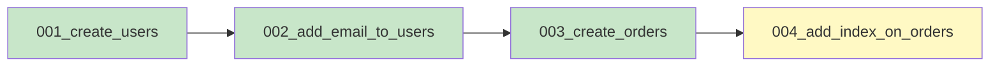
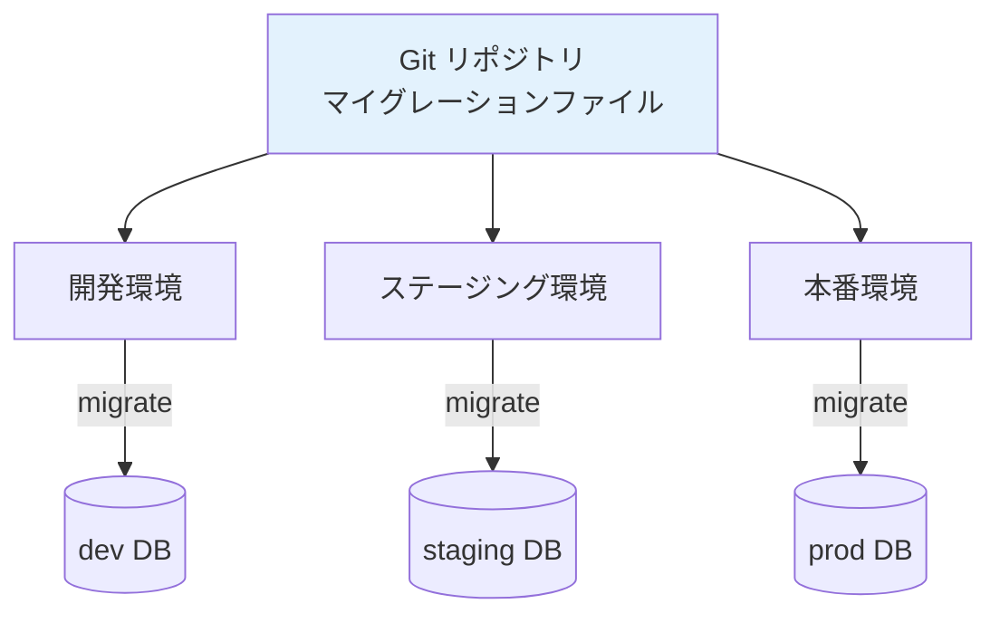
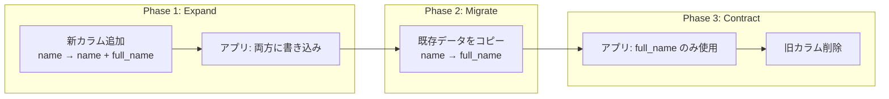

# マイグレーション（Database Migration）

> **一言で言うと:** データベースのスキーマ変更をコードとして管理し、本番DBを壊さずに構造を変える仕組み。「データは消せない・ダウンタイムは許されない・複数環境で同じ結果が要る」という制約の中でスキーマを安全に進化させる。

## 3分で全体像

- **何を解決する技術か:** スキーマ変更を Git 管理されたコードファイルにし、開発・ステージング・本番で同じ変更を同じ順序で適用する。本番でのダウンタイム・データ損失・環境間ドリフトを防ぐ
- **代表的な使用シーン:** カラム追加、テーブル分割、インデックス追加、ENUM 値の変更、既存データのバックフィル、マルチテナント切り出し
- **これだけは覚える3つ:**
    1. **適用済みマイグレーションは絶対に編集しない** — 他環境では旧版が適用済みのため不整合が起こる。修正は **新しいマイグレーションファイル** で行う（イミュータブル原則）
    2. **本番のロールバックは「down」ではなく「Forward Fix」** — down はデータ損失や制約違反で失敗しがち。新しいマイグレーションで前方修正するのが定石
    3. **Zero-Downtime には Expand-Contract** — カラムリネームのような「破壊的」変更も、`新カラム追加 → 両書き → データコピー → 切替 → 旧カラム削除` の段階的手順で無停止にできる
- **AIに任せやすいか:** **一部任せられる** — `ALTER TABLE` の SQL 生成・Prisma/Django の migration ファイル作成は AI が書ける。ただし「テーブルロック影響の判定」「`CONCURRENTLY` の必要性」「Expand-Contract の手順設計」「データマイグレーションのバッチ分割」は本番テーブル規模と運用コンテキストに依存し、AI が **「危険な ALTER を無計画に生成」** することが多い。`/review-ai-code` で必ず検出する
- **詰まったらここを読む:** [[RDB]] / [[インデックス]] / [[ロック]]

## なぜ必要か

アプリケーションは進化する。新機能の追加やバグ修正に伴い、データベースの構造（スキーマ）も変化する必要がある。しかし、以下の理由からスキーマ変更は本質的に危険な操作である:

- **データは消せない**: コードはロールバックできるが、カラムを削除して失われたデータは戻らない
- **ダウンタイムのリスク**: 大規模なテーブルへの `ALTER TABLE` は長時間ロックを取得し、その間アプリケーションが停止する
- **環境の不一致**: 開発・ステージング・本番で異なるスキーマ状態になると、「ステージングでは動くが本番で失敗」が起こる
- **チーム開発の衝突**: 複数の開発者が同時にスキーマを変更すると、適用順序によって結果が変わる

マイグレーションがなかった時代は、開発者が手動で `ALTER TABLE` を本番サーバーで実行していた。これは「本番サーバーで手作業でファイルを編集する」のと同じくらい危険な行為である。

## どの問題を解決するか

### 1. スキーマ変更のバージョン管理

マイグレーションの本質は、**スキーマ変更をコードファイルとしてGitで管理する**ことにある。各マイグレーションファイルには、変更を適用する「up」と元に戻す「down」の処理が含まれる。


```mermaid
graph LR
    M1["001_create_users"] --> M2["002_add_email_to_users"]
    M2 --> M3["003_create_orders"]
    M3 --> M4["004_add_index_on_orders"]

    style M1 fill:#c8e6c9
    style M2 fill:#c8e6c9
    style M3 fill:#c8e6c9
    style M4 fill:#fff9c4
```

各ファイルにはタイムスタンプまたは連番が付き、適用順序が保証される。DBには「どのマイグレーションまで適用済みか」を記録するテーブル（通常 `schema_migrations` や `_prisma_migrations`）が作られる。

### 2. 環境間の一貫性

マイグレーションファイルをGitに含めることで、すべての環境で同じスキーマ変更が同じ順序で適用される:


```mermaid
graph TB
    Git[Git リポジトリ<br/>マイグレーションファイル] --> Dev[開発環境]
    Git --> Staging[ステージング環境]
    Git --> Prod[本番環境]

    Dev --> |migrate| DevDB[(dev DB)]
    Staging --> |migrate| StagingDB[(staging DB)]
    Prod --> |migrate| ProdDB[(prod DB)]

    style Git fill:#e3f2fd
```

`git pull` 後に `migrate` コマンドを実行するだけで、自分のローカルDBが最新のスキーマに追いつく。新しいチームメンバーのオンボーディングも「クローンしてマイグレーション実行」で完了する。

### 3. ロールバック可能性

各マイグレーションに「down」処理を定義しておくことで、問題が発生した場合に変更を巻き戻せる:

```
up:   ALTER TABLE users ADD COLUMN phone VARCHAR(20);
down: ALTER TABLE users DROP COLUMN phone;
```

ただし、後述するように「down」で完全にロールバックできないケースも多い。

### 4. 無停止マイグレーション（Zero-Downtime Migration）

本番環境でダウンタイムなしにスキーマを変更するには、**Expand-Contract パターン**を使う。カラム名の変更を例にすると:


```mermaid
graph LR
    subgraph "Phase 1: Expand"
        E1["新カラム追加<br/>name → name + full_name"]
        E2["アプリ: 両方に書き込み"]
    end
    subgraph "Phase 2: Migrate"
        M1["既存データをコピー<br/>name → full_name"]
    end
    subgraph "Phase 3: Contract"
        C1["アプリ: full_name のみ使用"]
        C2["旧カラム削除"]
    end

    E1 --> E2 --> M1 --> C1 --> C2
```

1. **Expand**: 新しいカラムを追加し、アプリケーションを新旧両方のカラムに書き込むように修正
2. **Migrate**: 既存データを新カラムにコピー
3. **Contract**: アプリケーションを新カラムのみ使用に切り替え、旧カラムを削除

これにより、デプロイのどの時点でも古いコードと新しいコードの両方が動作可能な状態を維持できる。

## 他の仕組みとどう関係するか

- **下位レイヤーとの関係:**
  - [[ファイルシステムとIO]]: `ALTER TABLE` は内部でテーブルファイルの再構築を伴うことがある。大規模テーブルの変更がなぜ遅いかは、ディスクI/Oの理解で説明できる
  - [[ロック]]: スキーマ変更はテーブルレベルのロックを取得する。このロックが他のクエリをブロックし、ダウンタイムの原因になる

- **同レイヤーとの関係:**
  - [[RDB]]: マイグレーションの主な対象。正規化の見直しやACID特性の保証の中でスキーマを変更する
  - [[Resources/Study/Layer3-データ永続化/インデックス|インデックス]]: インデックスの追加・削除もマイグレーションで管理する。`CREATE INDEX CONCURRENTLY`（PostgreSQL）のように、ロックを最小化する構文が重要
  - [[NoSQL]]: ドキュメントDBではスキーマ変更がアプリケーション層で行われる（例: Mongooseのスキーマ更新）。しかしデータの移行（データマイグレーション）は依然として必要

- **上位レイヤーとの関係:**
  - [[Layer4-アプリケーション/_index|Layer 4: アプリケーション]]: ORMやフレームワークがマイグレーション機能を提供する（Rails ActiveRecord, Django, Prisma, TypeORM等）
  - [[Layer7-設計アーキテクチャ/_index|Layer 7: 設計・アーキテクチャ]]: CI/CDパイプラインにマイグレーション実行を組み込む。デプロイフローの中でマイグレーションの適用タイミングが重要

## 誤解されやすいポイント

### 1.「downマイグレーションがあれば安全にロールバックできる」

理論上はそうだが、実務では以下の理由でdownマイグレーションが役に立たないケースが多い:

- カラム削除のdownは「カラムを追加」だが、削除されたデータは戻らない
- 本番で大量のデータが既に新しいスキーマで書き込まれていると、downで不整合が生じる
- NOT NULL制約を追加した後のdownでは、新しく入ったデータがNULLを持てない

本番でのロールバックは「downマイグレーション」ではなく、**前方への修正（Forward Fix）** — 新しいマイグレーションで問題を解消する — が現実的な対応になる。

### 2.「マイグレーションはスキーマ変更だけ」

マイグレーションには2種類ある:

- **スキーママイグレーション**: テーブル構造の変更（`ALTER TABLE`）
- **データマイグレーション**: 既存データの変換・移行（`UPDATE`, `INSERT`）

Expand-Contractパターンのフェーズ2（既存データのコピー）はデータマイグレーションに該当する。この2つを混在させると、ロールバック時の複雑さが跳ね上がるため、別ファイルに分離するのがベストプラクティス。

### 3.「ORMのマイグレーション生成を信用すれば安全」

Prismaの `prisma migrate dev` やDjangoの `makemigrations` は便利だが、自動生成されたSQLを必ず確認すべき。ツールは以下のようなケースで意図しない破壊的操作を生成することがある:

- カラム名の変更を「削除 + 作成」と解釈し、データが失われる
- ENUM型の値変更でテーブル再構築が発生する
- 自動生成の `DROP INDEX` が本番のクエリ性能を急激に悪化させる

### 4.「`ALTER TABLE` はすぐに終わる」

小さなテーブルでは一瞬だが、数百万行のテーブルに対する `ALTER TABLE` はMySQLでは数分〜数時間かかることがある（テーブルのコピーが内部で発生するため）。PostgreSQLでは多くの操作がメタデータ変更のみで完了するが、`NOT NULL` 制約の追加など全行スキャンを要する操作もある。

大規模テーブルの変更には、gh-ost（GitHub製）やpt-online-schema-change（Percona製）のようなオンラインスキーマ変更ツールが必要になる場合がある。

## 設計のベストプラクティス

### マイグレーションファイルの原則

1. **イミュータブル**: 一度適用したマイグレーションファイルは絶対に編集しない。修正は新しいマイグレーションで行う
2. **アトミック**: 1つのマイグレーションには1つの論理的な変更のみ含める
3. **べき等**: 可能な限り `IF NOT EXISTS` / `IF EXISTS` を使い、再実行しても安全にする
4. **レビュー可能**: 自動生成されたSQLも必ずコードレビューする

### 安全なカラム追加のパターン

```sql
-- ✅ 安全: デフォルト値付きでNULL許容カラムを追加
ALTER TABLE users ADD COLUMN phone VARCHAR(20) DEFAULT NULL;

-- ❌ 危険: NOT NULLカラムをデフォルト値なしで追加（既存行が違反）
ALTER TABLE users ADD COLUMN phone VARCHAR(20) NOT NULL;

-- ✅ 安全な手順でNOT NULLにする
-- Step 1: NULL許容で追加
ALTER TABLE users ADD COLUMN phone VARCHAR(20);
-- Step 2: 既存データを埋める（データマイグレーション）
UPDATE users SET phone = 'unknown' WHERE phone IS NULL;
-- Step 3: NOT NULL制約を追加
ALTER TABLE users ALTER COLUMN phone SET NOT NULL;
```

### インデックス追加の注意点

```sql
-- ❌ 危険: テーブルロックが発生（PostgreSQL）
CREATE INDEX idx_users_email ON users(email);

-- ✅ 安全: ロックを取得せずにバックグラウンドで構築（PostgreSQL）
CREATE INDEX CONCURRENTLY idx_users_email ON users(email);
```

`CONCURRENTLY` はPostgreSQL固有の機能。MySQLでは `ALTER TABLE ... ADD INDEX` がオンラインDDLとして実行される場合があるが、テーブルサイズによっては長時間かかる。

### アンチパターン

| アンチパターン | なぜ問題か | 対策 |
|---|---|---|
| 適用済みマイグレーションの編集 | 他の環境では旧バージョンが適用済みのため不整合が発生 | 新しいマイグレーションファイルで修正する |
| 巨大な単一マイグレーション | 失敗時のロールバック範囲が大きく、原因特定が困難 | 1マイグレーション = 1論理変更に分割する |
| 本番DBで手動SQL実行 | 追跡不可能、再現不可能、他環境との乖離 | すべての変更をマイグレーションファイル経由で行う |
| スキーマとデータの変更を混在 | ロールバックの複雑さが増大 | スキーママイグレーションとデータマイグレーションを分離する |
| ロック時間の考慮不足 | 大規模テーブルの変更で長時間ダウン | `CONCURRENTLY` やオンラインスキーマ変更ツールを使用 |

## AIエージェントとの協働

> このトピックでAIコーディングエージェント（Claude Code, Copilot, Cursor 等）と協働するための観点。
> マイグレーションは **「失敗するとデータ損失や本番ダウンタイムを引き起こす不可逆操作」** が中心。AI は SQL を機械的には書けるが、**「本番テーブル規模・許容ダウンタイム・ロック影響」の文脈** を持っていないため、人間が必ずレビューする。生成された SQL を `--pretend` / `--dry-run` で必ず確認するのが鉄則。

### AIに任せられる部分 / 人間が判断すべき部分

| タスク種類 | 任せ方（実装/レビュー） | 人間の関与 |
|---|---|---|
| `ALTER TABLE` の SQL 生成 | AI に叩き台 | 本番テーブル規模・ロック影響を必ず確認、`CONCURRENTLY` などの安全構文を追加するか判断 |
| 単純なカラム追加（NULL 許容） | AI に任せる | デフォルト値の妥当性、後で NOT NULL 化する手順は人間設計 |
| Expand-Contract 設計 | AI に各フェーズの SQL を生成させる | フェーズの順序・両書きアプリ修正のタイミング・切替判定は人間が設計 |
| データマイグレーション（バックフィル） | AI に SQL とバッチスクリプト | バッチサイズ・スリープ間隔・進捗ログ要件は本番負荷から人間が決定 |
| ロールバック（down）SQL 生成 | AI に書かせる | 本番では Forward Fix を採用するため down はテスト用、過信しない |
| 既存マイグレーションのレビュー | AI で危険操作検出 | 採否判断は人間。`Strong Migrations` 等のツールと組み合わせる |

### AI生成コードのレビュー観点（このトピック固有）

AI生成マイグレーションを受け取ったとき、最低限ここを見る。

1. **データ損失を引き起こす操作になっていないか** — カラムリネームを `DROP` + `ADD` で生成していないか、`DROP COLUMN` の前にバックアップ確認しているか、down に `DROP TABLE` のような不可逆操作が入っていないか
2. **本番テーブルロックを引き起こさないか** — PostgreSQL なら `CREATE INDEX CONCURRENTLY`、`ALTER TABLE ... ADD COLUMN` の DEFAULT 値（PostgreSQL 11以降は安全だが古いバージョンでは全行書き換え）、`NOT NULL` 制約を一気に追加していないか。MySQL なら `ALGORITHM=INPLACE, LOCK=NONE` の指定があるか
3. **データマイグレーションが一括 UPDATE になっていないか** — `UPDATE users SET ... WHERE ...` で何百万行を一発で更新していないか。バッチ分割（1000行ずつ + スリープ）と進捗ログ、リトライ可能性が組み込まれているか

### 効くプロンプトの型

このトピックに関する実装を AI に依頼するとき、コンテキストとして渡すべき情報・制約・成功基準のテンプレ。

```
# 前提（プロジェクトの状況・既存のコード規約）
- DB: PostgreSQL 16 / MySQL 8.4
- マイグレーションツール: Prisma / Django / Laravel / golang-migrate
- 対象テーブル: {table_name}（行数 約{N}行）
- 本番への適用方法: CI から自動実行 / 手動実行
- 許容ダウンタイム: ゼロ / 数分 / メンテナンス時間あり
- 既存スキーマと変更前の状態: [...]

# やってほしいこと
- 「{要件}」を実現するマイグレーションを生成
- 本番適用時の所要時間とロック影響の見積もりを併記
- ロールバック手順（down または Forward Fix）も提示

# 守ってほしい制約
- 既存マイグレーションは編集しない（新規ファイルで対応）
- 本番テーブルへのインデックス追加は `CREATE INDEX CONCURRENTLY`（PostgreSQL）/ `ALGORITHM=INPLACE, LOCK=NONE`（MySQL）
- NOT NULL カラム追加は (1)NULL 許容で追加 (2)バックフィル (3)NOT NULL 制約追加、の3段階
- カラムリネームは Expand-Contract で実施（DROP+ADD 禁止）
- データマイグレーションはバッチ処理（1000行 + スリープ + 進捗ログ）
- スキーマ変更とデータ変更は別ファイルに分離

# 完了の判断基準
- `--pretend` / `prisma migrate dev` の dry-run でロック影響を確認
- 各操作が想定時間内に完了する（数分以内）
- ロールバック手順が現実的に実行可能
```

### AI実装のアンチパターン

LLM 生成コードで頻出する過剰設計・誤用パターン。レビュー時の照合表として使う。

| アンチパターン | なぜ問題か | レビュー観点 / 対策 |
|---|---|---|
| カラム名変更を DROP + ADD で生成 | データが完全に失われる | `RENAME COLUMN` か Expand-Contract で段階的に移行 |
| down マイグレーションの過信 | データ削除を伴う down で本番データが失われる | down は開発時のロールバック専用。本番では Forward Fix を採用 |
| 全テーブル一括 UPDATE のデータマイグレーション | 数百万行の一括 UPDATE でロック・メモリを大量消費、本番ハング | 1000行ずつのバッチ処理 + スリープ + 進捗ログ + リトライ可能性 |
| マイグレーション内でアプリケーションコードを呼び出す | モデル変更でマイグレーションが壊れる、再実行不能になる | 生 SQL またはマイグレーション専用クエリを使う |
| 大規模テーブルへのインデックスを `CONCURRENTLY` なしで追加 | 長時間テーブルロックでダウンタイム | PostgreSQL は `CREATE INDEX CONCURRENTLY`、MySQL は `ALGORITHM=INPLACE` |
| `ALTER TABLE` で複数操作を1文に詰め込む | 失敗時のロールバック範囲が広く、原因特定が困難 | 1マイグレーション = 1論理変更 |
| `NOT NULL` カラムをデフォルト値なしで追加 | 既存行が制約違反になり ALTER が失敗 | NULL 許容で追加 → バックフィル → NOT NULL の3段階 |
| ENUM 型に値を追加・削除 | テーブル再構築が発生する DB がある（MySQL）、運用が複雑 | VARCHAR + CHECK 制約で代替 |
| 適用済みマイグレーションファイルを編集 | 他環境では旧版が適用済みで永遠に不整合 | 必ず新規ファイルで修正 |

→ レイヤー横断のアンチパターン索引: [[_anti-patterns/_index|AIアンチパターン索引]] / [[_anti-patterns/レイヤー別/Layer3|Layer 3 アンチパターン集]]

## 具体例

### Prisma（TypeScript / Node.js）

```typescript
// prisma/schema.prisma — スキーマ定義
model User {
  id        Int      @id @default(autoincrement())
  email     String   @unique
  name      String
  phone     String?  // 新しく追加するカラム
  orders    Order[]
  createdAt DateTime @default(now())
}

model Order {
  id        Int      @id @default(autoincrement())
  userId    Int
  user      User     @relation(fields: [userId], references: [id])
  total     Int
  createdAt DateTime @default(now())
}
```

```bash
# マイグレーション生成（SQLファイルが自動生成される）
npx prisma migrate dev --name add_phone_to_users

# 本番環境への適用
npx prisma migrate deploy
```

生成されるSQLファイル（`prisma/migrations/20260328_add_phone_to_users/migration.sql`）:

```sql
-- AlterTable
ALTER TABLE "User" ADD COLUMN "phone" TEXT;
```

### Django（Python）

```python
# users/models.py
from django.db import models

class User(models.Model):
    email = models.EmailField(unique=True)
    name = models.CharField(max_length=100)
    phone = models.CharField(max_length=20, null=True, blank=True)  # 追加
    created_at = models.DateTimeField(auto_now_add=True)
```

```bash
# マイグレーション生成
python manage.py makemigrations users

# 生成されたSQLを確認（必ず確認する）
python manage.py sqlmigrate users 0002

# 適用
python manage.py migrate
```

生成されるマイグレーションファイル:

```python
# users/migrations/0002_user_phone.py
from django.db import migrations, models

class Migration(migrations.Migration):
    dependencies = [
        ('users', '0001_initial'),
    ]

    operations = [
        migrations.AddField(
            model_name='user',
            name='phone',
            field=models.CharField(blank=True, max_length=20, null=True),
        ),
    ]
```

### Laravel（PHP）

```php
// database/migrations/2026_03_28_000001_add_phone_to_users.php
<?php

use Illuminate\Database\Migrations\Migration;
use Illuminate\Database\Schema\Blueprint;
use Illuminate\Support\Facades\Schema;

return new class extends Migration {
    public function up(): void
    {
        Schema::table('users', function (Blueprint $table) {
            $table->string('phone', 20)->nullable()->after('name');
        });
    }

    public function down(): void
    {
        Schema::table('users', function (Blueprint $table) {
            $table->dropColumn('phone');
        });
    }
};
```

```bash
# マイグレーション生成
php artisan make:migration add_phone_to_users --table=users

# 生成されたSQLを確認（必ず確認する）
php artisan migrate --pretend

# 適用
php artisan migrate

# 1つ戻す
php artisan migrate:rollback --step=1
```

### バッチデータマイグレーション（Python / 生SQL）

大量データを安全に更新するバッチ処理の例:

```python
import psycopg
import time

BATCH_SIZE = 1000
total_updated = 0

with psycopg.connect("dbname=myapp", autocommit=True) as conn:
    while True:
        result = conn.execute("""
            WITH batch AS (
                SELECT ctid FROM users
                WHERE full_name IS NULL
                LIMIT %s
            )
            UPDATE users
            SET full_name = first_name || ' ' || last_name
            FROM batch
            WHERE users.ctid = batch.ctid
        """, (BATCH_SIZE,))

        updated = result.rowcount
        total_updated += updated
        print(f"Updated {total_updated} rows...")

        if updated < BATCH_SIZE:
            break

        # DB負荷を抑えるためにスリープ
        time.sleep(0.1)

print(f"Migration complete: {total_updated} rows updated")
```

### Go — golang-migrate による生SQLマイグレーション

```sql
-- migrations/000001_create_users.up.sql
CREATE TABLE IF NOT EXISTS users (
    id INT GENERATED ALWAYS AS IDENTITY PRIMARY KEY,
    email VARCHAR(255) NOT NULL UNIQUE,
    name VARCHAR(100) NOT NULL,
    created_at TIMESTAMPTZ NOT NULL DEFAULT NOW()
);

-- migrations/000001_create_users.down.sql
DROP TABLE IF EXISTS users;
```

```sql
-- migrations/000002_add_phone_to_users.up.sql
ALTER TABLE users ADD COLUMN IF NOT EXISTS phone VARCHAR(20);

-- migrations/000002_add_phone_to_users.down.sql
ALTER TABLE users DROP COLUMN IF EXISTS phone;
```

```bash
# 適用
migrate -database "postgres://localhost/myapp?sslmode=disable" -path migrations up

# 1つ戻す
migrate -database "postgres://localhost/myapp?sslmode=disable" -path migrations down 1

# 現在のバージョン確認
migrate -database "postgres://localhost/myapp?sslmode=disable" -path migrations version
```

## 参考リソース

- Martin Kleppmann 著『Designing Data-Intensive Applications』第4章 — スキーマの進化とエンコーディング
- [Prisma Migrate Documentation](https://www.prisma.io/docs/concepts/components/prisma-migrate) — Prismaの公式マイグレーションガイド
- [gh-ost: GitHub's Online Schema Migration](https://github.com/github/gh-ost) — GitHubが開発した無停止スキーマ変更ツール
- [Strong Migrations (Rails)](https://github.com/ankane/strong_migrations) — 危険なマイグレーションを検出するRails gem

## 理解度セルフチェック

> 答えられなければ本文に戻る。答えはこのファイル内に必ずある。

1. **「適用済みマイグレーションファイルは絶対に編集してはいけない」のはなぜか、30秒で説明せよ。** 編集してしまうと何が起こるか。
2. **本番テーブル（5000万行）に新規カラム `status VARCHAR(20) NOT NULL DEFAULT 'active'` を追加したい。これを1ステップで実行する危険性を述べ、Zero-Downtime で実現する手順を3段階で示せ。**
3. **AI生成コードレビュー設問:** AI が以下のマイグレーションを生成した。本番（行数 1000万、書き込み 50 req/s、ダウンタイム不可）への適用を想定して **問題点を3つ以上** 指摘し、安全な手順に書き直すヒントを示せ。

```sql
-- migrate up
BEGIN;

-- カラム名を変更
ALTER TABLE users DROP COLUMN full_name;
ALTER TABLE users ADD COLUMN display_name VARCHAR(100) NOT NULL;

-- 既存ユーザーに display_name をデフォルト値として設定
UPDATE users SET display_name = email;

-- インデックスも作り直す
DROP INDEX IF EXISTS idx_users_full_name;
CREATE INDEX idx_users_display_name ON users (display_name);

COMMIT;

-- migrate down
BEGIN;
ALTER TABLE users DROP COLUMN display_name;
ALTER TABLE users ADD COLUMN full_name VARCHAR(100);
COMMIT;
```

> [!note]- 解答の指針
>
> > [!info] 用語ミニ辞典
> > - **環境間ドリフト:** 開発・ステージング・本番の DB スキーマ状態が時間とともに乖離していく現象。マイグレーションを Git 管理し全環境で同じ順序で適用することで防ぐ
> > - **適用済みハッシュ:** マイグレーションフレームワーク（Prisma 等）が「どのファイルがどの内容で適用されたか」を記録するチェックサム。編集すると不一致でエラーになる
> > - **メタデータ変更のみで完了:** PostgreSQL 11+ の `ADD COLUMN ... DEFAULT` はテーブル定義に DEFAULT を保存するだけで既存行を書き換えない。MySQL は基本的に全行書き換えが発生し、テーブルサイズに比例して時間がかかる
> > - **オンライン DDL:** スキーマ変更中もテーブルへの書き込みを許す DBMS の機能。MySQL の `ALGORITHM=INPLACE, LOCK=NONE`、PostgreSQL の `CREATE INDEX CONCURRENTLY` などが該当
> > - **Expand-Contract パターン:** 破壊的なスキーマ変更を「新カラム追加 → 両書き → データコピー → アプリ切替 → 旧カラム削除」の段階に分けて、どの瞬間でも旧コード/新コード両方が動作可能にする手法
> > - **Forward Fix:** 本番でマイグレーションに問題があった場合、down で巻き戻すのではなく **新しいマイグレーション** で前方修正すること
> > - **`CREATE INDEX CONCURRENTLY` (PostgreSQL):** インデックス構築中もテーブルへの書き込みを許す構文。通常より時間はかかるがダウンタイムなし
>
> 1. マイグレーションは「適用順序の連続体」として全環境で共有される。一度適用されたファイルを編集すると、(a) 既に適用済みの環境（本番・他開発者のローカル）では旧版の状態が残り、(b) 新規環境では編集後の版が適用されるため、**環境間で永遠に追いつけないドリフト** が発生する。マイグレーションフレームワークが「適用済みハッシュ」を記録している場合、ハッシュ不一致でエラーになることもある。修正は必ず **新規マイグレーションファイル** で行い、過去は不変として扱う
> 2. 1ステップで `NOT NULL DEFAULT 'active'` を追加する危険性:
>     - PostgreSQL 11 未満では既存行を全て書き換えるため、5000万行で長時間テーブルロック → ダウンタイム
>     - PostgreSQL 11+ ではメタデータのみで完結する（DEFAULT 値はテーブル定義に保持）が、後で DEFAULT を外したい場合は別途バックフィルが必要
>     - MySQL は基本的に全行書き換え（オンライン DDL 対応もあるが ALGORITHM=INPLACE が効くかは要件次第）、書き込み 50 req/s が長時間止まる
>
>     Zero-Downtime 手順 (3段階):
>     - **Step 1: NULL 許容で追加** — `ALTER TABLE users ADD COLUMN status VARCHAR(20);` （メタデータ変更のみで瞬時完了）
>     - **Step 2: バックフィル** — `UPDATE users SET status = 'active' WHERE status IS NULL;` を **バッチ処理** （1000行ずつ + スリープ）で実行。アプリ側は新カラムへの書き込みを開始
>     - **Step 3: NOT NULL 制約追加** — 全行が埋まったら `ALTER TABLE users ALTER COLUMN status SET NOT NULL;` （PostgreSQL では全行スキャンが入るが瞬時に近い、MySQL では INPLACE で実行）
> 3. AI生成コードの問題点（最低限以下を指摘できれば本文を理解している）:
>     - **`DROP COLUMN full_name` でデータが完全に失われる** — `full_name` の中身は永遠に戻らない。カラム名の変更は **`RENAME COLUMN`** か Expand-Contract（新カラム追加 → アプリ両書き → データコピー → 切替 → 旧カラム削除）で実施
>     - **`ADD COLUMN ... NOT NULL`** — 既存行は NULL になり制約違反で失敗する。NULL 許容で追加 → バックフィル → NOT NULL の3段階に分割
>     - **`UPDATE users SET display_name = email`** — 1000万行の一括 UPDATE でテーブルがロックされ、書き込み 50 req/s が完全停止。バッチ処理（1000行 + スリープ + 進捗ログ）にすべき
>     - **インデックス作成が `CONCURRENTLY` なし** — `CREATE INDEX idx_users_display_name` は通常実行で長時間テーブルロック。`CREATE INDEX CONCURRENTLY` を使う（PostgreSQL）。MySQL なら `ALGORITHM=INPLACE, LOCK=NONE`
>     - **トランザクション内に巨大処理** — `BEGIN; ... COMMIT;` で全部包んでいるが、長時間トランザクションが他クエリをブロック、WAL 肥大、フェイル時のロールバックが重い。スキーマ変更とデータ変更は別マイグレーションに分離
>     - **down で `display_name` を DROP** — 切替後に `display_name` への書き込みデータが失われる。本番では down ではなく **Forward Fix** で対処すべき
>     - **正しい手順の例:** (a) `display_name` カラム NULL 許容で追加、(b) アプリを `full_name` と `display_name` 両方に書き込む版にデプロイ、(c) バックフィルバッチで `display_name = COALESCE(display_name, full_name)` を1000行ずつ実行、(d) アプリを `display_name` のみ参照に切替、(e) `display_name` を NOT NULL に変更、(f) しばらく運用して問題ないことを確認したのち `full_name` を DROP

## 学習メモ

（個人的な気づき・疑問・TODO）
