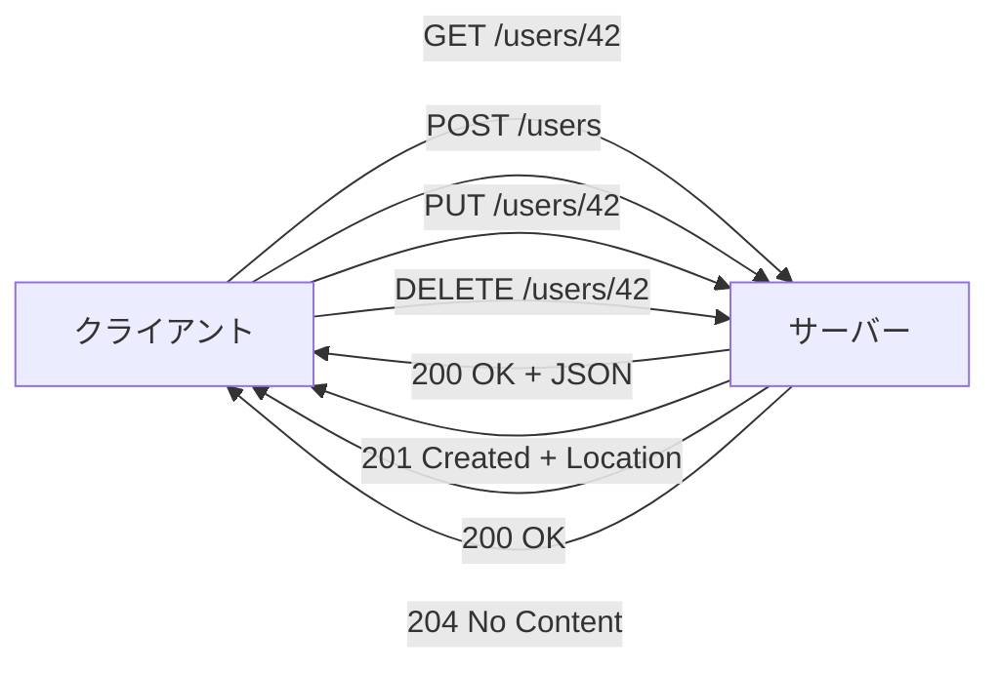
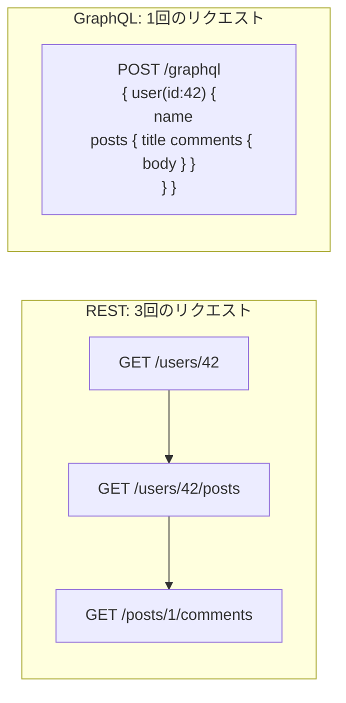
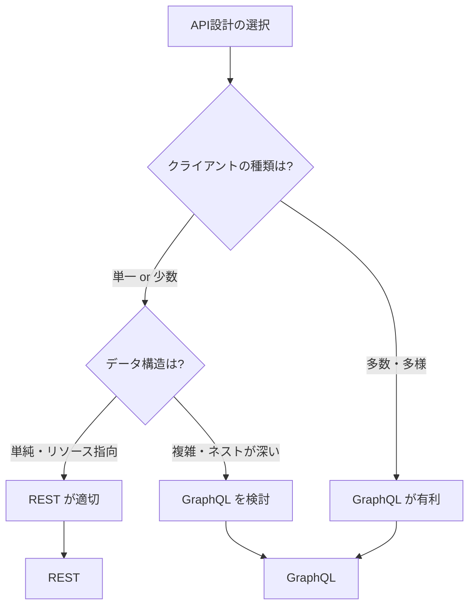

# API設計（REST / GraphQL）

> **一言で言うと:** フロントエンドとバックエンドの間の「契約」を定義する設計手法。RESTはHTTPの意味論を活用するリソース指向の設計哲学、GraphQLはクライアントが必要なデータだけを宣言的に取得するクエリ言語。

## なぜ必要か

Webアプリケーションでは、フロントエンドとバックエンドが別プロセス（多くの場合別サーバー）として動く。この2つを繋ぐインターフェースが定義されていなければ、次のことが起きる。

- フロント開発者とバック開発者が**毎回口頭で仕様を確認**しなければならない
- エンドポイントの命名・レスポンス形式・エラー表現が**開発者ごとにバラバラ**になる
- クライアント（モバイルアプリ、外部サービス）が増えるたびに**専用のエンドポイントを作り続ける**羽目になる
- バージョンアップ時に**何が壊れるか予測できない**

API設計とは「どのURLに何を送ると何が返ってくるか」を一貫したルールで定義することであり、チームのスケーラビリティとシステムの進化可能性を左右する。

## どの問題を解決するか

### RESTが解決する問題

REST（Representational State Transfer）は、HTTPプロトコルが持つ意味論（メソッド・ステータスコード・ヘッダ）をそのまま活かしてAPIを設計する思想。

| 課題 | RESTによる解決 |
|------|---------------|
| エンドポイント設計が属人的 | リソース（名詞）× HTTPメソッド（動詞）の規約で統一 |
| キャッシュが効かない | GETはべき等 → HTTPキャッシュ機構がそのまま使える |
| クライアントとサーバーの密結合 | ステートレス + HATEOAS で疎結合を実現 |
| 操作の安全性が不明 | メソッドの意味論（GET=安全、PUT=べき等、POST=非べき等）で明示 |



### GraphQLが解決する問題

GraphQLは、RESTの**Over-fetching**（不要なデータまで返る）と**Under-fetching**（1画面に必要なデータが複数リクエストに分散する）という2つの問題を解決するために生まれた。

| 課題 | GraphQLによる解決 |
|------|-----------------|
| Over-fetching（データの取りすぎ） | クライアントが必要なフィールドだけを指定する |
| Under-fetching（N+1リクエスト問題） | 1リクエストで関連リソースをネストして取得 |
| クライアントごとに異なるデータ要件 | 同一スキーマに対して異なるクエリを発行 |
| APIバージョニングの難しさ | フィールドの非推奨（`@deprecated`）で段階的に移行 |



### REST vs GraphQL の選択基準



| 観点 | REST | GraphQL |
|------|------|---------|
| 学習コスト | 低い（HTTP知識で十分） | 高い（スキーマ定義言語、リゾルバ） |
| キャッシュ | HTTPキャッシュがそのまま使える | クエリ単位のキャッシュが必要（複雑） |
| ファイルアップロード | 標準的（multipart） | 仕様外（別途対応が必要） |
| エラーハンドリング | HTTPステータスコードで表現 | 常に200を返し、`errors`フィールドで表現 |
| リアルタイム | [[WebSocket]]等を別途実装 | Subscription で統合的に対応 |
| ツールエコシステム | 成熟（[[OpenAPIとスキーマ駆動開発|OpenAPI/Swagger]]） | 成長中（GraphiQL, Apollo Studio） |

## 他の仕組みとどう関係するか

- **下位レイヤーとの関係:**
  - [[HTTP-HTTPS]] — RESTはHTTPメソッド・ステータスコード・ヘッダの意味論を前提に設計される。GraphQLもHTTP上で動作するが、通常`POST /graphql`の単一エンドポイントのみを使う
  - [[TCP-IP]] — APIのレスポンスサイズやリクエスト回数は、TCPのスロースタートや接続コストに影響する。GraphQLの「1リクエストで必要なデータを全て取得」はTCPレベルの効率にも寄与する

- **同レイヤーとの関係:**
  - [[ルーティングとミドルウェア]] — RESTfulなURLはルーティング構造にそのまま反映される（`GET /users/:id`）。GraphQLでは単一エンドポイントにルーティングし、内部のリゾルバが処理を分岐する
  - [[認証と認可]] — APIエンドポイントごとの認可制御はRESTの方が直感的（ルートグループ + ミドルウェア）。GraphQLではフィールドレベルの認可をリゾルバやディレクティブで制御する
  - [[エラーハンドリング]] — RESTはHTTPステータスコードでエラーの種類を表現する。GraphQLでは`errors`配列にエラー情報を格納し、部分的成功（一部フィールドのみエラー）を表現できる
  - [[バリデーション]] — リクエストボディのバリデーションはREST/GraphQL共通の関心事。GraphQLはスキーマによる型レベルのバリデーションが自動で行われる点が強み
  - 外部APIの統合例として、[[StripeによるSaaS決済実装]]ではRESTful APIの実践的な消費パターン（Webhook、冪等性キー、署名検証）を扱う
  - 外部 API を呼び出す際は、[[SDKとAPIクライアント|SDK（API クライアントライブラリ）]]を活用することで、認証・リトライ・型安全性をライブラリに委譲できる

- **上位レイヤーとの関係:**
  - [[Layer5-パフォーマンス/_index|パフォーマンス]] — Over-fetchingはネットワーク帯域の無駄、Under-fetchingはレイテンシの増大。適切なAPI設計はパフォーマンスに直結する
  - [[Layer6-セキュリティ/_index|セキュリティ]] — GraphQLの柔軟なクエリは悪意あるクエリ（深いネスト、大量フィールド）によるDoS攻撃のリスクがある。クエリの深さ制限・コスト分析が必要
  - [[Layer7-設計アーキテクチャ/_index|設計・アーキテクチャ]] — API設計はシステムのモジュール分割に直結する。マイクロサービスではサービス間のAPIが内部契約となり、設計の良し悪しがシステム全体の進化可能性を決める

## 誤解されやすいポイント

1. **「RESTful = CRUDマッピングのこと」という誤解**
   `GET/POST/PUT/DELETE`をリソースに対応させるのはREST設計の一部でしかない。RESTの本質はリソースの表現をステートレスにやり取りすることであり、HATEOAS（レスポンスに次のアクション可能なリンクを含める）まで含めたのがRoy Fieldingの原論文での定義。ただし実務では、HATEOASまで厳密に実装するプロジェクトは少なく、「リソース指向 + HTTPメソッドの適切な使用」がプラグマティックなRESTとして広く受け入れられている。

2. **「GraphQLはRESTの上位互換」という誤解**
   GraphQLはOver-fetching/Under-fetching問題を解決するが、HTTPキャッシュの恩恵を受けにくい、ファイルアップロードが標準で対応していない、クエリが複雑になるとN+1問題がバックエンド側で発生する（DataLoaderが必要）など、RESTにはないトレードオフを抱えている。シンプルなCRUDアプリケーションではRESTの方が適切な場合が多い。

3. **「PUTとPATCHは同じ」という誤解**
   PUTはリソースの**完全な置き換え**（送らなかったフィールドはnullになる）、PATCHは**部分更新**（送ったフィールドだけ変更）。この違いを無視すると、PUTで意図せずフィールドが消えるバグが発生する。

4. **「ステータスコードは200と500だけで十分」という誤解**
   `200 OK`で全てを返し、ボディ内の`success: false`でエラーを表現するのはアンチパターン。HTTPクライアントやプロキシはステータスコードを見て動作を変えるため（リトライ、キャッシュ、アラート）、適切なステータスコードの使い分けがシステム全体の振る舞いを改善する。

5. **「GraphQLのスキーマは後から作ればいい」という誤解**
   GraphQLの最大の強みはスキーマ駆動開発（Schema-First Development）にある。スキーマを先に定義することで、フロントエンドとバックエンドが並行して開発できる。スキーマなしに実装を始めると、RESTの「エンドポイント乱立」と同じ問題がリゾルバレベルで再発する。

## 設計のベストプラクティス

### REST設計の原則

- **リソースは名詞で、操作はHTTPメソッドで表現する** — `POST /sendEmail` ではなく `POST /emails`。動詞をURLに含めない
- **コレクションとアイテムを区別する** — `GET /users`（一覧）vs `GET /users/42`（個別）
- **適切なステータスコードを返す** — 200（成功）、201（作成）、204（内容なし）、400（不正リクエスト）、401（未認証）、403（権限なし）、404（未検出）、409（競合）、422（処理不能）
- **[[ページネーション]]を最初から設計する** — コレクションは必ずページネーション対応にする。`?page=2&per_page=20` または [[カーソルベースページネーション|カーソルベース]] `?cursor=xxx&limit=20`
- **バージョニング戦略を決める** — URLパス（`/v1/users`）、ヘッダ（`Accept: application/vnd.api.v1+json`）、クエリパラメータ（`?version=1`）のいずれか。URLパスが最もシンプルで広く使われる

### GraphQL設計の原則

- **スキーマ駆動で開発する** — スキーマを先に定義し、フロントとバックが並行開発する
- **DataLoaderでN+1問題を防ぐ** — リゾルバが個別にDBクエリを発行するとN+1問題が発生する。DataLoaderでバッチ処理する
- **クエリの深さ・コストを制限する** — 悪意あるクエリや非効率なクエリを制限する（深さ制限、コスト分析）
- **Mutationの入力はInput型でまとめる** — `createUser(name: String, email: String)` ではなく `createUser(input: CreateUserInput!)`
- **エラーはunion型で表現する** — GraphQLの`errors`配列だけでなく、戻り値の型としてエラーを表現すると型安全性が向上する

### 共通のアンチパターン

- **APIレスポンスに内部実装を露出する** — DBのカラム名やスタックトレースをそのまま返さない
- **全フィールドを常に返す** — RESTでもsparse fieldsetsを検討する（`?fields=name,email`）
- **認証情報をクエリパラメータに含める** — URLはログに残るため、トークンはヘッダ（`Authorization: Bearer xxx`）で送る
- **ネストしたリソースのURLが深すぎる** — `/orgs/1/teams/2/members/3/roles` は過度。2階層程度に抑える

## AIによる実装のアンチパターン

| アンチパターン | なぜ問題か | 対策 |
|---|---|---|
| 全エンドポイントで`200 OK`を返す | HTTPステータスコードの意味論が失われ、クライアント側のエラーハンドリングが困難に | 適切なステータスコードを使い分ける |
| GraphQLスキーマをDB構造と1:1で自動生成 | 内部構造がAPIに露出し、DB変更がAPIの破壊的変更に直結する | ドメインモデルに基づいたスキーマを設計する |
| RESTエンドポイントを動詞ベースで大量作成 | `/getUser`, `/createUser`, `/updateUser` のようなRPC風になりRESTの利点が消失 | リソース指向設計に従う |
| レスポンスに不要なメタデータを過剰に付加 | `{ success: true, data: ..., timestamp: ..., version: ... }` のようなラッパーが冗長 | 必要最小限のエンベロープに留める |

## 具体例

### REST API — Express（Node.js）

```javascript
const express = require('express');
const app = express();
app.use(express.json());

// インメモリストア（デモ用）
let users = [
  { id: 1, name: 'Alice', email: 'alice@example.com' },
  { id: 2, name: 'Bob', email: 'bob@example.com' },
];
let nextId = 3;

// GET /users — ユーザー一覧（ページネーション付き）
app.get('/users', (req, res) => {
  const page = parseInt(req.query.page) || 1;
  const limit = parseInt(req.query.limit) || 10;
  const start = (page - 1) * limit;
  const paginated = users.slice(start, start + limit);

  res.json({
    data: paginated,
    meta: { page, limit, total: users.length },
  });
});

// GET /users/:id — ユーザー詳細
app.get('/users/:id', (req, res) => {
  const user = users.find(u => u.id === parseInt(req.params.id));
  if (!user) return res.status(404).json({ error: 'User not found' });
  res.json(user);
});

// POST /users — ユーザー作成
app.post('/users', (req, res) => {
  const { name, email } = req.body;
  if (!name || !email) {
    return res.status(422).json({ error: 'name and email are required' });
  }
  const user = { id: nextId++, name, email };
  users.push(user);
  res.status(201).location(`/users/${user.id}`).json(user);
});

// PUT /users/:id — ユーザーの完全置き換え
app.put('/users/:id', (req, res) => {
  const index = users.findIndex(u => u.id === parseInt(req.params.id));
  if (index === -1) return res.status(404).json({ error: 'User not found' });

  const { name, email } = req.body;
  if (!name || !email) {
    return res.status(422).json({ error: 'name and email are required' });
  }
  users[index] = { id: users[index].id, name, email };
  res.json(users[index]);
});

// DELETE /users/:id — ユーザー削除
app.delete('/users/:id', (req, res) => {
  const index = users.findIndex(u => u.id === parseInt(req.params.id));
  if (index === -1) return res.status(404).json({ error: 'User not found' });
  users.splice(index, 1);
  res.status(204).end();
});

app.listen(3000);
```

### GraphQL API — Apollo Server（Node.js）

```javascript
const { ApolloServer } = require('@apollo/server');
const { startStandaloneServer } = require('@apollo/server/standalone');

// スキーマ定義（Schema-First）
const typeDefs = `#graphql
  type User {
    id: ID!
    name: String!
    email: String!
    posts: [Post!]!
  }

  type Post {
    id: ID!
    title: String!
    author: User!
  }

  type Query {
    user(id: ID!): User
    users(limit: Int = 10, offset: Int = 0): [User!]!
  }

  input CreateUserInput {
    name: String!
    email: String!
  }

  type Mutation {
    createUser(input: CreateUserInput!): User!
  }
`;

// デモ用データ
const users = [
  { id: '1', name: 'Alice', email: 'alice@example.com' },
  { id: '2', name: 'Bob', email: 'bob@example.com' },
];
const posts = [
  { id: '1', title: 'GraphQL入門', authorId: '1' },
  { id: '2', title: 'REST設計ガイド', authorId: '1' },
  { id: '3', title: 'Node.js実践', authorId: '2' },
];

// リゾルバ
const resolvers = {
  Query: {
    user: (_, { id }) => users.find(u => u.id === id),
    users: (_, { limit, offset }) => users.slice(offset, offset + limit),
  },
  Mutation: {
    createUser: (_, { input }) => {
      const user = { id: String(users.length + 1), ...input };
      users.push(user);
      return user;
    },
  },
  // フィールドリゾルバ — 関連データの解決
  User: {
    posts: (parent) => posts.filter(p => p.authorId === parent.id),
  },
  Post: {
    author: (parent) => users.find(u => u.id === parent.authorId),
  },
};

const server = new ApolloServer({ typeDefs, resolvers });
startStandaloneServer(server, { listen: { port: 4000 } });
```

### Go — RESTful API（Chi）

```go
package main

import (
	"encoding/json"
	"net/http"
	"strconv"
	"sync"

	"github.com/go-chi/chi/v5"
)

type User struct {
	ID    int    `json:"id"`
	Name  string `json:"name"`
	Email string `json:"email"`
}

type UserStore struct {
	mu     sync.Mutex
	users  []User
	nextID int
}

func NewUserStore() *UserStore {
	return &UserStore{
		users: []User{
			{ID: 1, Name: "Alice", Email: "alice@example.com"},
		},
		nextID: 2,
	}
}

func main() {
	store := NewUserStore()
	r := chi.NewRouter()

	r.Route("/users", func(r chi.Router) {
		r.Get("/", store.List)
		r.Post("/", store.Create)
		r.Route("/{id}", func(r chi.Router) {
			r.Get("/", store.Get)
			r.Put("/", store.Update)
			r.Delete("/", store.Delete)
		})
	})

	http.ListenAndServe(":3000", r)
}

func (s *UserStore) List(w http.ResponseWriter, r *http.Request) {
	s.mu.Lock()
	defer s.mu.Unlock()
	json.NewEncoder(w).Encode(s.users)
}

func (s *UserStore) Get(w http.ResponseWriter, r *http.Request) {
	id, _ := strconv.Atoi(chi.URLParam(r, "id"))
	s.mu.Lock()
	defer s.mu.Unlock()
	for _, u := range s.users {
		if u.ID == id {
			json.NewEncoder(w).Encode(u)
			return
		}
	}
	http.Error(w, `{"error":"not found"}`, http.StatusNotFound)
}

func (s *UserStore) Create(w http.ResponseWriter, r *http.Request) {
	var u User
	if err := json.NewDecoder(r.Body).Decode(&u); err != nil {
		http.Error(w, `{"error":"invalid body"}`, http.StatusBadRequest)
		return
	}
	s.mu.Lock()
	u.ID = s.nextID
	s.nextID++
	s.users = append(s.users, u)
	s.mu.Unlock()

	w.WriteHeader(http.StatusCreated)
	json.NewEncoder(w).Encode(u)
}

func (s *UserStore) Update(w http.ResponseWriter, r *http.Request) {
	id, _ := strconv.Atoi(chi.URLParam(r, "id"))
	var input User
	if err := json.NewDecoder(r.Body).Decode(&input); err != nil {
		http.Error(w, `{"error":"invalid body"}`, http.StatusBadRequest)
		return
	}
	s.mu.Lock()
	defer s.mu.Unlock()
	for i, u := range s.users {
		if u.ID == id {
			s.users[i] = User{ID: id, Name: input.Name, Email: input.Email}
			json.NewEncoder(w).Encode(s.users[i])
			return
		}
	}
	http.Error(w, `{"error":"not found"}`, http.StatusNotFound)
}

func (s *UserStore) Delete(w http.ResponseWriter, r *http.Request) {
	id, _ := strconv.Atoi(chi.URLParam(r, "id"))
	s.mu.Lock()
	defer s.mu.Unlock()
	for i, u := range s.users {
		if u.ID == id {
			s.users = append(s.users[:i], s.users[i+1:]...)
			w.WriteHeader(http.StatusNoContent)
			return
		}
	}
	http.Error(w, `{"error":"not found"}`, http.StatusNotFound)
}
```

### Laravel（PHP）— RESTful API Resource Controller

```php
// routes/api.php — 宣言的ルーティング
// 1行で5つのルート（index, store, show, update, destroy）が生成される
use App\Http\Controllers\UserController;

Route::apiResource('users', UserController::class);
// 生成されるルート:
// GET    /api/users          → index
// POST   /api/users          → store
// GET    /api/users/{user}   → show
// PUT    /api/users/{user}   → update
// DELETE /api/users/{user}   → destroy
```

```php
// app/Http/Resources/UserResource.php — API Resourceでレスポンス変換
namespace App\Http\Resources;

use Illuminate\Http\Resources\Json\JsonResource;

class UserResource extends JsonResource
{
    public function toArray($request): array
    {
        return [
            'id'    => $this->id,
            'name'  => $this->name,
            'email' => $this->email,
            // DBカラム名をそのまま露出せず、APIの契約として整形する
            'created_at' => $this->created_at->toIso8601String(),
        ];
    }
}
```

```php
// app/Http/Controllers/UserController.php — Resource Controller
namespace App\Http\Controllers;

use App\Http\Resources\UserResource;
use App\Models\User;
use Illuminate\Http\Request;

class UserController extends Controller
{
    // GET /api/users — 一覧（ページネーション付き）
    public function index()
    {
        // paginate() で自動的に page, per_page パラメータに対応
        return UserResource::collection(User::paginate(15));
    }

    // GET /api/users/{user} — 詳細（Route Model Binding で自動取得）
    public function show(User $user)
    {
        return new UserResource($user);
    }

    // POST /api/users — 作成
    public function store(Request $request)
    {
        $validated = $request->validate([
            'name'  => 'required|string|max:255',
            'email' => 'required|email|unique:users',
        ]);

        $user = User::create($validated);

        return (new UserResource($user))
            ->response()
            ->setStatusCode(201);
    }

    // PUT /api/users/{user} — 完全置き換え
    public function update(Request $request, User $user)
    {
        $validated = $request->validate([
            'name'  => 'required|string|max:255',
            'email' => 'required|email|unique:users,email,' . $user->id,
        ]);

        $user->update($validated);

        return new UserResource($user);
    }

    // DELETE /api/users/{user} — 削除
    public function destroy(User $user)
    {
        $user->delete();

        return response()->noContent(); // 204
    }
}
```

### Ruby on Rails — RESTful API

```ruby
# config/routes.rb — resources ルーティング
Rails.application.routes.draw do
  namespace :api do
    namespace :v1 do
      resources :users, only: [:index, :show, :create, :update, :destroy]
      # 生成されるルート:
      # GET    /api/v1/users          → api/v1/users#index
      # POST   /api/v1/users          → api/v1/users#create
      # GET    /api/v1/users/:id      → api/v1/users#show
      # PATCH  /api/v1/users/:id      → api/v1/users#update
      # DELETE /api/v1/users/:id      → api/v1/users#destroy
    end
  end
end
```

```ruby
# app/controllers/api/v1/users_controller.rb — API モードコントローラ
module Api
  module V1
    class UsersController < ApplicationController
      before_action :set_user, only: [:show, :update, :destroy]

      # GET /api/v1/users — 一覧（ページネーション付き）
      def index
        users = User.page(params[:page]).per(params[:per_page] || 15)
        render json: users, each_serializer: UserSerializer,
               meta: { total: User.count, page: users.current_page }
      end

      # GET /api/v1/users/:id — 詳細
      def show
        render json: @user, serializer: UserSerializer
      end

      # POST /api/v1/users — 作成
      def create
        user = User.new(user_params)
        if user.save
          render json: user, serializer: UserSerializer, status: :created
        else
          render json: { errors: user.errors.full_messages }, status: :unprocessable_entity
        end
      end

      # PUT/PATCH /api/v1/users/:id — 更新
      def update
        if @user.update(user_params)
          render json: @user, serializer: UserSerializer
        else
          render json: { errors: @user.errors.full_messages }, status: :unprocessable_entity
        end
      end

      # DELETE /api/v1/users/:id — 削除
      def destroy
        @user.destroy
        head :no_content  # 204
      end

      private

      def set_user
        @user = User.find(params[:id])
      end

      def user_params
        params.require(:user).permit(:name, :email)
      end
    end
  end
end
```

```ruby
# app/serializers/user_serializer.rb — レスポンス整形
# ActiveModel::Serializer を利用（gem 'active_model_serializers'）
class UserSerializer < ActiveModel::Serializer
  attributes :id, :name, :email, :created_at

  # DBカラムをそのまま露出せず、API契約として整形する
  def created_at
    object.created_at.iso8601
  end
end
```

```ruby
# jbuilder を使う場合のレスポンス例（gem 'jbuilder'）
# app/views/api/v1/users/show.json.jbuilder
json.extract! @user, :id, :name, :email
json.created_at @user.created_at.iso8601

# app/views/api/v1/users/index.json.jbuilder
json.data @users do |user|
  json.extract! user, :id, :name, :email
  json.created_at user.created_at.iso8601
end
json.meta do
  json.total @users.total_count
  json.page  @users.current_page
end
```

## 参考リソース

- Roy Fielding の博士論文 — REST の原典。「Architectural Styles and the Design of Network-based Software Architectures」
- 「Web API: The Good Parts」（オライリー）— REST API設計の実践ガイド
- GraphQL 公式ドキュメント — スキーマ定義、クエリ、ミューテーションの基礎
- OpenAPI (Swagger) Specification — REST APIのスキーマ記述標準
- Apollo GraphQL ドキュメント — GraphQLサーバー/クライアントの実装ガイド

## 学習メモ

- RESTの「正しさ」にこだわりすぎない。Richardson Maturity Model のLevel 2（HTTPメソッドの適切な使用）まで実践できていれば実務上は十分
- GraphQLはバックエンド側の実装コスト（スキーマ定義、リゾルバ、DataLoader、クエリ制限）が高い。導入前にチームのスキルセットと問題の複雑さを検討する
- 社内APIはREST、[[Backend-For-Frontend|BFF（Backend for Frontend）]]パターンではGraphQLという使い分けも現実的
