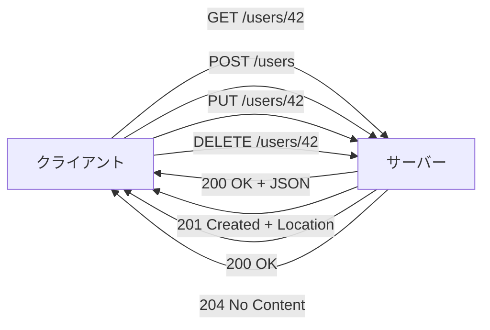
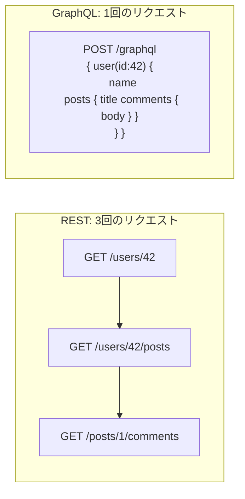
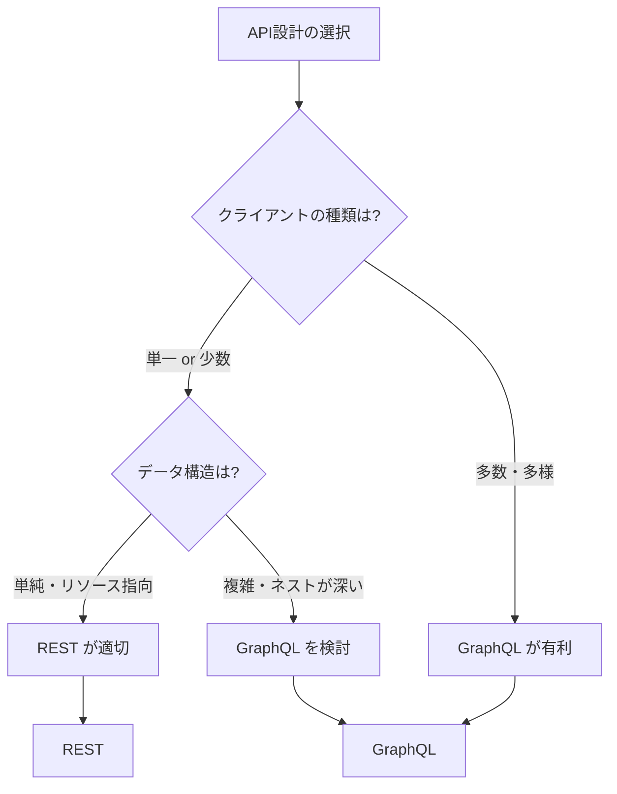

# API設計（REST / GraphQL）

> **一言で言うと:** フロントエンドとバックエンドの間の「契約」を定義する設計手法。RESTはHTTPの意味論を活用するリソース指向の設計哲学、GraphQLはクライアントが必要なデータだけを宣言的に取得するクエリ言語。**契約の良し悪し**がチームのスケーラビリティとシステムの進化可能性を決める。

## 3分で全体像

- **何を解決する技術か:** フロントとバック・モバイルアプリ・外部システムの間の「どの URL に何を送ると何が返ってくるか」を一貫したルールで規定する。エンドポイントの属人化、クライアントごとの専用 API 乱立、バージョンアップで何が壊れるか分からない問題を防ぐ
- **代表的な使用シーン:** Web アプリの公開 API、モバイルアプリ用 BFF、マイクロサービス間通信、外部開発者向け公開 API、管理画面用 API、Webhook の受信契約
- **これだけは覚える3つ:**
    1. **REST はリソース指向 + HTTP セマンティクス** — 名詞 (`/users/42`) × 動詞 (GET/POST/PUT/PATCH/DELETE)。ステータスコード (200/201/204/4xx/5xx) で結果を伝える。`/getUser` のような RPC 風 URL は REST にはならない（→ [[RESTとRPC|RPC との違いと現代の RPC 選択肢]]）
    2. **GraphQL は単一エンドポイント + スキーマ駆動** — `POST /graphql` 1 本にクエリを送り、クライアントが必要なフィールドだけを宣言的に取得。Over-fetching / Under-fetching を解消する代わりに、HTTPキャッシュ・ファイルアップロード・N+1 などの新しい複雑性を抱える
    3. **どちらを選ぶかはクライアント特性で決まる** — 単一クライアント・シンプル CRUD なら REST、多様なクライアント (Web / iOS / Android で必要なフィールドが違う) ・ネストが深い・1画面で多リソース表示なら GraphQL。**「上位互換ではない」**、トレードオフ
- **AIに任せやすいか:** **任せやすい** — REST のリソース定義・GraphQL スキーマ・リゾルバ・OpenAPI 自動生成は AI が高品質に書ける。ただし「**ステータスコードの選択**」「**ペイロード構造（フラット vs エンベロープ）**」「**バージョニング戦略**」「**N+1 / DataLoader 対応**」「**ページネーション方式（offset vs cursor）**」は設計判断で、`/review-ai-code` で「全部 200 を返している」「PUT を部分更新に使っている」などを必ず検出する
- **詰まったらここを読む:** [[ルーティングとミドルウェア]] / [[エラーハンドリング]] / [[OpenAPIとスキーマ駆動開発]]

## なぜ必要か

Webアプリケーションでは、フロントエンドとバックエンドが別プロセス（多くの場合別サーバー）として動く。この2つを繋ぐインターフェースが定義されていなければ、次のことが起きる。

- フロント開発者とバック開発者が**毎回口頭で仕様を確認**しなければならない
- エンドポイントの命名・レスポンス形式・エラー表現が**開発者ごとにバラバラ**になる
- クライアント（モバイルアプリ、外部サービス）が増えるたびに**専用のエンドポイントを作り続ける**羽目になる
- バージョンアップ時に**何が壊れるか予測できない**

API設計とは「どのURLに何を送ると何が返ってくるか」を一貫したルールで定義することであり、チームのスケーラビリティとシステムの進化可能性を左右する。

## どの問題を解決するか

### RESTが解決する問題

REST（Representational State Transfer）は、HTTPプロトコルが持つ意味論（メソッド・ステータスコード・ヘッダ）をそのまま活かしてAPIを設計する思想。

| 課題 | RESTによる解決 |
|------|---------------|
| エンドポイント設計が属人的 | リソース（名詞）× HTTPメソッド（動詞）の規約で統一 |
| キャッシュが効かない | GETはべき等 → HTTPキャッシュ機構がそのまま使える |
| クライアントとサーバーの密結合 | ステートレスで疎結合を実現（理論上はHATEOASも含むが実務での採用は少ない） |
| 操作の安全性が不明 | メソッドの意味論（GET=安全、PUT=べき等、POST=非べき等）で明示 |


```mermaid
flowchart LR
    C[クライアント] -->|"GET /users/42"| S[サーバー]
    S -->|"200 OK + JSON"| C
    C -->|"POST /users"| S
    S -->|"201 Created + Location"| C
    C -->|"PUT /users/42"| S
    S -->|"200 OK"| C
    C -->|"DELETE /users/42"| S
    S -->|"204 No Content"| C
```

### GraphQLが解決する問題

GraphQLは、RESTの**Over-fetching**（不要なデータまで返る）と**Under-fetching**（1画面に必要なデータが複数リクエストに分散する）という2つの問題を解決するために生まれた。

| 課題 | GraphQLによる解決 |
|------|-----------------|
| Over-fetching（データの取りすぎ） | クライアントが必要なフィールドだけを指定する |
| Under-fetching（1画面の表示に複数リクエストが必要） | 1リクエストで関連リソースをネストして取得 |
| クライアントごとに異なるデータ要件 | 同一スキーマに対して異なるクエリを発行 |
| APIバージョニングの難しさ | フィールドの非推奨（`@deprecated`）で段階的に移行 |


```mermaid
flowchart LR
    subgraph REST["REST: 3回のリクエスト"]
        R1["GET /users/42"] --> R2["GET /users/42/posts"]
        R2 --> R3["GET /posts/1/comments"]
    end
    subgraph GQL["GraphQL: 1回のリクエスト"]
        G1["POST /graphql<br/>{ user(id:42) {<br/>  name<br/>  posts { title comments { body } }<br/>} }"]
    end
```

### REST vs GraphQL の選択基準


```mermaid
graph TD
    A["API設計の選択"] --> B{"クライアントの種類は?"}
    B -->|"単一 or 少数"| C{"データ構造は?"}
    B -->|"多数・多様"| D["GraphQL が有利"]
    C -->|"単純・リソース指向"| E["REST が適切"]
    C -->|"複雑・ネストが深い"| F["GraphQL を検討"]
    E --> G["REST"]
    F --> H["GraphQL"]
    D --> H
```

| 観点 | REST | GraphQL |
|------|------|---------|
| 学習コスト | 低い（HTTP知識で十分） | 高い（スキーマ定義言語、リゾルバ） |
| キャッシュ | HTTPキャッシュがそのまま使える | クエリ単位のキャッシュが必要（複雑） |
| ファイルアップロード | 標準的（multipart） | 仕様外（別途対応が必要） |
| エラーハンドリング | HTTPステータスコードで表現 | 慣習的に常に200を返し、`errors`フィールドで表現（仕様上の強制ではない） |
| リアルタイム | [[WebSocket]]等を別途実装 | Subscription で統合的に対応 |
| ツールエコシステム | 成熟（[[OpenAPIとスキーマ駆動開発]]、内部文法は [[JSON-Schema\|JSON Schema]]） | 成長中（GraphiQL, Apollo Studio） |

## 他の仕組みとどう関係するか

- **下位レイヤーとの関係:**
  - [[HTTP-HTTPS]] — RESTはHTTPメソッド・ステータスコード・ヘッダの意味論を前提に設計される。GraphQLもHTTP上で動作するが、通常`POST /graphql`の単一エンドポイントのみを使う
  - [[TCP-IP]] — APIのレスポンスサイズやリクエスト回数は、TCPのスロースタートや接続コストに影響する。GraphQLの「1リクエストで必要なデータを全て取得」はTCPレベルの効率にも寄与する

- **同レイヤーとの関係:**
  - [[ルーティングとミドルウェア]] — RESTfulなURLはルーティング構造にそのまま反映される（`GET /users/:id`）。GraphQLでは単一エンドポイントにルーティングし、内部のリゾルバが処理を分岐する
  - [[認証と認可]] — APIエンドポイントごとの認可制御はRESTの方が直感的（ルートグループ + ミドルウェア）。GraphQLではフィールドレベルの認可をリゾルバやディレクティブで制御する
  - [[エラーハンドリング]] — RESTはHTTPステータスコードでエラーの種類を表現する。GraphQLでは`errors`配列にエラー情報を格納し、部分的成功（一部フィールドのみエラー）を表現できる
  - [[バリデーション]] — リクエストボディ（[[ペイロード]]）のバリデーションはREST/GraphQL共通の関心事。GraphQLはスキーマによる型レベルのバリデーションが自動で行われる点が強み
  - 外部APIの統合例として、[[StripeによるSaaS決済実装]]ではRESTful APIの実践的な消費パターン（Webhook、冪等性キー、署名検証）を扱う
  - 外部 API を呼び出す際は、[[SDKとAPIクライアント|SDK（API クライアントライブラリ）]]を活用することで、認証・リトライ・型安全性をライブラリに委譲できる

- **上位レイヤーとの関係:**
  - [[Layer5-パフォーマンス/_index|パフォーマンス]] — Over-fetchingはネットワーク帯域の無駄、Under-fetchingはレイテンシの増大。適切なAPI設計はパフォーマンスに直結する
  - [[Layer6-セキュリティ/_index|セキュリティ]] — GraphQLの柔軟なクエリは悪意あるクエリ（深いネスト、大量フィールド）によるDoS攻撃のリスクがある。クエリの深さ制限・コスト分析が必要
  - [[Layer7-設計アーキテクチャ/_index|設計・アーキテクチャ]] — API設計はシステムのモジュール分割に直結する。マイクロサービスでは[[API-Gateway|API Gateway]]がエントリポイントとなり、サービス間のAPIが内部契約として機能する。設計の良し悪しがシステム全体の進化可能性を決める

## 誤解されやすいポイント

1. **「RESTful = CRUDマッピングのこと」という誤解**
   `GET/POST/PUT/DELETE`をリソースに対応させるのはREST設計の一部でしかない。RESTの本質はリソースの表現をステートレスにやり取りすることであり、HATEOAS（レスポンスに次のアクション可能なリンクを含める）まで含めたのがRoy Fieldingの原論文での定義。ただし実務では、HATEOASまで厳密に実装するプロジェクトは少なく、「リソース指向 + HTTPメソッドの適切な使用」がプラグマティックなRESTとして広く受け入れられている。そもそも REST と対になる「RPC」とは何で、現代でも gRPC・tRPC として選ばれる場面があることは [[RESTとRPC]] にまとめている。

2. **「GraphQLはRESTの上位互換」という誤解**
   GraphQLはOver-fetching/Under-fetching問題を解決するが、HTTPキャッシュの恩恵を受けにくい、ファイルアップロードが標準で対応していない、クエリが複雑になるとN+1問題がバックエンド側で発生する（DataLoaderが必要）など、RESTにはないトレードオフを抱えている。シンプルなCRUDアプリケーションではRESTの方が適切な場合が多い。

3. **「PUTとPATCHは同じ」という誤解**
   PUTはリソースの**完全な置き換え**（送らなかったフィールドはnullになる）、PATCHは**部分更新**（送ったフィールドだけ変更）。この違いを無視すると、PUTで意図せずフィールドが消えるバグが発生する。

4. **「ステータスコードは200と500だけで十分」という誤解**
   `200 OK`で全てを返し、ボディ内の`success: false`でエラーを表現するのはアンチパターン。HTTPクライアントやプロキシはステータスコードを見て動作を変えるため（リトライ、キャッシュ、アラート）、適切なステータスコードの使い分けがシステム全体の振る舞いを改善する。

5. **「GraphQLのスキーマは後から作ればいい」という誤解**
   GraphQLの最大の強みはスキーマ駆動開発（Schema-First Development）にある。スキーマを先に定義することで、フロントエンドとバックエンドが並行して開発できる。スキーマなしに実装を始めると、RESTの「エンドポイント乱立」と同じ問題がリゾルバレベルで再発する。

## 設計のベストプラクティス

### REST設計の原則

- **リソースは名詞で、操作はHTTPメソッドで表現する** — `POST /sendEmail` ではなく `POST /emails`。動詞をURLに含めない
- **コレクションとアイテムを区別する** — `GET /users`（一覧）vs `GET /users/42`（個別）
- **適切なステータスコードを返す** — 200（成功）、201（作成）、204（内容なし）、400（不正リクエスト）、401（未認証）、403（権限なし）、404（未検出）、409（競合）、422（処理不能）
- **[[ページネーション]]を最初から設計する** — コレクションは必ずページネーション対応にする。`?page=2&per_page=20` または [[カーソルベースページネーション|カーソルベース]] `?cursor=xxx&limit=20`
- **バージョニング戦略を決める** — URLパス（`/v1/users`）、ヘッダ（`Accept: application/vnd.api.v1+json`）、クエリパラメータ（`?version=1`）のいずれか。URLパスが最もシンプルで広く使われる

### GraphQL設計の原則

- **スキーマ駆動で開発する** — スキーマを先に定義し、フロントとバックが並行開発する
- **DataLoaderでN+1問題を防ぐ** — リゾルバが個別にDBクエリを発行するとN+1問題が発生する。DataLoaderでバッチ処理する
- **クエリの深さ・コストを制限する** — 悪意あるクエリや非効率なクエリを制限する（深さ制限、コスト分析）
- **Mutationの入力はInput型でまとめる** — `createUser(name: String, email: String)` ではなく `createUser(input: CreateUserInput!)`
- **エラーはunion型で表現する** — GraphQLの`errors`配列だけでなく、戻り値の型としてエラーを表現すると型安全性が向上する

### 共通のアンチパターン

- **APIレスポンスに内部実装を露出する** — DBのカラム名やスタックトレースをそのまま返さない
- **全フィールドを常に返す** — RESTでもsparse fieldsetsを検討する（`?fields=name,email`）
- **認証情報をクエリパラメータに含める** — URLはログに残るため、トークンはヘッダ（`Authorization: Bearer xxx`）で送る
- **ネストしたリソースのURLが深すぎる** — `/orgs/1/teams/2/members/3/roles` は過度。2階層程度に抑える

## AIエージェントとの協働

> このトピックでAIコーディングエージェント（Claude Code, Copilot, Cursor 等）と協働するための観点。
> リソース定義・スキーマ・リゾルバ・OpenAPI 自動生成は AI に任せやすい一方、**「ステータスコード選択」「PUT/PATCH 区別」「ページネーション方式」「GraphQL の N+1 / クエリ深さ制限」** は設計判断で誤りやすい。レビューも `/review-ai-code` で横断アンチパターン照合に任せられる。

### AIに任せられる部分 / 人間が判断すべき部分

| タスク種類 | 任せ方（実装/レビュー） | 人間の関与 |
|---|---|---|
| RESTful なリソース URL 設計 | AI に複数案を出させる | リソース粒度・ネストの深さ・バージョニング戦略 (`/v1/` vs ヘッダ) は要件で決める |
| OpenAPI / GraphQL SDL の記述 | AI に任せる | 公開 API か内部 API か、後方互換性のスタンスはチーム判断 |
| Express / Chi / Laravel / Rails のリソースコントローラ実装 | AI 実装、`/review-ai-code` でレビュー | ステータスコード（201/204/422/409 など）の使い分けは AI が誤りやすい |
| ページネーション実装 | AI に offset/cursor 両案を出させる | ソート順・データ更新頻度・パフォーマンス要件で選定 |
| GraphQL リゾルバ + DataLoader | AI 実装 | N+1 検出と batch サイズ調整は実データで検証 |
| エラーレスポンス JSON 構造 | AI が RFC 9457 / GraphQL errors 配列の素案 | レスポンスエンベロープ（フラット vs `{data, meta}`）はチーム規約 |
| Mutation 入力 Input 型設計 | AI に任せる | 入力の必須・任意、デフォルト値、列挙値はビジネス要件 |

### AI生成コードのレビュー観点（このトピック固有）

AI生成の API コードを受け取ったとき、最低限ここを見る。

1. **ステータスコードと HTTP メソッドの使い分け** — 全部 200 で返していないか、作成は 201 + Location ヘッダになっているか、削除は 204 か、PUT を部分更新に使っていないか（PUT は完全置換、PATCH が部分更新）。`{success: false}` を 200 で返すパターンはアンチパターンで、HTTPクライアント・プロキシ・モニタリングが正しく動かない
2. **ページネーションが最初から組み込まれているか** — コレクション系エンドポイント (`GET /users`) でページネーションがないと、データ増加時に必ずタイムアウトする。offset/limit と cursor の選択も重要：頻繁に更新されるデータには cursor、安定したデータには offset
3. **GraphQL の N+1 / クエリ深さ制限の有無** — `User { posts { comments { author { posts { ... } } } } }` のような深いネストを許す GraphQL は、リゾルバが愚直に書かれていると N+1 を引き起こす。DataLoader の導入と、クエリの深さ・複雑度（cost analysis）の制限がないと、悪意あるクエリ 1 発で DB が落ちる

### 効くプロンプトの型

このトピックに関する実装をAIに依頼するとき、コンテキストとして渡すべき情報・制約・成功基準のテンプレ。

```
# 前提（プロジェクトの状況・既存のコード規約）
- API スタイル: REST / GraphQL（必要なら両方）
- フレームワーク: Express / Chi / Laravel 11 / Rails 7.1 / Apollo Server
- バージョニング: URL パス /v1/ / Accept ヘッダ
- ペイロードエンベロープ: { data, meta } / フラット
- ページネーション: offset+limit / カーソルベース（適用条件を明記）
- 認証: Authorization: Bearer ヘッダ / Cookie セッション
- エラーフォーマット: { error: { code, message, requestId, details } }

# やってほしいこと
- 「{要件}」のリソース設計とエンドポイント実装
- OpenAPI / GraphQL SDL での契約定義
- ページネーション・並べ替え・フィルタリングの仕様

# 守ってほしい制約（このトピック固有のもの）
- リソース URL は名詞のみ（/getUser のような動詞 URL 禁止）
- ステータスコード: 200/201/204/400/401/403/404/409/422/429/500/503 を正しく使い分け
- POST 作成時は 201 + Location ヘッダ
- DELETE 成功時は 204 (No Content)
- PUT は完全置換、部分更新は PATCH
- コレクションは必ずページネーション（offset+limit or cursor）
- 機密情報をクエリパラメータに含めない（ヘッダで送る）
- レスポンスに DB カラム名・スタックトレース・SQL を露出しない
- ネストは2階層程度に抑える（/orgs/1/teams/2/members/3 は深すぎ）
- GraphQL では DataLoader で N+1 防止、クエリ深さ・コスト制限を設定
- バージョニング戦略を明示（破壊的変更は新バージョンで提供）

# 完了の判断基準
- ステータスコードがクライアントのリトライ・キャッシュ判断に使える
- N+1 が EXPLAIN ANALYZE で検出されない
- ページネーションなしで全件返るエンドポイントがない
- OpenAPI / SDL からクライアント SDK が自動生成できる
```

### AI実装のアンチパターン

LLM生成コードで頻出する過剰設計・誤用パターン。レビュー時の照合表として使う。

| アンチパターン | なぜ問題か | レビュー観点 / 対策 |
|---|---|---|
| 全エンドポイントで 200 を返し `{success: false}` でエラー表現 | HTTPクライアント・プロキシ・モニタリングが正しく動かない、リトライ判定不能 | ステータスコードを正しく使い分け（4xx/5xx） |
| RPC風URL (`/getUser`, `/createUser`, `/updateUser`) | RESTの利点（HTTPセマンティクス・キャッシュ）が消失 | リソース名詞 + HTTPメソッドに統一 |
| PUT を部分更新に使う | 送らなかったフィールドが null になる仕様で意図せずデータ消失 | 完全置換は PUT、部分更新は PATCH |
| コレクションエンドポイントにページネーションがない | データ増加でタイムアウト・OOM・ネットワーク帯域圧迫 | 最初から `?page&limit` または `?cursor&limit` を組み込む |
| `success: true` `timestamp` `version` 等の冗長エンベロープ | レスポンスサイズ増、パース複雑化、契約変更時に全体波及 | 必要最小限の `{data, meta}` か、フラットレスポンス + ヘッダで補助 |
| DBカラム名・スタックトレース・SQL をレスポンスに露出 | 内部実装漏洩、攻撃面の特定 | API Resource / Serializer で整形、エラーは汎用メッセージ |
| GraphQL リゾルバが個別 SQL を発行（N+1） | 1 クエリで 100 件取得→各リレーションで 100 SQL→ レスポンス分単位 | DataLoader でバッチ化、本番投入前に EXPLAIN |
| GraphQL クエリの深さ・複雑度制限なし | 悪意あるクエリ（再帰ネスト）で DB が落ちる DoS | graphql-depth-limit / cost-analysis でクエリ予算制限 |
| GraphQL スキーマを DB 構造と 1:1 自動生成 | 内部構造の API 露出、DB 変更が API 破壊的変更に直結 | ドメインモデルベースで設計、内部構造とは独立 |
| URL に動詞・認証情報・クエリで PII を含める | ログに残り、リファラ送信時に他サイトへ漏洩 | 認証はヘッダ、PII はボディ、URL はリソース指向 |
| 認証エラーを 404 で返す（リソース存在を隠す名目で） | クライアントが「未認証」「権限不足」「不在」を区別できない | 401/403/404 を正しく使い分け、必要なら情報量を限定したメッセージで |
| ネストが深いリソース URL (`/orgs/1/teams/2/members/3/roles`) | URL の意味解釈が複雑、URL文字数制限のリスク | 2 階層程度。深いリレーションはトップレベルリソースに昇格 |
| バージョニング戦略がない / 破壊的変更を本番で混入 | 既存クライアントが壊れる、ロールバック不能 | `/v1/` パス or ヘッダで明示、破壊的変更は新バージョンで提供 |

→ レイヤー横断のアンチパターン索引: [[_anti-patterns/_index|AIアンチパターン索引]] / [[_anti-patterns/レイヤー別/Layer4-Backend|Layer 4 Backend アンチパターン集]]

## 具体例

### REST API — Express（Node.js）

> Express 4 / 5 共通動作。Express **5.0 が 2024-10 GA** で現在は v5 が安定版。`async function` 内の throw が自動的にエラーミドルウェアに到達するようになった等の破壊的変更があるが、本サンプルは同期ハンドラのため両バージョンで動作する。

```javascript
const express = require('express');
const app = express();
app.use(express.json());

// インメモリストア（デモ用）
let users = [
  { id: 1, name: 'Alice', email: 'alice@example.com' },
  { id: 2, name: 'Bob', email: 'bob@example.com' },
];
let nextId = 3;

// GET /users — ユーザー一覧（ページネーション付き）
app.get('/users', (req, res) => {
  const page = parseInt(req.query.page) || 1;
  const limit = parseInt(req.query.limit) || 10;
  const start = (page - 1) * limit;
  const paginated = users.slice(start, start + limit);

  res.json({
    data: paginated,
    meta: { page, limit, total: users.length },
  });
});

// GET /users/:id — ユーザー詳細
app.get('/users/:id', (req, res) => {
  const user = users.find(u => u.id === parseInt(req.params.id));
  if (!user) return res.status(404).json({ error: 'User not found' });
  res.json(user);
});

// POST /users — ユーザー作成
app.post('/users', (req, res) => {
  const { name, email } = req.body;
  if (!name || !email) {
    return res.status(422).json({ error: 'name and email are required' });
  }
  const user = { id: nextId++, name, email };
  users.push(user);
  res.status(201).location(`/users/${user.id}`).json(user);
});

// PUT /users/:id — ユーザーの完全置き換え
app.put('/users/:id', (req, res) => {
  const index = users.findIndex(u => u.id === parseInt(req.params.id));
  if (index === -1) return res.status(404).json({ error: 'User not found' });

  const { name, email } = req.body;
  if (!name || !email) {
    return res.status(422).json({ error: 'name and email are required' });
  }
  users[index] = { id: users[index].id, name, email };
  res.json(users[index]);
});

// DELETE /users/:id — ユーザー削除
app.delete('/users/:id', (req, res) => {
  const index = users.findIndex(u => u.id === parseInt(req.params.id));
  if (index === -1) return res.status(404).json({ error: 'User not found' });
  users.splice(index, 1);
  res.status(204).end();
});

app.listen(3000);
```

### GraphQL API — Apollo Server（Node.js）

> **Apollo Server バージョン:** Apollo Server **v4 は 2026-01-22 に EOL**。本コードは **Apollo Server 5（2025年GA）** 想定。v4 と v5 は API がほぼ互換だが、v5 では Node.js 20 以降が必須となり、内部の Express 依存も Express 5 ベースに切り替わった。新規導入は v5 を選ぶ。

```javascript
// Apollo Server 5
const { ApolloServer } = require('@apollo/server');
const { startStandaloneServer } = require('@apollo/server/standalone');

// スキーマ定義（Schema-First）
const typeDefs = `#graphql
  type User {
    id: ID!
    name: String!
    email: String!
    posts: [Post!]!
  }

  type Post {
    id: ID!
    title: String!
    author: User!
  }

  type Query {
    user(id: ID!): User
    users(limit: Int = 10, offset: Int = 0): [User!]!
  }

  input CreateUserInput {
    name: String!
    email: String!
  }

  type Mutation {
    createUser(input: CreateUserInput!): User!
  }
`;

// デモ用データ
const users = [
  { id: '1', name: 'Alice', email: 'alice@example.com' },
  { id: '2', name: 'Bob', email: 'bob@example.com' },
];
const posts = [
  { id: '1', title: 'GraphQL入門', authorId: '1' },
  { id: '2', title: 'REST設計ガイド', authorId: '1' },
  { id: '3', title: 'Node.js実践', authorId: '2' },
];

// リゾルバ
const resolvers = {
  Query: {
    user: (_, { id }) => users.find(u => u.id === id),
    users: (_, { limit, offset }) => users.slice(offset, offset + limit),
  },
  Mutation: {
    createUser: (_, { input }) => {
      const user = { id: String(users.length + 1), ...input };
      users.push(user);
      return user;
    },
  },
  // フィールドリゾルバ — 関連データの解決
  User: {
    posts: (parent) => posts.filter(p => p.authorId === parent.id),
  },
  Post: {
    author: (parent) => users.find(u => u.id === parent.authorId),
  },
};

const server = new ApolloServer({ typeDefs, resolvers });
startStandaloneServer(server, { listen: { port: 4000 } });
```

### Go — RESTful API（Chi）

```go
package main

import (
	"encoding/json"
	"net/http"
	"strconv"
	"sync"

	"github.com/go-chi/chi/v5"
)

type User struct {
	ID    int    `json:"id"`
	Name  string `json:"name"`
	Email string `json:"email"`
}

type UserStore struct {
	mu     sync.Mutex
	users  []User
	nextID int
}

func NewUserStore() *UserStore {
	return &UserStore{
		users: []User{
			{ID: 1, Name: "Alice", Email: "alice@example.com"},
		},
		nextID: 2,
	}
}

// writeJSON はレスポンスヘッダを設定してJSONを書き込むヘルパー
func writeJSON(w http.ResponseWriter, status int, v any) {
	w.Header().Set("Content-Type", "application/json")
	w.WriteHeader(status)
	json.NewEncoder(w).Encode(v)
}

func main() {
	store := NewUserStore()
	r := chi.NewRouter()

	r.Route("/users", func(r chi.Router) {
		r.Get("/", store.List)
		r.Post("/", store.Create)
		r.Route("/{id}", func(r chi.Router) {
			r.Get("/", store.Get)
			r.Put("/", store.Update)
			r.Delete("/", store.Delete)
		})
	})

	http.ListenAndServe(":3000", r)
}

func (s *UserStore) List(w http.ResponseWriter, r *http.Request) {
	s.mu.Lock()
	defer s.mu.Unlock()
	writeJSON(w, http.StatusOK, s.users)
}

func (s *UserStore) Get(w http.ResponseWriter, r *http.Request) {
	id, err := strconv.Atoi(chi.URLParam(r, "id"))
	if err != nil {
		http.Error(w, `{"error":"invalid id"}`, http.StatusBadRequest)
		return
	}
	s.mu.Lock()
	defer s.mu.Unlock()
	for _, u := range s.users {
		if u.ID == id {
			writeJSON(w, http.StatusOK, u)
			return
		}
	}
	http.Error(w, `{"error":"not found"}`, http.StatusNotFound)
}

func (s *UserStore) Create(w http.ResponseWriter, r *http.Request) {
	var u User
	if err := json.NewDecoder(r.Body).Decode(&u); err != nil {
		http.Error(w, `{"error":"invalid body"}`, http.StatusBadRequest)
		return
	}
	s.mu.Lock()
	u.ID = s.nextID
	s.nextID++
	s.users = append(s.users, u)
	s.mu.Unlock()

	writeJSON(w, http.StatusCreated, u)
}

func (s *UserStore) Update(w http.ResponseWriter, r *http.Request) {
	id, err := strconv.Atoi(chi.URLParam(r, "id"))
	if err != nil {
		http.Error(w, `{"error":"invalid id"}`, http.StatusBadRequest)
		return
	}
	var input User
	if err := json.NewDecoder(r.Body).Decode(&input); err != nil {
		http.Error(w, `{"error":"invalid body"}`, http.StatusBadRequest)
		return
	}
	s.mu.Lock()
	defer s.mu.Unlock()
	for i, u := range s.users {
		if u.ID == id {
			s.users[i] = User{ID: id, Name: input.Name, Email: input.Email}
			writeJSON(w, http.StatusOK, s.users[i])
			return
		}
	}
	http.Error(w, `{"error":"not found"}`, http.StatusNotFound)
}

func (s *UserStore) Delete(w http.ResponseWriter, r *http.Request) {
	id, err := strconv.Atoi(chi.URLParam(r, "id"))
	if err != nil {
		http.Error(w, `{"error":"invalid id"}`, http.StatusBadRequest)
		return
	}
	s.mu.Lock()
	defer s.mu.Unlock()
	for i, u := range s.users {
		if u.ID == id {
			s.users = append(s.users[:i], s.users[i+1:]...)
			w.WriteHeader(http.StatusNoContent)
			return
		}
	}
	http.Error(w, `{"error":"not found"}`, http.StatusNotFound)
}
```

### Laravel（PHP）— RESTful API Resource Controller

```php
// routes/api.php — 宣言的ルーティング
// 1行で5つのルート（index, store, show, update, destroy）が生成される
use App\Http\Controllers\UserController;

Route::apiResource('users', UserController::class);
// 生成されるルート:
// GET    /api/users          → index
// POST   /api/users          → store
// GET    /api/users/{user}   → show
// PUT    /api/users/{user}   → update
// DELETE /api/users/{user}   → destroy
```

```php
// app/Http/Resources/UserResource.php — API Resourceでレスポンス変換
namespace App\Http\Resources;

use Illuminate\Http\Resources\Json\JsonResource;

class UserResource extends JsonResource
{
    public function toArray($request): array
    {
        return [
            'id'    => $this->id,
            'name'  => $this->name,
            'email' => $this->email,
            // DBカラム名をそのまま露出せず、APIの契約として整形する
            'created_at' => $this->created_at->toIso8601String(),
        ];
    }
}
```

```php
// app/Http/Controllers/UserController.php — Resource Controller
namespace App\Http\Controllers;

use App\Http\Resources\UserResource;
use App\Models\User;
use Illuminate\Http\Request;

class UserController extends Controller
{
    // GET /api/users — 一覧（ページネーション付き）
    public function index()
    {
        // paginate() で自動的に page, per_page パラメータに対応
        return UserResource::collection(User::paginate(15));
    }

    // GET /api/users/{user} — 詳細（Route Model Binding で自動取得）
    public function show(User $user)
    {
        return new UserResource($user);
    }

    // POST /api/users — 作成
    public function store(Request $request)
    {
        $validated = $request->validate([
            'name'  => 'required|string|max:255',
            'email' => 'required|email|unique:users',
        ]);

        $user = User::create($validated);

        return (new UserResource($user))
            ->response()
            ->setStatusCode(201);
    }

    // PUT /api/users/{user} — 完全置き換え
    public function update(Request $request, User $user)
    {
        $validated = $request->validate([
            'name'  => 'required|string|max:255',
            'email' => 'required|email|unique:users,email,' . $user->id,
        ]);

        $user->update($validated);

        return new UserResource($user);
    }

    // DELETE /api/users/{user} — 削除
    public function destroy(User $user)
    {
        $user->delete();

        return response()->noContent(); // 204
    }
}
```

### Ruby on Rails — RESTful API

```ruby
# config/routes.rb — resources ルーティング
Rails.application.routes.draw do
  namespace :api do
    namespace :v1 do
      resources :users, only: [:index, :show, :create, :update, :destroy]
      # 生成されるルート:
      # GET    /api/v1/users          → api/v1/users#index
      # POST   /api/v1/users          → api/v1/users#create
      # GET    /api/v1/users/:id      → api/v1/users#show
      # PATCH  /api/v1/users/:id      → api/v1/users#update
      # DELETE /api/v1/users/:id      → api/v1/users#destroy
    end
  end
end
```

```ruby
# app/controllers/api/v1/users_controller.rb — API モードコントローラ
module Api
  module V1
    class UsersController < ApplicationController
      before_action :set_user, only: [:show, :update, :destroy]

      # GET /api/v1/users — 一覧（ページネーション付き）
      def index
        users = User.page(params[:page]).per(params[:per_page] || 15)
        render json: users, each_serializer: UserSerializer,
               meta: { total: User.count, page: users.current_page }
      end

      # GET /api/v1/users/:id — 詳細
      def show
        render json: @user, serializer: UserSerializer
      end

      # POST /api/v1/users — 作成
      def create
        user = User.new(user_params)
        if user.save
          render json: user, serializer: UserSerializer, status: :created
        else
          render json: { errors: user.errors.full_messages }, status: :unprocessable_entity
        end
      end

      # PUT/PATCH /api/v1/users/:id — 更新
      def update
        if @user.update(user_params)
          render json: @user, serializer: UserSerializer
        else
          render json: { errors: @user.errors.full_messages }, status: :unprocessable_entity
        end
      end

      # DELETE /api/v1/users/:id — 削除
      def destroy
        @user.destroy
        head :no_content  # 204
      end

      private

      def set_user
        @user = User.find(params[:id])
      end

      def user_params
        params.require(:user).permit(:name, :email)
      end
    end
  end
end
```

```ruby
# app/serializers/user_serializer.rb — レスポンス整形
# ActiveModel::Serializer を利用（gem 'active_model_serializers'）
class UserSerializer < ActiveModel::Serializer
  attributes :id, :name, :email, :created_at

  # DBカラムをそのまま露出せず、API契約として整形する
  def created_at
    object.created_at.iso8601
  end
end
```

```ruby
# jbuilder を使う場合のレスポンス例（gem 'jbuilder'）
# app/views/api/v1/users/show.json.jbuilder
json.extract! @user, :id, :name, :email
json.created_at @user.created_at.iso8601

# app/views/api/v1/users/index.json.jbuilder
json.data @users do |user|
  json.extract! user, :id, :name, :email
  json.created_at user.created_at.iso8601
end
json.meta do
  json.total @users.total_count
  json.page  @users.current_page
end
```

## 参考リソース

- Roy Fielding の博士論文 — REST の原典。「Architectural Styles and the Design of Network-based Software Architectures」
- 「Web API: The Good Parts」（オライリー）— REST API設計の実践ガイド
- GraphQL 公式ドキュメント — スキーマ定義、クエリ、ミューテーションの基礎
- OpenAPI (Swagger) Specification — REST APIのスキーマ記述標準
- Apollo GraphQL ドキュメント — GraphQLサーバー/クライアントの実装ガイド

## 理解度セルフチェック

> 答えられなければ本文に戻る。答えはこのファイル内に必ずある。

1. **「GraphQL は REST の上位互換」が誤りである理由を、30秒で説明せよ。** GraphQL がトレードオフとして抱える問題を最低2つ挙げること。
2. **「PUT と PATCH は同じ」と思っている同僚に違いを説明するとしたら、どう説明するか?** 違いを無視するとどんなバグが起きるか、具体例を挙げて述べよ。
3. **AI生成コードレビュー設問:** AI が以下の Express ベースの REST API を生成した。本文の観点で **問題点を最低3つ** 指摘せよ。

```javascript
const express = require('express');
const app = express();
app.use(express.json());

// ユーザー一覧 (全件取得)
app.get('/getUsers', async (req, res) => {
  const users = await db.query('SELECT * FROM users');
  res.status(200).json({
    success: true,
    data: users,
    timestamp: new Date(),
    version: '1.0.0',
  });
});

// ユーザー作成
app.post('/createUser', async (req, res) => {
  try {
    const user = await db.users.create(req.body);
    res.status(200).json({ success: true, data: user });
  } catch (e) {
    res.status(200).json({ success: false, error: e.stack, sql: e.sql });
  }
});

// ユーザー更新 (部分更新したい)
app.put('/updateUser/:id', async (req, res) => {
  // 送られたフィールドだけ更新したい
  const updates = req.body;
  await db.users.update(req.params.id, updates);
  res.status(200).json({ success: true });
});

// ユーザー削除
app.delete('/deleteUser/:id', async (req, res) => {
  await db.users.delete(req.params.id);
  res.status(200).json({ success: true, message: 'User deleted' });
});

// 認証エンドポイント
app.get('/login', async (req, res) => {
  // クエリパラメータでパスワードを受ける
  const { email, password } = req.query;
  const user = await db.users.findByEmailAndPassword(email, password);
  if (!user) {
    return res.status(404).json({ success: false, message: 'User not found' });
  }
  res.status(200).json({ success: true, token: 'jwt-token-here' });
});

app.listen(3000);
```

> [!note]- 解答の指針
>
> > [!info] 用語ミニ辞典
> > - **REST (Representational State Transfer):** Roy Fielding の博士論文で提唱されたアーキテクチャスタイル。リソースを URL で表現し、HTTP メソッドで操作することで、ステートレス・キャッシュ可能・統一インターフェースを実現する設計原則
> > - **GraphQL:** Facebook (Meta) が開発したクエリ言語。単一エンドポイント (`POST /graphql`) にクエリを送り、クライアントが必要なフィールドのみを宣言的に取得する。スキーマ駆動開発が前提
> > - **Over-fetching:** 必要以上のデータがレスポンスに含まれる現象。`GET /users/42` がプロフィール画像 URL だけ欲しい場合でも、住所・電話番号などすべて返ってくる
> > - **Under-fetching:** 1画面の表示に必要なデータが複数リクエストに分散する現象。ユーザ詳細画面で「ユーザ + 投稿一覧 + 各投稿のコメント数」を取るのに 3 回リクエストが必要、など
> > - **N+1 問題:** GraphQL リゾルバが愚直に書かれていると、親 1 件 + 子 N 件 = N+1 個の SQL クエリが発行される問題。DataLoader でバッチ化することで `IN (...)` の 2 クエリに集約できる
> > - **DataLoader:** GraphQL の N+1 を解消する標準ライブラリ。同一 tick 内のキー要求をバッチ化し、1 つの `IN (...)` クエリに統合する
> > - **べき等 (Idempotent):** 同じ操作を何回実行しても結果が同じになる性質。GET / PUT / DELETE は仕様上べき等で、リトライ可能。POST は非べき等で、リトライにはアプリ側の冪等キーが必要
> > - **PUT vs PATCH:** PUT はリソースの完全置換（送らなかったフィールドは null・デフォルト値になる）、PATCH は部分更新（送ったフィールドだけ変更）。RFC 5789 で PATCH が定義された
> > - **HATEOAS (Hypermedia as the Engine of Application State):** RESTの最高成熟度（Richardson Maturity Model Level 3）。レスポンスに次のアクションへのハイパーリンクを含める。実務での採用は少ない
> > - **エンベロープ vs フラット:** レスポンス構造の選択。`{data: {...}, meta: {...}}` がエンベロープ、リソースを直接返すのがフラット。一覧と単体でメタ情報の有無が違うため、エンベロープを使うかは設計判断
> > - **カーソルベースページネーション:** 「次のページのキー」をレスポンスに含める方式。データが頻繁に追加されても重複・欠落が起きにくい。Twitter API・GraphQL Relay 仕様で採用
>
> 1. GraphQL は REST の **「Over-fetching / Under-fetching」を解決する代わりに新しい複雑性を抱える** ため、上位互換ではない。具体的には: (a) **HTTPキャッシュが効きにくい** — REST の `GET` はメソッド・URL・ヘッダで一意に決まりプロキシ・CDN がそのままキャッシュできるが、GraphQL は `POST /graphql` 1 本にクエリ本文が異なるため標準的な HTTPキャッシュが効かず、Apollo Client の正規化キャッシュなど別途仕組みが必要、(b) **ファイルアップロードが標準仕様外** — multipart/form-data を扱うには `graphql-upload` のような追加仕様が必要で、エコシステムが分散、(c) **N+1 問題がバックエンド側で発生** — リゾルバが個別に DB を叩くため DataLoader が必須、(d) **クエリ深さ・コストの DoS リスク** — 悪意ある深いネストクエリで DB が落ちる、(e) **学習コストが高い** — スキーマ定義言語・リゾルバ・コンテキスト・DataLoader 等の概念が増える。シンプル CRUD で単一クライアントなら REST の方が適切で、選択は技術的優劣ではなくクライアント特性で決まる
> 2. PUT は **「リソースの完全置換」** で、PATCH は **「部分更新」**。具体例: `{name: "Alice", email: "alice@example.com", phone: "090-1234-5678"}` のユーザに対し、`PUT /users/1 {name: "Alice 2"}` を送ると、PUT のセマンティクス上は `{name: "Alice 2", email: null, phone: null}` になる（送らなかったフィールドはデフォルト値・null になる）。一方 `PATCH /users/1 {name: "Alice 2"}` なら `email`・`phone` は元の値のまま `name` だけ更新される。**違いを無視して PUT を部分更新に使う実装をすると**、(a) フロントが意図せず一部フィールドだけ送って他フィールドが消える、(b) RESTful クライアント（HTTP仕様準拠）が PUT 結果を「全フィールドが置き換わった」と仮定してキャッシュ更新するため挙動が壊れる、(c) ライブラリ生成のテストで「未送信フィールドが null になる」テストが書かれて期待と乖離する。ユーザ名変更程度なら PATCH、フォームの「全フィールド送信」前提なら PUT、と使い分ける。RFC 5789 で PATCH が定義されている
> 3. AI生成コードの問題点（最低限以下を指摘できれば本文を理解している）:
>     - **動詞 URL になっている (`/getUsers`, `/createUser`, `/updateUser`, `/deleteUser`, `/login`)** — RPC 風で REST の利点が消失。`/users` × HTTPメソッドに統一すべき
>     - **すべてのレスポンスが 200** — 作成は 201、削除は 204、エラーは 4xx/5xx を使い分ける必要がある。ステータスコードでリトライ・キャッシュ・モニタリングが動くため、HTTPセマンティクスを生かせていない
>     - **エラーレスポンスでも 200 + `{success: false}`** — クライアント・プロキシ・モニタリングが「成功」として扱う。正しくは 4xx/5xx
>     - **エラーレスポンスにスタックトレース・SQL を露出 (`error: e.stack, sql: e.sql`)** — 内部構造漏洩。本番では汎用メッセージ + requestId
>     - **POST `/createUser` で作成成功時のステータスが 200** — 作成は 201 Created + Location ヘッダ
>     - **PUT を部分更新の用途で使っている** — `send されたフィールドだけ更新` は PATCH の仕様。PUT は完全置換にすべきか、エンドポイントを PATCH に変更
>     - **DELETE 成功時に 200 + ボディを返している** — 一般に DELETE 成功は 204 No Content（ボディなし）
>     - **`/getUsers` にページネーションがない** — `SELECT * FROM users` で全件取得し、ユーザ数増加でタイムアウト・OOM
>     - **`SELECT *` を使っている** — カラム追加でレスポンス契約が崩れる、Index Only Scan が効かない、不要データ転送
>     - **`/login` が GET でクエリパラメータにパスワードを含む** — URL がアクセスログ・リファラ・ブラウザ履歴・プロキシログに残り、パスワードが永続的に漏洩。POST + ボディで送るべき。さらに HTTPS 必須
>     - **`/login` 失敗時に 404 で「User not found」** — アカウント列挙攻撃。「ログイン失敗」と統一し、ステータスは 401
>     - **冗長なエンベロープ (`success`, `timestamp`, `version`)** — レスポンスサイズ増・契約変更時に波及。version はヘッダで返すか OpenAPI で管理。timestamp はサーバ時刻が必要なら `Date` ヘッダで標準対応
>     - **バージョニング戦略がない (URL に `/v1/` がない)** — 破壊的変更が発生したときにクライアントを壊さず移行できない
>     - **エラーハンドリングが各ハンドラに散在** — `try-catch` を各ハンドラに書いている。エラーハンドリングミドルウェアで集約すべき（[[エラーハンドリング]]）

## 学習メモ

- RESTの「正しさ」にこだわりすぎない。Richardson Maturity Model のLevel 2（HTTPメソッドの適切な使用）まで実践できていれば実務上は十分
- GraphQLはバックエンド側の実装コスト（スキーマ定義、リゾルバ、DataLoader、クエリ制限）が高い。導入前にチームのスキルセットと問題の複雑さを検討する
- 社内APIはREST、[[Backend-For-Frontend|BFF（Backend for Frontend）]]パターンではGraphQLという使い分けも現実的
