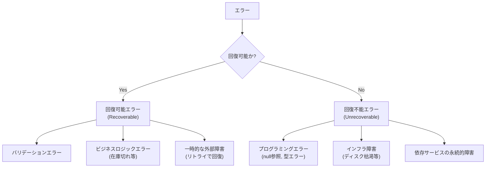
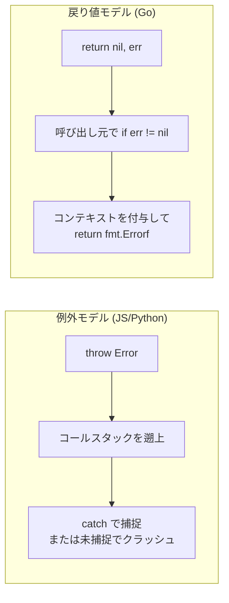
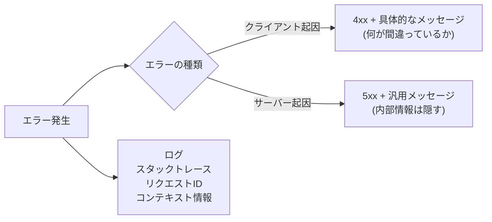

# エラーハンドリング

> **一言で言うと:** 「失敗は必ず起きる」という前提のもと、エラーを握りつぶさず、適切な粒度でキャッチし、ユーザーには分かりやすく・ログには詳細に記録する設計手法。

## なぜ必要か

本番環境では、あらゆるものが壊れる。DBが落ちる、外部APIがタイムアウトする、ユーザーが想定外の入力を送る、ディスクが埋まる。エラーハンドリングがなければ、次のことが起きる。

- アプリケーションが**無言でクラッシュ**し、ユーザーにはブラウザのデフォルトエラー画面が表示される
- エラーの**原因が特定できない** — どこで何が失敗したのかの情報が残っていない
- 部分的な処理が**中途半端な状態で放置**される（例：決済は完了したが在庫は減っていない）
- スタックトレースやDB情報が**ユーザーにそのまま表示**され、セキュリティホールになる
- 開発者が障害対応時に**再現も調査もできない**

エラーハンドリングとは「壊れたときにどう振る舞うか」を設計することであり、正常系の設計と同等に重要。

## どの問題を解決するか

### エラーの分類

エラーの性質を正しく分類することが、適切なハンドリングの第一歩。



| エラーの種類 | 例 | 適切な対応 |
|---|---|---|
| バリデーションエラー | 不正なメールアドレス | 400系レスポンスでフィールド単位のエラーを返す |
| ビジネスロジックエラー | 在庫切れ、残高不足 | 409 or 422 でドメイン固有のエラーコードを返す |
| 認証・認可エラー | トークン期限切れ | 401 / 403 で明確に区別する |
| 一時的な外部障害 | DB接続タイムアウト | リトライ（指数バックオフ）→ 503 Service Unavailable |
| プログラミングエラー | null参照、配列の範囲外 | ログに詳細を記録、500で汎用メッセージを返す |

### エラー伝播のモデル

言語・フレームワークによってエラーの伝播モデルが根本的に異なる。

| モデル | 言語/環境 | 特徴 |
|---|---|---|
| 例外（Exception） | JavaScript, Python, Java | `throw`で投げて`try-catch`で捕まえる。暗黙的に伝播する |
| 戻り値（Error as Value） | Go | 関数が`(result, error)`を返す。明示的にチェックする |
| Result型 | Rust, TypeScript(Effect等) | 型システムでエラーハンドリングを強制する |



### エラーレスポンスの設計

ユーザー向けのレスポンスと開発者向けのログは**情報量を分離**する。



## 他の仕組みとどう関係するか

- **下位レイヤーとの関係:**
  - [[HTTP-HTTPS]] — HTTPステータスコードはエラーハンドリングの「共通語彙」。4xx（クライアントエラー）と5xx（サーバーエラー）の区別が、リトライ戦略やアラート設定の基盤になる
  - [[TCP-IP]] — 接続タイムアウトやコネクションリセットなど、ネットワークレベルのエラーはアプリケーション層で適切にハンドリングする必要がある

- **同レイヤーとの関係:**
  - [[ルーティングとミドルウェア]] — エラーハンドリングミドルウェアはミドルウェアチェーンの最外層に配置し、下位で発生した例外を一括処理する。[[玉ねぎモデル]]の最も外側の層
  - [[認証と認可]] — 認証エラー（401）と認可エラー（403）は明確に区別する。混同するとセキュリティ上の情報漏洩（リソースの存在を示唆）やデバッグの困難さを招く
  - [[API設計-REST-GraphQL]] — RESTではHTTPステータスコードでエラーを表現し、GraphQLでは`errors`配列で表現する。APIのエラーレスポンス形式はクライアント開発者の体験を左右する
  - [[バリデーション]] — バリデーションエラーはエラーハンドリングの最も頻出するケース。フィールド単位の構造化されたエラーレスポンスが求められる

- **上位レイヤーとの関係:**
  - [[Layer5-パフォーマンス/_index|パフォーマンス]] — リトライ戦略（指数バックオフ）、サーキットブレーカー、タイムアウト設定は信頼性の根幹。エラーの発生率はモニタリング・オブザーバビリティの重要なシグナル
  - [[Layer6-セキュリティ/_index|セキュリティ]] — スタックトレースやDB情報をエラーレスポンスに含めると、攻撃者に内部構造を教えることになる。本番ではエラーの詳細を隠蔽し、ログにのみ記録する
  - [[Layer7-設計アーキテクチャ/_index|設計・アーキテクチャ]] — エラーハンドリングは横断的関心事であり、レイヤードアーキテクチャでは各層の責務に応じたエラー変換が必要

## 誤解されやすいポイント

1. **「try-catchで囲めばエラーハンドリングできている」という誤解**
   エラーを捕まえることと、エラーに適切に対応することは別。`catch`ブロックで`console.log(err)`だけ書いて処理を続行するのは「エラーの握りつぶし」であり、最悪のアンチパターン。捕まえたエラーに対して、リトライ・[[フォールバックとグレースフルデグラデーション|フォールバック]]・ユーザーへの通知・処理の中断のいずれかを行わなければ意味がない。

2. **「全ての例外をキャッチすべき」という誤解**
   プログラミングエラー（null参照、型エラー）を回復可能エラーと同じように`catch`して握りつぶすと、バグが隠蔽される。回復不能なエラーはクラッシュさせてログに残し、プロセスマネージャ（PM2、systemd等）に再起動させるのが正しい。

3. **「エラーメッセージは詳細であるほど良い」という誤解**
   ユーザー向けのレスポンスにスタックトレースやSQLクエリを含めるのはセキュリティリスク。**ユーザーには行動指針**（「しばらく待ってから再試行してください」）を、**ログには原因特定に必要な情報**（スタックトレース、リクエストID、入力値）を記録するのが正しい分離。

4. **「HTTPステータスコード 500 を返せばサーバーエラーの処理は完了」という誤解**
   500を返すだけでは、運用チームがエラーの内容を知ることができない。リクエストID（Correlation ID）を生成してレスポンスとログの両方に含め、ログにはエラーの詳細・リクエストコンテキスト・発生箇所を記録すること。

5. **「Goのerrorは面倒だから `_` で無視する」という誤解**
   Goの明示的なエラーハンドリングは冗長に見えるが、エラーが暗黙的に伝播しないことが利点。`_`でエラーを無視すると、例外を握りつぶすのと同じ問題が発生する。Goでは`fmt.Errorf("コンテキスト: %w", err)`でエラーをラップし、呼び出し元に文脈を伝える。

## 設計のベストプラクティス

### 推奨パターン

- **エラーハンドリングを集約する** — 各ハンドラで個別にtry-catchするのではなく、ミドルウェアまたはフレームワークのエラーハンドリング機構で一括処理する
- **構造化されたエラーレスポンスを返す** — `{ error: { code: "VALIDATION_ERROR", message: "...", details: [...] } }` のように、機械的に処理可能な形式にする
- **リクエストIDで追跡可能にする** — 全リクエストにユニークIDを付与し、レスポンスヘッダとログの両方に含める。障害時の調査速度が劇的に改善する
- **エラーにコンテキストを付与してラップする** — 「何をしている最中に」「どの入力に対して」エラーが起きたかを伝播する
- **リトライには指数バックオフを使う** — 固定間隔のリトライは障害中のサービスに負荷をかける。1s → 2s → 4s → 8s のように間隔を広げ、ジッター（ランダムな揺らぎ）を加える

### アンチパターン

- **エラーの握りつぶし** — `catch (e) {}` で何もしない。障害が見えなくなり、原因不明のデータ不整合を引き起こす
- **全てを500で返す** — クライアント起因のエラー（400系）とサーバー起因のエラー（500系）を区別しないと、リトライ戦略もアラートも正しく機能しない
- **エラーメッセージにユーザー入力をそのまま含める** — XSS（Reflected XSS）の原因になりうる。入力値はサニタイズしてからエラーメッセージに含める
- **同期処理と非同期処理でエラーハンドリングを統一しない** — Node.js 15以降では Promise の unhandled rejection がデフォルトでプロセスをクラッシュさせる（`--unhandled-rejections=throw` がデフォルト化）。旧来は警告のみだったため、古い記事のサンプルコードをそのまま流用すると本番で予期せぬクラッシュを招く

## AIによる実装のアンチパターン

| アンチパターン | なぜ問題か | 対策 |
|---|---|---|
| 全関数にtry-catchを個別配置 | エラーハンドリングの責務が分散し、一貫性がなくなる | ミドルウェアで集約処理する |
| エラー時に[[フォールバックとグレースフルデグラデーション|フォールバック値をでっち上げる]] | `catch { return [] }` のように空配列を返すと、エラーが隠蔽されデータ不整合の原因に | エラーを呼び出し元に伝播させ、適切なレイヤーで判断する |
| 過剰な防御的コーディング | あらゆる引数にnullチェック、存在チェックを追加すると可読性が壊滅する | 信頼境界（Trust Boundary）を明確にし、外部入力のみバリデーションする |
| スタックトレースをそのままレスポンスに含める | 内部構造の漏洩。攻撃者に依存ライブラリのバージョンやファイル構造を教える | 本番では汎用メッセージを返し、ログにのみ詳細を記録 |

## 具体例

### Express（Node.js）— エラーハンドリングミドルウェア

```javascript
const express = require('express');
const crypto = require('crypto');
const app = express();
app.use(express.json());

// カスタムエラークラス
class AppError extends Error {
  constructor(statusCode, code, message) {
    super(message);
    this.statusCode = statusCode;
    this.code = code;
  }
}

// リクエストIDミドルウェア
app.use((req, res, next) => {
  req.id = crypto.randomUUID();
  res.setHeader('X-Request-ID', req.id);
  next();
});

// ビジネスロジック — エラーはthrowするだけ
app.post('/orders', (req, res) => {
  const { productId, quantity } = req.body;
  if (!productId || !quantity) {
    throw new AppError(422, 'VALIDATION_ERROR', 'productId and quantity are required');
  }
  // 在庫チェック（デモ）
  const stock = 5;
  if (quantity > stock) {
    throw new AppError(409, 'INSUFFICIENT_STOCK', `Requested ${quantity}, but only ${stock} available`);
  }
  res.status(201).json({ orderId: 'order-123', productId, quantity });
});

// 存在しないリソース
app.get('/users/:id', (req, res) => {
  const user = null; // DBから見つからない想定
  if (!user) {
    throw new AppError(404, 'USER_NOT_FOUND', `User ${req.params.id} not found`);
  }
  res.json(user);
});

// 集約エラーハンドリングミドルウェア（4引数で定義）
app.use((err, req, res, _next) => {
  // 既知のアプリケーションエラー
  if (err instanceof AppError) {
    console.error(JSON.stringify({
      requestId: req.id, code: err.code,
      message: err.message, path: req.path,
    }));
    return res.status(err.statusCode).json({
      error: { code: err.code, message: err.message, requestId: req.id },
    });
  }

  // 未知のエラー（プログラミングエラー等）
  console.error(JSON.stringify({
    requestId: req.id, message: err.message,
    stack: err.stack, path: req.path,
  }));
  res.status(500).json({
    error: {
      code: 'INTERNAL_ERROR',
      message: 'An unexpected error occurred. Please try again later.',
      requestId: req.id,
    },
  });
});

app.listen(3000);
```

### Go（Chi）— エラーをハンドラの戻り値で扱うパターン

```go
package main

import (
	"encoding/json"
	"fmt"
	"log/slog"
	"net/http"

	"github.com/go-chi/chi/v5"
	"github.com/google/uuid"
)

// アプリケーションエラー型
type AppError struct {
	StatusCode int    `json:"-"`
	Code       string `json:"code"`
	Message    string `json:"message"`
}

func (e *AppError) Error() string {
	return fmt.Sprintf("%s: %s", e.Code, e.Message)
}

// エラーを返せるハンドラ型
type AppHandler func(w http.ResponseWriter, r *http.Request) error

// ハンドラをラップしてエラーを集約処理する
func handleErrors(h AppHandler) http.HandlerFunc {
	return func(w http.ResponseWriter, r *http.Request) {
		err := h(w, r)
		if err == nil {
			return
		}
		requestID := r.Header.Get("X-Request-ID")

		// AppErrorの場合はクライアント向けメッセージを返す
		if appErr, ok := err.(*AppError); ok {
			slog.Error("app error",
				"request_id", requestID,
				"code", appErr.Code,
				"message", appErr.Message,
				"path", r.URL.Path,
			)
			w.Header().Set("Content-Type", "application/json")
			w.WriteHeader(appErr.StatusCode)
			json.NewEncoder(w).Encode(map[string]any{
				"error": map[string]any{
					"code": appErr.Code, "message": appErr.Message,
					"requestId": requestID,
				},
			})
			return
		}

		// 未知のエラー — 詳細はログのみ、レスポンスには汎用メッセージ
		slog.Error("unexpected error",
			"request_id", requestID,
			"error", err.Error(),
			"path", r.URL.Path,
		)
		w.Header().Set("Content-Type", "application/json")
		w.WriteHeader(http.StatusInternalServerError)
		json.NewEncoder(w).Encode(map[string]any{
			"error": map[string]any{
				"code":      "INTERNAL_ERROR",
				"message":   "An unexpected error occurred",
				"requestId": requestID,
			},
		})
	}
}

// リクエストIDミドルウェア
func requestID(next http.Handler) http.Handler {
	return http.HandlerFunc(func(w http.ResponseWriter, r *http.Request) {
		id := uuid.New().String()
		r.Header.Set("X-Request-ID", id)
		w.Header().Set("X-Request-ID", id)
		next.ServeHTTP(w, r)
	})
}

func main() {
	r := chi.NewRouter()
	r.Use(requestID)

	r.Get("/users/{id}", handleErrors(getUser))
	r.Post("/orders", handleErrors(createOrder))

	http.ListenAndServe(":3000", r)
}

func getUser(w http.ResponseWriter, r *http.Request) error {
	id := chi.URLParam(r, "id")
	// DBから検索（デモ: 常に見つからない）
	return &AppError{
		StatusCode: http.StatusNotFound,
		Code:       "USER_NOT_FOUND",
		Message:    fmt.Sprintf("User %s not found", id),
	}
}

func createOrder(w http.ResponseWriter, r *http.Request) error {
	var input struct {
		ProductID string `json:"productId"`
		Quantity  int    `json:"quantity"`
	}
	if err := json.NewDecoder(r.Body).Decode(&input); err != nil {
		return &AppError{
			StatusCode: http.StatusBadRequest,
			Code:       "INVALID_BODY",
			Message:    "Request body must be valid JSON",
		}
	}
	if input.ProductID == "" || input.Quantity <= 0 {
		return &AppError{
			StatusCode: http.StatusUnprocessableEntity,
			Code:       "VALIDATION_ERROR",
			Message:    "productId and positive quantity are required",
		}
	}
	w.Header().Set("Content-Type", "application/json")
	w.WriteHeader(http.StatusCreated)
	json.NewEncoder(w).Encode(map[string]any{
		"orderId": "order-123", "productId": input.ProductID, "quantity": input.Quantity,
	})
	return nil
}
```

### Laravel（PHP）— 例外ハンドラ

```php
<?php
// app/Exceptions/AppException.php
// カスタム例外クラス — HTTPステータスとエラーコードを保持する
namespace App\Exceptions;

use Exception;

class AppException extends Exception
{
    public function __construct(
        public readonly int $statusCode,
        public readonly string $code,
        string $message,
    ) {
        parent::__construct($message);
    }
}

class ValidationException extends AppException
{
    public function __construct(string $message, public readonly array $details = [])
    {
        parent::__construct(422, 'VALIDATION_ERROR', $message);
    }
}

class NotFoundException extends AppException
{
    public function __construct(string $resource, string|int $id)
    {
        parent::__construct(404, 'NOT_FOUND', "{$resource} {$id} not found");
    }
}
```

```php
<?php
// bootstrap/app.php — Laravel 11+ の例外ハンドリング設定
// Laravel 11 以降、app/Exceptions/Handler.php は廃止され、
// bootstrap/app.php 内で例外処理をクロージャで設定する方式に変更された。

use App\Exceptions\AppException;
use App\Exceptions\ValidationException;
use Illuminate\Foundation\Application;
use Illuminate\Foundation\Configuration\Exceptions;

return Application::configure(basePath: dirname(__DIR__))
    ->withExceptions(function (Exceptions $exceptions) {
        // report — ログ記録の制御
        $exceptions->report(function (AppException $e) {
            logger()->error('App error', [
                'code'       => $e->code,
                'message'    => $e->getMessage(),
                'request_id' => request()->header('X-Request-ID'),
                'path'       => request()->path(),
            ]);
            return false; // デフォルトのログを抑制
        });

        // バリデーションエラーはログを抑制
        $exceptions->dontReport(ValidationException::class);

        // render — 例外をHTTPレスポンスに変換
        $exceptions->render(function (ValidationException $e) {
            $requestId = request()->header('X-Request-ID', (string) \Str::uuid());
            return response()->json([
                'error' => [
                    'code'      => $e->code,
                    'message'   => $e->getMessage(),
                    'details'   => $e->details,
                    'requestId' => $requestId,
                ],
            ], $e->statusCode);
        });

        $exceptions->render(function (AppException $e) {
            $requestId = request()->header('X-Request-ID', (string) \Str::uuid());
            return response()->json([
                'error' => [
                    'code'      => $e->code,
                    'message'   => $e->getMessage(),
                    'requestId' => $requestId,
                ],
            ], $e->statusCode);
        });

        // 未知の例外 → 500 + 汎用メッセージ（内部情報は隠す）
        $exceptions->render(function (\Throwable $e) {
            $requestId = request()->header('X-Request-ID', (string) \Str::uuid());
            return response()->json([
                'error' => [
                    'code'      => 'INTERNAL_ERROR',
                    'message'   => 'An unexpected error occurred. Please try again later.',
                    'requestId' => $requestId,
                ],
            ], 500);
        });
    })
    ->create();
```

```php
<?php
// app/Http/Controllers/OrderController.php
// コントローラは例外をthrowするだけ — withExceptions() が一括処理する
namespace App\Http\Controllers;

use App\Exceptions\NotFoundException;
use App\Exceptions\ValidationException;
use App\Exceptions\AppException;
use Illuminate\Http\Request;

class OrderController extends Controller
{
    public function store(Request $request)
    {
        $productId = $request->input('product_id');
        $quantity  = $request->input('quantity');

        if (!$productId || !$quantity) {
            throw new ValidationException('Input validation failed', [
                ['field' => 'product_id', 'message' => 'required'],
                ['field' => 'quantity', 'message' => 'required'],
            ]);
        }

        // 在庫チェック（デモ）
        $stock = 5;
        if ($quantity > $stock) {
            throw new AppException(
                409, 'INSUFFICIENT_STOCK',
                "Requested {$quantity}, but only {$stock} available"
            );
        }

        return response()->json([
            'orderId'   => 'order-123',
            'productId' => $productId,
            'quantity'  => $quantity,
        ], 201);
    }

    public function show(string $id)
    {
        $user = null; // DBから見つからない想定
        if (!$user) {
            throw new NotFoundException('User', $id);
        }
        return response()->json($user);
    }
}
```

> **Laravel 11+ の `withExceptions()` メソッド:**
> - `$exceptions->report()` — 例外の種類ごとにログ記録・外部通知（Sentry等）を制御する。`return false` でデフォルトログを抑制
> - `$exceptions->render()` — 例外の種類ごとにHTTPレスポンスへの変換を制御する。クライアントへの**返し方**を決める
> - `$exceptions->dontReport()` — 頻発する既知のエラー（バリデーション等）をログから除外し、ノイズを減らす
> - Laravel 10以前では `app/Exceptions/Handler.php` クラスで同様の機能を `report()` / `render()` メソッドとして実装していた

### Ruby on Rails — rescue_from

```ruby
# app/errors/app_error.rb
# カスタム例外クラス — ステータスコードとエラーコードを保持
class AppError < StandardError
  attr_reader :status_code, :code

  def initialize(status_code:, code:, message:)
    @status_code = status_code
    @code = code
    super(message)
  end
end

class NotFoundError < AppError
  def initialize(resource:, id:)
    super(status_code: 404, code: "NOT_FOUND", message: "#{resource} #{id} not found")
  end
end

class BusinessLogicError < AppError
  def initialize(code:, message:)
    super(status_code: 409, code: code, message: message)
  end
end
```

```ruby
# app/controllers/application_controller.rb
# rescue_from で例外を一括処理 — 各コントローラにbegin/rescueを書かない
class ApplicationController < ActionController::API
  # リクエストIDはRailsが自動付与（X-Request-Id ヘッダ）
  # config.log_tags = [:request_id] で自動的にログにも含まれる

  # rescue_from は下から上へ評価される（最後に定義したものが優先）
  rescue_from StandardError, with: :handle_internal_error
  rescue_from AppError, with: :handle_app_error
  rescue_from ActiveRecord::RecordNotFound, with: :handle_not_found

  private

  # ActiveRecordの RecordNotFound → 404
  def handle_not_found(exception)
    render json: {
      error: {
        code: "NOT_FOUND",
        message: exception.message,
        requestId: request.request_id
      }
    }, status: :not_found
  end

  # アプリケーション固有のエラー → 対応するステータスコード
  def handle_app_error(exception)
    Rails.logger.error({
      request_id: request.request_id,
      code: exception.code,
      message: exception.message,
      path: request.path
    }.to_json)

    render json: {
      error: {
        code: exception.code,
        message: exception.message,
        requestId: request.request_id
      }
    }, status: exception.status_code
  end

  # 未知のエラー → 500 + 汎用メッセージ（詳細はログのみ）
  def handle_internal_error(exception)
    Rails.logger.error({
      request_id: request.request_id,
      error: exception.class.name,
      message: exception.message,
      backtrace: exception.backtrace&.first(10),
      path: request.path
    }.to_json)

    render json: {
      error: {
        code: "INTERNAL_ERROR",
        message: "An unexpected error occurred. Please try again later.",
        requestId: request.request_id
      }
    }, status: :internal_server_error
  end
end
```

```ruby
# app/controllers/orders_controller.rb
# コントローラはビジネスロジックに集中 — 例外はraiseするだけ
class OrdersController < ApplicationController
  def create
    product_id = params[:product_id]
    quantity = params[:quantity].to_i

    if product_id.blank? || quantity <= 0
      raise AppError.new(
        status_code: 422, code: "VALIDATION_ERROR",
        message: "product_id and positive quantity are required"
      )
    end

    # 在庫チェック（デモ）
    stock = 5
    if quantity > stock
      raise BusinessLogicError.new(
        code: "INSUFFICIENT_STOCK",
        message: "Requested #{quantity}, but only #{stock} available"
      )
    end

    render json: { orderId: "order-123", productId: product_id, quantity: quantity },
           status: :created
  end

  def show
    # ActiveRecord::RecordNotFound は rescue_from で自動処理される
    @user = User.find(params[:id])
    render json: @user
  end
end
```

> **rescue_fromの評価順序に注意:** `rescue_from`は定義順の**逆順**（下から上）で評価される。`StandardError`を先に定義し、より具体的な`AppError`を後に定義することで、`AppError`が優先的にマッチする。順序を逆にすると全てが`StandardError`として処理されてしまう。

### エラーレスポンス設計 — 構造化フォーマット

```json
// バリデーションエラー（422）
{
  "error": {
    "code": "VALIDATION_ERROR",
    "message": "Input validation failed",
    "requestId": "550e8400-e29b-41d4-a716-446655440000",
    "details": [
      { "field": "email", "message": "must be a valid email address" },
      { "field": "age", "message": "must be a positive integer" }
    ]
  }
}

// サーバーエラー（500）— 内部情報は含めない
{
  "error": {
    "code": "INTERNAL_ERROR",
    "message": "An unexpected error occurred. Please try again later.",
    "requestId": "550e8400-e29b-41d4-a716-446655440000"
  }
}
```

### リトライ戦略 — 指数バックオフ

```javascript
async function fetchWithRetry(url, options = {}, maxRetries = 3) {
  for (let attempt = 0; attempt <= maxRetries; attempt++) {
    try {
      const res = await fetch(url, options);
      // 4xx はリトライしない（クライアント起因）
      if (res.status >= 400 && res.status < 500) {
        throw new Error(`Client error: ${res.status}`);
      }
      // 5xx はリトライ対象
      if (res.status >= 500) {
        throw new Error(`Server error: ${res.status}`);
      }
      return res;
    } catch (err) {
      if (attempt === maxRetries) throw err;
      // 指数バックオフ + ジッター
      const delay = Math.min(1000 * 2 ** attempt, 10000);
      const jitter = delay * 0.5 * Math.random();
      await new Promise(r => setTimeout(r, delay + jitter));
    }
  }
}
```

## 参考リソース

- 「Release It!」（Michael T. Nygard）— 本番環境での障害パターンとリトライ・サーキットブレーカー等の安定性パターン
- 「初めてのGo言語」（O'Reilly）— Goのエラーハンドリングイディオム
- RFC 9457 — Problem Details for HTTP APIs（エラーレスポンスの標準フォーマット）
- Express.js 公式ドキュメント — Error Handling Guide

## 学習メモ

- Goの`fmt.Errorf("context: %w", err)`によるエラーラッピングと`errors.Is()`/`errors.As()`の使い分けは重要
- Node.jsではunhandled rejectionがプロセスクラッシュの原因になるため、`process.on('unhandledRejection')`の設定を忘れない
- エラーレスポンスのフォーマットは一度決めたら変えにくいため、プロジェクト初期に決定すべき設計判断
