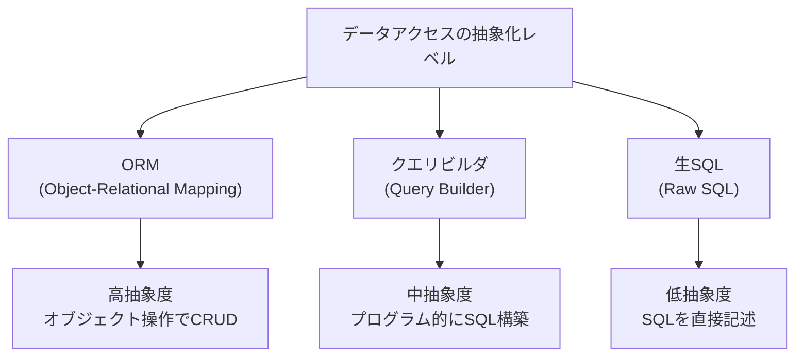
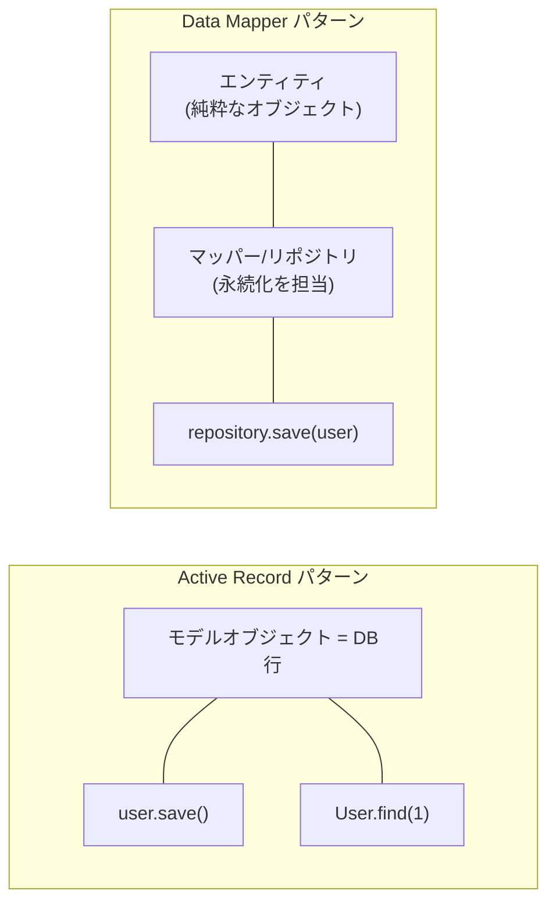
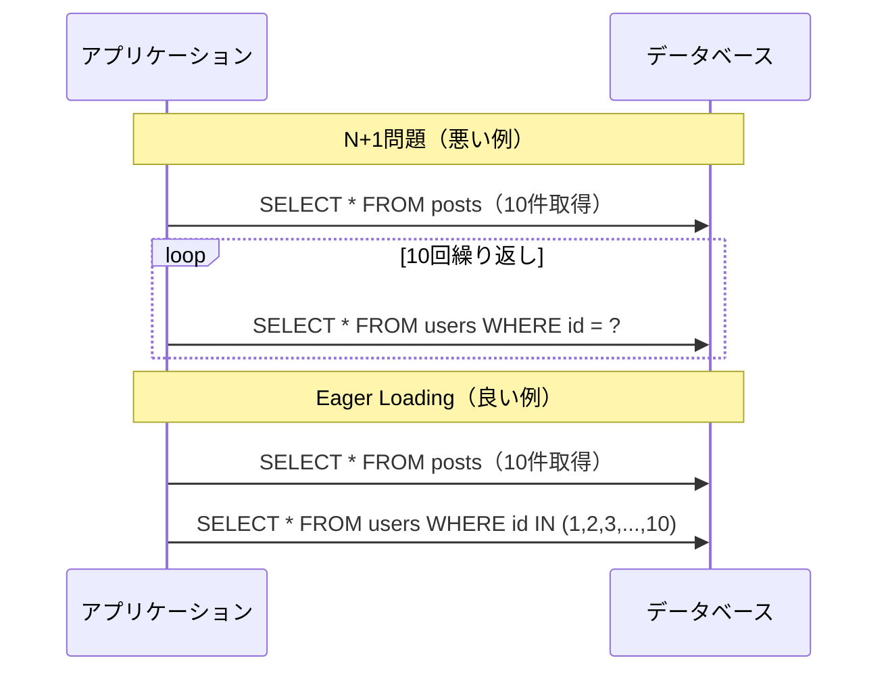
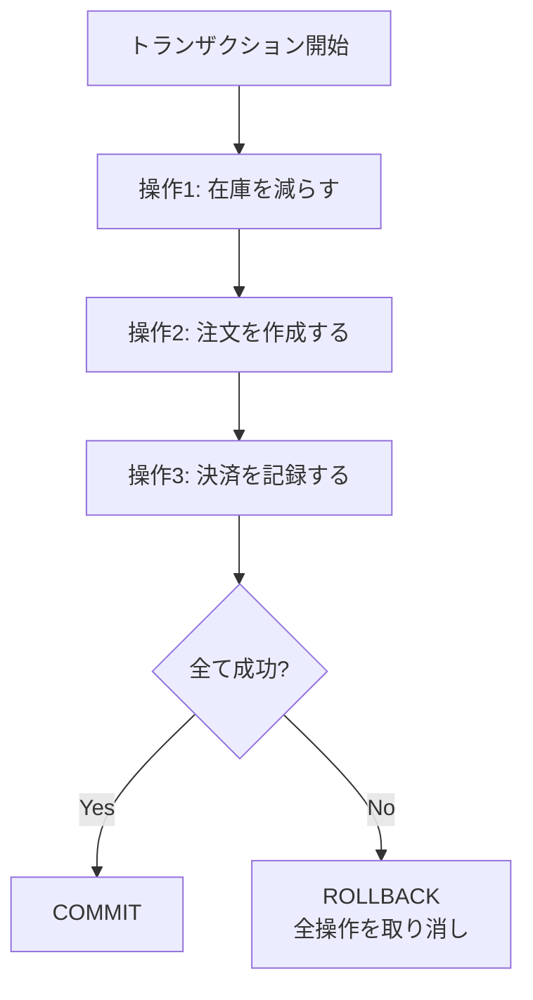
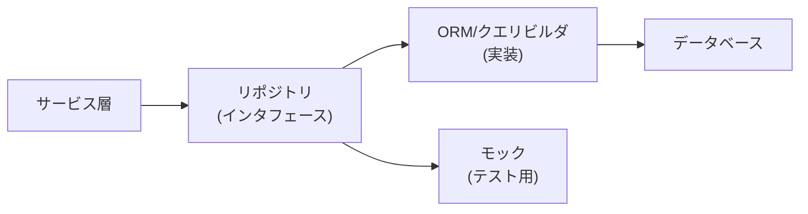

# データアクセス層

> **一言で言うと:** アプリケーションコードとデータベースの間に「翻訳層」を置くことで、SQLの散在・DB依存・保守性の崩壊を防ぐ設計手法。

## なぜ必要か

Webアプリケーションのほぼ全ての機能はデータベースへの読み書きを伴う。データアクセス層（Data Access Layer / DAL）がなければ、次のことが起きる。

- **生SQLがビジネスロジック中に散在する** — コントローラやサービス層にSQL文字列が直接埋め込まれ、変更の影響範囲が追えなくなる
- **SQLインジェクションのリスクが増大する** — 手動でパラメータバインディングを行う箇所が増えるほどミスの確率が上がる（→ [[SQLインジェクションとXSS]]）
- **DB固有の方言に依存する** — [[PostgreSQLとMySQLの比較|PostgreSQLとMySQLの違い]]のようなDB固有構文がコード全体に浸透し、DB移行が事実上不可能になる
- **テストが困難になる** — データベースアクセスが各所にハードコードされていると、単体テストでモックに差し替えられない
- **N+1問題やトランザクション管理が場当たり的になる** — 一貫したデータ取得戦略がなければ、パフォーマンス問題が開発後期に噴出する

データアクセス層は「アプリケーションとDBの関心事を分離する」ために存在する。

## どの問題を解決するか

### ORM vs クエリビルダ vs 生SQL

データベースへのアクセス方法は大きく3つに分類される。



| 観点 | ORM | クエリビルダ | 生SQL |
|---|---|---|---|
| 抽象度 | 高い — テーブル = クラス | 中間 — SQLをプログラム的に組み立て | 低い — SQLそのもの |
| 学習コスト | ORM独自のAPIを覚える | SQLに近いAPIを覚える | SQLの知識が直接活きる |
| 型安全性 | フレームワーク依存 | ツール依存（高いものもある） | ツール依存（sqlc等は高い） |
| 複雑なクエリ | 苦手（結局生SQLに逃げがち） | 対応しやすい | 自由自在 |
| N+1問題 | 発生しやすい | 明示的にJOINを書く | 明示的にJOINを書く |
| 代表例 | Eloquent, ActiveRecord, Prisma, GORM, SQLAlchemy ORM | Knex.js, Drizzle（ORM機能も併せ持つ）, Ecto | database/sql (Go), sqlc, pg |

### Active Record vs Data Mapper パターン

ORMの内部設計には2つの主要なパターンがある。



| 観点 | Active Record | Data Mapper |
|---|---|---|
| モデルの責務 | ビジネスロジック + 永続化 | ビジネスロジックのみ |
| 永続化の責務 | モデル自身が持つ | 別のマッパー/リポジトリが持つ |
| テスタビリティ | DBなしのテストが難しい | エンティティは純粋なオブジェクトとしてテスト可能 |
| シンプルさ | 直感的で学習コストが低い | 構造が複雑になる |
| 適するプロジェクト規模 | 小〜中規模 | 中〜大規模 |
| 代表例 | Ruby on Rails ActiveRecord, Laravel Eloquent | SQLAlchemy (Python), TypeORM Data Mapper mode / Prisma (TypeScript) |

Active Recordは「モデル = テーブル行」という直感的なマッピングで、RAD（Rapid Application Development）に向く。一方、Data Mapperはドメインモデルとテーブル構造を独立させられるため、複雑なドメインロジックを持つシステムに向く。選択はプロジェクトの規模と複雑さに依存する。

### N+1問題の実践的な回避

N+1問題は、関連データを取得する際に「親レコード1回 + 子レコードN回」のクエリが発行されるパフォーマンス問題。



| 言語/ORM | N+1の回避方法 |
|---|---|
| Ruby / ActiveRecord | `Post.includes(:user)` — Eager Loading |
| PHP / Eloquent | `Post::with('user')->get()` — Eager Loading |
| Python / SQLAlchemy | `joinedload(Post.user)` / `selectinload(Post.user)` |
| TypeScript / Prisma | `prisma.post.findMany({ include: { user: true } })` |
| Go / GORM | `db.Preload("User").Find(&posts)` |

### トランザクション管理

トランザクションは「一連の操作を全て成功させるか、全て取り消すか」を保証する仕組み。データアクセス層でトランザクション境界を適切に管理することが、データ整合性の鍵になる。



トランザクション管理のポイント:

- **トランザクション境界はサービス層で定義する** — データアクセス層（リポジトリ）は個別のCRUDを提供し、それらをまとめるトランザクションはサービス層が制御する
- **トランザクションを長く保持しない** — [[ロック]]の保持時間が延びると[[デッドロック]]のリスクが高まる
- **分離レベルを理解する** — Read Committed が多くのRDBのデフォルトだが、ファントムリードを防ぐにはRepeatable Read以上が必要

## 他の仕組みとどう関係するか

- **下位レイヤーとの関係:**
  - [[RDB]] — データアクセス層が抽象化するのはまさにRDBへの操作。[[B-TreeとB+Tree|インデックスの仕組み]]を理解していないとORMが生成するクエリのパフォーマンスを評価できない
  - [[Layer3-データ永続化/_index|データ永続化]] — トランザクション、ロック、[[レプリケーションとレプリケーション遅延|レプリケーション遅延]]の知識がなければ、データアクセス層の設計判断ができない。[[VACUUM]]やインデックスメンテナンスの知識はクエリパフォーマンスに直結する

- **同レイヤーとの関係:**
  - [[バリデーション]] — データアクセス層に渡す前にアプリケーション層でバリデーションを済ませる。DB制約（UNIQUE, NOT NULL）は最終防衛ラインであり、バリデーションの代替ではない
  - [[エラーハンドリング]] — DB接続エラー、制約違反（UNIQUE制約等）、タイムアウトなど、データアクセス層固有のエラーを適切に分類し、上位に伝播させる設計が必要
  - [[認証と認可]] — 認可の結果に基づいてクエリの範囲を制限する（例: テナント単位のデータ分離）

- **上位レイヤーとの関係:**
  - [[Layer5-パフォーマンス/_index|パフォーマンス]] — N+1問題、不要なカラムの取得（SELECT *）、インデックスが効かないクエリは全てデータアクセス層の設計ミスに起因する
  - [[Layer7-設計アーキテクチャ/_index|設計・アーキテクチャ]] — リポジトリパターン、Unit of Workパターン、CQRS（Command Query Responsibility Segregation）など、データアクセスの設計パターンはアーキテクチャ設計と密接に関わる

## 誤解されやすいポイント

1. **「ORMを使えばSQLを知らなくていい」という誤解**
   ORMはSQLの生成を自動化するだけで、SQLの知識を不要にするわけではない。ORMが生成するSQLを理解できなければ、パフォーマンス問題のデバッグも最適化もできない。ORMのログでSQLを出力し、`EXPLAIN`で実行計画を確認する習慣が不可欠。

2. **「生SQLは悪」という誤解**
   複雑な集計クエリ、ウィンドウ関数、再帰CTE（Common Table Expression）など、ORMで表現が困難なクエリは多い。そのような場面で無理にORMを使うと、可読性もパフォーマンスも犠牲になる。「基本はORM、複雑なクエリは生SQL」というハイブリッドアプローチが現実的。

3. **「ORMはパフォーマンスが悪い」という誤解**
   ORMそのもののオーバーヘッドは通常ごくわずか。パフォーマンス問題の原因は、N+1問題、不適切なEager/Lazy Loading、インデックスの欠如といった「ORMの使い方」にある。適切に使えばORMと生SQLのパフォーマンス差は実務上無視できるレベル。

4. **「Active Recordは大規模に使えない」という誤解**
   ShopifyはRuby on Rails（Active Record）で巨大なECプラットフォームを運用している。Active Recordの限界はパターンそのものではなく、ドメインロジックの複雑さが増したときにモデルが肥大化すること。適切な分割（Service Object、Query Object）で対処可能。

5. **「リポジトリパターンは常に必要」という誤解**
   小規模なCRUDアプリケーションにリポジトリパターンを適用すると、ORM呼び出しをラップするだけの薄いクラスが大量に生まれ、間接層が増えるだけで利点がない。リポジトリパターンが有効なのは、テスタビリティの向上が必要な場合や、データソースの切り替え可能性がある場合。

## 設計のベストプラクティス

### リポジトリパターン

ドメイン層からデータアクセスの詳細を隠蔽し、コレクションのようなインタフェースでデータを操作する。



- サービス層はリポジトリのインタフェースにのみ依存し、ORMやSQLの詳細を知らない
- テスト時にはモック実装に差し替えられるため、DBなしで高速なテストが可能
- ORMの変更（例: Sequelize → Prisma への移行）がサービス層に影響しない

### トランザクション管理の設計

- **トランザクション境界をサービス層に置く** — リポジトリは個々のCRUD操作を提供し、サービス層がそれらをトランザクションで囲む
- **暗黙的なトランザクションに依存しない** — 「1リクエスト = 1トランザクション」の自動ラッピングは便利だが、トランザクションの範囲が広すぎるとロック競合が増える
- **読み取り専用トランザクションを活用する** — 読み取りクエリに`READ ONLY`を指定するとDB側で最適化が可能になり、[[レプリケーションとレプリケーション遅延|レプリカ]]へのルーティングも容易になる

### マイグレーションとの関係

データアクセス層のスキーマ定義（モデル/エンティティ）とDBマイグレーションは常に同期が必要。

- **マイグレーションはバージョン管理する** — コードと同じリポジトリで管理し、デプロイと一体で実行する
- **破壊的変更は段階的に行う** — カラム名の変更は「新カラム追加 → 両方書き込み → 旧カラム削除」の3ステップで（[[サロゲートキーと自然キー|キー設計]]にも影響する）
- **ORMの自動マイグレーションは本番で使わない** — 開発時の便利機能であり、本番ではレビュー済みのマイグレーションファイルを使う

## AIによる実装のアンチパターン

| アンチパターン | なぜ問題か | 対策 |
|---|---|---|
| 全てのクエリをORMで書こうとする | 複雑な集計やウィンドウ関数を無理にORMで表現し、可読性とパフォーマンスが低下 | 複雑なクエリは生SQLやクエリビルダを使い分ける |
| N+1問題を放置してループ内でクエリ発行 | データ量が増えると性能が線形に劣化し、本番で障害になる | Eager Loadingを明示的に指定し、クエリログで確認する |
| リポジトリパターンの過剰適用 | 全モデルに対してリポジトリインタフェース + 実装クラスを生成し、CRUDをラップするだけの層が生まれる | パターンの適用は規模と要件に応じて判断する |
| トランザクションなしで複数テーブルを更新 | 中途半端な状態でエラーが発生するとデータ不整合 | 複数テーブルへの書き込みは必ずトランザクションで囲む |
| SELECT * を多用する | 不要なカラムの転送でメモリとネットワーク帯域を浪費 | 必要なカラムのみ明示的に指定する |

## 具体例

### TypeScript — Prisma（Data Mapper寄り）

```typescript
import { PrismaClient, Prisma } from '@prisma/client';

const prisma = new PrismaClient({
  log: ['query'], // 開発時はクエリログを有効にする
});

// --- リポジトリパターンの例 ---
interface UserRepository {
  findById(id: string): Promise<User | null>;
  findWithPosts(id: string): Promise<User & { posts: Post[] } | null>;
  create(data: { name: string; email: string }): Promise<User>;
}

const userRepository: UserRepository = {
  // 基本的な取得
  async findById(id) {
    return prisma.user.findUnique({ where: { id } });
  },

  // Eager Loading で N+1 を回避
  async findWithPosts(id) {
    return prisma.user.findUnique({
      where: { id },
      include: { posts: true }, // JOINではなくIN句で2クエリ発行
    });
  },

  async create(data) {
    return prisma.user.create({ data });
  },
};

// --- トランザクションの例 ---
async function createOrder(userId: string, productId: string, quantity: number) {
  return prisma.$transaction(async (tx) => {
    // 在庫を減らす（楽観ロック的に条件付き更新）
    // updateMany を使うと where に非一意フィールド（stock）を含められる。
    // update は本来 where に一意制約のあるフィールドしか取れないため、
    // 「条件を満たす行だけを更新」したい場合は updateMany が定石。
    const updated = await tx.product.updateMany({
      where: { id: productId, stock: { gte: quantity } },
      data: { stock: { decrement: quantity } },
    });
    if (updated.count === 0) {
      throw new Error('Insufficient stock');
    }

    const product = await tx.product.findUniqueOrThrow({ where: { id: productId } });

    // 注文を作成
    const order = await tx.order.create({
      data: { userId, productId, quantity, totalPrice: product.price * quantity },
    });

    return order;
  });
}

// --- 複雑なクエリは生SQLで ---
async function getMonthlySalesReport(year: number) {
  return prisma.$queryRaw<{ month: number; total: bigint }[]>`
    SELECT
      EXTRACT(MONTH FROM created_at)::int AS month,
      SUM(total_price) AS total
    FROM orders
    WHERE EXTRACT(YEAR FROM created_at) = ${year}
    GROUP BY month
    ORDER BY month
  `;
}
```

### Go — sqlc（型安全な生SQL）

```go
// sqlc はSQLファイルから型安全なGoコードを生成するツール。
// 生SQLの自由度とコンパイル時の型チェックを両立する。

// -- query.sql (sqlcの入力ファイル)
// -- name: GetUser :one
// SELECT id, name, email FROM users WHERE id = $1;
//
// -- name: ListPostsWithUsers :many
// SELECT p.id, p.title, p.body, u.name AS author_name
// FROM posts p
// JOIN users u ON p.user_id = u.id
// ORDER BY p.created_at DESC
// LIMIT $1 OFFSET $2;

// 生成されたコードの利用例
package main

import (
	"context"
	"database/sql"
	"fmt"
	"log"

	_ "github.com/lib/pq"
)

// sqlcが生成する構造体（例）
type User struct {
	ID    string
	Name  string
	Email string
}

type ListPostsWithUsersRow struct {
	ID         string
	Title      string
	Body       string
	AuthorName string
}

// sqlcが生成するインタフェース（例）
type Queries struct {
	db *sql.DB
}

func New(db *sql.DB) *Queries {
	return &Queries{db: db}
}

func (q *Queries) GetUser(ctx context.Context, id string) (User, error) {
	row := q.db.QueryRowContext(ctx,
		"SELECT id, name, email FROM users WHERE id = $1", id)
	var u User
	err := row.Scan(&u.ID, &u.Name, &u.Email)
	return u, err
}

// トランザクション管理
func CreateOrderTx(ctx context.Context, db *sql.DB, userID, productID string, qty int) error {
	tx, err := db.BeginTx(ctx, nil)
	if err != nil {
		return fmt.Errorf("begin tx: %w", err)
	}
	defer tx.Rollback() // Commitが呼ばれればRollbackはno-op

	// 在庫を減らす
	res, err := tx.ExecContext(ctx,
		"UPDATE products SET stock = stock - $1 WHERE id = $2 AND stock >= $1",
		qty, productID)
	if err != nil {
		return fmt.Errorf("update stock: %w", err)
	}
	rows, _ := res.RowsAffected()
	if rows == 0 {
		return fmt.Errorf("insufficient stock for product %s", productID)
	}

	// 注文を作成
	_, err = tx.ExecContext(ctx,
		"INSERT INTO orders (user_id, product_id, quantity) VALUES ($1, $2, $3)",
		userID, productID, qty)
	if err != nil {
		return fmt.Errorf("create order: %w", err)
	}

	return tx.Commit()
}
```

### Python — SQLAlchemy（Data Mapper + Unit of Work）

```python
from sqlalchemy import create_engine, select, func, extract
from sqlalchemy.orm import (
    DeclarativeBase, Mapped, mapped_column, relationship,
    Session, sessionmaker, selectinload,
)
from datetime import datetime

engine = create_engine("postgresql://localhost/mydb", echo=True)  # echo=TrueでSQL出力
SessionLocal = sessionmaker(bind=engine)


class Base(DeclarativeBase):
    pass


class User(Base):
    __tablename__ = "users"
    id: Mapped[int] = mapped_column(primary_key=True)
    name: Mapped[str]
    email: Mapped[str] = mapped_column(unique=True)
    posts: Mapped[list["Post"]] = relationship(back_populates="user")


class Post(Base):
    __tablename__ = "posts"
    id: Mapped[int] = mapped_column(primary_key=True)
    title: Mapped[str]
    user_id: Mapped[int]
    user: Mapped["User"] = relationship(back_populates="posts")


# --- N+1回避: selectinload ---
def get_users_with_posts(session: Session) -> list[User]:
    """selectinload で N+1 を回避（IN句で2クエリ）"""
    stmt = select(User).options(selectinload(User.posts))
    return list(session.scalars(stmt))


# --- トランザクション管理 ---
def create_order(session: Session, user_id: int, product_id: int, qty: int):
    """Session のコンテキストマネージャがトランザクション境界"""
    with session.begin():  # 自動 commit / rollback
        product = session.execute(
            select(Product).where(Product.id == product_id).with_for_update()
        ).scalar_one()

        if product.stock < qty:
            raise ValueError(f"Insufficient stock: {product.stock} < {qty}")

        product.stock -= qty
        order = Order(user_id=user_id, product_id=product_id, quantity=qty)
        session.add(order)


# --- 複雑なクエリ ---
def monthly_sales(session: Session, year: int):
    stmt = (
        select(
            extract("month", Order.created_at).label("month"),
            func.sum(Order.total_price).label("total"),
        )
        .where(extract("year", Order.created_at) == year)
        .group_by("month")
        .order_by("month")
    )
    return session.execute(stmt).all()
```

### PHP — Eloquent（Active Record）

```php
<?php

use Illuminate\Database\Eloquent\Model;
use Illuminate\Database\Eloquent\Relations\HasMany;
use Illuminate\Database\Eloquent\Relations\BelongsTo;
use Illuminate\Support\Facades\DB;

// --- モデル定義（Active Record: モデル = テーブル行） ---
class User extends Model
{
    protected $fillable = ['name', 'email'];

    public function posts(): HasMany
    {
        return $this->hasMany(Post::class);
    }
}

class Post extends Model
{
    protected $fillable = ['title', 'body', 'user_id'];

    public function user(): BelongsTo
    {
        return $this->belongsTo(User::class);
    }
}

// --- N+1回避: Eager Loading ---
// Bad: N+1（postsの数だけSELECTが発行される）
$users = User::all();
foreach ($users as $user) {
    echo $user->posts->count(); // 毎回クエリ発行
}

// Good: with() で Eager Loading
$users = User::with('posts')->get();
foreach ($users as $user) {
    echo $user->posts->count(); // 追加クエリなし
}

// --- トランザクション管理 ---
function createOrder(int $userId, int $productId, int $quantity): Order
{
    return DB::transaction(function () use ($userId, $productId, $quantity) {
        // 悲観ロックで在庫を取得
        $product = Product::where('id', $productId)->lockForUpdate()->firstOrFail();

        if ($product->stock < $quantity) {
            throw new \DomainException("Insufficient stock: {$product->stock} < {$quantity}");
        }

        $product->decrement('stock', $quantity);

        return Order::create([
            'user_id'     => $userId,
            'product_id'  => $productId,
            'quantity'    => $quantity,
            'total_price' => $product->price * $quantity,
        ]);
    });
}

// --- 複雑なクエリはクエリビルダや生SQLで ---
function monthlySalesReport(int $year): array
{
    return DB::select("
        SELECT
            EXTRACT(MONTH FROM created_at)::int AS month,
            SUM(total_price) AS total
        FROM orders
        WHERE EXTRACT(YEAR FROM created_at) = ?
        GROUP BY month
        ORDER BY month
    ", [$year]);
}
```

### Ruby — ActiveRecord

```ruby
# --- モデル定義 ---
class User < ApplicationRecord
  has_many :posts, dependent: :destroy

  validates :email, presence: true, uniqueness: true
end

class Post < ApplicationRecord
  belongs_to :user

  scope :recent, -> { order(created_at: :desc) }
end

# --- N+1回避: includes ---
# Bad: N+1
User.all.each { |user| puts user.posts.count }

# Good: includes で Eager Loading
User.includes(:posts).each { |user| puts user.posts.count }

# bullet gem で N+1 を開発時に自動検出（Gemfileに追加）
# gem 'bullet', group: :development

# --- トランザクション管理 ---
def create_order(user_id:, product_id:, quantity:)
  ActiveRecord::Base.transaction do
    # 悲観ロック
    product = Product.lock("FOR UPDATE").find(product_id)

    if product.stock < quantity
      # ActiveRecord::Rollback はトランザクション内で静かに捕捉され、
      # 呼び出し元に伝播しない。通常の例外を使うことで、
      # トランザクションのロールバックと呼び出し元へのエラー伝播の両方を実現する。
      raise "Insufficient stock: #{product.stock} < #{quantity}"
    end

    product.decrement!(:stock, quantity)

    Order.create!(
      user_id: user_id,
      product_id: product_id,
      quantity: quantity,
      total_price: product.price * quantity
    )
  end
end

# --- 複雑なクエリ ---
def monthly_sales_report(year)
  Order
    .where("EXTRACT(YEAR FROM created_at) = ?", year)
    .group("EXTRACT(MONTH FROM created_at)")
    .order("month")
    .pluck(Arel.sql("EXTRACT(MONTH FROM created_at)::int AS month, SUM(total_price) AS total"))
end

# --- Query Object パターン（複雑なクエリの整理） ---
class UserSearchQuery
  def initialize(relation = User.all)
    @relation = relation
  end

  def call(name: nil, email: nil, created_after: nil)
    @relation = @relation.where("name ILIKE ?", "%#{name}%") if name
    @relation = @relation.where(email: email) if email
    @relation = @relation.where("created_at >= ?", created_after) if created_after
    @relation
  end
end

# 利用例
UserSearchQuery.new.call(name: "田中", created_after: 1.month.ago)
```

## 参考リソース

- 「Patterns of Enterprise Application Architecture」（Martin Fowler）— Active Record、Data Mapper、Repository、Unit of Work の原典
- 「SQLアンチパターン」（Bill Karwin）— ORMを使っていても踏みうるDB設計のアンチパターン集
- Prisma 公式ドキュメント — TypeScriptにおけるData Mapper寄りのモダンORM
- sqlc 公式ドキュメント — Goにおける「SQLファーストで型安全」なアプローチ
- Rails Guides: Active Record Query Interface — Ruby on Railsでのデータアクセスパターン

## 学習メモ

- ORMの選定は「抽象度と制御のトレードオフ」。プロジェクトの複雑さに応じて選ぶべきで、銀の弾丸はない
- 開発中はクエリログを必ず有効にし、N+1が発生していないか確認する習慣をつける
- マイグレーションの破壊的変更（カラム削除・リネーム）は本番環境でのダウンタイムに直結するため、段階的に行う
- GORMのAutoMigrateは開発環境専用。本番では`golang-migrate`や`goose`を使うのが定石
