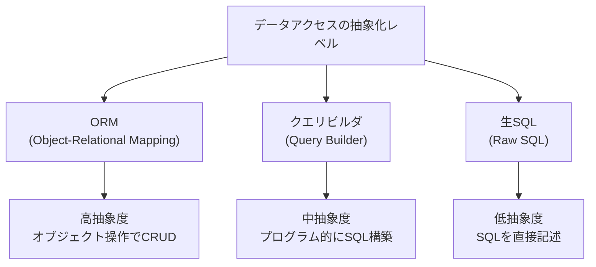
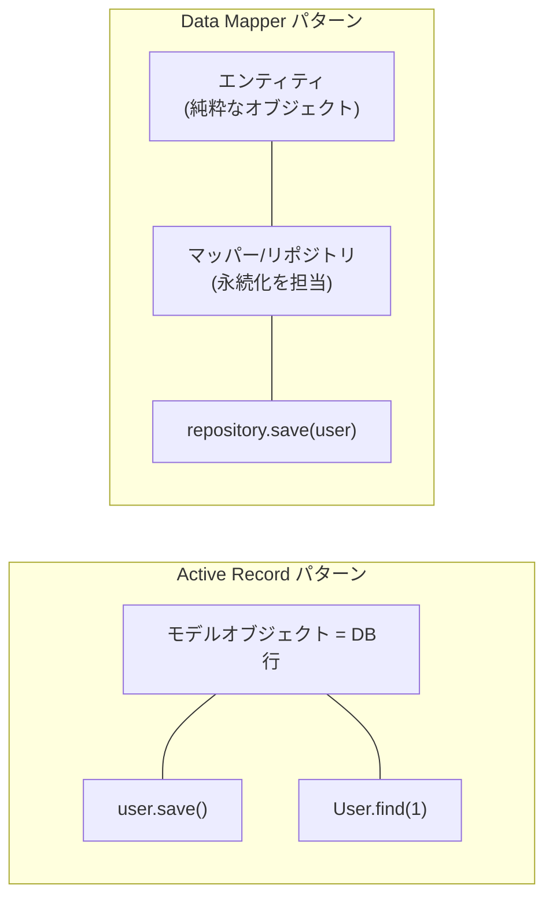
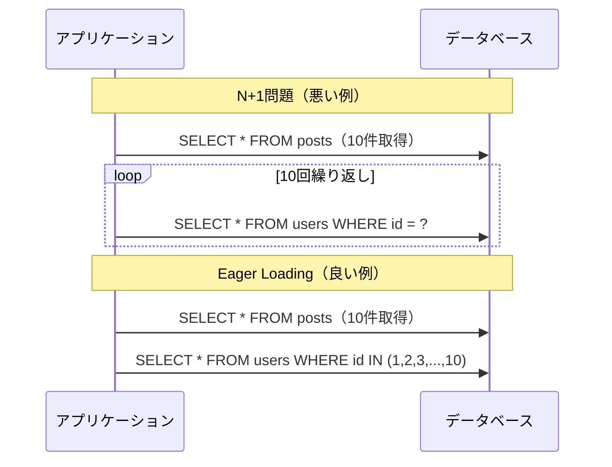
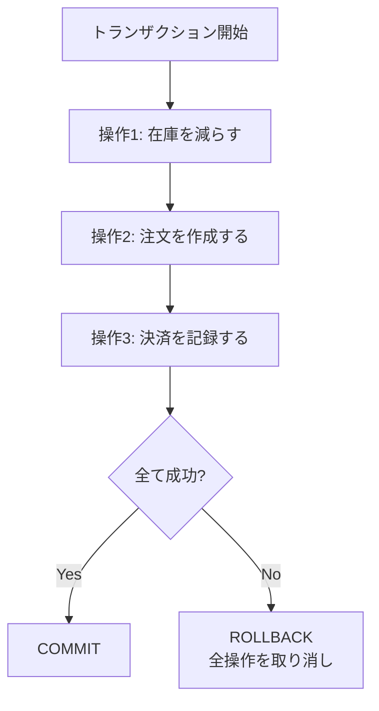
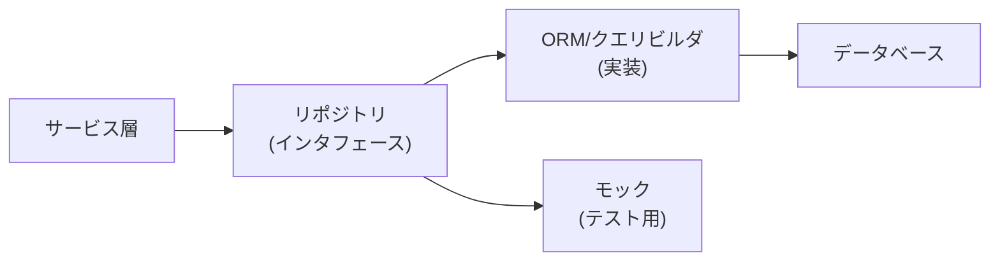

# データアクセス層

> **一言で言うと:** アプリケーションコードとデータベースの間に「翻訳層」を置くことで、SQLの散在・DB依存・保守性の崩壊を防ぐ設計手法。**ORMはSQLを書かなくて済む道具ではなく、SQLを理解した上で効率的に書くための道具**。

## 3分で全体像

- **何を解決する技術か:** SQL の散在・DB方言依存・SQLi リスク・テスト困難性・N+1 問題を、ORM / クエリビルダ / リポジトリパターンの組み合わせで解消する。アプリケーションと DB の関心事を分離する翻訳層
- **代表的な使用シーン:** Web アプリの全データ操作、複雑な JOIN を含む集計クエリ、バッチ処理、トランザクション境界の設計、テナント分離（マルチテナント SaaS）、データ移行
- **これだけは覚える3つ:**
    1. **ORM はSQLを隠さない、生成する** — ORM が出力する SQL を `EXPLAIN` で読めない人は ORM を使うべきでない。ORM のクエリログを必ず有効にし、N+1 や非効率クエリを開発時に検出する
    2. **N+1 問題は最頻出のパフォーマンス殺し** — 親 1 + 子 N = N+1 個の SQL。Eager Loading (`includes` / `with` / `Preload` / `selectinload`) または DataLoader 形式の per-request バッチで解消する。本番でしか顕在化しないため開発中の検出が鍵
    3. **トランザクション境界はサービス層で決める** — リポジトリは個別 CRUD、サービスがトランザクションでまとめる。ユーザー入力待ちをトランザクション内に含めない（ロック保持時間が伸びてデッドロック多発）
- **AIに任せやすいか:** **一部任せられる** — モデル定義・基本 CRUD・Eager Loading 指定は AI が高品質に書ける。一方「**N+1 検出**」「**トランザクション境界**」「**生 SQL に逃げるべき複雑クエリの判断**」「**SELECT * の禁止**」「**ORM の `lockForUpdate` / `with_for_update` 適用**」は AI が誤りやすく、AIコードレビュー観点でクエリログ + EXPLAIN を要する
- **詰まったらここを読む:** [[RDB]] / [[インデックス]] / [[マイグレーション]] / [[EagerロードとLazyロード]]

## なぜ必要か

Webアプリケーションのほぼ全ての機能はデータベースへの読み書きを伴う。データアクセス層（Data Access Layer / DAL）がなければ、次のことが起きる。

- **生SQLがビジネスロジック中に散在する** — コントローラやサービス層にSQL文字列が直接埋め込まれ、変更の影響範囲が追えなくなる
- **SQLインジェクションのリスクが増大する** — 手動でパラメータバインディングを行う箇所が増えるほどミスの確率が上がる（→ [[SQLインジェクションとXSS]]）
- **DB固有の方言に依存する** — [[PostgreSQLとMySQLの比較|PostgreSQLとMySQLの違い]]のようなDB固有構文がコード全体に浸透し、DB移行が事実上不可能になる
- **テストが困難になる** — データベースアクセスが各所にハードコードされていると、単体テストでモックに差し替えられない
- **N+1問題やトランザクション管理が場当たり的になる** — 一貫したデータ取得戦略がなければ、パフォーマンス問題が開発後期に噴出する

データアクセス層は「アプリケーションとDBの関心事を分離する」ために存在する。

## どの問題を解決するか

### ORM vs クエリビルダ vs 生SQL

データベースへのアクセス方法は大きく3つに分類される。


```mermaid
graph TD
    A["データアクセスの抽象化レベル"] --> B["ORM<br/>(Object-Relational Mapping)"]
    A --> C["クエリビルダ<br/>(Query Builder)"]
    A --> D["生SQL<br/>(Raw SQL)"]
    B --> B1["高抽象度<br/>オブジェクト操作でCRUD"]
    C --> C1["中抽象度<br/>プログラム的にSQL構築"]
    D --> D1["低抽象度<br/>SQLを直接記述"]
```

| 観点 | ORM | クエリビルダ | 生SQL |
|---|---|---|---|
| 抽象度 | 高い — テーブル = クラス | 中間 — SQLをプログラム的に組み立て | 低い — SQLそのもの |
| 学習コスト | ORM独自のAPIを覚える | SQLに近いAPIを覚える | SQLの知識が直接活きる |
| 型安全性 | フレームワーク依存 | ツール依存（高いものもある） | ツール依存（sqlc等は高い） |
| 複雑なクエリ | 苦手（結局生SQLに逃げがち） | 対応しやすい | 自由自在 |
| N+1問題 | 発生しやすい | 明示的にJOINを書く | 明示的にJOINを書く |
| 代表例 | Eloquent, ActiveRecord, Prisma, GORM, SQLAlchemy ORM | Knex.js, Drizzle（ORM機能も併せ持つ）, Ecto | database/sql (Go), sqlc, pg |

### Active Record vs Data Mapper パターン

ORMの内部設計には2つの主要なパターンがある。


```mermaid
flowchart LR
    subgraph AR["Active Record パターン"]
        direction TB
        AR1["モデルオブジェクト = DB行"]
        AR2["user.save()"]
        AR3["User.find(1)"]
        AR1 --- AR2
        AR1 --- AR3
    end
    subgraph DM["Data Mapper パターン"]
        direction TB
        DM1["エンティティ<br/>(純粋なオブジェクト)"]
        DM2["マッパー/リポジトリ<br/>(永続化を担当)"]
        DM3["repository.save(user)"]
        DM1 --- DM2
        DM2 --- DM3
    end
```

| 観点 | Active Record | Data Mapper |
|---|---|---|
| モデルの責務 | ビジネスロジック + 永続化 | ビジネスロジックのみ |
| 永続化の責務 | モデル自身が持つ | 別のマッパー/リポジトリが持つ |
| テスタビリティ | DBなしのテストが難しい | エンティティは純粋なオブジェクトとしてテスト可能 |
| シンプルさ | 直感的で学習コストが低い | 構造が複雑になる |
| 適するプロジェクト規模 | 小〜中規模 | 中〜大規模 |
| 代表例 | Ruby on Rails ActiveRecord, Laravel Eloquent | SQLAlchemy (Python), TypeORM Data Mapper mode / Prisma (TypeScript) |

Active Recordは「モデル = テーブル行」という直感的なマッピングで、RAD（Rapid Application Development）に向く。一方、Data Mapperはドメインモデルとテーブル構造を独立させられるため、複雑なドメインロジックを持つシステムに向く。選択はプロジェクトの規模と複雑さに依存する。

### N+1問題の実践的な回避

N+1問題は、関連データを取得する際に「親レコード1回 + 子レコードN回」のクエリが発行されるパフォーマンス問題。回避策の中核となる[[EagerロードとLazyロード]]の戦略選択（特に JOIN 方式と IN句方式の使い分け）はORM利用時の最重要トピックのひとつ。GraphQL のように Eager Loading を静的に書きづらい場面では、リクエスト単位でバッチング・キャッシングを行う [[per-requestメモ化|per-request メモ化（DataLoader パターン）]]が同等の効果を後付けで実現する。


```mermaid
sequenceDiagram
    participant App as アプリケーション
    participant DB as データベース
    Note over App,DB: N+1問題（悪い例）
    App->>DB: SELECT * FROM posts（10件取得）
    loop 10回繰り返し
        App->>DB: SELECT * FROM users WHERE id = ?
    end
    Note over App,DB: Eager Loading（良い例）
    App->>DB: SELECT * FROM posts（10件取得）
    App->>DB: SELECT * FROM users WHERE id IN (1,2,3,...,10)
```

| 言語/ORM | N+1の回避方法 |
|---|---|
| Ruby / ActiveRecord | `Post.includes(:user)` — Eager Loading |
| PHP / Eloquent | `Post::with('user')->get()` — Eager Loading |
| Python / SQLAlchemy | `joinedload(Post.user)` / `selectinload(Post.user)` |
| TypeScript / Prisma | `prisma.post.findMany({ include: { user: true } })` |
| Go / GORM | `db.Preload("User").Find(&posts)` |

### トランザクション管理

トランザクションは「一連の操作を全て成功させるか、全て取り消すか」を保証する仕組み。データアクセス層でトランザクション境界を適切に管理することが、データ整合性の鍵になる。


```mermaid
flowchart TD
    A["トランザクション開始"] --> B["操作1: 在庫を減らす"]
    B --> C["操作2: 注文を作成する"]
    C --> D["操作3: 決済を記録する"]
    D --> E{"全て成功?"}
    E -->|Yes| F["COMMIT"]
    E -->|No| G["ROLLBACK<br/>全操作を取り消し"]
```

トランザクション管理のポイント:

- **トランザクション境界はサービス層で定義する** — データアクセス層（リポジトリ）は個別のCRUDを提供し、それらをまとめるトランザクションはサービス層が制御する
- **トランザクションを長く保持しない** — [[ロック]]の保持時間が延びると[[デッドロック]]のリスクが高まる
- **分離レベルを理解する** — Read Committed が多くのRDBのデフォルトだが、ファントムリードを防ぐにはRepeatable Read以上が必要

## 他の仕組みとどう関係するか

- **下位レイヤーとの関係:**
  - [[RDB]] — データアクセス層が抽象化するのはまさにRDBへの操作。[[B-TreeとB+Tree|インデックスの仕組み]]を理解していないとORMが生成するクエリのパフォーマンスを評価できない
  - [[Layer3-データ永続化/_index|データ永続化]] — トランザクション、ロック、[[レプリケーションとレプリケーション遅延|レプリケーション遅延]]の知識がなければ、データアクセス層の設計判断ができない。[[VACUUM]]やインデックスメンテナンスの知識はクエリパフォーマンスに直結する

- **同レイヤーとの関係:**
  - [[バリデーション]] — データアクセス層に渡す前にアプリケーション層でバリデーションを済ませる。DB制約（UNIQUE, NOT NULL）は最終防衛ラインであり、バリデーションの代替ではない
  - [[エラーハンドリング]] — DB接続エラー、制約違反（UNIQUE制約等）、タイムアウトなど、データアクセス層固有のエラーを適切に分類し、上位に伝播させる設計が必要
  - [[認証と認可]] — 認可の結果に基づいてクエリの範囲を制限する（例: テナント単位のデータ分離）

- **上位レイヤーとの関係:**
  - [[Layer5-パフォーマンス/_index|パフォーマンス]] — N+1問題、不要なカラムの取得（SELECT *）、インデックスが効かないクエリは全てデータアクセス層の設計ミスに起因する
  - [[Layer7-設計アーキテクチャ/_index|設計・アーキテクチャ]] — リポジトリパターン、Unit of Workパターン、CQRS（Command Query Responsibility Segregation）など、データアクセスの設計パターンはアーキテクチャ設計と密接に関わる

## 誤解されやすいポイント

1. **「ORMを使えばSQLを知らなくていい」という誤解**
   ORMはSQLの生成を自動化するだけで、SQLの知識を不要にするわけではない。ORMが生成するSQLを理解できなければ、パフォーマンス問題のデバッグも最適化もできない。ORMのログでSQLを出力し、`EXPLAIN`で実行計画を確認する習慣が不可欠。

2. **「生SQLは悪」という誤解**
   複雑な集計クエリ、ウィンドウ関数、再帰CTE（Common Table Expression）など、ORMで表現が困難なクエリは多い。そのような場面で無理にORMを使うと、可読性もパフォーマンスも犠牲になる。「基本はORM、複雑なクエリは生SQL」というハイブリッドアプローチが現実的。

3. **「ORMはパフォーマンスが悪い」という誤解**
   ORMそのもののオーバーヘッドは通常ごくわずか。パフォーマンス問題の原因は、N+1問題、不適切なEager/Lazy Loading、インデックスの欠如といった「ORMの使い方」にある。適切に使えばORMと生SQLのパフォーマンス差は実務上無視できるレベル。

4. **「Active Recordは大規模に使えない」という誤解**
   ShopifyはRuby on Rails（Active Record）で巨大なECプラットフォームを運用している。Active Recordの限界はパターンそのものではなく、ドメインロジックの複雑さが増したときにモデルが肥大化すること。適切な分割（Service Object、Query Object）で対処可能。

5. **「リポジトリパターンは常に必要」という誤解**
   小規模なCRUDアプリケーションにリポジトリパターンを適用すると、ORM呼び出しをラップするだけの薄いクラスが大量に生まれ、間接層が増えるだけで利点がない。リポジトリパターンが有効なのは、テスタビリティの向上が必要な場合や、データソースの切り替え可能性がある場合。

## 設計のベストプラクティス

### リポジトリパターン

ドメイン層からデータアクセスの詳細を隠蔽し、コレクションのようなインタフェースでデータを操作する。


```mermaid
flowchart LR
    S["サービス層"] --> R["リポジトリ<br/>(インタフェース)"]
    R --> I["ORM/クエリビルダ<br/>(実装)"]
    I --> DB["データベース"]
    R --> M["モック<br/>(テスト用)"]
```

- サービス層はリポジトリのインタフェースにのみ依存し、ORMやSQLの詳細を知らない
- テスト時にはモック実装に差し替えられるため、DBなしで高速なテストが可能
- ORMの変更（例: Sequelize → Prisma への移行）がサービス層に影響しない

### トランザクション管理の設計

- **トランザクション境界をサービス層に置く** — リポジトリは個々のCRUD操作を提供し、サービス層がそれらをトランザクションで囲む
- **暗黙的なトランザクションに依存しない** — 「1リクエスト = 1トランザクション」の自動ラッピングは便利だが、トランザクションの範囲が広すぎるとロック競合が増える
- **読み取り専用トランザクションを活用する** — 読み取りクエリに `READ ONLY` を指定すると DB 側で最適化（PostgreSQL ならスナップショット取得スキップ等）が可能になる。ただし**レプリカへの実際のルーティングは別問題**で、アプリ層・接続プーラ（pgBouncer / ProxySQL / RDS Proxy 等）・ORM のレプリカ振り分け設定が必要。`READ ONLY` 単独ではプライマリで処理される（[[レプリケーションとレプリケーション遅延|レプリカ運用]]）

### マイグレーションとの関係

データアクセス層のスキーマ定義（モデル/エンティティ）とDBマイグレーションは常に同期が必要。

- **マイグレーションはバージョン管理する** — コードと同じリポジトリで管理し、デプロイと一体で実行する
- **破壊的変更は段階的に行う** — カラム名の変更は「新カラム追加 → 両方書き込み → 旧カラム削除」の3ステップで（[[サロゲートキーと自然キー|キー設計]]にも影響する）
- **ORMの自動マイグレーションは本番で使わない** — 開発時の便利機能であり、本番ではレビュー済みのマイグレーションファイルを使う

## AIエージェントとの協働

> このトピックでAIコーディングエージェント（Claude Code, Copilot, Cursor 等）と協働するための観点。
> モデル定義・基本 CRUD・Eager Loading は AI に任せやすい一方、**「N+1 の見逃し」「トランザクション境界の欠落」「ループ内クエリ」「`SELECT *`」「楽観/悲観ロックの不在」** が頻出。レビューもAIコードレビュー観点で横断アンチパターン照合 + クエリログでの実証検出に任せられる。

### AIに任せられる部分 / 人間が判断すべき部分

| タスク種類 | 任せ方（実装/レビュー） | 人間の関与 |
|---|---|---|
| ORM モデル / Schema 定義 | AI に任せる | スキーマと DB マイグレーションの整合性、命名規則、関連の双方向性は要件で判断 |
| 基本 CRUD（findById, create, update, delete） | AI 実装、AIコードレビュー観点でレビュー | リポジトリパターンを使うか、サービスから直接 ORM を叩くかは規模で判断 |
| Eager Loading の指定（includes / with / Preload） | AI に任せる | 取得すべき関連の範囲はユースケース依存。過剰な eager で逆に重くなる場合も |
| トランザクション境界 | AI に提案させる | 「どこからどこまでをトランザクションにするか」はビジネス要件。長すぎるとロック競合、短すぎると整合性破綻 |
| 楽観/悲観ロックの選択 | AI に複数案を出させる | 同時更新頻度・競合許容度・リトライコストで人間判断 |
| 複雑な集計 / ウィンドウ関数 / CTE | AI に生 SQL を書かせる | EXPLAIN で実行計画確認は人間。ORM での表現可否も人間が判断 |
| マイグレーション設計 | AI が雛形 | Expand-Contract やオンライン DDL の戦略は人間（[[マイグレーション]]） |

### AI生成コードのレビュー観点（このトピック固有）

AI生成のデータアクセスコードを受け取ったとき、最低限ここを見る。

1. **N+1 とループ内クエリ** — `posts.forEach(p => User.find(p.user_id))` のようにループ内で SQL が発行されていないか。多くの場合 `prisma.post.findMany({ include: { user: true }})` / `Post.includes(:user)` / `Post::with('user')->get()` で eager loading に書き換えれば解消する。クエリログを必ず有効にし、開発時に検出する
2. **トランザクション境界の欠落と長すぎるトランザクション** — 「在庫を減らす + 注文を作る」が同一トランザクション内にあるか。逆に「ユーザー入力待ちをトランザクション内に含めている」「ファイルアップロード完了をトランザクション内で待っている」など長時間ロックを保持するパターンになっていないか
3. **`SELECT *` と防御的 NULL チェック・`COALESCE` 過剰** — `SELECT *` で全カラム取得していないか（Index Only Scan が効かない、不要転送）、NOT NULL 制約があるカラムに `IFNULL` / `COALESCE` を被せて防御コードを書いていないか（スキーマ保証を活かせない）。スキーマを信頼して書くべき

### 効くプロンプトの型

このトピックに関する実装をAIに依頼するとき、コンテキストとして渡すべき情報・制約・成功基準のテンプレ。

```
# 前提（プロジェクトの状況・既存のコード規約）
- DB: PostgreSQL 16 / MySQL 8.4
- ORM/クエリビルダ: Prisma / TypeORM / SQLAlchemy / GORM / sqlc / Eloquent / ActiveRecord
- 既存スキーマの抜粋: [...]
- リポジトリパターンの採否: 使う / 使わない（サービスから直接 ORM）
- 想定データ規模: ユーザ {N}人、注文/日 {M}件、商品 {K}件
- 同時アクセス特性: ピーク {RPS} req/s、書き込み比率 {X}%

# やってほしいこと
- 「{要件}」を実現するデータアクセスコード
- 関連する Eager Loading とトランザクション境界も提示
- 必要なら生 SQL での実装案も併記

# 守ってほしい制約（このトピック固有のもの）
- N+1 を防ぐ Eager Loading を明示的に指定
- SELECT * は禁止、必要カラムを明示
- 複数テーブル更新は必ずトランザクション境界を設定
- トランザクション内にユーザー入力待ち・外部 API 呼び出しを含めない
- 在庫減・残高減など競合がある更新は楽観/悲観ロックで保護
- NOT NULL カラムへの COALESCE / IFNULL 防御は書かない（スキーマ信頼）
- ORM のクエリログを開発時に有効化（実際のクエリを確認できる前提）
- 複雑な集計（ウィンドウ関数 / 再帰 CTE）は生 SQL で書く

# 完了の判断基準
- 開発時のクエリログで N+1 が検出されない（1 リクエストで O(1) クエリ数）
- EXPLAIN ANALYZE で大きなテーブルに Seq Scan が出ない
- トランザクションがコミットまでの保持時間が短い（< 100ms 目安）
- ロールバック時に整合性が保たれる
```

### AI実装のアンチパターン

LLM生成コードで頻出する過剰設計・誤用パターン。レビュー時の照合表として使う。

| アンチパターン | なぜ問題か | レビュー観点 / 対策 |
|---|---|---|
| ループ内で個別 SELECT を発行（N+1） | データ量で線形劣化、本番で初めて顕在化 | Eager Loading (`includes` / `with` / `Preload` / `selectinload`)、または `IN (...)` での一括取得 |
| Eager Loading を `LEFT JOIN` で常に使う | 関連が多い場合に行数が爆発、メモリ消費過大 | 多数の関連には IN句方式（Rails の `includes`、SQLAlchemy `selectinload`）を使う |
| `SELECT *` で全カラム取得 | Index Only Scan が効かない、不要転送、カラム追加で結果変動 | 必要カラムを明示。ORM でも `.select(:id, :name)` 等で限定 |
| トランザクションなしで複数テーブル更新 | 中途半端なエラーで永続的データ不整合 | サービス層で `transaction { }` / `DB.transaction` / `prisma.$transaction` で囲む |
| トランザクション内にユーザー入力待ち・外部 API 待ち | ロック保持時間が長くデッドロック多発 | 取得 → アプリで処理 → 短いトランザクションで更新の3段に |
| 在庫減・残高減で楽観/悲観ロックを使わない | 同時更新で在庫マイナス、二重決済 | `lockForUpdate` / `with_for_update`、または `version` カラムでの楽観ロック |
| NOT NULL カラムへの `COALESCE` / `IFNULL` 防御 | スキーマ保証を信頼せず冗長コード、バグの温床 | スキーマを信頼。NULL 許容カラムだけに適用 |
| 全モデルへのリポジトリパターン適用 | 薄いラッパークラスが大量、間接層だけ増える | テスタビリティが必要 / データソース切替がある場合のみ |
| ORM の自動マイグレーションを本番で使う | 意図しないスキーマ破壊、ロールバック困難 | 開発時のみ。本番はレビュー済み migration ファイル |
| ループで `model.save` を呼ぶ（バルク insert を使わない） | N+1 書き込み、ネットワーク往復で遅延 | `bulkCreate` / `insert_all` / `createMany` / `COPY` で一括 |
| 巨大テーブルの `findAll()` をページネーションなしで | OOM・ネットワーク帯域圧迫 | カーソル / offset+limit / バッチイテレータ (`find_each`, `iterator`) |
| プレースホルダ上限を超える IN 句（PostgreSQL は拡張プロトコル仕様で 65535 件、MySQL は `max_allowed_packet` のサイズが先に効く） | 実行時エラー / 接続切断 | カラム数 × 行数を計算しバッチ分割、または COPY/LOAD DATA |
| 複雑な集計を ORM で無理に表現 | 可読性壊滅、意図しない非効率クエリ | ウィンドウ関数・再帰 CTE は生 SQL（`$queryRaw` / `db.execute`） |
| `where('1=1')` のような文字列結合での動的 WHERE | SQLi 経路、可読性低下 | クエリビルダの条件分岐 API か、Query Object パターンで構造化 |

→ レイヤー横断のアンチパターン索引: [[_anti-patterns/_index|AIアンチパターン索引]] / [[_anti-patterns/レイヤー別/Layer4-Backend|Layer 4 Backend アンチパターン集]]

## 具体例

### TypeScript — Prisma（Data Mapper寄り）

```typescript
import { PrismaClient, Prisma } from '@prisma/client';

const prisma = new PrismaClient({
  log: ['query'], // 開発時はクエリログを有効にする
});

// --- リポジトリパターンの例 ---
interface UserRepository {
  findById(id: string): Promise<User | null>;
  findWithPosts(id: string): Promise<User & { posts: Post[] } | null>;
  create(data: { name: string; email: string }): Promise<User>;
}

const userRepository: UserRepository = {
  // 基本的な取得
  async findById(id) {
    return prisma.user.findUnique({ where: { id } });
  },

  // Eager Loading で N+1 を回避
  async findWithPosts(id) {
    return prisma.user.findUnique({
      where: { id },
      include: { posts: true }, // JOINではなくIN句で2クエリ発行
    });
  },

  async create(data) {
    return prisma.user.create({ data });
  },
};

// --- トランザクションの例 ---
async function createOrder(userId: string, productId: string, quantity: number) {
  return prisma.$transaction(async (tx) => {
    // 在庫を減らす（楽観ロック的に条件付き更新）
    // updateMany を使うと where に非一意フィールド（stock）を含められる。
    // update は本来 where に一意制約のあるフィールドしか取れないため、
    // 「条件を満たす行だけを更新」したい場合は updateMany が定石。
    const updated = await tx.product.updateMany({
      where: { id: productId, stock: { gte: quantity } },
      data: { stock: { decrement: quantity } },
    });
    if (updated.count === 0) {
      throw new Error('Insufficient stock');
    }

    const product = await tx.product.findUniqueOrThrow({ where: { id: productId } });

    // 注文を作成
    const order = await tx.order.create({
      data: { userId, productId, quantity, totalPrice: product.price * quantity },
    });

    return order;
  });
}

// --- 複雑なクエリは生SQLで ---
async function getMonthlySalesReport(year: number) {
  return prisma.$queryRaw<{ month: number; total: bigint }[]>`
    SELECT
      EXTRACT(MONTH FROM created_at)::int AS month,
      SUM(total_price) AS total
    FROM orders
    WHERE EXTRACT(YEAR FROM created_at) = ${year}
    GROUP BY month
    ORDER BY month
  `;
}
```

### Go — sqlc（型安全な生SQL）

```go
// sqlc はSQLファイルから型安全なGoコードを生成するツール。
// 生SQLの自由度とコンパイル時の型チェックを両立する。

// -- query.sql (sqlcの入力ファイル)
// -- name: GetUser :one
// SELECT id, name, email FROM users WHERE id = $1;
//
// -- name: ListPostsWithUsers :many
// SELECT p.id, p.title, p.body, u.name AS author_name
// FROM posts p
// JOIN users u ON p.user_id = u.id
// ORDER BY p.created_at DESC
// LIMIT $1 OFFSET $2;

// 生成されたコードの利用例
package main

import (
	"context"
	"database/sql"
	"fmt"
	"log"

	_ "github.com/lib/pq"
)

// sqlcが生成する構造体（例）
type User struct {
	ID    string
	Name  string
	Email string
}

type ListPostsWithUsersRow struct {
	ID         string
	Title      string
	Body       string
	AuthorName string
}

// sqlcが生成するインタフェース（例）
type Queries struct {
	db *sql.DB
}

func New(db *sql.DB) *Queries {
	return &Queries{db: db}
}

func (q *Queries) GetUser(ctx context.Context, id string) (User, error) {
	row := q.db.QueryRowContext(ctx,
		"SELECT id, name, email FROM users WHERE id = $1", id)
	var u User
	err := row.Scan(&u.ID, &u.Name, &u.Email)
	return u, err
}

// トランザクション管理
func CreateOrderTx(ctx context.Context, db *sql.DB, userID, productID string, qty int) error {
	tx, err := db.BeginTx(ctx, nil)
	if err != nil {
		return fmt.Errorf("begin tx: %w", err)
	}
	defer tx.Rollback() // Commitが呼ばれればRollbackはno-op

	// 在庫を減らす
	res, err := tx.ExecContext(ctx,
		"UPDATE products SET stock = stock - $1 WHERE id = $2 AND stock >= $1",
		qty, productID)
	if err != nil {
		return fmt.Errorf("update stock: %w", err)
	}
	rows, _ := res.RowsAffected()
	if rows == 0 {
		return fmt.Errorf("insufficient stock for product %s", productID)
	}

	// 注文を作成
	_, err = tx.ExecContext(ctx,
		"INSERT INTO orders (user_id, product_id, quantity) VALUES ($1, $2, $3)",
		userID, productID, qty)
	if err != nil {
		return fmt.Errorf("create order: %w", err)
	}

	return tx.Commit()
}
```

### Python — SQLAlchemy（Data Mapper + Unit of Work）

```python
from sqlalchemy import create_engine, select, func, extract
from sqlalchemy.orm import (
    DeclarativeBase, Mapped, mapped_column, relationship,
    Session, sessionmaker, selectinload,
)
from datetime import datetime

engine = create_engine("postgresql://localhost/mydb", echo=True)  # echo=TrueでSQL出力
SessionLocal = sessionmaker(bind=engine)


class Base(DeclarativeBase):
    pass


class User(Base):
    __tablename__ = "users"
    id: Mapped[int] = mapped_column(primary_key=True)
    name: Mapped[str]
    email: Mapped[str] = mapped_column(unique=True)
    posts: Mapped[list["Post"]] = relationship(back_populates="user")


class Post(Base):
    __tablename__ = "posts"
    id: Mapped[int] = mapped_column(primary_key=True)
    title: Mapped[str]
    user_id: Mapped[int]
    user: Mapped["User"] = relationship(back_populates="posts")


# --- N+1回避: selectinload ---
def get_users_with_posts(session: Session) -> list[User]:
    """selectinload で N+1 を回避（IN句で2クエリ）"""
    stmt = select(User).options(selectinload(User.posts))
    return list(session.scalars(stmt))


# --- トランザクション管理 ---
def create_order(session: Session, user_id: int, product_id: int, qty: int):
    """Session のコンテキストマネージャがトランザクション境界"""
    with session.begin():  # 自動 commit / rollback
        product = session.execute(
            select(Product).where(Product.id == product_id).with_for_update()
        ).scalar_one()

        if product.stock < qty:
            raise ValueError(f"Insufficient stock: {product.stock} < {qty}")

        product.stock -= qty
        order = Order(user_id=user_id, product_id=product_id, quantity=qty)
        session.add(order)


# --- 複雑なクエリ ---
def monthly_sales(session: Session, year: int):
    stmt = (
        select(
            extract("month", Order.created_at).label("month"),
            func.sum(Order.total_price).label("total"),
        )
        .where(extract("year", Order.created_at) == year)
        .group_by("month")
        .order_by("month")
    )
    return session.execute(stmt).all()
```

### PHP — Eloquent（Active Record）

```php
<?php

use Illuminate\Database\Eloquent\Model;
use Illuminate\Database\Eloquent\Relations\HasMany;
use Illuminate\Database\Eloquent\Relations\BelongsTo;
use Illuminate\Support\Facades\DB;

// --- モデル定義（Active Record: モデル = テーブル行） ---
class User extends Model
{
    protected $fillable = ['name', 'email'];

    public function posts(): HasMany
    {
        return $this->hasMany(Post::class);
    }
}

class Post extends Model
{
    protected $fillable = ['title', 'body', 'user_id'];

    public function user(): BelongsTo
    {
        return $this->belongsTo(User::class);
    }
}

// --- N+1回避: Eager Loading ---
// Bad: N+1（postsの数だけSELECTが発行される）
$users = User::all();
foreach ($users as $user) {
    echo $user->posts->count(); // 毎回クエリ発行
}

// Good: with() で Eager Loading
$users = User::with('posts')->get();
foreach ($users as $user) {
    echo $user->posts->count(); // 追加クエリなし
}

// --- トランザクション管理 ---
function createOrder(int $userId, int $productId, int $quantity): Order
{
    return DB::transaction(function () use ($userId, $productId, $quantity) {
        // 悲観ロックで在庫を取得
        $product = Product::where('id', $productId)->lockForUpdate()->firstOrFail();

        if ($product->stock < $quantity) {
            throw new \DomainException("Insufficient stock: {$product->stock} < {$quantity}");
        }

        $product->decrement('stock', $quantity);

        return Order::create([
            'user_id'     => $userId,
            'product_id'  => $productId,
            'quantity'    => $quantity,
            'total_price' => $product->price * $quantity,
        ]);
    });
}

// --- 複雑なクエリはクエリビルダや生SQLで ---
function monthlySalesReport(int $year): array
{
    return DB::select("
        SELECT
            EXTRACT(MONTH FROM created_at)::int AS month,
            SUM(total_price) AS total
        FROM orders
        WHERE EXTRACT(YEAR FROM created_at) = ?
        GROUP BY month
        ORDER BY month
    ", [$year]);
}
```

### Ruby — ActiveRecord

```ruby
# --- モデル定義 ---
class User < ApplicationRecord
  has_many :posts, dependent: :destroy

  validates :email, presence: true, uniqueness: true
end

class Post < ApplicationRecord
  belongs_to :user

  scope :recent, -> { order(created_at: :desc) }
end

# --- N+1回避: includes ---
# Bad: N+1
User.all.each { |user| puts user.posts.count }

# Good: includes で Eager Loading
User.includes(:posts).each { |user| puts user.posts.count }

# bullet gem で N+1 を開発時に自動検出（Gemfileに追加）
# gem 'bullet', group: :development

# --- トランザクション管理 ---
def create_order(user_id:, product_id:, quantity:)
  ActiveRecord::Base.transaction do
    # 悲観ロック
    product = Product.lock("FOR UPDATE").find(product_id)

    if product.stock < quantity
      # ActiveRecord::Rollback はトランザクション内で静かに捕捉され、
      # 呼び出し元に伝播しない。通常の例外を使うことで、
      # トランザクションのロールバックと呼び出し元へのエラー伝播の両方を実現する。
      raise "Insufficient stock: #{product.stock} < #{quantity}"
    end

    product.decrement!(:stock, quantity)

    Order.create!(
      user_id: user_id,
      product_id: product_id,
      quantity: quantity,
      total_price: product.price * quantity
    )
  end
end

# --- 複雑なクエリ ---
def monthly_sales_report(year)
  Order
    .where("EXTRACT(YEAR FROM created_at) = ?", year)
    .group("EXTRACT(MONTH FROM created_at)")
    .order("month")
    .pluck(Arel.sql("EXTRACT(MONTH FROM created_at)::int AS month, SUM(total_price) AS total"))
end

# --- Query Object パターン（複雑なクエリの整理） ---
class UserSearchQuery
  def initialize(relation = User.all)
    @relation = relation
  end

  def call(name: nil, email: nil, created_after: nil)
    @relation = @relation.where("name ILIKE ?", "%#{name}%") if name
    @relation = @relation.where(email: email) if email
    @relation = @relation.where("created_at >= ?", created_after) if created_after
    @relation
  end
end

# 利用例
UserSearchQuery.new.call(name: "田中", created_after: 1.month.ago)
```

## 参考リソース

- 「Patterns of Enterprise Application Architecture」（Martin Fowler）— Active Record、Data Mapper、Repository、Unit of Work の原典
- 「SQLアンチパターン」（Bill Karwin）— ORMを使っていても踏みうるDB設計のアンチパターン集
- Prisma 公式ドキュメント — TypeScriptにおけるData Mapper寄りのモダンORM
- sqlc 公式ドキュメント — Goにおける「SQLファーストで型安全」なアプローチ
- Rails Guides: Active Record Query Interface — Ruby on Railsでのデータアクセスパターン

## 理解度セルフチェック

> 答えられなければ本文に戻る。答えはこのファイル内に必ずある。

1. **N+1 問題とは何か、30秒で説明せよ。** なぜ「本番で初めて顕在化する」のか、開発時に検出するための具体的な手法も挙げること。
2. **「ORM を使えば SQL を知らなくていい」という考えがなぜ誤りか?** ORM のオーバーヘッドより、ORM の使い方の問題のほうが大きいことを、具体的な例で述べよ。
3. **AI生成コードレビュー設問:** AI が以下の Prisma を使った注文作成コードを生成した。本文の観点で **問題点を最低3つ** 指摘せよ。

```typescript
// 注文作成API
app.post('/orders', async (req, res) => {
  const { userId, items } = req.body;
  // items = [{ productId, quantity }]

  // ユーザの存在確認
  const user = await prisma.user.findUnique({ where: { id: userId } });
  if (!user) return res.status(404).json({ error: 'User not found' });

  // 各商品について処理
  let totalPrice = 0;
  for (const item of items) {
    // 商品取得
    const product = await prisma.product.findUnique({ where: { id: item.productId } });
    if (!product) throw new Error('Product not found');

    // 在庫確認
    if (product.stock < item.quantity) {
      throw new Error('Insufficient stock');
    }

    // 在庫を減らす
    await prisma.product.update({
      where: { id: item.productId },
      data: { stock: product.stock - item.quantity },
    });

    totalPrice += product.price * item.quantity;
  }

  // 注文を作成
  const order = await prisma.order.create({
    data: { userId, totalPrice, status: 'pending' },
  });

  // 注文明細を作成
  for (const item of items) {
    await prisma.orderItem.create({
      data: { orderId: order.id, productId: item.productId, quantity: item.quantity },
    });
  }

  // 注文一覧を取得して返す（ユーザの全注文）
  const orders = await prisma.order.findMany({ where: { userId } });
  for (const o of orders) {
    o.items = await prisma.orderItem.findMany({ where: { orderId: o.id } });
  }

  res.status(200).json({ order, history: orders });
});
```

> [!note]- 解答の指針
>
> > [!info] 用語ミニ辞典
> > - **ORM (Object-Relational Mapping):** オブジェクト指向プログラミング言語のクラスとリレーショナル DB のテーブルを対応付ける仕組み。`User.find(1)` のような書き方を `SELECT * FROM users WHERE id = 1` に変換する
> > - **クエリビルダ (Query Builder):** SQL をプログラム的に組み立てる中抽象層。`db.from('users').where('id', 1).select('id', 'name')` のような書き方。Knex.js, Drizzle, Ecto など
> > - **Active Record パターン:** モデルオブジェクト = DB行とみなし、モデル自身に永続化メソッド (`user.save()`) を持たせる ORM のスタイル。Rails ActiveRecord, Laravel Eloquent が代表例
> > - **Data Mapper パターン:** モデルは純粋なオブジェクトとし、別のマッパー / リポジトリが永続化を担当するスタイル。SQLAlchemy, Prisma, TypeORM (Data Mapper mode) が代表例
> > - **N+1 問題:** 親 1 件取得 + 子 N 件のループで N 個の追加クエリ = 計 N+1 個の SQL が発行される問題。100 件で 101 クエリ、1000 件で 1001 クエリと線形劣化。本番データ規模で初めて顕在化することが多い
> > - **Eager Loading (先行ロード):** 関連データを最初から JOIN または `IN (...)` で一括取得する方式。`User.includes(:posts)` `prisma.user.findMany({include: {posts: true}})`
> > - **Lazy Loading (遅延ロード):** 関連データを必要になった時点で取得する方式。便利だがループ内で N+1 を引き起こす元凶
> > - **DataLoader / per-request メモ化:** 同一リクエスト内のキー要求をバッチ化し、`IN (...)` 1 回に集約するパターン。GraphQL の N+1 解消に必須
> > - **楽観的ロック (Optimistic Lock):** ロックを取らず更新を試み、競合した場合のみリトライ。`version` カラムや `updated_at` を WHERE に含めて UPDATE し、影響行数 0 なら他者が先に更新したと判定
> > - **悲観的ロック (Pessimistic Lock):** `SELECT ... FOR UPDATE` で行ロックを先に取得してから更新。競合が頻繁な場合に有効だが、ロック保持時間が長いとデッドロック多発
> > - **トランザクション境界:** トランザクション開始からコミット/ロールバックまでの範囲。サービス層で決め、リポジトリ層は個別の CRUD のみ提供するのが定石
> > - **リポジトリパターン:** ドメイン層がデータ取得方法を知らずに済むよう、コレクションのようなインタフェースで永続化操作を提供する設計パターン。テスト時にモック差し替え可能
> > - **EXPLAIN ANALYZE:** PostgreSQL/MySQL のクエリ実行計画を取得するコマンド。Seq Scan / Index Scan / Hash Join 等のアルゴリズム選択と、各ステップのコスト・時間が分かる
> > - **Seq Scan (Sequential Scan / 全件走査):** インデックスを使わずテーブル全行を順次読む実行計画。小テーブルでは速いが、大テーブル（数万行〜）に出るとレイテンシが致命的に悪化するシグナル
> > - **Index Only Scan:** 必要なカラムがすべてインデックスに含まれており、テーブル本体（heap）にアクセスせずインデックスだけで完結する最高効率の実行計画。`SELECT *` を使うと崩れる（テーブルアクセスが必要になる）
> > - **CITEXT (Case-Insensitive Text):** PostgreSQL の大文字小文字を区別しない文字列型。`LOWER(email)` でインデックスバイパスする代わりに、`email CITEXT` で型レベルで対応できる
> > - **APM (Application Performance Monitoring):** Datadog APM, New Relic, Sentry Performance などのアプリケーション性能監視ツール。リクエスト単位でクエリ数・レイテンシ分布・エラー率を可視化し、N+1 や遅いクエリを本番で検出する
>
> 1. N+1 問題は **「親レコード 1 件取得 + 各親に対する子レコード N 件取得」で計 N+1 個の SQL クエリが発行される**性能問題。`User.all().each { |u| puts u.posts.count }` のように親をループしながら関連を Lazy Load すると、ユーザ 100 人で 101 クエリ、1000 人で 1001 クエリと線形劣化する。「本番で初めて顕在化する」理由は、**開発環境ではテストデータ数件で動作上の問題が見えない**から。10 件のクエリは数十ms で終わるが、本番の 1 万件 + 10 倍の同時アクセスで秒〜分のレイテンシに膨らみ、DB の接続プールも枯渇する。検出手法: (a) **ORM のクエリログを開発時に必ず有効化**（Prisma の `log: ['query']`、ActiveRecord の `config.active_record.verbose_query_logs`、SQLAlchemy の `echo=True`）、(b) **bullet gem (Rails) や similar tool で N+1 を自動検出**、(c) **テストで `assert_queries(2)` のようにクエリ数を assert**、(d) **APM (Datadog APM, New Relic) でクエリ数の異常検出**。解消は Eager Loading (`includes` / `with` / `include` / `Preload` / `selectinload`) または DataLoader パターン
> 2. ORM そのもののオーバーヘッド（オブジェクト変換コスト）は通常ごくわずかで、現代のサーバ環境では実務上無視できる。一方、**ORM の使い方の問題はパフォーマンスを 100 倍劣化させうる**。具体例: (a) **N+1 問題の見逃し** — Eager Loading を指定し忘れて 10 件のレスポンスに 101 クエリが発行される、(b) **インデックスが効かないクエリの生成** — `User.where("LOWER(email) = ?", input.downcase)` のような関数適用でインデックスバイパスし、Seq Scan に落ちる（`CITEXT` カラムや関数インデックスで対応）、(c) **`SELECT *` の常用** — 必要なのは `id, name` だけなのに巨大な `description` カラムまで取得、Index Only Scan が効かない、(d) **トランザクション境界の誤り** — 一括処理を `each { user.save }` で書き、各 save が個別トランザクションで commit するため遅い、（e）**OFFSET ページネーション** — 100万件目を取るのに先頭から走査が必要。これらは ORM が悪いのではなく、**ORM が生成する SQL を読み・EXPLAIN で実行計画を確認する習慣がない**ことが原因。「ORM を使えば SQL を知らなくていい」のではなく「ORM を使うほど SQL の知識が重要になる」が正しい
> 3. AI生成コードの問題点（最低限以下を指摘できれば本文を理解している）:
>     - **トランザクションがない** — 在庫減 + 注文作成 + 注文明細作成が独立して実行され、途中でエラーが起きると「在庫だけ減って注文がない」「注文はあるが明細がない」などの不整合が永続化される。`prisma.$transaction(async (tx) => {...})` で囲むべき
>     - **在庫更新が楽観/悲観ロックなしでレースコンディション** — `findUnique` で取得した `product.stock` の値で判定し、別途 update で書き戻している。同時に2つのリクエストが来ると両方が「在庫あり」と判定して両方が在庫を減らし、在庫マイナスや二重売却が発生する。`updateMany({ where: { id, stock: { gte: quantity } }, ... })` の条件付き UPDATE か、`SELECT ... FOR UPDATE` で行ロックすべき
>     - **`for ... await prisma.product.findUnique(...)` で N+1 取得** — items のループ内で 1 件ずつ商品取得。`prisma.product.findMany({ where: { id: { in: productIds } } })` で 1 クエリにまとめるべき
>     - **`for ... await prisma.product.update(...)` で N+1 更新** — 在庫減も商品ごとに個別更新。トランザクション内で複数 UPDATE を発行することになり、ロック競合と往復遅延が積み上がる
>     - **`for ... await prisma.orderItem.create(...)` で N+1 INSERT** — 注文明細を 1 件ずつ INSERT。`prisma.orderItem.createMany({ data: items.map(...) })` で一括 INSERT すべき
>     - **末尾の `for (const o of orders) { o.items = await ... }` で典型的な N+1** — ユーザの注文一覧を取得した後、各注文の明細を 1 件ずつクエリ。`prisma.order.findMany({ where: { userId }, include: { items: true } })` で 1 リクエストに
>     - **エラーハンドリングが `throw new Error` のみ** — ハンドラ内で throw した後の挙動が不明（おそらく未処理の Promise rejection で 500 になる）。`AppError` 階層 + 集約エラーハンドラに変更すべき（[[エラーハンドリング]]）
>     - **作成成功時のステータスが 200** — 注文作成は 201 Created を返すべき
>     - **レスポンスにユーザの注文履歴をすべて返している** — ページネーションなし、本来注文作成のレスポンスに含める必要がない情報。データ増加でレスポンスサイズが膨張
>     - **`SELECT *` 相当（特定カラムを限定していない）** — `findUnique` のデフォルトは全カラム取得。少なくとも `select: { id, stock, price }` で絞るべき
>     - **`totalPrice` をアプリ側で計算** — 価格 × 数量を JS で乗算しているため、価格改定中の race で異なる totalPrice が記録される可能性。トランザクション内で読み取った価格を使っているので OK だが、決済との二重記録など別問題も検討対象

## 学習メモ

- ORMの選定は「抽象度と制御のトレードオフ」。プロジェクトの複雑さに応じて選ぶべきで、銀の弾丸はない
- 開発中はクエリログを必ず有効にし、N+1が発生していないか確認する習慣をつける
- マイグレーションの破壊的変更（カラム削除・リネーム）は本番環境でのダウンタイムに直結するため、段階的に行う
- GORMのAutoMigrateは開発環境専用。本番では`golang-migrate`や`goose`を使うのが定石
