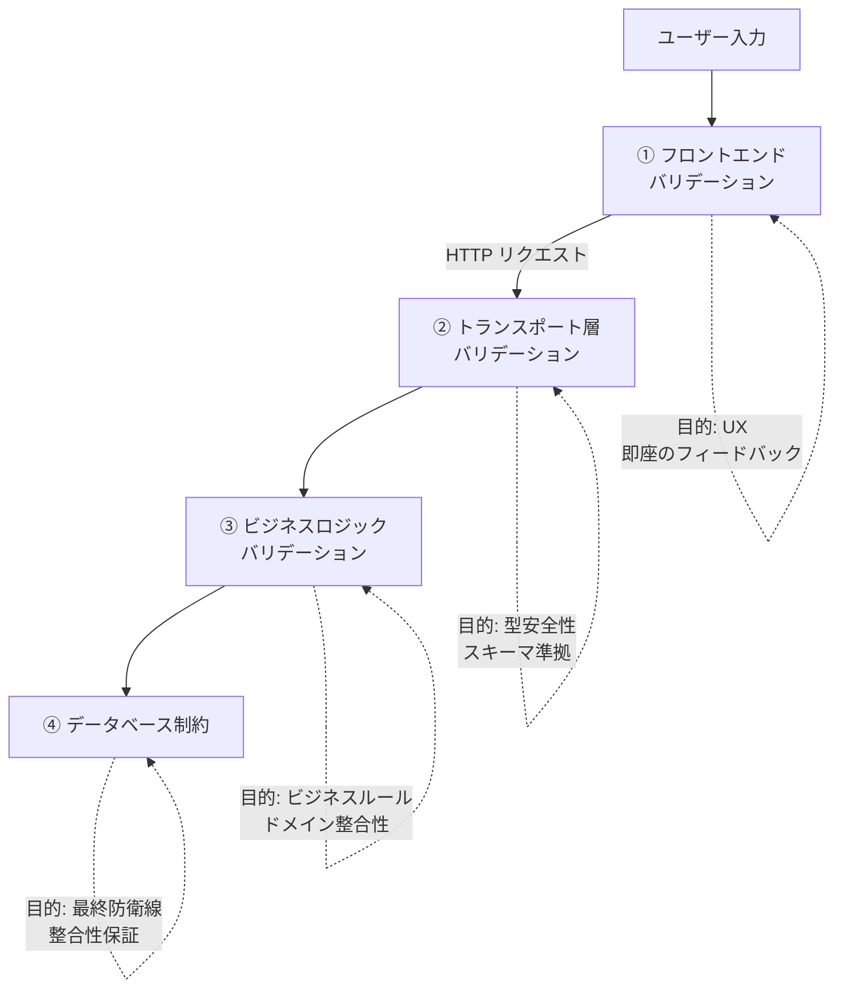
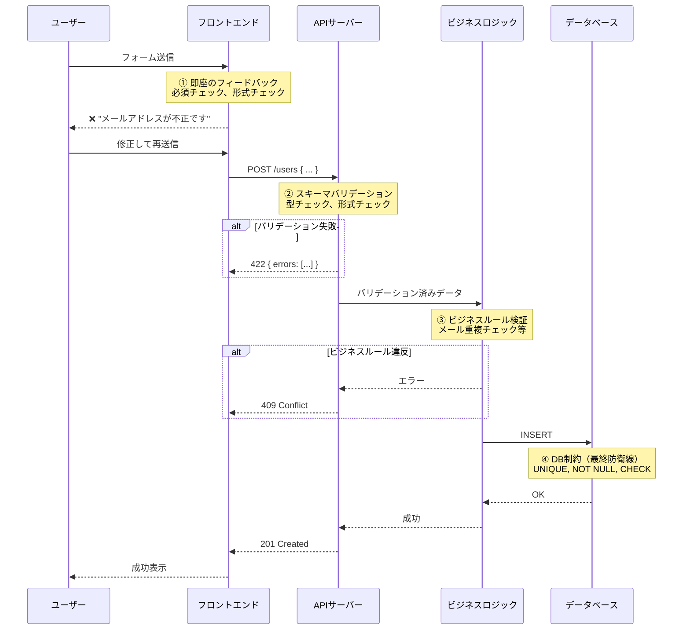

# バリデーション

> **一言で言うと:** 「外部からの入力は全て信用しない」という原則に基づき、データが処理に進む前に妥当性を検証する仕組み。フロントエンドのバリデーションはUX（即座のフィードバック）のため、バックエンドのバリデーションはセキュリティと整合性のため。この二重構造が必須。

## なぜ必要か

ユーザー入力・APIリクエスト・外部サービスのレスポンスなど、システムの外から来るデータは常に「壊れている可能性がある」。バリデーションがなければ、次のことが起きる。

- **[[SQLインジェクションとXSS]]** — 悪意ある入力がそのままDB操作やHTML出力に流れ込む
- **データの不整合** — マイナスの金額、存在しないIDへの参照、不正な日付がDBに入り込み、後続処理が破壊される
- **型エラーによるクラッシュ** — 数値を期待するフィールドに文字列が来てプロセスが落ちる
- **ビジネスロジックの前提崩壊** — 在庫数が負になる、年齢に200が入る、メールアドレスに空文字が入る

バリデーションは「信頼境界（Trust Boundary）」を守る門番であり、その境界の内側では入力データの正しさを前提としてロジックを書ける。

## どの問題を解決するか

### バリデーションの層 — どこで何を検証するか



| 層 | 何を検証するか | 例 | 突破されたら |
|---|---|---|---|
| ① フロントエンド | 形式・即座のフィードバック | 必須フィールド、メール形式、文字数 | UXが悪化するだけ。セキュリティは守れない |
| ② トランスポート層 | リクエストの構造と型 | JSONスキーマ、必須プロパティ、型の一致 | 不正な形式のデータがビジネスロジックに到達 |
| ③ ビジネスロジック | ドメインルール | 在庫 ≥ 注文数、年齢 ≥ 0、メールの重複なし | データの整合性が壊れる |
| ④ DB制約 | データ整合性の最終保証 | NOT NULL、UNIQUE、外部キー、CHECK制約 | DBが不整合状態になり回復困難 |

**全ての層が必要な理由:** フロントエンドバリデーションはブラウザの開発者ツールで簡単にバイパスできる。`curl`で直接APIを叩けばフロントエンドは完全にスキップされる。したがって**バックエンドのバリデーションがセキュリティの本体**であり、フロントエンドはUXの改善にすぎない。

### バリデーションの種類

| 種類 | 検証内容 | 例 |
|------|---------|---|
| 存在チェック（Presence） | 値が存在するか | 必須フィールドの空チェック |
| 型チェック（Type） | 期待する型か | 数値フィールドに文字列が来ていないか |
| 形式チェック（Format） | 特定のパターンに合致するか | メールアドレス、電話番号、UUID |
| 範囲チェック（Range） | 許容範囲内か | 0 < 年齢 < 150、文字数 ≤ 255 |
| 一意性チェック（Uniqueness） | 重複していないか | メールアドレスの重複（DBアクセスが必要） |
| 参照整合性（Referential） | 参照先が存在するか | 注文の商品IDが商品テーブルに存在するか |
| ビジネスルール | ドメイン固有のルール | 在庫数 ≥ 注文数、開始日 < 終了日 |

### バリデーションエラーの表現

バリデーションエラーは**フィールド単位で構造化**して返す。これにより、フロントエンドが該当フィールドの横にエラーメッセージを表示できる。

```json
{
  "error": {
    "code": "VALIDATION_ERROR",
    "message": "Input validation failed",
    "details": [
      { "field": "email", "rule": "format", "message": "must be a valid email address" },
      { "field": "age", "rule": "range", "message": "must be between 0 and 150" },
      { "field": "name", "rule": "presence", "message": "is required" }
    ]
  }
}
```

## 他の仕組みとどう関係するか

- **下位レイヤーとの関係:**
  - [[HTTP-HTTPS]] — HTTPリクエストのContent-Typeヘッダの検証（JSONを期待しているのにフォームデータが来る等）もバリデーションの一部
  - [[RDB]] — DB制約（NOT NULL、UNIQUE、CHECK、外部キー）はバリデーションの最終防衛線。アプリケーション層のバリデーションをすり抜けたデータもDB制約で止まる

- **同レイヤーとの関係:**
  - [[ルーティングとミドルウェア]] — バリデーションはミドルウェアとして実装できる。パスパラメータ（`:id` が数値であること等）の検証はルーティング層の責務
  - [[認証と認可]] — 認証トークンのフォーマット検証もバリデーションの一種。認可チェックは「認証済みユーザーの権限」の検証であり、入力バリデーションとは別の関心事
  - [[API設計-REST-GraphQL]] — RESTではリクエストボディのバリデーションをアプリケーション側で実装する必要があるが、GraphQLではスキーマの型定義による自動バリデーションが組み込まれている
  - [[エラーハンドリング]] — バリデーションエラーは最も頻出するエラー種別。422 Unprocessable Entityまたは400 Bad Requestで返し、フィールド単位のエラー詳細を含める

- **上位レイヤーとの関係:**
  - [[Layer6-セキュリティ/_index|セキュリティ]] — バリデーションは[[SQLインジェクションとXSS|SQLインジェクション・XSS]]の最初の防御線。ただしバリデーションだけでは不十分で、プリペアドステートメントやエスケープ処理も必要
  - [[Layer7-設計アーキテクチャ/_index|設計・アーキテクチャ]] — バリデーションロジックの配置はアーキテクチャ上の設計判断。コントローラ層（入力形式）とドメイン層（ビジネスルール）に分離するのが一般的

## 誤解されやすいポイント

1. **「フロントエンドでバリデーションしているからバックエンドは不要」という誤解**
   フロントエンドのバリデーションは`curl`やPostmanで完全にバイパスできる。ブラウザの開発者ツールでHTMLの`required`属性を削除するだけでもスキップ可能。フロントエンドバリデーションはUXのための即時フィードバックにすぎず、**バックエンドバリデーションがセキュリティの本体**。

2. **「正規表現でメールアドレスを完全に検証できる」という誤解**
   RFC 5322準拠のメールアドレス正規表現は極めて複雑で、完全な検証は現実的ではない。実務では「`@`を含み、ドメイン部分にドットがある」程度の緩い検証 + 確認メール送信が最も信頼できるアプローチ。過度に厳密な正規表現は正当なアドレスを弾いてしまうリスクがある。

3. **「バリデーションとサニタイズは同じ」という誤解**
   バリデーションは「データが正しいか検証し、不正なら拒否する」こと。[[バリデーションとサニタイズとエスケープ|サニタイズ（Sanitization）]]は「データを安全な形に変換する」こと（HTMLタグの除去、トリム等）。両者は補完的だが、サニタイズで済ませてバリデーションを省略するのは危険。例えば、SQLインジェクションをサニタイズで防ごうとするのは穴だらけになりうるが、プリペアドステートメントで構造的に防ぐのが正しい。

4. **「DB制約があればアプリケーション層のバリデーションは不要」という誤解**
   DB制約は最終防衛線だが、DBレベルのエラーメッセージ（`unique constraint violation`）はユーザーフレンドリーではなく、そこまでデータが到達する時点でトランザクションやネットワークのコストが無駄になっている。早い段階で弾く方が効率的。

5. **「型が付いていればバリデーションは不要」という誤解**
   TypeScriptの型はコンパイル時のチェックであり、実行時にはJSONをパースした`any`がそのまま流れる。Goの構造体も`json.Decoder`はJSONに含まれないフィールドをゼロ値のまま残すだけで、ビジネスルール（範囲、形式、値の妥当性）の検証は行わない。コンパイル時の型安全性と実行時のバリデーションは別の問題。

## 設計のベストプラクティス

### 推奨パターン

- **スキーマベースのバリデーション** — Zod（TypeScript）、Joi、JSON Schema、Go structタグなど、宣言的にスキーマを定義し、バリデーションロジックを自動生成する。手書きの`if`文の羅列より保守性が高い
- **バリデーションを信頼境界に集中させる** — システムの外部と内部の境界（APIハンドラの入口）でバリデーションを行い、内部関数間では型を信頼する
- **早期リターン（Early Return）** — バリデーション失敗は即座に422/400を返す。ビジネスロジックの前に全入力を検証し、正常系のコードをネストさせない
- **バリデーションとビジネスルールを分離する** — 「メールの形式が正しいか」（形式バリデーション）と「メールアドレスが既に登録されていないか」（ビジネスルール）は別の関心事として分離する
- **エラーメッセージにフィールド名とルールを含める** — `"email is required"` ではなく `{ field: "email", rule: "presence" }` のように構造化し、フロントエンドがi18n対応できるようにする

### アンチパターン

- **手書きのif文でバリデーションを積み上げる** — 検証ルールの追加・変更が煩雑になり、漏れが発生しやすい
- **バリデーションエラーを1つずつ返す** — 最初のエラーで止めると、ユーザーは修正→送信→次のエラーを何度も繰り返す。全フィールドのエラーを一度に返す
- **文字列結合でSQLを組み立てつつ、バリデーションで防ごうとする** — バリデーションは突破されうる前提で設計し、SQLインジェクションはプリペアドステートメントで構造的に防ぐ
- **許可リストではなく拒否リストでフィルタリングする** — 「`<script>`タグを禁止」ではなく「許可するHTML要素だけを列挙」するホワイトリスト方式が安全

## AIによる実装のアンチパターン

| アンチパターン | なぜ問題か | 対策 |
|---|---|---|
| 全フィールドにnull/undefinedチェックの`if`文を手書き | 冗長かつ漏れやすい。フィールド追加時にバリデーション追加を忘れる | スキーマバリデーションライブラリ（Zod, Joi, go-playground/validator）を使う |
| 正規表現でSQLインジェクションを防ごうとする | 正規表現では全パターンを網羅できない。構造的な防御ではない | プリペアドステートメント / パラメタライズドクエリで防ぐ |
| フロントとバックで同じバリデーションルールを二重実装 | ルール変更時に同期を忘れるリスク | 共有スキーマ定義（OpenAPI, Zod → 型生成）で単一ソースにする |
| バリデーションエラーで500を返す | クライアント起因のエラーを500にすると、モニタリングのS/N比が悪化し、本当のサーバーエラーが埋もれる | バリデーションエラーは422または400を返す |

## 具体例

### TypeScript — Zodによるスキーマベースバリデーション

```typescript
import { z } from 'zod';
import express from 'express';

const app = express();
app.use(express.json());

// スキーマ定義 — バリデーションルールと型が同時に得られる
const CreateUserSchema = z.object({
  name: z.string().min(1, 'is required').max(100, 'must be 100 characters or less'),
  email: z.string().email('must be a valid email address'),
  age: z.number().int().min(0, 'must be non-negative').max(150, 'must be realistic'),
  role: z.enum(['admin', 'user', 'editor']),
});

// スキーマから型を自動導出
type CreateUserInput = z.infer<typeof CreateUserSchema>;

// バリデーションミドルウェア
function validate<T>(schema: z.ZodSchema<T>) {
  return (req: express.Request, res: express.Response, next: express.NextFunction) => {
    const result = schema.safeParse(req.body);
    if (!result.success) {
      const details = result.error.issues.map(issue => ({
        field: issue.path.join('.'),
        rule: issue.code,
        message: issue.message,
      }));
      return res.status(422).json({
        error: { code: 'VALIDATION_ERROR', message: 'Input validation failed', details },
      });
    }
    // バリデーション済みデータをリクエストに設定
    (req as any).validated = result.data;
    next();
  };
}

app.post('/users', validate(CreateUserSchema), (req, res) => {
  const input: CreateUserInput = (req as any).validated;
  // ここではinputの型安全性が保証されている
  res.status(201).json({ id: 1, ...input });
});

app.listen(3000);
```

### Go — go-playground/validatorによる構造体バリデーション

```go
package main

import (
	"encoding/json"
	"net/http"

	"github.com/go-chi/chi/v5"
	"github.com/go-playground/validator/v10"
)

var validate = validator.New()

type CreateUserInput struct {
	Name  string `json:"name" validate:"required,max=100"`
	Email string `json:"email" validate:"required,email"`
	Age   int    `json:"age" validate:"gte=0,lte=150"`
	Role  string `json:"role" validate:"required,oneof=admin user editor"`
}

type ValidationError struct {
	Field   string `json:"field"`
	Rule    string `json:"rule"`
	Message string `json:"message"`
}

func formatValidationErrors(err error) []ValidationError {
	var errors []ValidationError
	for _, e := range err.(validator.ValidationErrors) {
		errors = append(errors, ValidationError{
			Field:   e.Field(),
			Rule:    e.Tag(),
			Message: e.Error(),
		})
	}
	return errors
}

func createUser(w http.ResponseWriter, r *http.Request) {
	var input CreateUserInput
	if err := json.NewDecoder(r.Body).Decode(&input); err != nil {
		w.WriteHeader(http.StatusBadRequest)
		json.NewEncoder(w).Encode(map[string]any{
			"error": map[string]any{"code": "INVALID_JSON", "message": "Request body must be valid JSON"},
		})
		return
	}

	if err := validate.Struct(input); err != nil {
		w.WriteHeader(http.StatusUnprocessableEntity)
		json.NewEncoder(w).Encode(map[string]any{
			"error": map[string]any{
				"code":    "VALIDATION_ERROR",
				"message": "Input validation failed",
				"details": formatValidationErrors(err),
			},
		})
		return
	}

	// バリデーション通過 — ビジネスロジックへ
	w.WriteHeader(http.StatusCreated)
	json.NewEncoder(w).Encode(map[string]any{"id": 1, "name": input.Name, "email": input.Email})
}

func main() {
	r := chi.NewRouter()
	r.Post("/users", createUser)
	http.ListenAndServe(":3000", r)
}
```

### Python — Pydanticによるバリデーション

```python
from fastapi import FastAPI, HTTPException
from pydantic import BaseModel, EmailStr, Field
from enum import Enum

app = FastAPI()


class Role(str, Enum):
    admin = "admin"
    user = "user"
    editor = "editor"


class CreateUserInput(BaseModel):
    name: str = Field(min_length=1, max_length=100)
    email: EmailStr
    age: int = Field(ge=0, le=150)
    role: Role


@app.post("/users", status_code=201)
def create_user(input: CreateUserInput):
    # Pydanticが自動でバリデーション → 失敗時は422レスポンス
    # ここに到達した時点で input の値は型安全
    return {"id": 1, **input.model_dump()}


# FastAPIのデフォルトバリデーションエラーレスポンス:
# {
#   "detail": [
#     {
#       "type": "string_too_short",
#       "loc": ["body", "name"],
#       "msg": "String should have at least 1 character",
#       "input": ""
#     }
#   ]
# }
```

### PHP — Laravelバリデーション

```php
<?php

namespace App\Http\Requests;

use Illuminate\Foundation\Http\FormRequest;

// FormRequestクラス — コントローラから分離された宣言的バリデーション
class CreateUserRequest extends FormRequest
{
    public function authorize(): bool
    {
        return true; // 認可チェックはここで行える
    }

    // rulesメソッドでバリデーションルールを宣言的に定義
    public function rules(): array
    {
        return [
            'name'  => ['required', 'string', 'max:100'],
            'email' => ['required', 'email', 'unique:users,email'],
            'age'   => ['required', 'integer', 'min:0', 'max:150'],
            'role'  => ['required', 'in:admin,user,editor'],
        ];
    }

    // カスタムエラーメッセージ（任意）
    public function messages(): array
    {
        return [
            'email.unique' => 'このメールアドレスは既に登録されています',
            'age.min'      => '年齢は0以上で入力してください',
        ];
    }
}
```

```php
<?php

namespace App\Rules;

use Closure;
use Illuminate\Contracts\Validation\ValidationRule;

// カスタムバリデーションルール
class NoDisposableEmail implements ValidationRule
{
    private array $blockedDomains = ['tempmail.com', 'throwaway.email'];

    public function validate(string $attribute, mixed $value, Closure $fail): void
    {
        $domain = substr(strrchr($value, '@'), 1);
        if (in_array($domain, $this->blockedDomains, true)) {
            $fail('使い捨てメールアドレスは使用できません');
        }
    }
}
```

```php
<?php

namespace App\Http\Controllers;

use App\Http\Requests\CreateUserRequest;
use App\Models\User;

class UserController extends Controller
{
    // FormRequestを型宣言するだけで自動バリデーション
    // バリデーション失敗時はLaravelが自動で422レスポンスを返す
    public function store(CreateUserRequest $request): \Illuminate\Http\JsonResponse
    {
        // $request->validated() でバリデーション済みデータのみ取得
        $user = User::create($request->validated());

        return response()->json(['id' => $user->id, ...$request->validated()], 201);
    }
}

// Laravelのデフォルトバリデーションエラーレスポンス:
// HTTP 422
// {
//   "message": "The given data was invalid.",
//   "errors": {
//     "email": ["このメールアドレスは既に登録されています"],
//     "age": ["年齢は0以上で入力してください"]
//   }
// }
```

### Ruby — Rails ActiveModelバリデーション

```ruby
# app/models/user.rb
class User < ApplicationRecord
  # モデルバリデーション — validates メソッドで宣言的に定義
  validates :name,  presence: true, length: { maximum: 100 }
  validates :email, presence: true,
                    format: { with: URI::MailTo::EMAIL_REGEXP, message: "は有効なメールアドレスを入力してください" },
                    uniqueness: { case_sensitive: false }
  validates :age,   presence: true,
                    numericality: { only_integer: true, greater_than_or_equal_to: 0, less_than_or_equal_to: 150 }
  validates :role,  presence: true, inclusion: { in: %w[admin user editor] }

  # カスタムバリデーションメソッド
  validate :email_not_disposable

  private

  BLOCKED_DOMAINS = %w[tempmail.com throwaway.email].freeze

  def email_not_disposable
    return if email.blank?

    domain = email.split("@").last
    if BLOCKED_DOMAINS.include?(domain)
      errors.add(:email, "使い捨てメールアドレスは使用できません")
    end
  end
end
```

```ruby
# app/controllers/users_controller.rb
class UsersController < ApplicationController
  def create
    # Strong Parameters — 許可するパラメータを明示的に宣言
    user = User.new(user_params)

    if user.save
      render json: { id: user.id, name: user.name, email: user.email }, status: :created
    else
      # バリデーションエラーを構造化して返す
      render json: {
        error: {
          code: "VALIDATION_ERROR",
          message: "Input validation failed",
          details: user.errors.map { |e| { field: e.attribute, message: e.full_message } }
        }
      }, status: :unprocessable_entity
    end
  end

  private

  def user_params
    params.require(:user).permit(:name, :email, :age, :role)
  end
end
```

```ruby
# app/validators/business_email_validator.rb
# カスタムバリデータクラス — 複数モデルで再利用可能
class BusinessEmailValidator < ActiveModel::EachValidator
  BLOCKED_DOMAINS = %w[tempmail.com throwaway.email].freeze

  def validate_each(record, attribute, value)
    return if value.blank?

    domain = value.split("@").last
    if BLOCKED_DOMAINS.include?(domain)
      record.errors.add(attribute, options[:message] || "は許可されていないドメインです")
    end
  end
end

# 使用例:
# class User < ApplicationRecord
#   validates :email, business_email: true
# end
```

### バリデーション層の全体像



## 参考リソース

- OWASP Input Validation Cheat Sheet — 入力バリデーションのセキュリティベストプラクティス
- Zod 公式ドキュメント — TypeScript向けスキーマバリデーションの標準
- go-playground/validator — Go構造体バリデーションの業界標準ライブラリ
- Pydantic 公式ドキュメント — Python向けデータバリデーション
- RFC 5322 — メールアドレスのフォーマット仕様（なぜ正規表現だけでは不十分かの根拠）

## 学習メモ

- Zodのスキーマから型を導出（`z.infer`）するパターンは、バリデーションと型定義の単一ソース化として非常に有用
- GraphQLのスキーマはトランスポート層バリデーション（型・必須フィールド）を自動で行うが、ビジネスルールのバリデーションはリゾルバで別途必要
- バリデーションエラーのレスポンス形式はプロジェクト初期に統一しておくべき設計判断。[[エラーハンドリング]]のレスポンス設計と合わせて決める
