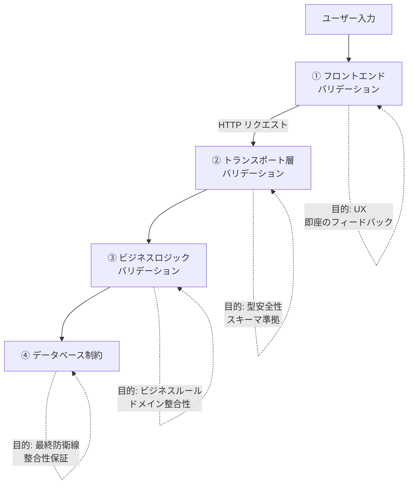
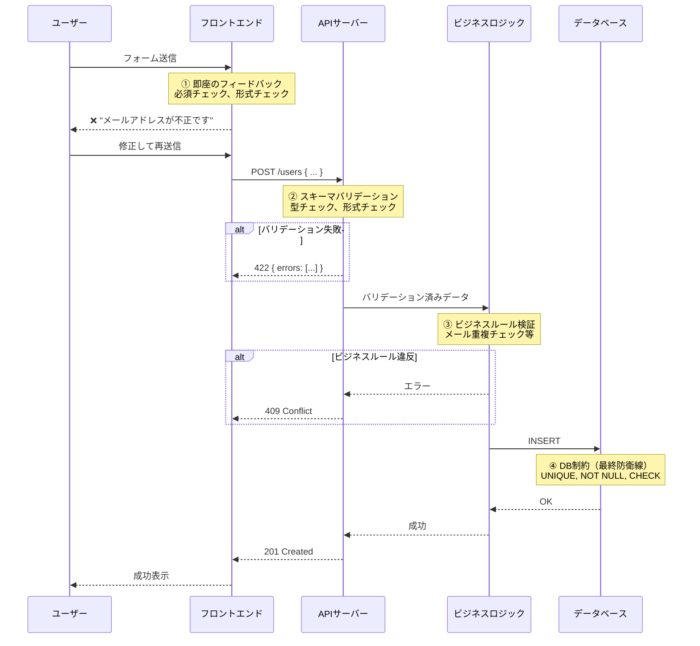

# バリデーション

> **一言で言うと:** 「外部からの入力は全て信用しない」という原則に基づき、データが処理に進む前に妥当性を検証する仕組み。フロントエンドはUX、バックエンドはセキュリティ・整合性のため。**バックエンドが本体**で、フロントエンドはおまけ。

## 3分で全体像

- **何を解決する技術か:** 外部から来る入力（HTTPリクエスト・外部APIレスポンス・ファイル）の不正・破壊・攻撃を、ビジネスロジックに到達する**前**に弾く。SQLインジェクション・XSS・型エラークラッシュ・ビジネス前提崩壊の最初の防御線
- **代表的な使用シーン:** REST/GraphQL APIのリクエストボディ検証、フォーム入力検証、ファイルアップロード（拡張子・サイズ）、外部API レスポンス検証、Webhookペイロードの整合性確認
- **これだけは覚える3つ:**
    1. **フロントエンドは UX、バックエンドは本体** — フロントは `curl` / Postman / DevTools で簡単にバイパスされる。バックエンドのバリデーションがセキュリティの本体であり、フロントエンドのバリデーションは即時フィードバックのおまけ。**両方必須** だが、**バックエンドを抜く選択肢はない**
    2. **スキーマベースで宣言的に書く** — Zod（TS）・Pydantic（Python）・go-playground/validator（Go）・FormRequest（Laravel）・ActiveModel（Rails）など、宣言的スキーマでルールと型を同時定義する。`if (input.name === "")` のような手書き条件分岐は漏れ・冗長性・型の二重管理で必ず破綻する
    3. **層ごとに役割が違う** — ① フロント（UX 即時フィードバック）/ ② トランスポート（型・形式・必須）/ ③ ビジネスロジック（ドメインルール: 在庫 ≥ 注文数等）/ ④ DB制約（最終防衛線: UNIQUE / NOT NULL / FK / CHECK）。**全部必要**で、上の層が突破されても下が止める多層防御
- **AIに任せやすいか:** **任せやすい** — Zod / Pydantic / FormRequest スキーマの記述は AI が高品質に書ける。ただし「**どの層で何を検証するか**」「**ビジネスルールとフォーマット検証の分離**」「**許可リスト vs 拒否リスト**」の設計判断は人間が握る。AIコードレビュー観点で「正規表現で SQLi を防ごうとしている」「拒否リスト方式で穴がある」を必ずチェック
- **詰まったらここを読む:** [[エラーハンドリング]] / [[SQLインジェクションとXSS]] / [[認証と認可]]

## なぜ必要か

ユーザー入力・APIリクエスト・外部サービスのレスポンスなど、システムの外から来るデータは常に「壊れている可能性がある」。バリデーションがなければ、次のことが起きる。

- **[[SQLインジェクションとXSS]]** — 悪意ある入力がそのままDB操作やHTML出力に流れ込む
- **データの不整合** — マイナスの金額、存在しないIDへの参照、不正な日付がDBに入り込み、後続処理が破壊される
- **型エラーによるクラッシュ** — 数値を期待するフィールドに文字列が来てプロセスが落ちる
- **ビジネスロジックの前提崩壊** — 在庫数が負になる、年齢に200が入る、メールアドレスに空文字が入る

バリデーションは「信頼境界（Trust Boundary）」を守る門番であり、その境界の内側では入力データの正しさを前提としてロジックを書ける。

## どの問題を解決するか

### バリデーションの層 — どこで何を検証するか


```mermaid
flowchart TB
    U["ユーザー入力"] --> F["① フロントエンド<br/>バリデーション"]
    F -->|"HTTP リクエスト"| T["② トランスポート層<br/>バリデーション"]
    T --> B["③ ビジネスロジック<br/>バリデーション"]
    B --> D["④ データベース制約"]

    F -.->|"目的: UX<br/>即座のフィードバック"| F
    T -.->|"目的: 型安全性<br/>スキーマ準拠"| T
    B -.->|"目的: ビジネスルール<br/>ドメイン整合性"| B
    D -.->|"目的: 最終防衛線<br/>整合性保証"| D
```

| 層 | 何を検証するか | 例 | 突破されたら |
|---|---|---|---|
| ① フロントエンド | 形式・即座のフィードバック | 必須フィールド、メール形式、文字数 | UXが悪化するだけ。セキュリティは守れない |
| ② トランスポート層 | リクエストの構造と型 | JSONスキーマ、必須プロパティ、型の一致 | 不正な形式のデータがビジネスロジックに到達 |
| ③ ビジネスロジック | ドメインルール | 在庫 ≥ 注文数、年齢 ≥ 0、メールの重複なし | データの整合性が壊れる |
| ④ DB制約 | データ整合性の最終保証 | NOT NULL、UNIQUE、外部キー、CHECK制約 | DBが不整合状態になり回復困難 |

**全ての層が必要な理由:** フロントエンドバリデーションはブラウザの開発者ツールで簡単にバイパスできる。`curl`で直接APIを叩けばフロントエンドは完全にスキップされる。したがって**バックエンドのバリデーションがセキュリティの本体**であり、フロントエンドはUXの改善にすぎない。

### バリデーションの種類

| 種類 | 検証内容 | 例 |
|------|---------|---|
| 存在チェック（Presence） | 値が存在するか | 必須フィールドの空チェック |
| 型チェック（Type） | 期待する型か | 数値フィールドに文字列が来ていないか |
| 形式チェック（Format） | 特定のパターンに合致するか | メールアドレス、電話番号、UUID |
| 範囲チェック（Range） | 許容範囲内か | 0 < 年齢 < 150、文字数 ≤ 255 |
| 一意性チェック（Uniqueness） | 重複していないか | メールアドレスの重複（DBアクセスが必要） |
| 参照整合性（Referential） | 参照先が存在するか | 注文の商品IDが商品テーブルに存在するか |
| ビジネスルール | ドメイン固有のルール | 在庫数 ≥ 注文数、開始日 < 終了日 |

### バリデーションエラーの表現

バリデーションエラーは**フィールド単位で構造化**して返す。これにより、フロントエンドが該当フィールドの横にエラーメッセージを表示できる。

```json
{
  "error": {
    "code": "VALIDATION_ERROR",
    "message": "Input validation failed",
    "details": [
      { "field": "email", "rule": "format", "message": "must be a valid email address" },
      { "field": "age", "rule": "range", "message": "must be between 0 and 150" },
      { "field": "name", "rule": "presence", "message": "is required" }
    ]
  }
}
```

## 他の仕組みとどう関係するか

- **下位レイヤーとの関係:**
  - [[HTTP-HTTPS]] — HTTPリクエストのContent-Typeヘッダの検証（JSONを期待しているのにフォームデータが来る等）もバリデーションの一部
  - [[RDB]] — DB制約（NOT NULL、UNIQUE、CHECK、外部キー）はバリデーションの最終防衛線。アプリケーション層のバリデーションをすり抜けたデータもDB制約で止まる

- **同レイヤーとの関係:**
  - [[ルーティングとミドルウェア]] — バリデーションはミドルウェアとして実装できる。パスパラメータ（`:id` が数値であること等）の検証はルーティング層の責務
  - [[認証と認可]] — 認証トークンのフォーマット検証もバリデーションの一種。認可チェックは「認証済みユーザーの権限」の検証であり、入力バリデーションとは別の関心事
  - [[API設計-REST-GraphQL]] — RESTではリクエストボディのバリデーションをアプリケーション側で実装する必要があるが、GraphQLではスキーマの型定義による自動バリデーションが組み込まれている
  - [[エラーハンドリング]] — バリデーションエラーは最も頻出するエラー種別。422 Unprocessable Entityまたは400 Bad Requestで返し、フィールド単位のエラー詳細を含める

- **上位レイヤーとの関係:**
  - [[Layer6-セキュリティ/_index|セキュリティ]] — バリデーションは[[SQLインジェクションとXSS|SQLインジェクション・XSS]]の最初の防御線。ただしバリデーションだけでは不十分で、プリペアドステートメントやエスケープ処理も必要
  - [[Layer7-設計アーキテクチャ/_index|設計・アーキテクチャ]] — バリデーションロジックの配置はアーキテクチャ上の設計判断。コントローラ層（入力形式）とドメイン層（ビジネスルール）に分離するのが一般的

## 誤解されやすいポイント

1. **「フロントエンドでバリデーションしているからバックエンドは不要」という誤解**
   フロントエンドのバリデーションは`curl`やPostmanで完全にバイパスできる。ブラウザの開発者ツールでHTMLの`required`属性を削除するだけでもスキップ可能。フロントエンドバリデーションはUXのための即時フィードバックにすぎず、**バックエンドバリデーションがセキュリティの本体**。

2. **「正規表現でメールアドレスを完全に検証できる」という誤解**
   RFC 5322準拠のメールアドレス正規表現は極めて複雑で、完全な検証は現実的ではない。実務では「`@`を含み、ドメイン部分にドットがある」程度の緩い検証 + 確認メール送信が最も信頼できるアプローチ。過度に厳密な正規表現は正当なアドレスを弾いてしまうリスクがある。

3. **「バリデーションとサニタイズは同じ」という誤解**
   バリデーションは「データが正しいか検証し、不正なら拒否する」こと。[[バリデーションとサニタイズとエスケープ|サニタイズ（Sanitization）]]は「データを安全な形に変換する」こと（HTMLタグの除去、トリム等）。両者は補完的だが、サニタイズで済ませてバリデーションを省略するのは危険。例えば、SQLインジェクションをサニタイズで防ごうとするのは穴だらけになりうるが、プリペアドステートメントで構造的に防ぐのが正しい。

4. **「DB制約があればアプリケーション層のバリデーションは不要」という誤解**
   DB制約は最終防衛線だが、DBレベルのエラーメッセージ（`unique constraint violation`）はユーザーフレンドリーではなく、そこまでデータが到達する時点でトランザクションやネットワークのコストが無駄になっている。早い段階で弾く方が効率的。

5. **「型が付いていればバリデーションは不要」という誤解**
   TypeScriptの型はコンパイル時のチェックであり、実行時にはJSONをパースした`any`がそのまま流れる。Goの構造体も`json.Decoder`はJSONに含まれないフィールドをゼロ値のまま残すだけで、ビジネスルール（範囲、形式、値の妥当性）の検証は行わない。コンパイル時の型安全性と実行時のバリデーションは別の問題。

## 設計のベストプラクティス

### 推奨パターン

- **スキーマベースのバリデーション** — [[zod|Zod]]（TypeScript）、Joi、[[JSON-Schema|JSON Schema]]、Go structタグなど、宣言的にスキーマを定義し、バリデーションロジックを自動生成する。手書きの`if`文の羅列より保守性が高い
- **バリデーションを信頼境界に集中させる** — システムの外部と内部の境界（APIハンドラの入口）でバリデーションを行い、内部関数間では型を信頼する
- **早期リターン（Early Return）** — バリデーション失敗は即座に422/400を返す。ビジネスロジックの前に全入力を検証し、正常系のコードをネストさせない
- **バリデーションとビジネスルールを分離する** — 「メールの形式が正しいか」（形式バリデーション）と「メールアドレスが既に登録されていないか」（ビジネスルール）は別の関心事として分離する
- **エラーメッセージにフィールド名とルールを含める** — `"email is required"` ではなく `{ field: "email", rule: "presence" }` のように構造化し、フロントエンドがi18n対応できるようにする

### アンチパターン

- **手書きのif文でバリデーションを積み上げる** — 検証ルールの追加・変更が煩雑になり、漏れが発生しやすい
- **バリデーションエラーを1つずつ返す** — 最初のエラーで止めると、ユーザーは修正→送信→次のエラーを何度も繰り返す。全フィールドのエラーを一度に返す
- **文字列結合でSQLを組み立てつつ、バリデーションで防ごうとする** — バリデーションは突破されうる前提で設計し、SQLインジェクションはプリペアドステートメントで構造的に防ぐ
- **許可リストではなく拒否リストでフィルタリングする** — 「`<script>`タグを禁止」ではなく「許可するHTML要素だけを列挙」するホワイトリスト方式が安全

## AIエージェントとの協働

> このトピックでAIコーディングエージェント（Claude Code, Copilot, Cursor 等）と協働するための観点。
> スキーマ定義とバリデーションミドルウェアは AI に任せやすい一方、**「層ごとの責務分離」「許可リスト vs 拒否リスト」「正規表現での SQLi 対策誤用」** は誤りが頻出する。レビューもAIコードレビュー観点で横断アンチパターン照合に任せられる。

### AIに任せられる部分 / 人間が判断すべき部分

| タスク種類 | 任せ方（実装/レビュー） | 人間の関与 |
|---|---|---|
| Zod / Pydantic / validator スキーマ定義 | AI に任せる | 何が必須・任意か、許容範囲、列挙値はビジネス要件で決める |
| バリデーションミドルウェアの実装 | AI 実装、AIコードレビュー観点でレビュー | エラーレスポンスフォーマットは [[エラーハンドリング]] の規約と統一する |
| カスタムバリデータ（業務ドメイン固有） | AI に複数案を出させる | ドメインルールの正解は AI の知らない要件。人間がテストケースを書く |
| OpenAPI からの型・スキーマ自動生成 | AI に任せる | OpenAPI 自体の設計は API 設計判断（[[API設計-REST-GraphQL]]） |
| レイヤー間の責務切り分け（コントローラ vs ドメイン） | AI に分割案を出させる | 信頼境界（Trust Boundary）の位置はアーキテクチャ判断 |
| フロント・バック スキーマ共有 | AI に Zod → TS 型生成、OpenAPI → クライアント生成を任せる | 単一ソースの選定（Zod / OpenAPI / GraphQL SDL）はチーム判断 |

### AI生成コードのレビュー観点（このトピック固有）

AI生成のバリデーションコードを受け取ったとき、最低限ここを見る。

1. **正規表現で SQLi / XSS を防ごうとしていないか** — `if (/select|drop|union/i.test(input))` のような拒否リスト式の正規表現は、`SeLeCt`・URL エンコード・SQLコメント `/**/` など無数のバイパス手段がある。SQLi はプリペアドステートメント、XSS は出力時エスケープで**構造的に**防ぐべきで、入力バリデーションは補助でしかない。バリデーションの役割は「ビジネス的な妥当性」に絞る
2. **拒否リスト方式になっていないか / 許可リストにすべき箇所か** — 「`<script>` を禁止」「特定のキーワードを禁止」など拒否リスト（ブラックリスト）は **禁止すべき値を全列挙する責任** が生まれて穴だらけになる。「`/^[a-zA-Z0-9_-]+$/` のみ許可」「列挙値 `'admin'|'user'|'editor'` のみ許可」など許可リスト（ホワイトリスト・列挙）方式が安全
3. **層の責務が混在していないか** — トランスポート層（型・形式・必須）でビジネスルール（メール重複・在庫数）を検証している、または逆にビジネスロジック層で型チェックを再実装している、というレイヤー違反が起きていないか。**コントローラはスキーマで形式を**、**ドメイン / リポジトリはビジネスルールを** 検証する分離

### 効くプロンプトの型

このトピックに関する実装をAIに依頼するとき、コンテキストとして渡すべき情報・制約・成功基準のテンプレ。

```
# 前提（プロジェクトの状況・既存のコード規約）
- 言語/フレームワーク: TypeScript + Express、Go + Chi、PHP + Laravel など
- バリデーションライブラリ: Zod 3.x / Pydantic v2 / go-playground/validator/v10 / FormRequest
- 既存スキーマの命名規則: Create{Resource}Schema / {Resource}CreateInput
- エラーレスポンス規約: { error: { code: "VALIDATION_ERROR", message, details: [{field, rule, message}] } }
- HTTPステータス: 400 (リクエスト形式不正) / 422 (スキーマは正しいが値がビジネス的に不正)

# やってほしいこと
- 「{要件}」のリクエストバリデーションスキーマと、ミドルウェアでの適用
- フロント側で再利用するための型エクスポート / OpenAPI 出力

# 守ってほしい制約（このトピック固有のもの）
- スキーマベースで宣言的に書く（手書きの if 文は禁止）
- 拒否リストではなく許可リスト（列挙値・正規表現で許可文字を限定）で書く
- 正規表現で SQLi/XSS を防がない（プリペアドステートメント・出力エスケープが本体）
- トランスポート層は型・形式・必須・範囲のみ。重複チェックや権限はドメイン層
- 全フィールドのエラーを一度に返す（最初のエラーで止めない）
- フィールド単位で構造化したエラー (field, rule, message) を返す
- バリデーション失敗は 422 (または 400)、500 ではない
- エラーメッセージにユーザー入力をそのまま含めない（XSS リフレクト対策）

# 完了の判断基準
- スキーマだけ見てリクエスト形式が完全に把握できる
- 同じスキーマから TypeScript の型 / OpenAPI が導出できる
- 全エラーが構造化され、フロントが該当フィールド横にメッセージ表示できる
- ビジネスルール検証はスキーマの後段（サービス/ドメイン層）に明確に分離
```

### AI実装のアンチパターン

LLM生成コードで頻出する過剰設計・誤用パターン。レビュー時の照合表として使う。

| アンチパターン | なぜ問題か | レビュー観点 / 対策 |
|---|---|---|
| 全フィールドに `if (!input.name)` の手書きチェック | 冗長・漏れやすい・型と二重管理。フィールド追加時に検証追加を忘れる | スキーマライブラリ（Zod / Pydantic / validator / FormRequest）に集約 |
| 正規表現で SQLi / XSS を防ごうとする | 拒否リストはバイパス手段が無数（`SeLeCt`・URL エンコード・`/**/` コメント等）。構造的防御ではない | SQLi はプリペアドステートメント、XSS は出力時エスケープで構造的に防ぐ。バリデーションは補助 |
| 拒否リスト方式（`'<script>'` を禁止 等） | 禁止すべき値を全列挙する責任が発生し、穴だらけになる | 許可リスト（列挙値・許可文字の正規表現）に切り替える |
| フロントとバックで同じルールを別実装 | ルール変更時に同期を忘れて挙動が乖離 | OpenAPI / Zod → 型生成 / GraphQL SDL で単一ソース化 |
| バリデーション失敗で 500 を返す | クライアント起因エラーが 5xx に紛れ、アラートとリトライ戦略が誤作動 | 422 (Unprocessable Entity) または 400 を返す |
| 最初のエラーで処理を止める | ユーザーが「修正→送信→次のエラー」を何度も繰り返す UX 悪化 | 全フィールドのエラーを集めて一度に返す（多くのスキーマライブラリのデフォルト） |
| エラーメッセージにユーザー入力をそのまま含める | Reflected XSS の温床、ログ injection の経路 | サニタイズ後に含めるか、ID 参照のみログに残す |
| ビジネスルール検証をスキーマに混ぜる（DB を呼ぶ） | スキーマが副作用を持ち、テスト困難。型生成も難しくなる | スキーマは純粋な形式検証、メール重複・在庫チェックはドメイン層に置く |
| TypeScript / Go の型さえ付けば検証不要と考える | 型はコンパイル時のみ。`JSON.parse` の戻りは `any`、Go の `json.Decode` はゼロ値を埋めるだけ | 実行時バリデーションは別途必須 |
| 過度に厳密なメール正規表現 | RFC 5322 完全準拠は極めて複雑。正当なメールを弾く | `@` を含み、ドメインにドット程度の緩い検証 + 確認メール送信が現実的 |

→ レイヤー横断のアンチパターン索引: [[_anti-patterns/_index|AIアンチパターン索引]] / [[_anti-patterns/レイヤー別/Layer4-Backend|Layer 4 Backend アンチパターン集]]

## 具体例

### TypeScript — Zodによるスキーマベースバリデーション

```typescript
import { z } from 'zod';
import express from 'express';

const app = express();
app.use(express.json());

// スキーマ定義 — バリデーションルールと型が同時に得られる
const CreateUserSchema = z.object({
  name: z.string().min(1, 'is required').max(100, 'must be 100 characters or less'),
  email: z.string().email('must be a valid email address'),
  age: z.number().int().min(0, 'must be non-negative').max(150, 'must be realistic'),
  role: z.enum(['admin', 'user', 'editor']),
});

// スキーマから型を自動導出
type CreateUserInput = z.infer<typeof CreateUserSchema>;

// バリデーションミドルウェア（Zod 3.x 前提。Zod 4（2025 GA）では型 API が
// `z.ZodType<T>` → `z.core.$ZodType<T>` 系へ整理され、`safeParse` の戻り値構造や
// `issues` のフィールドも一部変わるため、移行時はリリースノート参照）
function validate<T>(schema: z.ZodType<T>) {
  return (req: express.Request, res: express.Response, next: express.NextFunction) => {
    const result = schema.safeParse(req.body);
    if (!result.success) {
      const details = result.error.issues.map(issue => ({
        field: issue.path.join('.'),
        rule: issue.code,
        message: issue.message,
      }));
      return res.status(422).json({
        error: { code: 'VALIDATION_ERROR', message: 'Input validation failed', details },
      });
    }
    // バリデーション済みデータをリクエストに設定
    (req as any).validated = result.data;
    next();
  };
}

app.post('/users', validate(CreateUserSchema), (req, res) => {
  const input: CreateUserInput = (req as any).validated;
  // ここではinputの型安全性が保証されている
  res.status(201).json({ id: 1, ...input });
});

app.listen(3000);
```

### Go — go-playground/validatorによる構造体バリデーション

```go
package main

import (
	"encoding/json"
	"net/http"

	"github.com/go-chi/chi/v5"
	"github.com/go-playground/validator/v10"
)

var validate = validator.New()

type CreateUserInput struct {
	Name  string `json:"name" validate:"required,max=100"`
	Email string `json:"email" validate:"required,email"`
	Age   int    `json:"age" validate:"gte=0,lte=150"`
	Role  string `json:"role" validate:"required,oneof=admin user editor"`
}

type ValidationError struct {
	Field   string `json:"field"`
	Rule    string `json:"rule"`
	Message string `json:"message"`
}

func formatValidationErrors(err error) []ValidationError {
	var errors []ValidationError
	for _, e := range err.(validator.ValidationErrors) {
		errors = append(errors, ValidationError{
			Field:   e.Field(),
			Rule:    e.Tag(),
			Message: e.Error(),
		})
	}
	return errors
}

func createUser(w http.ResponseWriter, r *http.Request) {
	var input CreateUserInput
	if err := json.NewDecoder(r.Body).Decode(&input); err != nil {
		w.WriteHeader(http.StatusBadRequest)
		json.NewEncoder(w).Encode(map[string]any{
			"error": map[string]any{"code": "INVALID_JSON", "message": "Request body must be valid JSON"},
		})
		return
	}

	if err := validate.Struct(input); err != nil {
		w.WriteHeader(http.StatusUnprocessableEntity)
		json.NewEncoder(w).Encode(map[string]any{
			"error": map[string]any{
				"code":    "VALIDATION_ERROR",
				"message": "Input validation failed",
				"details": formatValidationErrors(err),
			},
		})
		return
	}

	// バリデーション通過 — ビジネスロジックへ
	w.WriteHeader(http.StatusCreated)
	json.NewEncoder(w).Encode(map[string]any{"id": 1, "name": input.Name, "email": input.Email})
}

func main() {
	r := chi.NewRouter()
	r.Post("/users", createUser)
	http.ListenAndServe(":3000", r)
}
```

### Python — Pydanticによるバリデーション

```python
from fastapi import FastAPI, HTTPException
from pydantic import BaseModel, EmailStr, Field
from enum import Enum

app = FastAPI()


class Role(str, Enum):
    admin = "admin"
    user = "user"
    editor = "editor"


class CreateUserInput(BaseModel):
    name: str = Field(min_length=1, max_length=100)
    email: EmailStr
    age: int = Field(ge=0, le=150)
    role: Role


@app.post("/users", status_code=201)
def create_user(input: CreateUserInput):
    # Pydanticが自動でバリデーション → 失敗時は422レスポンス
    # ここに到達した時点で input の値は型安全
    return {"id": 1, **input.model_dump()}


# FastAPIのデフォルトバリデーションエラーレスポンス:
# {
#   "detail": [
#     {
#       "type": "string_too_short",
#       "loc": ["body", "name"],
#       "msg": "String should have at least 1 character",
#       "input": ""
#     }
#   ]
# }
```

### PHP — Laravelバリデーション

```php
<?php

namespace App\Http\Requests;

use Illuminate\Foundation\Http\FormRequest;

// FormRequestクラス — コントローラから分離された宣言的バリデーション
class CreateUserRequest extends FormRequest
{
    public function authorize(): bool
    {
        return true; // 認可チェックはここで行える
    }

    // rulesメソッドでバリデーションルールを宣言的に定義
    public function rules(): array
    {
        return [
            'name'  => ['required', 'string', 'max:100'],
            'email' => ['required', 'email', 'unique:users,email'],
            'age'   => ['required', 'integer', 'min:0', 'max:150'],
            'role'  => ['required', 'in:admin,user,editor'],
        ];
    }

    // カスタムエラーメッセージ（任意）
    public function messages(): array
    {
        return [
            'email.unique' => 'このメールアドレスは既に登録されています',
            'age.min'      => '年齢は0以上で入力してください',
        ];
    }
}
```

```php
<?php

namespace App\Rules;

use Closure;
use Illuminate\Contracts\Validation\ValidationRule;

// カスタムバリデーションルール
class NoDisposableEmail implements ValidationRule
{
    private array $blockedDomains = ['tempmail.com', 'throwaway.email'];

    public function validate(string $attribute, mixed $value, Closure $fail): void
    {
        $domain = substr(strrchr($value, '@'), 1);
        if (in_array($domain, $this->blockedDomains, true)) {
            $fail('使い捨てメールアドレスは使用できません');
        }
    }
}
```

```php
<?php

namespace App\Http\Controllers;

use App\Http\Requests\CreateUserRequest;
use App\Models\User;

class UserController extends Controller
{
    // FormRequestを型宣言するだけで自動バリデーション
    // バリデーション失敗時はLaravelが自動で422レスポンスを返す
    public function store(CreateUserRequest $request): \Illuminate\Http\JsonResponse
    {
        // $request->validated() でバリデーション済みデータのみ取得
        $user = User::create($request->validated());

        return response()->json(['id' => $user->id, ...$request->validated()], 201);
    }
}

// Laravelのデフォルトバリデーションエラーレスポンス:
// HTTP 422
// {
//   "message": "The given data was invalid.",
//   "errors": {
//     "email": ["このメールアドレスは既に登録されています"],
//     "age": ["年齢は0以上で入力してください"]
//   }
// }
```

### Ruby — Rails ActiveModelバリデーション

```ruby
# app/models/user.rb
class User < ApplicationRecord
  # モデルバリデーション — validates メソッドで宣言的に定義
  validates :name,  presence: true, length: { maximum: 100 }
  validates :email, presence: true,
                    format: { with: URI::MailTo::EMAIL_REGEXP, message: "は有効なメールアドレスを入力してください" },
                    uniqueness: { case_sensitive: false }
  validates :age,   presence: true,
                    numericality: { only_integer: true, greater_than_or_equal_to: 0, less_than_or_equal_to: 150 }
  validates :role,  presence: true, inclusion: { in: %w[admin user editor] }

  # カスタムバリデーションメソッド
  validate :email_not_disposable

  private

  BLOCKED_DOMAINS = %w[tempmail.com throwaway.email].freeze

  def email_not_disposable
    return if email.blank?

    domain = email.split("@").last
    if BLOCKED_DOMAINS.include?(domain)
      errors.add(:email, "使い捨てメールアドレスは使用できません")
    end
  end
end
```

```ruby
# app/controllers/users_controller.rb
class UsersController < ApplicationController
  def create
    # Strong Parameters — 許可するパラメータを明示的に宣言
    user = User.new(user_params)

    if user.save
      render json: { id: user.id, name: user.name, email: user.email }, status: :created
    else
      # バリデーションエラーを構造化して返す
      render json: {
        error: {
          code: "VALIDATION_ERROR",
          message: "Input validation failed",
          details: user.errors.map { |e| { field: e.attribute, message: e.full_message } }
        }
      }, status: :unprocessable_entity
    end
  end

  private

  def user_params
    params.require(:user).permit(:name, :email, :age, :role)
  end
end
```

```ruby
# app/validators/business_email_validator.rb
# カスタムバリデータクラス — 複数モデルで再利用可能
class BusinessEmailValidator < ActiveModel::EachValidator
  BLOCKED_DOMAINS = %w[tempmail.com throwaway.email].freeze

  def validate_each(record, attribute, value)
    return if value.blank?

    domain = value.split("@").last
    if BLOCKED_DOMAINS.include?(domain)
      record.errors.add(attribute, options[:message] || "は許可されていないドメインです")
    end
  end
end

# 使用例:
# class User < ApplicationRecord
#   validates :email, business_email: true
# end
```

### バリデーション層の全体像


```mermaid
sequenceDiagram
    participant User as ユーザー
    participant FE as フロントエンド
    participant API as APIサーバー
    participant BL as ビジネスロジック
    participant DB as データベース

    User->>FE: フォーム送信
    Note over FE: ① 即座のフィードバック<br/>必須チェック、形式チェック
    FE-->>User: ❌ "メールアドレスが不正です"
    User->>FE: 修正して再送信
    FE->>API: POST /users { ... }

    Note over API: ② スキーマバリデーション<br/>型チェック、形式チェック
    alt バリデーション失敗
        API-->>FE: 422 { errors: [...] }
    end

    API->>BL: バリデーション済みデータ
    Note over BL: ③ ビジネスルール検証<br/>メール重複チェック等
    alt ビジネスルール違反
        BL-->>API: エラー
        API-->>FE: 409 Conflict
    end

    BL->>DB: INSERT
    Note over DB: ④ DB制約（最終防衛線）<br/>UNIQUE, NOT NULL, CHECK
    DB-->>BL: OK
    BL-->>API: 成功
    API-->>FE: 201 Created
    FE-->>User: 成功表示
```

## 参考リソース

- OWASP Input Validation Cheat Sheet — 入力バリデーションのセキュリティベストプラクティス
- Zod 公式ドキュメント — TypeScript向けスキーマバリデーションの標準
- go-playground/validator — Go構造体バリデーションの業界標準ライブラリ
- Pydantic 公式ドキュメント — Python向けデータバリデーション
- RFC 5322 — メールアドレスのフォーマット仕様（なぜ正規表現だけでは不十分かの根拠）

## 理解度セルフチェック

> 答えられなければ本文に戻る。答えはこのファイル内に必ずある。

1. **「フロントエンドでバリデーションしているからバックエンドは不要」がなぜ誤りか、30秒で説明せよ。** どうすればフロントエンドのバリデーションを「外せる」か、具体的な手法も挙げること。
2. **「バリデーションで SQLインジェクションを防ぐ」というアプローチがなぜ穴だらけになるか?** 正しい防御方法と、バリデーションの本来の役割を述べよ。
3. **AI生成コードレビュー設問:** AI が以下のユーザー登録バリデーションを生成した。本文の観点で **問題点を最低3つ** 指摘せよ。

```typescript
// ユーザー登録ハンドラ
app.post('/users', async (req, res) => {
  const { name, email, password, role, comment } = req.body;

  if (!name) {
    return res.status(500).json({ error: 'name is required' });
  }
  if (typeof email !== 'string' || !email.includes('@')) {
    return res.status(500).json({ error: `invalid email: ${email}` });
  }
  // SQLインジェクション対策
  if (/select|insert|drop|update|delete|union/i.test(comment || '')) {
    return res.status(400).json({ error: 'invalid characters in comment' });
  }
  // メールの重複チェック
  const existing = await db.query(
    `SELECT * FROM users WHERE email = '${email}'`
  );
  if (existing.length > 0) {
    return res.status(409).json({ error: 'email already exists' });
  }
  // role は admin/user のどちらか
  if (role !== 'admin' && role !== 'user' && role !== 'editor' && role !== 'guest' && role !== 'viewer') {
    return res.status(400).json({ error: 'invalid role' });
  }

  const user = await db.query(
    `INSERT INTO users (name, email, password, role) VALUES ('${name}', '${email}', '${password}', '${role}')`
  );
  res.status(201).json({ id: user.id, name, email });
});
```

> [!note]- 解答の指針
>
> > [!info] 用語ミニ辞典
> > - **信頼境界 (Trust Boundary):** システムの「外」と「内」の境界。HTTPリクエスト・外部API・ファイルアップロードなど外から来るデータは信頼できないため、境界でバリデーションする。境界を越えた内側では型・スキーマで保証された値として扱える
> > - **拒否リスト (Blacklist / Denylist):** 「禁止すべき値」を列挙して弾く方式。バイパスが容易で穴が残りやすい（`<script>` 拒否でも `<ScRiPt>`・`<svg onload=...>`・URLエンコード・HTMLエンコードで突破される）
> > - **許可リスト (Allowlist / Whitelist):** 「許可する値」のみ通す方式。列挙値（enum）、許可文字の正規表現（`^[a-zA-Z0-9_-]+$`）など。バイパスが原理的に困難
> > - **プリペアドステートメント (Prepared Statement / Parameterized Query):** SQL本体とパラメータを分離して送信する仕組み。`SELECT * FROM users WHERE id = ?` のように `?` プレースホルダ + 別途値を渡す。SQLi を構造的に防ぐ唯一の正解
> > - **422 Unprocessable Entity:** リクエストの形式（JSON など）は正しいが、内容がビジネスルール上不正なときに返す HTTPステータス。バリデーションエラーはこれが標準
> > - **400 Bad Request:** リクエスト自体が壊れている（JSON パース失敗、必須ヘッダ欠落）ときの HTTPステータス
> > - **スキーマベースバリデーション:** Zod・Pydantic・JSON Schema などで「型 + ルール」を宣言的に書き、それをライブラリが解釈して検証する方式。手書き if 文と比べ、型自動導出・統一エラーフォーマット・ドキュメント自動生成が可能
> > - **`z.infer<typeof Schema>`:** Zod スキーマから TypeScript の型を導出する型レベル関数。「スキーマと型の二重管理」を解消する
> > - **Reflected XSS:** ユーザー入力をそのままレスポンスやエラーメッセージに含めることで、悪意ある JavaScript がブラウザで実行される脆弱性。エラーメッセージに `${userInput}` を含めるのは典型例
>
> 1. ブラウザのフロントエンドバリデーションは **クライアント側で動くコード** にすぎず、(a) ブラウザの DevTools で `required` 属性を削除したり JS 関数を上書きできる、(b) `curl` / Postman / 自作スクリプトで API を直接叩けばフロント自体が読み込まれない、(c) Service Worker や中間プロキシでリクエストを書き換えれば検証後の値も改変できる、ため信頼できない。**API は誰でも叩ける** という前提が必要。フロントは「即時 UX フィードバック」のため、バックエンドは「セキュリティとデータ整合性の本体」のため、という役割分担が原則で、**バックエンドを抜く選択肢はない**。両方が必要だが、もし片方しか実装できないなら絶対にバックエンドを取る
> 2. バリデーションで SQLi を防ぐ典型例 `if (/select|drop|union/i.test(input))` は、(a) `SeLeCt`・`SE/**/LECT`・`%53%65%6c%65%63%74` (URLエンコード)・改行混入・全角文字置換 等のバイパスが無数に存在、(b) 正当なユーザー入力（"select your color" のような英語コメント、SQL を扱うブログ記事の本文）まで弾いてしまう、(c) 拒否リストは将来の SQL 構文拡張で穴が増える。**SQLi の正しい防御は「プリペアドステートメント / パラメタライズドクエリ」** で、SQL 本体とデータを分離して送信する。データ側に何が来ても SQL 構文として解釈されないため、構造的に SQLi が起きえない。XSS も同様に「出力時のエスケープ」（DOM API の `textContent` / フレームワークの自動エスケープ）が本体。バリデーションの本来の役割は **「ビジネス的に妥当な値か」**（年齢が 0〜150、メール形式、列挙値）の検証であり、セキュリティ攻撃の防御は補助に過ぎない
> 3. AI生成コードの問題点（最低限以下を指摘できれば本文を理解している）:
>     - **手書きの if 文でバリデーションを羅列** — Zod / Joi 等のスキーマライブラリを使えば一括宣言できる。フィールド追加時に検証漏れも起きる
>     - **バリデーション失敗で 500 を返している** — クライアント起因のエラーは 422 (または 400)。500 はサーバ内部エラー用で、混ぜるとモニタリング S/N 比が悪化
>     - **エラーメッセージにユーザー入力 (`email`) をそのまま含めている** — Reflected XSS の経路。`invalid email: ${email}` の `${email}` がそのまま JSON にエコーされる
>     - **正規表現で SQLi を防ごうとしている** — `/select|insert|drop|.../i.test(comment)` はバイパス容易、かつ正当な英文コメント（"please drop me an email"）まで弾く。SQLi はプリペアドステートメントで防ぐ
>     - **SQL を文字列結合で組み立てている** — `WHERE email = '${email}'` `INSERT ... VALUES ('${name}', ...)` で SQLi が成立する。`$1` プレースホルダ + パラメタライズドクエリにすべき
>     - **`SELECT *` を使っている** — N+1問題やインデックス効率の悪化。必要カラムを明示
>     - **メール重複チェック（ビジネスルール）と形式検証（トランスポート）が混在** — スキーマライブラリは形式のみ、重複は DB ユニーク制約 + サービス層、と層を分離すべき
>     - **`role` のチェックが拒否リスト的（5つ列挙）** — `z.enum(['admin', 'user', 'editor'])` のように許可リスト方式で書く。新しい role 追加時にもメンテしやすい
>     - **エラーが1件ずつしか返らない** — 最初のエラーで return すると、ユーザーは送信を何度も繰り返すことに。全フィールドのエラーを一度に返すのが UX として正しい
>     - **エラーがフィールド単位で構造化されていない** — `{error: 'name is required'}` ではフロントが該当フィールド横に表示できない。`{error: {code, details: [{field, rule, message}]}}` 形式に
>     - **`password` を平文で SQL に流し込んでいる** — ハッシュ化（bcrypt / argon2）が必要（[[認証と認可]]）。レスポンスに含まれていない点だけは正しい
>     - **メールユニーク制約が DB レベルにあるか不明** — TOCTOU（Time-of-check to time-of-use）競合で SELECT と INSERT の間に他リクエストが同じメールを登録する可能性。DB の `UNIQUE` 制約 + INSERT のエラーハンドリングで保証すべき

## 学習メモ

- Zodのスキーマから型を導出（`z.infer`）するパターンは、バリデーションと型定義の単一ソース化として非常に有用
- GraphQLのスキーマはトランスポート層バリデーション（型・必須フィールド）を自動で行うが、ビジネスルールのバリデーションはリゾルバで別途必要
- バリデーションエラーのレスポンス形式はプロジェクト初期に統一しておくべき設計判断。[[エラーハンドリング]]のレスポンス設計と合わせて決める
