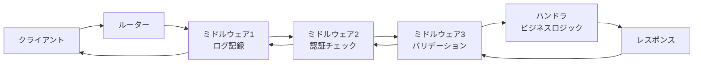
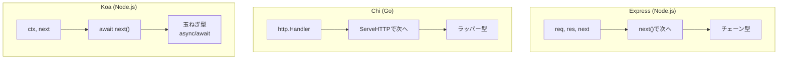

# ルーティングとミドルウェア

> **一言で言うと:** URLとHTTPメソッドの組み合わせを適切なビジネスロジックに対応付け、共通処理をミドルウェアとしてパイプライン化する仕組み。

## なぜ必要か

Webアプリケーションは多数のエンドポイントを持つ。ルーティングがなければ、1つの巨大な条件分岐（`if url == "/users" ...`）でリクエストを振り分けることになり、コードの見通しが壊滅する。

ミドルウェアがなければ、認証チェック・ログ記録・[[CORS]]処理・エラーハンドリングといった共通処理を**すべてのハンドラに手書きでコピペ**する必要がある。1箇所の修正が数十箇所に波及し、漏れがセキュリティホールになる。

## どの問題を解決するか

### ルーティングが解決する問題

| 課題 | ルーティングによる解決 |
|------|----------------------|
| URLとロジックの対応が不透明 | 宣言的なルート定義で一覧性を確保 |
| パスパラメータの抽出が煩雑 | `/users/:id` のようなパターンマッチで自動抽出 |
| HTTPメソッドの区別が手動 | メソッドベースのルート定義（`GET /users` vs `POST /users`） |
| ルートの増加でコードが崩壊 | ルートグループ・ネストで階層的に整理 |

### ミドルウェアが解決する問題

| 課題 | ミドルウェアによる解決 |
|------|----------------------|
| 共通処理の重複 | パイプラインに一度だけ差し込む（DRY原則） |
| 処理順序の管理が困難 | ミドルウェアチェーンで実行順序を明示 |
| 関心の分離ができない | 認証・ログ・バリデーション等を独立したモジュールに |
| テストが難しい | ミドルウェア単体でテスト可能 |

### リクエストのライフサイクル



ミドルウェアはリクエスト時は上から順に、レスポンス時は逆順に実行される。この「[[玉ねぎモデル]]（Onion Model）」がミドルウェアの本質的な動作モデルである。

## 他の仕組みとどう関係するか

- **下位レイヤーとの関係:**
  - [[HTTP-HTTPS]] — ルーティングはHTTPメソッドとURLパスを入力として動作する。HTTPのステートレス性を前提にしているため、状態を持たせたい場合はCookieやセッションが必要になる
  - [[TCP-IP]] — ルーターが受け取るリクエストは、TCP接続上のHTTPメッセージとして届く

- **同レイヤーとの関係:**
  - [[認証と認可]] — 認証はミドルウェアとして実装される最も典型的な例。ルートグループに認証ミドルウェアを適用することで、保護すべきエンドポイントを宣言的に管理する
  - [[API設計-REST-GraphQL]] — RESTfulなAPI設計はルーティング構造に直接反映される（`GET /users/:id` → ユーザー取得）。GraphQLの場合は単一エンドポイント（`POST /graphql`）にルーティングし、リゾルバで処理を分岐する
  - [[エラーハンドリング]] — エラーハンドリングミドルウェアはチェーンの最外層に配置し、下位で発生した例外を一括処理する
  - [[バリデーション]] — リクエストボディやクエリパラメータのバリデーションもミドルウェアとして実装できる

- **上位レイヤーとの関係:**
  - [[Layer6-セキュリティ/_index|セキュリティ]] — [[CORS]]、CSRF対策、レート制限はすべてミドルウェアとして実装される。ミドルウェアの適用漏れがセキュリティホールに直結する
  - [[Layer7-設計アーキテクチャ/_index|設計・アーキテクチャ]] — ミドルウェアパターンは関心の分離の具体的な実装。レイヤードアーキテクチャにおける「横断的関心事（Cross-cutting Concerns）」の解決策

## 誤解されやすいポイント

1. **「ミドルウェアは前処理だけ」という誤解**
   ミドルウェアはリクエストの前処理だけでなく、レスポンスの後処理も担う。レスポンスタイムの計測、レスポンスヘッダの追加、レスポンスボディの圧縮など、`next()` の後に書く処理も重要。[[玉ねぎモデル]]を理解していないと、後処理の実装で混乱する。

2. **「ルーティングの定義順序は関係ない」という誤解**
   多くのフレームワークでは、ルートは定義順に評価される。`/users/new` よりも先に `/users/:id` を定義すると、`"new"` が `:id` としてマッチしてしまう。Express等では定義順が優先度に直結するため、具体的なルートを先に書く必要がある。

3. **「ミドルウェアを全エンドポイントにグローバル適用すれば安全」という誤解**
   認証ミドルウェアをグローバルに適用すると、ヘルスチェックエンドポイント（`/health`）やログインエンドポイント自体にも認証が要求されてしまう。ミドルウェアの適用範囲はルートグループ単位で適切に制御すべき。

4. **「フレームワークのルーターはただの文字列マッチ」という誤解**
   高性能なルーターは[[Radix Treeとルーター|Radix Tree]]（基数木）やトライ構造を使って効率的にルートを検索している。ルート数が増えても線形探索にならないため、数百〜数千のルートでもパフォーマンスが劣化しにくい。

## 設計のベストプラクティス

### 推奨パターン

- **ルートグループで関心を分離する** — `/api/v1/users/*` と `/api/v1/posts/*` のようにリソース単位でグループ化し、グループごとにミドルウェアを適用する
- **ミドルウェアの順序を意識する** — ログ → 認証 → バリデーション → ビジネスロジックの順が基本。認証の前にログを置くことで、不正アクセスの試行もログに残る
- **エラーハンドリングミドルウェアを最外層に配置する** — パニックリカバリーやエラーレスポンスの統一フォーマットを保証する
- **パスパラメータのバリデーションをミドルウェアで行う** — `:id` が数値であることの確認など、ハンドラに到達する前に不正な入力を弾く

### アンチパターン

- **ハンドラ内に共通処理を直書きする** — 認証チェックを各ハンドラにコピペすると、漏れ・不整合・保守コストが増大する
- **ミドルウェアで過度にコンテキストに値を詰め込む** — ミドルウェア間の暗黙的なデータ受け渡しが多いと、依存関係が不透明になりデバッグが困難になる
- **キャッチオール（`/*`）ルートの安易な使用** — SPA のフォールバックなど正当な用途以外では、意図しないパスをすべて飲み込んでしまい404の検出が不可能になる

## AIによる実装のアンチパターン

| アンチパターン | なぜ問題か | 対策 |
|---|---|---|
| 全ルートにtry-catchを個別配置 | エラーハンドリングミドルウェアで一括処理すべき重複コード | フレームワークのエラーハンドリング機構を使う |
| 認証チェックを各ハンドラに直書き | 漏れのリスクとDRY違反。1箇所の変更が全ハンドラに波及 | 認証ミドルウェアをルートグループに適用 |
| 過剰なミドルウェアのネスト | 処理の流れが追えなくなりデバッグ困難に | ミドルウェアは5〜7層程度に抑え、責務を明確に |
| リクエストボディの複数回パース | ボディはストリームなので一度しか読めない（言語による）。エラーの原因が特定しにくい | ボディパースはミドルウェアで1回だけ行い、パース済みデータをコンテキストに格納 |

## 具体例

### Express（Node.js）— ミドルウェアチェーンの基本

```javascript
const express = require('express');
const app = express();

// グローバルミドルウェア: リクエストログ
app.use((req, res, next) => {
  console.log(`${req.method} ${req.url}`);
  const start = Date.now();
  res.on('finish', () => {
    console.log(`${res.statusCode} - ${Date.now() - start}ms`);
  });
  next();
});

// JSONパースミドルウェア
app.use(express.json());

// 認証ミドルウェア（特定ルートグループにのみ適用）
function requireAuth(req, res, next) {
  const token = req.headers.authorization?.split(' ')[1];
  if (!token) {
    return res.status(401).json({ error: 'Authentication required' });
  }
  // トークン検証ロジック（省略）
  req.userId = 'verified-user-id';
  next();
}

// 公開ルート（認証不要）
app.get('/health', (req, res) => {
  res.json({ status: 'ok' });
});

app.post('/login', (req, res) => {
  // ログイン処理
  res.json({ token: 'jwt-token-here' });
});

// 保護ルートグループ
const protectedRouter = express.Router();
protectedRouter.use(requireAuth);

protectedRouter.get('/users/:id', (req, res) => {
  res.json({ id: req.params.id, requestedBy: req.userId });
});

protectedRouter.get('/users', (req, res) => {
  res.json({ users: [], requestedBy: req.userId });
});

app.use('/api', protectedRouter);

app.listen(3000);
```

### Go（net/http + Chi）— 型安全なミドルウェア

```go
package main

import (
	"context"
	"log"
	"net/http"
	"time"

	"github.com/go-chi/chi/v5"
	"github.com/go-chi/chi/v5/middleware"
)

// カスタムミドルウェア: リクエストタイマー
func requestTimer(next http.Handler) http.Handler {
	return http.HandlerFunc(func(w http.ResponseWriter, r *http.Request) {
		start := time.Now()
		next.ServeHTTP(w, r)
		log.Printf("%s %s - %v", r.Method, r.URL.Path, time.Since(start))
	})
}

type contextKey string

// 認証ミドルウェア
func requireAuth(next http.Handler) http.Handler {
	return http.HandlerFunc(func(w http.ResponseWriter, r *http.Request) {
		token := r.Header.Get("Authorization")
		if token == "" {
			http.Error(w, "unauthorized", http.StatusUnauthorized)
			return
		}
		ctx := context.WithValue(r.Context(), contextKey("userID"), "verified-user")
		next.ServeHTTP(w, r.WithContext(ctx))
	})
}

func main() {
	r := chi.NewRouter()

	// グローバルミドルウェア
	r.Use(middleware.Logger)
	r.Use(middleware.Recoverer)
	r.Use(requestTimer)

	// 公開ルート
	r.Get("/health", func(w http.ResponseWriter, r *http.Request) {
		w.Write([]byte(`{"status":"ok"}`))
	})

	// 保護ルートグループ
	r.Route("/api", func(r chi.Router) {
		r.Use(requireAuth)

		r.Get("/users/{id}", func(w http.ResponseWriter, r *http.Request) {
			id := chi.URLParam(r, "id")
			userID := r.Context().Value(contextKey("userID")).(string)
			w.Write([]byte(`{"id":"` + id + `","by":"` + userID + `"}`))
		})
	})

	http.ListenAndServe(":3000", r)
}
```

### フレームワーク間のミドルウェアモデル比較



| フレームワーク | 言語 | ミドルウェアの形式 | ルーターの特徴 |
|---|---|---|---|
| Express | Node.js | `(req, res, next) => {}` | 定義順マッチング |
| Koa | Node.js | `async (ctx, next) => {}` | 別パッケージ（koa-router） |
| Chi | Go | `func(http.Handler) http.Handler` | [[Radix Treeとルーター|Radix Tree]] |
| Gin | Go | `func(*gin.Context)` | [[Radix Treeとルーター|Radix Tree]] |
| Fiber | Go | `func(*fiber.Ctx) error` | [[Radix Treeとルーター|Radix Tree]] |

## 参考リソース

- Express.js 公式ドキュメント — ミドルウェアガイド
- Go Chi GitHub リポジトリ — ミドルウェアパターンの実例
- 「初めてのGo言語」（O'Reilly）— Chapter 12: The Standard Library / net/http
- MDN Web Docs — HTTP リクエストメソッド

## 学習メモ

- Expressのミドルウェアは`next()`を呼び忘れるとリクエストがハングする点に注意
- GoのChiは`net/http`互換のミドルウェアシグネチャを使うため、標準ライブラリとの相互運用性が高い
- フレームワーク選定時にルーターのパフォーマンス特性（Radix Tree vs 線形探索）を確認すると良い
