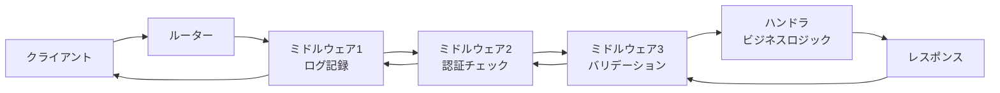

# ルーティングとミドルウェア

> **一言で言うと:** URLとHTTPメソッドの組み合わせを適切なビジネスロジックに対応付け、共通処理をミドルウェアとしてパイプライン化する仕組み。リクエストは「玉ねぎモデル」で外側のミドルウェアから内側のハンドラへ、レスポンスは逆順で外側へ抜ける。

## 3分で全体像

- **何を解決する技術か:** URL→ロジックの宣言的対応付け（ルーティング）と、認証・ログ・CORS・エラー処理など横断的関心事の共通化（ミドルウェア）。1つの巨大な if 分岐とコピペ防御コードを排除する
- **代表的な使用シーン:** Web API（REST / GraphQL）の入口、SPA配信、管理画面と公開ページの認証境界の分離、ヘルスチェック・メトリクスエンドポイントの追加
- **これだけは覚える3つ:**
    1. **玉ねぎモデル** — ミドルウェアはリクエスト時に外→内、レスポンス時に内→外を通過する。`next()` の前が「行き」、後が「帰り」の処理。これを理解せずに書くとレスポンス改変や計測が壊れる
    2. **適用範囲はルートグループ単位** — 認証ミドルウェアをグローバル適用するとログイン画面やヘルスチェックまで保護されてしまう。**保護対象のグループにだけ** 適用するのが原則
    3. **定義順がマッチング順** — Express など多くのフレームワークは定義順で評価する。`/users/:id` を先に書くと `/users/new` が `:id="new"` として吸われる。具体的なルートを先に定義する
- **AIに任せやすいか:** **任せやすい** — ルート定義・標準的なミドルウェア（CORS / ロガー / レート制限）の実装は AI が高品質に書ける。ただし「ミドルウェアの順序」「適用範囲（全体 vs ルートグループ）」「`next()` の有無」は意図がコード表面から読めず誤りやすいため、AIコードレビュー観点で必ずチェックする
- **詰まったらここを読む:** [[HTTP-HTTPS]] / [[認証と認可]] / [[エラーハンドリング]]

## なぜ必要か

Webアプリケーションは多数のエンドポイントを持つ。ルーティングがなければ、1つの巨大な条件分岐（`if url == "/users" ...`）でリクエストを振り分けることになり、コードの見通しが壊滅する。

ミドルウェアがなければ、認証チェック・ログ記録・[[CORS]]処理・エラーハンドリングといった共通処理を**すべてのハンドラに手書きでコピペ**する必要がある。1箇所の修正が数十箇所に波及し、漏れがセキュリティホールになる。

## どの問題を解決するか

### ルーティングが解決する問題

| 課題 | ルーティングによる解決 |
|------|----------------------|
| URLとロジックの対応が不透明 | 宣言的なルート定義で一覧性を確保 |
| パスパラメータの抽出が煩雑 | `/users/:id` のようなパターンマッチで自動抽出 |
| HTTPメソッドの区別が手動 | メソッドベースのルート定義（`GET /users` vs `POST /users`） |
| ルートの増加でコードが崩壊 | ルートグループ・ネストで階層的に整理 |

### ミドルウェアが解決する問題

| 課題 | ミドルウェアによる解決 |
|------|----------------------|
| 共通処理の重複 | パイプラインに一度だけ差し込む（DRY原則） |
| 処理順序の管理が困難 | ミドルウェアチェーンで実行順序を明示 |
| 関心の分離ができない | 認証・ログ・バリデーション等を独立したモジュールに |
| テストが難しい | ミドルウェア単体でテスト可能 |

### リクエストのライフサイクル


```mermaid
flowchart LR
    A[クライアント] --> B[ルーター]
    B --> C[ミドルウェア1<br/>ログ記録]
    C --> D[ミドルウェア2<br/>認証チェック]
    D --> E[ミドルウェア3<br/>バリデーション]
    E --> F[ハンドラ<br/>ビジネスロジック]
    F --> G[レスポンス]
    G --> E --> D --> C --> A
```

ミドルウェアはリクエスト時は上から順に、レスポンス時は逆順に実行される。この「[[玉ねぎモデル]]（Onion Model）」がミドルウェアの本質的な動作モデルである。

## 他の仕組みとどう関係するか

- **下位レイヤーとの関係:**
  - [[HTTP-HTTPS]] — ルーティングはHTTPメソッドとURLパスを入力として動作する。HTTPのステートレス性を前提にしているため、状態を持たせたい場合はCookieやセッションが必要になる
  - [[TCP-IP]] — ルーターが受け取るリクエストは、TCP接続上のHTTPメッセージとして届く

- **同レイヤーとの関係:**
  - [[認証と認可]] — 認証はミドルウェアとして実装される最も典型的な例。ルートグループに認証ミドルウェアを適用することで、保護すべきエンドポイントを宣言的に管理する
  - [[API設計-REST-GraphQL]] — RESTfulなAPI設計はルーティング構造に直接反映される（`GET /users/:id` → ユーザー取得）。GraphQLの場合は単一エンドポイント（`POST /graphql`）にルーティングし、リゾルバで処理を分岐する
  - [[エラーハンドリング]] — エラーハンドリングミドルウェアはチェーンの最外層に配置し、下位で発生した例外を一括処理する
  - [[バリデーション]] — リクエストボディやクエリパラメータのバリデーションもミドルウェアとして実装できる

- **上位レイヤーとの関係:**
  - [[Layer6-セキュリティ/_index|セキュリティ]] — [[CORS]]、[[CSRF]]対策、[[レート制限]]はすべてミドルウェアとして実装される。ミドルウェアの適用漏れがセキュリティホールに直結する
  - [[Layer7-設計アーキテクチャ/_index|設計・アーキテクチャ]] — ミドルウェアパターンは関心の分離の具体的な実装。レイヤードアーキテクチャにおける「横断的関心事（Cross-cutting Concerns）」の解決策

## 誤解されやすいポイント

1. **「ミドルウェアは前処理だけ」という誤解**
   ミドルウェアはリクエストの前処理だけでなく、レスポンスの後処理も担う。レスポンスタイムの計測、レスポンスヘッダの追加、レスポンスボディの圧縮など、`next()` の後に書く処理も重要。[[玉ねぎモデル]]を理解していないと、後処理の実装で混乱する。

2. **「ルーティングの定義順序は関係ない」という誤解**
   多くのフレームワークでは、ルートは定義順に評価される。`/users/new` よりも先に `/users/:id` を定義すると、`"new"` が `:id` としてマッチしてしまう。Express等では定義順が優先度に直結するため、具体的なルートを先に書く必要がある。

3. **「ミドルウェアを全エンドポイントにグローバル適用すれば安全」という誤解**
   認証ミドルウェアをグローバルに適用すると、ヘルスチェックエンドポイント（`/health`）やログインエンドポイント自体にも認証が要求されてしまう。ミドルウェアの適用範囲はルートグループ単位で適切に制御すべき。

4. **「フレームワークのルーターはただの文字列マッチ」という誤解**
   高性能なルーターは[[Radix Treeとルーター|Radix Tree]]（基数木）やトライ構造を使って効率的にルートを検索している。ルート数が増えても線形探索にならないため、数百〜数千のルートでもパフォーマンスが劣化しにくい。

## 設計のベストプラクティス

### 推奨パターン

- **ルートグループで関心を分離する** — `/api/v1/users/*` と `/api/v1/posts/*` のようにリソース単位でグループ化し、グループごとにミドルウェアを適用する
- **ミドルウェアの順序を意識する** — ログ → 認証 → バリデーション → ビジネスロジックの順が基本。認証の前にログを置くことで、不正アクセスの試行もログに残る
- **エラーハンドリングミドルウェアを最外層に配置する** — パニックリカバリーやエラーレスポンスの統一フォーマットを保証する
- **パスパラメータのバリデーションをミドルウェアで行う** — `:id` が数値であることの確認など、ハンドラに到達する前に不正な入力を弾く

### アンチパターン

- **ハンドラ内に共通処理を直書きする** — 認証チェックを各ハンドラにコピペすると、漏れ・不整合・保守コストが増大する
- **ミドルウェアで過度にコンテキストに値を詰め込む** — ミドルウェア間の暗黙的なデータ受け渡しが多いと、依存関係が不透明になりデバッグが困難になる
- **キャッチオール（`/*`）ルートの安易な使用** — SPA のフォールバックなど正当な用途以外では、意図しないパスをすべて飲み込んでしまい404の検出が不可能になる

## AIエージェントとの協働

> このトピックでAIコーディングエージェント（Claude Code, Copilot, Cursor 等）と協働するための観点。
> ルート定義と標準ミドルウェアは AI に任せやすい一方、**「適用範囲（全体 / グループ）」「順序」「玉ねぎモデルの帰り道処理」「`next()` の呼び忘れ」** はコード表面から意図が読めず誤りやすい。レビューもAIコードレビュー観点で横断アンチパターン照合に任せられる。

### AIに任せられる部分 / 人間が判断すべき部分

| タスク種類 | 任せ方（実装/レビュー） | 人間の関与 |
|---|---|---|
| 標準ミドルウェアの選定・組み込み（CORS / Helmet / Compression / Logger） | AI 実装、AIコードレビュー観点でレビュー | プロジェクトの[[CORS]]ポリシー、許可オリジン、Cookie 属性は要件で判断 |
| RESTfulなルート定義の素案 | AI に任せる | リソースの粒度、ネストの深さ、URLバージョニング戦略は人間が決める |
| 認証ミドルウェアの実装 | AI 実装、レビュー | **どのルートグループに適用するか** は人間判断（ログイン画面・ヘルスチェック除外） |
| カスタムミドルウェアの実装 | AI に任せる | ミドルウェアの順序（ログ→リクエストID→認証→検証）は意図的に決める |
| ルートのリファクタリング | AI に分割案を出させる | 公開・保護・管理者の境界はビジネス要件で決める |
| エラーハンドリングミドルウェア | AI 実装、レビュー | エラー型の階層と HTTP ステータスのマッピングは設計判断（[[エラーハンドリング]]参照） |

### AI生成コードのレビュー観点（このトピック固有）

AI生成のルーター・ミドルウェアコードを受け取ったとき、最低限ここを見る。

1. **ミドルウェアの適用範囲が正しいか** — 認証ミドルウェアが `app.use(authMiddleware)` でグローバル適用されていないか。ヘルスチェック・ログイン・公開コンテンツが認証必須になると本番障害の原因。**ルートグループ単位** での適用になっているかを必ず確認する
2. **ルート定義の順序にバグがないか** — 動的セグメント（`/users/:id`）が固定セグメント（`/users/new`）より**先**に定義されていないか。多くのフレームワークは定義順マッチングなので、固定→動的の順で書く必要がある
3. **`next()` の呼び忘れと多重呼び出し** — Express系では `next()` を呼ばないとリクエストがハングし、エラー時に `next(err)` を呼ばないとエラーハンドラに到達しない。逆に `res.send()` 後に `next()` を呼ぶとレスポンスヘッダの二重送信エラーになる。条件分岐の各枝で `return next()` / `return res.send()` を明確にしているか確認

### 効くプロンプトの型

このトピックに関する実装をAIに依頼するとき、コンテキストとして渡すべき情報・制約・成功基準のテンプレ。

```
# 前提（プロジェクトの状況・既存のコード規約）
- フレームワーク: Express 4 / Chi v5 / Laravel 11 / Rails 7.1 など明示
- 既存のミドルウェアスタック: [requestId, logger, cors, bodyParser, ...]
- 認証方式: JWT / セッション / OAuth など
- 保護したいルートグループ: /api/v1/*（公開: /health, /login, /signup）

# やってほしいこと
- 「{要件}」を実現するルート定義およびミドルウェアの実装
- ルートグループ・適用範囲・順序を含めて提示

# 守ってほしい制約（このトピック固有のもの）
- 認証ミドルウェアはルートグループにのみ適用、グローバル適用はしない
- 動的セグメント (/users/:id) より固定セグメント (/users/new) を先に定義
- ミドルウェアの順序: requestId → logger → cors → bodyParser → 認証 → 検証 → ハンドラ → エラーハンドラ
- `next()` の呼び忘れ・多重呼び出しがないこと
- ボディパースはミドルウェアで1回だけ
- レスポンス送信後に処理を続けない（条件分岐の各枝で return）

# 完了の判断基準
- 公開ルートに認証が要求されていない
- 保護ルートに認証が必ず適用されている
- リクエストハングと「Cannot set headers after they are sent」が起きない
- エラーが集約ハンドラに到達する
```

### AI実装のアンチパターン

LLM生成コードで頻出する過剰設計・誤用パターン。レビュー時の照合表として使う。

| アンチパターン | なぜ問題か | レビュー観点 / 対策 |
|---|---|---|
| 認証ミドルウェアをグローバル適用 | ヘルスチェック・ログイン・公開ページまで保護されてしまう | `app.use(authMiddleware)` でなくルートグループ (`router.use` / `Route::middleware()->group`) に適用 |
| 動的セグメントを固定セグメントより先に定義 | `/users/:id` で `"new"` が `:id` に吸われる | 固定 → 動的の順、または静的優先のルーター（Chi の Radix Tree など）を使う |
| 全ハンドラに try-catch を直書き | エラーハンドリングミドルウェアで集約すべき重複コード。フォーマットも揃わない | フレームワークのエラーハンドリング機構（Express の 4 引数ミドルウェア・Laravel の `withExceptions`・Rails の `rescue_from`）に集約 |
| 認証チェックを各ハンドラに直書き | 漏れのリスクとDRY違反。1箇所の変更が全ハンドラに波及 | 認証ミドルウェアをルートグループに適用 |
| 過剰なミドルウェアのネスト（10層以上） | 処理の流れが追えなくなりデバッグ困難に。`next()` の呼び忘れも検出しづらい | ミドルウェアは5〜7層程度に抑え、責務を明確に |
| リクエストボディの複数回パース | ボディはストリームで一度しか読めない（Node.js等）。`req.on('data')` と `express.json()` を併用すると後者がハング | ボディパースはミドルウェアで1回だけ行い、パース済みデータを `req.body` に置く |
| `res.send()` 後に `next()` を呼ぶ | レスポンスヘッダの二重送信で「Cannot set headers after they are sent」 | 条件分岐の各枝で `return res.send()` または `return next()` で明示的に終端 |
| キャッチオール（`/*`）の安易な使用 | 意図しないパスをすべて飲み込み、404 検出が不可能に | SPA フォールバック等、明確な意図がある場合のみ最後に1つだけ定義 |
| ミドルウェア内で req オブジェクトに大量プロパティを追加 | 暗黙のデータ受け渡しで依存関係が不透明に | 必要最小限（認証済みユーザID、リクエストID）に留め、それ以上はサービスレイヤーで取得 |

→ レイヤー横断のアンチパターン索引: [[_anti-patterns/_index|AIアンチパターン索引]] / [[_anti-patterns/レイヤー別/Layer4-Backend|Layer 4 Backend アンチパターン集]]

## 具体例

### Express（Node.js）— ミドルウェアチェーンの基本

> **Express バージョン:** Express **5.0 が 2024-10 GA**。本コードは Express 4 / 5 共通動作だが、Express 5 ではワイルドカード構文の変更（`/foo*` → `/foo(.*)`）、`req.query` の getter 化、`async function` 内の throw が自動的にエラーミドルウェアに到達するなどの破壊的変更がある。新規プロジェクトでは v5 を選ぶ。

```javascript
const express = require('express');
const app = express();

// グローバルミドルウェア: リクエストログ
app.use((req, res, next) => {
  console.log(`${req.method} ${req.url}`);
  const start = Date.now();
  res.on('finish', () => {
    console.log(`${res.statusCode} - ${Date.now() - start}ms`);
  });
  next();
});

// JSONパースミドルウェア
app.use(express.json());

// 認証ミドルウェア（特定ルートグループにのみ適用）
function requireAuth(req, res, next) {
  const token = req.headers.authorization?.split(' ')[1];
  if (!token) {
    return res.status(401).json({ error: 'Authentication required' });
  }
  // トークン検証ロジック（省略）
  req.userId = 'verified-user-id';
  next();
}

// 公開ルート（認証不要）
app.get('/health', (req, res) => {
  res.json({ status: 'ok' });
});

app.post('/login', (req, res) => {
  // ログイン処理
  res.json({ token: 'jwt-token-here' });
});

// 保護ルートグループ
const protectedRouter = express.Router();
protectedRouter.use(requireAuth);

protectedRouter.get('/users/:id', (req, res) => {
  res.json({ id: req.params.id, requestedBy: req.userId });
});

protectedRouter.get('/users', (req, res) => {
  res.json({ users: [], requestedBy: req.userId });
});

app.use('/api', protectedRouter);

app.listen(3000);
```

### Go（net/http + Chi）— 型安全なミドルウェア

```go
package main

import (
	"context"
	"log"
	"net/http"
	"time"

	"github.com/go-chi/chi/v5"
	"github.com/go-chi/chi/v5/middleware"
)

// カスタムミドルウェア: リクエストタイマー
func requestTimer(next http.Handler) http.Handler {
	return http.HandlerFunc(func(w http.ResponseWriter, r *http.Request) {
		start := time.Now()
		next.ServeHTTP(w, r)
		log.Printf("%s %s - %v", r.Method, r.URL.Path, time.Since(start))
	})
}

type contextKey string

// 認証ミドルウェア
func requireAuth(next http.Handler) http.Handler {
	return http.HandlerFunc(func(w http.ResponseWriter, r *http.Request) {
		token := r.Header.Get("Authorization")
		if token == "" {
			http.Error(w, "unauthorized", http.StatusUnauthorized)
			return
		}
		ctx := context.WithValue(r.Context(), contextKey("userID"), "verified-user")
		next.ServeHTTP(w, r.WithContext(ctx))
	})
}

func main() {
	r := chi.NewRouter()

	// グローバルミドルウェア
	r.Use(middleware.Logger)
	r.Use(middleware.Recoverer)
	r.Use(requestTimer)

	// 公開ルート
	r.Get("/health", func(w http.ResponseWriter, r *http.Request) {
		w.Write([]byte(`{"status":"ok"}`))
	})

	// 保護ルートグループ
	r.Route("/api", func(r chi.Router) {
		r.Use(requireAuth)

		r.Get("/users/{id}", func(w http.ResponseWriter, r *http.Request) {
			id := chi.URLParam(r, "id")
			userID := r.Context().Value(contextKey("userID")).(string)
			w.Write([]byte(`{"id":"` + id + `","by":"` + userID + `"}`))
		})
	})

	http.ListenAndServe(":3000", r)
}
```

### Laravel（PHP）— ルートグループとミドルウェア

```php
<?php
// routes/web.php / routes/api.php — ルート定義

use App\Http\Controllers\UserController;
use App\Http\Controllers\AuthController;
use Illuminate\Support\Facades\Route;

// 公開ルート（認証不要）
Route::get('/health', function () {
    return response()->json(['status' => 'ok']);
});

Route::post('/login', [AuthController::class, 'login']);

// 保護ルートグループ — ミドルウェアとプレフィックスを組み合わせる
Route::middleware(['auth:sanctum'])->prefix('api')->group(function () {
    Route::get('/users', [UserController::class, 'index']);
    Route::get('/users/{id}', [UserController::class, 'show']);
    Route::post('/users', [UserController::class, 'store']);
});

// ネストしたグループで管理者ルートを分離
Route::middleware(['auth:sanctum', 'admin'])->prefix('api/admin')->group(function () {
    Route::delete('/users/{id}', [UserController::class, 'destroy']);
});
```

```php
<?php
// app/Http/Middleware/EnsureTokenIsValid.php — カスタムミドルウェア

namespace App\Http\Middleware;

use Closure;
use Illuminate\Http\Request;
use Symfony\Component\HttpFoundation\Response;

class EnsureTokenIsValid
{
    /**
     * handle メソッドがミドルウェアの本体。
     * $next クロージャを呼ぶことで次のミドルウェア/ハンドラに処理を渡す。
     */
    public function handle(Request $request, Closure $next): Response
    {
        // --- リクエスト前処理 ---
        $token = $request->bearerToken();
        if (!$token || !$this->isValid($token)) {
            return response()->json(['error' => 'Unauthorized'], 401);
        }

        // 次のミドルウェアへ（玉ねぎモデルの内側へ進む）
        $response = $next($request);

        // --- レスポンス後処理 ---
        $response->headers->set('X-Request-Id', uniqid());

        return $response;
    }

    private function isValid(string $token): bool
    {
        // トークン検証ロジック（省略）
        return true;
    }
}
```

Laravelではミドルウェアを `bootstrap/app.php`（Laravel 11+）または `app/Http/Kernel.php`（Laravel 10以前）で登録する。`$next` クロージャの呼び出し前後でリクエスト／レスポンスの両方を操作できる点が[[玉ねぎモデル]]の実装そのものである。

### Ruby on Rails — ルーティングとbefore_action

```ruby
# config/routes.rb — リソースベースのルーティング

Rails.application.routes.draw do
  # ヘルスチェック（認証不要）
  get '/health', to: proc { [200, {}, ['{"status":"ok"}']] }

  # ログイン
  post '/login', to: 'auth#login'

  # リソースルーティング — RESTful な7アクションを一括定義
  # GET /users, GET /users/:id, POST /users, PATCH /users/:id, DELETE /users/:id ...
  namespace :api do
    resources :users, only: [:index, :show, :create, :update] do
      # ネストしたリソース: GET /api/users/:user_id/posts
      resources :posts, only: [:index, :show]
    end
  end

  # 管理者用スコープ
  namespace :admin do
    resources :users, only: [:index, :destroy]
  end
end
```

```ruby
# app/controllers/application_controller.rb — before_action によるミドルウェア的処理

class ApplicationController < ActionController::API
  # before_action はコントローラレベルのフィルタで、
  # ミドルウェアと同様にリクエスト前処理を担う
  before_action :authenticate_user!, except: [:health]
  around_action :measure_request_time

  private

  def authenticate_user!
    token = request.headers['Authorization']&.split(' ')&.last
    unless token && valid_token?(token)
      render json: { error: 'Unauthorized' }, status: :unauthorized
    end
  end

  # around_action は玉ねぎモデルに相当（前処理 → yield → 後処理）
  def measure_request_time
    start = Time.current
    yield
    duration = Time.current - start
    Rails.logger.info "#{request.method} #{request.path} - #{duration.round(3)}s"
  end

  def valid_token?(token)
    # トークン検証ロジック（省略）
    true
  end
end
```

```ruby
# config/application.rb — Rack ミドルウェアの追加

# Rails は Rack の上に構築されているため、Rack ミドルウェアも利用可能
module MyApp
  class Application < Rails::Application
    # Rack ミドルウェアをスタックに追加
    config.middleware.use RequestIdMiddleware
  end
end

# lib/middleware/request_id_middleware.rb — Rack ミドルウェアの例
class RequestIdMiddleware
  def initialize(app)
    @app = app
  end

  # Rack の規約: call メソッドに env を受け取り [status, headers, body] を返す
  def call(env)
    env['HTTP_X_REQUEST_ID'] = SecureRandom.uuid

    status, headers, body = @app.call(env)

    headers['X-Request-Id'] = env['HTTP_X_REQUEST_ID']
    [status, headers, body]
  end
end
```

Railsでは `before_action` / `after_action` / `around_action` がコントローラレベルのフィルタとして機能し、Rack ミドルウェアがアプリケーション全体のリクエスト/レスポンスパイプラインを担う。`resources` によるリソースルーティングは[[API設計-REST-GraphQL|RESTful API設計]]と自然に対応する。

### フレームワーク間のミドルウェアモデル比較


```mermaid
flowchart TB
    subgraph Express["Express (Node.js)"]
        direction LR
        E1[req, res, next] --> E2["next()で次へ"]
        E2 --> E3["チェーン型"]
    end
    subgraph Chi["Chi (Go)"]
        direction LR
        C1["http.Handler"] --> C2["ServeHTTPで次へ"]
        C2 --> C3["ラッパー型"]
    end
    subgraph Koa["Koa (Node.js)"]
        direction LR
        K1["ctx, next"] --> K2["await next()"]
        K2 --> K3["玉ねぎ型<br/>async/await"]
    end
    subgraph Laravel["Laravel (PHP)"]
        direction LR
        L1["$request, $next"] --> L2["$next($request)"]
        L2 --> L3["クロージャ型<br/>パイプライン"]
    end
    subgraph Rails["Rails (Ruby)"]
        direction LR
        R1["before_action<br/>around_action"] --> R2["yield / Rack call"]
        R2 --> R3["フィルタ型<br/>+ Rack"]
    end
```

| フレームワーク | 言語 | ミドルウェアの形式 | ルーターの特徴 |
|---|---|---|---|
| Express | Node.js | `(req, res, next) => {}` | 定義順マッチング |
| Koa | Node.js | `async (ctx, next) => {}` | 別パッケージ（koa-router） |
| Chi | Go | `func(http.Handler) http.Handler` | [[Radix Treeとルーター|Radix Tree]] |
| Gin | Go | `func(*gin.Context)` | [[Radix Treeとルーター|Radix Tree]] |
| Fiber | Go | `func(*fiber.Ctx) error` | [[Radix Treeとルーター|Radix Tree]] |
| Laravel | PHP | `handle($request, Closure $next)` | コンパイル済み正規表現 |
| Rails | Ruby | `before_action` / Rack middleware | リソースベース |

## 参考リソース

- Express.js 公式ドキュメント — ミドルウェアガイド
- Go Chi GitHub リポジトリ — ミドルウェアパターンの実例
- 「初めてのGo言語」（O'Reilly）— Chapter 12: The Standard Library / net/http
- MDN Web Docs — HTTP リクエストメソッド

## 理解度セルフチェック

> 答えられなければ本文に戻る。答えはこのファイル内に必ずある。

1. **「玉ねぎモデル」とは何か、30秒で説明せよ。** リクエスト時とレスポンス時でミドルウェアの実行順序がどう変わるか、具体的に説明すること。
2. **認証ミドルウェアを `app.use(authMiddleware)` で全体に適用するのは、なぜアンチパターンか?** 適用方法を変えるべき理由を述べよ。
3. **AI生成コードレビュー設問:** AI が以下の Express ルーティングを生成した。本文の観点で **問題点を最低3つ** 指摘せよ。

```javascript
const express = require('express');
const app = express();

// 認証ミドルウェア
function authMiddleware(req, res, next) {
  const token = req.headers.authorization;
  if (!token) {
    res.status(401).json({ error: 'Unauthorized' });
  }
  // トークン検証(省略)
  req.userId = 'verified-user';
  next();
}

app.use(authMiddleware);
app.use(express.json());

// ルート定義
app.get('/users/:id', (req, res) => {
  res.json({ id: req.params.id });
});
app.get('/users/new', (req, res) => {
  res.render('users/new');
});

app.get('/health', (req, res) => {
  res.json({ status: 'ok' });
});

// グローバルエラーハンドラ
app.use((err, req, res, next) => {
  res.status(500).json({ error: err.message, stack: err.stack });
});

app.listen(3000);
```

> [!note]- 解答の指針
>
> > [!info] 用語ミニ辞典
> > - **玉ねぎモデル (Onion Model):** ミドルウェアチェーンを玉ねぎの皮になぞらえたモデル。リクエストは外側の皮（最初に登録したミドルウェア）から内側のハンドラへ向かい、レスポンスは内側から外側へ抜ける。`next()` の前が「行き」、後が「帰り」の処理に相当する
> > - **ルートグループ:** 共通のプレフィックスやミドルウェアを持つルートの集合。`router.use(authMiddleware)` や `Route::middleware()->group()` で表現する。グローバル適用と異なり、認証境界を宣言的に管理できる
> > - **定義順マッチング:** ルーターが先に登録されたルートから順にパターンマッチを試す方式。Express の標準ルーターはこの方式で、固定セグメント (`/users/new`) より動的セグメント (`/users/:id`) を先に書くと固定が無効化される
> > - **Radix Tree (基数木):** 共通プレフィックスを共有するトライ木の一種。Chi / Gin / Fiber が採用しているルーターのデータ構造で、ルート数 N が増えても探索量が `O(キー長)` に抑えられる。定義順に依存せず、より具体的なルートが優先される
> > - **`next()` 関数:** Express系ミドルウェアシグネチャ `(req, res, next) => {}` の第3引数。次のミドルウェアへ処理を渡す。呼び忘れるとリクエストがハングし、`res.send()` 後に呼ぶと「Cannot set headers after they are sent」になる
> > - **エラーハンドリングミドルウェア:** Express では引数が4つ `(err, req, res, next)` のミドルウェア。下位で `throw` または `next(err)` されたエラーを受け取り、レスポンス変換とログ記録を集約する。チェーンの**最外層（最後）** に配置する
> > - **`req` オブジェクトへのプロパティ追加:** ミドルウェアが認証済みユーザIDなどを `req.userId` に置いて後続のハンドラに渡す手法。便利な反面、暗黙の依存が増えるためミニマルに保つべき
> > - **グローバル適用 (Global Middleware):** `app.use(middleware)` のように全ルートに対して一括でミドルウェアを適用すること。便利だが、認証ミドルウェアをグローバル適用するとログイン画面・ヘルスチェック・公開コンテンツまで保護されてしまう
> > - **ヘルスチェック (Health Check):** ロードバランサーやオーケストレータ（Kubernetes 等）がサーバの生存確認に使う `/health` エンドポイント。認証なしで応答できる必要があり、認証ミドルウェアのグローバル適用で 401 を返すとロードバランサーから該当ノードが切り離される事故になる
> > - **ロードバランサー (Load Balancer):** 複数のサーバインスタンスにリクエストを振り分けるネットワーク機器/ソフトウェア（AWS ALB、Nginx、HAProxy 等）。定期的にヘルスチェックを叩き、応答が無いノードをサービスから除外する
>
> 1. 玉ねぎモデルとは、ミドルウェアチェーンを玉ねぎの皮になぞらえ、**リクエストは外側から内側へ、レスポンスは内側から外側へ**抜けるモデルのこと。`next()` の呼び出しが「次の皮への移動」に相当し、`next()` の**前**に書いた処理は行きで、**後**に書いた処理は帰りで実行される。レスポンスタイム計測（行きで開始時刻記録、帰りで差分を出力）やレスポンスヘッダ追加（帰りで設定）はこの構造を理解していないと書けない。「ミドルウェア＝前処理だけ」という誤解で `next()` の後に何も書かないと、観測・後処理が抜け落ちる
> 2. グローバル適用すると **ヘルスチェック (`/health`)・ログインエンドポイント・サインアップ・公開コンテンツ（利用規約等）にも認証が要求されてしまう**。ヘルスチェックがロードバランサーから401を受けて全ノードが落とされる、ログイン画面に行く前に認証エラーで詰む、といった本番障害の典型パターン。正しくは **ルートグループ単位** で適用する。Express なら `protectedRouter.use(authMiddleware); app.use('/api', protectedRouter)`、Laravel なら `Route::middleware('auth:sanctum')->group(...)`、Rails なら `before_action :authenticate_user!, except: [:health, :login]` のように、保護対象を明示的に切り出すのが正しい設計。「念のため全部に付けておけば安全」は誤り
> 3. AI生成コードの問題点（最低限以下を指摘できれば本文を理解している）:
>     - **認証ミドルウェアがグローバル適用されている (`app.use(authMiddleware)`)** — `/health` まで認証必須になり、ロードバランサーのヘルスチェックが 401 で落ちる。本文「アンチパターン」: ルートグループに適用すべき
>     - **`/users/:id` が `/users/new` より先に定義されている** — 定義順マッチングで `/users/new` が `:id="new"` として吸われ、`new` ハンドラに到達しない。固定セグメントを先に書く
>     - **認証ミドルウェアで `next()` の早期 return がない** — `res.status(401)` を送った後に `next()` も呼ばれて、後続のハンドラが「ヘッダ送信済みなのに `res.json()` を呼ぶ」エラーになる。`return res.status(401)...` のように early return すべき
>     - **ボディパース (`express.json()`) が認証の後に登録されている** — POST/PUT で送られた JSON が認証ミドルウェア時点ではパースされていないため、認証ミドルウェアで `req.body` を参照できない。順序は `express.json()` → 認証 が正しい
>     - **エラーレスポンスにスタックトレースを含めている (`stack: err.stack`)** — 内部実装・依存ライブラリの構造が漏洩する典型的なセキュリティ問題（[[エラーハンドリング]]参照）。本番では汎用メッセージ + リクエストIDで返し、ログにのみ stack を残す
>     - **リクエストID（Correlation ID）の付与がない** — エラー追跡の起点が失われる。`crypto.randomUUID()` で生成し、`X-Request-ID` ヘッダとログ両方に含めるべき
>     - **CORS / セキュリティヘッダのミドルウェアがない** — 公開 API なのに `cors` / `helmet` 相当の設定がない。Layer 6 セキュリティ観点で本番投入できない

## 学習メモ

- Expressのミドルウェアは`next()`を呼び忘れるとリクエストがハングする点に注意
- GoのChiは`net/http`互換のミドルウェアシグネチャを使うため、標準ライブラリとの相互運用性が高い
- フレームワーク選定時にルーターのパフォーマンス特性（Radix Tree vs 線形探索）を確認すると良い
