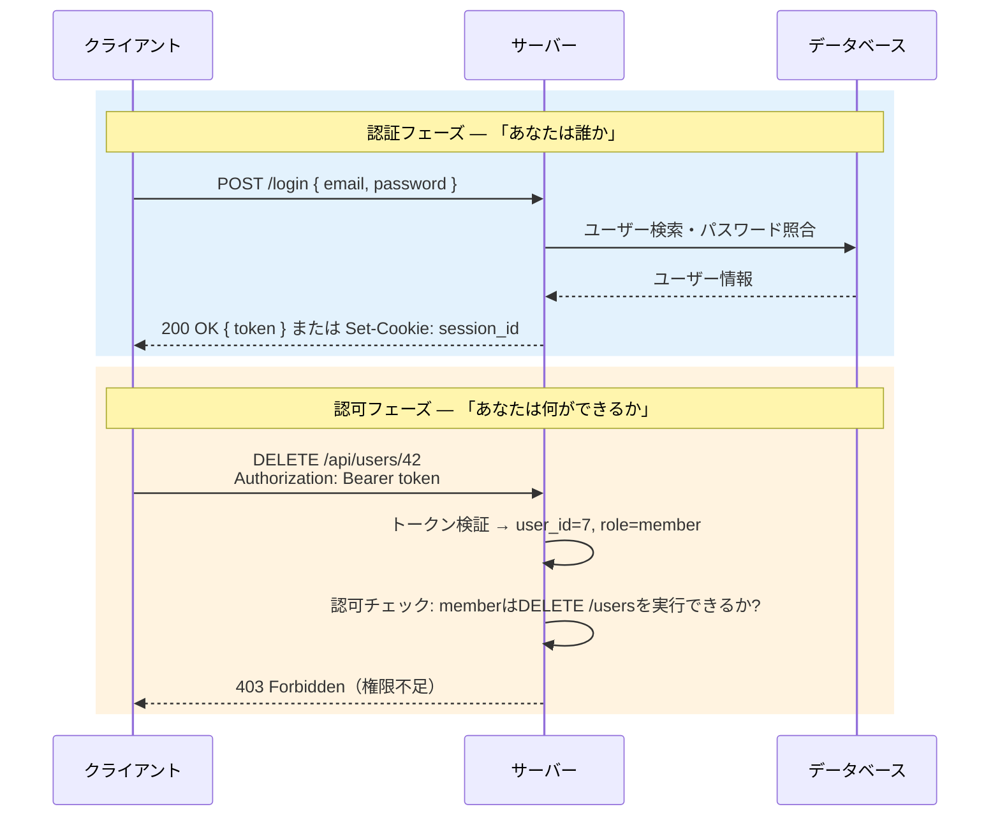
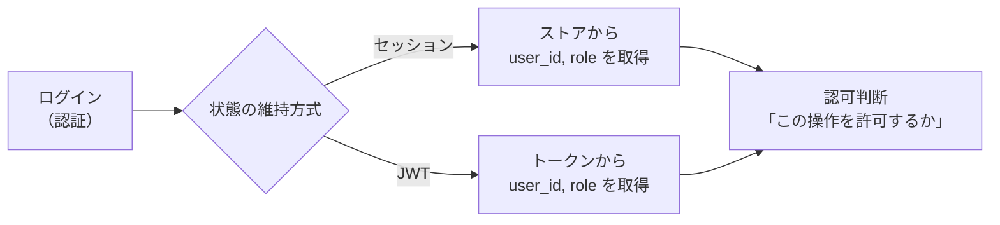
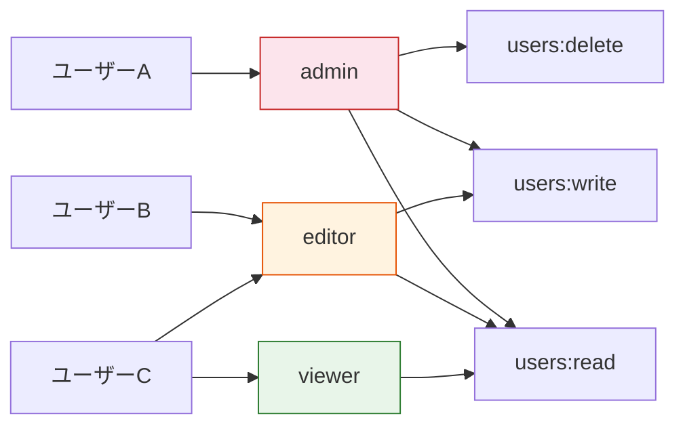

# 認証と認可

> **一言で言うと:** 認証（Authentication）は「あなたは誰か」を確認する仕組み、認可（Authorization）は「あなたは何ができるか」を制御する仕組み。この2つは**別の概念**であり、混同するとセキュリティホールになる。

## なぜ必要か

Webアプリケーションは不特定多数のクライアントからリクエストを受ける。認証がなければ誰がリクエストしているのか判別できず、認可がなければ全ユーザーに全操作を許すことになる。

具体的に何が困るか:

- **認証がない場合** — 他人のアカウントで注文・投稿・送金ができる。ログイン画面があっても、APIレベルで認証を検証していなければ `curl` で直接叩けてしまう
- **認可がない場合** — 一般ユーザーが管理者用のエンドポイント（ユーザー削除、設定変更）にアクセスできる。認証だけでは「ログインしている」ことしか保証されない

## どの問題を解決するか

### 認証が解決する問題

| 課題 | 認証による解決 |
|------|--------------|
| リクエスト元の身元が不明 | クレデンシャル（パスワード、トークン等）で身元を確認 |
| HTTPがステートレスで「ログイン状態」を維持できない | [[セッションとJWT]]で状態を補完 |
| パスワードの漏洩リスク | ハッシュ化による安全な保存、トークンによる毎回のパスワード送信回避 |

### 認可が解決する問題

| 課題 | 認可による解決 |
|------|--------------|
| 全ユーザーが全リソースにアクセスできてしまう | ロール・パーミッションに基づくアクセス制御 |
| 他人のリソースを操作できてしまう | リソース所有者チェック（`user_id` の照合） |
| 権限の管理が分散してコード中に散在 | ポリシーの一元管理（ミドルウェア、ポリシーオブジェクト等） |

### 認証→認可の流れ

認証と認可は別概念だが、**認証の結果が認可の入力になる**という依存関係がある。



## 認証状態の維持 — セッションとJWT

認証の最初の課題は「ログイン結果をどう維持するか」にある。[[HTTP-HTTPS]]はステートレスなプロトコルであり、認証に成功しても次のリクエストでサーバーはその事実を覚えていない。毎回パスワードを送るのは非現実的かつ危険なので、「一度認証したら、その証明を持ち続ける」仕組みが必要になる。

この問題に対して、主に2つの方式がある（詳細は [[セッションとJWT]] を参照）:

| 方式 | 一言で言うと | 認可情報の取得 |
|------|------------|--------------|
| **セッション** — ステートフル | サーバー側のストアにユーザー情報を保持し、Cookieで渡したIDで参照する | ストアから `role` 等を毎回取得。変更が即座に反映される |
| **JWT** — ステートレス | クライアントが署名付きトークンを持ち歩き、サーバーは署名を検証するだけ | トークン内の `role` クレームを参照。有効期限まで変更が反映されない |

どちらの方式でも、認証の結果（「誰か」の情報）が後続の認可判断に渡される。この流れが認証と認可の接続点:



セッション/JWTの選択は認証の**実装手段の選択**であり、認可のロジック（ロール判定、リソース所有者チェック等）にはどちらの方式でも同じモデルが適用できる。

## 認可モデル

### RBAC（Role-Based Access Control）

ユーザーにロール（役割）を割り当て、ロールに紐づく権限で操作を制御する。最もシンプルで広く使われるモデル。



### ABAC（Attribute-Based Access Control）

ユーザー属性・リソース属性・環境条件の組み合わせで制御する。RBACより柔軟だが複雑。

```
# ABACポリシーの例
許可条件:
  - ユーザーの部署 == リソースの所属部署
  - ユーザーのランク >= "manager"
  - 現在時刻が 9:00〜18:00（営業時間内）
```

### リソースベース認可（オーナーシップチェック）

RBACやABACと組み合わせて使う。「このリソースの所有者か」を確認する。

```
GET /api/posts/42 → 誰でも閲覧可能
PUT /api/posts/42 → post.author_id === 認証ユーザーのID であること
DELETE /api/posts/42 → admin ロール、または post.author_id === 認証ユーザーのID
```

## 他の仕組みとどう関係するか

- **下位レイヤーとの関係:**
  - [[HTTP-HTTPS]] — CookieやAuthorizationヘッダはHTTPの仕組み。HTTPSでなければCookieやトークンが平文で流れ、盗聴されるリスクがある
  - [[TCP-IP]] — TLS（HTTPS）による通信暗号化が認証情報の安全な伝送の前提

- **同レイヤーとの関係:**
  - [[ルーティングとミドルウェア]] — 認証はミドルウェアとして実装する典型例。ルートグループごとに認証ミドルウェアを適用して、保護エンドポイントと公開エンドポイントを宣言的に分ける
  - [[API設計-REST-GraphQL]] — APIの認証スキーム（Bearer Token、API Key等）はAPI設計の一部。GraphQLでは単一エンドポイントのため、リゾルバレベルでの認可が重要
  - [[エラーハンドリング]] — 認証失敗は `401 Unauthorized`、認可失敗は `403 Forbidden` を返す。この使い分けが重要
  - [[バリデーション]] — 入力バリデーションは認証・認可とは独立した関心事。認証を通過しても不正な入力は弾く必要がある

- **上位レイヤーとの関係:**
  - [[Layer6-セキュリティ/_index|セキュリティ]] — XSS対策（トークン保存場所）、[[CSRF]]対策（SameSite Cookie）、[[CORS]]設定はすべて認証の安全性に直結する
  - [[Layer7-設計アーキテクチャ/_index|設計・アーキテクチャ]] — マイクロサービス間の認証（サービス間トークン）、[[OAuth2とOpenID-Connect|OAuth2/OIDC]]による外部サービス連携は設計判断

- **下位レイヤーとの関係（データ）:**
  - [[Layer3-データ永続化/_index|データ永続化]] — パスワードハッシュの保存、セッションストア（[[MemcachedとRedis|Redis]]）、ロール・パーミッションテーブルの設計

## 誤解されやすいポイント

1. **「認証と認可は同じもの」という誤解**
   認証（Authentication, AuthN）と認可（Authorization, AuthZ）は全く別の概念。認証は「あなたは誰か」、認可は「あなたは何ができるか」。ログインできたからといって全操作が許可されるわけではない。HTTPステータスコードも明確に分けている: 認証失敗は `401 Unauthorized`（実は名前が紛らわしいが「未認証」の意味）、認可失敗は `403 Forbidden`。

2. **「JWTはセッションより安全」という誤解**
   JWTはステートレスで便利だが、即時無効化ができないという根本的な弱点がある。ユーザーのアカウントが侵害された場合、セッションなら即座にストアから削除できるが、JWTは有効期限まで有効なまま。ブラックリスト方式で対処できるが、それはステートフルな仕組みを再導入することになる（→ [[セッションとJWT]]）。

3. **「パスワードを暗号化して保存すれば安全」という誤解**
   暗号化（Encryption）は復号できるため、暗号鍵が漏洩するとパスワードが復元される。正しくは**[[パスワードハッシュ|ハッシュ化]]**（一方向変換）を使う。さらに、単純なSHA-256等では不十分で、bcryptやArgon2のような**意図的に遅い**ハッシュ関数を使うべき（→ [[パスワードハッシュ]]）。

4. **「フロントエンドのバリデーションで認可を制御できる」という誤解**
   フロントエンドでボタンを非表示にしたりルートガードを設けたりするのはUXの改善であり、セキュリティではない。開発者ツールや `curl` で直接APIを叩けるため、認可チェックは**必ずサーバー側で実装**する必要がある。

5. **「JWTの中身は安全」という誤解**
   JWTのペイロードはBase64エンコードされているだけで、暗号化されていない。誰でもデコードして内容を読める。署名は改ざん防止のためであり、秘匿のためではない。機密情報（パスワード、個人情報）をJWTに含めてはならない（→ [[セッションとJWT]]）。

## 設計のベストプラクティス

### 推奨パターン

- **パスワードは[[パスワードハッシュ|bcrypt/Argon2でハッシュ化]]する** — ソルトが自動付与され、意図的に遅いハッシュでブルートフォースを防ぐ
- **JWTの有効期限を短くし、リフレッシュトークンで更新する** — アクセストークン（15分〜1時間）+ リフレッシュトークン（数日〜数週間）の2段階構成で、漏洩時の影響を最小化
- **認可ロジックをミドルウェアまたはポリシーオブジェクトに集約する** — ハンドラ内に `if user.role === "admin"` を散在させない
- **Cookie属性を適切に設定する** — `HttpOnly`（JSからアクセス不可）、`Secure`（HTTPS限定）、`SameSite=Lax`（CSRF対策）を必ず設定
- **401と403を正しく使い分ける** — 未認証なら `401`（ログインが必要）、認証済みだが権限不足なら `403`（ロールが不足）

### アンチパターン

- **パスワードの平文保存** — 論外だが未だに発生する。DBダンプが漏洩した時点で全ユーザーのパスワードが流出する
- **JWTを `localStorage` に保存する** — XSSで即座に窃取される。Cookie（`HttpOnly`）の方が安全。SPAでは `HttpOnly` Cookieでセッションを管理するか、メモリ上にのみトークンを保持する
- **トークンに不要な情報を含める** — JWTのペイロードにメールアドレスや電話番号を含めると、トークンが露出した際に個人情報が漏洩する
- **認可チェックの漏れ** — CRUDの一部だけ認可を実装して残りを忘れるケース。「更新は認可チェックがあるが、削除にはない」というパターンが多発する

## AIによる実装のアンチパターン

| アンチパターン | なぜ問題か | 対策 |
|---|---|---|
| 自前でJWT検証ロジックを実装 | 暗号の実装ミスがセキュリティホールに直結。タイミング攻撃等の考慮も必要 | 十分にテストされたライブラリ（jose, jsonwebtoken等）を使う |
| パスワード比較に `===` を使う | タイミング攻撃で文字列の一致長が推測される | 定数時間比較関数（`crypto.timingSafeEqual`等）を使う。bcryptの `compare` 関数が内部で対応している |
| 全エンドポイントにロールチェックをコピペ | DRY違反で漏れが発生しやすい | 認可ミドルウェアまたはポリシーパターンで一元管理 |
| JWTの署名アルゴリズムに `none` を許可 | 署名なしトークンを受け入れてしまう（実際の脆弱性として報告された） | アルゴリズムをサーバー側で明示的に指定（`{ algorithms: ["HS256"] }`） |

## 具体例

### Go（Chi）— 認証ミドルウェアと RBAC 認可

```go
package main

import (
	"context"
	"encoding/json"
	"net/http"
	"strings"
	"time"

	"github.com/go-chi/chi/v5"
	"github.com/golang-jwt/jwt/v5"
)

var jwtSecret = []byte("your-secret-key") // 本番では環境変数から取得

type Claims struct {
	UserID int64  `json:"user_id"`
	Role   string `json:"role"`
	jwt.RegisteredClaims
}

type contextKey string

// 認証ミドルウェア — 「あなたは誰か」を確認
func authenticate(next http.Handler) http.Handler {
	return http.HandlerFunc(func(w http.ResponseWriter, r *http.Request) {
		authHeader := r.Header.Get("Authorization")
		if !strings.HasPrefix(authHeader, "Bearer ") {
			http.Error(w, `{"error":"authentication required"}`, http.StatusUnauthorized)
			return
		}

		tokenStr := strings.TrimPrefix(authHeader, "Bearer ")
		claims := &Claims{}
		token, err := jwt.ParseWithClaims(tokenStr, claims, func(t *jwt.Token) (any, error) {
			return jwtSecret, nil
		}, jwt.WithValidMethods([]string{"HS256"}))

		if err != nil || !token.Valid {
			http.Error(w, `{"error":"invalid token"}`, http.StatusUnauthorized)
			return
		}

		// 認証結果をコンテキストに格納 → 認可ミドルウェアで参照
		ctx := context.WithValue(r.Context(), contextKey("claims"), claims)
		next.ServeHTTP(w, r.WithContext(ctx))
	})
}

// 認可ミドルウェア — 「あなたは何ができるか」を確認
func requireRole(roles ...string) func(http.Handler) http.Handler {
	return func(next http.Handler) http.Handler {
		return http.HandlerFunc(func(w http.ResponseWriter, r *http.Request) {
			claims := r.Context().Value(contextKey("claims")).(*Claims)
			for _, role := range roles {
				if claims.Role == role {
					next.ServeHTTP(w, r)
					return
				}
			}
			http.Error(w, `{"error":"forbidden"}`, http.StatusForbidden)
		})
	}
}

func main() {
	r := chi.NewRouter()

	// 公開エンドポイント（認証不要）
	r.Post("/login", func(w http.ResponseWriter, r *http.Request) {
		// パスワード照合（省略）→ トークン発行
		claims := Claims{
			UserID: 7, Role: "member",
			RegisteredClaims: jwt.RegisteredClaims{
				ExpiresAt: jwt.NewNumericDate(time.Now().Add(1 * time.Hour)),
			},
		}
		token, _ := jwt.NewWithClaims(jwt.SigningMethodHS256, claims).SignedString(jwtSecret)
		json.NewEncoder(w).Encode(map[string]string{"token": token})
	})

	// 保護エンドポイント
	r.Route("/api", func(r chi.Router) {
		r.Use(authenticate) // 認証: 全エンドポイントで「誰か」を確認

		r.Get("/me", func(w http.ResponseWriter, r *http.Request) {
			claims := r.Context().Value(contextKey("claims")).(*Claims)
			json.NewEncoder(w).Encode(map[string]any{
				"user_id": claims.UserID, "role": claims.Role,
			})
		})

		// 認可: admin のみ
		r.With(requireRole("admin")).Delete("/users/{id}", func(w http.ResponseWriter, r *http.Request) {
			json.NewEncoder(w).Encode(map[string]string{"deleted": chi.URLParam(r, "id")})
		})
	})

	http.ListenAndServe(":3000", r)
}
```

### Express（Node.js）— 認証ミドルウェアとリソースベース認可

```javascript
const express = require('express');
const app = express();
app.use(express.json());

// 認証ミドルウェア（セッション方式の場合）
function requireAuth(req, res, next) {
  if (!req.session.userId) {
    return res.status(401).json({ error: 'Authentication required' });
  }
  next();
}

// 認可ミドルウェア: ロールチェック
function requireRole(...roles) {
  return (req, res, next) => {
    if (!roles.includes(req.session.role)) {
      return res.status(403).json({ error: 'Forbidden' });
    }
    next();
  };
}

// 認可: リソース所有者チェック
function requireOwnership(getResourceOwnerId) {
  return async (req, res, next) => {
    const ownerId = await getResourceOwnerId(req);
    if (ownerId !== req.session.userId && req.session.role !== 'admin') {
      return res.status(403).json({ error: 'Forbidden' });
    }
    next();
  };
}

const api = express.Router();
api.use(requireAuth); // 認証: 全エンドポイントで「誰か」を確認

// 全認証ユーザーがアクセス可能
api.get('/posts', (req, res) => {
  res.json({ posts: [] });
});

// 認可: リソース所有者 または admin のみ
api.put('/posts/:id',
  requireOwnership(async (req) => {
    // 実際にはDBからpostを取得してauthor_idを返す
    return 7; // post.author_id
  }),
  (req, res) => res.json({ updated: req.params.id })
);

// 認可: admin のみ
api.delete('/users/:id', requireRole('admin'), (req, res) => {
  res.json({ deleted: req.params.id });
});

app.use('/api', api);
app.listen(3000);
```

### Laravel（PHP）— Guard と Policy による認証・認可

```php
// routes/web.php — ルート定義
use App\Http\Controllers\PostController;

// 公開エンドポイント（認証不要）
Route::post('/login', [AuthController::class, 'login']);

// 保護エンドポイント — auth ミドルウェアで「誰か」を確認
Route::middleware('auth:sanctum')->group(function () {
    Route::get('/me', fn (Request $request) => $request->user());

    // 認可: PostPolicy を自動適用（モデルポリシー）
    Route::apiResource('posts', PostController::class);
});
```

```php
// app/Policies/PostPolicy.php — 認可ロジックの一元管理
namespace App\Policies;

use App\Models\Post;
use App\Models\User;

class PostPolicy
{
    // 更新: リソース所有者 または admin のみ
    public function update(User $user, Post $post): bool
    {
        return $user->id === $post->author_id
            || $user->role === 'admin';
    }

    // 削除: admin のみ
    public function delete(User $user, Post $post): bool
    {
        return $user->role === 'admin';
    }
}
```

```php
// app/Http/Controllers/PostController.php
namespace App\Http\Controllers;

use App\Models\Post;
use Illuminate\Http\Request;

class PostController extends Controller
{
    public function update(Request $request, Post $post)
    {
        // Gate::authorize を呼び出し、PostPolicy::update を自動適用
        $this->authorize('update', $post);

        $post->update($request->validated());
        return response()->json($post);
    }

    public function destroy(Post $post)
    {
        $this->authorize('delete', $post);

        $post->delete();
        return response()->json(['deleted' => $post->id]);
    }
}
```

### Ruby on Rails — Devise と認可（Pundit）

```ruby
# Gemfile
gem 'devise'  # 認証
gem 'pundit'  # 認可
```

```ruby
# app/controllers/application_controller.rb
class ApplicationController < ActionController::API
  include Pundit::Authorization

  # Pundit の認可チェック漏れを検知（開発時に便利）
  after_action :verify_authorized, except: :index
  after_action :verify_policy_scoped, only: :index

  rescue_from Pundit::NotAuthorizedError do |_|
    render json: { error: 'Forbidden' }, status: :forbidden
  end
end
```

```ruby
# app/controllers/posts_controller.rb
class PostsController < ApplicationController
  before_action :authenticate_user! # Devise: 認証（未ログインなら 401）

  def update
    post = Post.find(params[:id])
    authorize post # Pundit: PostPolicy#update? を自動呼び出し

    post.update!(post_params)
    render json: post
  end

  def destroy
    post = Post.find(params[:id])
    authorize post # Pundit: PostPolicy#destroy? を自動呼び出し

    post.destroy!
    render json: { deleted: post.id }
  end

  private

  def post_params
    params.require(:post).permit(:title, :body)
  end
end
```

```ruby
# app/policies/post_policy.rb — 認可ロジックの一元管理
class PostPolicy < ApplicationPolicy
  # 更新: リソース所有者 または admin のみ
  def update?
    record.author_id == user.id || user.role == 'admin'
  end

  # 削除: admin のみ
  def destroy?
    user.role == 'admin'
  end
end
```

### パスワードハッシュ化

```javascript
const bcrypt = require('bcrypt');

// 登録時: ハッシュ化して保存
const hash = await bcrypt.hash('user-password-123', 10);

// ログイン時: 入力パスワードとハッシュを比較
const isValid = await bcrypt.compare('user-password-123', hash); // true
```

```go
import "golang.org/x/crypto/bcrypt"

// 登録時
hash, err := bcrypt.GenerateFromPassword([]byte("user-password-123"), bcrypt.DefaultCost)

// ログイン時
err = bcrypt.CompareHashAndPassword(hash, []byte("user-password-123"))
// err == nil なら一致
```

```php
// PHP — password_hash() は bcrypt をデフォルトで使用
// 登録時: ハッシュ化して保存（ソルトは自動生成）
$hash = password_hash('user-password-123', PASSWORD_BCRYPT);

// ログイン時: 入力パスワードとハッシュを比較
$isValid = password_verify('user-password-123', $hash); // true
```

```ruby
require 'bcrypt'

# 登録時: ハッシュ化して保存
hash = BCrypt::Password.create('user-password-123')

# ログイン時: 入力パスワードとハッシュを比較
is_valid = BCrypt::Password.new(hash) == 'user-password-123' # true
```

## 参考リソース

- OWASP Authentication Cheat Sheet — 認証実装のベストプラクティス集
- RFC 7519 — JSON Web Token (JWT) の仕様
- RFC 6749 — OAuth 2.0 Authorization Framework
- 「体系的に学ぶ安全なWebアプリケーションの作り方」（徳丸浩著）— セッション管理・認証の詳細
- jwt.io — JWTのデバッグ・デコードツール

## 学習メモ

- `401 Unauthorized` は実質 `401 Unauthenticated` の意味。HTTP仕様の命名が紛らわしい
- [[OAuth2とOpenID-Connect|OAuth2]]はあくまで「認可」のフレームワークであり、「認証」にはOpenID Connect（OIDC）が必要
- セッションとJWTのどちらを選ぶかは技術的優劣ではなくアーキテクチャの要件で決まる
