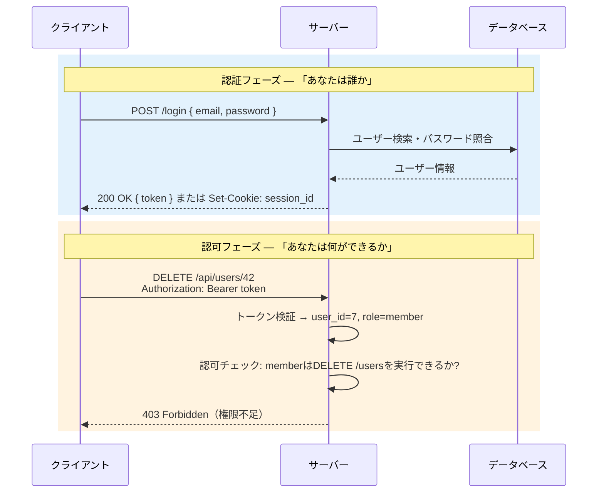
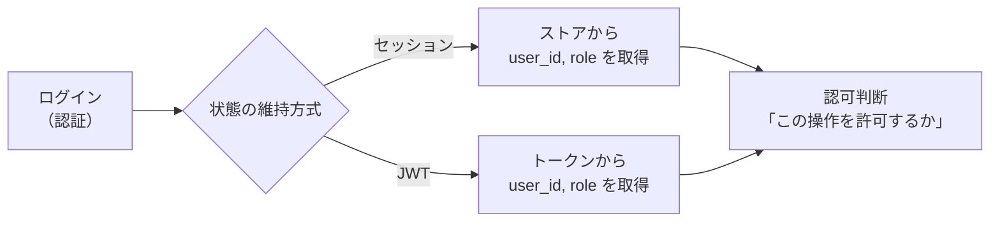
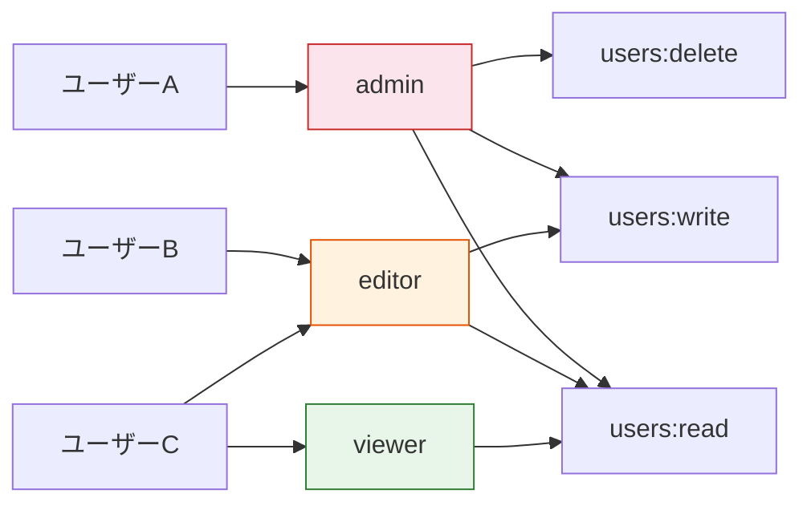

# 認証と認可

> **一言で言うと:** 認証（Authentication）は「あなたは誰か」を確認する仕組み、認可（Authorization）は「あなたは何ができるか」を制御する仕組み。この2つは**別の概念**であり、混同するとセキュリティホールになる。「ログインできた = 何でもできる」ではない。

## 3分で全体像

- **何を解決する技術か:** ステートレスな HTTP の上で「ログイン状態を保つ」「他人になりすまさせない」「ロールに応じた操作制限」を実現する。認証で身元を確定し、認可でリソース・操作の許可範囲を決める
- **代表的な使用シーン:** Web アプリのログイン・セッション管理、SPA のトークン認証、マイクロサービス間認証、管理画面の権限分け、SaaS のマルチテナント分離、サードパーティ連携（OAuth）
- **これだけは覚える3つ:**
    1. **認証 (AuthN) と認可 (AuthZ) は別** — 「誰か」(認証) と「何ができるか」(認可) は違う関心事。HTTP も `401 Unauthorized`(未認証) と `403 Forbidden`(権限不足) で区別する。混同するとセキュリティホールに
    2. **パスワードはハッシュ、bcrypt/Argon2** — 暗号化（復号できる）ではなくハッシュ化（一方向）。さらに「**意図的に遅い**」bcrypt / Argon2 を使い、ブルートフォースを構造的に困難にする。SHA-256 + ソルトでは速すぎて GPU で破られる
    3. **認可はサーバ側で必ず行う** — フロントエンドの非表示・ボタン無効化はあくまで UX。`curl` で API を直接叩けるため、認可は **サーバ側で必ず**、しかも CRUD 4 操作（作成・参照・更新・削除）すべてに付ける。「更新は付いてるが削除は素通し」が頻発する漏れパターン
- **AIに任せやすいか:** **一部任せられる** — 認証ミドルウェア・bcrypt 比較・JWT 検証は AI が高品質に書ける。一方「**JWT のアルゴリズム指定**」「**セッション vs JWT の選択**」「**認可ロジックの集約場所**」「**トークン保存場所（Cookie HttpOnly vs localStorage）**」は AI が `none` 許可・localStorage 保存などの脆弱パターンを生成しがち。`/review-ai-code` で必ず検出する
- **詰まったらここを読む:** [[セッションとJWT]] / [[パスワードハッシュ]] / [[OAuth2とOpenID-Connect]] / [[ルーティングとミドルウェア]]

## なぜ必要か

Webアプリケーションは不特定多数のクライアントからリクエストを受ける。認証がなければ誰がリクエストしているのか判別できず、認可がなければ全ユーザーに全操作を許すことになる。

具体的に何が困るか:

- **認証がない場合** — 他人のアカウントで注文・投稿・送金ができる。ログイン画面があっても、APIレベルで認証を検証していなければ `curl` で直接叩けてしまう
- **認可がない場合** — 一般ユーザーが管理者用のエンドポイント（ユーザー削除、設定変更）にアクセスできる。認証だけでは「ログインしている」ことしか保証されない

## どの問題を解決するか

### 認証が解決する問題

| 課題 | 認証による解決 |
|------|--------------|
| リクエスト元の身元が不明 | クレデンシャル（パスワード、トークン等）で身元を確認 |
| HTTPがステートレスで「ログイン状態」を維持できない | [[セッションとJWT]]で状態を補完 |
| パスワードの漏洩リスク | ハッシュ化による安全な保存、トークンによる毎回のパスワード送信回避 |

### 認可が解決する問題

| 課題 | 認可による解決 |
|------|--------------|
| 全ユーザーが全リソースにアクセスできてしまう | ロール・パーミッションに基づくアクセス制御 |
| 他人のリソースを操作できてしまう | リソース所有者チェック（`user_id` の照合） |
| 権限の管理が分散してコード中に散在 | ポリシーの一元管理（ミドルウェア、ポリシーオブジェクト等） |

### 認証→認可の流れ

認証と認可は別概念だが、**認証の結果が認可の入力になる**という依存関係がある。


```mermaid
sequenceDiagram
    participant C as クライアント
    participant S as サーバー
    participant DB as データベース

    rect rgb(227, 242, 253)
        Note over C,DB: 認証フェーズ — 「あなたは誰か」
        C->>S: POST /login { email, password }
        S->>DB: ユーザー検索・パスワード照合
        DB-->>S: ユーザー情報
        S-->>C: 200 OK { token } または Set-Cookie: session_id
    end

    rect rgb(255, 243, 224)
        Note over C,DB: 認可フェーズ — 「あなたは何ができるか」
        C->>S: DELETE /api/users/42<br/>Authorization: Bearer token
        S->>S: トークン検証 → user_id=7, role=member
        S->>S: 認可チェック: memberはDELETE /usersを実行できるか?
        S-->>C: 403 Forbidden（権限不足）
    end
```

## 認証状態の維持 — セッションとJWT

認証の最初の課題は「ログイン結果をどう維持するか」にある。[[HTTP-HTTPS]]はステートレスなプロトコルであり、認証に成功しても次のリクエストでサーバーはその事実を覚えていない。毎回パスワードを送るのは非現実的かつ危険なので、「一度認証したら、その証明を持ち続ける」仕組みが必要になる。

この問題に対して、主に2つの方式がある（詳細は [[セッションとJWT]] を参照）:

| 方式 | 一言で言うと | 認可情報の取得 |
|------|------------|--------------|
| **セッション** — ステートフル | サーバー側のストアにユーザー情報を保持し、Cookieで渡したIDで参照する | ストアから `role` 等を毎回取得。変更が即座に反映される |
| **JWT** — ステートレス | クライアントが署名付きトークンを持ち歩き、サーバーは署名を検証するだけ | トークン内の `role` クレームを参照。有効期限まで変更が反映されない |

どちらの方式でも、認証の結果（「誰か」の情報）が後続の認可判断に渡される。この流れが認証と認可の接続点:


```mermaid
flowchart LR
    A["ログイン<br/>（認証）"] --> B{"状態の維持方式"}
    B -->|"セッション"| C["ストアから<br/>user_id, role を取得"]
    B -->|"JWT"| D["トークンから<br/>user_id, role を取得"]
    C --> E["認可判断<br/>「この操作を許可するか」"]
    D --> E
```

セッション/JWTの選択は認証の**実装手段の選択**であり、認可のロジック（ロール判定、リソース所有者チェック等）にはどちらの方式でも同じモデルが適用できる。

## 認可モデル

### RBAC（Role-Based Access Control）

ユーザーにロール（役割）を割り当て、ロールに紐づく権限で操作を制御する。最もシンプルで広く使われるモデル。


```mermaid
graph LR
    U1["ユーザーA"] --> R1["admin"]
    U2["ユーザーB"] --> R2["editor"]
    U3["ユーザーC"] --> R2
    U3 --> R3["viewer"]

    R1 --> P1["users:delete"]
    R1 --> P2["users:write"]
    R1 --> P3["users:read"]
    R2 --> P2
    R2 --> P3
    R3 --> P3

    style R1 fill:#fce4ec,stroke:#c62828
    style R2 fill:#fff3e0,stroke:#e65100
    style R3 fill:#e8f5e9,stroke:#2e7d32
```

### ABAC（Attribute-Based Access Control）

ユーザー属性・リソース属性・環境条件の組み合わせで制御する。RBACより柔軟だが複雑。

```
# ABACポリシーの例
許可条件:
  - ユーザーの部署 == リソースの所属部署
  - ユーザーのランク >= "manager"
  - 現在時刻が 9:00〜18:00（営業時間内）
```

### リソースベース認可（オーナーシップチェック）

RBACやABACと組み合わせて使う。「このリソースの所有者か」を確認する。

```
GET /api/posts/42 → 誰でも閲覧可能
PUT /api/posts/42 → post.author_id === 認証ユーザーのID であること
DELETE /api/posts/42 → admin ロール、または post.author_id === 認証ユーザーのID
```

## 他の仕組みとどう関係するか

- **下位レイヤーとの関係:**
  - [[HTTP-HTTPS]] — CookieやAuthorizationヘッダはHTTPの仕組み。HTTPSでなければCookieやトークンが平文で流れ、盗聴されるリスクがある
  - [[TCP-IP]] — TLS（HTTPS）による通信暗号化が認証情報の安全な伝送の前提

- **同レイヤーとの関係:**
  - [[ルーティングとミドルウェア]] — 認証はミドルウェアとして実装する典型例。ルートグループごとに認証ミドルウェアを適用して、保護エンドポイントと公開エンドポイントを宣言的に分ける
  - [[API設計-REST-GraphQL]] — APIの認証スキーム（Bearer Token、API Key等）はAPI設計の一部。GraphQLでは単一エンドポイントのため、リゾルバレベルでの認可が重要
  - [[エラーハンドリング]] — 認証失敗は `401 Unauthorized`、認可失敗は `403 Forbidden` を返す。この使い分けが重要
  - [[バリデーション]] — 入力バリデーションは認証・認可とは独立した関心事。認証を通過しても不正な入力は弾く必要がある

- **上位レイヤーとの関係:**
  - [[Layer6-セキュリティ/_index|セキュリティ]] — XSS対策（トークン保存場所）、[[CSRF]]対策（SameSite Cookie）、[[CORS]]設定はすべて認証の安全性に直結する
  - [[Layer7-設計アーキテクチャ/_index|設計・アーキテクチャ]] — マイクロサービス間の認証（サービス間トークン）、[[OAuth2とOpenID-Connect|OAuth2/OIDC]]による外部サービス連携は設計判断

- **下位レイヤーとの関係（データ）:**
  - [[Layer3-データ永続化/_index|データ永続化]] — パスワードハッシュの保存、セッションストア（[[MemcachedとRedis|Redis]]）、ロール・パーミッションテーブルの設計

## 誤解されやすいポイント

1. **「認証と認可は同じもの」という誤解**
   認証（Authentication, AuthN）と認可（Authorization, AuthZ）は全く別の概念。認証は「あなたは誰か」、認可は「あなたは何ができるか」。ログインできたからといって全操作が許可されるわけではない。HTTPステータスコードも明確に分けている: 認証失敗は `401 Unauthorized`（実は名前が紛らわしいが「未認証」の意味）、認可失敗は `403 Forbidden`。

2. **「JWTはセッションより安全」という誤解**
   JWTはステートレスで便利だが、即時無効化ができないという根本的な弱点がある。ユーザーのアカウントが侵害された場合、セッションなら即座にストアから削除できるが、JWTは有効期限まで有効なまま。ブラックリスト方式で対処できるが、それはステートフルな仕組みを再導入することになる（→ [[セッションとJWT]]）。

3. **「パスワードを暗号化して保存すれば安全」という誤解**
   暗号化（Encryption）は復号できるため、暗号鍵が漏洩するとパスワードが復元される。正しくは**[[パスワードハッシュ|ハッシュ化]]**（一方向変換）を使う。さらに、単純なSHA-256等では不十分で、bcryptやArgon2のような**意図的に遅い**ハッシュ関数を使うべき（→ [[パスワードハッシュ]]）。

4. **「フロントエンドのバリデーションで認可を制御できる」という誤解**
   フロントエンドでボタンを非表示にしたりルートガードを設けたりするのはUXの改善であり、セキュリティではない。開発者ツールや `curl` で直接APIを叩けるため、認可チェックは**必ずサーバー側で実装**する必要がある。

5. **「JWTの中身は安全」という誤解**
   JWTのペイロードは**Base64URL**（Base64のURL安全版: `+/` の代わりに `-_` を使い、パディングなし）でエンコードされているだけで、暗号化されていない。誰でもデコードして内容を読める。署名は改ざん防止のためであり、秘匿のためではない。機密情報（パスワード、個人情報）をJWTに含めてはならない（→ [[セッションとJWT]]）。

## 設計のベストプラクティス

### 推奨パターン

- **パスワードは[[パスワードハッシュ|bcrypt/Argon2でハッシュ化]]する** — ソルトが自動付与され、意図的に遅いハッシュでブルートフォースを防ぐ
- **JWTの有効期限を短くし、リフレッシュトークンで更新する** — アクセストークン（15分〜1時間）+ リフレッシュトークン（数日〜数週間）の2段階構成で、漏洩時の影響を最小化
- **認可ロジックをミドルウェアまたはポリシーオブジェクトに集約する** — ハンドラ内に `if user.role === "admin"` を散在させない
- **Cookie属性を適切に設定する** — `HttpOnly`（JSからアクセス不可）、`Secure`（HTTPS限定）、`SameSite=Lax`（CSRF対策）を必ず設定
- **401と403を正しく使い分ける** — 未認証なら `401`（ログインが必要）、認証済みだが権限不足なら `403`（ロールが不足）

### アンチパターン

- **パスワードの平文保存** — 論外だが未だに発生する。DBダンプが漏洩した時点で全ユーザーのパスワードが流出する
- **JWTを `localStorage` に保存する** — XSSで即座に窃取される。Cookie（`HttpOnly`）の方が安全。SPAでは `HttpOnly` Cookieでセッションを管理するか、メモリ上にのみトークンを保持する
- **トークンに不要な情報を含める** — JWTのペイロードにメールアドレスや電話番号を含めると、トークンが露出した際に個人情報が漏洩する
- **認可チェックの漏れ** — CRUDの一部だけ認可を実装して残りを忘れるケース。「更新は認可チェックがあるが、削除にはない」というパターンが多発する

## AIエージェントとの協働

> このトピックでAIコーディングエージェント（Claude Code, Copilot, Cursor 等）と協働するための観点。
> 認証ミドルウェア・bcrypt 比較・JWT 検証は AI に任せやすい一方、**「JWT alg=none 受容」「localStorage 保存」「ロールチェック直書き」「認可漏れ」** は脆弱性に直結する典型誤りで頻発する。レビューも `/review-ai-code` で横断アンチパターン照合に任せられる。

### AIに任せられる部分 / 人間が判断すべき部分

| タスク種類 | 任せ方（実装/レビュー） | 人間の関与 |
|---|---|---|
| 認証ミドルウェア（JWT / セッション）の実装 | AI 実装、`/review-ai-code` でレビュー | アルゴリズムの明示指定、有効期限、リフレッシュトークン戦略は要件で決める |
| bcrypt / Argon2 によるパスワードハッシュ | AI に任せる | コスト係数（bcrypt の `cost`、Argon2 の `m,t,p`）はサーバ性能とセキュリティ要件で決める |
| RBAC / ABAC 認可ロジック | AI が雛形を生成 | ロール・パーミッションの定義はビジネス要件。リソース所有者チェックの抜け漏れは人間がレビュー |
| OAuth2 / OIDC 連携 | AI に PKCE 含むフローを実装させる | Identity Provider 選定、scope 設計、Redirect URI 検証は人間判断 |
| Cookie 属性設定 | AI が `HttpOnly; Secure; SameSite=Lax` を提案 | SameSite の選択（Strict / Lax / None）は OAuth フローや埋め込みシナリオで分岐 |
| 認可ポリシー（PostPolicy 等）の集約 | AI が提案 | ポリシー漏れの最終チェックは人間。Pundit `verify_authorized` のようなランタイム検出を仕込むかは判断 |

### AI生成コードのレビュー観点（このトピック固有）

AI生成の認証・認可コードを受け取ったとき、最低限ここを見る。

1. **JWT 検証時にアルゴリズムが明示されているか** — `jwt.verify(token, secret)` のように引数を省略すると、(a) トークンヘッダの `alg: none` を受容して **署名なしで通ってしまう** 危険、(b) **HS256/RS256 アルゴリズム混同攻撃**（CVE-2015-9235、公開鍵を HMAC キーとして使われる脆弱性）が成立する。`jsonwebtoken` 9.x（2022年12月以降）など現行の主要 Node.js ライブラリは `algorithms` 必須化でデフォルト挙動として塞がれているが、**他言語ライブラリ・古いバージョン・自前実装では依然成立する**ため、`jwt.verify(token, secret, { algorithms: ['HS256'] })` のように **必ず明示する習慣**を持つ
2. **トークンの保存場所と Cookie 属性** — JWT を `localStorage` に保存しているコードは XSS 1 発で全トークン窃取される。`HttpOnly; Secure; SameSite=Lax` の Cookie に保存するのが基本。Cookie 属性が一つでも欠けていないか（`Secure` 抜けで HTTP 平文盗聴、`HttpOnly` 抜けで JS 経由窃取、`SameSite` 抜けで CSRF 経路）。なお **Cookie に保存した時点で「Authorization ヘッダだから CSRF に強い」というメリットは失われる** — Cookie 同様にブラウザが自動送信するため、`SameSite=Lax/Strict` または CSRF トークンによる対策が必須
3. **認可漏れと「認証 = 認可」の混同** — CRUD 4 操作のうち一部にしか認可チェックが入っていない（典型: 更新は所有者チェックがあるが削除は素通し）。リソース所有者チェック（`post.author_id === user.id`）が未実装で、ログインしていれば他人のリソースを操作できる、という事故もよくある。`401` と `403` を混同して常に `401` を返している、または **未認証(401) を権限不足(403) として返している** ケースもチェック

### 効くプロンプトの型

このトピックに関する実装をAIに依頼するとき、コンテキストとして渡すべき情報・制約・成功基準のテンプレ。

```
# 前提（プロジェクトの状況・既存のコード規約）
- 認証方式: セッション (Redis 保管) / JWT (Cookie HttpOnly) など明示
- パスワードハッシュ: bcrypt cost=12 / Argon2id m=64MB t=3 p=4
- ロール定義: admin / editor / member / viewer
- 認可モデル: RBAC + リソース所有者チェック
- フロントエンド: SPA / SSR / モバイル
- HTTPS: 本番では必須、開発では http://localhost のみ許可

# やってほしいこと
- 「{要件}」の認証・認可機構を実装
- 認証ミドルウェアと認可ポリシーを分離して提示

# 守ってほしい制約（このトピック固有のもの）
- パスワードは平文保存禁止、bcrypt/Argon2 でハッシュ化
- パスワード比較は bcrypt.compare（タイミング攻撃対策の定数時間比較）
- JWT 検証は algorithms オプションで HS256 / RS256 を明示指定（none 拒否）
- トークンは Cookie (HttpOnly; Secure; SameSite=Lax) に保存（localStorage は禁止）
- アクセストークン短命 (15min)、リフレッシュトークン長命 (7days) の2段階
- 認証失敗は 401 Unauthorized、認可失敗は 403 Forbidden を厳密に区別
- 認可は CRUD 4 操作すべてに適用、ポリシー集約（Pundit / Policy）で一元管理
- リソース所有者チェック（authoring user の照合）を更新・削除に必ず実装
- 機密情報（パスワード・電話番号）は JWT クレームに含めない（Base64 エンコードのみ）

# 完了の判断基準
- alg=none トークンが拒否される
- トークンが localStorage / sessionStorage に保存されていない
- CRUD 全操作に認可チェックが入っている
- 401 と 403 が正しく分かれている
- パスワードが平文で扱われる箇所がない（ログ・レスポンス・SQL）
```

### AI実装のアンチパターン

LLM生成コードで頻出する過剰設計・誤用パターン。レビュー時の照合表として使う。

| アンチパターン | なぜ問題か | レビュー観点 / 対策 |
|---|---|---|
| JWT 検証で `algorithms` オプション未指定 | (a) `alg: none` トークン受容、(b) HS256/RS256 アルゴリズム混同攻撃（CVE-2015-9235、公開鍵を HMAC キーとして使われる）が成立しうる。`jsonwebtoken` 9.x 以降は必須化で塞がれているが、他言語実装は要警戒 | `jwt.verify(token, secret, { algorithms: ['HS256'] })` で明示する習慣を持つ |
| パスワードを SHA-256 / MD5 でハッシュ | GPU で秒間数十億試行され、ブルートフォースで突破される | bcrypt (cost=12 以上) / Argon2id を使う |
| パスワード比較に `===` / `==` | タイミング攻撃で一致長が推測されうる | `bcrypt.compare` / `crypto.timingSafeEqual` などの定数時間比較 |
| パスワードを平文で保存 / ログ出力 | DB ダンプ・ログ漏洩で全ユーザのパスワード流出 | 受信即ハッシュ、ログにも出さない（PII マスク） |
| JWT を localStorage / sessionStorage に保存 | XSS で 1 回でも JS 注入されると全トークン窃取 | `Set-Cookie: HttpOnly; Secure; SameSite=Lax` で保存 |
| Cookie 属性に `Secure` `HttpOnly` `SameSite` のいずれか欠落 | HTTP 平文盗聴・JS 経由窃取・CSRF の各経路が開く | 3 属性すべて必須。OAuth で SameSite=None を使う場合は Secure 必須 |
| 自前で JWT 署名検証を実装 | 暗号実装ミスは即セキュリティホール（タイミング攻撃・nonce 再利用など） | jose / jsonwebtoken / golang-jwt 等の既存ライブラリを使う |
| 認可チェックを各ハンドラに直書き | DRY 違反、片方だけ抜けて他人のリソース操作が可能になる | ミドルウェア / Policy オブジェクトに集約。Pundit の `verify_authorized` 等で漏れ検出 |
| CRUD 一部だけ認可チェック（典型: 削除が素通し） | ロード→所有者チェック→更新の枝はあるが、ロード→削除の枝で認可なし | 全 CRUD でリソース所有者 / ロールチェック。テストで全動詞を網羅 |
| 401 と 403 の混同 / 常に 401 を返す | クライアントが「ログインしなおせば良いか / 権限不足か」を判別できない | 未認証 = 401、認証済みだが権限不足 = 403 |
| JWT に個人情報（メール・電話・住所）を詰める | Base64 デコードで誰でも閲覧可能。トークン漏洩時に個人情報も流出 | sub に user_id のみ、必要な属性は別途 API で取得 |
| アクセストークンを長命にする (24h+) | 漏洩時の影響が大きい | 短命 (15min) + リフレッシュトークンの 2 段階構成 |
| ログイン失敗時に「ユーザが存在しません」「パスワードが違います」を分けて返す | アカウント存在の列挙攻撃が可能に | 「メールアドレスまたはパスワードが正しくありません」で統一 |

→ レイヤー横断のアンチパターン索引: [[_anti-patterns/_index|AIアンチパターン索引]] / [[_anti-patterns/レイヤー別/Layer4-Backend|Layer 4 Backend アンチパターン集]]

## 具体例

### Go（Chi）— 認証ミドルウェアと RBAC 認可

```go
package main

import (
	"context"
	"encoding/json"
	"net/http"
	"os"
	"strings"
	"time"

	"github.com/go-chi/chi/v5"
	"github.com/golang-jwt/jwt/v5"
)

// 本番では環境変数 / KMS から取得（ハードコードはリポジトリ漏洩で全トークン偽造可能になる）
var jwtSecret = []byte(os.Getenv("JWT_SECRET"))

type Claims struct {
	UserID int64  `json:"user_id"`
	Role   string `json:"role"`
	jwt.RegisteredClaims
}

type contextKey string

// 認証ミドルウェア — 「あなたは誰か」を確認
func authenticate(next http.Handler) http.Handler {
	return http.HandlerFunc(func(w http.ResponseWriter, r *http.Request) {
		authHeader := r.Header.Get("Authorization")
		if !strings.HasPrefix(authHeader, "Bearer ") {
			http.Error(w, `{"error":"authentication required"}`, http.StatusUnauthorized)
			return
		}

		tokenStr := strings.TrimPrefix(authHeader, "Bearer ")
		claims := &Claims{}
		token, err := jwt.ParseWithClaims(tokenStr, claims, func(t *jwt.Token) (any, error) {
			return jwtSecret, nil
		}, jwt.WithValidMethods([]string{"HS256"}))

		// err != nil の場合 token は nil または不完全なため、先に err を返す
		if err != nil {
			http.Error(w, `{"error":"invalid token"}`, http.StatusUnauthorized)
			return
		}
		if !token.Valid {
			http.Error(w, `{"error":"invalid token"}`, http.StatusUnauthorized)
			return
		}

		// 認証結果をコンテキストに格納 → 認可ミドルウェアで参照
		ctx := context.WithValue(r.Context(), contextKey("claims"), claims)
		next.ServeHTTP(w, r.WithContext(ctx))
	})
}

// 認可ミドルウェア — 「あなたは何ができるか」を確認
func requireRole(roles ...string) func(http.Handler) http.Handler {
	return func(next http.Handler) http.Handler {
		return http.HandlerFunc(func(w http.ResponseWriter, r *http.Request) {
			claims := r.Context().Value(contextKey("claims")).(*Claims)
			for _, role := range roles {
				if claims.Role == role {
					next.ServeHTTP(w, r)
					return
				}
			}
			http.Error(w, `{"error":"forbidden"}`, http.StatusForbidden)
		})
	}
}

func main() {
	r := chi.NewRouter()

	// 公開エンドポイント（認証不要）
	r.Post("/login", func(w http.ResponseWriter, r *http.Request) {
		// パスワード照合（省略）→ トークン発行
		claims := Claims{
			UserID: 7, Role: "member",
			RegisteredClaims: jwt.RegisteredClaims{
				ExpiresAt: jwt.NewNumericDate(time.Now().Add(1 * time.Hour)),
			},
		}
		token, _ := jwt.NewWithClaims(jwt.SigningMethodHS256, claims).SignedString(jwtSecret)
		json.NewEncoder(w).Encode(map[string]string{"token": token})
	})

	// 保護エンドポイント
	r.Route("/api", func(r chi.Router) {
		r.Use(authenticate) // 認証: 全エンドポイントで「誰か」を確認

		r.Get("/me", func(w http.ResponseWriter, r *http.Request) {
			claims := r.Context().Value(contextKey("claims")).(*Claims)
			json.NewEncoder(w).Encode(map[string]any{
				"user_id": claims.UserID, "role": claims.Role,
			})
		})

		// 認可: admin のみ
		r.With(requireRole("admin")).Delete("/users/{id}", func(w http.ResponseWriter, r *http.Request) {
			json.NewEncoder(w).Encode(map[string]string{"deleted": chi.URLParam(r, "id")})
		})
	})

	http.ListenAndServe(":3000", r)
}
```

### Express（Node.js）— 認証ミドルウェアとリソースベース認可

> Express 4 / 5 共通動作。Express 5 (2024-10 GA) では async ハンドラの reject 自動キャッチが入るため、`requireOwnership` のような async ミドルウェアでの try-catch が省略可能になる（Express 4 では明示的に `try-catch` するか `express-async-errors` 必須）。

```javascript
const express = require('express');
const app = express();
app.use(express.json());

// 認証ミドルウェア（セッション方式の場合）
function requireAuth(req, res, next) {
  if (!req.session.userId) {
    return res.status(401).json({ error: 'Authentication required' });
  }
  next();
}

// 認可ミドルウェア: ロールチェック
function requireRole(...roles) {
  return (req, res, next) => {
    if (!roles.includes(req.session.role)) {
      return res.status(403).json({ error: 'Forbidden' });
    }
    next();
  };
}

// 認可: リソース所有者チェック
function requireOwnership(getResourceOwnerId) {
  return async (req, res, next) => {
    const ownerId = await getResourceOwnerId(req);
    if (ownerId !== req.session.userId && req.session.role !== 'admin') {
      return res.status(403).json({ error: 'Forbidden' });
    }
    next();
  };
}

const api = express.Router();
api.use(requireAuth); // 認証: 全エンドポイントで「誰か」を確認

// 全認証ユーザーがアクセス可能
api.get('/posts', (req, res) => {
  res.json({ posts: [] });
});

// 認可: リソース所有者 または admin のみ
api.put('/posts/:id',
  requireOwnership(async (req) => {
    // 実際にはDBからpostを取得してauthor_idを返す
    return 7; // post.author_id
  }),
  (req, res) => res.json({ updated: req.params.id })
);

// 認可: admin のみ
api.delete('/users/:id', requireRole('admin'), (req, res) => {
  res.json({ deleted: req.params.id });
});

app.use('/api', api);
app.listen(3000);
```

### Laravel（PHP）— Guard と Policy による認証・認可

```php
// routes/web.php — ルート定義
use App\Http\Controllers\PostController;

// 公開エンドポイント（認証不要）
Route::post('/login', [AuthController::class, 'login']);

// 保護エンドポイント — auth ミドルウェアで「誰か」を確認
Route::middleware('auth:sanctum')->group(function () {
    Route::get('/me', fn (Request $request) => $request->user());

    // 認可: PostPolicy を自動適用（モデルポリシー）
    Route::apiResource('posts', PostController::class);
});
```

```php
// app/Policies/PostPolicy.php — 認可ロジックの一元管理
namespace App\Policies;

use App\Models\Post;
use App\Models\User;

class PostPolicy
{
    // 更新: リソース所有者 または admin のみ
    public function update(User $user, Post $post): bool
    {
        return $user->id === $post->author_id
            || $user->role === 'admin';
    }

    // 削除: admin のみ
    public function delete(User $user, Post $post): bool
    {
        return $user->role === 'admin';
    }
}
```

```php
// app/Http/Controllers/PostController.php
namespace App\Http\Controllers;

use App\Models\Post;
use Illuminate\Http\Request;

class PostController extends Controller
{
    public function update(Request $request, Post $post)
    {
        // Gate::authorize を呼び出し、PostPolicy::update を自動適用
        $this->authorize('update', $post);

        $post->update($request->validated());
        return response()->json($post);
    }

    public function destroy(Post $post)
    {
        $this->authorize('delete', $post);

        $post->delete();
        return response()->json(['deleted' => $post->id]);
    }
}
```

### Ruby on Rails — Devise と認可（Pundit）

```ruby
# Gemfile
gem 'devise'  # 認証
gem 'pundit'  # 認可
```

```ruby
# app/controllers/application_controller.rb
class ApplicationController < ActionController::API
  include Pundit::Authorization

  # Pundit の認可チェック漏れを検知（開発時に便利）
  after_action :verify_authorized, except: :index
  after_action :verify_policy_scoped, only: :index

  rescue_from Pundit::NotAuthorizedError do |_|
    render json: { error: 'Forbidden' }, status: :forbidden
  end
end
```

```ruby
# app/controllers/posts_controller.rb
class PostsController < ApplicationController
  before_action :authenticate_user! # Devise: 認証（未ログインなら 401）

  def update
    post = Post.find(params[:id])
    authorize post # Pundit: PostPolicy#update? を自動呼び出し

    post.update!(post_params)
    render json: post
  end

  def destroy
    post = Post.find(params[:id])
    authorize post # Pundit: PostPolicy#destroy? を自動呼び出し

    post.destroy!
    render json: { deleted: post.id }
  end

  private

  def post_params
    params.require(:post).permit(:title, :body)
  end
end
```

```ruby
# app/policies/post_policy.rb — 認可ロジックの一元管理
class PostPolicy < ApplicationPolicy
  # 更新: リソース所有者 または admin のみ
  def update?
    record.author_id == user.id || user.role == 'admin'
  end

  # 削除: admin のみ
  def destroy?
    user.role == 'admin'
  end
end
```

### パスワードハッシュ化

```javascript
const bcrypt = require('bcrypt');

// 登録時: ハッシュ化して保存
const hash = await bcrypt.hash('user-password-123', 10);

// ログイン時: 入力パスワードとハッシュを比較
const isValid = await bcrypt.compare('user-password-123', hash); // true
```

```go
import "golang.org/x/crypto/bcrypt"

// 登録時
hash, err := bcrypt.GenerateFromPassword([]byte("user-password-123"), bcrypt.DefaultCost)

// ログイン時
err = bcrypt.CompareHashAndPassword(hash, []byte("user-password-123"))
// err == nil なら一致
```

```php
// PHP — password_hash() は bcrypt をデフォルトで使用
// 登録時: ハッシュ化して保存（ソルトは自動生成）
$hash = password_hash('user-password-123', PASSWORD_BCRYPT);

// ログイン時: 入力パスワードとハッシュを比較
$isValid = password_verify('user-password-123', $hash); // true
```

```ruby
require 'bcrypt'

# 登録時: ハッシュ化して保存
hash = BCrypt::Password.create('user-password-123')

# ログイン時: 入力パスワードとハッシュを比較
is_valid = BCrypt::Password.new(hash) == 'user-password-123' # true
```

## 参考リソース

- OWASP Authentication Cheat Sheet — 認証実装のベストプラクティス集
- RFC 7519 — JSON Web Token (JWT) の仕様
- RFC 6749 — OAuth 2.0 Authorization Framework
- 「体系的に学ぶ安全なWebアプリケーションの作り方」（徳丸浩著）— セッション管理・認証の詳細
- jwt.io — JWTのデバッグ・デコードツール

## 理解度セルフチェック

> 答えられなければ本文に戻る。答えはこのファイル内に必ずある。

1. **認証 (AuthN) と認可 (AuthZ) の違いを30秒で説明せよ。** HTTPステータスコード `401` と `403` の使い分けに触れること。
2. **「JWTはセッションより安全」は誤り。なぜか?** JWT の根本的な弱点を1つ挙げ、それをどう緩和するか述べよ。
3. **AI生成コードレビュー設問:** AI が以下の Express 認証実装を生成した。本文の観点で **問題点を最低3つ** 指摘せよ。

```javascript
const express = require('express');
const jwt = require('jsonwebtoken');
const crypto = require('crypto');
const app = express();
app.use(express.json());

const JWT_SECRET = 'secret123'; // ハードコード

// パスワードハッシュ化
function hashPassword(pw) {
  return crypto.createHash('sha256').update(pw).digest('hex');
}

// ログイン
app.post('/login', async (req, res) => {
  const { email, password } = req.body;
  const user = await db.users.findByEmail(email);
  if (!user) {
    return res.status(401).json({ error: 'User not found' });
  }
  if (user.password_hash !== hashPassword(password)) {
    return res.status(401).json({ error: 'Wrong password' });
  }
  const token = jwt.sign(
    { userId: user.id, email: user.email, role: user.role, phone: user.phone },
    JWT_SECRET,
    { expiresIn: '30d' }
  );
  res.json({ token });
});

// 認証ミドルウェア
function requireAuth(req, res, next) {
  const token = req.headers.authorization?.split(' ')[1];
  const decoded = jwt.verify(token, JWT_SECRET); // alg 指定なし
  req.user = decoded;
  next();
}

// 投稿の更新 — 所有者チェックあり
app.put('/posts/:id', requireAuth, async (req, res) => {
  const post = await db.posts.findById(req.params.id);
  if (post.author_id !== req.user.userId) {
    return res.status(401).json({ error: 'Forbidden' });
  }
  await db.posts.update(req.params.id, req.body);
  res.json({ updated: req.params.id });
});

// 投稿の削除
app.delete('/posts/:id', requireAuth, async (req, res) => {
  await db.posts.delete(req.params.id);
  res.json({ deleted: req.params.id });
});

app.listen(3000);
```

> [!note]- 解答の指針
>
> > [!info] 用語ミニ辞典
> > - **認証 (Authentication / AuthN):** 「あなたは誰か」を確認するプロセス。パスワード・トークン・指紋など、本人しか持たない / 知らないものでアイデンティティを証明する。失敗時の HTTP は `401 Unauthorized`（実質的には Unauthenticated の意）
> > - **認可 (Authorization / AuthZ):** 認証済みのユーザが「何をできるか」を制御するプロセス。ロール・パーミッション・リソース所有者などで判定する。失敗時の HTTP は `403 Forbidden`
> > - **bcrypt / Argon2:** 意図的に遅くしたパスワードハッシュ関数。bcrypt は古典、Argon2 は 2015 年 PHC 受賞の現代標準。GPU/ASIC でのブルートフォース攻撃を構造的に困難にする。`cost` (bcrypt) や `m,t,p` (Argon2) で計算量を調整可能
> > - **タイミング攻撃 (Timing Attack):** 文字列比較の処理時間差から一致長を推測する攻撃。`===` で文字列比較すると、最初の不一致位置で早期 return するため、時間差で一致長が漏洩する。`crypto.timingSafeEqual` や `bcrypt.compare` は定数時間で比較する
> > - **JWT (JSON Web Token):** ヘッダ・ペイロード・署名の3部構成のトークン。Base64URL でエンコードされており、ペイロードは**暗号化されていない**（誰でも読める）。署名は改ざん防止のためで秘匿のためではない
> > - **Base64URL:** Base64 のうち URL やファイル名で問題になる `+` `/` を `-` `_` に置換し、末尾のパディング `=` を省いた符号化方式。URL 安全な文字のみで構成されるため Authorization ヘッダや URL のクエリにそのまま埋め込める。**暗号化ではなく単なる符号化**で、デコードは誰でも可能
> > - **alg=none 攻撃:** JWT ヘッダの `alg` を `none` に書き換え、署名なしトークンを送る攻撃。検証側でアルゴリズムを明示指定していないと受容してしまう古典的脆弱性
> > - **アルゴリズム混同攻撃 (Algorithm Confusion):** JWT で `RS256`（公開鍵検証）想定のサーバに、攻撃者が `alg: HS256` に書き換えたトークン + サーバの**公開鍵を HMAC キーとして使った署名**を送る攻撃。検証側で `algorithms` を明示していないと、公開鍵で HMAC を検証してしまい認証突破される。CVE-2015-9235（jsonwebtoken）として広く知られる脆弱性
> > - **HttpOnly Cookie:** JavaScript からアクセスできない Cookie。XSS でスクリプトが注入されてもトークンが盗めない。`document.cookie` で読めない
> > - **Secure Cookie:** HTTPS 接続でのみ送信される Cookie。HTTP 平文での盗聴を防ぐ
> > - **SameSite Cookie:** クロスサイトリクエストへの Cookie 自動送信を制御する属性。`Strict` (同一サイトのみ) / `Lax` (トップレベル GET は許可) / `None` (常に送信、Secure 必須)。CSRF 対策の基盤
> > - **リフレッシュトークン (Refresh Token):** アクセストークンを再発行するための長命トークン。漏洩時の影響範囲を限定するため、アクセストークンは短命（15分等）にし、長命のリフレッシュトークンで更新する2段階構成にする
> > - **アカウント列挙 (Account Enumeration):** ログイン失敗メッセージの違い（「ユーザが存在しません」vs「パスワードが違います」）から、登録済みメールアドレスを総当たりで特定する攻撃
> > - **即時無効化 (Immediate Revocation):** 「漏洩・退職・パスワード変更」などのイベント発生時にトークンやセッションを直ちに使用不能にする能力。セッション方式はストアの該当行を削除すれば即時無効化できるが、JWT 方式はステートレスで検証ロジックがトークン自体を信じるため標準では難しい
> > - **ブラックリスト (Token Blacklist / Denylist):** 無効化したトークンの ID（`jti` クレーム）を Redis 等に保存し、検証時に照会する方式。JWT の即時無効化を後付けで実現するが、ステートレスというメリットを部分的に放棄することになる
> > - **`jti` (JWT ID):** JWT のクレームのひとつで、トークンに固有 ID を付ける。ブラックリスト方式での無効化キーや、リプレイ攻撃検出に使う
>
> 1. 認証 (AuthN) は「**あなたは誰か**」を確認するプロセスで、パスワードやトークンによる本人性の証明。認可 (AuthZ) は「**あなたは何ができるか**」を制御するプロセスで、ロールやリソース所有者の判定。HTTP では未認証は `401 Unauthorized` で「ログインが必要」を伝え、認証済みだが権限不足は `403 Forbidden` で「権限が足りない」を伝える。**両者を混同するのが大きなセキュリティアンチパターン**で、ログインできた = すべての操作が許される、と誤実装すると一般ユーザが管理者操作に到達する。`401` を見たクライアントはログインフローへ、`403` ならログイン状態を維持しつつ権限要請する、と挙動が分岐するため、HTTP的にも明確に分ける必要がある
> 2. JWT の根本的な弱点は **「即時無効化ができない」** こと。サーバはステートレスに署名検証だけを行うため、トークン漏洩・パスワード変更・アカウント停止が起きても、有効期限が切れるまでトークンが使えてしまう。セッションならストア (Redis 等) のレコードを削除すれば即座に無効化できるが、JWT は同じことができない。緩和策: (a) **アクセストークンを短命にする** (15分等) ことで漏洩時の影響を限定し、長命のリフレッシュトークンで更新する2段階構成、(b) **ブラックリスト（無効化リスト）** をサーバ側で持つ — ただしこれは事実上ステートフルな仕組みを再導入することになる、(c) **トークン再発行時に jti / version を付与し、特定バージョン以前を一括無効化** する仕組み。「JWT はステートレスで便利」というメリットと「即時無効化できない」リスクはトレードオフ関係にあり、用途で選択する
> 3. AI生成コードの問題点（最低限以下を指摘できれば本文を理解している）:
>     - **JWT_SECRET がハードコード** — リポジトリ漏洩で全トークン偽造可能。環境変数または KMS から取得すべき
>     - **`crypto.createHash('sha256')` でパスワードをハッシュ** — SHA-256 は速すぎて GPU でブルートフォース可能。bcrypt / Argon2id を使う
>     - **パスワード比較に `!==`** — タイミング攻撃で一致長を推測される。`bcrypt.compare` を使うべき（bcrypt.compare は定数時間比較を内包）
>     - **パスワードハッシュにソルトがない** — 同じパスワードのユーザは同じハッシュになり、レインボーテーブル攻撃が成立する。bcrypt なら自動でソルト付与
>     - **`jwt.verify(token, JWT_SECRET)` でアルゴリズム未指定** — `alg: none` 攻撃でバイパス可能。`{ algorithms: ['HS256'] }` を明示すべき
>     - **JWT に個人情報 (`email`, `phone`) を含めている** — Base64 デコードで誰でも閲覧可能。漏洩時に個人情報も流出。`sub: userId` のみにし、他は API で取得
>     - **トークン有効期限が30日と長すぎる** — 漏洩時の影響が大きい。アクセストークン15分 + リフレッシュトークン7日の2段階構成にすべき
>     - **トークンの保存場所がクライアント任せ（明示なし）** — おそらく localStorage に保存されるが、XSS 1 発で全トークン窃取される。Cookie (HttpOnly; Secure; SameSite=Lax) でレスポンス
>     - **ログイン失敗で「User not found」「Wrong password」を分けて返している** — アカウント列挙攻撃が成立する。「メールアドレスまたはパスワードが正しくありません」で統一すべき
>     - **`/posts/:id` の更新で他人のリソースは `401` ではなく `403`** — 認証済みだが権限不足は Forbidden。`401` だと「ログインしなおせば良いか」とクライアントが誤解する
>     - **`/posts/:id` の削除に認可チェックが完全に欠落** — 認証されたユーザなら誰でも他人の投稿を削除できる。CRUD 一部だけ認可がついている典型的な漏れパターン。所有者チェック + ロールチェックを必ず追加
>     - **`requireAuth` ミドルウェアで JWT 検証エラーがハンドリングされていない** — `jwt.verify` は失敗時に throw するため、エラーハンドリングミドルウェアに到達しないと 500 系で内部エラーが漏れる。try-catch または非同期エラーハンドラで `401` を返すべき
>     - **HTTPS / Cookie 属性の言及なし** — 平文 HTTP でトークンを送ると盗聴されるため、本番では HTTPS 必須。Cookie に保存する場合は `Secure` 属性も必要

## 学習メモ

- `401 Unauthorized` は実質 `401 Unauthenticated` の意味。HTTP仕様の命名が紛らわしい
- [[OAuth2とOpenID-Connect|OAuth2]]はあくまで「認可」のフレームワークであり、「認証」にはOpenID Connect（OIDC）が必要
- パブリッククライアント（SPA・モバイル・CLI）の OAuth/OIDC 実装では [[PKCEフロー]] が必須。OAuth 2.1 では全クライアントで必須化される方向
- セッションとJWTのどちらを選ぶかは技術的優劣ではなくアーキテクチャの要件で決まる
