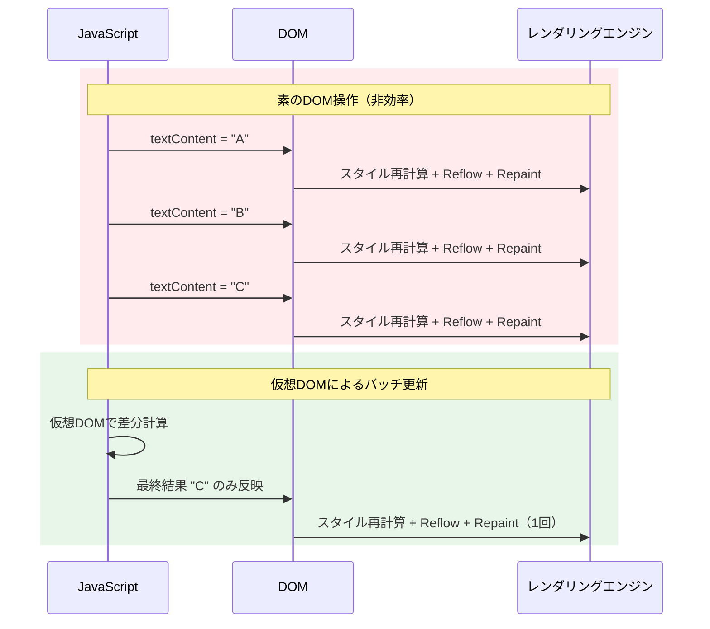
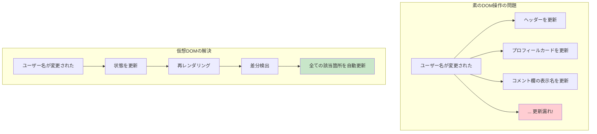
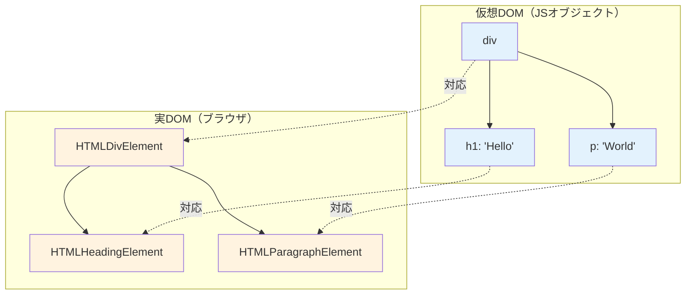
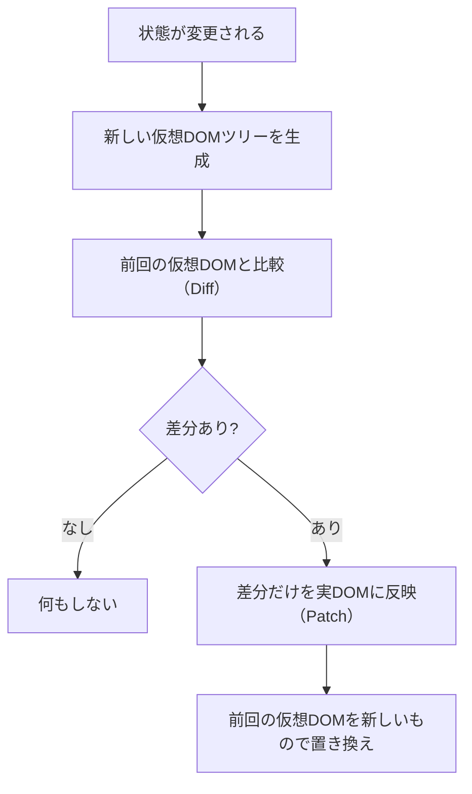
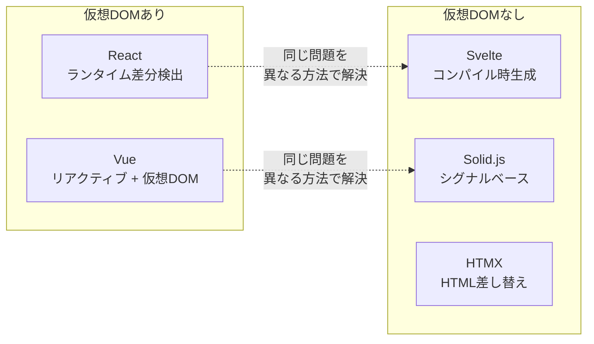

# DOMと仮想DOM

> **一言で言うと:** DOM（Document Object Model）はHTMLをプログラムから操作するためのツリー構造のAPIであり、仮想DOM（Virtual DOM）はDOMの直接操作が引き起こすパフォーマンス問題を「差分だけ更新する」ことで解決する仕組み。ReactやVueが存在する理由そのもの。

## なぜ必要か

ブラウザは[[HTML-CSS-JS|HTML]]を受け取ると、[[DOMツリーとノード|DOMツリー]]を構築する。このDOMがなければ、JavaScriptから文書の内容を読み取ることも変更することもできない。しかしDOMの直接操作には深刻な問題がある:

- **DOM操作のたびにブラウザが再計算を行う** — 1つの要素を変更しただけで、レイアウト（Reflow）とペイント（Repaint）が走る。100個の要素を1つずつ更新すれば、最悪100回のレイアウト再計算が発生する
- **状態とUIの同期が手動管理** — 「データが変わったらどのDOM要素を更新するか」をプログラマが逐一管理する必要がある。アプリが複雑になるほど、この同期は破綻する
- **コードがDOMの構造に強く依存する** — `document.getElementById('user-list').children[2].firstChild` のようなコードは、HTML構造が少し変わるだけで壊れる

仮想DOMは「UIの状態を宣言的に記述し、差分だけを効率的にDOMに反映する」ことで、これらの問題を一挙に解決した。

## どの問題を解決するか

### 問題1: DOM操作のパフォーマンスコスト

DOM操作が「遅い」と言われる本質は、DOM自体の読み書きではなく、**操作のたびにブラウザのレンダリングパイプラインが走る**ことにある。



実際にはブラウザもバッチ処理で最適化するが、レイアウト情報の読み取り（`offsetHeight`, `getBoundingClientRect()` 等）が間に入ると強制的にReflowが発生する（**Forced Reflow / Layout Thrashing**）。

### 問題2: 命令的UI vs 宣言的UI

素のDOM操作は**命令的（Imperative）**— 「何をどう変えるか」を逐一指示する:

```javascript
// 命令的: TODOリストにアイテムを追加
const li = document.createElement('li');
li.textContent = '新しいタスク';
li.className = 'todo-item';
const checkbox = document.createElement('input');
checkbox.type = 'checkbox';
checkbox.addEventListener('change', () => {
  li.classList.toggle('completed');
});
li.prepend(checkbox);
document.getElementById('todo-list').appendChild(li);
```

仮想DOMを使うフレームワークは**宣言的（Declarative）**— 「UIがどうあるべきか」を記述し、差分の反映はフレームワークに任せる:

```jsx
// 宣言的（React）: 状態に基づいてUIを記述
function TodoList({ items }) {
  return (
    <ul>
      {items.map(item => (
        <li key={item.id} className={item.done ? 'completed' : ''}>
          <input
            type="checkbox"
            checked={item.done}
            onChange={() => toggleItem(item.id)}
          />
          {item.text}
        </li>
      ))}
    </ul>
  );
}
```

宣言的UIでは「アイテムが追加された/削除された/変更された」時のDOM操作を**プログラマが書く必要がない**。状態（`items`）を変更すれば、仮想DOMの差分検出（Reconciliation）が最小限のDOM操作を自動的に行う。

### 問題3: 状態とUIの同期の破綻

アプリケーションが複雑になると、1つのデータ変更が複数のUI要素に影響する。素のDOM操作では更新漏れやUIの不整合が頻発する:



## 仮想DOMの仕組み — Reconciliation

仮想DOMは軽量なJavaScriptオブジェクトで、実DOMのツリー構造を模倣する:



### Reconciliationのアルゴリズム

状態が変更されたとき、仮想DOMは以下の手順でUIを更新する:



Reactの差分検出アルゴリズムは、ツリーの完全な比較（O(n³)）ではなく、2つのヒューリスティクスで O(n) に抑えている:

1. **異なる型の要素は完全に作り直す** — `<div>` が `<span>` に変わったら、子要素ごと破棄して新しく作る
2. **`key` 属性でリスト要素を識別する** — リストの並び替え・挿入・削除を効率的に検出する

### keyの重要性

`key` はリスト内の要素を**一意に識別する**ためのもの。`key` がないか、配列インデックスを `key` にすると、並び替え時に全要素が再レンダリングされる:

```jsx
// ❌ インデックスをkeyに使う
{items.map((item, index) => (
  <li key={index}>{item.name}</li>
))}
// 先頭にアイテムを追加すると、全てのindexがずれて全要素が再マウントされる

// ✅ 安定した一意IDをkeyに使う
{items.map(item => (
  <li key={item.id}>{item.name}</li>
))}
// 先頭にアイテムを追加しても、既存要素はそのまま、新しい要素だけ追加
```

## 他の仕組みとどう関係するか

- **下位レイヤーとの関係:**
  - [[HTML-CSS-JS]] — HTMLがパースされてDOMが生成される。DOMはHTMLの「プログラマブルな表現」。CSSOMと合成されてレンダーツリーとなる
  - [[HTTP-HTTPS|HTTP/HTTPS]]（Layer 2）— サーバーから取得したHTMLが最初のDOMを構築する。SSR（Server-Side Rendering）ではサーバー側でDOMを構築してHTMLとして送信する
- **同レイヤーとの関係:**
  - [[状態管理]] — 仮想DOMが解決するのは「状態→UIの反映」であり、状態管理は「状態をどこに持ち、どう変更するか」を扱う。仮想DOMの登場が宣言的な[[状態管理]]ライブラリの基盤となった
  - [[コンポーネント設計]] — 仮想DOMのレンダリング単位がコンポーネント。コンポーネントの粒度が再レンダリングの範囲に直結する
  - [[アクセシビリティ]] — 仮想DOMの差分更新は、スクリーンリーダーのフォーカス管理に影響する。不用意なDOM再構築でフォーカスが失われる問題がある
- **上位レイヤーとの関係:**
  - [[Layer5-パフォーマンス/_index|パフォーマンス]]（Layer 5）— Core Web VitalsのINP（Interaction to Next Paint）は、仮想DOMの更新効率に直結する。不要な再レンダリングはINPを悪化させる
  - [[Layer6-セキュリティ/_index|セキュリティ]]（Layer 6）— Reactの仮想DOMは `textContent` としてレンダリングするため、デフォルトで[[SQLインジェクションとXSS|XSS]]を防ぐ。`dangerouslySetInnerHTML` はこの保護を無効にする

## 誤解されやすいポイント

### 1. 「仮想DOMは素のDOMより速い」

**これは誤り**。仮想DOMは「差分計算 + 実DOM操作」の2ステップを踏むため、最適に書かれた素のDOM操作より原理的に速くなることはない。仮想DOMが解決するのは速度ではなく、**宣言的UIプログラミングモデルを「十分に速い」パフォーマンスで実現すること**。

```
素のDOM操作（最適化済み）:
  → 実DOM操作のみ → 最速

仮想DOM:
  → 仮想DOM生成 → 差分計算 → 実DOM操作
  → オーバーヘッドあり、だが「十分に速い」
  → 開発者の生産性と保守性を劇的に向上させる
```

SvelteやSolid.jsが「仮想DOMなし」で高速に動作することが、この点を証明している。

### 2. 「Reactが仮想DOMを発明した」

仮想DOMの概念自体はReact以前から存在した。Reactの貢献は仮想DOMの発明ではなく、**宣言的UIコンポーネントモデル**と**効率的なReconciliationアルゴリズム**を組み合わせて実用的なフレームワークにしたこと。

### 3. 「仮想DOMがあれば再レンダリングを気にしなくていい」

仮想DOMは差分検出を自動化するが、**仮想DOMの生成と差分計算自体にコストがある**。不要な再レンダリングが頻発すると、UIがもたつく原因になる:

```jsx
// ❌ 親コンポーネントの再レンダリングで子も全て再レンダリング
function Parent() {
  const [count, setCount] = useState(0);
  return (
    <div>
      <button onClick={() => setCount(c => c + 1)}>{count}</button>
      <ExpensiveList items={largeArray} />  {/* countが変わるたびに再レンダリング */}
    </div>
  );
}

// ✅ React.memoで不要な再レンダリングを防ぐ
const ExpensiveList = React.memo(function ExpensiveList({ items }) {
  return items.map(item => <ListItem key={item.id} item={item} />);
});
// itemsが変わらなければ再レンダリングをスキップ
```

### 4. 「DOMの直接操作は常にアンチパターン」

仮想DOMを使うフレームワークでも、DOMの直接操作が必要な場面がある:
- **フォーカスの管理** — `inputRef.current.focus()`
- **スクロール位置の操作** — `element.scrollIntoView()`
- **Canvas / WebGL** — 仮想DOMの管理対象外
- **サードパーティライブラリとの統合** — jQueryプラグイン、D3.js等

Reactでは `useRef` + `useEffect` でDOMの直接操作を行う。重要なのは「仮想DOMの管理外の操作」であることを意識し、フレームワークの状態管理と競合させないこと。

## 設計のベストプラクティス

### 仮想DOMのパフォーマンス最適化

1. **リストには安定した `key` を使う** — `index` ではなく、データ固有のID
2. **コンポーネントの粒度を適切にする** — 巨大な単一コンポーネントは再レンダリング範囲が広くなる
3. **状態を使用するコンポーネントの近くに置く** — 状態のリフトアップは必要最小限に
4. **メモ化は計測してから適用** — `React.memo` や `useMemo` を闇雲に使わない。まず DevTools で再レンダリング原因を特定する

### 仮想DOMを使わないアプローチ

仮想DOMは唯一の解決策ではない。近年は**仮想DOMなし**で宣言的UIを実現するフレームワークが台頭している:

| フレームワーク | アプローチ | 特徴 |
|--------------|----------|------|
| **React** | 仮想DOM + Reconciliation | 最も普及。エコシステムが圧倒的に豊富 |
| **Vue** | 仮想DOM + リアクティブ依存追跡 | テンプレートベースで仮想DOMの生成を最適化 |
| **Svelte** | コンパイル時に更新コードを生成 | ランタイムの仮想DOMが不要。バンドルサイズが小さい |
| **Solid.js** | Fine-grained Reactivity | シグナルベース。仮想DOMなしでReact的な書き心地 |
| **HTMX** | サーバーからHTMLを受け取って差し替え | JSをほぼ書かない。サーバー主導のUI更新 |



## AIによる実装のアンチパターン

| アンチパターン | なぜ問題か | 対策 |
|---|---|---|
| 全コンポーネントに `React.memo` を適用 | メモ化自体にコスト（propsの比較）がある。単純なコンポーネントでは逆効果 | DevToolsで再レンダリングを計測し、ボトルネックのみメモ化 |
| `useEffect` 内で大量のDOM操作 | Reactの管理外の操作がフレームワークと競合する | refを使い、最小限のDOM操作に留める |
| `key={Math.random()}` で強制再レンダリング | 毎回全要素が破棄→再作成され、パフォーマンスが壊滅する | 安定したIDを使用。強制再マウントが必要なら状態キーを使う |
| `dangerouslySetInnerHTML` にサニタイズなしの入力 | XSSの直接的な原因 | DOMPurify等でサニタイズするか、仮想DOMの自動エスケープに任せる |
| インラインオブジェクト・関数をpropsに渡す | レンダリングのたびに新しい参照が生まれ、メモ化が無効になる | `useMemo` / `useCallback` で参照を安定させる（ただし必要な場合のみ） |

## 具体例

### 素のDOM操作 vs 仮想DOM — TODOリストの比較

#### 素のDOM操作（Vanilla JS）

```javascript
// 状態
let todos = [];
let nextId = 0;

function addTodo(text) {
  const todo = { id: nextId++, text, done: false };
  todos.push(todo);
  renderTodo(todo);  // 追加された要素だけDOMに反映
}

function toggleTodo(id) {
  const todo = todos.find(t => t.id === id);
  todo.done = !todo.done;
  // 対象の要素を「見つけて」「変更する」
  const li = document.querySelector(`[data-id="${id}"]`);
  li.classList.toggle('completed', todo.done);
  li.querySelector('input').checked = todo.done;
  // 件数表示も更新する必要がある
  updateCount();
}

function renderTodo(todo) {
  const li = document.createElement('li');
  li.dataset.id = todo.id;
  li.innerHTML = `
    <input type="checkbox" ${todo.done ? 'checked' : ''}>
    <span>${escapeHtml(todo.text)}</span>
    <button class="delete">×</button>
  `;
  li.querySelector('input').addEventListener('change', () => toggleTodo(todo.id));
  li.querySelector('.delete').addEventListener('click', () => deleteTodo(todo.id));
  document.getElementById('todo-list').appendChild(li);
  updateCount();
}

function deleteTodo(id) {
  todos = todos.filter(t => t.id !== id);
  document.querySelector(`[data-id="${id}"]`).remove();
  updateCount();
}

function updateCount() {
  const remaining = todos.filter(t => !t.done).length;
  document.getElementById('count').textContent = `残り ${remaining} 件`;
}

function escapeHtml(str) {
  const div = document.createElement('div');
  div.textContent = str;
  return div.innerHTML;
}
```

#### 仮想DOM（React）

```jsx
import { useState } from 'react';

function TodoApp() {
  const [todos, setTodos] = useState([]);
  const [input, setInput] = useState('');

  const addTodo = () => {
    if (!input.trim()) return;
    setTodos([...todos, { id: Date.now(), text: input, done: false }]);
    setInput('');
  };

  const toggleTodo = (id) => {
    setTodos(todos.map(t => t.id === id ? { ...t, done: !t.done } : t));
  };

  const deleteTodo = (id) => {
    setTodos(todos.filter(t => t.id !== id));
  };

  const remaining = todos.filter(t => !t.done).length;

  // UIの「あるべき姿」を宣言するだけ
  // DOM操作はReactが自動的に行う
  return (
    <div>
      <input value={input} onChange={e => setInput(e.target.value)} />
      <button onClick={addTodo}>追加</button>
      <ul>
        {todos.map(todo => (
          <li key={todo.id} className={todo.done ? 'completed' : ''}>
            <input
              type="checkbox"
              checked={todo.done}
              onChange={() => toggleTodo(todo.id)}
            />
            <span>{todo.text}</span>
            <button onClick={() => deleteTodo(todo.id)}>×</button>
          </li>
        ))}
      </ul>
      <p>残り {remaining} 件</p>
    </div>
  );
}
```

**違いのポイント:**

| 観点 | 素のDOM操作 | 仮想DOM（React） |
|------|-----------|-----------------|
| UI更新の記述 | 「何をどう変えるか」を逐一指示 | 「UIがどうあるべきか」を宣言 |
| 状態とUIの同期 | 手動（`updateCount()` を呼び忘れると不整合） | 自動（状態が変われば全体が再評価される） |
| XSS対策 | 手動で `escapeHtml()` | デフォルトでテキストはエスケープされる |
| コード量 | 操作が増えるほど指数的に増加 | 状態の変換ロジックのみ |

### DOMの直接操作が必要な場面（React useRef）

```jsx
import { useRef, useEffect } from 'react';

function AutoFocusInput() {
  const inputRef = useRef(null);

  useEffect(() => {
    // マウント時にフォーカスを当てる — DOMの直接操作が必要
    inputRef.current.focus();
  }, []);

  return <input ref={inputRef} placeholder="自動フォーカス" />;
}

function ScrollToBottom({ messages }) {
  const endRef = useRef(null);

  useEffect(() => {
    // 新しいメッセージが追加されたら末尾にスクロール
    endRef.current.scrollIntoView({ behavior: 'smooth' });
  }, [messages]);

  return (
    <div className="chat">
      {messages.map(msg => <p key={msg.id}>{msg.text}</p>)}
      <div ref={endRef} />
    </div>
  );
}
```

## 参考リソース

- [React公式ドキュメント — Preserving and Resetting State](https://react.dev/learn/preserving-and-resetting-state) — ReconciliationとStateの関係を解説
- [React公式ドキュメント — Reconciliation](https://legacy.reactjs.org/docs/reconciliation.html) — 差分検出アルゴリズムの詳細
- [Virtual DOM is pure overhead (Svelte blog)](https://svelte.dev/blog/virtual-dom-is-pure-overhead) — Rich Harris による仮想DOMの限界の分析
- 書籍:『りあクト！TypeScriptで始めるつらくないReact開発』— 日本語でのReact内部構造の解説

## 学習メモ

- 仮想DOMの価値は「速さ」ではなく「宣言的プログラミングモデルを実用的なパフォーマンスで実現すること」。この理解がないと、フレームワーク選定の議論で本質を見失う
- React 18以降のConcurrent Featuresは、仮想DOMの更新を「中断可能」にすることで、さらにユーザー体験を改善している（Suspense, Transition等）
- SvelteやSolid.jsの台頭は「仮想DOMなしでも宣言的UIは実現できる」ことを証明した。次のトレンドは「シグナルベースのリアクティビティ」
