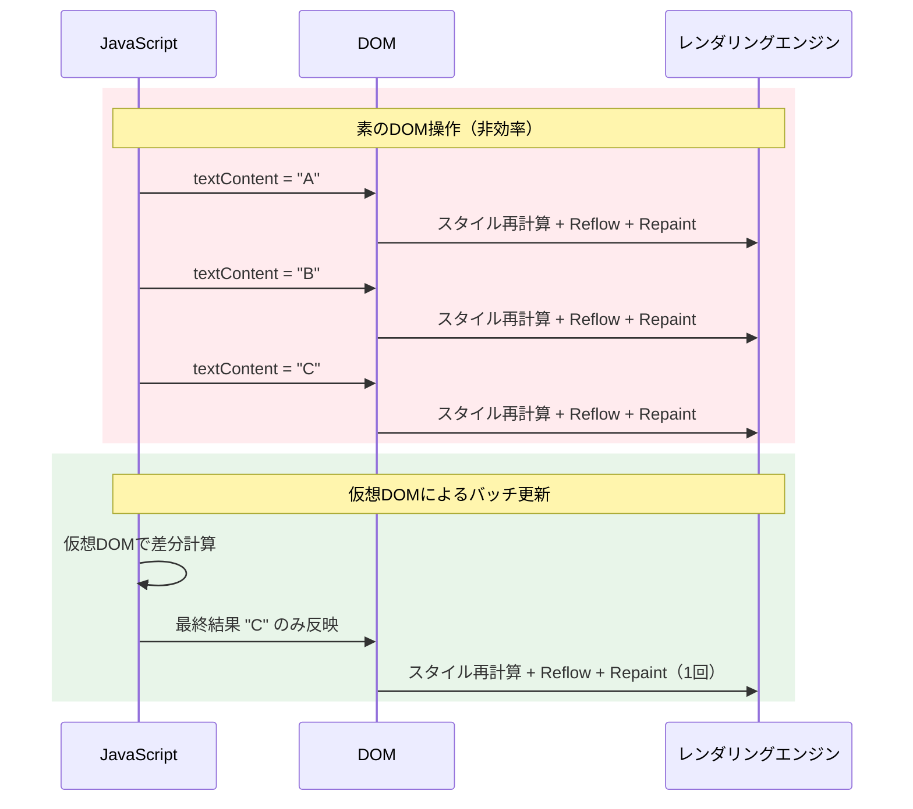
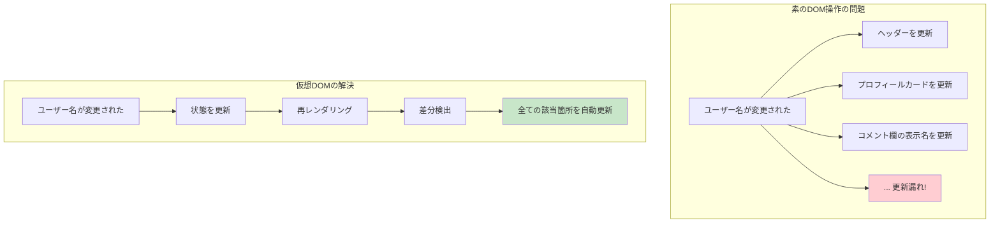
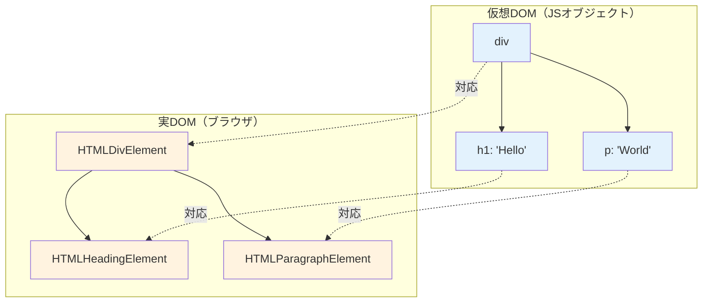
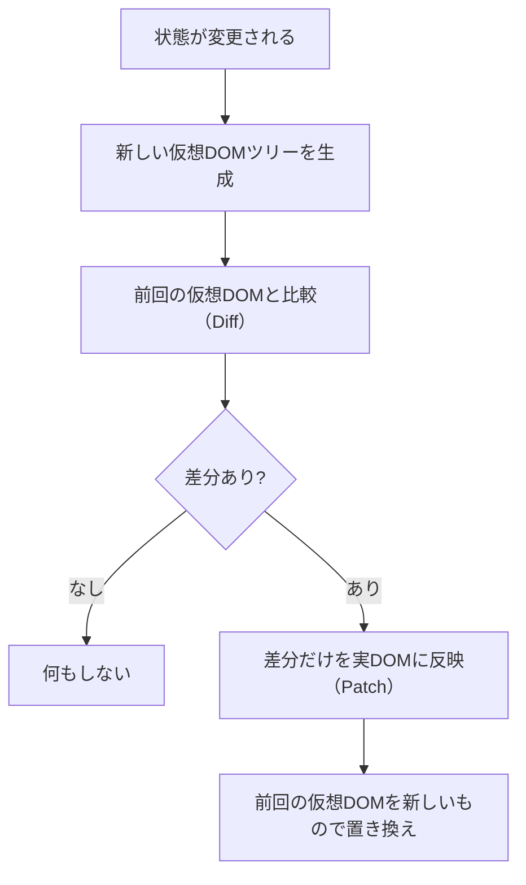
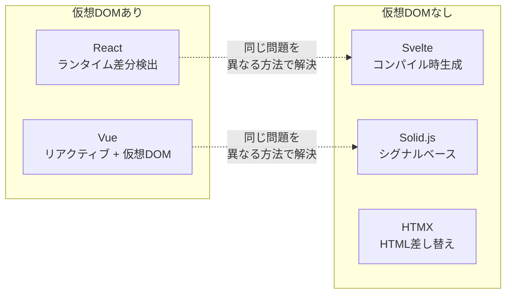

# DOMと仮想DOM

> **一言で言うと:** DOM（Document Object Model）はHTMLをプログラムから操作するためのツリー構造のAPIであり、仮想DOM（Virtual DOM）はDOMの直接操作が引き起こすパフォーマンス問題を「差分だけ更新する」ことで解決する仕組み。**速さのためではなく宣言的UIモデルを実用的にするため**にある。

## 3分で全体像

- **何を解決する技術か:** 「状態が変わったらDOMをどう更新するか」を手動管理する苦痛を排除し、**「UIはどうあるべきか」を宣言的に書ける**ようにする。素のDOM操作で頻発する「更新漏れ」「状態とUIの不整合」「複雑になるほど壊れるコード」を構造的に防ぐ
- **代表的な使用シーン:** SPA（React・Vue・Preact）、宣言的UIライブラリの基盤、複雑なフォームやリアルタイムダッシュボード、共同編集UI、コンポーネントライブラリ
- **これだけは覚える3つ:**
    1. **仮想DOMは速いから使うのではない** — 最適に書かれた素のDOM操作のほうが速い。仮想DOMの価値は「**宣言的に書ける**」こと。Svelte / Solid のような「仮想DOMなし宣言的UI」も成立するため、仮想DOM自体は手段の1つ
    2. **`key` は配列インデックスではなく安定した ID** — `key={index}` だと先頭挿入で全要素再マウントされる。`key={item.id}` のように **データ固有の安定キー**を使う
    3. **不要な再レンダリングはコストになる** — 仮想DOMの生成と差分計算自体にコストがあるため、巨大なリストや高頻度更新では `React.memo` / `useMemo` / コンポーネント分割で抑える。ただし**計測してから**メモ化する（DevTools Profiler で再レンダリング原因特定）
- **AIに任せやすいか:** **任せやすい** — React/Vue の宣言的UI記述・カスタムHook の抽出・Reconciliation を意識した key 設計は AI が高品質に書ける。ただし「**`key={index}` を生成する**」「**`React.memo` を全コンポーネントに適用**」「**`dangerouslySetInnerHTML` をサニタイズなしで使う**」など典型的な AI のクセがあり、`/review-ai-code` で必ず検出する
- **詰まったらここを読む:** [[HTML-CSS-JS]] / [[コンポーネント設計]] / [[状態管理]] / [[Reactの設計思想とフック]]

## なぜ必要か

ブラウザは[[HTML-CSS-JS|HTML]]を受け取ると、[[DOMツリーとノード|DOMツリー]]を構築する。このDOMがなければ、JavaScriptから文書の内容を読み取ることも変更することもできない。しかしDOMの直接操作には深刻な問題がある:

- **DOM操作のたびにブラウザが再計算を行う** — 1つの要素を変更しただけで、レイアウト（Reflow）とペイント（Repaint）が走る。100個の要素を1つずつ更新すれば、最悪100回のレイアウト再計算が発生する
- **状態とUIの同期が手動管理** — 「データが変わったらどのDOM要素を更新するか」をプログラマが逐一管理する必要がある。アプリが複雑になるほど、この同期は破綻する
- **コードがDOMの構造に強く依存する** — `document.getElementById('user-list').children[2].firstChild` のようなコードは、HTML構造が少し変わるだけで壊れる

仮想DOMは「UIの状態を宣言的に記述し、差分だけを効率的にDOMに反映する」ことで、これらの問題を一挙に解決した。

## どの問題を解決するか

### 問題1: DOM操作のパフォーマンスコスト

DOM操作が「遅い」と言われる本質は、DOM自体の読み書きではなく、**操作のたびにブラウザのレンダリングパイプラインが走る**ことにある。


```mermaid
sequenceDiagram
    participant JS as JavaScript
    participant DOM as DOM
    participant Render as レンダリングエンジン

    rect rgb(255, 235, 238)
        Note over JS, Render: 素のDOM操作（非効率）
        JS->>DOM: textContent = "A"
        DOM->>Render: スタイル再計算 + Reflow + Repaint
        JS->>DOM: textContent = "B"
        DOM->>Render: スタイル再計算 + Reflow + Repaint
        JS->>DOM: textContent = "C"
        DOM->>Render: スタイル再計算 + Reflow + Repaint
    end

    rect rgb(232, 245, 233)
        Note over JS, Render: 仮想DOMによるバッチ更新
        JS->>JS: 仮想DOMで差分計算
        JS->>DOM: 最終結果 "C" のみ反映
        DOM->>Render: スタイル再計算 + Reflow + Repaint（1回）
    end
```

実際にはブラウザもバッチ処理で最適化するが、レイアウト情報の読み取り（`offsetHeight`, `getBoundingClientRect()` 等）が間に入ると強制的にReflowが発生する（**Forced Reflow / Layout Thrashing**）。

### 問題2: 命令的UI vs 宣言的UI

素のDOM操作は**命令的（Imperative）**— 「何をどう変えるか」を逐一指示する:

```javascript
// 命令的: TODOリストにアイテムを追加
const li = document.createElement('li');
li.textContent = '新しいタスク';
li.className = 'todo-item';
const checkbox = document.createElement('input');
checkbox.type = 'checkbox';
checkbox.addEventListener('change', () => {
  li.classList.toggle('completed');
});
li.prepend(checkbox);
document.getElementById('todo-list').appendChild(li);
```

仮想DOMを使うフレームワークは**宣言的（Declarative）**— 「UIがどうあるべきか」を記述し、差分の反映はフレームワークに任せる:

```jsx
// 宣言的（React）: 状態に基づいてUIを記述
function TodoList({ items }) {
  return (
    <ul>
      {items.map(item => (
        <li key={item.id} className={item.done ? 'completed' : ''}>
          <input
            type="checkbox"
            checked={item.done}
            onChange={() => toggleItem(item.id)}
          />
          {item.text}
        </li>
      ))}
    </ul>
  );
}
```

宣言的UIでは「アイテムが追加された/削除された/変更された」時のDOM操作を**プログラマが書く必要がない**。状態（`items`）を変更すれば、仮想DOMの差分検出（Reconciliation）が最小限のDOM操作を自動的に行う。

### 問題3: 状態とUIの同期の破綻

アプリケーションが複雑になると、1つのデータ変更が複数のUI要素に影響する。素のDOM操作では更新漏れやUIの不整合が頻発する:


```mermaid
graph TD
    subgraph "素のDOM操作の問題"
        D1["ユーザー名が変更された"] --> U1["ヘッダーを更新"]
        D1 --> U2["プロフィールカードを更新"]
        D1 --> U3["コメント欄の表示名を更新"]
        D1 --> U4["... 更新漏れ!"]
        style U4 fill:#ffcdd2
    end

    subgraph "仮想DOMの解決"
        D2["ユーザー名が変更された"] --> V["状態を更新"]
        V --> R["再レンダリング"]
        R --> DIFF["差分検出"]
        DIFF --> DOM2["全ての該当箇所を自動更新"]
        style DOM2 fill:#c8e6c9
    end
```

## 仮想DOMの仕組み — Reconciliation

仮想DOMは軽量なJavaScriptオブジェクトで、実DOMのツリー構造を模倣する:


```mermaid
graph TD
    subgraph "仮想DOM（JSオブジェクト）"
        VA["div"]
        VB["h1: 'Hello'"]
        VC["p: 'World'"]
        VA --> VB
        VA --> VC
    end

    subgraph "実DOM（ブラウザ）"
        RA["HTMLDivElement"]
        RB["HTMLHeadingElement"]
        RC["HTMLParagraphElement"]
        RA --> RB
        RA --> RC
    end

    VA -.->|"対応"| RA
    VB -.->|"対応"| RB
    VC -.->|"対応"| RC

    style VA fill:#e3f2fd
    style VB fill:#e3f2fd
    style VC fill:#e3f2fd
    style RA fill:#fff3e0
    style RB fill:#fff3e0
    style RC fill:#fff3e0
```

### Reconciliationのアルゴリズム

状態が変更されたとき、仮想DOMは以下の手順でUIを更新する:


```mermaid
flowchart TD
    A["状態が変更される"] --> B["新しい仮想DOMツリーを生成"]
    B --> C["前回の仮想DOMと比較（Diff）"]
    C --> D{"差分あり?"}
    D -->|"なし"| E["何もしない"]
    D -->|"あり"| F["差分だけを実DOMに反映（Patch）"]
    F --> G["前回の仮想DOMを新しいもので置き換え"]
```

Reactの差分検出アルゴリズムは、ツリーの完全な比較（旧 Stack Reconciler 時代の理論計算量 O(n³)）ではなく、2つのヒューリスティクスで線形時間に抑えている:

1. **異なる型の要素は完全に作り直す** — `<div>` が `<span>` に変わったら、子要素ごと破棄して新しく作る
2. **`key` 属性でリスト要素を識別する** — リストの並び替え・挿入・削除を効率的に検出する

> **歴史的経緯 — Stack から Fiber へ:** React 16（2017年）で内部の Reconciler が「Stack Reconciler」から「Fiber アーキテクチャ」に書き換えられた。Stack Reconciler は再帰的にコンポーネントツリーを処理するため、巨大なツリーの差分計算がメインスレッドを長時間ブロックしていた。Fiber は仮想DOMの差分計算を**中断・再開・破棄できる単位（fiber ノード）**に分解し、優先度付きスケジューラで処理する。これにより React 18 以降の Concurrent Features（`startTransition` / `useTransition` / `useDeferredValue` / Suspense）が成立し、「重い更新を後回しにしてユーザー入力を優先する」UX が可能になった。仮想DOM の本質的な強みは Fiber を機にレンダリング戦略の自由度に拡張された（→ [[Reactの設計思想とフック]]）

### keyの重要性

`key` はリスト内の要素を**一意に識別する**ためのもの。`key` がないか、配列インデックスを `key` にすると、並び替え時に全要素が再レンダリングされる:

```jsx
// ❌ インデックスをkeyに使う
{items.map((item, index) => (
  <li key={index}>{item.name}</li>
))}
// 先頭にアイテムを追加すると、全てのindexがずれて全要素が再マウントされる

// ✅ 安定した一意IDをkeyに使う
{items.map(item => (
  <li key={item.id}>{item.name}</li>
))}
// 先頭にアイテムを追加しても、既存要素はそのまま、新しい要素だけ追加
```

## 他の仕組みとどう関係するか

- **下位レイヤーとの関係:**
  - [[HTML-CSS-JS]] — HTMLがパースされてDOMが生成される。DOMはHTMLの「プログラマブルな表現」。CSSOMと合成されてレンダーツリーとなる
  - [[HTTP-HTTPS|HTTP/HTTPS]]（Layer 2）— サーバーから取得したHTMLが最初のDOMを構築する。[[SSR-SSG-CSR|SSR（Server-Side Rendering）]]ではサーバー側でDOMを構築してHTMLとして送信する
- **同レイヤーとの関係:**
  - [[状態管理]] — 仮想DOMが解決するのは「状態→UIの反映」であり、状態管理は「状態をどこに持ち、どう変更するか」を扱う。仮想DOMの登場が宣言的な[[状態管理]]ライブラリの基盤となった
  - [[コンポーネント設計]] — 仮想DOMのレンダリング単位がコンポーネント。コンポーネントの粒度が再レンダリングの範囲に直結する
  - [[アクセシビリティ]] — 仮想DOMの差分更新は、スクリーンリーダーのフォーカス管理に影響する。不用意なDOM再構築でフォーカスが失われる問題がある
- **上位レイヤーとの関係:**
  - [[Layer5-パフォーマンス/_index|パフォーマンス]]（Layer 5）— Core Web VitalsのINP（Interaction to Next Paint）は、仮想DOMの更新効率に直結する。不要な再レンダリングはINPを悪化させる
  - [[Layer6-セキュリティ/_index|セキュリティ]]（Layer 6）— Reactは子要素の文字列を `document.createTextNode` でテキストノードとして挿入するため、HTMLとして解釈されずデフォルトで[[SQLインジェクションとXSS|XSS]]を防ぐ。`dangerouslySetInnerHTML` はこの保護を無効にする

## 誤解されやすいポイント

### 1. 「仮想DOMは素のDOMより速い」

**これは誤り**。仮想DOMは「差分計算 + 実DOM操作」の2ステップを踏むため、最適に書かれた素のDOM操作より原理的に速くなることはない。仮想DOMが解決するのは速度ではなく、**宣言的UIプログラミングモデルを「十分に速い」パフォーマンスで実現すること**。

```
素のDOM操作（最適化済み）:
  → 実DOM操作のみ → 最速

仮想DOM:
  → 仮想DOM生成 → 差分計算 → 実DOM操作
  → オーバーヘッドあり、だが「十分に速い」
  → 開発者の生産性と保守性を劇的に向上させる
```

SvelteやSolid.jsが「仮想DOMなし」で高速に動作することが、この点を証明している。

### 2. 「Reactが仮想DOMを発明した」

仮想DOMの概念自体はReact以前から存在した。Reactの貢献は仮想DOMの発明ではなく、**宣言的UIコンポーネントモデル**と**効率的なReconciliationアルゴリズム**を組み合わせて実用的なフレームワークにしたこと。React の設計思想（`UI = f(state)`）とフック導入の経緯については[[Reactの設計思想とフック]]で詳しく扱う。

### 3. 「仮想DOMがあれば再レンダリングを気にしなくていい」

仮想DOMは差分検出を自動化するが、**仮想DOMの生成と差分計算自体にコストがある**。不要な再レンダリングが頻発すると、UIがもたつく原因になる:

```jsx
// ❌ 親コンポーネントの再レンダリングで子も全て再レンダリング
function Parent() {
  const [count, setCount] = useState(0);
  return (
    <div>
      <button onClick={() => setCount(c => c + 1)}>{count}</button>
      <ExpensiveList items={largeArray} />  {/* countが変わるたびに再レンダリング */}
    </div>
  );
}

// ✅ React.memoで不要な再レンダリングを防ぐ
const ExpensiveList = React.memo(function ExpensiveList({ items }) {
  return items.map(item => <ListItem key={item.id} item={item} />);
});
// itemsが変わらなければ再レンダリングをスキップ
```

### 4. 「DOMの直接操作は常にアンチパターン」

仮想DOMを使うフレームワークでも、DOMの直接操作が必要な場面がある:
- **フォーカスの管理** — `inputRef.current.focus()`
- **スクロール位置の操作** — `element.scrollIntoView()`
- **Canvas / WebGL** — 仮想DOMの管理対象外
- **サードパーティライブラリとの統合** — jQueryプラグイン、D3.js等

Reactでは `useRef` + `useEffect` でDOMの直接操作を行う。重要なのは「仮想DOMの管理外の操作」であることを意識し、フレームワークの状態管理と競合させないこと。

## 設計のベストプラクティス

### 仮想DOMのパフォーマンス最適化

1. **リストには安定した `key` を使う** — `index` ではなく、データ固有のID
2. **コンポーネントの粒度を適切にする** — 巨大な単一コンポーネントは再レンダリング範囲が広くなる
3. **状態を使用するコンポーネントの近くに置く** — 状態のリフトアップは必要最小限に
4. **メモ化は計測してから適用** — `React.memo` や `useMemo` を闇雲に使わない。まず DevTools で再レンダリング原因を特定する

### 仮想DOMを使わないアプローチ

仮想DOMは唯一の解決策ではない。近年は**仮想DOMなし**で宣言的UIを実現するフレームワークが台頭している:

| フレームワーク | アプローチ | 特徴 |
|--------------|----------|------|
| **React** | 仮想DOM + Reconciliation | 最も普及。エコシステムが圧倒的に豊富 |
| **Vue** | 仮想DOM + リアクティブ依存追跡 | テンプレートベースで仮想DOMの生成を最適化 |
| **Svelte** | コンパイル時に更新コードを生成 | ランタイムの仮想DOMが不要。バンドルサイズが小さい |
| **Solid.js** | Fine-grained Reactivity | シグナルベース。仮想DOMなしでReact的な書き心地 |
| **HTMX** | サーバーからHTMLを受け取って差し替え | JSをほぼ書かない。サーバー主導のUI更新 |


```mermaid
graph LR
    subgraph "仮想DOMあり"
        R["React<br/>ランタイム差分検出"]
        V["Vue<br/>リアクティブ + 仮想DOM"]
    end

    subgraph "仮想DOMなし"
        S["Svelte<br/>コンパイル時生成"]
        SO["Solid.js<br/>シグナルベース"]
        H["HTMX<br/>HTML差し替え"]
    end

    R -.->|"同じ問題を<br/>異なる方法で解決"| S
    V -.->|"同じ問題を<br/>異なる方法で解決"| SO
```

## AIエージェントとの協働

> このトピックでAIコーディングエージェント（Claude Code, Copilot, Cursor 等）と協働するための観点。
> 宣言的UI・カスタムHook・Reconciliation を意識した key 設計は AI に任せやすい一方、**「`key={index}` を生成」「`React.memo` を全部適用」「`dangerouslySetInnerHTML` をサニタイズなしで使う」「`useEffect` 内で巨大なDOM操作」** が頻出。レビューも `/review-ai-code` で横断アンチパターン照合に任せられる。

### AIに任せられる部分 / 人間が判断すべき部分

| タスク種類 | 任せ方（実装/レビュー） | 人間の関与 |
|---|---|---|
| 宣言的UIの記述（JSX / template） | AI 実装、`/review-ai-code` でレビュー | UX 設計・状態とコンポーネント境界の対応は人間判断 |
| `key` 属性の設計 | AI に任せる | データに安定 ID があるかは要件で決める。`Date.now()` や `Math.random()` を AI が出してきたら必ず修正 |
| `React.memo` / `useMemo` / `useCallback` の適用 | AI に提案させる | **必ず計測してから適用**。AI は予防的にメモ化を提案しがちだが、シンプルなコンポーネントでは逆効果 |
| カスタムHook によるロジック抽出 | AI に任せる | Hook の責務分割と命名はチーム規約 |
| `useRef` + `useEffect` での DOM 直接操作 | AI 実装 | 仮想DOM の管理範囲との競合は人間がレビュー（フォーカス管理・スクロール制御など） |
| `dangerouslySetInnerHTML` の必要性判断 | **AI に任せない** | 信頼境界の判断と DOMPurify などサニタイザの選定は人間 |
| Server Components / Client Components の境界 | AI に提案させる | データフロー・認証・ハイドレーションコストの判断は人間 |

### AI生成コードのレビュー観点（このトピック固有）

AI生成のコンポーネントコードを受け取ったとき、最低限ここを見る。

1. **`key` が安定 ID になっているか / インデックスを `key` にしていないか** — `items.map((item, index) => <li key={index}>...)` は AI が頻繁に生成する誤りパターン。先頭への挿入・並べ替え・削除で全要素が再マウントされ、フォーカス・スクロール位置・入力中の値が失われる。データ固有の `item.id` を使うべき。`Date.now()` `Math.random()` を `key` にしていたら毎レンダリング全要素が再マウントされて壊滅
2. **メモ化の予防的乱用と参照不安定** — `React.memo` を全コンポーネントに適用、`useMemo` / `useCallback` を予防的に大量配置。メモ化自体に props の浅い比較コストがあり、単純コンポーネントでは逆効果。さらに親が `<Child onClick={() => ...}>` のようにインライン関数を渡すと毎回新参照になりメモ化が無効化される。**計測してから**メモ化する原則になっているか
3. **`dangerouslySetInnerHTML` のサニタイズ漏れと `useEffect` 内 DOM 操作の競合** — ユーザー入力やAPIレスポンスを `dangerouslySetInnerHTML` でそのまま挿入していないか（XSS 直結）。DOMPurify 等でサニタイズしているか。`useEffect` 内で React の管理範囲の DOM を直接操作（`.appendChild` / `.innerHTML =`）していないか — フレームワークと競合してハイドレーション崩壊や DOM不整合を引き起こす

### 効くプロンプトの型

このトピックに関する実装をAIに依頼するとき、コンテキストとして渡すべき情報・制約・成功基準のテンプレ。

```
# 前提（プロジェクトの状況・既存のコード規約）
- フレームワーク: React 19 / Vue 3 / Svelte 5 / Solid 1.x など
- 状態管理: useState / Zustand / TanStack Query
- TypeScript: 使う / 使わない
- パフォーマンス目標: INP < 200ms、リスト表示は仮想スクロール検討要
- データに安定 ID: あり (item.id) / なし (要設計)

# やってほしいこと
- 「{要件}」のコンポーネントを実装
- 状態の置き場所と key 設計を含めて提示

# 守ってほしい制約（このトピック固有のもの）
- key にはデータ固有の安定 ID を使う (index / Date.now() / Math.random() は禁止)
- React.memo / useMemo / useCallback は計測前提で必要なときだけ適用
- ユーザー入力やAPIレスポンスを dangerouslySetInnerHTML に直接渡さない (DOMPurify でサニタイズ)
- useEffect 内で React の管理範囲の DOM を直接操作しない (useRef 経由で限定的に)
- インラインオブジェクト・関数を props に渡すときは必要なら useMemo / useCallback で参照を安定化
- 状態の更新はイミュータブルに (state.items.push(...) ではなく [...state.items, ...])
- リストは仮想スクロール (TanStack Virtual / react-window) の必要性を検討

# 完了の判断基準
- key 警告が出ない
- 並べ替え・追加・削除でフォーカス・入力中の値が失われない
- DevTools Profiler で不要な再レンダリングが発生していない
- INP / LCP が目標値内
```

### AI実装のアンチパターン

LLM生成コードで頻出する過剰設計・誤用パターン。レビュー時の照合表として使う。

| アンチパターン | なぜ問題か | レビュー観点 / 対策 |
|---|---|---|
| `key={index}` でリスト要素を識別 | 先頭挿入・並べ替えで全要素が再マウント、フォーカス・入力中の値が失われる | データ固有の `item.id` を使う |
| `key={Math.random()}` `key={Date.now()}` | 毎レンダリングで新 key となり、全要素が破棄→再作成 | 安定した ID を使う、強制再マウントが必要なら状態キー (`<Comp key={mode}>`) |
| 全コンポーネントに `React.memo` 適用 | props の浅い比較コストが加算され、単純コンポーネントでは逆効果 | DevTools Profiler で計測、ボトルネックのみメモ化 |
| `useMemo` / `useCallback` の予防的乱用 | 依存配列の管理コストが増え、メモ化のオーバーヘッドが利益を超える | 高コスト計算 / 子のメモ化が前提のときのみ適用 |
| インラインオブジェクト・関数を props に渡しメモ化を破壊 | 毎レンダリングで新参照が生まれ、`React.memo` の child は再レンダリング | 親で `useMemo` / `useCallback` で参照を安定化 |
| `useEffect` 内で大量の DOM 直接操作 | React の管理外の操作がフレームワークと競合、ハイドレーション崩壊 | `useRef` 経由で最小限の DOM 操作に留める |
| `dangerouslySetInnerHTML` にサニタイズなしの入力 | XSS の直接的な原因 | DOMPurify でサニタイズ、または仮想DOMの自動エスケープに任せる |
| 状態をミュータブルに更新 (`state.items.push`) | 参照が変わらず変更が検出されない、UI が更新されない | `[...state.items, newItem]` のようにイミュータブルに、または Immer / Valtio |
| 巨大リストを `.map()` で全件レンダリング | 数千行で初期レンダリングが秒単位、INP 悪化 | TanStack Virtual / react-window で仮想スクロール |
| `useEffect` で状態を派生 (`useEffect(() => setX(derivedFromY), [y])`) | 二重レンダリング、無限ループの温床 | 派生値はレンダリング中に計算するか `useMemo` |
| Server Component に状態フックを使う | RSC は状態を持てない（React 19 / Next.js App Router） | `'use client'` ディレクティブで Client Component に分離 |

→ レイヤー横断のアンチパターン索引: [[_anti-patterns/_index|AIアンチパターン索引]] / [[_anti-patterns/レイヤー別/Layer4-Frontend|Layer 4 Frontend アンチパターン集]]

## 具体例

### 素のDOM操作 vs 仮想DOM — TODOリストの比較

#### 素のDOM操作（Vanilla JS）

```javascript
// 状態
let todos = [];
let nextId = 0;

function addTodo(text) {
  const todo = { id: nextId++, text, done: false };
  todos.push(todo);
  renderTodo(todo);  // 追加された要素だけDOMに反映
}

function toggleTodo(id) {
  const todo = todos.find(t => t.id === id);
  todo.done = !todo.done;
  // 対象の要素を「見つけて」「変更する」
  const li = document.querySelector(`[data-id="${id}"]`);
  li.classList.toggle('completed', todo.done);
  li.querySelector('input').checked = todo.done;
  // 件数表示も更新する必要がある
  updateCount();
}

function renderTodo(todo) {
  const li = document.createElement('li');
  li.dataset.id = todo.id;
  li.innerHTML = `
    <input type="checkbox" ${todo.done ? 'checked' : ''}>
    <span>${escapeHtml(todo.text)}</span>
    <button class="delete">×</button>
  `;
  li.querySelector('input').addEventListener('change', () => toggleTodo(todo.id));
  li.querySelector('.delete').addEventListener('click', () => deleteTodo(todo.id));
  document.getElementById('todo-list').appendChild(li);
  updateCount();
}

function deleteTodo(id) {
  todos = todos.filter(t => t.id !== id);
  document.querySelector(`[data-id="${id}"]`).remove();
  updateCount();
}

function updateCount() {
  const remaining = todos.filter(t => !t.done).length;
  document.getElementById('count').textContent = `残り ${remaining} 件`;
}

function escapeHtml(str) {
  const div = document.createElement('div');
  div.textContent = str;
  return div.innerHTML;
}
```

#### 仮想DOM（React）

```jsx
import { useState } from 'react';

function TodoApp() {
  const [todos, setTodos] = useState([]);
  const [input, setInput] = useState('');

  const addTodo = () => {
    if (!input.trim()) return;
    setTodos([...todos, { id: Date.now(), text: input, done: false }]);
    setInput('');
  };

  const toggleTodo = (id) => {
    setTodos(todos.map(t => t.id === id ? { ...t, done: !t.done } : t));
  };

  const deleteTodo = (id) => {
    setTodos(todos.filter(t => t.id !== id));
  };

  const remaining = todos.filter(t => !t.done).length;

  // UIの「あるべき姿」を宣言するだけ
  // DOM操作はReactが自動的に行う
  return (
    <div>
      <input value={input} onChange={e => setInput(e.target.value)} />
      <button onClick={addTodo}>追加</button>
      <ul>
        {todos.map(todo => (
          <li key={todo.id} className={todo.done ? 'completed' : ''}>
            <input
              type="checkbox"
              checked={todo.done}
              onChange={() => toggleTodo(todo.id)}
            />
            <span>{todo.text}</span>
            <button onClick={() => deleteTodo(todo.id)}>×</button>
          </li>
        ))}
      </ul>
      <p>残り {remaining} 件</p>
    </div>
  );
}
```

**違いのポイント:**

| 観点 | 素のDOM操作 | 仮想DOM（React） |
|------|-----------|-----------------|
| UI更新の記述 | 「何をどう変えるか」を逐一指示 | 「UIがどうあるべきか」を宣言 |
| 状態とUIの同期 | 手動（`updateCount()` を呼び忘れると不整合） | 自動（状態が変われば全体が再評価される） |
| XSS対策 | 手動で `escapeHtml()` | デフォルトでテキストはエスケープされる |
| コード量 | 操作が増えるほど指数的に増加 | 状態の変換ロジックのみ |

### DOMの直接操作が必要な場面（React useRef）

```jsx
import { useRef, useEffect } from 'react';

function AutoFocusInput() {
  const inputRef = useRef(null);

  useEffect(() => {
    // マウント時にフォーカスを当てる — DOMの直接操作が必要
    inputRef.current.focus();
  }, []);

  return <input ref={inputRef} placeholder="自動フォーカス" />;
}

function ScrollToBottom({ messages }) {
  const endRef = useRef(null);

  useEffect(() => {
    // 新しいメッセージが追加されたら末尾にスクロール
    endRef.current.scrollIntoView({ behavior: 'smooth' });
  }, [messages]);

  return (
    <div className="chat">
      {messages.map(msg => <p key={msg.id}>{msg.text}</p>)}
      <div ref={endRef} />
    </div>
  );
}
```

## 参考リソース

- [React公式ドキュメント — Preserving and Resetting State](https://react.dev/learn/preserving-and-resetting-state) — ReconciliationとStateの関係を解説
- [React公式ドキュメント — Reconciliation](https://react.dev/learn/render-and-commit) — レンダリングとコミットの流れ（旧ドキュメントの [Reconciliation](https://legacy.reactjs.org/docs/reconciliation.html) も差分検出アルゴリズムの詳細として参考になる）
- [Virtual DOM is pure overhead (Svelte blog)](https://svelte.dev/blog/virtual-dom-is-pure-overhead) — Rich Harris による仮想DOMの限界の分析
- 書籍:『りあクト！TypeScriptで始めるつらくないReact開発』— 日本語でのReact内部構造の解説

## 理解度セルフチェック

> 答えられなければ本文に戻る。答えはこのファイル内に必ずある。

1. **「仮想DOMは素のDOM操作より速い」がなぜ誤りか、30秒で説明せよ。** では仮想DOMを使う本当の価値は何か。
2. **`key` 属性に配列インデックスを使うとなぜ問題が起きるのか?** 具体的にどんな不具合が発生するか挙げ、正しい `key` の選び方を述べよ。
3. **AI生成コードレビュー設問:** AI が以下の React コンポーネントを生成した。本文の観点で **問題点を最低3つ** 指摘せよ。

```jsx
import React, { useState, useEffect, useMemo, useCallback } from 'react';

function CommentList({ articleId }) {
  const [comments, setComments] = useState([]);
  const [filter, setFilter] = useState('');

  // フィルタ済みコメント
  const [filteredComments, setFilteredComments] = useState([]);
  useEffect(() => {
    setFilteredComments(comments.filter(c => c.text.includes(filter)));
  }, [comments, filter]);

  useEffect(() => {
    fetch(`/api/articles/${articleId}/comments`)
      .then(r => r.json())
      .then(data => setComments(data));
  }, [articleId]);

  // パフォーマンスのためメモ化
  const handleDelete = useCallback((id) => {
    setComments(prev => prev.filter(c => c.id !== id));
  }, []);

  return (
    <ul>
      {filteredComments.map((comment, index) => (
        <li key={index} style={{ padding: '8px' }}>
          <div dangerouslySetInnerHTML={{ __html: comment.html }} />
          <Avatar user={comment.user} onClick={() => console.log(comment.user)} />
          <button onClick={() => handleDelete(comment.id)}>削除</button>
        </li>
      ))}
    </ul>
  );
}

const Avatar = React.memo(function Avatar({ user, onClick }) {
  return ;
});
```

> [!note]- 解答の指針
>
> > [!info] 用語ミニ辞典
> > - **DOM (Document Object Model):** HTMLをツリー構造のオブジェクトとして表現するブラウザAPI。`document.querySelector` などで操作可能
> > - **仮想DOM (Virtual DOM):** 実DOMを模倣する軽量な JavaScript オブジェクトのツリー。状態が変わると新しい仮想DOMを生成し、前回との差分（diff）だけを実DOMに反映する
> > - **Reconciliation:** React の差分検出アルゴリズム。新旧の仮想DOMを比較して変更箇所だけを実DOMにパッチする処理。React は型と key の2つのヒューリスティクスで O(n) に抑える
> > - **Reflow / Layout / レイアウト再計算:** DOM の幾何学的情報（位置・サイズ）を再計算する処理。`offsetHeight` `getBoundingClientRect()` の読み取りや、`width` `top` 等の変更で発生。重い処理
> > - **Repaint / ペイント:** ピクセルを画面に描画する処理。Reflow より軽量だが、無視できないコスト
> > - **Forced Reflow / Layout Thrashing:** スタイル変更とレイアウト読み取りを交互に行い、Reflow を強制発生させてしまう問題。1ループで100回 Reflow が起きる典型的アンチパターン
> > - **`key` 属性:** リスト内の要素を一意に識別する属性。Reconciliation で「どの要素が追加・削除・移動されたか」を判定する基準。インデックスではなくデータ固有の安定 ID を使うべき
> > - **`React.memo`:** 親が再レンダリングしても、props が浅い比較で同じなら子の再レンダリングをスキップする HOC。比較コストがあるため計測してから使う
> > - **`useMemo` / `useCallback`:** 値・関数の参照を保持する Hook。依存配列が変わらない限り同じ参照を返す。子の `React.memo` を有効化するために使う場面が主
> > - **`dangerouslySetInnerHTML`:** React の自動 HTML エスケープを無効にし、文字列を生 HTML として挿入する API。XSS の直接の原因になりうるため、DOMPurify などでサニタイズしてから使う
> > - **イミュータブル更新:** 元のオブジェクトを変更せず、新しいオブジェクトを作って差し替える更新パターン。React は参照比較で変更検出するため、`state.items.push(...)` は検出されず再レンダリングされない
> > - **派生状態 (Derived State):** 既存の state から計算で導出できる値。`useState` で別途持つと同期漏れの温床になる。レンダリング中に計算するか `useMemo` で求めるべき
> > - **Server Components (RSC):** React 19 / Next.js App Router で安定化した「サーバー側で完結するコンポーネント」。状態フックは使えず、`'use client'` で Client Component に明示的に分離する
> > - **Fiber (Fiber アーキテクチャ):** React 16（2017年）で導入された Reconciler の内部構造。仮想DOM の差分計算を「中断・再開・破棄できる単位（fiber ノード）」に分解し、優先度付きスケジューラで処理する。これにより重い更新を後回しにしてユーザー入力を優先する制御が可能になった
> > - **Concurrent Features:** React 18 以降で利用可能になった同時実行制御 API 群。`startTransition`（重い更新を低優先に降格）、`useTransition`（遷移中フラグを取得）、`useDeferredValue`（重い計算を遅らせる）、`Suspense`（非同期境界宣言）を含む。Fiber を前提に成立し、「重い更新でユーザー入力が詰まる」問題を緩和する
>
> 1. 仮想DOMが「速い」理由は、最適化に必要な作業（差分計算 + 実DOM操作）が**素のDOM直接操作の2ステップ目だけよりも常に多い**から。最適に書かれた素のDOM操作（必要箇所だけを最小回数で更新する）が原理的に最速で、仮想DOMがそれを上回ることはない。**仮想DOMの本当の価値は「宣言的UIプログラミングモデルを“十分に速い”パフォーマンスで実現すること」**。具体的には: (a) 「UIがどうあるべきか」を状態の関数として記述できる（`UI = f(state)`）、(b) 状態とUIの同期を手動管理する必要がなくなり「更新漏れ」がなくなる、(c) チーム開発で UI ロジックの追跡が容易になる、(d) コードの保守性が劇的に上がる。Svelte や Solid.js が「仮想DOMなし」で同じ宣言的体験を実現していることが、**仮想DOM自体は手段の1つでしかない**ことの証拠
> 2. `key` は React が「並び替え・追加・削除でどの要素が同じものか」を判定する識別子。配列インデックスを `key` にすると、(a) **先頭にアイテムを追加すると全 index がずれる**ため React は「全要素が変わった」と判定し、全 `<li>` を破棄して再作成する → フォーカス・スクロール位置・入力中の値・CSS アニメーションがすべてリセットされる、(b) **リストを並べ替えると順序が変わるが index は変わらない**ため、React は「内容だけ変わった」と判定し DOM を再利用するが、内部状態は古いまま残る → 不整合バグ、(c) **要素を削除すると後続の index が前にずれる**ため、削除した要素ではなく次の要素が消えたように見える、(d) **`React.memo` でメモ化しても無効化される**。正しい `key` は **データ固有の安定した一意 ID**（DB の `id`、UUID など）。`Math.random()` や `Date.now()` は毎レンダリングで変わるため最悪。配列インデックスが許されるのは「リストが追加・削除・並べ替えされない静的な場合のみ」
> 3. AI生成コードの問題点（最低限以下を指摘できれば本文を理解している）:
>     - **`key={index}` を使用** — 削除や並べ替えで全要素が再マウント、入力中のフォーム状態が失われる。`key={comment.id}` にすべき
>     - **`filteredComments` を `useState` + `useEffect` で派生** — `comments` と `filter` から計算可能な派生値を別 state に持つと、二重レンダリング・同期漏れの温床。`const filteredComments = comments.filter(c => c.text.includes(filter));` でレンダリング中に計算するか、重ければ `useMemo`
>     - **`dangerouslySetInnerHTML={{ __html: comment.html }}` をサニタイズなしで使用** — XSS の直接的な原因。コメントは外部入力なので攻撃者が `<script>` を仕込める。DOMPurify でサニタイズしてから渡すべき
>     - **インラインスタイル `style={{ padding: '8px' }}`** — 毎レンダリングで新オブジェクトが生成され、子の `React.memo` が無効化される。CSSクラスかメモ化したスタイルオブジェクトに
>     - **`Avatar` の `onClick` がインライン関数** — `onClick={() => console.log(comment.user)}` が毎レンダリングで新関数になり、`React.memo` でメモ化された Avatar が毎回再レンダリングされる。`useCallback` で参照を安定化するか、メモ化を諦める
>     - **`Avatar` を予防的に `React.memo` 化** — `` 1個のシンプルなコンポーネントで、props の浅い比較コストのほうが利益を上回る可能性。計測してから適用する
>     - **``** — `` はネイティブにフォーカス可能ではなく、キーボードユーザがクリック相当の操作をできない。`<button>` でラップするか `tabIndex` + `onKeyDown` を実装する（[[アクセシビリティ]] 観点でもアウト）
>     - **`` の `alt={user.name}`** — Avatar が装飾的なら `alt=""`、意味がある（クリックでプロフィール表示など）なら `alt="user.name のプロフィール"` のように動作を含めて記述するのが望ましい
>     - **エラーハンドリングと loading 状態がない** — `fetch` の失敗時に空配列のままで何も表示されない。loading / error / empty の3状態を明示的にハンドル

## 学習メモ

- 仮想DOMの価値は「速さ」ではなく「宣言的プログラミングモデルを実用的なパフォーマンスで実現すること」。この理解がないと、フレームワーク選定の議論で本質を見失う
- React 18以降のConcurrent Featuresは、仮想DOMの更新を「中断可能」にすることで、さらにユーザー体験を改善している（Suspense, Transition等）
- SvelteやSolid.jsの台頭は「仮想DOMなしでも宣言的UIは実現できる」ことを証明した。次のトレンドは「シグナルベースのリアクティビティ」
