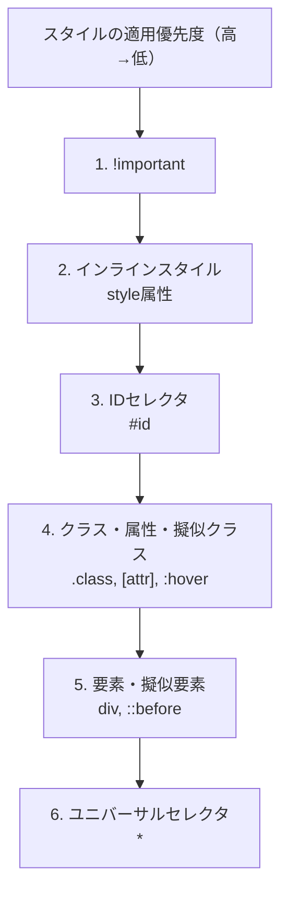
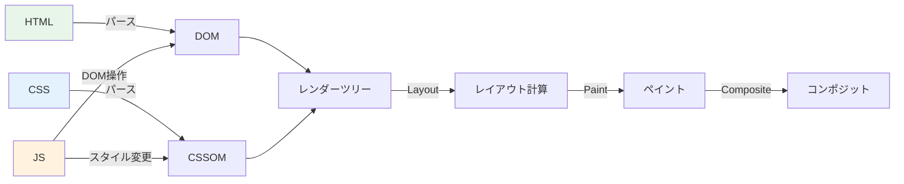
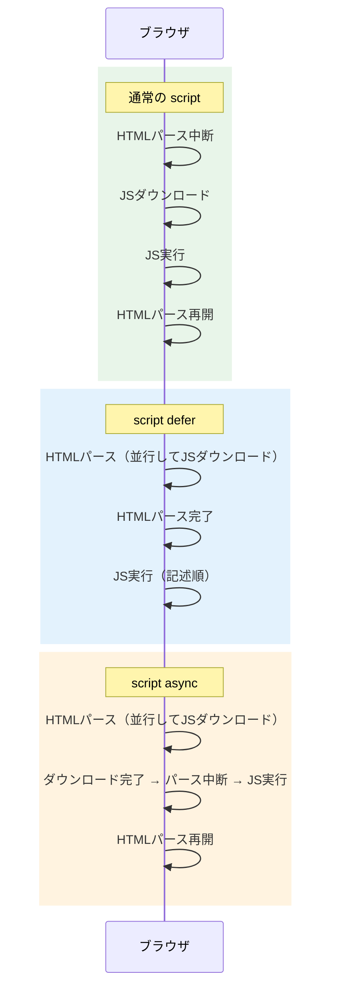

# HTML/CSS/JSの本質

> **一言で言うと:** HTMLは「文書の構造（セマンティクス）」、CSSは「見た目の宣言」、JSは「振る舞いの追加」。この3つの**責務分離**が全フロントエンド設計の基盤であり、ブラウザのレンダリングパイプラインを理解する出発点である。

## なぜ必要か

Webページは最終的にブラウザが描画する。ブラウザは3つの言語を**別々のエンジン**で処理する:

- **HTMLパーサー** → DOM（Document Object Model）ツリーを構築
- **CSSエンジン** → CSSOM（CSS Object Model）を構築し、DOMと合成してレンダーツリーを生成
- **JSエンジン（V8等）** → DOMやCSSOMをプログラム的に操作

もしこの3つが分離されていなかったら:

- **構造と見た目が混在** → コンテンツの変更にデザインの修正が必要になり、逆も然り。チームでの分業が困難になる
- **振る舞いが構造に埋め込まれる** → `onclick="..."` が各要素にハードコードされ、テスト不能・再利用不能なコードが生まれる
- **アクセシビリティが崩壊** → スクリーンリーダーや検索エンジンが「見出し」「ナビゲーション」「本文」を区別できない
- **パフォーマンスの最適化ができない** → ブラウザはHTML/CSS/JSを並列・段階的に処理するが、混在していると最適化の余地がない

## どの問題を解決するか

### HTML — 構造とセマンティクスの問題

| 課題 | HTMLによる解決 |
|------|--------------|
| 文書の論理構造が不明 | `<h1>`〜`<h6>`, `<p>`, `<ul>` 等で階層構造を表現 |
| 機械（検索エンジン・支援技術）が内容を理解できない | セマンティック要素（`<nav>`, `<article>`, `<main>`, `<aside>`）で意味を付与 |
| フォーム入力の型が不定 | `<input type="email">`, `<input type="date">` 等でブラウザネイティブのバリデーションとUIを提供 |
| ハイパーリンクによる文書間の接続 | `<a href>` でWebの根幹であるハイパーテキストを実現 |

HTMLの本質は**「文書に意味を与える[[マークアップ言語とHTML|マークアップ]]」**であり、見た目の制御ではない。`<div>` と `<span>` は意味を持たない汎用コンテナであり、これだけでページを構築することは構造の放棄を意味する。

### CSS — 見た目の宣言と分離の問題

| 課題 | CSSによる解決 |
|------|-------------|
| 構造と見た目が混在する | 外部スタイルシートにより見た目を完全に分離 |
| 同じスタイルを何度も書く | セレクタによる一括指定、カスケード（Cascade）による継承 |
| デバイスごとに表示を変えたい | メディアクエリ（`@media`）によるレスポンシブデザイン |
| レイアウトの複雑な配置 | Flexbox, Grid による宣言的レイアウト |

CSSの「C」はCascade（カスケード）。スタイルの適用優先度は **詳細度（Specificity）** と **出現順序** で決まる。この仕組みを理解していないと「なぜスタイルが当たらないか」のデバッグが不可能になる。



### JS — 動的な振る舞いの問題

| 課題               | JSによる解決                                     |
| ---------------- | ------------------------------------------- |
| HTMLは静的で状態を持てない  | DOMの動的な操作でUIを更新                             |
| ユーザー操作への応答ができない  | イベントリスナー（`click`, `input`, `submit` 等）による対話 |
| サーバーとの非同期通信ができない | `fetch` / `XMLHttpRequest` によるAjax通信        |
| 複雑なクライアントロジック    | 条件分岐・ループ・データ変換をブラウザ側で処理                     |

## 他の仕組みとどう関係するか

- **下位レイヤーとの関係:**
  - [[HTTP-HTTPS|HTTP/HTTPS]]（Layer 2）— ブラウザがサーバーからHTML/CSS/JSを取得するプロトコル。`Content-Type` ヘッダでファイルの種類を判別する
  - [[TCP-IP]]（Layer 2）— HTMLの取得はTCPコネクション上で行われる。HTTP/2の多重化はCSS/JSの並列ダウンロードを高速化する
- **同レイヤーとの関係:**
  - [[DOMと仮想DOM]] — HTML が構築するDOMを効率的に更新する仕組みへ直結する。React/Vueが解決する問題は「素のDOMを直接操作する煩雑さとパフォーマンス」
  - [[状態管理]] — JSが扱う「データの変更→UIの更新」を体系化したもの
  - [[コンポーネント設計]] — HTML/CSS/JSの3つを**コンポーネント単位で再パッケージ化**する設計手法
  - [[アクセシビリティ]] — セマンティックHTMLが基盤。HTMLの構造が正しくなければARIA属性でも補えない
- **上位レイヤーとの関係:**
  - [[Layer5-パフォーマンス/_index|パフォーマンス]]（Layer 5）— [[CoreWebVitals|Core Web Vitals]]（LCP, INP, CLS）は全てHTML/CSS/JSの読み込みと実行に直結する。レンダーブロッキングの理解が必要
  - [[Layer6-セキュリティ/_index|セキュリティ]]（Layer 6）— [[SQLインジェクションとXSS|XSS]]はJSの実行を悪用する攻撃。CSP（Content Security Policy）はインラインJSの実行を制限することで防御する

### ブラウザのレンダリングパイプライン

HTML/CSS/JSがどのようにピクセルに変換されるか — この流れを知ることがパフォーマンス最適化の出発点:



**重要:** JSはDOMとCSSOMの両方を操作できるため、**レンダーブロッキングリソース**となる。`<script>` タグがHTMLパースを中断する理由はこの依存関係にある。

## 誤解されやすいポイント

### 1. 「divでいい」という誤解 — セマンティクスの軽視

`<div>` と `<span>` は意味を持たない汎用コンテナ。「見た目が同じならdivでいい」は大きな誤解:

```html
<!-- 悪い例: 全てdiv -->
<div class="header">
  <div class="nav">
    <div class="nav-item">ホーム</div>
  </div>
</div>

<!-- 良い例: セマンティック要素 -->
<header>
  <nav>
    <a href="/">ホーム</a>
  </nav>
</header>
```

セマンティックHTMLが重要な理由:
- スクリーンリーダーが `<nav>` をナビゲーション領域と認識し、ユーザーがスキップできる
- 検索エンジンが `<article>` の内容を本文として優先的にインデックスする
- ブラウザが `<input type="email">` にネイティブのバリデーションUIを提供する

### 2. 「CSSはグローバルスコープしかない」という誤解

CSSのスコープ問題は古くから知られているが、現在は複数の解決策がある:

| 手法 | スコープの実現方法 |
|------|------------------|
| BEM（命名規約） | `.block__element--modifier` の規約で名前衝突を回避 |
| CSS Modules | ビルド時にクラス名をハッシュ化してユニークにする |
| CSS-in-JS（styled-components等） | JSでスタイルを生成し、コンポーネント単位でスコープ |
| `@scope`（CSS native） | ネイティブCSSでスコープ境界を定義（ブラウザサポート拡大中） |
| Shadow DOM | Web Componentsの仕組みでスタイルを完全に隔離 |

### 3. 「JSは遅いから最小限に」— 粒度を間違えた最適化

JSが遅いのではなく、**レンダーブロッキング**と**メインスレッドの占有**が問題。適切な対策は「JSを減らす」ではなく:

- `<script defer>` — HTMLパース完了後に実行（DOMContentLoadedはdeferスクリプト実行完了後に発火）
- `<script async>` — ダウンロード完了次第すぐ実行（実行順序が保証されない）
- `<script type="module">` — デフォルトでdefer動作、ESモジュールとして扱う
- コード分割（Code Splitting）— 初期表示に不要なJSを遅延読み込み



### 4. 「HTMLはプログラミング言語ではないから重要度が低い」

HTMLはプログラミング言語ではなく**マークアップ言語**であるのは事実。しかしHTMLの品質がアクセシビリティ・SEO・パフォーマンスの全てに直結するため、フロントエンド開発において最も基礎的かつ重要なスキルである。

## 設計のベストプラクティス

### HTMLの設計原則

1. **セマンティクスファースト** — まず意味的に正しい要素を選び、その後CSSでスタイリングする
2. **フォームには適切な `<label>` を必ず付ける** — `<label for="email">` は[[アクセシビリティ]]の基本であり、クリック領域の拡大にもなる
3. **画像には `alt` 属性を必ず設定** — 装飾画像は `alt=""` で明示的に空にする

### CSSの設計原則

1. **IDセレクタをスタイリングに使わない** — 詳細度が高すぎて上書きが困難になる
2. **`!important` は最終手段** — 使用するたびにカスケードの制御が困難になる
3. **レイアウトにはFlexbox/Gridを使う** — `float` によるレイアウトは非推奨
4. **カスタムプロパティ（CSS変数）でデザイントークンを管理する**

```css
/* デザイントークンとしてのCSS変数 */
:root {
  --color-primary: #2563eb;
  --color-text: #1e293b;
  --spacing-md: 1rem;
  --font-size-base: 1rem;
  --radius-md: 0.5rem;
}

.button {
  background-color: var(--color-primary);
  color: white;
  padding: var(--spacing-md);
  border-radius: var(--radius-md);
  font-size: var(--font-size-base);
  border: none;
  cursor: pointer;
}
```

### JSの設計原則

1. **プログレッシブエンハンスメント（Progressive Enhancement）** — HTMLだけで基本機能が動く状態を確保し、JSで体験を向上させる
2. **イベントデリゲーション** — 個々の要素にリスナーを付けず、親要素で一括処理する
3. **DOM操作を最小限に** — 頻繁なDOM操作はリフロー（レイアウト再計算）を引き起こす。これが[[DOMと仮想DOM|仮想DOM]]の存在理由

## AIによる実装のアンチパターン

| アンチパターン | なぜ問題か | 対策 |
|---|---|---|
| 全て`<div>`で構築する | セマンティクスの喪失、アクセシビリティの崩壊 | 適切なHTML要素（`<nav>`, `<main>`, `<section>` 等）を選択する |
| インラインスタイルを多用する | 再利用性ゼロ、メディアクエリが使えない、詳細度が高すぎる | クラスベースのCSS設計を採用する |
| `document.getElementById` を多用した手続き的DOM操作 | 状態とUIの同期が手動管理になり破綻する | 宣言的UIフレームワーク（React/Vue）の採用、またはイベントデリゲーション |
| CSSフレームワークのクラスをHTMLに大量付与 | 構造と見た目の分離が崩壊する | ユーティリティクラスを使う場合もコンポーネント単位で抽象化する |
| `onClick` 等のインラインイベントハンドラ | CSP違反の原因、テスト不能、保守困難 | `addEventListener` でJSファイルから登録する |

## 具体例

### セマンティックHTMLの実例

```html
<!DOCTYPE html>
<html lang="ja">
<head>
  <meta charset="UTF-8">
  <meta name="viewport" content="width=device-width, initial-scale=1.0">
  <title>ブログ記事</title>
  <link rel="stylesheet" href="style.css">
</head>
<body>
  <header>
    <nav aria-label="メインナビゲーション">
      <ul>
        <li><a href="/">ホーム</a></li>
        <li><a href="/about">サイトについて</a></li>
      </ul>
    </nav>
  </header>

  <main>
    <article>
      <h1>HTML/CSS/JSの責務分離</h1>
      <time datetime="2026-03-29">2026年3月29日</time>

      <section>
        <h2>なぜ分離が重要か</h2>
        <p>構造・見た目・振る舞いを分離することで...</p>
      </section>

      <figure>
        
        <figcaption>HTML/CSS/JSの責務分離</figcaption>
      </figure>
    </article>
  </main>

  <aside>
    <h2>関連記事</h2>
    <ul>
      <li><a href="/dom">DOMについて</a></li>
    </ul>
  </aside>

  <footer>
    <p>&copy; 2026 My Blog</p>
  </footer>

  <script src="main.js" defer></script>
</body>
</html>
```

### CSSレイアウト: FlexboxとGrid

```css
/* Flexbox: 1次元レイアウト（行 or 列） */
.navbar {
  display: flex;
  justify-content: space-between;
  align-items: center;
  gap: 1rem;
}

/* Grid: 2次元レイアウト（行 and 列） */
.page-layout {
  display: grid;
  grid-template-columns: 250px 1fr;
  grid-template-rows: auto 1fr auto;
  grid-template-areas:
    "header header"
    "sidebar main"
    "footer footer";
  min-height: 100vh;
}

.header  { grid-area: header; }
.sidebar { grid-area: sidebar; }
.main    { grid-area: main; }
.footer  { grid-area: footer; }
```

### JS: イベントデリゲーションの例

```javascript
// 悪い例: 各ボタンに個別にリスナーを付ける
document.querySelectorAll('.delete-btn').forEach(btn => {
  btn.addEventListener('click', (e) => {
    const id = e.target.dataset.id;
    deleteItem(id);
  });
});
// 問題: 動的に追加されたボタンにはリスナーが付かない

// 良い例: イベントデリゲーション
document.querySelector('.item-list').addEventListener('click', (e) => {
  const btn = e.target.closest('.delete-btn');
  if (!btn) return;
  const id = btn.dataset.id;
  deleteItem(id);
});
// 利点: 動的に追加された要素にも自動的に対応
```

### レスポンシブデザインの基本

```css
/* モバイルファーストで記述 */
.card-grid {
  display: grid;
  grid-template-columns: 1fr;
  gap: 1rem;
}

/* タブレット以上 */
@media (min-width: 768px) {
  .card-grid {
    grid-template-columns: repeat(2, 1fr);
  }
}

/* デスクトップ以上 */
@media (min-width: 1024px) {
  .card-grid {
    grid-template-columns: repeat(3, 1fr);
  }
}
```

## 参考リソース

- [MDN Web Docs](https://developer.mozilla.org/ja/) — HTML/CSS/JSの公式リファレンス。最も信頼できるWeb技術の情報源
- [web.dev](https://web.dev/) — Googleによるモダンなフロントエンド開発のベストプラクティス集
- 書籍:『HTML解体新書』（太田良典, 中村直樹）— セマンティクスとアクセシビリティに強い日本語書籍
- 書籍:『Every Layout』（Andy Bell, Heydon Pickering）— CSSレイアウトの設計原則

## 学習メモ

- HTML/CSS/JSの3層分離は、フロントエンドフレームワーク（React, Vue等）でもコンポーネント内で形を変えて生きている。JSXはHTMLとJSを混ぜているように見えるが、実際は「UIの宣言」と「ロジック」を同じ場所に置くことで関心の分離を**コンポーネント単位**に再定義している
- CSS詳細度の理解は、CSSデバッグの必須スキル。DevToolsのComputed Stylesで「どのルールが勝っているか」を確認する習慣をつける
