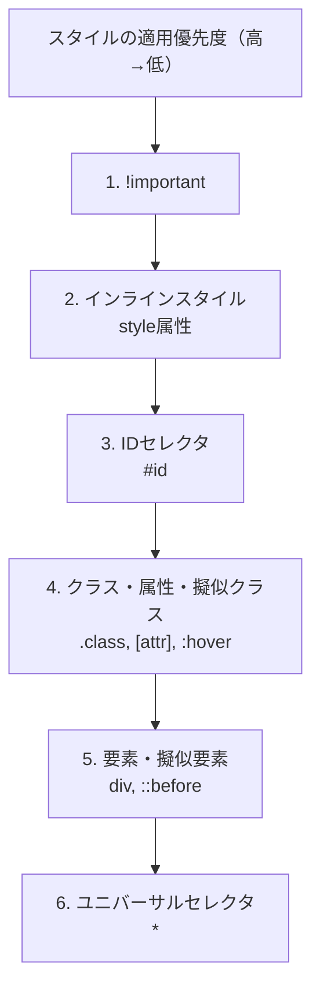
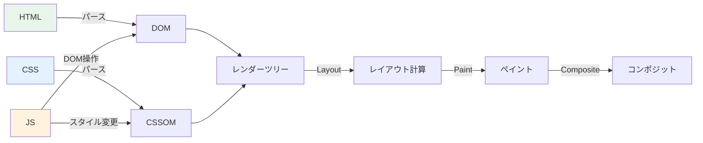
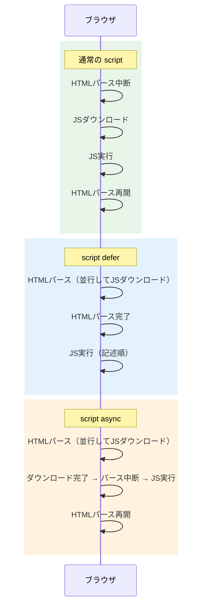

# HTML/CSS/JSの本質

> **一言で言うと:** HTMLは「文書の構造（セマンティクス）」、CSSは「見た目の宣言」、JSは「振る舞いの追加」。この3つの**責務分離**が全フロントエンド設計の基盤であり、ブラウザのレンダリングパイプラインを理解する出発点である。

## 3分で全体像

- **何を解決する技術か:** Webページの「構造」「見た目」「振る舞い」を別々の言語で記述し、ブラウザが3つのエンジン（HTMLパーサー / CSSエンジン / JSエンジン）で並列・段階的に処理できるようにする。責務分離により分業・テスト・パフォーマンス最適化を可能にする
- **代表的な使用シーン:** あらゆるWebページの基盤、SPAでもSSRでも全フロントエンド技術の土台、PWA・電子メールHTML・WebView アプリ・Electron 等の派生環境
- **これだけは覚える3つ:**
    1. **責務分離は分業とパフォーマンスの両方に効く** — 構造（HTML）・見た目（CSS）・振る舞い（JS）が混ざるとチーム分業が崩壊し、ブラウザの並列最適化も効かない。`<div>` だけのHTMLはセマンティクスの放棄
    2. **CSS は「カスケード」と「継承」の2つで挙動が決まる** — 詳細度（Specificity）・出現順・由来による衝突解決がカスケード、親→子のプロパティ伝播が継承。この2つを混同するとデバッグが破綻する
    3. **JS は「レンダーブロッキング」する** — `<script>` がHTMLパースを止める。`defer` / `async` / `type="module"` の使い分けが Core Web Vitals に直結する。「JSを減らす」が答えではなく、**実行タイミング**の制御が答え
- **AIに任せやすいか:** **任せやすい** — セマンティック HTML 構造・CSS レイアウト（Flexbox/Grid）・標準的な JS イベント処理は AI が高品質に書ける。ただし「**`<div>` ベースで提案してくる**」「**インラインスタイル多用**」「**`onclick` インラインハンドラ**」など AI の典型的なクセがあり、`/review-ai-code` で必ず検出する
- **詰まったらここを読む:** [[DOMと仮想DOM]] / [[アクセシビリティ]] / [[CoreWebVitals]] / [[SQLインジェクションとXSS]]

## なぜ必要か

Webページは最終的にブラウザが描画する。ブラウザは3つの言語を**別々のエンジン**で処理する:

- **HTMLパーサー** → DOM（Document Object Model）ツリーを構築
- **CSSエンジン** → CSSOM（CSS Object Model）を構築し、DOMと合成してレンダーツリーを生成
- **JSエンジン（V8等）** → DOMやCSSOMをプログラム的に操作。なおこのJSエンジンをブラウザから引き剥がしてサーバーで動かすことを実現したのが [[Node.js]] であり、「フロントとバックで同じ言語」という現代のWeb開発の前提はここから始まった

もしこの3つが分離されていなかったら:

- **構造と見た目が混在** → コンテンツの変更にデザインの修正が必要になり、逆も然り。チームでの分業が困難になる
- **振る舞いが構造に埋め込まれる** → `onclick="..."` が各要素にハードコードされ、テスト不能・再利用不能なコードが生まれる
- **アクセシビリティが崩壊** → スクリーンリーダーや検索エンジンが「見出し」「ナビゲーション」「本文」を区別できない
- **パフォーマンスの最適化ができない** → ブラウザはHTML/CSS/JSを並列・段階的に処理するが、混在していると最適化の余地がない

## どの問題を解決するか

### HTML — 構造とセマンティクスの問題

| 課題 | HTMLによる解決 |
|------|--------------|
| 文書の論理構造が不明 | `<h1>`〜`<h6>`, `<p>`, `<ul>` 等で階層構造を表現 |
| 機械（検索エンジン・支援技術）が内容を理解できない | セマンティック要素（`<nav>`, `<article>`, `<main>`, `<aside>`）で意味を付与 |
| フォーム入力の型が不定 | `<input type="email">`, `<input type="date">` 等でブラウザネイティブのバリデーションとUIを提供 |
| ハイパーリンクによる文書間の接続 | `<a href>` でWebの根幹であるハイパーテキストを実現 |

HTMLの本質は**「文書に意味を与える[[マークアップ言語とHTML|マークアップ]]」**であり、見た目の制御ではない。`<div>` と `<span>` は意味を持たない汎用コンテナであり、これだけでページを構築することは構造の放棄を意味する。

### CSS — 見た目の宣言と分離の問題

| 課題 | CSSによる解決 |
|------|-------------|
| 構造と見た目が混在する | 外部スタイルシートにより見た目を完全に分離 |
| 同じスタイルを何度も書く | セレクタによる一括指定、カスケード（Cascade）による優先度解決と、プロパティの継承（Inheritance） |
| デバイスごとに表示を変えたい | メディアクエリ（`@media`）によるレスポンシブデザイン |
| レイアウトの複雑な配置 | Flexbox, Grid による宣言的レイアウト |

CSSの「C」はCascade（カスケード）。スタイルの適用優先度は **詳細度（Specificity）** と **出現順序**、および由来（オリジン）で決まる。カスケードはスタイルの**衝突解決**の仕組みであり、親要素のプロパティを子が引き継ぐ**継承（Inheritance）**とは別概念である点に注意。この2つを理解していないと「なぜスタイルが当たらないか」のデバッグが不可能になる。


```mermaid
graph TD
    A["スタイルの適用優先度（高→低）"] --> B["1. !important"]
    B --> C["2. インラインスタイル<br/>style属性"]
    C --> D["3. IDセレクタ<br/>#id"]
    D --> E["4. クラス・属性・擬似クラス<br/>.class, [attr], :hover"]
    E --> F["5. 要素・擬似要素<br/>div, ::before"]
    F --> G["6. ユニバーサルセレクタ<br/>*"]
```

### JS — 動的な振る舞いの問題

| 課題               | JSによる解決                                     |
| ---------------- | ------------------------------------------- |
| HTMLは静的で状態を持てない  | DOMの動的な操作でUIを更新                             |
| ユーザー操作への応答ができない  | イベントリスナー（`click`, `input`, `submit` 等）による対話 |
| サーバーとの非同期通信ができない | `fetch` / `XMLHttpRequest` によるAjax通信        |
| 複雑なクライアントロジック    | 条件分岐・ループ・データ変換をブラウザ側で処理                     |

JSはプロトタイプベースのオブジェクト指向言語であり、`class` 構文はその糖衣構文にすぎない点は、DOMノードの継承階層（`HTMLDivElement → HTMLElement → Element → Node`）やフレームワークの拡張を理解する上で前提になる（詳細: [[JSにおけるprototype]]）。さらに JS の Object は単なる連想配列ではなく、プロパティアクセスや列挙といった**内部メソッド**で振る舞いが定義された精巧なデータ構造であり、その内部メソッド自体を実行時に横取りする `Proxy` が Vue 3 のリアクティビティや Immer といったモダンフレームワークの“魔法”の正体になっている（詳細: [[JSにおけるProxyとObject]]）。

## 他の仕組みとどう関係するか

- **下位レイヤーとの関係:**
  - [[HTTP-HTTPS|HTTP/HTTPS]]（Layer 2）— ブラウザがサーバーからHTML/CSS/JSを取得するプロトコル。`Content-Type` ヘッダでファイルの種類を判別する
  - [[TCP-IP]]（Layer 2）— HTMLの取得はTCPコネクション上で行われる。HTTP/2の多重化はCSS/JSの並列ダウンロードを高速化する
- **同レイヤーとの関係:**
  - [[DOMと仮想DOM]] — HTML が構築するDOMを効率的に更新する仕組みへ直結する。React/Vueが解決する問題は「素のDOMを直接操作する煩雑さとパフォーマンス」
  - [[状態管理]] — JSが扱う「データの変更→UIの更新」を体系化したもの
  - [[コンポーネント設計]] — HTML/CSS/JSの3つを**コンポーネント単位で再パッケージ化**する設計手法
  - [[アクセシビリティ]] — セマンティックHTMLが基盤。HTMLの構造が正しくなければARIA属性でも補えない
- **上位レイヤーとの関係:**
  - [[Layer5-パフォーマンス/_index|パフォーマンス]]（Layer 5）— [[CoreWebVitals|Core Web Vitals]]（LCP, INP, CLS）は全てHTML/CSS/JSの読み込みと実行に直結する。レンダーブロッキングの理解が必要
  - [[Layer6-セキュリティ/_index|セキュリティ]]（Layer 6）— [[SQLインジェクションとXSS|XSS]]はJSの実行を悪用する攻撃。CSP（Content Security Policy）はインラインJSの実行を制限することで防御する

### ブラウザのレンダリングパイプライン

HTML/CSS/JSがどのようにピクセルに変換されるか — この流れを知ることがパフォーマンス最適化の出発点:


```mermaid
graph LR
    A[HTML] -->|パース| B[DOM]
    C[CSS] -->|パース| D[CSSOM]
    B --> E[レンダーツリー]
    D --> E
    E -->|Layout| F[レイアウト計算]
    F -->|Paint| G[ペイント]
    G -->|Composite| H[コンポジット]
    I[JS] -->|DOM操作| B
    I -->|スタイル変更| D

    style A fill:#e8f5e9
    style C fill:#e3f2fd
    style I fill:#fff3e0
```

**重要:** JSはDOMとCSSOMの両方を操作できるため、**レンダーブロッキングリソース**となる。`<script>` タグがHTMLパースを中断する理由はこの依存関係にある。

## 誤解されやすいポイント

### 1. 「divでいい」という誤解 — セマンティクスの軽視

`<div>` と `<span>` は意味を持たない汎用コンテナ。「見た目が同じならdivでいい」は大きな誤解:

```html
<!-- 悪い例: 全てdiv -->
<div class="header">
  <div class="nav">
    <div class="nav-item">ホーム</div>
  </div>
</div>

<!-- 良い例: セマンティック要素 -->
<header>
  <nav>
    <a href="/">ホーム</a>
  </nav>
</header>
```

セマンティックHTMLが重要な理由:
- スクリーンリーダーが `<nav>` をナビゲーション領域と認識し、ユーザーがスキップできる
- 検索エンジンが `<article>` の内容を本文として優先的にインデックスする
- ブラウザが `<input type="email">` にネイティブのバリデーションUIを提供する

### 2. 「CSSはグローバルスコープしかない」という誤解

CSSのスコープ問題は古くから知られているが、現在は複数の解決策がある:

| 手法 | スコープの実現方法 |
|------|------------------|
| BEM（命名規約） | `.block__element--modifier` の規約で名前衝突を回避 |
| CSS Modules | ビルド時にクラス名をハッシュ化してユニークにする |
| CSS-in-JS（styled-components等） | JSでスタイルを生成し、コンポーネント単位でスコープ |
| `@scope`（CSS native） | ネイティブCSSでスコープ境界を定義（ブラウザサポート拡大中） |
| Shadow DOM | Web Componentsの仕組みでスタイルを完全に隔離 |

### 3. 「JSは遅いから最小限に」— 粒度を間違えた最適化

JSが遅いのではなく、**レンダーブロッキング**と**メインスレッドの占有**が問題。適切な対策は「JSを減らす」ではなく:

- `<script defer>` — HTMLパース完了後に実行（DOMContentLoadedはdeferスクリプト実行完了後に発火）
- `<script async>` — ダウンロード完了次第すぐ実行（実行順序が保証されない）
- `<script type="module">` — デフォルトでdefer動作、ESモジュールとして扱う
- コード分割（Code Splitting）— 初期表示に不要なJSを遅延読み込み。これを実現する基盤が[[モジュールバンドラ-webpackとTurbopack|モジュールバンドラ（webpack/Turbopack）]]であり、コード分割と[[バンドラのキャッシュ問題|長期キャッシュ戦略]]はセットで設計する必要がある（ハッシュ付きファイル名・vendor チャンク分離・ChunkLoadError 対策）


```mermaid
sequenceDiagram
    participant B as ブラウザ

    rect rgb(232, 245, 233)
        Note over B: 通常の script
        B->>B: HTMLパース中断
        B->>B: JSダウンロード
        B->>B: JS実行
        B->>B: HTMLパース再開
    end

    rect rgb(227, 242, 253)
        Note over B: script defer
        B->>B: HTMLパース（並行してJSダウンロード）
        B->>B: HTMLパース完了
        B->>B: JS実行（記述順）
    end

    rect rgb(255, 243, 224)
        Note over B: script async
        B->>B: HTMLパース（並行してJSダウンロード）
        B->>B: ダウンロード完了 → パース中断 → JS実行
        B->>B: HTMLパース再開
    end
```

### 4. 「HTMLはプログラミング言語ではないから重要度が低い」

HTMLはプログラミング言語ではなく**マークアップ言語**であるのは事実。しかしHTMLの品質がアクセシビリティ・SEO・パフォーマンスの全てに直結するため、フロントエンド開発において最も基礎的かつ重要なスキルである。

## 設計のベストプラクティス

### HTMLの設計原則

1. **セマンティクスファースト** — まず意味的に正しい要素を選び、その後CSSでスタイリングする
2. **フォームには適切な `<label>` を必ず付ける** — `<label for="email">` は[[アクセシビリティ]]の基本であり、クリック領域の拡大にもなる
3. **画像には `alt` 属性を必ず設定** — 装飾画像は `alt=""` で明示的に空にする

### CSSの設計原則

1. **IDセレクタをスタイリングに使わない** — 詳細度が高すぎて上書きが困難になる
2. **`!important` は最終手段** — 使用するたびにカスケードの制御が困難になる
3. **レイアウトにはFlexbox/Gridを使う** — `float` によるレイアウトは非推奨
4. **カスタムプロパティ（CSS変数）でデザイントークンを管理する**

```css
/* デザイントークンとしてのCSS変数 */
:root {
  --color-primary: #2563eb;
  --color-text: #1e293b;
  --spacing-md: 1rem;
  --font-size-base: 1rem;
  --radius-md: 0.5rem;
}

.button {
  background-color: var(--color-primary);
  color: white;
  padding: var(--spacing-md);
  border-radius: var(--radius-md);
  font-size: var(--font-size-base);
  border: none;
  cursor: pointer;
}
```

### JSの設計原則

1. **プログレッシブエンハンスメント（Progressive Enhancement）** — HTMLだけで基本機能が動く状態を確保し、JSで体験を向上させる
2. **イベントデリゲーション** — 個々の要素にリスナーを付けず、親要素で一括処理する
3. **DOM操作を最小限に** — 頻繁なDOM操作はリフロー（レイアウト再計算）を引き起こす。素のDOM操作を最適に書き続けるのは難しいため、宣言的UIモデルで「状態が変わったらUIをどう描き直すか」をフレームワークに任せる発想が[[DOMと仮想DOM|仮想DOM]]の動機。仮想DOMは「素のDOMより速い」のではなく、「宣言的に書ける UX を実用速度で提供する」のが本質
4. **非侵入型フィードバック** — ユーザーへの軽い通知（保存完了、送信成功等）には[[Toast通知]]パターンを使い、操作フローを中断しないUIを設計する

## AIエージェントとの協働

> このトピックでAIコーディングエージェント（Claude Code, Copilot, Cursor 等）と協働するための観点。
> 標準的なHTML/CSS/JSは AI が高品質に書けるが、**「`<div>` だけで構築」「インラインスタイル多用」「`onclick` インラインハンドラ」「`outline: none`」「`alt` 属性欠落」** が AI 生成コードで頻出する。レビューも `/review-ai-code` で横断アンチパターン照合に任せられる。

### AIに任せられる部分 / 人間が判断すべき部分

| タスク種類 | 任せ方（実装/レビュー） | 人間の関与 |
|---|---|---|
| セマンティックHTML 骨格生成 | AI 実装、`/review-ai-code` でレビュー | アクセシビリティ要件・SEO 要件・既存デザインシステムとの整合は人間判断 |
| CSS レイアウト（Flexbox / Grid） | AI に任せる | レスポンシブのブレイクポイント、デザイントークン定義、ブランドガイドラインは要件で決める |
| CSS Modules / Tailwind / styled-components の選定 | AI が複数案を出す | プロジェクトの規模・チームスキル・ビルド構成に応じて人間が選定 |
| JS イベントハンドラの実装 | AI に任せる | イベントデリゲーションの粒度・パフォーマンス影響は人間が確認 |
| `defer` / `async` / `module` の使い分け | AI が雛形 | 依存順序・初期表示の優先度・[[CoreWebVitals]] 影響は人間判断 |
| アクセシビリティ属性の付与 | AI に任せる | WCAG 適合レベル（A/AA/AAA）の選択、スクリーンリーダー実機テストは人間 |

### AI生成コードのレビュー観点（このトピック固有）

AI生成のHTML/CSS/JSコードを受け取ったとき、最低限ここを見る。

1. **セマンティック要素を使っているか / `<div>` ベースになっていないか** — `<header>` `<nav>` `<main>` `<article>` `<section>` `<aside>` `<footer>` 等のセマンティクスが活用されているか。「全部 `<div class="header">`」「`<div onclick>` をボタン代わり」は典型的な AI のクセ。`<button>` `<a href>` `<label>` などネイティブ要素を使うべき
2. **インラインスタイル / インラインイベントハンドラの混入** — `style="..."` `onclick="..."` の直書きは再利用性ゼロ、CSP 違反の原因、テスト不能。CSS はクラスベース、JS は `addEventListener` で外部ファイルから登録する
3. **アクセシビリティ・パフォーマンスの基本対応漏れ** — `` の `alt` 属性欠落、`<label for>` 欠落、`outline: none` でフォーカス表示削除、`<script>` を `defer` なしで `<head>` に置く、レンダーブロッキングする `@import` の使用、`!important` の濫用

### 効くプロンプトの型

このトピックに関する実装をAIに依頼するとき、コンテキストとして渡すべき情報・制約・成功基準のテンプレ。

```
# 前提（プロジェクトの状況・既存のコード規約）
- ターゲットブラウザ: Chrome / Safari / Firefox 直近2バージョン (IE 非対応)
- CSS 戦略: CSS Modules / Tailwind / vanilla-extract / styled-components など
- デザイントークン: --color-primary, --spacing-md 等の CSS 変数で定義済み
- フレームワーク: 素のHTML/CSS/JS、または React / Vue / Svelte
- アクセシビリティ目標: WCAG 2.1 AA 準拠

# やってほしいこと
- 「{要件}」のUIパーツを実装
- HTML / CSS / JS を分離して提示

# 守ってほしい制約（このトピック固有のもの）
- セマンティック HTML を使う (<div> だけで構築しない)
- インタラクティブ要素は <button> <a href> <input> + <label> など適切なネイティブ要素
- インラインスタイルとインラインイベントハンドラ (onclick=) は使わない
- フォーカス表示 (outline) は消さない、:focus-visible でカスタマイズ
-  には alt 属性、<label for=""> でフォーム要素と紐付け
- <script> は defer (または module) で読み込み、レンダーブロッキングを避ける
- CSS は !important を使わない、ID セレクタでスタイリングしない
- レイアウトは Flexbox / Grid を使う (float ではない)
- デザイントークン (CSS 変数) を直接使い、生の色コードを書かない

# 完了の判断基準
- セマンティック要素で構造が表現できている
- キーボード操作で全ての操作が可能 (Tab + Enter / Space)
- 200% ズームでレイアウトが崩れない
- axe-core / Lighthouse Accessibility のスコアが90以上
```

### AI実装のアンチパターン

LLM生成コードで頻出する過剰設計・誤用パターン。レビュー時の照合表として使う。

| アンチパターン | なぜ問題か | レビュー観点 / 対策 |
|---|---|---|
| 全て `<div>` で構築 | セマンティクス喪失、アクセシビリティ崩壊、SEO 不利 | 適切なネイティブ要素（`<nav>`, `<main>`, `<button>` 等）を使う |
| `<div onclick>` をボタンとして使用 | フォーカス不能、キーボード操作不能、ロール未定義 | `<button>` を使う |
| インラインスタイル `style="..."` 多用 | 再利用性ゼロ、メディアクエリ不可、詳細度が高すぎる | クラスベースの CSS 設計 |
| インラインイベント `onclick="..."` | CSP 違反の原因、テスト不能、保守困難 | `addEventListener` で外部 JS から登録 |
| `document.getElementById` を多用した手続き的 DOM 操作 | 状態と UI の同期が手動管理になり破綻 | 宣言的 UI フレームワーク (React/Vue) かイベントデリゲーション |
| `outline: none` でフォーカス表示削除 | キーボードユーザがフォーカス位置を見失う | `:focus-visible` でカスタムスタイル |
| `` に `alt` 属性なし | スクリーンリーダーがファイル名を読み上げ、SEO にも不利 | 意味のある画像は説明、装飾は `alt=""` |
| `<script>` を `<head>` に `defer` なしで配置 | HTML パースが止まり First Paint が遅延 | `defer` または `<body>` 末尾、`type="module"` はデフォルトで defer |
| `!important` の多用 | カスケードの制御が困難になり、後続の上書きが連鎖的に困難に | 詳細度の設計を見直す、最終手段でのみ使用 |
| ID セレクタでスタイリング | 詳細度が高すぎて上書きが困難 | クラスセレクタを使う、ID は JS の参照用のみ |
| CSS の `@import` でファイル分割 | レンダーブロッキングが直列化、`<link>` より遅い | バンドラの import またはビルド時連結 |
| メディアクエリで PC ファースト | モバイルユーザに大きい CSS が無駄に届く | `min-width` のモバイルファーストで書く |
| 装飾的アニメーションを `prefers-reduced-motion` 無視で実装 | 前庭障害ユーザに健康被害、操作不能 | `@media (prefers-reduced-motion: reduce)` で抑制 |

→ レイヤー横断のアンチパターン索引: [[_anti-patterns/_index|AIアンチパターン索引]] / [[_anti-patterns/レイヤー別/Layer4-Frontend|Layer 4 Frontend アンチパターン集]]

## 具体例

### セマンティックHTMLの実例

```html
<!DOCTYPE html>
<html lang="ja">
<head>
  <meta charset="UTF-8">
  <meta name="viewport" content="width=device-width, initial-scale=1.0">
  <title>ブログ記事</title>
  <link rel="stylesheet" href="style.css">
</head>
<body>
  <header>
    <nav aria-label="メインナビゲーション">
      <ul>
        <li><a href="/">ホーム</a></li>
        <li><a href="/about">サイトについて</a></li>
      </ul>
    </nav>
  </header>

  <main>
    <article>
      <h1>HTML/CSS/JSの責務分離</h1>
      <time datetime="2026-03-29">2026年3月29日</time>

      <section>
        <h2>なぜ分離が重要か</h2>
        <p>構造・見た目・振る舞いを分離することで...</p>
      </section>

      <figure>
        
        <figcaption>HTML/CSS/JSの責務分離</figcaption>
      </figure>
    </article>
  </main>

  <aside>
    <h2>関連記事</h2>
    <ul>
      <li><a href="/dom">DOMについて</a></li>
    </ul>
  </aside>

  <footer>
    <p>&copy; 2026 My Blog</p>
  </footer>

  <script src="main.js" defer></script>
</body>
</html>
```

### CSSレイアウト: FlexboxとGrid

```css
/* Flexbox: 1次元レイアウト（行 or 列） */
.navbar {
  display: flex;
  justify-content: space-between;
  align-items: center;
  gap: 1rem;
}

/* Grid: 2次元レイアウト（行 and 列） */
.page-layout {
  display: grid;
  grid-template-columns: 250px 1fr;
  grid-template-rows: auto 1fr auto;
  grid-template-areas:
    "header header"
    "sidebar main"
    "footer footer";
  min-height: 100vh;
}

.header  { grid-area: header; }
.sidebar { grid-area: sidebar; }
.main    { grid-area: main; }
.footer  { grid-area: footer; }
```

### JS: イベントデリゲーションの例

```javascript
// 悪い例: 各ボタンに個別にリスナーを付ける
document.querySelectorAll('.delete-btn').forEach(btn => {
  btn.addEventListener('click', (e) => {
    const id = e.target.dataset.id;
    deleteItem(id);
  });
});
// 問題: 動的に追加されたボタンにはリスナーが付かない

// 良い例: イベントデリゲーション
document.querySelector('.item-list').addEventListener('click', (e) => {
  const btn = e.target.closest('.delete-btn');
  if (!btn) return;
  const id = btn.dataset.id;
  deleteItem(id);
});
// 利点: 動的に追加された要素にも自動的に対応
```

### レスポンシブデザインの基本

```css
/* モバイルファーストで記述 */
.card-grid {
  display: grid;
  grid-template-columns: 1fr;
  gap: 1rem;
}

/* タブレット以上 */
@media (min-width: 768px) {
  .card-grid {
    grid-template-columns: repeat(2, 1fr);
  }
}

/* デスクトップ以上 */
@media (min-width: 1024px) {
  .card-grid {
    grid-template-columns: repeat(3, 1fr);
  }
}
```

## 参考リソース

- [MDN Web Docs](https://developer.mozilla.org/ja/) — HTML/CSS/JSの公式リファレンス。最も信頼できるWeb技術の情報源
- [web.dev](https://web.dev/) — Googleによるモダンなフロントエンド開発のベストプラクティス集
- 書籍:『HTML解体新書』（太田良典, 中村直樹）— セマンティクスとアクセシビリティに強い日本語書籍
- 書籍:『Every Layout』（Andy Bell, Heydon Pickering）— CSSレイアウトの設計原則

## 理解度セルフチェック

> 答えられなければ本文に戻る。答えはこのファイル内に必ずある。

1. **「`<div>` でいい」がなぜ問題か、30秒で説明せよ。** セマンティック HTML を使うことで具体的に何が改善されるか、最低3つ挙げること。
2. **`<script>`、`<script defer>`、`<script async>` の違いを説明せよ。** どんなときにどれを選ぶか、判断基準を述べよ。
3. **AI生成コードレビュー設問:** AI が以下の「お問い合わせフォーム」を生成した。本文の観点で **問題点を最低3つ** 指摘せよ。

```html
<!DOCTYPE html>
<html>
<head>
  <script src="main.js"></script>
  <style>
    #form { padding: 20px; background: blue !important; }
    .btn { outline: none; }
  </style>
</head>
<body>
  <div class="header">
    <div class="title" style="font-size:24px;">お問い合わせ</div>
  </div>
  <div id="form">
    <div>お名前</div>
    <div><input type="text" id="name"></div>
    <div>メールアドレス</div>
    <div><input type="text" id="email"></div>
    <div>お問い合わせ内容</div>
    <div><input type="text" id="msg"></div>
    <div class="btn" onclick="submit()" style="background:#06f; color:white; padding:8px;">送信</div>
  </div>
  
</body>
</html>
```

> [!note]- 解答の指針
>
> > [!info] 用語ミニ辞典
> > - **セマンティック HTML:** 要素自体が「意味」を持つHTML。`<nav>` (ナビゲーション)、`<main>` (主要コンテンツ)、`<article>` (独立した記事)、`<button>` (ボタン)、`<label>` (フォームラベル) など。`<div>` `<span>` は意味を持たない汎用コンテナ
> > - **DOM (Document Object Model):** HTMLをツリー構造のオブジェクトとして表現するAPI。JavaScriptから操作可能。詳細は [[DOMと仮想DOM]]
> > - **CSSOM (CSS Object Model):** CSSのDOM版。CSSルールをオブジェクトとして表現し、DOMと合成してレンダーツリーを生成する
> > - **レンダーツリー:** DOM + CSSOM を合成して生成される、画面に描画される要素の木構造。`display: none` の要素はレンダーツリーから除外される
> > - **レンダーブロッキングリソース:** ブラウザがHTMLパースを中断し、それ自体のダウンロードと処理を待つリソース。デフォルトの `<script>` と CSS（`<link>`）が該当
> > - **`defer` / `async`:** `<script>` の属性。defer は HTML パース完了後に記述順で実行、async はダウンロード完了次第すぐ実行（順序保証なし）。`type="module"` はデフォルトで defer 動作
> > - **詳細度 (Specificity):** CSS セレクタの優先度。`!important > インライン > ID > クラス/属性/擬似クラス > 要素/擬似要素 > ユニバーサル` の順。同じ詳細度なら後勝ち
> > - **カスケード (Cascade):** スタイルの衝突解決の仕組み。詳細度・出現順・由来（ユーザー/作者/ブラウザ）で勝者を決める
> > - **継承 (Inheritance):** 親要素から子要素にプロパティが伝播する仕組み。`color` `font-family` などは継承される、`padding` `border` などは継承されない。カスケードとは別概念
> > - **`<button>` がデフォルトで持つ機能:** フォーカス可能、Enter/Space でクリック発火、スクリーンリーダーが「ボタン」と読み上げ、`type="submit"` ならフォーム送信。`<div onclick>` ではこれら全てを自前実装する必要がある
> > - **`alt` 属性:** `` の代替テキスト。視覚障害者のスクリーンリーダー、画像読み込み失敗時、SEO に重要。装飾画像は明示的に `alt=""` を設定
> > - **`<label for="id">`:** フォーム要素のラベル。クリック領域が拡大し、スクリーンリーダーが入力欄の目的を読み上げる。アクセシビリティの基本
>
> 1. `<div>` は意味を持たない汎用コンテナのため、(a) **スクリーンリーダーがナビゲーション・本文・サイドバーを区別できず、ユーザーは目的のセクションへスキップできない**（`<nav>` `<main>` などのセマンティック要素は支援技術にランドマークとして認識される）、(b) **検索エンジンが文書構造を理解できず SEO に不利**（`<article>` `<h1>〜<h6>` は重要度を伝える）、(c) **フォームのアクセシビリティが崩壊**（`<button>` の代わりに `<div onclick>` を使うとフォーカス不能・Enter で発火しない・「ボタン」と読み上げられない）、(d) **HTML が長くなり保守困難**（`<header><nav>` で意味が分かるところを `<div class="header"><div class="nav">` で書くと冗長）、(e) **ブラウザのネイティブ機能が無駄になる**（`<input type="email">` ならネイティブのバリデーション UI とキーボードが提供されるが、`<div>` を入力欄代わりにすれば全部自前実装）。セマンティック HTML はアクセシビリティ・SEO・保守性・パフォーマンス全方位で改善する基礎技術
> 2. `<script>` (属性なし) は **同期実行**: HTMLパース中に出会うとパースを中断し、JS をダウンロード→実行してからパース再開する。**レンダーブロッキング**の典型で、初期表示が遅延する原因。`<script defer>` は **遅延実行**: HTML パースと並行してダウンロードし、パース完了後に**記述順で**実行する（DOMContentLoaded 直前）。複数の defer スクリプトの実行順序は保証される。`<script async>` は **非同期実行**: ダウンロード完了次第即座にパースを中断して実行する。**実行順序は保証されない**ため、複数の async スクリプトが互いに依存しているとバグになる。判断基準は: (a) **DOM に依存し、ページの初期化に必要 → defer**（多くの場合これが正解）、(b) **他に依存せず単独で動く独立スクリプト（アクセス解析・広告など）→ async**、(c) **ES Modules を使う → `type="module"`**（デフォルトで defer 動作）。同期 `<script>` は基本的に避け、どうしても必要なら `<body>` 末尾に配置する
> 3. AI生成コードの問題点（最低限以下を指摘できれば本文を理解している）:
>     - **`<script src="main.js">` が `<head>` に defer なしで配置** — レンダーブロッキングで初期表示が遅延、かつ DOM 構築完了前に JS が走るので `getElementById` も失敗する。`<script src="main.js" defer>` か `<body>` 末尾に
>     - **`<html>` に `lang` 属性がない** — スクリーンリーダーが言語を判定できず、誤った発音で読み上げる。`<html lang="ja">` が必要
>     - **`<head>` に `<meta charset="UTF-8">` `<meta name="viewport">` がない** — 文字化けと、モバイルでズームが固定される問題。`<title>` も欠落
>     - **`<div class="header">` 等で全部 `<div>`** — `<header>` `<main>` 等のセマンティック要素を使うべき。スクリーンリーダーがランドマークを認識できない
>     - **`<div class="title">` の見出しが `<h1>`/`<h2>` でない** — 文書構造が伝わらない、SEO 不利
>     - **インラインスタイル `style="font-size:24px;"` `style="background:#06f"`** — 再利用性ゼロ、メディアクエリ不可、CSP違反の温床
>     - **`<input type="text">` のメールアドレス** — `type="email"` を使うべき (ブラウザのネイティブバリデーション、モバイルキーボードが @ 付きに変わる)
>     - **`<label>` がない** — フォームのアクセシビリティ崩壊。`<label for="email">メールアドレス</label>` で紐付ける必要がある
>     - **`<div onclick="submit()">送信</div>` をボタンとして使用** — フォーカス不能、Enter/Space で発火しない、スクリーンリーダーが「ボタン」と認識しない。`<button type="submit">` を使う
>     - **`<form>` 要素がない** — Enter キーでの送信、ブラウザのフォーム機能、CSRF対策のための form action などが全て使えない
>     - **インラインイベント `onclick="submit()"`** — CSP違反の原因、テスト不能、保守困難。`addEventListener` で登録
>     - **`#form` (ID セレクタ) でスタイリング** — 詳細度が高すぎて上書き困難。クラスセレクタを使う
>     - **`background: blue !important`** — `!important` で他のスタイルの上書きが連鎖的に困難に
>     - **`outline: none`** — キーボードユーザがフォーカス位置を見失う。`:focus-visible` でカスタムスタイルを当てるべき
>     - **`` に `alt` 属性なし** — スクリーンリーダーが「banner.jpg」と読み上げる、SEO 不利

## 学習メモ

- HTML/CSS/JSの3層分離は、フロントエンドフレームワーク（React, Vue等）でもコンポーネント内で形を変えて生きている。JSXはHTMLとJSを混ぜているように見えるが、実際は「UIの宣言」と「ロジック」を同じ場所に置くことで関心の分離を**コンポーネント単位**に再定義している
- CSS詳細度の理解は、CSSデバッグの必須スキル。DevToolsのComputed Stylesで「どのルールが勝っているか」を確認する習慣をつける
