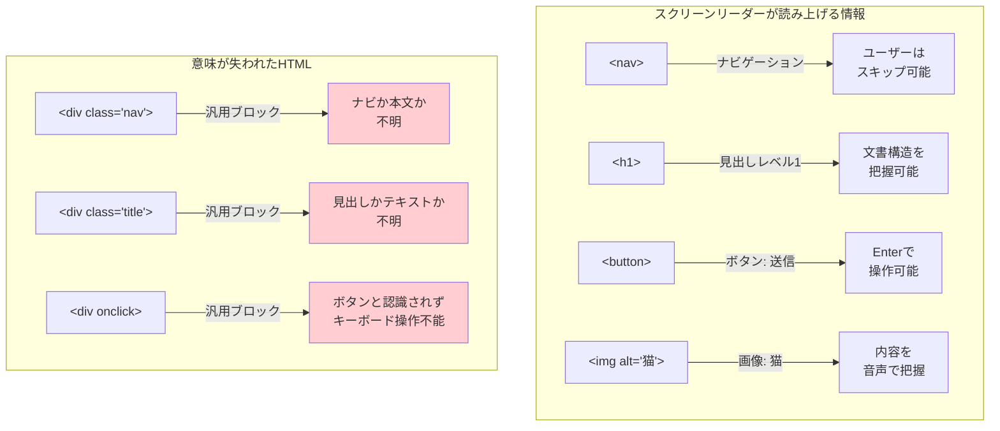
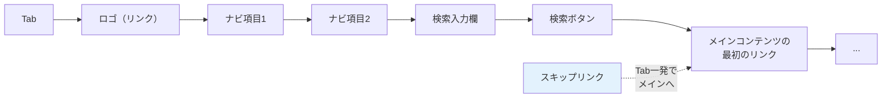
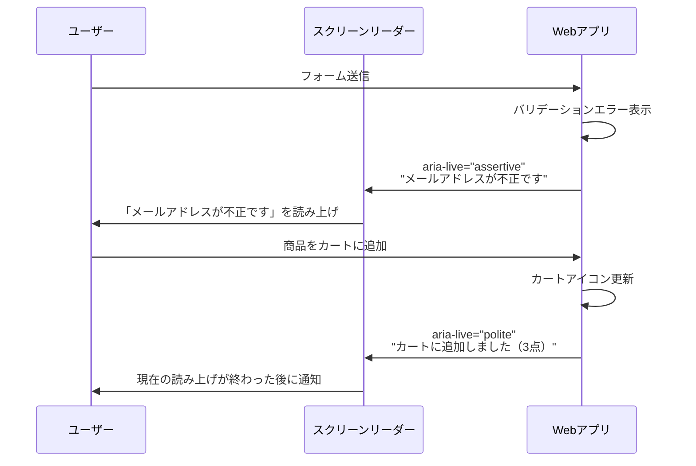
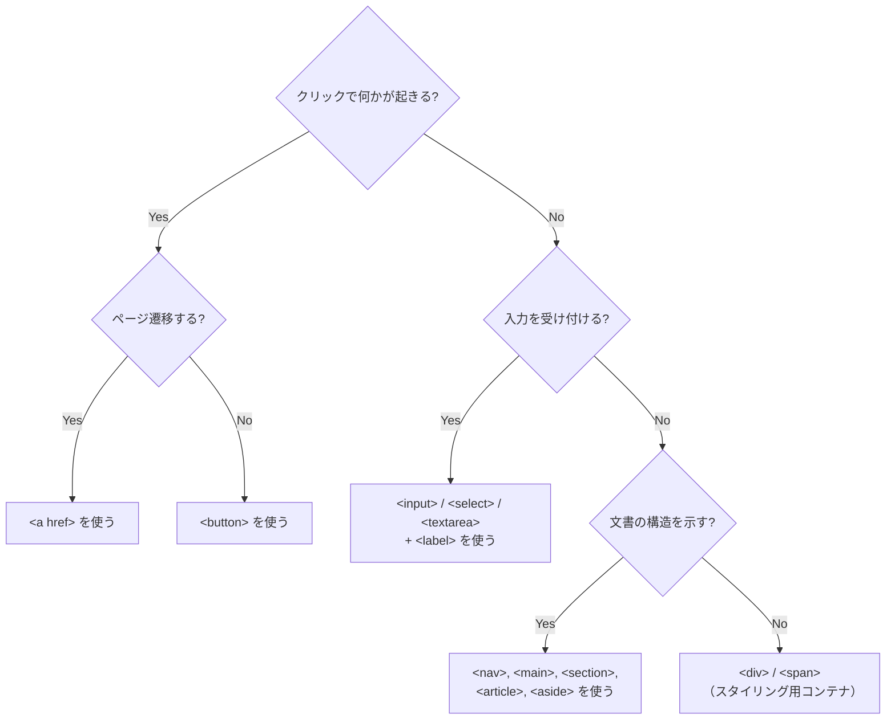

# アクセシビリティ（Accessibility / a11y）

> **一言で言うと:** アクセシビリティとは「全てのユーザーがWebコンテンツを知覚・操作・理解できる」ことを保証する設計。セマンティックHTMLが基盤であり、ARIA属性はその補完。法的要件でもある国が増えており、技術的課題であると同時にビジネス要件でもある。

## なぜ必要か

Webは「誰でもアクセスできる」ことを前提に設計されたメディアである。しかし実際には、多くのWebサイトが特定のユーザーを排除している:

- **視覚障害** — 全盲のユーザーはスクリーンリーダーで音声読み上げに依存する。セマンティクスのないHTMLでは「ボタン」「リンク」「見出し」の区別がつかない
- **運動障害** — マウスを使えないユーザーはキーボードのみで操作する。フォーカスが見えない、Tabで辿れないUIは操作不能
- **聴覚障害** — 動画の音声が字幕なしだと内容が伝わらない
- **認知障害** — 複雑すぎるUI、点滅するコンテンツ、一貫性のないナビゲーションは理解を困難にする
- **一時的な制約** — 片手が塞がっている、明るい屋外で画面が見えにくい、騒がしい環境で音声が聞こえないなど、障害がなくてもアクセシビリティの恩恵を受ける場面は多い

### 法的要件

| 地域 | 法律・規格 | 概要 |
|------|----------|------|
| 米国 | ADA / Section 508 | 公的機関と一定規模の民間企業に義務 |
| EU | European Accessibility Act (2025年施行) | EU圏内のWebサービスに広く適用 |
| 日本 | JIS X 8341-3 / 障害者差別解消法 | 公的機関・民間事業者ともに合理的配慮の提供が義務（2024年4月改正施行） |

訴訟リスクが現実のものとなっており、2023年には米国で4,600件以上のWebアクセシビリティ訴訟が提起された。

## どの問題を解決するか

### 問題1: セマンティクスの欠如 — 機械が意味を理解できない

スクリーンリーダーはDOMの構造と要素の**セマンティクス（意味）**に基づいて情報を伝える。`<div>` と `<span>` で構築されたUIは、視覚的には同じでも支援技術にとっては意味不明:



### 問題2: キーボード操作の欠如

マウスが使えないユーザーはTab/Shift+Tab/Enter/Space/矢印キーでUIを操作する。以下が保証されていなければ操作不能:

| 要件 | 説明 |
|------|------|
| **フォーカス可能** | 全てのインタラクティブ要素にTabで到達できる |
| **フォーカス表示** | 現在フォーカスされている要素が視覚的に識別できる |
| **操作可能** | Enter/Spaceでボタンを押す、矢印キーでタブを切り替える等 |
| **論理的な順序** | Tab順序がDOMの順序と一致し、視覚的な配置と矛盾しない |
| **フォーカストラップ** | モーダル内にフォーカスを閉じ込め、背後のUIに移動させない |



### 問題3: 動的UIのアクセシビリティ

SPAやリッチなインタラクションでは、DOMが動的に変化する。スクリーンリーダーは変化を自動的に察知できないため、**ライブリージョン（Live Region）**で変更を通知する必要がある:



## WCAG — Webアクセシビリティの国際標準

WCAG（Web Content Accessibility Guidelines）はW3Cが策定するアクセシビリティの国際標準。4つの原則（POUR）に基づく:

| 原則 | 意味 | 例 |
|------|------|-----|
| **Perceivable（知覚可能）** | 情報が少なくとも1つの感覚で知覚できる | 画像にalt、動画に字幕、十分なコントラスト比 |
| **Operable（操作可能）** | UIがキーボード等で操作できる | Tab操作、十分な操作時間、発作を誘発しない |
| **Understandable（理解可能）** | 情報とUIが理解できる | 明確なラベル、一貫したナビゲーション、エラーの説明 |
| **Robust（堅牢）** | 様々な支援技術で正しく解釈できる | 有効なHTML、WAI-ARIAの正しい使用 |

適合レベルは3段階: **A**（最低限）→ **AA**（一般的な目標）→ **AAA**（最高水準）。法的要件の多くはAAレベルを要求する。

## ARIA — セマンティクスの補完

WAI-ARIA（Web Accessibility Initiative - Accessible Rich Internet Applications）は、ネイティブHTMLでは表現できないセマンティクスを追加する仕組み:

### ARIAの5つのルール

1. **ネイティブHTMLで表現できるなら、ARIAを使わない** — `<button>` があるのに `<div role="button">` を使うのは間違い
2. **ネイティブのセマンティクスを上書きしない** — `<h2 role="tab">` は見出しの意味を壊す
3. **インタラクティブなARIAロールにはキーボード操作を実装する** — `role="button"` を付けたらEnter/Spaceで動作させる
4. **フォーカス可能な要素を `aria-hidden="true"` にしない** — フォーカスは移るのにスクリーンリーダーが無視する矛盾
5. **インタラクティブな要素にはアクセシブルな名前を付ける** — `aria-label` または `<label>` で名前を提供する

### 主要なARIA属性

| 属性 | 目的 | 使用例 |
|------|------|--------|
| `role` | 要素の役割を明示 | `role="dialog"`, `role="tablist"` |
| `aria-label` | 要素に名前を付ける（テキスト直接指定） | `<button aria-label="メニューを閉じる">×</button>` |
| `aria-labelledby` | 別の要素のテキストで名前を付ける | `<dialog aria-labelledby="dialog-title">` |
| `aria-describedby` | 補足説明を関連付ける | `<input aria-describedby="password-hint">` |
| `aria-hidden` | 支援技術から要素を隠す | `<span aria-hidden="true">★</span>` 装飾用 |
| `aria-live` | 動的に変化する領域を通知 | `<div aria-live="polite">3件の新着メッセージ</div>` |
| `aria-expanded` | 開閉状態を伝える | `<button aria-expanded="true">メニュー</button>` |
| `aria-current` | 現在のアイテムを示す | `<a aria-current="page">ホーム</a>` |
| `aria-invalid` | 入力値が無効であることを伝える | `<input aria-invalid="true">` |

## 他の仕組みとどう関係するか

- **下位レイヤーとの関係:**
  - [[HTML-CSS-JS]] — セマンティックHTMLがアクセシビリティの**基盤**。`<nav>`, `<main>`, `<button>`, `<label>` などネイティブ要素のセマンティクスが支援技術に情報を提供する。CSSの `color`, `font-size` はコントラスト比と可読性に直結
  - [[マークアップ言語とHTML]] — HTMLのセマンティクスの理解がアクセシビリティの前提
- **同レイヤーとの関係:**
  - [[DOMと仮想DOM]] — 仮想DOMの差分更新がフォーカス管理に影響する。コンポーネントの再マウントでフォーカスが失われる問題
  - [[状態管理]] — UI状態（モーダル開閉、ローディング等）の変更を支援技術に伝達する必要がある（`aria-live`, `aria-busy`）
  - [[コンポーネント設計]] — アクセシビリティはコンポーネント設計時に組み込む。Headless UIライブラリ（Radix UI, React Aria等）はアクセシビリティを内蔵したコンポーネント基盤を提供する
- **上位レイヤーとの関係:**
  - [[Layer5-パフォーマンス/_index|パフォーマンス]]（Layer 5）— パフォーマンスの悪さ自体がアクセシビリティの障壁。低速なネットワークや古いデバイスを使うユーザーに不利
  - [[Layer6-セキュリティ/_index|セキュリティ]]（Layer 6）— CAPTCHAはアクセシビリティの大きな障壁。音声CAPTCHAやreCAPTCHA v3等の代替策が必要

## 誤解されやすいポイント

### 1. 「アクセシビリティ = スクリーンリーダー対応」

スクリーンリーダーは一部に過ぎない。アクセシビリティは以下の全てを含む:

- **キーボード操作** — マウスなしで全機能にアクセスできる
- **色のコントラスト** — WCAG AAで4.5:1以上（大きな文字は3:1以上）
- **テキストの拡大** — 200%拡大でもレイアウトが崩れない
- **モーション** — `prefers-reduced-motion` で不要なアニメーションを無効化
- **認知的負荷** — 明確なエラーメッセージ、一貫したナビゲーション
- **色だけに依存しない** — 「赤はエラー」ではなくアイコンやテキストでも伝える

### 2. 「ARIAを付ければアクセシブル」

ARIAは**ネイティブHTMLで表現できないものを補完する**手段。不正なARIAはアクセシビリティを悪化させる:

```html
<!-- ❌ ARIAの誤用 — ネイティブ要素で済むのにARIAを使う -->
<div role="button" tabindex="0" onclick="handleClick()"
     onkeydown="if(event.key==='Enter') handleClick()">
  送信
</div>

<!-- ✅ ネイティブHTML — ARIAなしで全ての機能が備わる -->
<button onclick="handleClick()">
  送信
</button>
<!-- buttonはデフォルトで: フォーカス可能、Enter/Space対応、
     スクリーンリーダーが「ボタン」と読み上げる -->
```

**「No ARIA is better than bad ARIA」** — 間違ったARIAを付けるぐらいなら、何も付けない方がマシ。

### 3. 「アクセシビリティは後から対応できる」

アクセシビリティはUIの構造に関わるため、後付けは大規模なリファクタリングを要する。特に:
- `<div>` ベースのカスタムコンポーネントを `<button>` や `<select>` に置き換える作業
- キーボードナビゲーションの追加（フォーカス管理の設計変更）
- カラーパレットの変更（コントラスト比の確保）

コンポーネント設計の初期段階でセマンティックHTMLを選択することが、最もコスト効率の良いアクセシビリティ対策。

### 4. 「`tabindex="0"` を全ての要素に付ければキーボード対応」

`tabindex="0"` はフォーカス可能にするだけで、**キーボード操作（Enter/Space/矢印キー）は自前で実装**する必要がある。ネイティブの `<button>`, `<a>`, `<input>` はこれらが組み込み済み:

```html
<!-- tabindex="0" だけではボタンとして機能しない -->
<div tabindex="0" onclick="handleClick()">送信</div>
<!-- Enter で発火しない、スクリーンリーダーが「ボタン」と認識しない -->

<!-- tabindex の値の意味 -->
<!-- tabindex="0"  → Tab順序にDOMの位置通り含める -->
<!-- tabindex="-1" → Tab順序から外すが、JSで focus() は可能 -->
<!-- tabindex="1+" → ❌ 使うべきでない（Tab順序がDOM順序と乖離） -->
```

## 設計のベストプラクティス

### セマンティックHTML チェックリスト



### フォームのアクセシビリティ

```html
<!-- ✅ アクセシブルなフォーム -->
<form>
  <div>
    <!-- label と input を for/id で紐付け -->
    <label for="email">メールアドレス</label>
    <input
      id="email"
      type="email"
      required
      aria-describedby="email-hint email-error"
    />
    <p id="email-hint">例: user@example.com</p>
    <!-- エラーメッセージは aria-invalid + aria-describedby で関連付け -->
    <p id="email-error" role="alert">
      <!-- JSでエラー時に表示 -->
    </p>
  </div>

  <fieldset>
    <legend>通知の受け取り方法</legend>
    <!-- ラジオボタンのグループは fieldset + legend -->
    <label><input type="radio" name="notify" value="email" /> メール</label>
    <label><input type="radio" name="notify" value="sms" /> SMS</label>
    <label><input type="radio" name="notify" value="none" /> 受け取らない</label>
  </fieldset>

  <button type="submit">登録</button>
</form>
```

### モーダルのアクセシビリティ

モーダルは最もアクセシビリティの実装が難しいUIパターンの1つ:

```jsx
function Modal({ isOpen, onClose, title, children }) {
  const dialogRef = useRef(null);

  useEffect(() => {
    const dialog = dialogRef.current;
    if (!dialog) return;

    if (isOpen) {
      dialog.showModal();  // <dialog> のネイティブメソッド
      // showModal() は自動的に:
      // - フォーカストラップを実装
      // - 背景のスクロールを抑制
      // - Escapeキーで閉じる
      // - aria-modal="true" 相当の動作
    } else {
      dialog.close();
    }
  }, [isOpen]);

  return (
    <dialog
      ref={dialogRef}
      aria-labelledby="modal-title"
      onClose={onClose}
    >
      <header>
        <h2 id="modal-title">{title}</h2>
        <button onClick={onClose} aria-label="閉じる">×</button>
      </header>
      <div>{children}</div>
    </dialog>
  );
}
```

**HTML `<dialog>` 要素**は、モーダルに必要なアクセシビリティ機能の大部分をネイティブに提供する。カスタム実装よりも `<dialog>` の使用を優先すべき。

### コントラスト比とカラー設計

```css
/* ✅ prefers-reduced-motion を尊重する */
@media (prefers-reduced-motion: reduce) {
  *,
  *::before,
  *::after {
    animation-duration: 0.01ms !important;
    animation-iteration-count: 1 !important;
    transition-duration: 0.01ms !important;
  }
}

/* ✅ prefers-color-scheme でダークモード対応 */
@media (prefers-color-scheme: dark) {
  :root {
    --color-text: #e2e8f0;
    --color-bg: #1a202c;
    /* コントラスト比 4.5:1 以上を維持 */
  }
}

/* ✅ フォーカス表示を消さない — カスタマイズは可 */
:focus-visible {
  outline: 2px solid var(--color-primary);
  outline-offset: 2px;
}
/* focus-visible はキーボード操作時のみ表示（マウスクリックでは非表示） */
```

## AIによる実装のアンチパターン

| アンチパターン | なぜ問題か | 対策 |
|---|---|---|
| `<div onclick>` をボタンとして使用 | フォーカス不能、キーボード操作不能、ロール未定義 | `<button>` を使う |
| `outline: none` でフォーカス表示を削除 | キーボードユーザーがフォーカス位置を見失う | `:focus-visible` でカスタムスタイルを適用 |
| `` に `alt` を付けない | スクリーンリーダーがファイル名を読み上げる | 意味のある画像は説明を、装飾画像は `alt=""` を |
| `aria-label` と可視テキストの不一致 | 音声操作ユーザーが「送信ボタン」と言ってもラベルが違うため反応しない | 可視テキストと `aria-label` を一致させる |
| フォーム入力に `<label>` がない | スクリーンリーダーが入力欄の目的を伝えられない | `<label for="id">` で明示的に紐付ける |
| `tabindex="5"` 等の正の値 | Tab順序がDOM順序と乖離し予測不能になる | `tabindex="0"` または `-1` のみ使用 |

## 具体例

### アクセシブルなタブUI

```jsx
function Tabs({ tabs }) {
  const [activeIndex, setActiveIndex] = useState(0);

  const handleKeyDown = (e, index) => {
    let newIndex;
    switch (e.key) {
      case 'ArrowRight':
        newIndex = (index + 1) % tabs.length;
        break;
      case 'ArrowLeft':
        newIndex = (index - 1 + tabs.length) % tabs.length;
        break;
      case 'Home':
        newIndex = 0;
        break;
      case 'End':
        newIndex = tabs.length - 1;
        break;
      default:
        return;
    }
    e.preventDefault();
    setActiveIndex(newIndex);
    // フォーカスを移動
    document.getElementById(`tab-${newIndex}`)?.focus();
  };

  return (
    <div>
      {/* タブリスト — 矢印キーで切り替え */}
      <div role="tablist" aria-label="コンテンツタブ">
        {tabs.map((tab, i) => (
          <button
            key={i}
            id={`tab-${i}`}
            role="tab"
            aria-selected={i === activeIndex}
            aria-controls={`panel-${i}`}
            tabIndex={i === activeIndex ? 0 : -1}
            onClick={() => setActiveIndex(i)}
            onKeyDown={(e) => handleKeyDown(e, i)}
          >
            {tab.label}
          </button>
        ))}
      </div>

      {/* タブパネル */}
      {tabs.map((tab, i) => (
        <div
          key={i}
          id={`panel-${i}`}
          role="tabpanel"
          aria-labelledby={`tab-${i}`}
          hidden={i !== activeIndex}
          tabIndex={0}
        >
          {tab.content}
        </div>
      ))}
    </div>
  );
}

// 使用例
<Tabs tabs={[
  { label: '概要', content: <p>概要テキスト</p> },
  { label: 'レビュー', content: <p>レビュー一覧</p> },
  { label: '仕様', content: <p>スペック表</p> },
]} />
```

**ポイント:**
- `role="tablist"` / `role="tab"` / `role="tabpanel"` のARIAパターン
- `aria-selected` で選択中のタブを示す
- 非アクティブなタブは `tabIndex={-1}` でTabフロウから外す
- 矢印キーでタブ間を移動（WAI-ARIA Authoring Practicesのタブパターン）

### アクセシビリティのテスト

```javascript
// axe-core による自動テスト（Jest + Testing Library）
import { render } from '@testing-library/react';
import { axe, toHaveNoViolations } from 'jest-axe';

expect.extend(toHaveNoViolations);

test('フォームにアクセシビリティ違反がないこと', async () => {
  const { container } = render(<LoginForm />);
  const results = await axe(container);
  expect(results).toHaveNoViolations();
});
```

```bash
# Lighthouse CLI によるアクセシビリティ監査
npx lighthouse https://example.com --only-categories=accessibility --output=json
```

**自動テストでは全体の30-40%しか検出できない。** 以下は手動テストが必要:

| テスト方法 | 検出できる問題 |
|-----------|-------------|
| **Tabキーで全ページを操作** | フォーカス順序、フォーカストラップ、操作不能な要素 |
| **スクリーンリーダー使用** | 読み上げ内容の妥当性、ライブリージョン |
| **ブラウザのズーム200%** | レイアウト崩れ、テキストの切り詰め |
| **カラーコントラストチェッカー** | コントラスト比の不足 |
| **キーボードのみで操作** | マウスでしか操作できないUI |

## 参考リソース

- [WAI-ARIA Authoring Practices Guide (APG)](https://www.w3.org/WAI/ARIA/apg/) — タブ、メニュー、ダイアログ等のアクセシブルなUIパターン集
- [MDN: アクセシビリティ](https://developer.mozilla.org/ja/docs/Web/Accessibility) — Web標準ベースのアクセシビリティガイド
- [axe-core](https://github.com/dequelabs/axe-core) — 自動アクセシビリティテストエンジン
- [Inclusive Components](https://inclusive-components.design/) — Heydon Pickeringによるアクセシブルなコンポーネントパターン集
- 書籍:『Webアプリケーションアクセシビリティ』（伊原力也他）— 日本語での実践的なアクセシビリティ解説

## 学習メモ

- 「アクセシビリティ対応」は特別な追加作業ではなく、**正しいHTMLを書くことの延長**。セマンティックHTMLを使えば、自動的に多くのアクセシビリティ要件を満たす
- Headless UIライブラリ（Radix UI、React Aria、Headless UI）を使えば、アクセシビリティが組み込まれた状態からカスタムスタイリングを始められる。自前でARIAパターンを実装するよりも遥かに安全
- `<dialog>` 要素のブラウザサポートが十分に広がったことで、モーダルのアクセシビリティ実装が大幅に簡素化された
