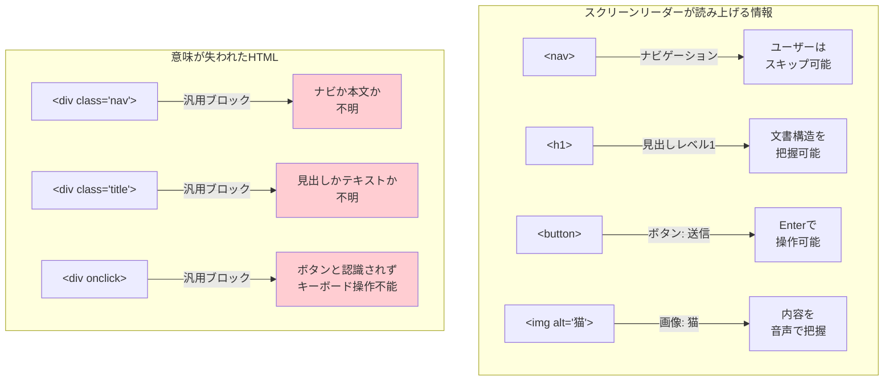
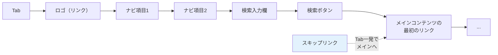
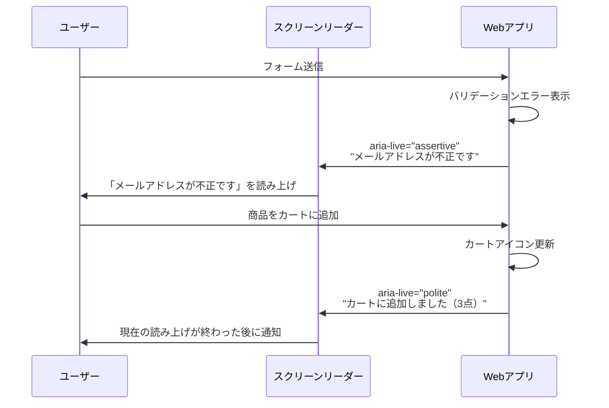
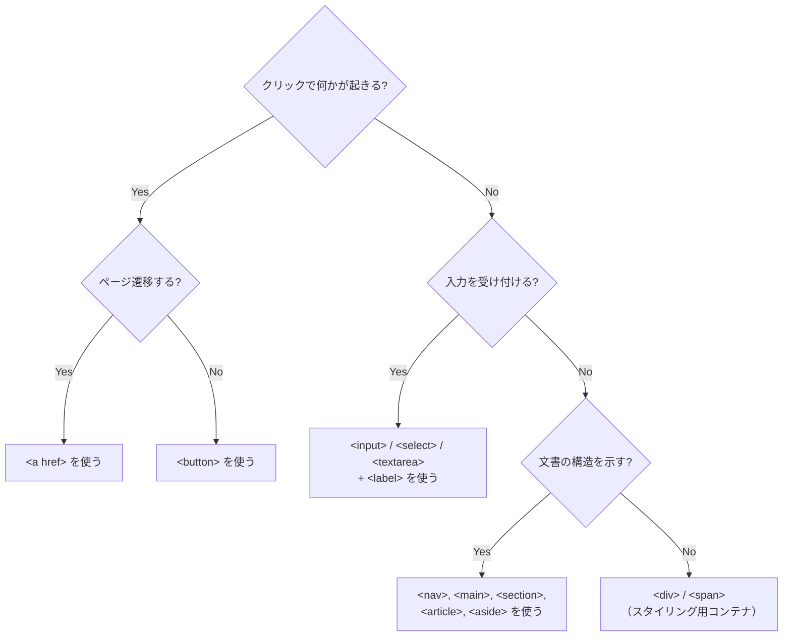

# アクセシビリティ（Accessibility / a11y）

> **一言で言うと:** アクセシビリティとは「全てのユーザーがWebコンテンツを知覚・操作・理解できる」ことを保証する設計。セマンティックHTMLが基盤であり、ARIA属性はその補完。法的要件でもある国が増えており、技術的課題であると同時にビジネス要件でもある。

## 3分で全体像

- **何を解決する技術か:** 視覚障害・運動障害・聴覚障害・認知障害を持つユーザーや、一時的な制約（片手しか使えない・明るい屋外・騒がしい環境）下のユーザーが、Webコンテンツを知覚・操作・理解できることを保証する。法的要件（米ADA・EU EAA・日本の障害者差別解消法）もカバーする
- **代表的な使用シーン:** あらゆる Web サービス、特に公的機関・大企業・教育機関・医療系のサイト、訴訟リスク回避（米国で年間4,600件超のWebアクセシビリティ訴訟）、SEO 改善、ユーザー基盤拡大
- **これだけは覚える3つ:**
    1. **セマンティック HTML が基盤、ARIA は補完** — `<button>` を使えば `<div role="button">` は不要。**「No ARIA is better than bad ARIA」** — 間違った ARIA は何もない方がマシ。WAI-ARIA の5つのルールの1番目「**ネイティブHTMLで表現できるなら、ARIAを使わない**」
    2. **キーボード操作が全ての基本** — 全インタラクティブ要素に Tab で到達でき、Enter/Space で操作でき、フォーカスが視覚的に見える状態。`outline: none` でフォーカス表示を消すのは禁止、`:focus-visible` でカスタマイズする
    3. **自動テストでは30〜40%しか検出できない** — axe-core / Lighthouse は重要だが、**スクリーンリーダー実機テスト**・**Tabキーのみで全ページ操作**・**200%ズーム** の手動テストが必須。残り60〜70%は機械的に検出不能
- **AIに任せやすいか:** **一部任せられる** — セマンティック HTML 提案・基本 ARIA 属性付与・コントラスト比チェックは AI が高品質に書ける。一方「**`<div onclick>` をボタンとして提案**」「**`tabindex="5"` のような正の値**」「**`aria-label` と可視テキストの不一致**」「**`outline: none`**」など AI のクセが頻発する。**WCAG 適合レベルの最終判断**・**スクリーンリーダー実機テスト**は人間が握る
- **詰まったらここを読む:** [[HTML-CSS-JS]] / [[コンポーネント設計]] / [[DOMと仮想DOM]]

## なぜ必要か

Webは「誰でもアクセスできる」ことを前提に設計されたメディアである。しかし実際には、多くのWebサイトが特定のユーザーを排除している:

- **視覚障害** — 全盲のユーザーはスクリーンリーダーで音声読み上げに依存する。セマンティクスのないHTMLでは「ボタン」「リンク」「見出し」の区別がつかない
- **運動障害** — マウスを使えないユーザーはキーボードのみで操作する。フォーカスが見えない、Tabで辿れないUIは操作不能
- **聴覚障害** — 動画の音声が字幕なしだと内容が伝わらない
- **認知障害** — 複雑すぎるUI、点滅するコンテンツ、一貫性のないナビゲーションは理解を困難にする
- **一時的な制約** — 片手が塞がっている、明るい屋外で画面が見えにくい、騒がしい環境で音声が聞こえないなど、障害がなくてもアクセシビリティの恩恵を受ける場面は多い

### 法的要件

| 地域 | 法律・規格 | 概要 |
|------|----------|------|
| 米国 | ADA Title III | 公衆向け事業（小売・教育・医療等の "places of public accommodation"）の Web も対象とされる判例が積み上がっている。**ただし連邦巡回区で解釈が分かれており、ADA 法文上は Web を直接含むと明文化されていない**点に注意（DOJ ガイダンスは段階的に整備中） |
| 米国 | Section 508 | 連邦政府機関と政府調達。民間企業に直接義務はないが、政府との取引では事実上強制 |
| EU | European Accessibility Act (EAA) | **2025年6月28日施行済み**。EU 圏内で提供される多くの民間 Web サービス・E コマースに適用 |
| 日本 | 障害者差別解消法 | **2024年4月改正で民間事業者にも合理的配慮の提供が義務化**。JIS X 8341-3（≒ WCAG 2.0/2.1）自体の準拠は法的義務化されていないが、合理的配慮の判断基準として参照される |

訴訟リスクが現実のものとなっており、2023年には米国で4,600件以上のWebアクセシビリティ訴訟が提起された。

> **WCAG のバージョン:** 業界の事実上の標準は WCAG 2.1 AA だったが、**WCAG 2.2 が 2023年10月に W3C 勧告**となり、Focus Not Obscured / Dragging Movements / Target Size (24×24) など 9 つの達成基準が追加された。EAA や各国の最新ガイドラインは WCAG 2.2 を参照する方向に移行中。新規プロジェクトは **WCAG 2.2 AA** を目標にするのが安全。

## どの問題を解決するか

### 問題1: セマンティクスの欠如 — 機械が意味を理解できない

スクリーンリーダーはDOMの構造と要素の**セマンティクス（意味）**に基づいて情報を伝える。`<div>` と `<span>` で構築されたUIは、視覚的には同じでも支援技術にとっては意味不明:


```mermaid
graph TD
    subgraph "スクリーンリーダーが読み上げる情報"
        A["&lt;nav&gt;"] -->|"ナビゲーション"| A1["ユーザーは<br/>スキップ可能"]
        B["&lt;h1&gt;"] -->|"見出しレベル1"| B1["文書構造を<br/>把握可能"]
        C["&lt;button&gt;"] -->|"ボタン: 送信"| C1["Enterで<br/>操作可能"]
        D["&lt;img alt='猫'&gt;"] -->|"画像: 猫"| D1["内容を<br/>音声で把握"]
    end

    subgraph "意味が失われたHTML"
        E["&lt;div class='nav'&gt;"] -->|"汎用ブロック"| E1["ナビか本文か<br/>不明"]
        F["&lt;div class='title'&gt;"] -->|"汎用ブロック"| F1["見出しかテキストか<br/>不明"]
        G["&lt;div onclick&gt;"] -->|"汎用ブロック"| G1["ボタンと認識されず<br/>キーボード操作不能"]
        style E1 fill:#ffcdd2
        style F1 fill:#ffcdd2
        style G1 fill:#ffcdd2
    end
```

### 問題2: キーボード操作の欠如

マウスが使えないユーザーはTab/Shift+Tab/Enter/Space/矢印キーでUIを操作する。以下が保証されていなければ操作不能:

| 要件 | 説明 |
|------|------|
| **フォーカス可能** | 全てのインタラクティブ要素にTabで到達できる |
| **フォーカス表示** | 現在フォーカスされている要素が視覚的に識別できる |
| **操作可能** | Enter/Spaceでボタンを押す、矢印キーでタブを切り替える等 |
| **論理的な順序** | Tab順序がDOMの順序と一致し、視覚的な配置と矛盾しない |
| **フォーカストラップ** | モーダル内にフォーカスを閉じ込め、背後のUIに移動させない |


```mermaid
flowchart LR
    A["Tab"] --> B["ロゴ（リンク）"]
    B --> C["ナビ項目1"]
    C --> D["ナビ項目2"]
    D --> E["検索入力欄"]
    E --> F["検索ボタン"]
    F --> G["メインコンテンツの<br/>最初のリンク"]
    G --> H["..."]

    I["スキップリンク"] -.->|"Tab一発で<br/>メインへ"| G
    style I fill:#e3f2fd
```

### 問題3: 動的UIのアクセシビリティ

SPAやリッチなインタラクションでは、DOMが動的に変化する。スクリーンリーダーは変化を自動的に察知できないため、**ライブリージョン（Live Region）**で変更を通知する必要がある:


```mermaid
sequenceDiagram
    participant U as ユーザー
    participant SR as スクリーンリーダー
    participant UI as Webアプリ

    U->>UI: フォーム送信
    UI->>UI: バリデーションエラー表示
    UI->>SR: aria-live="assertive"<br/>"メールアドレスが不正です"
    SR->>U: 「メールアドレスが不正です」を読み上げ

    U->>UI: 商品をカートに追加
    UI->>UI: カートアイコン更新
    UI->>SR: aria-live="polite"<br/>"カートに追加しました（3点）"
    SR->>U: 現在の読み上げが終わった後に通知
```

## WCAG — Webアクセシビリティの国際標準

WCAG（Web Content Accessibility Guidelines）はW3Cが策定するアクセシビリティの国際標準。4つの原則（POUR）に基づく:

| 原則 | 意味 | 例 |
|------|------|-----|
| **Perceivable（知覚可能）** | 情報が少なくとも1つの感覚で知覚できる | 画像にalt、動画に字幕、十分なコントラスト比 |
| **Operable（操作可能）** | UIがキーボード等で操作できる | Tab操作、十分な操作時間、発作を誘発しない |
| **Understandable（理解可能）** | 情報とUIが理解できる | 明確なラベル、一貫したナビゲーション、エラーの説明 |
| **Robust（堅牢）** | 様々な支援技術で正しく解釈できる | 有効なHTML、WAI-ARIAの正しい使用 |

適合レベルは3段階: **A**（最低限）→ **AA**（一般的な目標）→ **AAA**（最高水準）。法的要件の多くはAAレベルを要求する。最新は **WCAG 2.2**（2023年10月勧告）で、新規プロジェクトはこれを目標にする。

## ARIA — セマンティクスの補完

WAI-ARIA（Web Accessibility Initiative - Accessible Rich Internet Applications）は、ネイティブHTMLでは表現できないセマンティクスを追加する仕組み:

### ARIAの5つのルール

1. **ネイティブHTMLで表現できるなら、ARIAを使わない** — `<button>` があるのに `<div role="button">` を使うのは間違い
2. **ネイティブのセマンティクスを上書きしない** — `<h2 role="tab">` は見出しの意味を壊す
3. **インタラクティブなARIAロールにはキーボード操作を実装する** — `role="button"` を付けたらEnter/Spaceで動作させる
4. **フォーカス可能な要素を `aria-hidden="true"` にしない** — フォーカスは移るのにスクリーンリーダーが無視する矛盾
5. **インタラクティブな要素にはアクセシブルな名前を付ける** — `aria-label` または `<label>` で名前を提供する

### 主要なARIA属性

| 属性 | 目的 | 使用例 |
|------|------|--------|
| `role` | 要素の役割を明示 | `role="dialog"`, `role="tablist"` |
| `aria-label` | 要素に名前を付ける（テキスト直接指定） | `<button aria-label="メニューを閉じる">×</button>` |
| `aria-labelledby` | 別の要素のテキストで名前を付ける | `<dialog aria-labelledby="dialog-title">` |
| `aria-describedby` | 補足説明を関連付ける | `<input aria-describedby="password-hint">` |
| `aria-hidden` | 支援技術から要素を隠す | `<span aria-hidden="true">★</span>` 装飾用 |
| `aria-live` | 動的に変化する領域を通知 | `<div aria-live="polite">3件の新着メッセージ</div>` |
| `aria-expanded` | 開閉状態を伝える | `<button aria-expanded="true">メニュー</button>` |
| `aria-current` | 現在のアイテムを示す | `<a aria-current="page">ホーム</a>` |
| `aria-invalid` | 入力値が無効であることを伝える | `<input aria-invalid="true">` |

## 他の仕組みとどう関係するか

- **下位レイヤーとの関係:**
  - [[HTML-CSS-JS]] — セマンティックHTMLがアクセシビリティの**基盤**。`<nav>`, `<main>`, `<button>`, `<label>` などネイティブ要素のセマンティクスが支援技術に情報を提供する。CSSの `color`, `font-size` はコントラスト比と可読性に直結
  - [[マークアップ言語とHTML]] — HTMLのセマンティクスの理解がアクセシビリティの前提
- **同レイヤーとの関係:**
  - [[DOMと仮想DOM]] — 仮想DOMの差分更新がフォーカス管理に影響する。コンポーネントの再マウントでフォーカスが失われる問題
  - [[状態管理]] — UI状態（モーダル開閉、ローディング等）の変更を支援技術に伝達する必要がある（`aria-live`, `aria-busy`）
  - [[コンポーネント設計]] — アクセシビリティはコンポーネント設計時に組み込む。Headless UI ライブラリ（Radix UI, React Aria 等：**スタイルを持たず ARIA 属性とキーボード操作のみを提供するライブラリ**）はアクセシビリティを内蔵したコンポーネント基盤を提供する
- **上位レイヤーとの関係:**
  - [[Layer5-パフォーマンス/_index|パフォーマンス]]（Layer 5）— パフォーマンスの悪さ自体がアクセシビリティの障壁。低速なネットワークや古いデバイスを使うユーザーに不利
  - [[Layer6-セキュリティ/_index|セキュリティ]]（Layer 6）— CAPTCHAはアクセシビリティの大きな障壁。音声CAPTCHAやreCAPTCHA v3等の代替策が必要

## 誤解されやすいポイント

### 1. 「アクセシビリティ = スクリーンリーダー対応」

スクリーンリーダーは一部に過ぎない。アクセシビリティは以下の全てを含む:

- **キーボード操作** — マウスなしで全機能にアクセスできる
- **色のコントラスト** — WCAG AAで4.5:1以上（大きな文字は3:1以上）
- **テキストの拡大** — 200%拡大でもレイアウトが崩れない
- **モーション** — `prefers-reduced-motion` で不要なアニメーションを無効化
- **認知的負荷** — 明確なエラーメッセージ、一貫したナビゲーション
- **色だけに依存しない** — 「赤はエラー」ではなくアイコンやテキストでも伝える

### 2. 「ARIAを付ければアクセシブル」

ARIAは**ネイティブHTMLで表現できないものを補完する**手段。不正なARIAはアクセシビリティを悪化させる:

```html
<!-- ❌ ARIAの誤用 — ネイティブ要素で済むのにARIAを使う -->
<div role="button" tabindex="0" onclick="handleClick()"
     onkeydown="if(event.key==='Enter') handleClick()">
  送信
</div>

<!-- ✅ ネイティブHTML — ARIAなしで全ての機能が備わる -->
<button onclick="handleClick()">
  送信
</button>
<!-- buttonはデフォルトで: フォーカス可能、Enter/Space対応、
     スクリーンリーダーが「ボタン」と読み上げる -->
```

**「No ARIA is better than bad ARIA」** — 間違ったARIAを付けるぐらいなら、何も付けない方がマシ。

### 3. 「アクセシビリティは後から対応できる」

アクセシビリティはUIの構造に関わるため、後付けは大規模なリファクタリングを要する。特に:
- `<div>` ベースのカスタムコンポーネントを `<button>` や `<select>` に置き換える作業
- キーボードナビゲーションの追加（フォーカス管理の設計変更）
- カラーパレットの変更（コントラスト比の確保）

コンポーネント設計の初期段階でセマンティックHTMLを選択することが、最もコスト効率の良いアクセシビリティ対策。

### 4. 「`tabindex="0"` を全ての要素に付ければキーボード対応」

`tabindex="0"` はフォーカス可能にするだけで、**キーボード操作（Enter/Space/矢印キー）は自前で実装**する必要がある。ネイティブの `<button>`, `<a>`, `<input>` はこれらが組み込み済み:

```html
<!-- tabindex="0" だけではボタンとして機能しない -->
<div tabindex="0" onclick="handleClick()">送信</div>
<!-- Enter で発火しない、スクリーンリーダーが「ボタン」と認識しない -->

<!-- tabindex の値の意味 -->
<!-- tabindex="0"  → Tab順序にDOMの位置通り含める -->
<!-- tabindex="-1" → Tab順序から外すが、JSで focus() は可能 -->
<!-- tabindex="1+" → ❌ 使うべきでない（Tab順序がDOM順序と乖離） -->
```

## 設計のベストプラクティス

### セマンティックHTML チェックリスト


```mermaid
flowchart TD
    Q1{"クリックで何かが起きる?"} -->|Yes| Q2{"ページ遷移する?"}
    Q2 -->|Yes| A1["&lt;a href&gt; を使う"]
    Q2 -->|No| A2["&lt;button&gt; を使う"]
    Q1 -->|No| Q3{"入力を受け付ける?"}
    Q3 -->|Yes| A3["&lt;input&gt; / &lt;select&gt; / &lt;textarea&gt;<br/>+ &lt;label&gt; を使う"]
    Q3 -->|No| Q4{"文書の構造を示す?"}
    Q4 -->|Yes| A4["&lt;nav&gt;, &lt;main&gt;, &lt;section&gt;,<br/>&lt;article&gt;, &lt;aside&gt; を使う"]
    Q4 -->|No| A5["&lt;div&gt; / &lt;span&gt;<br/>（スタイリング用コンテナ）"]
```

### フォームのアクセシビリティ

```html
<!-- ✅ アクセシブルなフォーム -->
<form>
  <div>
    <!-- label と input を for/id で紐付け -->
    <label for="email">メールアドレス</label>
    <input
      id="email"
      type="email"
      required
      aria-describedby="email-hint email-error"
    />
    <p id="email-hint">例: user@example.com</p>
    <!-- エラーメッセージは aria-invalid + aria-describedby で関連付け -->
    <p id="email-error" role="alert">
      <!-- JSでエラー時に表示 -->
    </p>
  </div>

  <fieldset>
    <legend>通知の受け取り方法</legend>
    <!-- ラジオボタンのグループは fieldset + legend -->
    <label><input type="radio" name="notify" value="email" /> メール</label>
    <label><input type="radio" name="notify" value="sms" /> SMS</label>
    <label><input type="radio" name="notify" value="none" /> 受け取らない</label>
  </fieldset>

  <button type="submit">登録</button>
</form>
```

### モーダルのアクセシビリティ

モーダルは最もアクセシビリティの実装が難しいUIパターンの1つ:

```jsx
function Modal({ isOpen, onClose, title, children }) {
  const dialogRef = useRef(null);

  useEffect(() => {
    const dialog = dialogRef.current;
    if (!dialog) return;

    if (isOpen) {
      dialog.showModal();  // <dialog> のネイティブメソッド
      // showModal() は自動的に:
      // - フォーカストラップを実装
      // - 背景のスクロールを抑制
      // - Escapeキーで閉じる
      // - aria-modal="true" 相当の動作
    } else {
      dialog.close();
    }
  }, [isOpen]);

  return (
    <dialog
      ref={dialogRef}
      aria-labelledby="modal-title"
      onClose={onClose}
    >
      <header>
        <h2 id="modal-title">{title}</h2>
        <button onClick={onClose} aria-label="閉じる">×</button>
      </header>
      <div>{children}</div>
    </dialog>
  );
}
```

**HTML `<dialog>` 要素**は、モーダルに必要なアクセシビリティ機能の大部分をネイティブに提供する。カスタム実装よりも `<dialog>` の使用を優先すべき。

### コントラスト比とカラー設計

```css
/* ✅ prefers-reduced-motion を尊重する */
@media (prefers-reduced-motion: reduce) {
  *,
  *::before,
  *::after {
    animation-duration: 0.01ms !important;
    animation-iteration-count: 1 !important;
    transition-duration: 0.01ms !important;
  }
}

/* ✅ prefers-color-scheme でダークモード対応 */
@media (prefers-color-scheme: dark) {
  :root {
    --color-text: #e2e8f0;
    --color-bg: #1a202c;
    /* コントラスト比 4.5:1 以上を維持 */
  }
}

/* ✅ フォーカス表示を消さない — カスタマイズは可 */
:focus-visible {
  outline: 2px solid var(--color-primary);
  outline-offset: 2px;
}
/* focus-visible はキーボード操作時のみ表示（マウスクリックでは非表示） */
```

## AIエージェントとの協働

> このトピックでAIコーディングエージェント（Claude Code, Copilot, Cursor 等）と協働するための観点。
> セマンティック HTML 提案・基本 ARIA 属性付与は AI に任せやすい一方、**「`<div onclick>` をボタンとして提案」「`outline: none`」「`aria-label` と可視テキスト不一致」「`tabindex` 正の値」「`<dialog>` を使わずカスタムモーダル」** が頻出。レビューもAIコードレビュー観点で横断アンチパターン照合に任せられる。**WCAG 適合の最終判断とスクリーンリーダー実機テストは人間**。

### AIに任せられる部分 / 人間が判断すべき部分

| タスク種類 | 任せ方（実装/レビュー） | 人間の関与 |
|---|---|---|
| セマンティック要素の選択 (`<button>` vs `<a>` vs `<div>`) | AI 実装、AIコードレビュー観点でレビュー | UX 上の意図（ページ遷移か操作か）は人間判断 |
| 基本的な ARIA 属性付与（`aria-label`、`aria-expanded`） | AI に任せる | ARIA Authoring Practices に沿った設計、過剰な ARIA の判別は人間 |
| キーボード操作の実装（Tab・矢印キー・Esc） | AI に WAI-ARIA APG パターンを参照させる | 実機テスト（実際のキーボード操作で問題ないか）は人間 |
| コントラスト比チェック | AI が計算 | WCAG AA (4.5:1) / AAA (7:1) のどちらに準拠するかは要件で決める |
| Headless UI ライブラリ（Radix UI / React Aria）の利用 | AI が雛形 | ライブラリ選定はチームスキル・デザイン要件で人間判断 |
| `prefers-reduced-motion` / `prefers-color-scheme` 対応 | AI に任せる | 「アニメーションをどこまで削るか」のデザイン判断は人間 |
| **WCAG 適合レベルの最終判断 / スクリーンリーダー実機テスト** | AI に任せられない | NVDA / VoiceOver / TalkBack で実際に操作確認は人間が行う |

### AI生成コードのレビュー観点（このトピック固有）

AI生成のUIコードを受け取ったとき、最低限ここを見る。

1. **ネイティブ要素の代用と `aria-*` の不適切使用** — `<div onclick>` をボタンとして提案していないか、`<button>` で済むのに `<div role="button" tabindex="0" onkeydown>` を書いていないか。**「No ARIA is better than bad ARIA」** に従い、ネイティブ要素を優先。`<dialog>` 要素を使えるのに自前モーダル（フォーカストラップを手動実装）をしていないか
2. **キーボード操作とフォーカス可視性** — `outline: none` でフォーカスを消していないか（`:focus-visible` でカスタマイズ）。`tabindex="1"` などの正の値で Tab 順序を歪めていないか（`0` か `-1` のみ使用）。モーダル内のフォーカストラップ、矢印キーでのタブ間移動が WAI-ARIA Authoring Practices に沿っているか
3. **アクセシブルな名前と入力支援の欠落** — `` に `alt` 属性、`<input>` に `<label for>`、`aria-label` と可視テキストの一致（音声操作ユーザがボタン名で操作できる）、フォームのバリデーションエラーが `aria-invalid` + `aria-describedby` で関連付けられているか、ライブリージョン（`aria-live`）で動的変更を通知しているか

### 効くプロンプトの型

このトピックに関する実装をAIに依頼するとき、コンテキストとして渡すべき情報・制約・成功基準のテンプレ。

```
# 前提（プロジェクトの状況・既存のコード規約）
- WCAG 適合レベル: 2.2 AA 準拠 (新規プロジェクトはこちら、既存は 2.1 AA から段階移行)
- ターゲットユーザー: スクリーンリーダー使用者・キーボードのみのユーザーを含む
- フレームワーク: React 19 / Vue 3 / Svelte 5 など
- 利用ライブラリ: Radix UI / React Aria / Headless UI (採用推奨)
- 自動テスト: axe-core + Lighthouse Accessibility CI

# やってほしいこと
- 「{要件}」の UI コンポーネントを実装
- アクセシビリティ要件を満たす属性・キーボード操作・ARIA を含めて提示

# 守ってほしい制約（このトピック固有のもの）
- ネイティブHTML 要素を優先 (<button>, <a href>, <input> + <label>, <dialog>)
- ARIA は「ネイティブで表現できないとき」のみ使用
- フォーカス表示は :focus-visible でカスタマイズ (outline: none 単体は禁止)
- tabindex は 0 または -1 のみ (正の値は禁止)
- すべてのインタラクティブ要素にアクセシブルな名前 (aria-label / <label>)
- 動的な内容変更は aria-live で通知 (バリデーションエラー = role="alert")
- カラーコントラスト 4.5:1 以上 (WCAG AA)、色だけに依存しない
- prefers-reduced-motion を尊重
- 矢印キー / Esc / Tab の操作は WAI-ARIA APG パターンに従う

# 完了の判断基準
- axe-core で 0 violations
- Lighthouse Accessibility 90以上
- Tab だけでページ全体を操作できる
- 200% ズームでもレイアウト崩れなし
- スクリーンリーダー (NVDA / VoiceOver) での読み上げが意図通り
```

### AI実装のアンチパターン

LLM生成コードで頻出する過剰設計・誤用パターン。レビュー時の照合表として使う。

| アンチパターン | なぜ問題か | レビュー観点 / 対策 |
|---|---|---|
| `<div onclick>` をボタンとして使用 | フォーカス不能、キーボード操作不能、ロール未定義 | `<button>` を使う |
| `<div role="button" tabindex="0" onkeydown>` の自前実装 | ネイティブ `<button>` を使えば全部組み込み | `<button>` を使う（「No ARIA is better than bad ARIA」） |
| `outline: none` でフォーカス表示を削除 | キーボードユーザがフォーカス位置を見失う | `:focus-visible` でカスタムスタイル |
| `tabindex="1"` 等の正の値 | Tab 順序が DOM 順序と乖離、予測不能 | `0` または `-1` のみ使用 |
| `` に `alt` 属性なし | スクリーンリーダーがファイル名読み上げ、SEO 不利 | 意味のある画像は説明、装飾は `alt=""` |
| `aria-label` と可視テキストの不一致 | 音声操作ユーザが「送信ボタン」と言ってもラベル違いで反応しない | 可視テキストと `aria-label` を一致させる |
| フォーム `<input>` に `<label>` なし | スクリーンリーダーが入力欄の目的を伝えられない | `<label for="id">` で紐付け、または `aria-label` |
| ネイティブ `<dialog>` を使わず自前モーダル | フォーカストラップ・Esc 閉じ・aria-modal を全部自前実装でバグの温床 | `<dialog>` + `showModal()` でネイティブ機能を活用 |
| `prefers-reduced-motion` 無視のアニメーション | 前庭障害ユーザに健康被害、操作不能 | `@media (prefers-reduced-motion: reduce)` で抑制 |
| 色だけでエラーを表現（赤い枠だけ） | 色覚異常ユーザに伝わらない | アイコン・テキスト・パターンを併用 |
| バリデーションエラーが視覚的にだけ表示 | スクリーンリーダーが気付かない | `role="alert"` または `aria-live="assertive"` で通知 |
| 巨大なフォーカストラップ（モーダル外もフォーカス可能） | キーボードユーザが背後の要素にフォーカス可能になり混乱 | `<dialog>` 使用、または focus-trap-react などで境界制御 |
| キーボード操作を考えず矢印キーを未対応 | タブ UI・メニュー・コンボボックスで操作不能 | WAI-ARIA Authoring Practices Guide のパターンに従う |
| ライブリージョン未使用で動的変更を通知しない | スクリーンリーダーが変化を察知できない | `aria-live="polite"` (通常) / `assertive` (緊急) を適用 |

→ レイヤー横断のアンチパターン索引: [[_anti-patterns/_index|AIアンチパターン索引]] / [[_anti-patterns/レイヤー別/Layer4-Frontend|Layer 4 Frontend アンチパターン集]]

## 具体例

### アクセシブルなタブUI

```jsx
function Tabs({ tabs }) {
  const [activeIndex, setActiveIndex] = useState(0);

  const handleKeyDown = (e, index) => {
    let newIndex;
    switch (e.key) {
      case 'ArrowRight':
        newIndex = (index + 1) % tabs.length;
        break;
      case 'ArrowLeft':
        newIndex = (index - 1 + tabs.length) % tabs.length;
        break;
      case 'Home':
        newIndex = 0;
        break;
      case 'End':
        newIndex = tabs.length - 1;
        break;
      default:
        return;
    }
    e.preventDefault();
    setActiveIndex(newIndex);
    // フォーカスを移動
    document.getElementById(`tab-${newIndex}`)?.focus();
  };

  return (
    <div>
      {/* タブリスト — 矢印キーで切り替え */}
      <div role="tablist" aria-label="コンテンツタブ">
        {tabs.map((tab, i) => (
          <button
            key={i}
            id={`tab-${i}`}
            role="tab"
            aria-selected={i === activeIndex}
            aria-controls={`panel-${i}`}
            tabIndex={i === activeIndex ? 0 : -1}
            onClick={() => setActiveIndex(i)}
            onKeyDown={(e) => handleKeyDown(e, i)}
          >
            {tab.label}
          </button>
        ))}
      </div>

      {/* タブパネル */}
      {tabs.map((tab, i) => (
        <div
          key={i}
          id={`panel-${i}`}
          role="tabpanel"
          aria-labelledby={`tab-${i}`}
          hidden={i !== activeIndex}
          tabIndex={0}
        >
          {tab.content}
        </div>
      ))}
    </div>
  );
}

// 使用例
<Tabs tabs={[
  { label: '概要', content: <p>概要テキスト</p> },
  { label: 'レビュー', content: <p>レビュー一覧</p> },
  { label: '仕様', content: <p>スペック表</p> },
]} />
```

**ポイント:**
- `role="tablist"` / `role="tab"` / `role="tabpanel"` のARIAパターン
- `aria-selected` で選択中のタブを示す
- 非アクティブなタブは `tabIndex={-1}` でTabフロウから外す
- 矢印キーでタブ間を移動（WAI-ARIA Authoring Practicesのタブパターン）

### アクセシビリティのテスト

```javascript
// axe-core による自動テスト（Jest + Testing Library）
import { render } from '@testing-library/react';
import { axe, toHaveNoViolations } from 'jest-axe';

expect.extend(toHaveNoViolations);

test('フォームにアクセシビリティ違反がないこと', async () => {
  const { container } = render(<LoginForm />);
  const results = await axe(container);
  expect(results).toHaveNoViolations();
});
```

```bash
# Lighthouse CLI によるアクセシビリティ監査
npx lighthouse https://example.com --only-categories=accessibility --output=json
```

**自動テストでは全体の30-40%しか検出できない。** 以下は手動テストが必要:

| テスト方法 | 検出できる問題 |
|-----------|-------------|
| **Tabキーで全ページを操作** | フォーカス順序、フォーカストラップ、操作不能な要素 |
| **スクリーンリーダー使用** | 読み上げ内容の妥当性、ライブリージョン |
| **ブラウザのズーム200%** | レイアウト崩れ、テキストの切り詰め |
| **カラーコントラストチェッカー** | コントラスト比の不足 |
| **キーボードのみで操作** | マウスでしか操作できないUI |

## 参考リソース

- [WAI-ARIA Authoring Practices Guide (APG)](https://www.w3.org/WAI/ARIA/apg/) — タブ、メニュー、ダイアログ等のアクセシブルなUIパターン集
- [MDN: アクセシビリティ](https://developer.mozilla.org/ja/docs/Web/Accessibility) — Web標準ベースのアクセシビリティガイド
- [axe-core](https://github.com/dequelabs/axe-core) — 自動アクセシビリティテストエンジン
- [Inclusive Components](https://inclusive-components.design/) — Heydon Pickeringによるアクセシブルなコンポーネントパターン集
- 書籍:『Webアプリケーションアクセシビリティ』（伊原力也他）— 日本語での実践的なアクセシビリティ解説

## 理解度セルフチェック

> 答えられなければ本文に戻る。答えはこのファイル内に必ずある。

1. **「No ARIA is better than bad ARIA」とはどういう意味か、30秒で説明せよ。** ARIA を使う前に何を確認すべきか、WAI-ARIA の5つのルールに触れて答えよ。
2. **「自動テスト（axe-core / Lighthouse）でアクセシビリティ違反0なら大丈夫」はなぜ誤りか?** 自動テストでは検出できないものを最低3つ挙げ、それぞれどう確認するか述べよ。
3. **AI生成コードレビュー設問:** AI が以下のドロップダウンメニューコンポーネントを生成した。本文の観点で **問題点を最低3つ** 指摘せよ。

```jsx
import { useState } from 'react';

function DropdownMenu({ items }) {
  const [isOpen, setIsOpen] = useState(false);

  return (
    <div style={{ position: 'relative' }}>
      <div
        onClick={() => setIsOpen(!isOpen)}
        style={{
          padding: '8px 16px',
          background: '#06f',
          color: 'white',
          cursor: 'pointer',
          outline: 'none',
        }}
      >
        メニュー ▼
      </div>
      {isOpen && (
        <div style={{ position: 'absolute', top: '100%', background: 'white', border: '1px solid #ddd' }}>
          {items.map((item, i) => (
            <div
              key={i}
              tabIndex={1}
              onClick={() => {
                item.onClick();
                setIsOpen(false);
              }}
              style={{ padding: '8px 16px' }}
            >
              <span style={{ color: '#999' }}>{item.label}</span>
              {item.icon && }
              {item.isDanger && <span style={{ color: '#fcc' }}>⚠</span>}
            </div>
          ))}
        </div>
      )}
    </div>
  );
}

// 使用例
<DropdownMenu items={[
  { label: '編集', onClick: handleEdit },
  { label: '削除', icon: '/trash.svg', isDanger: true, onClick: handleDelete },
]} />
```

> [!note]- 解答の指針
>
> > [!info] 用語ミニ辞典
> > - **WCAG (Web Content Accessibility Guidelines):** W3C が策定する Web アクセシビリティの国際標準。4つの原則（POUR: Perceivable / Operable / Understandable / Robust）と、3つの適合レベル（A / AA / AAA）。法的要件の多くは AA レベル。**最新は WCAG 2.2（2023年10月勧告）**で、Focus Not Obscured / Dragging Movements / Target Size (24×24) など9基準が追加された
> > - **WAI-ARIA:** Web Accessibility Initiative の Accessible Rich Internet Applications 仕様。ネイティブ HTML で表現できないセマンティクスを補完する `role` / `aria-*` 属性
> > - **WAI-ARIA Authoring Practices Guide (APG):** タブ・メニュー・ダイアログ・コンボボックスなどの**標準的なアクセシブル UI パターン**集。キーボード操作の規約も明記されている
> > - **セマンティック HTML:** 要素自体が「意味」を持つ HTML。`<button>` `<nav>` `<main>` `<label>` `<dialog>` など。ネイティブにフォーカス可能、キーボード操作可能、スクリーンリーダーが正しく読み上げる機能が組み込み
> > - **「No ARIA is better than bad ARIA」:** 「間違った ARIA を付けるくらいなら、何も付けない方がマシ」という原則。誤った ARIA は支援技術を混乱させ、ネイティブの挙動も上書きしてしまう
> > - **`role="button"` + `tabindex="0"` + `onkeydown`:** `<div>` をボタン化する自前実装。`<button>` を使えば全部不要。WAI-ARIA の5つのルールの1番目「ネイティブHTMLで表現できるならARIAを使わない」に違反
> > - **フォーカス可能 (Focusable):** Tab キーで到達できる状態。ネイティブの `<button>` `<a href>` `<input>` などはデフォルトでフォーカス可能。`tabindex="0"` で他要素もフォーカス可能にできる（ただしキーボード操作は別途実装が必要）
> > - **`tabindex="-1"`:** Tab 順序からは外すが、JS から `element.focus()` で明示的にフォーカス可能にする。モーダル内の最初の要素にフォーカスを移すときなどに使用
> > - **`tabindex="1"` 以上の正の値:** Tab 順序を強制的に変更する。**使うべきでない**。DOM 順序と Tab 順序が乖離して予測不能になり、数が増えると管理不能。`0` か `-1` のみ
> > - **`:focus-visible`:** **キーボード操作時のみ**フォーカス表示する CSS 擬似クラス。`outline: none` と組み合わせて、マウスクリック時はフォーカスリング非表示、キーボード操作時はカスタムリング表示、を両立できる
> > - **アクセシブルな名前 (Accessible Name):** スクリーンリーダーが要素を識別する名前。`<label>` のテキスト、`aria-label` の値、`aria-labelledby` で参照したテキストなどから決定される
> > - **`aria-live`:** 動的に変化する領域を支援技術に通知する属性。`polite` (現在の読み上げ完了後に通知) / `assertive` (即座に通知、エラーなど) / `off` (通知しない)
> > - **`role="alert"`:** `aria-live="assertive"` 相当の即時通知ロール。フォームバリデーションエラーなどに使う
> > - **コントラスト比:** 文字色と背景色の明度差の比率。WCAG AA は 4.5:1 以上（大きな文字は 3:1）、AAA は 7:1 以上
> > - **Headless UI:** Radix UI / React Aria / Headless UI（Tailwind 製）など、見た目を持たずアクセシビリティ・キーボード操作・ARIA 属性のみを提供するライブラリ
> > - **axe-core:** Deque Systems が提供する自動アクセシビリティテストエンジン。React Testing Library / Cypress / Playwright と組み合わせて CI で違反を検出。`jest-axe` でテストに統合できる
> > - **Lighthouse Accessibility:** Chrome DevTools / CI に組み込まれているアクセシビリティ自動監査ツール。0〜100 のスコアと違反項目を返す。axe-core を内部で利用
> > - **200% ズーム:** ブラウザのページズーム機能を 200% に上げたときに、レイアウトが崩れず操作可能であること。WCAG 1.4.4 (Resize Text) と 1.4.10 (Reflow) の要件で、視力低下ユーザの基本的な配慮
> > - **NVDA / VoiceOver / TalkBack:** 主要なスクリーンリーダー。NVDA は Windows の無料デファクトスタンダード、VoiceOver は macOS/iOS 標準、TalkBack は Android 標準。実機テストの定番
>
> 1. 「No ARIA is better than bad ARIA」とは、**間違った ARIA を付けるくらいなら何も付けない方がマシ**という意味。誤った ARIA はスクリーンリーダーを混乱させたり、ネイティブの挙動を上書きして壊したりする。ARIA を使う前に **WAI-ARIA の5つのルール**を確認すべき: (1) **ネイティブHTMLで表現できるならARIAを使わない**（`<button>` があるのに `<div role="button">` は禁止）、(2) **ネイティブのセマンティクスを上書きしない**（`<h2 role="tab">` は見出しの意味を壊す）、(3) **インタラクティブな ARIA ロールにはキーボード操作を実装する**（`role="button"` を付けたら Enter/Space で動作するよう自前実装）、(4) **フォーカス可能な要素を `aria-hidden="true"` にしない**（フォーカスは移るのに読み上げられない矛盾）、(5) **インタラクティブな要素にはアクセシブルな名前を付ける**（`aria-label` または `<label>` で）。基本方針は「**まずネイティブ HTML、それで足りないときだけ ARIA で補完**」。Headless UI ライブラリを使えば、これらのルールが内蔵された状態から始められて遥かに安全
> 2. axe-core / Lighthouse は重要だが、**全体の30〜40% しか検出できない**。残り60〜70% は手動テストが必要。検出できない例: (a) **`alt="image"` のような不適切な代替テキスト** — 属性が存在することは検出できるが、内容の妥当性は判定不能、(b) **キーボードでの操作可能性** — Tab キーで全要素に到達できるか、フォーカストラップが正しいか、矢印キーでの操作が APG パターンに従うかは実機検証が必要、(c) **スクリーンリーダーでの読み上げの自然さ** — 順序が論理的か、見出しレベルが正しい階層か、ARIA ライブリージョンの通知タイミングが適切か、(d) **コントラスト比の文脈依存性** — 背景画像の上のテキスト、ホバー時の色、フォーカス時のリングなど、動的な状態のコントラスト、(e) **コンテンツの理解しやすさ** — エラーメッセージが具体的か、ナビゲーションが一貫しているか、(f) **200% ズーム時のレイアウト** — テキスト切り詰め・横スクロール発生は機械的判定が難しい。確認方法: (a) **Tab キーのみで全ページ操作**（マウス禁止）、(b) **NVDA / VoiceOver / TalkBack の実機テスト**、(c) **ブラウザのズーム 200% で全機能の動作確認**、(d) **手動コントラストチェッカー**（DevTools の Color Picker、WebAIM Contrast Checker）、(e) **キーボードショートカット干渉テスト**（OS / ブラウザのショートカットと衝突しないか）
> 3. AI生成コードの問題点（最低限以下を指摘できれば本文を理解している）:
>     - **`<div onClick>` をボタンとして使用** — フォーカス不能・Enter/Space 非対応・スクリーンリーダーがボタンと認識しない。`<button>` を使う
>     - **`<button>` 相当の要素に `aria-haspopup` `aria-expanded` がない** — メニューを開くボタンであることが伝わらない。`aria-haspopup="menu"` `aria-expanded={isOpen}` `aria-controls="menu-id"` が必要
>     - **メニュー内の各項目が `<div>` + `onClick`** — `<button>` か `role="menuitem"` を使うべき。さらに矢印キーでの項目間移動が未実装（WAI-ARIA APG のメニューパターンに違反）
>     - **`tabindex={1}` の正の値** — Tab 順序が DOM 順序と乖離して予測不能。各メニュー項目は `tabindex="-1"` にして、JS で `focus()` を制御するのがメニューパターンの定石
>     - **`outline: 'none'` でフォーカス表示削除** — キーボードユーザがフォーカス位置を見失う。`:focus-visible` でカスタムスタイルを当てるべき
>     - **Esc キーでメニューが閉じない** — メニューパターンでは Esc で閉じる挙動が必須。`onKeyDown` で `key === 'Escape'` を検知
>     - **メニュー外クリックで閉じる挙動がない** — UX として期待される挙動が未実装
>     - **「削除」項目のテキストが薄い `color: '#999'`** — 通常テキスト #999 の背景白なら4.5:1 を切る可能性が高く、コントラスト比 WCAG AA 不適合
>     - **`isDanger` を `color: '#fcc'`（薄ピンク）でだけ表現** — 「色だけに依存しない」原則違反。色覚異常ユーザに伝わらない。`⚠` 絵文字 + テキスト「危険な操作」など併用
>     - **`` に `alt` 属性なし** — スクリーンリーダーがファイル名読み上げ、SEO 不利。意味があるなら `alt="削除アイコン"`、装飾なら `alt=""`
>     - **メニューに `role="menu"` がない** — `role="menu"` を Container に、`role="menuitem"` を各項目に付与する WAI-ARIA Menu パターンに違反
>     - **インラインスタイル乱用** — メンテ困難・コントラスト改修が連鎖的になる。CSSクラスベースに
>     - **より良い解: Radix UI の `<DropdownMenu>` / React Aria の `useMenu` を使う** — フォーカストラップ・矢印キー操作・Esc 閉じ・外側クリック閉じ・aria-* 属性すべて内蔵

## 学習メモ

- 「アクセシビリティ対応」は特別な追加作業ではなく、**正しいHTMLを書くことの延長**。セマンティックHTMLを使えば、自動的に多くのアクセシビリティ要件を満たす
- Headless UIライブラリ（Radix UI、React Aria、Headless UI）を使えば、アクセシビリティが組み込まれた状態からカスタムスタイリングを始められる。自前でARIAパターンを実装するよりも遥かに安全
- `<dialog>` 要素のブラウザサポートが十分に広がったことで、モーダルのアクセシビリティ実装が大幅に簡素化された
