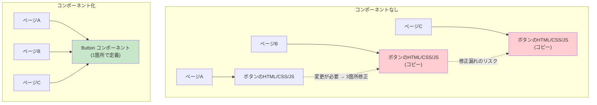
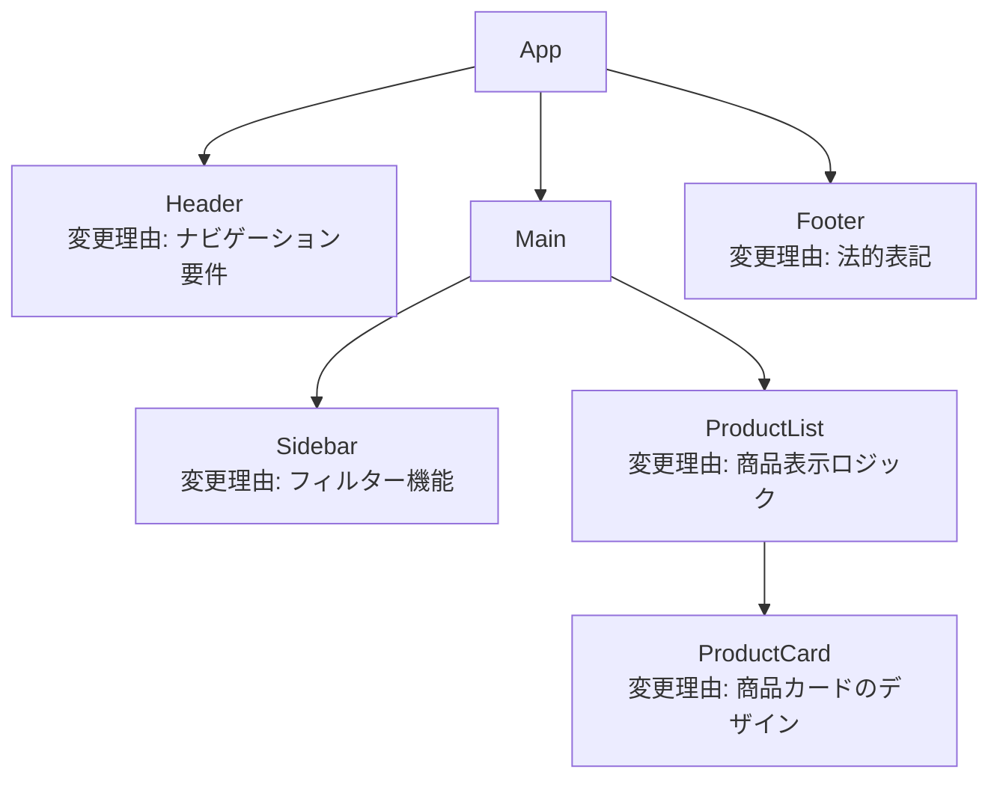
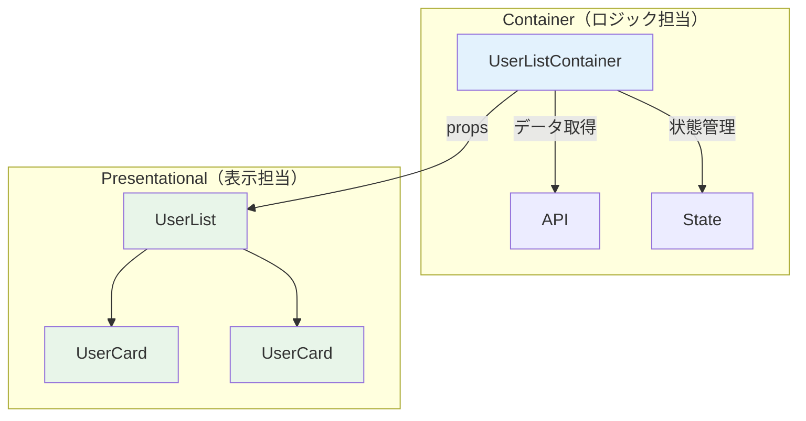
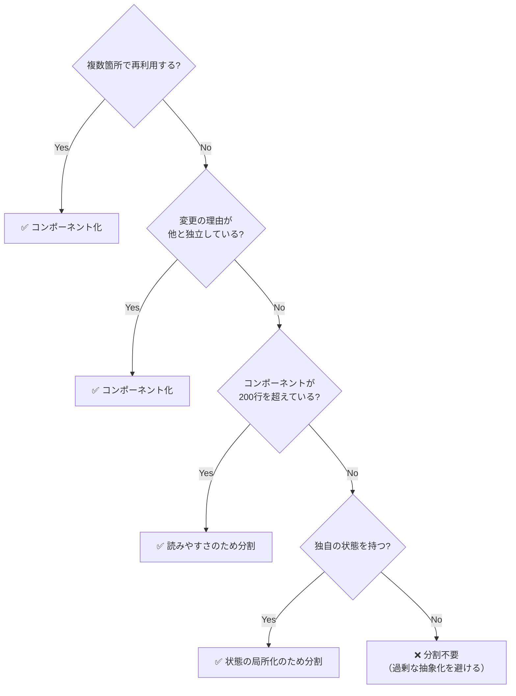
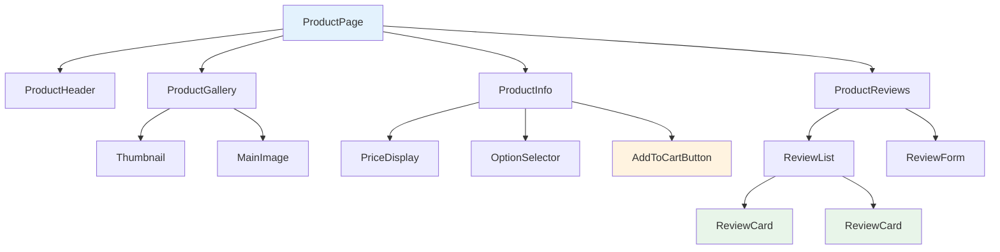

# コンポーネント設計

> **一言で言うと:** コンポーネントとはUIを再利用可能な独立した部品に分割する設計手法。「このUIの単位をどう分割するか」の判断基準は**単一責任原則** — 「変更の理由が1つ」になる粒度でコンポーネントを切ること。

## なぜ必要か

コンポーネントという概念がなければ、フロントエンドは以下の問題に直面する:

- **コードの重複** — ヘッダー、ボタン、カードなど同じUIパターンが複数ページに登場するたびに、HTML/CSS/JSを丸ごとコピーする。1箇所の変更を全ページに反映し忘れるとUIが不整合になる
- **変更の波及範囲が不明** — 1000行のHTMLファイルでボタンのスタイルを変えると、他のどこに影響するか分からない。CSSのグローバルスコープがこの問題を悪化させる
- **チーム開発の阻害** — ファイルが巨大な1枚岩だと、複数人が同時に作業してコンフリクトが頻発する。コンポーネントに分割すれば、各メンバーが独立した単位で作業できる
- **テスト不能** — UIロジックが分離されていないと、「このボタンをクリックしたらどうなるか」を個別にテストできない

## どの問題を解決するか

### 問題1: UIの再利用性

同じ見た目・振る舞いのUIを複数箇所で使うとき、コピー&ペーストではなくコンポーネントとして抽象化する:



### 問題2: 関心の分離と変更の局所化

コンポーネントは**変更の理由**によってUIを分割する。ヘッダー・サイドバー・本文の変更はそれぞれ独立しており、互いに影響しない:



### 問題3: 状態の局所化

コンポーネントが[[状態管理|状態]]を内部に閉じ込めることで、アプリ全体の複雑さを管理可能な単位に分解する:

```jsx
// Accordionの開閉状態は、このコンポーネント内で完結する
function Accordion({ title, children }) {
  const [isOpen, setIsOpen] = useState(false);
  return (
    <div>
      <button onClick={() => setIsOpen(!isOpen)}>{title}</button>
      {isOpen && <div>{children}</div>}
    </div>
  );
}
// 他のコンポーネントは Accordion の開閉状態を知る必要がない
```

## コンポーネントの分類

### Presentational vs Container（表示 vs ロジック）



| 分類 | 責務 | 特徴 |
|------|------|------|
| **Presentational** | 見た目のレンダリング | propsを受け取って表示するだけ。状態を持たない（または表示用の一時的な状態のみ） |
| **Container** | データ取得・状態管理・ビジネスロジック | APIを呼び、stateを管理し、Presentationalにpropsを渡す |

**注意:** React Hooksの登場以降、この分類は厳密に守る必要はなくなった。カスタムHookでロジックを抽出する方が柔軟な場合が多い。ただし「表示とロジックの分離」という原則自体は依然として有効。

### Controlled vs Uncontrolled

フォーム要素の設計で頻出するパターン:

```jsx
// Controlled — 親が状態を管理する
function ControlledInput({ value, onChange }) {
  return <input value={value} onChange={onChange} />;
}
// 親: <ControlledInput value={name} onChange={e => setName(e.target.value)} />

// Uncontrolled — 要素自身がDOMに状態を持つ
function UncontrolledInput({ defaultValue }) {
  const ref = useRef(null);
  return <input ref={ref} defaultValue={defaultValue} />;
}
// 親: ref.current.value で値を取得
```

| 観点 | Controlled | Uncontrolled |
|------|-----------|-------------|
| 状態の所在 | 親コンポーネント（React state） | DOM自身 |
| リアルタイムバリデーション | 可能 | 困難 |
| フォーム送信時の値取得 | stateから直接 | refでDOMを参照 |
| 適切な場面 | 多くの場合こちらが推奨 | 単純なフォーム、サードパーティ統合 |

## コンポーネント分割の判断基準

「どこでコンポーネントを切るか」の判断は、以下の基準で行う:



### 分割の実例 — ECサイト商品ページ



| コンポーネント | 分割理由 |
|-------------|---------|
| ProductGallery | 画像表示ロジック（スワイプ、ズーム）が独自の状態と責務を持つ |
| PriceDisplay | 通貨フォーマット、割引計算など価格表示の関心事が独立 |
| AddToCartButton | カート追加のロジックとローディング状態を局所化 |
| ReviewCard | 同じ構造のカードが繰り返し表示される（再利用） |
| ReviewForm | フォームの入力状態とバリデーションを局所化 |

## 他の仕組みとどう関係するか

- **下位レイヤーとの関係:**
  - [[HTML-CSS-JS]] — コンポーネントはHTML/CSS/JSの3つを**1つの単位に再パッケージ化**したもの。セマンティックHTMLの選択はコンポーネント内部でも重要
- **同レイヤーとの関係:**
  - [[DOMと仮想DOM]] — コンポーネントは仮想DOMの再レンダリング単位。コンポーネントの粒度が再レンダリングの範囲に直結する
  - [[状態管理]] — 「この状態はどのコンポーネントが持つべきか」がコンポーネント設計と状態管理の交差点。状態のリフトアップはコンポーネント境界を変更する
  - [[アクセシビリティ]] — コンポーネントのアクセシビリティは設計時に組み込む。後付けは困難
- **上位レイヤーとの関係:**
  - [[Layer5-パフォーマンス/_index|パフォーマンス]]（Layer 5）— 不要な再レンダリングの回避はコンポーネント設計の問題。`React.memo`、コンポーネント分割によるレンダリング範囲の限定
  - [[Layer7-設計アーキテクチャ/_index|設計]]（Layer 7）— 単一責任原則（SRP）がコンポーネントの粒度を決める。SOLID原則のフロントエンドへの適用

## 誤解されやすいポイント

### 1. 「小さいほど良い」— 過剰な分割

1つの `<div>` をラップしただけのコンポーネントや、10行のJSXを別ファイルに切り出すのは過剰。コンポーネント数の増加はそれ自体がコスト（ファイル数増加、props の設計、型定義、importの管理）:

```jsx
// ❌ 過剰な分割
function UserNameText({ name }) {
  return <span className="user-name">{name}</span>;
}
function UserEmailText({ email }) {
  return <span className="user-email">{email}</span>;
}
function UserCard({ user }) {
  return (
    <div>
      <UserNameText name={user.name} />
      <UserEmailText email={user.email} />
    </div>
  );
}

// ✅ 適切な粒度 — 1つのコンポーネントで十分
function UserCard({ user }) {
  return (
    <div>
      <span className="user-name">{user.name}</span>
      <span className="user-email">{user.email}</span>
    </div>
  );
}
```

**分割が正当化される条件:** 再利用される、独立した状態を持つ、テストを個別に書きたい、変更の理由が異なる — のいずれかが当てはまること。

### 2. 「propsが多い = 設計が悪い」

propsが多いこと自体は問題ではない。問題なのは**関心の異なるpropsが混在している**とき:

```jsx
// ❌ 関心が混在 — ユーザー情報とレイアウト設定が同列
<UserCard
  name={user.name}
  email={user.email}
  avatar={user.avatar}
  cardWidth={300}
  showBorder={true}
  borderColor="#ccc"
  onEdit={handleEdit}
  onDelete={handleDelete}
/>

// ✅ 関心ごとにオブジェクトにまとめる
<UserCard
  user={user}
  actions={{ onEdit: handleEdit, onDelete: handleDelete }}
/>
// レイアウトの関心はCSSに戻す（propsではなくクラスやスタイルで制御）
```

### 3. 「共通コンポーネントは最初から作るべき」

コンポーネントの抽象化は、**最低2-3回同じパターンが現れてから**行うのが正しい。最初から汎用的なコンポーネントを作ろうとすると、使われない設定項目だらけの複雑なAPIになる:

```
1回目: そのまま書く
2回目: 類似のUIが出現 → まだコピーでOK
3回目: パターンが確定 → 共通コンポーネントに抽出
```

これは**Rule of Three**（3回ルール）と呼ばれる実践的な原則。

### 4. 「コンポーネントはファイル分割と同義」

コンポーネントを「別ファイルに切り出すこと」と混同しやすいが、同じファイル内に複数のコンポーネントを定義することは全く問題ない。特にそのコンポーネントが外部から使われない場合:

```jsx
// components/TodoList.tsx — 外部にエクスポートするのはTodoListだけ

// 内部コンポーネント — このファイル内でのみ使用
function TodoItem({ todo, onToggle }) {
  return (
    <li>
      <input type="checkbox" checked={todo.done} onChange={() => onToggle(todo.id)} />
      {todo.text}
    </li>
  );
}

// 外部にエクスポートするコンポーネント
export function TodoList({ todos, onToggle }) {
  return (
    <ul>
      {todos.map(todo => (
        <TodoItem key={todo.id} todo={todo} onToggle={onToggle} />
      ))}
    </ul>
  );
}
```

## 設計のベストプラクティス

### Composition（合成）パターン

コンポーネントの柔軟性を高める最も強力なパターンは**合成（Composition）**。propsでデータを渡すのではなく、`children` や**Render Props**でUIの構造自体を渡す:

```jsx
// ❌ propsで全てを制御 — 拡張性が低い
<Card
  title="ユーザー情報"
  subtitle="管理画面"
  icon="user"
  footer={<Button>編集</Button>}
  onClose={handleClose}
/>

// ✅ 合成 — 柔軟で拡張しやすい
<Card>
  <Card.Header>
    <Icon name="user" />
    <Card.Title>ユーザー情報</Card.Title>
    <Card.CloseButton onClick={handleClose} />
  </Card.Header>
  <Card.Body>
    {/* 任意のコンテンツ */}
  </Card.Body>
  <Card.Footer>
    <Button>編集</Button>
  </Card.Footer>
</Card>
```

合成パターンでは、Cardの「内部構造」を親が自由に構成できる。新しいレイアウトパターンが必要になっても、Card自体を修正する必要がない。

### カスタムHookによるロジック抽出

Hooksの登場により、UIロジックを**コンポーネントから分離**して再利用できるようになった:

```jsx
// カスタムHook — ロジックだけを抽出
function useToggle(initial = false) {
  const [value, setValue] = useState(initial);
  const toggle = useCallback(() => setValue(v => !v), []);
  const setTrue = useCallback(() => setValue(true), []);
  const setFalse = useCallback(() => setValue(false), []);
  return { value, toggle, setTrue, setFalse };
}

// どのコンポーネントでも再利用可能
function Accordion({ title, children }) {
  const { value: isOpen, toggle } = useToggle();
  return (
    <div>
      <button onClick={toggle}>{title} {isOpen ? '▼' : '▶'}</button>
      {isOpen && <div>{children}</div>}
    </div>
  );
}

function Modal({ trigger, children }) {
  const { value: isVisible, setTrue: open, setFalse: close } = useToggle();
  return (
    <>
      <button onClick={open}>{trigger}</button>
      {isVisible && (
        <div className="modal-overlay" onClick={close}>
          <div className="modal" onClick={e => e.stopPropagation()}>
            {children}
            <button onClick={close}>閉じる</button>
          </div>
        </div>
      )}
    </>
  );
}
```

### Props設計の原則

```typescript
// 1. 最小限のpropsを受け取る
// ❌ ユーザーオブジェクト全体を渡す（使うのはnameだけ）
function Greeting({ user }: { user: User }) {
  return <p>こんにちは、{user.name}さん</p>;
}

// ✅ 必要な値だけを受け取る
function Greeting({ name }: { name: string }) {
  return <p>こんにちは、{name}さん</p>;
}
// ただし、propsが5個以上になるなら、オブジェクトにまとめることを検討

// 2. booleanのpropsは肯定形にする
// ❌
<Button isNotDisabled={true} />
// ✅
<Button disabled={false} />

// 3. イベントハンドラは on + 動詞 の命名
// ✅
<Form onSubmit={handleSubmit} onCancel={handleCancel} />
```

## AIによる実装のアンチパターン

| アンチパターン | なぜ問題か | 対策 |
|---|---|---|
| 全てのコンポーネントに大量のprops設定オプション | 使われないpropsが増え、APIが理解困難に | 最初はシンプルに、必要になったら拡張 |
| `React.memo` を全コンポーネントに適用 | propsの浅い比較コストが加算され、シンプルなコンポーネントでは逆効果 | DevToolsで計測して本当にボトルネックの箇所のみ適用 |
| 1コンポーネント = 1ファイルの厳格な適用 | 密結合なコンポーネントが別ファイルに分散し、コードの追跡が困難に | 外部公開するコンポーネントのみ独立ファイルに |
| `children` を使わずpropsで全てのUIを注入 | 合成パターンの柔軟性を失う。propsの型定義が肥大化 | `children` や合成パターンを優先 |
| ユーティリティ用の`<div>`ラッパーコンポーネント | `<Spacer>`, `<FlexRow>` 等はCSSで解決すべき問題 | CSS（gap, flexbox, grid）を使う |

## 具体例

### コンポーネント設計の実践 — 検索フォーム

```tsx
import { useState, useCallback } from 'react';

// カスタムHook — 検索ロジックの抽出
function useSearch<T>(items: T[], filterFn: (item: T, query: string) => boolean) {
  const [query, setQuery] = useState('');
  const filtered = items.filter(item => filterFn(item, query));
  return { query, setQuery, filtered };
}

// Presentational — 検索入力欄
interface SearchInputProps {
  value: string;
  onChange: (value: string) => void;
  placeholder?: string;
}

function SearchInput({ value, onChange, placeholder = '検索...' }: SearchInputProps) {
  return (
    <input
      type="search"
      value={value}
      onChange={e => onChange(e.target.value)}
      placeholder={placeholder}
      aria-label={placeholder}
    />
  );
}

// Presentational — リスト表示
interface ListProps<T> {
  items: T[];
  renderItem: (item: T) => React.ReactNode;
  emptyMessage?: string;
}

function List<T extends { id: number | string }>({
  items,
  renderItem,
  emptyMessage = '結果がありません',
}: ListProps<T>) {
  if (items.length === 0) return <p>{emptyMessage}</p>;
  return <ul>{items.map(item => <li key={item.id}>{renderItem(item)}</li>)}</ul>;
}

// 組み合わせ — 検索可能なユーザー一覧
interface User {
  id: number;
  name: string;
  email: string;
}

function UserDirectory({ users }: { users: User[] }) {
  const { query, setQuery, filtered } = useSearch(
    users,
    (user, q) => user.name.toLowerCase().includes(q.toLowerCase())
  );

  return (
    <div>
      <SearchInput value={query} onChange={setQuery} placeholder="ユーザー検索..." />
      <p>{filtered.length} 件</p>
      <List
        items={filtered}
        renderItem={user => (
          <div>
            <strong>{user.name}</strong>
            <span>{user.email}</span>
          </div>
        )}
      />
    </div>
  );
}
```

この設計のポイント:

- **SearchInput** は検索ロジックを知らない（Controlled Component）
- **List** はデータの型を知らない（ジェネリクス + renderItem）
- **useSearch** はUIを知らない（ロジックのみ）
- **UserDirectory** がこれらを組み合わせる

### ディレクトリ構成の例

```
src/
├── components/           # 共有コンポーネント
│   ├── Button.tsx
│   ├── List.tsx
│   └── SearchInput.tsx
├── features/             # 機能単位
│   ├── users/
│   │   ├── UserDirectory.tsx
│   │   ├── UserCard.tsx
│   │   └── useSearch.ts
│   └── cart/
│       ├── CartPage.tsx
│       ├── CartItem.tsx
│       └── useCart.ts
└── pages/                # ルーティング対応のページ
    ├── HomePage.tsx
    └── UsersPage.tsx
```

| ディレクトリ | 役割 | 分割基準 |
|------------|------|---------|
| `components/` | アプリ全体で再利用される汎用コンポーネント | 特定の機能に依存しない |
| `features/` | 機能ごとにコンポーネント・Hook・型をまとめる | 変更の理由が同じものを近くに置く |
| `pages/` | ルーティングのエントリーポイント | URLパスに1:1対応 |

## 参考リソース

- [React公式 — Thinking in React](https://react.dev/learn/thinking-in-react) — コンポーネント分割の思考プロセスを公式解説
- [Patterns.dev — Design Patterns](https://www.patterns.dev/) — Reactのデザインパターン集（Composition, HOC, Hooks等）
- [Bulletproof React](https://github.com/alan2207/bulletproof-react) — 実務的なReactアプリケーション構成のリファレンス
- 書籍:『りあクト！TypeScriptで始めるつらくないReact開発』— コンポーネント設計と型の実践

## 学習メモ

- コンポーネント設計は「正解」がない設計判断の連続。重要なのは一貫したルールをチーム内で共有すること
- 「最初から完璧なコンポーネント設計を目指さない」のがコツ。まず動くものを書き、重複やパターンが見えてきたらリファクタリングで抽出する
- React 19 / Next.js 15 以降で Server Components（RSC）が安定化し、「サーバーで完結するコンポーネント」と「クライアントでインタラクティブなコンポーネント」の境界が新しい設計軸になった
