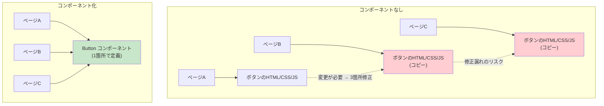
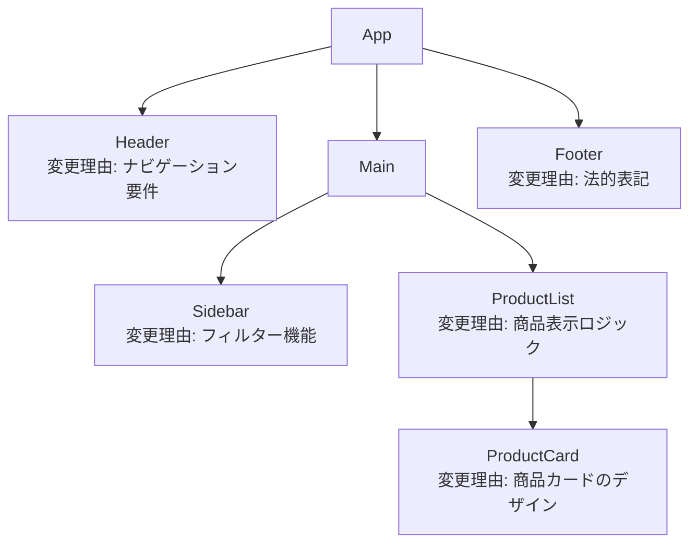
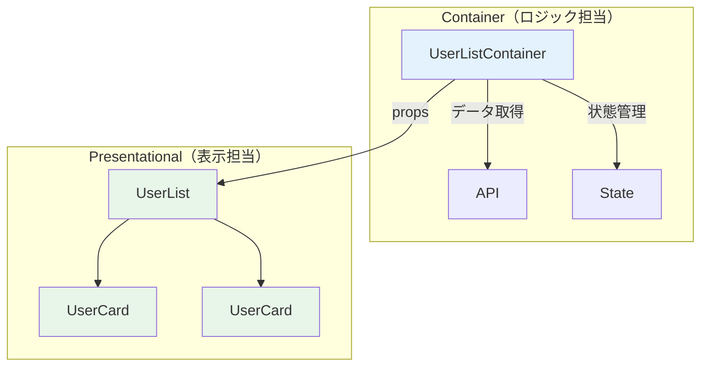
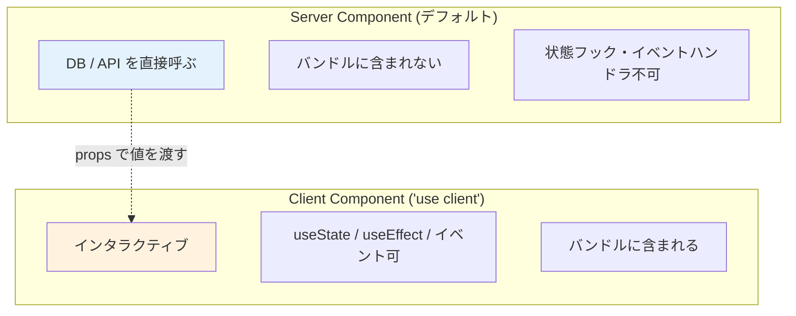
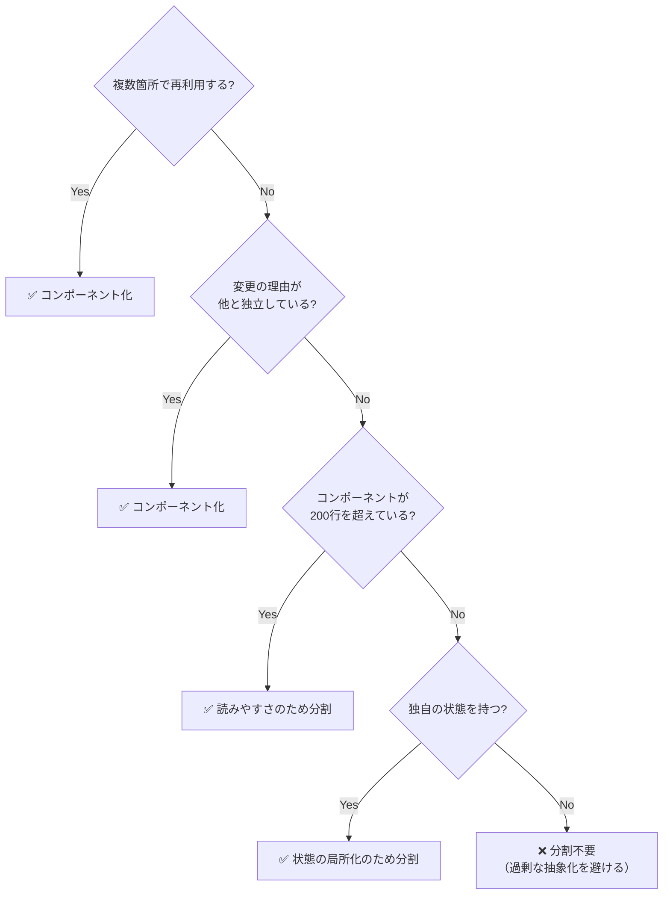
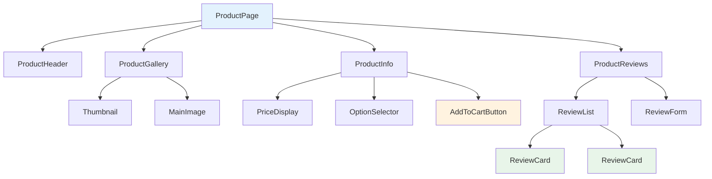

# コンポーネント設計

> **一言で言うと:** コンポーネントとはUIを再利用可能な独立した部品に分割する設計手法。「このUIの単位をどう分割するか」の判断基準は**単一責任原則** — 「変更の理由が1つ」になる粒度でコンポーネントを切ること。

## 3分で全体像

- **何を解決する技術か:** UIの再利用性・テスタビリティ・チーム分業を実現するため、UIを「変更の理由ごと」に独立した部品に分割する。コードの重複・変更影響範囲の不透明・グローバルスタイルによる事故・1万行 JSX ファイルの保守破綻を防ぐ
- **代表的な使用シーン:** SPA・SSR の全コンポーネント設計、デザインシステムの構築、ヘッドレス UI ライブラリの設計、大規模アプリケーションのディレクトリ構造設計、コンポーネントテスト戦略
- **これだけは覚える3つ:**
    1. **「変更の理由」で切る** — 単一責任原則の本質。「ユーザー情報の表示」と「投票ボタンのロジック」は変更理由が違うので別コンポーネントに。再利用性も大事だが、**変更影響の局所化**こそが分割の本質的な利益
    2. **早すぎる抽象化を避ける（Rule of Three）** — 1〜2回しか使われない時点で共通コンポーネント化すると、使われない設定項目だらけの汎用 API になる。**3回目に同じパターンが出たら**抽出するのが定石
    3. **Composition（合成）が継承より柔軟** — `children` や Render Props で内部構造を親に開放するパターンが、props で全制御するより圧倒的に拡張しやすい。`<Card title=... footer=...>` より `<Card><Card.Header>...</Card.Header></Card>` の方が長く使える
- **AIに任せやすいか:** **任せやすい** — JSX 構造・props 設計・カスタムHook 抽出は AI が高品質に書ける。ただし「**過剰分割**（10行のJSXを別ファイルに切り出す）」「**汎用 props 大量設定**」「**`children` を使わず props で全注入**」「**`<Spacer>` `<FlexRow>` のようなレイアウト用 div ラッパーコンポーネント乱立**」が AI の典型パターン。`/review-ai-code` で必ず検出する
- **詰まったらここを読む:** [[DOMと仮想DOM]] / [[状態管理]] / [[アクセシビリティ]]

## なぜ必要か

コンポーネントという概念がなければ、フロントエンドは以下の問題に直面する:

- **コードの重複** — ヘッダー、ボタン、カードなど同じUIパターンが複数ページに登場するたびに、HTML/CSS/JSを丸ごとコピーする。1箇所の変更を全ページに反映し忘れるとUIが不整合になる
- **変更の波及範囲が不明** — 1000行のHTMLファイルでボタンのスタイルを変えると、他のどこに影響するか分からない。CSSのグローバルスコープがこの問題を悪化させる
- **チーム開発の阻害** — ファイルが巨大な1枚岩だと、複数人が同時に作業してコンフリクトが頻発する。コンポーネントに分割すれば、各メンバーが独立した単位で作業できる
- **テスト不能** — UIロジックが分離されていないと、「このボタンをクリックしたらどうなるか」を個別にテストできない

## どの問題を解決するか

### 問題1: UIの再利用性

同じ見た目・振る舞いのUIを複数箇所で使うとき、コピー&ペーストではなくコンポーネントとして抽象化する:


```mermaid
graph TD
    subgraph "コンポーネントなし"
        P1["ページA"] --> B1["ボタンのHTML/CSS/JS"]
        P2["ページB"] --> B2["ボタンのHTML/CSS/JS<br/>(コピー)"]
        P3["ページC"] --> B3["ボタンのHTML/CSS/JS<br/>(コピー)"]
        B1 -.->|"変更が必要 → 3箇所修正"| B2
        B2 -.->|"修正漏れのリスク"| B3
        style B2 fill:#ffcdd2
        style B3 fill:#ffcdd2
    end

    subgraph "コンポーネント化"
        BC["Button コンポーネント<br/>(1箇所で定義)"]
        PA["ページA"] --> BC
        PB["ページB"] --> BC
        PC["ページC"] --> BC
        style BC fill:#c8e6c9
    end
```

### 問題2: 関心の分離と変更の局所化

コンポーネントは**変更の理由**によってUIを分割する。ヘッダー・サイドバー・本文の変更はそれぞれ独立しており、互いに影響しない:


```mermaid
graph TD
    APP["App"]
    APP --> HEADER["Header<br/>変更理由: ナビゲーション要件"]
    APP --> MAIN["Main"]
    APP --> FOOTER["Footer<br/>変更理由: 法的表記"]
    MAIN --> SIDEBAR["Sidebar<br/>変更理由: フィルター機能"]
    MAIN --> CONTENT["ProductList<br/>変更理由: 商品表示ロジック"]
    CONTENT --> CARD["ProductCard<br/>変更理由: 商品カードのデザイン"]
```

### 問題3: 状態の局所化

コンポーネントが[[状態管理|状態]]を内部に閉じ込めることで、アプリ全体の複雑さを管理可能な単位に分解する:

```jsx
// Accordionの開閉状態は、このコンポーネント内で完結する
function Accordion({ title, children }) {
  const [isOpen, setIsOpen] = useState(false);
  return (
    <div>
      <button onClick={() => setIsOpen(!isOpen)}>{title}</button>
      {isOpen && <div>{children}</div>}
    </div>
  );
}
// 他のコンポーネントは Accordion の開閉状態を知る必要がない
```

## コンポーネントの分類

### Presentational vs Container（表示 vs ロジック）


```mermaid
graph TD
    subgraph "Container（ロジック担当）"
        C["UserListContainer"]
        C -->|"データ取得"| API["API"]
        C -->|"状態管理"| S["State"]
    end

    subgraph "Presentational（表示担当）"
        C -->|"props"| P["UserList"]
        P --> P1["UserCard"]
        P --> P2["UserCard"]
    end

    style C fill:#e3f2fd
    style P fill:#e8f5e9
    style P1 fill:#e8f5e9
    style P2 fill:#e8f5e9
```

| 分類 | 責務 | 特徴 |
|------|------|------|
| **Presentational** | 見た目のレンダリング | propsを受け取って表示するだけ。状態を持たない（または表示用の一時的な状態のみ） |
| **Container** | データ取得・状態管理・ビジネスロジック | APIを呼び、stateを管理し、Presentationalにpropsを渡す |

**注意:** React Hooksの登場以降、この分類は厳密に守る必要はなくなった。カスタムHookでロジックを抽出する方が柔軟な場合が多い。ただし「表示とロジックの分離」という原則自体は依然として有効。

### Server Component vs Client Component（React 19 / Next.js 15+）

React 19 の Server Components（RSC）安定化により、現代のコンポーネント設計には「**サーバで完結する Server Component** か **クライアントでインタラクティブな Client Component** か」という新しい軸が加わった。


```mermaid
graph TD
    subgraph "Server Component (デフォルト)"
        S1["DB / API を直接呼ぶ"]
        S2["バンドルに含まれない"]
        S3["状態フック・イベントハンドラ不可"]
    end

    subgraph "Client Component ('use client')"
        C1["インタラクティブ"]
        C2["useState / useEffect / イベント可"]
        C3["バンドルに含まれる"]
    end

    S1 -.->|"props で値を渡す"| C1

    style S1 fill:#e3f2fd
    style C1 fill:#fff3e0
```

| 観点 | Server Component | Client Component |
|---|---|---|
| 実行場所 | サーバ（Node.js / Edge） | ブラウザ |
| バンドルへの含有 | 含まれない（バンドルサイズ削減） | 含まれる |
| 使えるもの | DB クエリ・ファイル I/O・秘密の API キー・`async/await` | `useState` / `useEffect` / イベントハンドラ / ブラウザ API |
| 使えないもの | フック全般・`onClick` 等のイベント | DB 直接アクセス・サーバ側ファイルシステム |
| デフォルト | App Router ではこちらが既定 | `'use client'` ディレクティブで明示 |

**判断軸（どちらにすべきか）:**

1. **データ取得のみで状態を持たない表示 → Server Component**（バンドルサイズが減り、初期表示が速い）
2. **イベントハンドラ・フック・ブラウザ API が必要 → Client Component**（`'use client'` を明示）
3. **境界はできるだけ「葉」に近づける** — `<Layout>` が Client だと配下すべてが Client になる。Client は「インタラクティブな小さな葉」に閉じ込め、上位は Server を維持する
4. **Server Component から Client Component に props で値を渡せる**（ただし関数や `Date` などはシリアライズ可能性に注意。`Date` は React 19 でサポートされたが、関数は不可で代わりに Server Actions を使う）

これは「Container vs Presentational」と直接対応する分類ではなく、**実行環境による分類**。同じコンポーネントツリー内で Server と Client が混在する。

### Controlled vs Uncontrolled

フォーム要素の設計で頻出するパターン:

```jsx
// Controlled — 親が状態を管理する
function ControlledInput({ value, onChange }) {
  return <input value={value} onChange={onChange} />;
}
// 親: <ControlledInput value={name} onChange={e => setName(e.target.value)} />

// Uncontrolled — 要素自身がDOMに状態を持つ
function UncontrolledInput({ defaultValue }) {
  const ref = useRef(null);
  return <input ref={ref} defaultValue={defaultValue} />;
}
// 親: ref.current.value で値を取得
```

| 観点 | Controlled | Uncontrolled |
|------|-----------|-------------|
| 状態の所在 | 親コンポーネント（React state） | DOM自身 |
| リアルタイムバリデーション | 可能 | 困難 |
| フォーム送信時の値取得 | stateから直接 | refでDOMを参照 |
| 適切な場面 | 多くの場合こちらが推奨 | 単純なフォーム、サードパーティ統合 |

## コンポーネント分割の判断基準

「どこでコンポーネントを切るか」の判断は、以下の基準で行う:


```mermaid
flowchart TD
    Q1{"複数箇所で再利用する?"} -->|Yes| A1["✅ コンポーネント化"]
    Q1 -->|No| Q2{"変更の理由が<br/>他と独立している?"}
    Q2 -->|Yes| A2["✅ コンポーネント化"]
    Q2 -->|No| Q3{"コンポーネントが<br/>200行を超えている?"}
    Q3 -->|Yes| A3["✅ 読みやすさのため分割"]
    Q3 -->|No| Q4{"独自の状態を持つ?"}
    Q4 -->|Yes| A4["✅ 状態の局所化のため分割"]
    Q4 -->|No| A5["❌ 分割不要<br/>（過剰な抽象化を避ける）"]
```

### 分割の実例 — ECサイト商品ページ


```mermaid
graph TD
    PP["ProductPage"] --> PH["ProductHeader"]
    PP --> PG["ProductGallery"]
    PP --> PI["ProductInfo"]
    PP --> PR["ProductReviews"]

    PG --> TH["Thumbnail"]
    PG --> MI["MainImage"]

    PI --> PRICE["PriceDisplay"]
    PI --> OPTS["OptionSelector"]
    PI --> CTA["AddToCartButton"]

    PR --> RL["ReviewList"]
    PR --> RF["ReviewForm"]
    RL --> RC["ReviewCard"]
    RL --> RC2["ReviewCard"]

    style PP fill:#e3f2fd
    style CTA fill:#fff3e0
    style RC fill:#e8f5e9
    style RC2 fill:#e8f5e9
```

| コンポーネント | 分割理由 |
|-------------|---------|
| ProductGallery | 画像表示ロジック（スワイプ、ズーム）が独自の状態と責務を持つ |
| PriceDisplay | 通貨フォーマット、割引計算など価格表示の関心事が独立 |
| AddToCartButton | カート追加のロジックとローディング状態を局所化 |
| ReviewCard | 同じ構造のカードが繰り返し表示される（再利用） |
| ReviewForm | フォームの入力状態とバリデーションを局所化 |

## 他の仕組みとどう関係するか

- **下位レイヤーとの関係:**
  - [[HTML-CSS-JS]] — コンポーネントはHTML/CSS/JSの3つを**1つの単位に再パッケージ化**したもの。セマンティックHTMLの選択はコンポーネント内部でも重要
- **同レイヤーとの関係:**
  - [[DOMと仮想DOM]] — コンポーネントは仮想DOMの再レンダリング単位。コンポーネントの粒度が再レンダリングの範囲に直結する
  - [[状態管理]] — 「この状態はどのコンポーネントが持つべきか」がコンポーネント設計と状態管理の交差点。状態のリフトアップはコンポーネント境界を変更する
  - [[アクセシビリティ]] — コンポーネントのアクセシビリティは設計時に組み込む。後付けは困難
- **上位レイヤーとの関係:**
  - [[Layer5-パフォーマンス/_index|パフォーマンス]]（Layer 5）— 不要な再レンダリングの回避はコンポーネント設計の問題。`React.memo`、コンポーネント分割によるレンダリング範囲の限定
  - [[Layer7-設計アーキテクチャ/_index|設計]]（Layer 7）— 単一責任原則（SRP）がコンポーネントの粒度を決める。SOLID原則のフロントエンドへの適用

## 誤解されやすいポイント

### 1. 「小さいほど良い」— 過剰な分割

1つの `<div>` をラップしただけのコンポーネントや、10行のJSXを別ファイルに切り出すのは過剰。コンポーネント数の増加はそれ自体がコスト（ファイル数増加、props の設計、型定義、importの管理）:

```jsx
// ❌ 過剰な分割
function UserNameText({ name }) {
  return <span className="user-name">{name}</span>;
}
function UserEmailText({ email }) {
  return <span className="user-email">{email}</span>;
}
function UserCard({ user }) {
  return (
    <div>
      <UserNameText name={user.name} />
      <UserEmailText email={user.email} />
    </div>
  );
}

// ✅ 適切な粒度 — 1つのコンポーネントで十分
function UserCard({ user }) {
  return (
    <div>
      <span className="user-name">{user.name}</span>
      <span className="user-email">{user.email}</span>
    </div>
  );
}
```

**分割が正当化される条件:** 再利用される、独立した状態を持つ、テストを個別に書きたい、変更の理由が異なる — のいずれかが当てはまること。

### 2. 「propsが多い = 設計が悪い」

propsが多いこと自体は問題ではない。問題なのは**関心の異なるpropsが混在している**とき:

```jsx
// ❌ 関心が混在 — ユーザー情報とレイアウト設定が同列
<UserCard
  name={user.name}
  email={user.email}
  avatar={user.avatar}
  cardWidth={300}
  showBorder={true}
  borderColor="#ccc"
  onEdit={handleEdit}
  onDelete={handleDelete}
/>

// ✅ 関心ごとにオブジェクトにまとめる
<UserCard
  user={user}
  actions={{ onEdit: handleEdit, onDelete: handleDelete }}
/>
// レイアウトの関心はCSSに戻す（propsではなくクラスやスタイルで制御）
```

### 3. 「共通コンポーネントは最初から作るべき」

コンポーネントの抽象化は、**最低2-3回同じパターンが現れてから**行うのが正しい。最初から汎用的なコンポーネントを作ろうとすると、使われない設定項目だらけの複雑なAPIになる:

```
1回目: そのまま書く
2回目: 類似のUIが出現 → まだコピーでOK
3回目: パターンが確定 → 共通コンポーネントに抽出
```

これは**Rule of Three**（3回ルール）と呼ばれる実践的な原則。

### 4. 「コンポーネントはファイル分割と同義」

コンポーネントを「別ファイルに切り出すこと」と混同しやすいが、同じファイル内に複数のコンポーネントを定義することは全く問題ない。特にそのコンポーネントが外部から使われない場合:

```jsx
// components/TodoList.tsx — 外部にエクスポートするのはTodoListだけ

// 内部コンポーネント — このファイル内でのみ使用
function TodoItem({ todo, onToggle }) {
  return (
    <li>
      <input type="checkbox" checked={todo.done} onChange={() => onToggle(todo.id)} />
      {todo.text}
    </li>
  );
}

// 外部にエクスポートするコンポーネント
export function TodoList({ todos, onToggle }) {
  return (
    <ul>
      {todos.map(todo => (
        <TodoItem key={todo.id} todo={todo} onToggle={onToggle} />
      ))}
    </ul>
  );
}
```

## 設計のベストプラクティス

### Composition（合成）パターン

コンポーネントの柔軟性を高める最も強力なパターンは**合成（Composition）**。propsでデータを渡すのではなく、`children` や**Render Props**でUIの構造自体を渡す:

```jsx
// ❌ propsで全てを制御 — 拡張性が低い
<Card
  title="ユーザー情報"
  subtitle="管理画面"
  icon="user"
  footer={<Button>編集</Button>}
  onClose={handleClose}
/>

// ✅ 合成 — 柔軟で拡張しやすい
<Card>
  <Card.Header>
    <Icon name="user" />
    <Card.Title>ユーザー情報</Card.Title>
    <Card.CloseButton onClick={handleClose} />
  </Card.Header>
  <Card.Body>
    {/* 任意のコンテンツ */}
  </Card.Body>
  <Card.Footer>
    <Button>編集</Button>
  </Card.Footer>
</Card>
```

合成パターンでは、Cardの「内部構造」を親が自由に構成できる。新しいレイアウトパターンが必要になっても、Card自体を修正する必要がない。

### カスタムHookによるロジック抽出

Hooksの登場により、UIロジックを**コンポーネントから分離**して再利用できるようになった:

```jsx
// カスタムHook — ロジックだけを抽出
function useToggle(initial = false) {
  const [value, setValue] = useState(initial);
  const toggle = useCallback(() => setValue(v => !v), []);
  const setTrue = useCallback(() => setValue(true), []);
  const setFalse = useCallback(() => setValue(false), []);
  return { value, toggle, setTrue, setFalse };
}

// どのコンポーネントでも再利用可能
function Accordion({ title, children }) {
  const { value: isOpen, toggle } = useToggle();
  return (
    <div>
      <button onClick={toggle}>{title} {isOpen ? '▼' : '▶'}</button>
      {isOpen && <div>{children}</div>}
    </div>
  );
}

function Modal({ trigger, children }) {
  const { value: isVisible, setTrue: open, setFalse: close } = useToggle();
  return (
    <>
      <button onClick={open}>{trigger}</button>
      {isVisible && (
        <div className="modal-overlay" onClick={close}>
          <div className="modal" onClick={e => e.stopPropagation()}>
            {children}
            <button onClick={close}>閉じる</button>
          </div>
        </div>
      )}
    </>
  );
}
```

### Props設計の原則

```typescript
// 1. 最小限のpropsを受け取る
// ❌ ユーザーオブジェクト全体を渡す（使うのはnameだけ）
function Greeting({ user }: { user: User }) {
  return <p>こんにちは、{user.name}さん</p>;
}

// ✅ 必要な値だけを受け取る
function Greeting({ name }: { name: string }) {
  return <p>こんにちは、{name}さん</p>;
}
// ただし、propsが5個以上になるなら、オブジェクトにまとめることを検討

// 2. booleanのpropsは肯定形にする
// ❌
<Button isNotDisabled={true} />
// ✅
<Button disabled={false} />

// 3. イベントハンドラは on + 動詞 の命名
// ✅
<Form onSubmit={handleSubmit} onCancel={handleCancel} />
```

## AIエージェントとの協働

> このトピックでAIコーディングエージェント（Claude Code, Copilot, Cursor 等）と協働するための観点。
> JSX 構造・props 設計・カスタムHook 抽出は AI に任せやすい一方、**「過剰分割」「props 大量設定オプション」「`children` を使わず props で全注入」「`<Spacer>` `<FlexRow>` のようなレイアウト用 div ラッパー乱立」「Server vs Client Component の境界誤判断」** が頻出。レビューも `/review-ai-code` で横断アンチパターン照合に任せられる。

### AIに任せられる部分 / 人間が判断すべき部分

| タスク種類 | 任せ方（実装/レビュー） | 人間の関与 |
|---|---|---|
| 既存パターンに沿ったコンポーネント実装 | AI 実装、`/review-ai-code` でレビュー | コンポーネント境界（どこで切るか）の判断は人間 |
| Composition / Render Props / カスタムHook の選択 | AI に複数案を出させる | チームの規約・読みやすさは人間判断 |
| props 設計（必須/任意・型・命名） | AI に任せる | 公開コンポーネントのAPI 安定性、後方互換性は人間判断 |
| ディレクトリ構成（`components/` `features/` `pages/`） | AI が雛形 | チーム規模・モノレポ構成・所有権の境界は人間判断 |
| Server Components / Client Components の境界 | AI に提案させる | データフロー・認証・ハイドレーションコストの判断は人間 |
| デザインシステムへの統合 | AI に任せる | デザイントークン・ブランドガイドラインとの整合は要件で決める |

### AI生成コードのレビュー観点（このトピック固有）

AI生成のコンポーネントコードを受け取ったとき、最低限ここを見る。

1. **過剰分割と早すぎる抽象化** — 10行の JSX を別ファイルに切り出していないか、1つの `<div>` をラップしただけのコンポーネント（`<UserNameText>`）が量産されていないか。Rule of Three に従い、**3回目に同じパターンが出たら**抽出する原則になっているか。逆に**1ファイル1000行の巨大コンポーネント**に肥大していないかも見る（変更理由の異なる責務が混在）
2. **props 設計の汚染と `children` の不使用** — `<Card title="..." subtitle="..." icon="..." footer={<Button>編集</Button>} closeButton={true} ...>` のように props で全制御していないか。代わりに `<Card><Card.Header>...</Card.Header><Card.Body>...</Card.Body></Card>` の合成パターンになっているか。propsが10個以上ならオブジェクトで集約するか合成パターンへの移行を検討
3. **レイアウト用 div ラッパーコンポーネントの乱立** — `<Spacer size={16} />` `<FlexRow gap={8}>` `<Center>` のような **CSSで解決すべきものをコンポーネントで解決していないか**。CSS の `gap` / `flexbox` / `grid` で書くべき。レイアウト用ユーティリティクラス（Tailwind 等）と組み合わせるとさらに不要

### 効くプロンプトの型

このトピックに関する実装をAIに依頼するとき、コンテキストとして渡すべき情報・制約・成功基準のテンプレ。

```
# 前提（プロジェクトの状況・既存のコード規約）
- フレームワーク: React 19 / Vue 3 / Svelte 5 など
- TypeScript: strict mode で記述
- ディレクトリ構成: components/ (汎用) / features/<feature>/ / pages/
- 既存デザインシステム: 〜 (Card, Button, Modal 等の規約)
- アクセシビリティ要件: WCAG 2.1 AA、Headless UI (Radix UI / React Aria) を使用

# やってほしいこと
- 「{要件}」を実現するコンポーネントを実装
- props 設計と内部構造（合成 / カスタムHook）を提示

# 守ってほしい制約（このトピック固有のもの）
- 単一責任原則: 1コンポーネント = 1つの変更理由
- 過剰分割を避ける (10行未満の JSX は親コンポーネントに残す)
- props は必要最小限。10個超なら合成パターンか children を検討
- レイアウト用の div ラッパーコンポーネントを作らない (CSS で解決)
- アクセシビリティ属性 (aria-*, role) はコンポーネントに内蔵
- React.memo / useMemo / useCallback は計測前提で必要なときだけ
- export するのは外部公開コンポーネントのみ、内部コンポーネントは同ファイルに

# 完了の判断基準
- props だけ見てコンポーネントの使い方が把握できる
- ストーリーブックや単体テストが書きやすい構造
- 同じファイル内のコンポーネント数は 5〜7 以内 (それ以上は分割を検討)
- 1コンポーネント 200行以内 (超えたら責務の混在を疑う)
```

### AI実装のアンチパターン

LLM生成コードで頻出する過剰設計・誤用パターン。レビュー時の照合表として使う。

| アンチパターン | なぜ問題か | レビュー観点 / 対策 |
|---|---|---|
| 1つの `<div>` のラッパーコンポーネント乱立 | ファイル数増加、import の管理コスト、可読性低下 | 再利用性・独立した状態・テスト需要のいずれかが正当化条件 |
| 全コンポーネントに大量の props 設定オプション | 使われない props が増え、API が理解困難に。型定義も肥大化 | 最初はシンプルに、必要になったら拡張 |
| `children` を使わず props で全 UI 注入 | 合成パターンの柔軟性を失う、props の型定義が肥大化 | `children` や Compound Component（`<Card.Header>`）を優先 |
| `<Spacer>` `<FlexRow>` `<Center>` のレイアウト用 div ラッパー | CSS で解決すべき問題をコンポーネントで解決、ファイル数とビルドコスト増加 | CSS の `gap` / Flexbox / Grid を使う |
| `React.memo` を全コンポーネントに適用 | props 浅い比較コストが加算、シンプルなコンポーネントでは逆効果 | DevTools Profiler で計測、ボトルネックのみ |
| 1コンポーネント = 1ファイルの厳格適用 | 密結合なコンポーネントが別ファイルに分散、追跡困難 | 外部公開するもののみ独立ファイル、内部コンポーネントは同ファイル |
| Container / Presentational の機械的分離 | Hooks 時代では過剰な間接層になりがち | カスタムHook でロジック抽出する方が現代的 |
| ユーザー情報全体を props で渡す（`<Greeting user={user} />` で `user.name` だけ使用） | 不要な再レンダリングと型結合の悪化 | 必要な値だけを props に（`<Greeting name={user.name} />`） |
| boolean props を否定形 (`isNotDisabled`) | 二重否定で読みにくい、デフォルト値の扱いが直感的でない | 肯定形（`disabled={false}`）に統一 |
| イベントハンドラ命名の乱れ | `clickHandler`、`handleClick`、`onClick` が混在 | `on + 動詞`（`onClick`、`onSubmit`）で統一 |
| Server Component に状態フックを使う | RSC は状態を持てない（React 19 / Next.js App Router） | `'use client'` で Client Component に分離 |
| 巨大コンポーネント (500行+) の責務混在 | 変更影響範囲が読めない、テスト困難 | 200〜300行を超えたら分割の検討、責務の混在を疑う |

→ レイヤー横断のアンチパターン索引: [[_anti-patterns/_index|AIアンチパターン索引]] / [[_anti-patterns/レイヤー別/Layer4-Frontend|Layer 4 Frontend アンチパターン集]]

## 具体例

### コンポーネント設計の実践 — 検索フォーム

```tsx
import { useState, useCallback } from 'react';

// カスタムHook — 検索ロジックの抽出
function useSearch<T>(items: T[], filterFn: (item: T, query: string) => boolean) {
  const [query, setQuery] = useState('');
  const filtered = items.filter(item => filterFn(item, query));
  return { query, setQuery, filtered };
}

// Presentational — 検索入力欄
interface SearchInputProps {
  value: string;
  onChange: (value: string) => void;
  placeholder?: string;
}

function SearchInput({ value, onChange, placeholder = '検索...' }: SearchInputProps) {
  return (
    <input
      type="search"
      value={value}
      onChange={e => onChange(e.target.value)}
      placeholder={placeholder}
      aria-label={placeholder}
    />
  );
}

// Presentational — リスト表示
interface ListProps<T> {
  items: T[];
  renderItem: (item: T) => React.ReactNode;
  emptyMessage?: string;
}

function List<T extends { id: number | string }>({
  items,
  renderItem,
  emptyMessage = '結果がありません',
}: ListProps<T>) {
  if (items.length === 0) return <p>{emptyMessage}</p>;
  return <ul>{items.map(item => <li key={item.id}>{renderItem(item)}</li>)}</ul>;
}

// 組み合わせ — 検索可能なユーザー一覧
interface User {
  id: number;
  name: string;
  email: string;
}

function UserDirectory({ users }: { users: User[] }) {
  const { query, setQuery, filtered } = useSearch(
    users,
    (user, q) => user.name.toLowerCase().includes(q.toLowerCase())
  );

  return (
    <div>
      <SearchInput value={query} onChange={setQuery} placeholder="ユーザー検索..." />
      <p>{filtered.length} 件</p>
      <List
        items={filtered}
        renderItem={user => (
          <div>
            <strong>{user.name}</strong>
            <span>{user.email}</span>
          </div>
        )}
      />
    </div>
  );
}
```

この設計のポイント:

- **SearchInput** は検索ロジックを知らない（Controlled Component）
- **List** はデータの型を知らない（ジェネリクス + renderItem）
- **useSearch** はUIを知らない（ロジックのみ）
- **UserDirectory** がこれらを組み合わせる

### ディレクトリ構成の例

```
src/
├── components/           # 共有コンポーネント
│   ├── Button.tsx
│   ├── List.tsx
│   └── SearchInput.tsx
├── features/             # 機能単位
│   ├── users/
│   │   ├── UserDirectory.tsx
│   │   ├── UserCard.tsx
│   │   └── useSearch.ts
│   └── cart/
│       ├── CartPage.tsx
│       ├── CartItem.tsx
│       └── useCart.ts
└── pages/                # ルーティング対応のページ
    ├── HomePage.tsx
    └── UsersPage.tsx
```

| ディレクトリ | 役割 | 分割基準 |
|------------|------|---------|
| `components/` | アプリ全体で再利用される汎用コンポーネント | 特定の機能に依存しない |
| `features/` | 機能ごとにコンポーネント・Hook・型をまとめる | 変更の理由が同じものを近くに置く |
| `pages/` | ルーティングのエントリーポイント | URLパスに1:1対応 |

## 参考リソース

- [React公式 — Thinking in React](https://react.dev/learn/thinking-in-react) — コンポーネント分割の思考プロセスを公式解説
- [Patterns.dev — Design Patterns](https://www.patterns.dev/) — Reactのデザインパターン集（Composition, HOC, Hooks等）
- [Bulletproof React](https://github.com/alan2207/bulletproof-react) — 実務的なReactアプリケーション構成のリファレンス
- 書籍:『りあクト！TypeScriptで始めるつらくないReact開発』— コンポーネント設計と型の実践

## 理解度セルフチェック

> 答えられなければ本文に戻る。答えはこのファイル内に必ずある。

1. **「変更の理由で切る」とはどういうことか、30秒で説明せよ。** 単一責任原則が再利用性とは独立した利益を生む理由を述べること。
2. **「最初からReduxを入れるべき」「最初から共通コンポーネントを作るべき」がなぜ誤りか?** Rule of Three の原則に触れて答えよ。
3. **AI生成コードレビュー設問:** AI が以下のチームでの「ユーザープロフィールカード」のコンポーネント設計を生成した。本文の観点で **問題点を最低3つ** 指摘せよ。

```tsx
// UserNameText.tsx
export function UserNameText({ name }: { name: string }) {
  return <span className="user-name">{name}</span>;
}

// UserEmailText.tsx
export function UserEmailText({ email }: { email: string }) {
  return <span className="user-email">{email}</span>;
}

// Spacer.tsx
export function Spacer({ size = 8 }: { size?: number }) {
  return <div style={{ height: size, width: size }} />;
}

// UserCard.tsx
import { UserNameText } from './UserNameText';
import { UserEmailText } from './UserEmailText';
import { Spacer } from './Spacer';

export function UserCard({
  user,
  cardWidth,
  showBorder,
  borderColor,
  showAvatar,
  avatarSize,
  isAdmin,
  isNotEditable,
  onEditClicked,
  onDeleteClicked,
  onMessageClicked,
  onFollowClicked,
  onUnfollowClicked,
  showFooter,
  footerLayout,
  variant,
}: {
  user: { name: string; email: string; avatar: string; role: string };
  cardWidth: number;
  showBorder: boolean;
  borderColor: string;
  showAvatar: boolean;
  avatarSize: number;
  isAdmin: boolean;
  isNotEditable: boolean;
  onEditClicked: () => void;
  onDeleteClicked: () => void;
  onMessageClicked: () => void;
  onFollowClicked: () => void;
  onUnfollowClicked: () => void;
  showFooter: boolean;
  footerLayout: 'left' | 'right' | 'center';
  variant: 'compact' | 'expanded';
}) {
  return React.memo(
    <div style={{ width: cardWidth, border: showBorder ? `1px solid ${borderColor}` : 'none' }}>
      {showAvatar && }
      <Spacer size={8} />
      <UserNameText name={user.name} />
      <Spacer size={4} />
      <UserEmailText email={user.email} />
      <Spacer size={8} />
      {showFooter && (
        <div style={{ textAlign: footerLayout }}>
          {!isNotEditable && <button onClick={onEditClicked}>編集</button>}
          {isAdmin && <button onClick={onDeleteClicked}>削除</button>}
          <button onClick={onMessageClicked}>メッセージ</button>
          <button onClick={onFollowClicked}>フォロー</button>
          <button onClick={onUnfollowClicked}>アンフォロー</button>
        </div>
      )}
    </div>
  );
}
```

> [!note]- 解答の指針
>
> > [!info] 用語ミニ辞典
> > - **単一責任原則 (Single Responsibility Principle / SRP):** 「クラス（コンポーネント）が変更される理由は1つだけであるべき」という SOLID 原則の S。再利用性のためというより**変更影響の局所化**のための原則
> > - **Rule of Three:** 重複が3回現れたら抽象化する原則。1〜2回ではまだパターンが見えていないため、共通化が早すぎると使われない設定項目だらけの汎用コンポーネントになる
> > - **Composition (合成):** コンポーネントの内部構造を `children` や Render Props で親に開放するパターン。継承よりも柔軟で拡張可能
> > - **Compound Component:** `<Card>` `<Card.Header>` `<Card.Body>` のように、関連するコンポーネントをドット記法で名前空間化するパターン。React の Tabs や Menu の標準的な API
> > - **Render Props:** 「何をレンダリングするか」を関数 prop として渡すパターン。`<DataLoader>{(data) => <Table data={data} />}</DataLoader>` のように使う
> > - **カスタムHook:** `useXxx` という命名で `useState` `useEffect` などをラップした関数。コンポーネントから UI ロジックだけを抽出して再利用する
> > - **Presentational vs Container:** 旧来のパターンで、表示担当（Presentational）とロジック担当（Container）を分離する設計。React Hooks 登場後はカスタムHook で同じ関心の分離が達成できるため、機械的な分離は廃れた
> > - **Headless UI:** Radix UI / React Aria / Headless UI（Tailwind製）など、見た目を持たずアクセシビリティ・キーボード操作・ARIA 属性のみを提供するライブラリ。スタイリングは利用側が自由に
> > - **Server Components / Client Components:** React 19 / Next.js App Router で安定化した区分。Server Components はサーバーで完結し状態を持たず、Client Components は `'use client'` ディレクティブで宣言してインタラクティブな処理を担う
> > - **イミュータブル更新:** state を変更する際、元のオブジェクトを変えず新しい参照を作る更新パターン。React の参照比較による再レンダリング検出に必要
>
> 1. 単一責任原則の本質は「**変更が起きたときの影響範囲を最小化する**」こと。たとえばユーザー情報カードに「投票機能」「コメント表示」「ナビゲーション」を全部詰め込むと、投票UIの変更でカード全体を触ることになり、コメント表示のリグレッションリスクが生まれる。逆に「変更の理由」（ビジネス要件・デザイン要件・機能要件のどこから変更が来るか）で切ると、変更が局所化され、テストもピンポイントに書ける。**「再利用される」は分割の正当化条件の1つだが、再利用されなくても変更影響の局所化のために分割する価値がある**。これがコンポーネント分割の本質的な利益。逆に再利用されないからといって全部1ファイルに詰めると、変更影響の追跡が破綻する
> 2. 早すぎる抽象化は「**まだ見えていないパターンを推測で実装する**」ことになるため、(a) **使われない設定項目だらけの汎用 API になる** — 1回目で使った機能だけで「これは将来こうも使われるかも」と推測して props を増やすと、結局2回目・3回目で違う使われ方をして、初期の汎用化が無駄になる、(b) **抽象化のコストが利益を上回る** — 抽出したコンポーネントの設計・テスト・ドキュメント化のコストが、コピペで済ませた場合のコストを超える、(c) **間違った抽象化は「インライン化された重複」より100倍悪い** — Sandi Metz の有名な言葉。間違った抽象を解除するのは、最初から重複を抽出するより難しい。**Rule of Three** は「3回目に同じパターンが出てきたら、もうパターンが定着している証拠なので抽出する」という経験則。Redux のような重い状態管理ライブラリも同じで、**Props Drilling が3〜4階層を超えてから**導入を検討する。「最初から導入」はコストばかりが先行する
> 3. AI生成コードの問題点（最低限以下を指摘できれば本文を理解している）:
>     - **過剰分割: `<UserNameText>` `<UserEmailText>`** — `<span>` をラップしただけ。再利用性・独立した状態・テスト要件のいずれもなく、ファイル数増加とimport管理コストだけが増える。`<UserCard>` 内に直接書くべき
>     - **`<Spacer>` レイアウト用 div ラッパー** — CSS の `gap` / `margin` で解決すべき問題をコンポーネントで解決。`<div style="display:flex; flex-direction:column; gap: 8px">` で十分
>     - **props が17個もあり関心が混在** — ユーザー情報・レイアウト設定・各種ボタンの handler が同列で並んでいる。`user`、`actions: {onEdit, onDelete, ...}`、`layout: {variant, footerLayout}` のように関心ごとにオブジェクト集約、または合成パターンに移行
>     - **`children` を使わず props で全 UI 注入** — フッター内のボタンを props で全制御している。`<Card><Card.Footer><Button>編集</Button>...</Card.Footer></Card>` の合成パターンならカードの利用側が自由にフッターを構成できる
>     - **`isNotEditable` の二重否定 boolean** — 「編集できないかどうか」が読みにくい。肯定形 `editable: boolean` に
>     - **イベントハンドラ命名 `onEditClicked`** — `on + 動詞` の規約から外れている。`onEdit` / `onClick` のように動詞のみが定石
>     - **`React.memo(<div>...</div>)` の誤用** — `React.memo` は**コンポーネント定義をラップする HOC** であり、JSX 要素を直接渡しても動作しない。`export const UserCard = React.memo(function UserCard(...) {...})` が正しい使い方
>     - **`<UserCard>` を `React.memo` で予防的にメモ化** — 計測してから適用すべき。シンプルなプロフィールカードでメモ化するメリットは小さいことが多い
>     - **インラインスタイル `style={{ width: cardWidth, border: ... }}`** — 毎レンダリングで新オブジェクトが生成されメモ化が無効化、CSS 設計が崩壊。CSS Modules や Tailwind 等のクラスベースに
>     - **`` に `alt` 属性なし** — アクセシビリティ違反（[[アクセシビリティ]] 観点）
>     - **`<button>` に `type` 指定なし** — フォーム内なら誤って `type="submit"` 扱いになりうる。明示的に `type="button"` を指定する
>     - **`showFooter` `showBorder` `showAvatar` の boolean フラグ多数** — 「表示する/しない」のフラグが乱立しているのは合成パターンへの移行サイン。`<Card><Card.Avatar />（不要なら書かない）</Card>` のように要素の有無で表現

## 学習メモ

- コンポーネント設計は「正解」がない設計判断の連続。重要なのは一貫したルールをチーム内で共有すること
- 「最初から完璧なコンポーネント設計を目指さない」のがコツ。まず動くものを書き、重複やパターンが見えてきたらリファクタリングで抽出する
- React 19 / Next.js 15 以降で Server Components（RSC）が安定化し、「サーバーで完結するコンポーネント」と「クライアントでインタラクティブなコンポーネント」の境界が新しい設計軸になった
