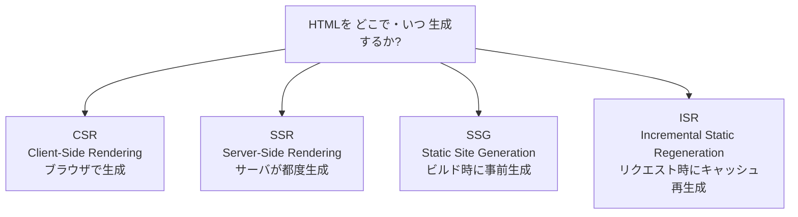

# レンダリング戦略

> **一言で言うと:** HTML を **どこで・いつ生成するか** の選択 — ブラウザで生成 (CSR) / サーバで都度生成 (SSR) / ビルド時に事前生成 (SSG) / リクエスト時にキャッシュ再生成 (ISR)。**初回表示速度・SEO・サーバ負荷・データ鮮度** のトレードオフを決める設計判断。

## 3分で全体像

- **何を解決する技術か:** 「**動的データ × 速い初回表示 × SEO × サーバコスト**」を同時に満たす単一解は存在しない。レンダリング戦略は **どれを優先しどれを諦めるか** をページ単位で選ぶ仕組み
- **代表的な使用シーン:** ブログ・LP は SSG、ニュースサイトは ISR、認証後のダッシュボードは CSR、商品詳細ページは SSR + CDN キャッシュなど。**1つのアプリ内で複数戦略を混在** させるのが現代の標準
- **これだけは覚える3つ:**
    1. **CSR / SSR / SSG / ISR の選択は「データ鮮度 vs 表示速度 vs サーバ負荷」のトレードオフ** — 動的なら SSR 寄り、静的なら SSG 寄り、頻度の高いリクエストには ISR でキャッシュを差し挟む
    2. **Hydration エラーは「サーバとクライアントで生成 HTML が違う」ことで起きる** — `Date.now()` `Math.random()` `window.X` をレンダリングに使うと SSR HTML と CSR HTML が一致せず警告 / 表示崩れ。**サーバとクライアントで決定論的に同じ出力**になるよう書く
    3. **認証付きページは CDN キャッシュとの相性が悪い** — Cookie ベース認証で SSR すると、ユーザごとに違う HTML がキャッシュされうる。`Cache-Control: private` か CDN のキャッシュキーを設計する
- **AIに任せやすいか:** **一部任せられる** — Next.js / Nuxt / Remix / SvelteKit のフレームワーク API でレンダリング方式を切り替える実装は AI が高品質に書ける。ただし **「このページを SSR / SSG / CSR / ISR のどれにすべきか」** はビジネス要件 (SEO 必要性 / データ鮮度 / 認証境界 / トラフィック量) に依存し人間判断が要る。AI 生成コードはAIコードレビュー観点で「Hydration ミスマッチ」「認証データの SSG での誤キャッシュ」「不要な CSR 化による FCP 悪化」を必ず検出する
- **詰まったらここを読む:** [[DOMと仮想DOM]] / [[CoreWebVitals]] / [[CDN]] / [[キャッシュ戦略]]

## なぜ必要か

「全部 CSR (Client-Side Rendering) で書けばいい」とはならない理由:

- **SEO** — クローラの一部 (特に SNS のプレビュー生成や旧式ボット) は JavaScript を実行しない。CSR だけだと空の HTML を読まれる
- **初回表示速度 (LCP / FCP)** — CSR は「HTML 取得 → JS バンドル取得 → JS 実行 → API 取得 → 描画」の長い直列。低速回線・低スペック端末で致命的に遅い
- **OGP / メタタグ** — Twitter / Facebook の OGP は HTML の `<meta>` を見る。CSR で動的にメタタグを差し込んでも、クローラ時点では空
- **サーバコスト** — 全ページを毎リクエストで SSR すると、ピーク時に CPU が枯渇する

逆に「全部 SSR」も「全部 SSG」も成り立たない:

- 全 SSR — トラフィックが増えるとサーバが死ぬ
- 全 SSG — 動的データ (在庫・価格・ユーザ情報) が反映されない

レンダリング戦略は **ページ単位で適切な妥協点を選ぶ** 設計判断。

## どの問題を解決するか

### 4 つの基本戦略



### 比較表

| 戦略 | HTML生成タイミング | データ鮮度 | 初回表示 | サーバ負荷 | SEO | 主な使い所 |
|---|---|---|---|---|---|---|
| **CSR** | ブラウザ実行時 | API次第（リアルタイム可） | 遅い (空 HTML → JS → API → 描画) | 低 | 弱い (JS不要なクローラに不利) | 認証後ダッシュボード、SaaS 管理画面 |
| **SSR** | リクエストごとサーバで | リアルタイム | 速い (完成 HTML 返却) | 高 (毎リクエストで処理) | 強い | ニュース・EC 商品詳細、認証あり動的ページ |
| **SSG** | ビルド時に1回 | ビルド時固定 | 最速 (静的ファイル) | 最低 (CDN 配信のみ) | 強い | ブログ・LP・ドキュメント |
| **ISR** | 初回リクエスト時 + 期限後再生成 | 設定したTTL（数秒〜数日） | 速い (キャッシュ HIT 時) | 中 (期限切れ時のみ再生成) | 強い | ニュース一覧・カテゴリページ・人気商品 |

### Streaming SSR (発展)

最新フレームワーク（Next.js 13+ / Remix / SvelteKit）は **Streaming SSR** を提供する。HTML を **チャンク単位で逐次送信** し、データ取得が遅い部分は後から「Suspense 境界」で埋める。React Server Components と組み合わせると、CSR / SSR の境界自体が **コンポーネント単位で混在** する。

## 他の仕組みとどう関係するか

### 下位レイヤー
- [[HTTP-HTTPS]] (Layer 2) — `Cache-Control` ヘッダで CDN / ブラウザキャッシュを制御。SSR/ISR は HTTP キャッシュとの組み合わせが性能の鍵
- [[認証と認可]] (Layer 4 BE) — 認証付きページは Cookie / Authorization ヘッダの扱いが SSR とぶつかる。**ユーザ情報を含む HTML をキャッシュしない**

### 同レイヤー
- [[DOMと仮想DOM]] — Hydration の仕組み。サーバ生成 HTML を仮想 DOM ツリーで再活性化する
- [[HTML-CSS-JS]] — SSG/SSR で生成される実体は HTML。セマンティクスが正しいことが SEO の前提
- [[コンポーネント設計]] — Server Component / Client Component の境界はコンポーネント設計と密接
- [[状態管理]] — クライアント状態は CSR でしか持てない。SSR で初期値を埋め込んでクライアント側で引き継ぐ「ハイドレーション」設計

### 上位レイヤー
- [[CoreWebVitals]] (Layer 5) — LCP / INP / CLS は戦略選択で大きく変わる。SSG/SSR は LCP に有利、CSR は INP に有利な場合あり
- [[CDN]] (Layer 5) — SSG / ISR は CDN との相性が良い。SSR + CDN は認証境界の設計次第
- [[キャッシュ戦略]] (Layer 3) — ISR は実質「サーバ側でのキャッシュ戦略」、TTL / 再検証ポリシーが効く

## 誤解されやすいポイント

1. **「SSR にすれば SEO が解決する」** — クローラに HTML を返すだけが SEO ではない。**セマンティック HTML / メタタグ / 構造化データ / パフォーマンス** すべてが評価対象。SSR は前提条件であって万能薬ではない
2. **「CSR は遅い」とは限らない** — 認証後の SaaS など「初回はそこそこでよく、操作開始後の応答が重要」な場面では CSR が最適。LCP より INP / TTI を優先する判断
3. **「Hydration はクライアント側で生成 HTML を再生する」のではない** — Hydration は **既存の DOM ツリーにイベントリスナを取り付けて動的にする** 過程。HTML を再生成するわけではない。だから **サーバ HTML と React の最初のレンダリング結果が一致** していなければ警告が出る
4. **「SSG だから動的データが扱えない」は誤解** — SSG でもクライアントで `useEffect` 内で fetch すれば動的データを取得できる (= ハイブリッド)。SSG は「初期 HTML が静的」であり、ページ全体が静的な訳ではない
5. **「ISR の再検証は『古い HTML を返さない』」と思い込む** — Next.js の `revalidate` は **stale-while-revalidate** 戦略。期限切れ後の最初のリクエストには **古い HTML を返しつつバックグラウンドで再生成** する。リアルタイム性が必要なら SSR を選ぶ

## 設計のベストプラクティス

- **ページごとに戦略を決める** — 「全部 SSR」「全部 SSG」と決めつけず、ページの性質 (SEO 必要性 / データ鮮度 / 認証 / トラフィック) で個別判断
- **Hydration ミスマッチを避ける書き方** — `Date.now()` `Math.random()` `window.X` をレンダリング中に使わない、もしくは `useEffect` 内で初期化
- **認証境界とキャッシュキーを設計する** — 認証付きページは `Cache-Control: private` を返すか、CDN のキャッシュキーにユーザ識別子を含める
- **メタタグ / OGP は確実に SSR / SSG で出す** — クライアント側で動的に変えてもクローラ時点には間に合わない
- **計測して判断する** — レンダリング戦略の良し悪しは **LCP / INP / TTFB / サーバコスト** の実測値で決まる。「なんとなく SSR」ではなく Web Vitals で評価
- **段階的に複雑化する** — まず CSR で書く → SEO / 速度の問題が出たら SSG / SSR を導入 → トラフィックが増えたら ISR / Edge Functions。**最初から全戦略を混在させない**

## AIエージェントとの協働

### 任せ方

| タスク | 実装 | レビュー | 人間の関与 |
|---|---|---|---|
| Next.js / Nuxt / Remix のレンダリング API 呼び出し (`getStaticProps` / `loader` 等) | AI に任せる | AIコードレビュー観点 | なし |
| Server Component / Client Component の境界実装 | AI に任せる | AIコードレビュー観点 | 境界**判断**は人間 |
| Hydration ミスマッチの修正 | AI が候補を出す | AI レビュー | なし (機械的) |
| ページ単位の **戦略選択** (このページは SSR/SSG/CSR/ISR どれか) | — | — | **人間判断専用**。SEO要件 / データ鮮度 / 認証境界 / トラフィック量で決める |
| ISR の `revalidate` 値の決定 | — | — | **人間判断専用**。許容できる古さとサーバ負荷のバランス |
| 認証付きページのキャッシュ設計 | AI が候補を出す | AI レビュー | **キャッシュキー設計** は人間 |

### AI生成コードのレビュー観点

1. **Hydration ミスマッチを生む書き方になっていないか** — `new Date()` `Math.random()` `typeof window !== "undefined"` で分岐などが SSR コンポーネント内に混入していないか
2. **認証データが SSG / ISR でキャッシュされる構造になっていないか** — `getStaticProps` 相当でユーザ固有データを取得していないか、SSR 出力が CDN キャッシュ可能になっていないか
3. **Server Component / Client Component の境界が適切か** — `useState` / `useEffect` を含むコンポーネントが Server Component として書かれていないか、Client Component が無闇に大きくなっていないか

### 効くプロンプトの型

```
前提:
- フレームワーク: Next.js 14 App Router / Remix / Nuxt 3 / SvelteKit
- ページの性質:
  - SEO 必要か: ___ (検索流入を期待するか)
  - データ鮮度: リアルタイム / 数秒許容 / 数分許容 / ビルド時で OK
  - 認証境界: 認証なし / 認証あり (個人情報を含む)
  - 想定トラフィック: ___ RPS、ピーク ___ RPS
- 既存ページ群との整合: <SSR/SSG/CSR/ISR の混在状況>

やってほしいこと: <ページの実装、または戦略選択の根拠付き提案>

制約:
- Hydration ミスマッチを起こさない (Date / Math.random / window 参照を本体に書かない)
- 認証付きデータが CDN にキャッシュされない (Cache-Control: private か キャッシュキー設計)
- メタタグ / OGP は確実に初期 HTML で出す
- LCP に影響する画像は  ではなく <Image> 等の最適化コンポーネント
- Web Vitals (LCP / INP / CLS) を <Web Vitals 報告 API> で計測

判断基準:
- LCP p75 ≤ 2.5s、INP p75 ≤ 200ms、CLS p75 ≤ 0.1
- TTFB ≤ ___ ms (戦略次第で目標値は変わる)
- 「なぜこの戦略を選んだか」を1段落で説明できる
```

### AI実装のアンチパターン

| アンチパターン | なぜ問題か | レビュー観点・対策 |
|---|---|---|
| 全ページを SSR にして CDN を使わない | サーバ負荷が線形にトラフィックと共に増える | SSG / ISR にできるページは静的化する |
| 認証付きページを SSG (`getStaticProps`) で書く | ビルド時のユーザの情報が全員に配信される | 認証付きは SSR か CSR、キャッシュは `private` |
| `Date.now()` を JSX 内に直接書く | サーバとクライアントで時刻が違い Hydration エラー | `useEffect` 内で初期化する、または `suppressHydrationWarning` を限定的に |
| 全コンポーネントを Client Component にする (Next.js App Router) | バンドルサイズ肥大、SSR の利点を失う | デフォルト Server Component、必要な所だけ `"use client"` |
| ISR の `revalidate` を 1 秒に設定 | 実質 SSR と同じで再生成負荷が高い | 許容できる古さ (数十秒〜数時間) で設定 |
| `useEffect` で fetch して LCP に必要なコンテンツを描画 | サーバ HTML には無く、JS 実行後に表示 → LCP 悪化 | `getServerSideProps` / `loader` でサーバ側取得 |
| OGP / `<meta>` をクライアント側で動的設定 | クローラは初期 HTML しか見ない | `<head>` は SSR / SSG で確定 |
| `dangerouslySetInnerHTML` でユーザ生成 HTML を SSR | XSS の温床 | サニタイズ (DOMPurify) を経由 |

→ [[_anti-patterns/_index|AIアンチパターン索引]]

## 具体例

Next.js 14 (App Router) で4戦略を切り替える例。フレームワークが違っても **「データ取得関数の置き場所と返却タイミング」** で戦略が決まる構造は共通。

```typescript
// SSG (デフォルト): ビルド時に1回
// app/blog/[slug]/page.tsx
export async function generateStaticParams() {
  const posts = await db.posts.findMany({ where: { published: true } });
  return posts.map((p) => ({ slug: p.slug }));
}

export default async function BlogPost({ params }: { params: { slug: string } }) {
  const post = await db.posts.findUnique({ where: { slug: params.slug } });
  return <article>{post.body}</article>;
}

// ISR: 60 秒ごとに再生成
// app/news/page.tsx
export const revalidate = 60;
export default async function News() {
  const articles = await fetch("https://api.example/news").then((r) => r.json());
  return <ul>{articles.map((a) => <li key={a.id}>{a.title}</li>)}</ul>;
}

// SSR: リクエストごとに実行
// app/dashboard/page.tsx
export const dynamic = "force-dynamic";
export default async function Dashboard() {
  const user = await getCurrentUser();  // Cookie 認証
  return <p>Hello, {user.name}</p>;
}

// CSR: クライアント側でデータ取得
// app/admin/page.tsx
"use client";
import { useEffect, useState } from "react";

export default function Admin() {
  const [data, setData] = useState(null);
  useEffect(() => {
    fetch("/api/admin").then((r) => r.json()).then(setData);
  }, []);
  return <pre>{JSON.stringify(data, null, 2)}</pre>;
}
```

## 参考リソース

- [Web.dev: Rendering on the Web](https://web.dev/articles/rendering-on-the-web) — Google による戦略比較
- [Next.js Documentation: Rendering](https://nextjs.org/docs/app/building-your-application/rendering) — App Router の最新モデル
- [Patterns.dev: Rendering Patterns](https://www.patterns.dev/posts/rendering-patterns) — フレームワーク中立な解説
- [React Server Components RFC](https://github.com/reactjs/rfcs/blob/main/text/0188-server-components.md) — RSC の設計思想

## 理解度セルフチェック

> [!info] 用語ミニ辞典
> - **Hydration:** サーバ生成された静的 HTML に、クライアント側で JavaScript のイベントリスナや状態を「注入」して動的にする過程。React・Vue などの SSR/SSG で必須
> - **TTFB (Time to First Byte):** ブラウザがリクエストを送ってから最初の 1 バイトが返るまでの時間。SSR では「サーバが処理して HTML を生成し終わるまで」、SSG では「CDN がファイルを返すまで」
> - **stale-while-revalidate:** 「期限切れの古いキャッシュを返しつつ、裏で新しいバージョンを取得する」キャッシュ戦略。HTTP `Cache-Control` ヘッダの directive、ISR の動作モデル
> - **Server Component / Client Component:** React 18 / Next.js 13+ の概念。Server Component はサーバでのみ実行 (バンドルに含まれない)、Client Component はサーバ + クライアント両方で実行 (`"use client"` を宣言)

**Q1.** 個人ブログ (記事更新は週 1〜2 回) で、SEO を重視し、サーバコストを最小化したい。SSR / SSG / CSR / ISR のどれを選ぶか？ なぜ？

> [!note]- 解答の指針
> **答え: SSG (Static Site Generation)**。
>
> **なぜそうなるか:**
>
> - **データ鮮度:** 週 1〜2 回の更新ならビルド時固定で十分。記事が変わったらビルド & デプロイすればよい
> - **SEO:** 静的 HTML をクローラに直接返せるため最強。動的 JS の評価を待たせない
> - **サーバコスト:** ビルド済み HTML を CDN から配信するだけなので、トラフィックがどれだけ増えてもサーバ側コストは増えない (CDN 転送量のみ)
> - **初回表示速度:** TTFB が CDN 配信レベルで最速 → LCP が最良
>
> **ISR を選ばない理由:** ISR は「データが頻繁に更新される」「再生成のコストがある」前提で意味がある。週 1〜2 回更新なら都度ビルドで困らないため、ISR の複雑さを導入する価値がない。**「シンプルな選択肢で済むなら複雑にしない」** は設計の基本原則。
>
> **CSR を選ばない理由:** SEO に弱く、初回表示で空 HTML → JS → API の直列が発生し、低スペック端末で遅い。

**Q2.** 次のうち、Hydration ミスマッチを引き起こす可能性が高いコードはどれか？ 複数選択可。
- (a) `<p>{Date.now()}</p>` をコンポーネント本体で
- (b) `useState` で初期値を `new Date().getTime()` に設定
- (c) `useEffect(() => { setTime(Date.now()); }, [])` でクライアントマウント時に設定
- (d) `<p>{props.serverTime}</p>` (サーバから props で渡す)
- (e) `typeof window !== "undefined" ? "client" : "server"` を JSX 内で評価

> [!note]- 解答の指針
> **答え: (a)、(b)、(e) が Hydration ミスマッチを起こす**。
>
> - **(a) ❌** `Date.now()` はサーバとクライアントで実行時刻が違う → 出力 HTML が一致しない
> - **(b) ❌** `useState` の初期値はサーバとクライアント両方で評価される。サーバ評価時の時刻 と クライアント評価時の時刻が違うため不一致
> - **(c) ✅** `useEffect` はクライアントでしか実行されないため、サーバ HTML には初期値、クライアントは `useEffect` 後に更新 → React は「マウント後の更新」として認識し警告は出ない
> - **(d) ✅** props はサーバから渡された値なので、サーバとクライアントで同じ。一致する
> - **(e) ❌** サーバでは `"server"`、クライアントでは `"client"` を返す → 完全に違う出力
>
> **なぜそうなるか:** Hydration ミスマッチは **「サーバとクライアントで生成されるべき HTML が一致しないとき」** に起きる。React は「サーバから受け取った HTML が、クライアントの最初のレンダリング結果と完全一致する」前提で動く。ズレると React が DOM を捨ててクライアント側で再生成 → 表示崩れ + パフォーマンス悪化。**「サーバとクライアントで決定論的に同じ出力を返す」コードを書く** が基本原則。

**Q3 (AI生成コードレビュー).** AI に「ニュース一覧ページを Next.js App Router で作って」と頼んだら以下のコードが返ってきた。何が問題か？ 修正方針を示せ。

```tsx
"use client";
import { useEffect, useState } from "react";

export default function NewsList() {
  const [articles, setArticles] = useState([]);

  useEffect(() => {
    fetch("/api/news").then((r) => r.json()).then(setArticles);
  }, []);

  return (
    <>
      <head>
        <title>最新ニュース - {new Date().toLocaleDateString()}</title>
        <meta property="og:title" content="最新ニュース" />
      </head>
      <ul>
        {articles.map((a: any) => (
          <li key={a.id}>{a.title}</li>
        ))}
      </ul>
    </>
  );
}
```

> [!note]- 解答の指針
> **3つの問題:**
>
> 1. **`"use client"` で全体を Client Component 化 → SEO とパフォーマンスを失う** — ニュース一覧は **検索流入を期待するページ**。CSR にすると初期 HTML が空になりクローラに評価されにくい。**修正:** `"use client"` を外し、サーバコンポーネントにする
> 2. **`<head>` をクライアント側で動的設定 → クローラ / OGP に届かない** — Twitter / Facebook の OGP クローラは初期 HTML の `<meta>` を見る。クライアント側で書き換えても遅い。**修正:** Next.js App Router では `export const metadata = {...}` か `generateMetadata()` でサーバ側で metadata を出力する
> 3. **`new Date().toLocaleDateString()` がコンポーネント本体に → Hydration ミスマッチ** — ただし今回は Client Component なのでサーバ側で実行されないが、SEO 改善のため SSR 化したらここがミスマッチを起こす。**修正:** 日付をサーバ側で計算して props で渡すか、`useEffect` 内で設定
>
> **修正方針 (戦略選択):** ニュース一覧の特性 (頻繁な更新 + SEO 必要 + トラフィックが多い) を考えると **ISR が最適**。`export const revalidate = 60` (60 秒ごと再生成) を追加し、`fetch` を直接 async コンポーネント内で呼ぶ:
>
> ```tsx
> export const revalidate = 60;
> export const metadata = { title: "最新ニュース", openGraph: { title: "最新ニュース" } };
>
> export default async function NewsList() {
>   const articles = await fetch("https://api.example/news").then((r) => r.json());
>   return <ul>{articles.map((a: any) => <li key={a.id}>{a.title}</li>)}</ul>;
> }
> ```
>
> **なぜそうなるか:** AI は **「`useEffect` で fetch する CSR パターン」** を学習データから出力しがち。React の入門記事に多く、フレームワーク非依存だから。レビューでは必ず **「このページは SSR/SSG/CSR/ISR のどれが妥当か」** をビジネス要件 (SEO / データ鮮度 / トラフィック) から逆算して問う。

## 学習メモ

<!-- 個人的な気づき・疑問・TODO を記録 -->
